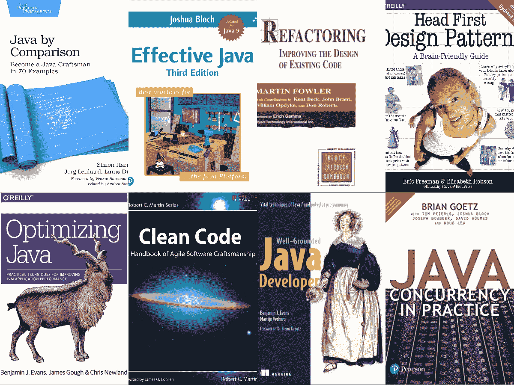
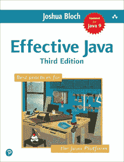
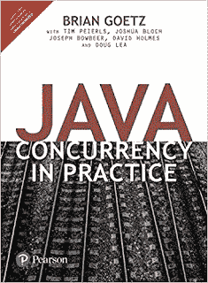
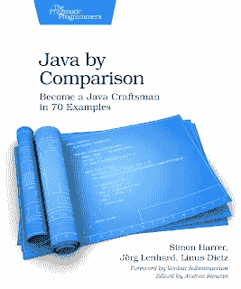

# 面向有经验的开发人员的 10 本高级 Java 书籍和课程

> 原文：<https://medium.com/javarevisited/10-advanced-java-books-and-courses-for-experienced-developers-b90cc1086975?source=collection_archive---------0----------------------->

## 学习多线程和并发性、JVM 内部机制、集合、NIO、面向对象设计、函数式编程和设计模式的高级 Java 书籍和课程。

你好，Java 程序员，如果你正在寻找高级书籍来提高你的 Java 编程技能，那么你来对地方了。

前面我已经分享过 [**10 门高级 Java 课程**](/javarevisited/11-advanced-core-java-online-courses-to-join-in-2021-46011661257a) **。**在这篇文章中，我将为中级和有经验的程序员分享 10 本高级 Java 书籍。

一旦你学习了 Java，读完了一些最著名的 Java 入门书籍，并且有了几年的经验，你就会渴望从一个中级 Java 开发人员过渡到一个专业的 Java 程序员，也就是众所周知的 Java 大师。

这种转变并不顺利，我见过许多有 2 到 6 年经验的 Java 开发人员停滞不前，完全不了解高级主题，如 [JVM 内部机制](https://javarevisited.blogspot.com/2019/04/top-5-courses-to-learn-jvm-internals.html)、[并发性](https://javarevisited.blogspot.com/2016/06/5-books-to-learn-concurrent-programming-multithreading-java.html)、[垃圾收集](/javarevisited/7-best-courses-to-learn-jvm-garbage-collection-and-performance-tuning-for-experienced-java-331705180686?source=---------8------------------)和[性能调优](https://javarevisited.blogspot.com/2018/07/top-5-java-performance-tuning-books-for.html)。

作为一名专业的 Java 程序员，您必须擅长多线程和并发，了解 JVM 内部和垃圾收集算法的详细信息，深刻理解 [Java 收集 API](/javarevisited/7-best-java-collections-and-stream-api-courses-for-beginners-in-2020-3ad18d52c38) 和并发实用程序、Java NIO 和 NIO 2 以及面向对象的设计模式。

为了增加[单元测试](https://javarevisited.blogspot.com/2019/04/top-5-junit-and-unit-testing-courses-java-programmers.html)的知识，构建工具、最佳实践、发布管理和高级调试技能也是绝对必须的。您还可以将 lambda 表达式、流和其他 Java 8 特性添加到该列表中。

在本文中，我将分享 **10 本书，帮助你成为一名专业的 Java 程序员。我强烈推荐这些书籍给中级 Java 程序员和那些有 2 到 5 年经验、了解 Java、做过几个 Java 项目并渴望成为专业 Java 程序员的人。**

# 面向高级开发人员的 10 本高级 Java 书籍和课程

这是我向任何想更好地学习 Java 和编程的高级 Java 开发人员或程序员推荐的 10 本书。这些书涵盖了从 JVM 内部、性能调优、设计模式、单元测试、最佳实践、[多线程和并发性](/javarevisited/8-best-multithreading-and-concurrency-courses-for-experienced-java-developers-8acfd3b25094)等主题，让你成为一个全面的 Java 开发人员。

## 1.[优化 Java](https://www.amazon.com/Optimizing-Java-Techniques-Application-Performance/dp/1492025798?tag=javamysqlanta-20)

区分 Java 程序员和高级 Java 程序员的一个属性是对 JVM、垃圾收集和性能调优经验的良好理解，这是目前市场上最好的书。有很多书主要关注垃圾收集和性能，但这本书描述了 JVM 内部的更多方面，如线程、JVM 内存表示、字节码、JIT 编译器等。此外，这本书包含了许多有用工具的概述，这些工具可以帮助您在日常工作中使用 JVM。

如果你需要一些帮助，想看东西，在现实中，我也建议你去看看 Matt Greecroft 和虚拟程序员开设的 [**Java 应用性能和内存管理**](https://click.linksynergy.com/deeplink?id=JVFxdTr9V80&mid=39197&murl=https%3A%2F%2Fwww.udemy.com%2Fcourse%2Fjava-application-performance-and-memory-management%2F) 课程。

学习如何分析堆转储、提高 Java 性能、理解 GC 日志以及解决内存泄漏，这是一门很棒的课程。我强烈推荐。

 [## Java 应用程序性能和内存管理

### 作为一名职业程序员，主要在银行业工作了 20 多年，Matt 现在为 Virtual Pair…

udemy.com](https://click.linksynergy.com/deeplink?id=JVFxdTr9V80&mid=39197&murl=https%3A%2F%2Fwww.udemy.com%2Fcourse%2Fjava-application-performance-and-memory-management%2F) 

## 2.[有效 Java](http://www.amazon.com/dp/0321356683/?tag=javamysqlanta-20)

直到你阅读了这篇杰作，你从 Java 开发人员到高级 Java 开发人员的转变才算完成。

这也是高级 Java 开发人员最值得推荐的一本书，因为约书亚·布洛赫(Joshua Bloch)的内容、清晰度、消息、风格和权威，他用 Java 编写了 Collection framework 的 API，java.lang 包中的几个类。

我强烈建议您至少阅读一次有效的 Java 书籍，以更好地理解 Java API，最重要的是学会如何正确使用 Java API。

## 3.[实践中的 Java 并发](http://www.amazon.com/dp/0321349601/?tag=javamysqlanta-20)

有经验的 Java 开发人员的另一个特征是对并发和多线程有很好的了解。这是一个需要掌握的复杂话题，这就是为什么你需要一本关于这个话题的准确而权威的书。Java 程序员很幸运，他们从 Brian Goetz 那里得到了这本书。唯一让我担心的是这些概念本身并不容易，很多时候程序员发现阅读这样的书真的很难。

如果你也面临同样的问题，我建议你加入 Java 冠军、我最喜欢的导师之一 Heinz Kabutz 的[**Java Concurrency in Practice Bundle**](https://learning.javaspecialists.eu/courses/concurrency-in-practice-bundle?affcode=92815_johrd7r8)课程。

## 4. [Java 对比:成为 Java 工匠 70 例](https://www.amazon.com/Java-Comparison-Become-Craftsman-Examples/dp/1680502875?tag=javamysqlanta-20)

这是另一本适合有经验的 Java 程序员的好书，他们真的想磨练自己的 Java 技能，成为 Java 专家。

这本 Java 书不是关于语法和语义，而是关于如何以更好的方式做现实世界中的事情。如果你想成为每个公司都想雇佣的专业 Java 开发人员，那么这本书就是为你准备的。这本书通过简单易懂的例子，将有缺陷的代码与改进的例子进行比较，为提升你的编码风格提供了实用的建议。在这个过程中，您将学到一些方便的技巧和诀窍，以及一个有经验的 Java 程序员需要知道的常见错误。

## 5.[头先设计图案](https://www.amazon.com/Head-First-Design-Patterns-Brain-Friendly/dp/0596007124/?tag=javamysqlanta-20)

除了 GC、多线程和集合 API，高级 Java 开发人员的另一个方面是对设计模式以及如何在 Java 程序中使用它们有很好的了解。

我读过几本关于设计模式的书，包括空前经典的 GOF 设计模式，但是没有人比 Head First 更了解我。

可能是风格、图表、愚蠢的图像，或者其他什么，但是我真的把我的设计模式知识归功于这本书。我还记得当我第一次读这本书的几页解释为什么组成比继承更好时，我确信这是我必须读的书。

已经很多年了，但是我仍然保留着 Head First 设计模式的副本，在我觉得无聊或者需要修改设计模式技巧的时候继续看。

你也可以将本书与 Udemy 上 Dmitri Nestruk 的**[**Java 设计模式**](https://click.linksynergy.com/deeplink?id=JVFxdTr9V80&mid=39197&murl=https%3A%2F%2Fwww.udemy.com%2Fcourse%2Fdesign-patterns-java%2F) 课程结合起来，了解经典 Java 设计模式的现代实现。**

** [## 面向工程师、设计师和架构师的 Java 设计模式

### 本课程从实用的角度全面概述了 Java 中的设计模式。

udemy.com](https://click.linksynergy.com/deeplink?id=JVFxdTr9V80&mid=39197&murl=https%3A%2F%2Fwww.udemy.com%2Fcourse%2Fdesign-patterns-java%2F)** 

## **6.[基础扎实的 Java 开发人员](http://www.amazon.com/dp/1617290068/?tag=javamysqlanta-20)**

**在当今世界，对于一个高级 Java 开发人员来说，仅仅了解 Java 是不够的。其他 JVM 语言的知识，如 [Scala](/javarevisited/10-best-scala-and-functional-programming-online-courses-for-beginners-b6461b27bf) 、 [Groovy](/javarevisited/6-best-resources-to-learn-groovy-and-grails-for-java-developers-18c04e88fa8a) 和 Closure 很有帮助。**

**其实如果你想开始从 Java 程序员向高级 Java 程序员的过渡，这是你应该看的书。这是现代 Java 开发人员的必备书籍。它解释了 Java 中的[新变化，包括 JDK 7 中的资源尝试、NIO2.0 和并发性变化，但最重要的是，它解释了为什么向 JVM 添加新特性如此昂贵。](http://javarevisited.blogspot.sg/2014/04/10-jdk-7-features-to-revisit-before-you.html)**

****

## **7.[清洁码](http://www.amazon.com/Clean-Code-Handbook-Software-Craftsmanship/dp/0132350882?tag=javamysqlanta-20)**

**这真是一本好书，也是我最喜欢的一本书。这不仅适用于 Java 开发人员，也适用于任何想要学习软件开发和编程的程序员。鲍伯·马丁叔叔不需要介绍，他是面向对象编程世界中最受尊敬的名字之一，考虑到 Java 是我们拥有的最好的 OOP 语言，再加上 Java 本身就有干净的代码示例。**

****

**这是*代码全集*的近亲，更适合我们的 C++朋友。**

**顺便说一句，如果你需要一个在线课程来配合这本书，那么我也推荐你参加 Ranga Karnam 的 [**用 Java 编写干净的代码:学习简单的设计，重构& TDD**](https://click.linksynergy.com/deeplink?id=CuIbQrBnhiw&mid=39197&murl=https%3A%2F%2Fwww.udemy.com%2Fcourse%2Fjava-clean-code-with-refactoring-and-tdd%2F) 课程，他是我最喜欢的 Udemy Java 主题讲师之一。**

** [## 用 Java 清理代码:学习简单的设计、重构和 TDD

### Ranga 是经认证的谷歌云助理云工程师、AWS 认证解决方案架构师助理、AWS 认证…

udemy.com](https://click.linksynergy.com/deeplink?id=CuIbQrBnhiw&mid=39197&murl=https%3A%2F%2Fwww.udemy.com%2Fcourse%2Fjava-clean-code-with-refactoring-and-tdd%2F)** 

## **8.[重构](http://www.amazon.com/Refactoring-Improving-Design-Existing-Code/dp/0201485672?tag=javamysqlanta-20)**

**代码是程序员的签名。所有这些学习都是为了写出经得起时间考验的代码。高级 Java 开发人员应该编写高质量的代码，而重构是将低质量代码转化为高质量代码的艺术。许多高级 Java 程序员的一个额外职责是通过不断地进行代码评审和重构初级程序员的代码来检查项目的代码质量。**

****

**这本书将教你如何在不破坏代码的情况下重构代码，这是我在书中学到的最重要的一课。在此过程中，您还将了解单元测试以及如何编写有效的测试来覆盖代码的关键功能。**

**如果你需要一个在线培训课程来配合这本书进行主动学习，我强烈推荐你参加 Udemy 的 Wlodek Karkowski 的 [**重构金字塔课程。**](https://click.linksynergy.com/deeplink?id=CuIbQrBnhiw&mid=39197&murl=https%3A%2F%2Fwww.udemy.com%2Fcourse%2Fpyramid-of-refactoring-java-interpreter-factories%2F)**

** [## 用简单的步骤解释重构金字塔(Java)

### 我叫沃德克·克拉科夫斯基。我是一名独立的技术培训师，团队教师，也是一名开发人员-以提高我的…

udemy.com](https://click.linksynergy.com/deeplink?id=CuIbQrBnhiw&mid=39197&murl=https%3A%2F%2Fwww.udemy.com%2Fcourse%2Fpyramid-of-refactoring-java-interpreter-factories%2F)** 

## **9.[试驾](http://www.amazon.com/Test-Driven-Acceptance-Java-Developers/dp/1932394850?tag=javamysqlanta-20)**

**除非你掌握了单元测试和测试驱动开发的艺术，否则你不可能成为一名高级 Java 开发人员。每个人都喜欢做尽职调查、写测试并努力提高代码质量的程序员。曾经有一段时间单元测试被认为是附加的，但现在不是了。如果你是一名开发人员，你应该写出高质量的单元测试。Java 世界幸运地拥有如此多用于单元测试的有用的开源框架，如 [JUnit](/javarevisited/top-10-courses-to-learn-eclipse-junit-and-mockito-for-java-developers-4de1e8d62b96) 、 [Mockito](/javarevisited/5-courses-to-learn-junit-and-mockito-in-2019-best-of-lot-f217d8b93688) ，**

****

**虽然学习 JUnit 和 Mockito 很容易，但是为与数据库、API 和其他外部服务交互的真实应用程序编写测试并不容易。这本书将教你一些真正好的技术和实践，在你的项目中实现 TDD 并创建更好的代码。**

**我向每一位 Java 开发人员强烈推荐这本书，无论是初学者还是有经验的，如果你需要一门课程来配合这本书，我推荐你参加 Udemy 的 [**用 Junit & Mockito 学习 Java 单元测试的 30 步**](https://click.linksynergy.com/deeplink?id=CuIbQrBnhiw&mid=39197&murl=https%3A%2F%2Fwww.udemy.com%2Fcourse%2Fmockito-tutorial-with-junit-examples%2F) 课程。**

** [## 学习 Mockito 和 JUnit 教程(单元测试)

### Ranga 是经认证的谷歌云助理云工程师、AWS 认证解决方案架构师助理、AWS 认证…

udemy.com](https://click.linksynergy.com/deeplink?id=CuIbQrBnhiw&mid=39197&murl=https%3A%2F%2Fwww.udemy.com%2Fcourse%2Fmockito-tutorial-with-junit-examples%2F)** 

## **10.[Java 中的函数式编程](http://www.amazon.com/Functional-Programming-Java-Harnessing-Expressions/dp/1937785467?tag=javamysqlanta-20)**

**一个有经验的程序员的另一个素质是多种编程范例的知识，比如过程化的、面向对象的和函数式的。由于 Java 8 为 Java 世界带来了函数式编程，所以对于高级 Java 开发人员来说，掌握函数式编程的艺术变得势在必行。

Java 8 已经是既定的标准，我相信在未来几年，它将很快成为每个 Java 开发者的必修课。**

**如果你需要一个在线课程来获得一些实践经验，那么你也可以在 Udemy 上查看 Ranga Karnam 的 [**用 Lambda 学习 Java 函数式编程和 Stream**](https://click.linksynergy.com/deeplink?id=JVFxdTr9V80&mid=39197&murl=https%3A%2F%2Fwww.udemy.com%2Fcourse%2Ffunctional-programming-with-java%2F) 课程。**

****

**以上是针对中级和有经验程序员的**最佳高级 Java 书籍列表。这个列表不适合初学者，因为他们不会教你如何用 Java 编写 hello world，也不会向你解释如何编译和运行你的 Java 程序。****

**这些书是为那些已经从事 Java 工作并渴望深入学习 Java 的 Java 程序员准备的。为了深入学习一门编程语言，一本书是不够的，你可能需要学习。

其他 **Java 编程文章**你可能喜欢
[Java 开发人员路线图](https://javarevisited.blogspot.com/2019/10/the-java-developer-roadmap.html)
[Java 和 Web 开发人员应该学习的 10 件事](http://javarevisited.blogspot.sg/2017/12/10-things-java-programmers-should-learn.html#axzz53ENLS1RB)
[面向有经验开发人员的 10 门高级核心 Java 课程](https://javarevisited.blogspot.com/2020/04/top-10-advanced-core-java-courses-for-experienced-developers.html)
[每个 Java 程序员都应该阅读的 10 本书](http://www.java67.com/2018/02/10-books-java-developers-should-read-in.html)
[Java 开发人员应该知道的 10 种测试工具](http://javarevisited.blogspot.sg/2018/01/10-unit-testing-and-integration-tools-for-java-programmers.html)
[Java 开发人员在日常工作中使用的 10 种工具](http://javarevisited.blogspot.sg/2017/03/10-tools-used-by-java-programming-Developers.html#axzz55lrMRnNC) 开发者
[为有经验的开发者开设的 10 门高级 Spring Boot 课程](/javarevisited/10-advanced-spring-boot-courses-for-experienced-java-developers-5e57606816bd)
[深入学习 Java 并发的前 5 门课程](https://javarevisited.blogspot.com/2018/06/top-5-java-multithreading-and-concurrency-courses-experienced-programmers.html)
[5 种框架 Java 开发者应该学习的](http://javarevisited.blogspot.sg/2018/04/top-5-java-frameworks-to-learn-in-2018_27.html)
[10 门免费课程学习 Jenkins、Maven 和 Docker](/javarevisited/top-10-free-courses-to-learn-maven-jenkins-and-docker-for-java-developers-51fa7a1e66f6)

感谢阅读本文至今。 如果你觉得这些经典的高级 Java 书籍和在线课程有用，请在脸书和 LinkedIn 上与你的朋友和同事分享。如果您有任何问题、建议或反馈，请留言。**

****P. S.** —如果你正在寻找一些深入学习 Java 的课程，请查看这份针对中级初学者和中级开发者的 [**十大 Java 课程**](/javarevisited/top-5-java-online-courses-for-beginners-best-of-lot-1e1e240a758) 列表。它包含从零开始学习 Java 的课程，以及掌握有用的主题，如集合、并发和 JVM 内部。**

** [## 面向资深程序员的十大高级核心 Java 课程

### 大家好，我的许多读者一直向我询问高级 Java 课程，以改进 Java 集合等主题…

javarevisited.blogspot.com](https://javarevisited.blogspot.com/2020/04/top-10-advanced-core-java-courses-for-experienced-developers.html#axzz6dTMJOE7W)**