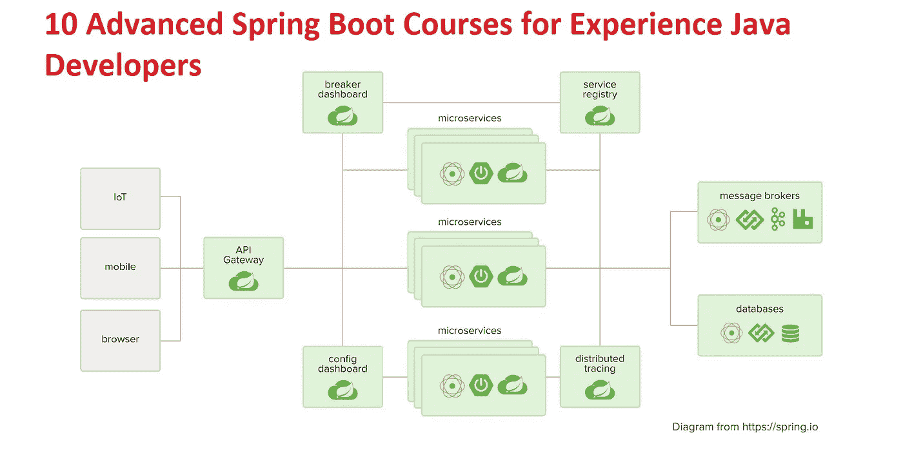
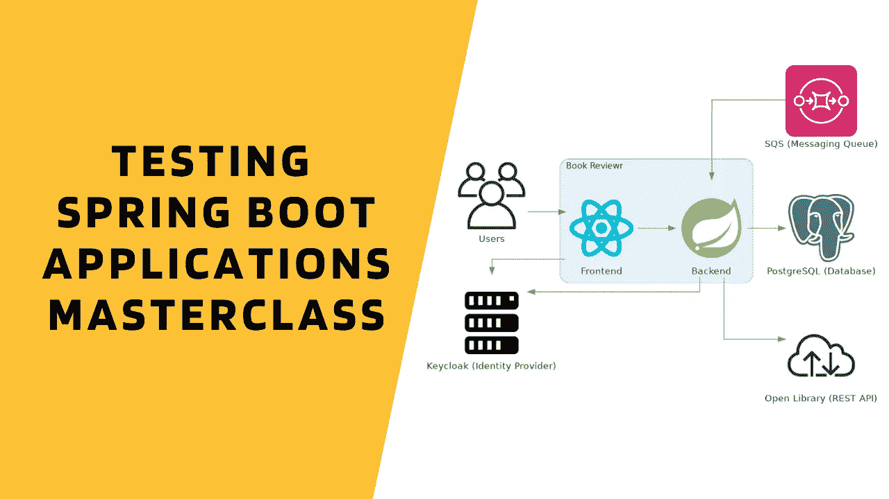

# 2023 年为有经验的 Java 开发人员提供的 10 门高级 Spring Boot 课程

> 原文：<https://medium.com/javarevisited/10-advanced-spring-boot-courses-for-experienced-java-developers-5e57606816bd?source=collection_archive---------0----------------------->

## 高级 Spring Boot 课程，面向经验丰富的 Java 开发人员，学习 Spring Boot 测试、云和容器部署、使用 Angular 和 React 开发全栈 Spring Boot 应用。

大家好，spring Boot 是 2023 年要学习的顶级 Java 框架之一，但作为一名高级 Java 开发人员，仅仅学习 Spring BootT3[**是不够的，你还需要学习所有制造生态系统的技术，如容器、could、测试 Spring Boot 应用程序、高级 Spring Boot 特性如**](/javarevisited/top-10-courses-to-learn-spring-boot-in-2020-best-of-lot-6ffce88a1b6e) **[Actuator](https://www.java67.com/2021/02/spring-boot-actuator-interview-questions-answers-java.html) 、使用 Spring Boot 创建微服务、在云平台上部署 Spring Boot 应用程序如 [AWS](https://javarevisited.blogspot.com/2019/05/top-5-courses-to-crack-aws-solutions-architect-associate-certification-exam-SAA-C01.html#axzz5rHwAwycj) 、 [Azure](https://javarevisited.blogspot.com/2019/07/top-5-courses-to-crack-azure-architecture-technologies-certification-az-300-exam.html) 和 [GCP](https://javarevisited.blogspot.com/2019/07/top-5-google-cloud-platform-gcp-courses-certifications-online.html) 。**

许多 Java 开发人员一直在问我关于为 Spring Boot 和 Java 开发人员量身定制的课程，以学习诸如容器、 [Docker](/javarevisited/top-10-free-courses-to-learn-maven-jenkins-and-docker-for-java-developers-51fa7a1e66f6) 、 [Kubernetes](https://dev.to/javinpaul/top-10-courses-to-learn-docker-and-kubernetes-for-programmers-4lg0) 以及诸如 AWS、Azure 和 GCP 等云平台的技术。

因此，今天，我决定为有经验的 Java 开发人员分享一些最先进的 Spring Boot 课程，这些课程来自 [Udemy](/javarevisited/my-favorite-udemy-online-courses-for-programmers-and-software-engineers-f9d941dd0035) 、 [Pluralsight](/javarevisited/7000-free-pluralsight-courses-to-build-in-demand-tech-skills-without-leaving-your-house-40edb50a8cf2) 、 [Educative](/javarevisited/top-10-free-interactive-programming-courses-from-educative-for-beginners-to-learn-in-2021-713cbf96d4eb) 以及其他流行的在线平台。

如果您想将您的 Spring Boot 技能提升到一个新的水平，并成为一名真正理解 Spring Boot 端到端应用的全栈开发人员，您可以查看这些课程。

# 面向高级 Java 开发人员的 10 大高级 Spring Boot 课程

在不浪费你更多时间的情况下，这里是我的一些高级 Spring Boot 课程列表，供有经验的 Java 开发人员学习 Spring Boot 测试，在云上部署 Spring Boot 应用程序，使用 Angular 和 React 开发全栈 Spring Boot 应用程序，在 Docker 等容器上部署 Spring Boot 应用程序，以及深入学习 Spring Boot 执行器等工具。

## [1。Spring Boot 微服务与春云初学者到大师](https://click.linksynergy.com/deeplink?id=JVFxdTr9V80&mid=39197&murl=https%3A%2F%2Fwww.udemy.com%2Fcourse%2Fspring-boot-microservices-with-spring-cloud-beginner-to-guru%2F)

这是一门极好的课程，旨在掌握使用 Spring Boot 新协议的微服务架构，以及使用 Spring Cloud 和 Docker 的基于云的部署。由 Spring guru 和最佳 Udemy 导师之一的约翰·汤姆森创建，这个课程将教你用 Spring Boot 创建微服务所需的一切。

在您了解如何构建 Spring Boot 微服务之后，您将了解如何使用 Spring Cloud 来部署您的微服务。

**以下是参加课程的链接:**

[Spring Boot 微服务用春云初学者到宗师](https://click.linksynergy.com/deeplink?id=JVFxdTr9V80&mid=39197&murl=https%3A%2F%2Fwww.udemy.com%2Fcourse%2Fspring-boot-microservices-with-spring-cloud-beginner-to-guru%2F)

 [## Spring Boot 微服务与 Spring Cloud 初学者到大师

### 了解如何开发 Spring Boot 微服务并使用 Spring Cloud 进行部署！传统上，大型企业级…

udemy.com](https://click.linksynergy.com/deeplink?id=JVFxdTr9V80&mid=39197&murl=https%3A%2F%2Fwww.udemy.com%2Fcourse%2Fspring-boot-microservices-with-spring-cloud-beginner-to-guru%2F) 

## 2.[全叠加:角度和 Spring Boot](https://click.linksynergy.com/deeplink?id=JVFxdTr9V80&mid=39197&murl=https%3A%2F%2Fwww.udemy.com%2Fcourse%2Ffull-stack-angular-spring-boot-tutorial%2F)

这是一个学习如何用 Angular 和 Spring Boot 构建全栈应用的好课程。在本课程中，您将开发一个具有 Angular 前端和 Spring Boot 后端的全栈应用。这门课程最大的优点是它的实时编码格式。

您将在视频中与讲师一起输入每一行代码，他将解释每一行代码来帮助您学习！听起来很棒，不是吗？

以下是参加课程的链接:

[*全栈:角形和 Spring Boot*](https://click.linksynergy.com/deeplink?id=JVFxdTr9V80&mid=39197&murl=https%3A%2F%2Fwww.udemy.com%2Fcourse%2Ffull-stack-angular-spring-boot-tutorial%2F)

 [## 全堆栈:角度和 Spring Boot

### Angular 和 Spring Boot 是开发全栈应用的两种最热门的技术。知道如何…

udemy.com](https://click.linksynergy.com/deeplink?id=JVFxdTr9V80&mid=39197&murl=https%3A%2F%2Fwww.udemy.com%2Fcourse%2Ffull-stack-angular-spring-boot-tutorial%2F) 

## 3.[弹簧框架:Spring Boot 致动器](https://pluralsight.pxf.io/c/1193463/424552/7490?u=https%3A%2F%2Fwww.pluralsight.com%2Fcourses%2Fspring-framework-spring-boot-actuator)

您刚刚完成了一款 Spring Boot 应用的开发。下一步:生产！但它值得生产吗？有了 Spring Boot 执行器，就是这样！在这个高级 Spring 启动课程中，您将学习如何使用 Spring Boot 执行器轻松管理您在生产中运行的 Spring Boot 应用程序。非常感谢[达斯汀·舒尔茨](https://medium.com/u/236964b07e34?source=post_page-----5e57606816bd--------------------------------)创造了这个令人敬畏的课程。

以下是参加课程的链接:

[弹簧框架:Spring Boot 执行器](https://pluralsight.pxf.io/c/1193463/424552/7490?u=https%3A%2F%2Fwww.pluralsight.com%2Fcourses%2Fspring-framework-spring-boot-actuator)

 [## 弹簧框架:Spring Boot 执行器

### 您刚刚完成了一款 Spring Boot 应用的开发。下一步:生产！但它值得生产吗？和 Spring Boot 一起…

pluralsight.pxf.io](https://pluralsight.pxf.io/c/1193463/424552/7490?u=https%3A%2F%2Fwww.pluralsight.com%2Fcourses%2Fspring-framework-spring-boot-actuator) 

顺便说一下，你需要一个 [**Pluralsight 会员**](https://pluralsight.pxf.io/c/1193463/424552/7490?u=https%3A%2F%2Fwww.pluralsight.com%2Fpricing) 才能加入这个课程，费用大约是每月 29 美元或每年 299 美元(14%的折扣)。如果你没有这个计划，我强烈推荐你加入，因为它能促进你的学习，而且作为一名程序员，你总是需要学习新的东西。

或者，你也可以使用他们的 **1** [**0 天免费试用**](https://pluralsight.pxf.io/c/1193463/424552/7490?u=https%3A%2F%2Fwww.pluralsight.com%2Flearn) 免费观看本课程。

## 4.[学习 AWS —将 Java Spring Boot 部署到 AWS Elastic Beanstalk](https://click.linksynergy.com/deeplink?id=JVFxdTr9V80&mid=39197&murl=https%3A%2F%2Fwww.udemy.com%2Fcourse%2Fdeploy-java-spring-boot-to-aws-amazon-web-service%2F)

对于 Spring Boot 开发者来说，这是一门非常好的课程，尤其是如果你想学习如何在 Amazon Web service Cloud 上部署 Spring boot 应用程序的话。在本课程中，您将把 Java Spring Boot 应用程序部署到 AWS Elastic Beanstalk。把 Java Spring Boot REST API &全栈带到 AWS。非常感谢 28 分钟官方制作了这个实用的课程。

以下是参加课程的链接:

[***学习 AWS —将 Java Spring Boot 部署到 AWS 弹性豆茎***](https://click.linksynergy.com/deeplink?id=JVFxdTr9V80&mid=39197&murl=https%3A%2F%2Fwww.udemy.com%2Fcourse%2Fdeploy-java-spring-boot-to-aws-amazon-web-service%2F)

 [## 学习 AWS——将 Java Spring Boot 部署到 AWS 弹性豆茎

### 学习 AWS 基础知识？是的。将 Spring Boot 部署到 AWS？是的。将 Java 全栈部署到 AWS？是的。当然了。动手操作…

udemy.com](https://click.linksynergy.com/deeplink?id=JVFxdTr9V80&mid=39197&murl=https%3A%2F%2Fwww.udemy.com%2Fcourse%2Fdeploy-java-spring-boot-to-aws-amazon-web-service%2F) 

## 4.[测试 Spring Boot:初学者到大师](https://click.linksynergy.com/deeplink?id=JVFxdTr9V80&mid=39197&murl=https%3A%2F%2Fwww.udemy.com%2Fcourse%2Ftesting-spring-boot-beginner-to-guru%2F)

如果你想成为一名专业的 Spring Boot 开发者，那么你也需要掌握测试 Spring Boot 应用程序的艺术。约翰·汤姆森教授的这门课程将帮助你成为使用 [JUnit 5](/javarevisited/5-courses-to-learn-junit-and-mockito-in-2019-best-of-lot-f217d8b93688) 、 [Mockito](/javarevisited/top-10-courses-to-learn-eclipse-junit-and-mockito-for-java-developers-4de1e8d62b96) 、 [Spring Boot](/javarevisited/10-free-spring-boot-tutorials-and-courses-for-java-developers-53dfe084587e) 等测试 Java 和 Spring Boot 应用的专家！

以下是参加课程的链接:

[*测试 Spring Boot:初学者到大师*](https://click.linksynergy.com/deeplink?id=JVFxdTr9V80&mid=39197&murl=https%3A%2F%2Fwww.udemy.com%2Fcourse%2Ftesting-spring-boot-beginner-to-guru%2F)

 [## 测试 Spring Boot:初学者到大师

### 在现代软件开发中，拥有适当的自动化测试覆盖被认为是最佳实践。在本课程中，您…

udemy.com](https://click.linksynergy.com/deeplink?id=JVFxdTr9V80&mid=39197&murl=https%3A%2F%2Fwww.udemy.com%2Fcourse%2Ftesting-spring-boot-beginner-to-guru%2F) 

## 5.[面向 Java 开发人员的 Docker 与 Spring Boot 微服务合作](https://click.linksynergy.com/deeplink?id=JVFxdTr9V80&mid=39197&murl=https%3A%2F%2Fwww.udemy.com%2Fcourse%2Fdocker-course-with-java-and-spring-boot-for-beginners%2F)

你可能听说过 Docker 周围的传言。它完全改变了软件开发和部署过程，并被各种规模的软件团队所采用，这是有充分理由的: [Docker](/javarevisited/5-best-docker-courses-for-java-and-spring-boot-developers-bbf01c5e6542) 使得使用容器来创建、部署和运行应用程序变得相当容易。

Docker 将继续存在，并成为市场上最受欢迎的技术之一。现在掌握它将帮助你生产更好的软件，提升你的职业生涯，并脱颖而出。

如果你是一名 Java 开发人员，并且想学习 Docker，那么更有意义的做法是使用 Docker 部署 Spring Boot REST API、全栈和微服务——使用 Docker Compose，本课程将教你这些。

**以下是参加课程的链接:**

[*面向 Java 开发者的 Docker 与 Spring Boot 微服务*](https://click.linksynergy.com/deeplink?id=JVFxdTr9V80&mid=39197&murl=https%3A%2F%2Fwww.udemy.com%2Fcourse%2Fdocker-course-with-java-and-spring-boot-for-beginners%2F)

 [## 面向 Java 开发者的 docker——Spring Boot 微服务

### 学习 Docker 基础知识？是的。为微服务创建容器？是的。为整个堆栈创建容器…

udemy.com](https://click.linksynergy.com/deeplink?id=JVFxdTr9V80&mid=39197&murl=https%3A%2F%2Fwww.udemy.com%2Fcourse%2Fdocker-course-with-java-and-spring-boot-for-beginners%2F) 

## **6。** [**与 Spring Boot 一起掌握百里香**](https://click.linksynergy.com/deeplink?id=JVFxdTr9V80&mid=39197&murl=https%3A%2F%2Fwww.udemy.com%2Fcourse%2Fmastering-thymeleaf-with-spring%2F)

Thymeleaf 是一个非常流行的模板引擎，与 Spring MVC 一起使用可以生成丰富的动态网页。与 Java 和 Spring Boot 的其他选项不同，Thymeleaf 有一个自然的模板语言——这意味着您可以在您最喜欢的浏览器中查看模板，这是 JSP 无法做到的！

在本课程中，你将使用百里香、 [Spring MVC](/javarevisited/my-favorite-spring-mvc-courses-for-java-developers-5ede7f85dd88) 和 [Spring Boot](/hackernoon/top-5-spring-boot-and-spring-cloud-books-for-java-developers-75df155dcedc) 逐步构建电子商务 web 应用程序。

课程的重点是用百里香叶构建网页内容。你从使用[引导 CSS](/javarevisited/6-best-bootstrap-online-courses-for-web-designers-and-developers-a688e192b2e2) 构建网页开始课程。这些都是简单的网页，你可以在你的浏览器中查看。(还没有 Spring Boot 或者春天的 MVC——还没有！)这是为了让您对 Bootstrap CSS 有一个很好的概述，Bootstrap CSS 是当今使用的最流行的 CSS 框架之一！

以下是参加课程的链接:

[**与 Spring Boot 一起掌握百里香**](https://click.linksynergy.com/deeplink?id=JVFxdTr9V80&mid=39197&murl=https%3A%2F%2Fwww.udemy.com%2Fcourse%2Fmastering-thymeleaf-with-spring%2F)

 [## 用 Spring Boot 掌握百里香叶

### Thymeleaf 是一个非常流行的模板引擎，与 Spring MVC 一起使用可以生成丰富的动态网页。不像…

udemy.com](https://click.linksynergy.com/deeplink?id=JVFxdTr9V80&mid=39197&murl=https%3A%2F%2Fwww.udemy.com%2Fcourse%2Fmastering-thymeleaf-with-spring%2F) 

## 7.与 Spring Boot 一起掌握 Java 单元测试&莫克托

这是将您的 Spring Boot 测试技能提升到下一个水平的另一门课程。本课程将教你如何用 40 个简单的步骤，用 Spring Boot、莫奇托、JsonAssert、Hamcrest 和 JsonPath 编写令人敬畏的 Java JUnit 单元测试

在这个课程中，你将学习**用 **Spring Boot 启动测试、Mockito 和 JUnit** 为**简单的 RESTful 服务**编写优秀的单元测试**。您将学习为 RESTful web 服务编写独立的单元测试，与多个层(web、业务和数据)进行对话。您将学习如何使用**内存数据库 H2** 编写**集成测试**。

您将逐步构建单元测试——在 **40 个简单的步骤**中。作为对 Spring Boot 和 Mockito 框架的单元测试的介绍，这个课程将是一个完美的第一步。

以下是参加课程的链接:

[**与 Spring Boot 一起掌握 Java 单元测试& Mockito**](https://click.linksynergy.com/deeplink?id=JVFxdTr9V80&mid=39197&murl=https%3A%2F%2Fwww.udemy.com%2Fcourse%2Flearn-unit-testing-with-spring-boot%2F)

 [## 与 Spring Boot 和莫奇托一起掌握 Java 单元测试

### 伟大的程序员写出伟大的单元测试。想为 Spring Boot REST API 编写出色的单元测试吗？Spring Boot 测试…

udemy.com](https://click.linksynergy.com/deeplink?id=JVFxdTr9V80&mid=39197&murl=https%3A%2F%2Fwww.udemy.com%2Fcourse%2Flearn-unit-testing-with-spring-boot%2F) 

## 8.[与 Spring Boot 一起使用 Java 全栈并做出反应](https://click.linksynergy.com/deeplink?id=JVFxdTr9V80&mid=39197&murl=https%3A%2F%2Fwww.udemy.com%2Fcourse%2Ffull-stack-application-with-spring-boot-and-react%2F)

如果你想在 2023 年成为一名全栈 Java 开发人员，那么这是一门很好的课程。

在本课程中，您将学习全栈 web 开发的基础知识，使用 [React](/javarevisited/5-best-react-js-books-for-beginners-and-experienced-web-developers-e7b90b1ab9d2) 、Spring Boot 和 [Spring 安全框架](/javarevisited/3-best-spring-security-books-and-resources-for-java-programmers-653d05c8afd4)开发一个基本的待办事项管理应用程序。

您将一步一步地构建 Todo 管理应用程序**——超过 100 个步骤。**

以下是参加课程的链接:

[**跟 Spring Boot 走 Java 全栈，反应过来**](https://click.linksynergy.com/deeplink?id=JVFxdTr9V80&mid=39197&murl=https%3A%2F%2Fwww.udemy.com%2Fcourse%2Ffull-stack-application-with-spring-boot-and-react%2F)

 [## 与 Spring Boot 一起使用 Java 全栈并做出反应

### 用 React & Spring Boot 构建你的第一个 Java 全栈应用。立即成为 Java 全栈 Java Web 开发者！

udemy.com](https://click.linksynergy.com/deeplink?id=JVFxdTr9V80&mid=39197&murl=https%3A%2F%2Fwww.udemy.com%2Fcourse%2Ffull-stack-application-with-spring-boot-and-react%2F) 

## 9. [Spring Boot:高效的开发、配置和部署](https://pluralsight.pxf.io/c/1193463/424552/7490?u=https%3A%2F%2Fwww.pluralsight.com%2Fcourses%2Fspring-boot-efficient-development-configuration-deployment)

这是另一个高级 Spring Boot 课程，将教你如何编写自己的自定义自动配置，外部化你的配置，并将你的应用程序部署到云。首先，您将学习如何使用 Spring Initializr 以及 IntelliJ 和 Eclipse 中的 IDE 支持来加快开发速度。

然后，您将通过编写自己的自动配置来了解 [@EnableAutoConfiguration](https://www.java67.com/2018/05/difference-between-springbootapplication-vs-EnableAutoConfiguration-annotations-Spring-Boot.html) 背后的细节。您还将开始理解使用@ConfigurationProperties 将应用程序配置具体化的强大功能。

最后，您将了解如何利用 Docker 作为一种与云无关的方式，使用 Amazon Web Services 和 Amazon EC2 容器服务将应用程序部署到云中。

以下是参加课程的链接:

[**Spring Boot:高效的开发、配置和部署**](https://pluralsight.pxf.io/c/1193463/424552/7490?u=https%3A%2F%2Fwww.pluralsight.com%2Fcourses%2Fspring-boot-efficient-development-configuration-deployment)

 [## Spring Boot:高效的开发、配置和部署

### 课程概述大家好，我是达斯汀·舒尔茨，欢迎来到我的课程，Spring Boot:高效开发…

pluralsight.pxf.io](https://pluralsight.pxf.io/c/1193463/424552/7490?u=https%3A%2F%2Fwww.pluralsight.com%2Fcourses%2Fspring-boot-efficient-development-configuration-deployment) 

## 10.[主测试 Spring Boot 应用](https://transactions.sendowl.com/stores/13745/197427)

这是一门高级的 Spring boot 测试课程，学习测试 Spring Boot 应用程序所需的一切知识

测试 Spring Boot 应用大师班是一个关于如何测试你的 Spring Boot 应用的深度课程。您将学习如何有效地编写单元、集成和端到端测试，同时利用 Spring Boot 优秀的测试支持。

这包括为您的 web 层、数据库层和服务层编写测试。Masterclass 专注于测试真实世界的应用程序，并使用了最先进的应用程序:Spring Boot 2.4、Java 14、 [React](/javarevisited/top-10-free-courses-to-learn-react-js-c14edbd3b35f?source=extreme_main_feed----d3a191ac6ed-----5-1--------------------561c2dc6_a2b4_41e0_b7be_1d97edbf631c--8) 、 [TypeScript](/@javinpaul/7-best-courses-to-learn-typescript-in-depth-58439e1ce729?source=---------29------------------) 、 [AWS](/javarevisited/10-best-aws-certified-cloud-practitioner-clf-c01-online-courses-and-practice-test-to-crack-ecc0f913091e) 、 [PostgreSQL](https://javarevisited.blogspot.com/2020/02/top-5-courses-to-learn-postgresql-in.html) 、Keycloak。

除了解释不同的测试技术和库(例如 JUnit 5、Mockito、Testcontainers、WireMock、Selenide、Awaitility)，您还将了解最佳实践和测试惯例。

之后，你不仅会愉快地测试你的 Spring Boot 应用程序，还会成为一名更好的软件工程师。总的来说，这是 Java 开发人员掌握有用的 spring boot 测试技巧的绝佳课程。

**以下是参加本课程**—[Spring Boot 应用程序主测试](https://transactions.sendowl.com/stores/13745/197427)的链接

您还可以使用优惠券代码 TSBAX_M2LAP 获得 10%的折扣，专为 Javarevisited 读者提供。

## 11. [Master AWS Fargate &带 Java Spring Boot 微服务的 ECS](https://click.linksynergy.com/deeplink?id=JVFxdTr9V80&mid=39197&murl=https%3A%2F%2Fwww.udemy.com%2Fcourse%2Fdeploy-spring-microservices-to-aws-with-ecs-and-aws-fargate%2F)

这是另一个学习 AWS 云平台的高级 Spring Boot 课程。在本实践课程中，您将学习 AWS ECS 和 AWS Fargate 以及 Java、Spring Boot 和 Docker 微服务。

在本课程中，您将使用 AWS Fargate 和 ECS(弹性容器服务)将各种 [Java Spring Boot 微服务](https://dev.to/javinpaul/top-10-courses-to-learn-spring-boot-and-microservices-for-java-programmers-3hjg)部署到 Amazon Web Services。

您还将学习使用 ECS(弹性容器服务)实现**容器编排**的基础知识——集群、任务定义、任务、容器和服务。您将了解 ECS 的两种发布类型**—EC2 和 AWS Fargate。**

本课程广泛关注 AWS Fargate，以简化您的容器编排。您将学习在同一个 ECS 任务中部署多个容器。

以下是参加课程的链接:

[**Master AWS Fargate&ECS with Java Spring Boot 微服务**](https://click.linksynergy.com/deeplink?id=JVFxdTr9V80&mid=39197&murl=https%3A%2F%2Fwww.udemy.com%2Fcourse%2Fdeploy-spring-microservices-to-aws-with-ecs-and-aws-fargate%2F)

 [## Master AWS Fargate & ECS 与 Java Spring Boot 微服务

### AWS ECS 和 AWS Fargate 使编排 Docker 容器化应用程序变得异常容易。怎么样……

click.linksynergy.com](https://click.linksynergy.com/deeplink?id=JVFxdTr9V80&mid=39197&murl=https%3A%2F%2Fwww.udemy.com%2Fcourse%2Fdeploy-spring-microservices-to-aws-with-ecs-and-aws-fargate%2F) 

以上是为有经验的 Java 开发人员提供的一些**高级春季入门课程。**我精心挑选了这些课程，这样您不仅可以将您的 Spring Boot 技能提升到一个新的水平，还可以学习现代 Java 开发的基本技术，如 Docker、AWS、微服务等。如果你知道任何其他先进的 Spring Boot 课程，我们可以添加到这个列表中，随时建议。

## 其他 Java 和 Web 开发资源

[2023 年 Java 开发者路线图](https://javarevisited.blogspot.com/2019/10/the-java-developer-roadmap.html)
[2023 年 Java 开发者应该学习的 10 件事](http://javarevisited.blogspot.sg/2017/12/10-things-java-programmers-should-learn.html)
[学习和掌握 Spring Cloud 的前 5 门课程](http://javarevisited.blogspot.sg/2018/04/top-5-spring-cloud-courses-for-java.html)
[2023 年学习 Spring 框架的 5 门免费课程](http://www.java67.com/2017/11/top-5-free-core-spring-mvc-courses-learn-online.html)
[2023 年学习 Spring 安全的 5 门课程](http://www.java67.com/2017/12/top-5-spring-security-online-training-courses.html)
[2023 年有经验的 Java 开发者应该阅读的 5 本 Spring 书籍](http://javarevisited.blogspot.sg/2018/04/5-spring-framework-books-experienced-Java-developers-2018.html)
[Java 开发者应该知道的前 5 个框架](http://javarevisited.blogspot.sg/2018/05/10-tips-to-become-better-java-developer.html)
[Java 程序员的 20 个 Spring 和 REST 面试问题](https://javarevisited.blogspot.com/2018/02/top-20-spring-rest-interview-questions-answers-java.html#axzz57Kv4wGXe)

感谢您阅读本文。如果你喜欢这些高级的 Spring Boot、Docker、AWS、 [**Fullstack Java 开发者课程**](/javarevisited/10-best-java-full-stack-web-development-courses-to-join-in-2020-6cd6cd2e5868) 那么请分享到你喜欢的平台上(脸书、Twitter 或 LinkedIn)。如果您有任何问题或反馈，请留言。

 [## 2023 年 Java 开发者路线图

### 大家好，首先祝大家新年快乐。我已经分享了很多成为网络的路线图…

javarevisited.blogspot.com](https://javarevisited.blogspot.com/2019/10/the-java-developer-roadmap.html#123)  [## 2023 年深入学习 Spring 框架的前 5 门课程——最佳课程

### Spring Framework 是 Java 开发人员的一项基本技能，不仅是为了获得一份 Java 开发人员的工作，也是为了你的…

javarevisited.blogspot.com](https://javarevisited.blogspot.com/2018/06/top-6-spring-framework-online-courses-Java-programmers.html)  [## 面向 Java 开发人员的 10 个免费 Spring Boot 课程和教程

### 大家好，作为一个 Java 博客的作者和 Java 开发人员，很多人问我关于课程和书籍的问题…

medium.com](/javarevisited/10-free-spring-boot-tutorials-and-courses-for-java-developers-53dfe084587e)