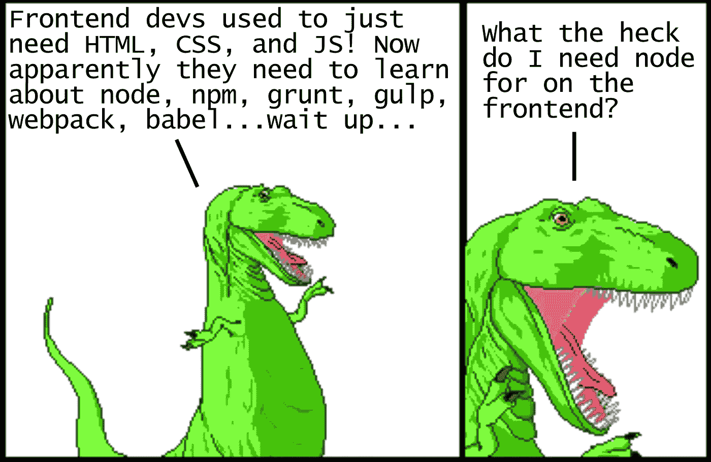
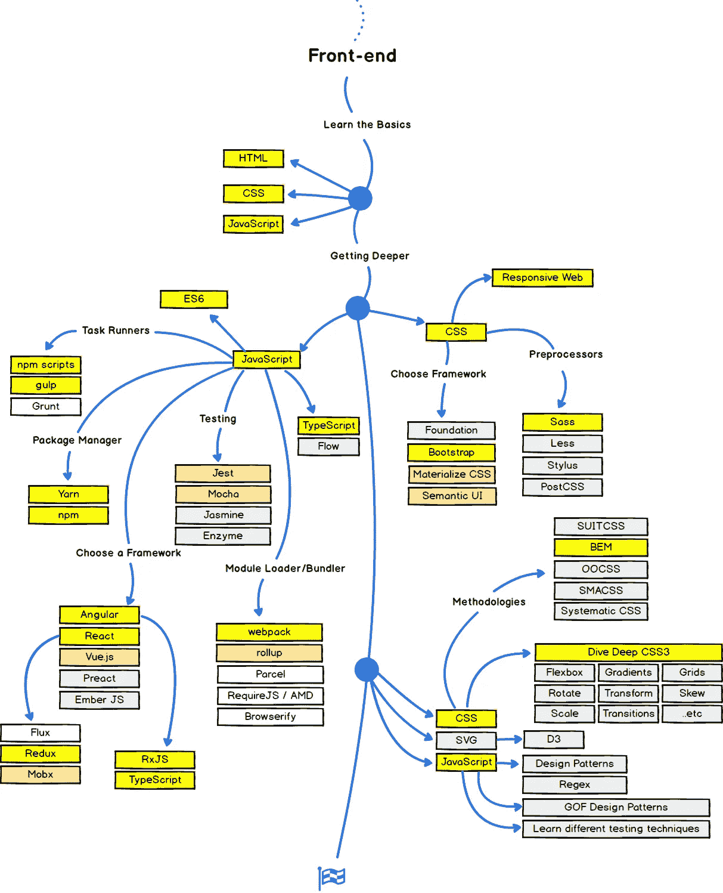
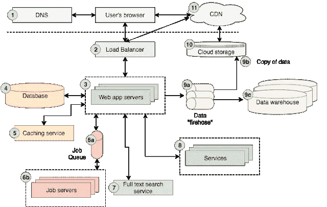
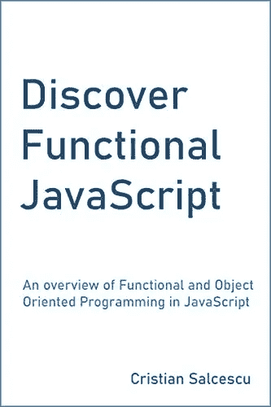
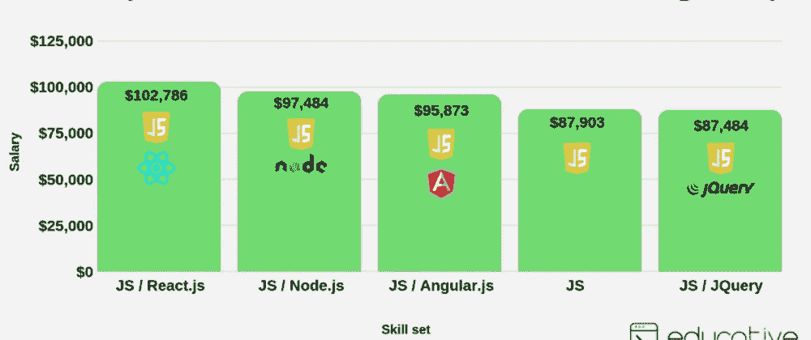
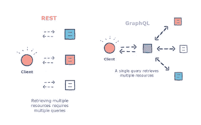
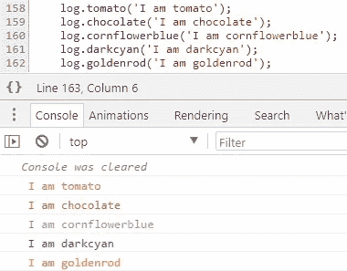

# 每个 Web 开发人员都应该阅读的 10 篇文章

> 原文：<https://medium.com/javarevisited/10-articles-every-web-developer-should-read-2efca81d0696?source=collection_archive---------0----------------------->

## 我为 web 开发人员和学习 web 开发的人收集了一些有趣而有见地的文章

图片来自[恐龙漫画](http://www.qwantz.com/)作者[瑞恩诺斯](https://twitter.com/ryanqnorth)

大家好，你们好吗？我又回来了，列出了每个人都应该阅读的 10 篇文章。在过去，我曾分享过[每个程序员都应该阅读的 10 篇文章](http://javarevisited.blogspot.sg/2014/05/10-articles-every-programmer-must-read.html#axzz5DAY4pAEV)，这些文章深受你们的喜爱，许多读者赞赏并表示受益匪浅。

我能理解，因为发现一篇伟大文章的感觉就像在盐矿里发现金子一样。互联网上充满了教程和资源，但并不是所有的都是好的，而且随着如此庞大的数量，找到好的资源变得越来越难*，或者我应该称之为文章的宝石，每个人都想阅读。*

*这就是为什么每当我看到一篇好文章，我都会把它收藏起来，只是为了一遍又一遍地阅读，相信我，每次我都学到了一两件事。有时候，一个新的有见地的评论也会引出一个新的资源或者增加一些你已经知道的东西。

另一件事是，技术变化非常快，无论我 10 年前对 web 开发了解多少，都不足以适应当今的现代 web 开发，我需要让自己保持更新。*

*这是许多程序员和 web 开发人员的情况，但是更新自己并跟上技术并不容易。说起来容易做起来难。我知道来自 [Udemy](https://click.linksynergy.com/fs-bin/click?id=JVFxdTr9V80&offerid=323058.9409&type=3&subid=0) 、 [Coursera](https://click.linksynergy.com/deeplink?id=JVFxdTr9V80&mid=40328&murl=https%3A%2F%2Fwww.coursera.org%2F) 、 [Educative](https://www.educative.io/subscription?affiliate_id=5073518643380224) 和 [Pluarslight](https://pluralsight.pxf.io/c/1193463/424552/7490?u=https%3A%2F%2Fwww.pluralsight.com%2Flearn) 的在线课程很棒，是让你跟上新技术的主要资源，但同时，它们也很耗时。你至少需要 10 个小时来完成一个 3 小时的课程，有时甚至更长，这正是这篇写得很好、很有见地的文章所能帮助你的地方。*

# *每个 Web 开发人员都应该阅读的 10 篇最佳文章*

*无论如何，不要再浪费你的时间了，这里是我列出的每个 web 开发人员都应该阅读的 10 篇文章:*

## *1.[现代 JavaScript 为恐龙解释](/the-node-js-collection/modern-javascript-explained-for-dinosaurs-f695e9747b70)*

*这可能是我见过的关于现代前端开发工作流的最好的解释，如果你是 JavaScript 或 web 开发的新手，你必须阅读这篇文章。*

*通过阅读这篇文章，你会学到很多关于 JavaScript 的知识。如果您在 10 年前就已经研究过 JavaScript，并且想要快速上手，那么一定要阅读这篇文章*

*而且，如果你想学习更多关于 JavaScript 的知识，那么由 Jonas Schemdtmann 在 Udemy 上完成的 JavaScript 课程是对 web 开发者最好的课程。*

*

图片来自[恐龙漫画](http://www.qwantz.com/)作者[瑞安·诺斯](https://twitter.com/ryanqnorth)* 

## *2.[网络开发者路线图](https://javarevisited.blogspot.com/2019/02/the-2019-web-developer-roadmap.html)*

*这不仅仅是一篇这样的文章，而是一个关于如何成为一名网络开发者的极好资源。它列出了 Web 开发人员应该熟悉的所有技术和工具。*

*我真的很喜欢那些现在出现在网上其他地方的思维导图。它有效地补充了 Web 开发人员训练营 课程，该课程教你路线图中提到的大多数技术。*

**

## *[3。网络架构 101](https://engineering.videoblocks.com/web-architecture-101-a3224e126947)*

*我相信每个 web 开发人员都应该学习和理解的基本架构概念。如果你刚开始做 web 开发，可能会觉得很复杂，但是值得一读。我就不多说了，因为下图已经说明了一切。*

*在做任何改变或调试问题之前，我总是试图理解流程。一旦你知道了工作流，比如输入来自哪里，逻辑和数据在哪里，以及响应是如何返回的，你的日常工作就会有很大的不同。

而且，如果你正在寻找一门关于 web 应用和软件架构的完整课程，我推荐你去看看 [**Web 应用和软件架构 101**](https://www.educative.io/courses/web-application-software-architecture-101?affiliate_id=5073518643380224) 。这是一门有用的课程，可以帮助任何想要加强软件架构整体知识的人。*

**

*而且，如果你发现教育平台和他们的探索课程，比如[探索系统设计面试](https://www.educative.io/collection/5668639101419520/5649050225344512?affiliate_id=5073518643380224)和[探索编码面试模式](https://www.educative.io/collection/5668639101419520/5671464854355968?affiliate_id=5073518643380224)，那么考虑购买 [**教育订阅**](https://www.educative.io/subscription?affiliate_id=5073518643380224) ，每月只需 *$14.99* 就可以访问他们的 100 多门课程。非常划算，非常适合准备编码面试。*

*<https://www.educative.io/subscription?affiliate_id=5073518643380224> * 

## *[4。现代 CSS 为恐龙解释](/actualize-network/modern-css-explained-for-dinosaurs-5226febe3525)*

*这是本列表第一篇文章的作者 Peter Jang 的另一部杰作，但这一次，他讨论了 CSS，web 开发的另一个支柱。*

*老实说，和 JavaScript 一样，CSS 也发生了很大的变化，如果你已经很久没有使用 CSS 了，这篇文章将带你熟悉它。

如果你想以一种更加结构化的方式了解更多，Jonas Schedtmann 的这个 [**高级 CSS 和 Sass: Flexbox、Grid 和更多**](https://click.linksynergy.com/deeplink?id=JVFxdTr9V80&mid=39197&murl=https%3A%2F%2Fwww.udemy.com%2Fcourse%2Fadvanced-css-and-sass%2F) 是另一个很好的后续资源。最好的是这两篇文章都是 Medium 上的免费文章。*

*

图片来自[恐龙漫画](http://www.qwantz.com/)作者[瑞恩诺斯](https://twitter.com/ryanqnorth)* 

## ***5。** [**学习这些 JavaScript 基础知识，成为更好的开发者**](https://www.freecodecamp.org/news/learn-these-javascript-fundamentals-and-become-a-better-developer-2a031a0dc9cf/)*

*JavaScript 的强大之处在于它的简单性，了解 JavaScript 的基础知识可以让我们更好地理解和使用这种语言。这篇文章将教你一些很多 web 开发人员忽略的 JavaScript 基础知识。

如果想了解更多，还可以阅读作者的[Discover Functional JavaScript](https://www.amazon.com/Discover-Functional-JavaScript-overview-Programming-ebook/dp/B07PBQJYYG?tag=javamysqlanta-20)一书，该书被 BookAuthority 评为最佳函数式编程新书之一！*

**

## *6.[node . js](https://medium.freecodecamp.org/what-exactly-is-node-js-ae36e97449f5)到底是什么*

*Node.js 是一个 JavaScript 运行时环境。听起来很棒，但那是什么意思？这是怎么回事？所有这些问题都在本文中得到了解答。*

*由于 Node.js 是当今世界上任何严肃的 web 开发人员的必备工具，尤其是对于全栈开发人员来说，对 Node.js 的良好理解大有裨益。

这是学习和理解 Node.js 的最佳文章，但是如果你想了解更多，Andrew J. Mead 在 Udemy 上的 [**完整的 Node.js 开发者课程**](https://click.linksynergy.com/deeplink?id=JVFxdTr9V80&mid=39197&murl=https%3A%2F%2Fwww.udemy.com%2Fcourse%2Fthe-complete-nodejs-developer-course-2%2F) 是另一个很棒的资源。*

**

## *7.[需要深入学习的十大 JavaScript 框架](https://www.java67.com/2019/01/top-10-javascript-frameworks-and-libraries-for-web-developers.html)*

*这是另一篇精彩的文章，列出了前端和后端开发的精彩 JavaScript 框架，如 [Angular](/javarevisited/10-courses-to-learn-angular-for-web-development-6da1bd2856dc) 、 [Reactjs](/javarevisited/top-10-free-courses-to-learn-react-js-c14edbd3b35f?source=extreme_main_feed----d3a191ac6ed-----5-1--------------------561c2dc6_a2b4_41e0_b7be_1d97edbf631c--8) 、 [Nodejs](/javarevisited/top-10-online-courses-to-learn-node-js-in-depth-8ef0e31ca139) 等。它将教你成为现代前端和后端开发人员所需的关键技术和框架。

本文还包含了 Angela Yu 的 [**完整的 Web 开发训练营**](https://click.linksynergy.com/deeplink?id=JVFxdTr9V80&mid=39197&murl=https%3A%2F%2Fwww.udemy.com%2Fcourse%2Fthe-complete-web-development-bootcamp%2F) 课程等资源，在那里你可以学习那些 Javascript 框架。我强烈推荐阅读它们，尤其是如果你想成为一名全栈 Web 开发人员的话。*

**

## *8.[我如何在没有技术学位或工作经验的情况下获得一份全栈开发人员的工作](https://medium.freecodecamp.org/how-i-landed-a-full-stack-developer-job-without-a-tech-degree-or-work-experience-6add97be2051)*

*除了从其他人的经验中学习，没有更好的方法，这篇文章提供了一个机会，让我们了解作者如何在没有相关工作经验、没有技术学位、甚至没有一年活跃的[编码](/javarevisited/7-best-coding-course-to-learn-programming-with-zero-experience-in-2020-52f7d0d9cb80)经验的情况下，设法找到一份完整的 web 开发人员工作。*

*<https://www.freecodecamp.org/news/how-i-landed-a-full-stack-developer-job-without-a-tech-degree-or-work-experience-6add97be2051/> * 

## *9.[谷歌 JavaScript 风格指南中值得注意的 13 点](https://www.freecodecamp.org/news/google-publishes-a-javascript-style-guide-here-are-some-key-lessons-1810b8ad050b/)*

*对于还不熟悉 JavaScript 的人，谷歌推出了一个编写 JavaScript 的风格指南，列出了(谷歌认为是)编写干净易懂代码的最佳风格实践。JavaScript 开发人员的另一个重要资源。*

*<https://www.freecodecamp.org/news/google-publishes-a-javascript-style-guide-here-are-some-key-lessons-1810b8ad050b/> * 

## *10. [RESTful API 设计指南——最佳实践](https://hackernoon.com/restful-api-designing-guidelines-the-best-practices-60e1d954e7c9)*

*REST APIs 改变了 web 的运行方式。这也为移动设备显示网络内容铺平了道路。脸书、谷歌、Github、网飞和其他一些科技巨头已经给了开发者通过 API 消费数据的机会，并成为他们的平台。

这篇文章教你一些来之不易的设计你自己的 REST APIs 的最佳实践。不过，如果你是 REST 新手，我建议你在尝试这些最佳实践之前，先浏览一下霍华德·迪金在 Pluralsight 上写的 [**REST 基础**](https://pluralsight.pxf.io/c/1193463/424552/7490?u=https%3A%2F%2Fwww.pluralsight.com%2Fcourses%2Frest-fundamentals) 。*

**

## *11.[我正在从您的网站收集信用卡号码和密码。下面介绍](https://hackernoon.com/im-harvesting-credit-card-numbers-and-passwords-from-your-site-here-s-how-9a8cb347c5b5)。*

*这可能不会教你任何关于 web 开发的东西，但是这是一篇关于 Web 安全性的非常有趣且有教育意义的文章。这也解释了[现代网络开发](/javarevisited/top-10-online-courses-to-become-a-fullstack-web-developer-in-2020-d608a6b63232)的脆弱性，它非常依赖 NPM。

我知道 10 篇很多，没有加分篇的空间，但这一篇无论是娱乐还是教育目的都值得一读。*

**

*这就是每个 Web 开发人员都应该阅读的一些最好的文章。如果您还没有阅读它们，请去阅读它们，它们是一个很棒的资源，提供了关于日常工作和 web 开发人员使用的技术的有用见解。如果你知道，任何你认为应该在这个列表中的其他好文章，请随时留言，如果你喜欢我的策展，那么不要忘记与你的朋友和同事分享。这将激励我在未来分享一些令人敬畏的宝石。

其他**编程与开发文章**你可能喜欢*

*   *[Java 开发人员路线图](https://javarevisited.blogspot.com/2019/10/the-java-developer-roadmap.html)*
*   *[完整的 DevOps 工程师路线图](https://javarevisited.blogspot.com/2018/09/the-2018-devops-roadmap-your-guide-to-become-DevOps-Engineer.html)*
*   *[你可以深入学习的 10 种编程语言](http://www.java67.com/2017/12/10-programming-languages-to-learn-in.html)*
*   *[每个 Java 开发者都应该知道的 10 个工具](http://www.java67.com/2018/04/10-tools-java-developers-should-learn.html)*
*   *[学习 Java 编程语言的 10 个理由](http://javarevisited.blogspot.sg/2013/04/10-reasons-to-learn-java-programming.html)*
*   *[深入了解 Spring Boot 的十大课程](/javarevisited/top-10-courses-to-learn-spring-boot-in-2020-best-of-lot-6ffce88a1b6e)*
*   *【Java 和 Web 开发人员应该学习的 10 个框架*
*   *[Java 程序员应该学习的 10 件事](https://javarevisited.blogspot.com/2017/12/10-things-java-programmers-should-learn.html#axzz5atl0BngO)*
*   *[成为更好的 Java 开发人员的 10 个技巧](http://javarevisited.blogspot.sg/2018/05/10-tips-to-become-better-java-developer.html)*
*   *[需要深入学习的 5 大 Java 框架](http://javarevisited.blogspot.sg/2018/04/top-5-java-frameworks-to-learn-in-2018_27.html)*
*   *[初学者学习 Python 的 10 个理由](https://javarevisited.blogspot.com/2018/05/10-reasons-to-learn-python-programming.html)*
*   *[每个 Java 开发者都应该知道的 10 个测试库](https://javarevisited.blogspot.sg/2018/01/10-unit-testing-and-integration-tools-for-java-programmers.html)*

*而且，如果你想自己找到更多这样的文章，Medium 是一个很好的地方，毫无疑问，许多这样的文章都发表在 Medium、HackerNoon 和 Freecodecamp 上。*

***附言——**如果你想学习 web 开发或者想成为一名全栈开发者，那么我也推荐你去看看 Udemy 网站上 Colt_Steele 的[**Web 开发者训练营**](https://click.linksynergy.com/deeplink?id=JVFxdTr9V80&mid=39197&murl=https%3A%2F%2Fwww.udemy.com%2Fcourse%2Fthe-web-developer-bootcamp%2F) 课程。这是成为一名合格的 web 开发人员的最好也是最实惠的资源之一。*

*<https://click.linksynergy.com/deeplink?id=JVFxdTr9V80&mid=39197&murl=https%3A%2F%2Fwww.udemy.com%2Fcourse%2Fthe-web-developer-bootcamp%2F> *