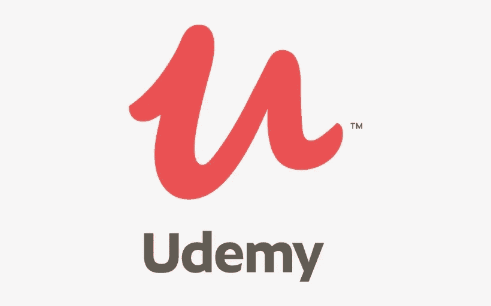
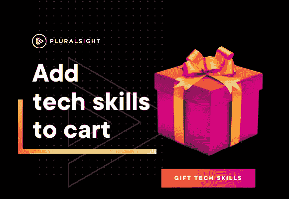
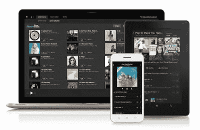
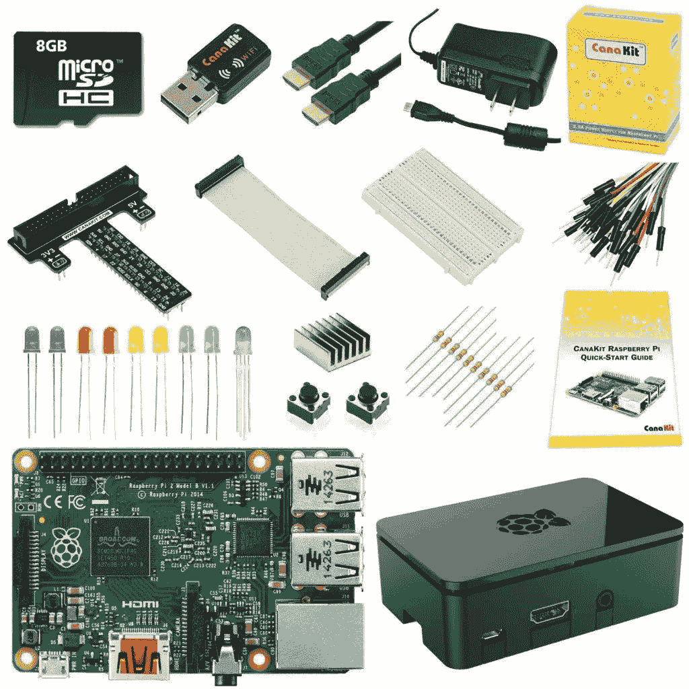
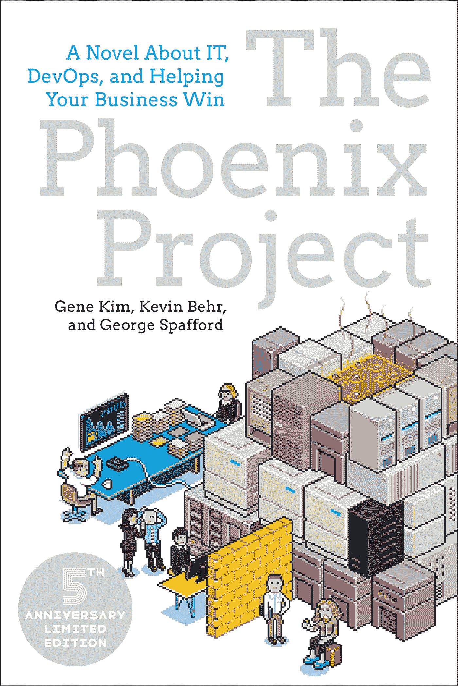
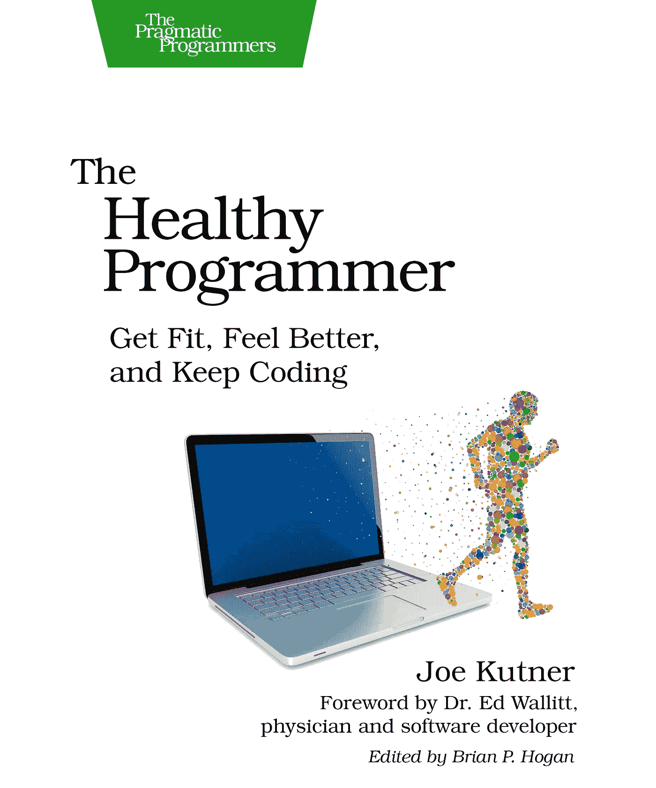
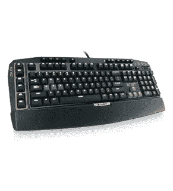
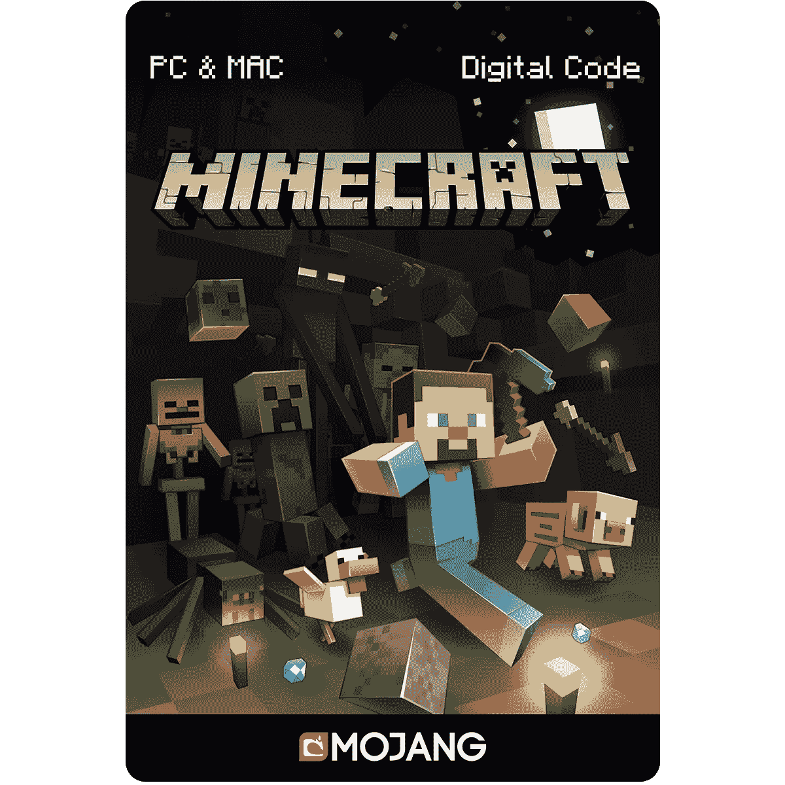
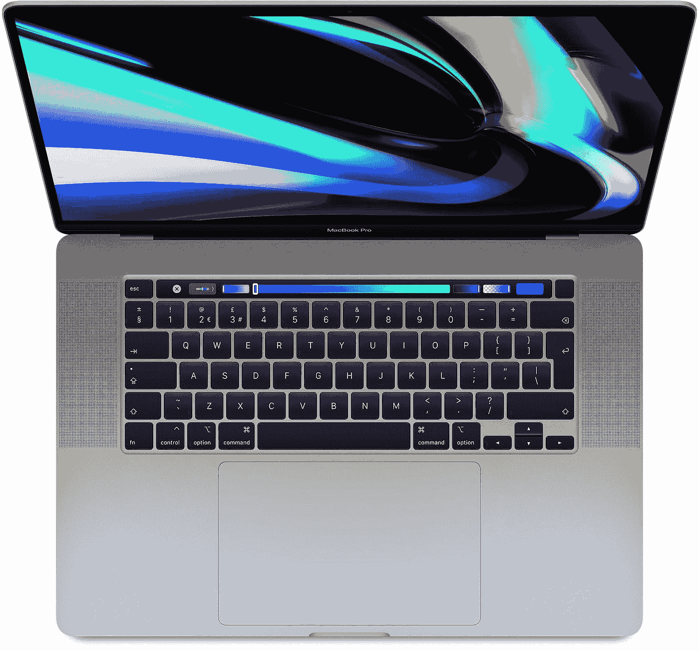

# 给程序员、软件开发人员和极客的 10 份大礼[更新于 2023 年]

> 原文：<https://medium.com/javarevisited/10-awesome-gifts-for-programmers-geeks-and-tech-friends-ae65924c48cc?source=collection_archive---------0----------------------->

叶卡捷琳娜·舍甫琴科在 [Unsplash](https://unsplash.com?utm_source=medium&utm_medium=referral) 上的照片

大家好，又到了一年中的这个时候，我们喜欢和家人朋友在一起，给他们买礼物，向他们表达我们的爱和关心。

我的朋友圈有很多程序员和非程序员，当谈到为生日、周年纪念日或节假日购买礼物时，我会收到我的非程序员家人和朋友关于为程序员购买什么的大量询问？

> *嗯，买礼物很容易，但是为某人选择合适的礼物真的很难。*

说到给孩子买礼物，我有过这样的经历。我知道他们喜欢玩具，但我的妻子告诉我买一些更有价值的东西，这不仅会让他们参与进来，还会提供一些价值，帮助他们学习，他们每次使用它都会很感激。

> 这对于一个单一的礼物来说太多了，但这是最完美的礼物，不是吗？

程序员也是一样，你给他们买了一些他们不在乎的东西，但不会有什么不同，他们会高兴地接受它，它会留在房子的一个角落里。

> 但是，如果你给他们日常使用或雕刻的东西，他们不仅会每天记得你，还会欣赏你的礼物感。

你将会长期受到他们的青睐。如果你想给你的同事或老板留下深刻印象，这一点尤其重要，因为他碰巧是个技术人员或程序员。

**像任何礼物一样，预算非常重要，**有些[礼物](https://javarevisited.blogspot.com/2017/12/10-gift-ideas-for-programmers-software.html)很好，但如果它们非常昂贵，你买不起，那就没用了。

但是，如果你想给你亲爱的人，比如你的丈夫，男朋友，兄弟，或者只是一个亲密的朋友，你肯定想买更多有价值的礼物。

这就是为什么我包括了贵重的和有点贵的，以及许多买得起的礼物，你可以花不到 100 美元或者更高一点的价格买到这些礼物。顺便说一句，一些链接是附属链接，如果你使用这些链接购买而不增加额外费用，我会得到一小笔佣金。

# 给程序员和 IT 专业人员的 10 大礼物

以下是你可以送给程序员朋友的一些最好的礼物。礼物是随机排列的，有些礼物很贵，你可以根据你的预算来选择。

## 1.[赠送 Udemy 的课程](https://click.linksynergy.com/fs-bin/click?id=JVFxdTr9V80&subid=0&offerid=323058.1&type=10&tmpid=14494&RD_PARM1=https%253A%252F%252Fwww.udemy.com%252F)

程序员都爱在线课程，包括我和 Udemy 是最大的在线课程集合。

它有超过 85，000 门在线课程，可以学习任何东西，例如从流行的编程语言(如 Java 和 Python)到高级技术(如大数据、自动化、云计算、人工智能、机器学习、机器人等)。

Udemy 允许你向你的程序员朋友发送课程或礼品卡，你只需要在购买课程时输入他的电子邮件。

我的一个朋友送给我 [**带 Spring Boot 和 Reac**](https://click.linksynergy.com/deeplink?id=JVFxdTr9V80&mid=39197&murl=https%3A%2F%2Fwww.udemy.com%2Fcourse%2Ffull-stack-application-with-spring-boot-and-react%2F) t 的 Go Java 全栈，我简直爱不释手。如果你的丈夫对数据科学、机器学习或人工智能感兴趣，那么你也可以把这些作为礼物送给他。

如果你知道你的丈夫或男朋友喜欢什么，那么你可以从 Udemy 选择一些很棒的课程，否则就给他们买一张礼品卡。

## [2。Pluralsight 会员资格](http://pluralsight.pxf.io/c/1193463/424552/7490?u=https%3A%2F%2Fwww.pluralsight.com%2Flearn)

程序员喜欢会员制，Pluralsight 就像软件开发人员的网飞。

它包含 5000 多门在线课程，涉及前端和后端开发、机器学习等所有最新主题。它还包括交互式测验、练习和最新的认证材料。

由于学习是编程工作的一个重要部分，Pluralsight 会员资格是在竞争中保持领先的一个很好的方式。

可以购买 [**Pluralsight 年度会员**](http://pluralsight.pxf.io/c/1193463/424552/7490?u=https%3A%2F%2Fwww.pluralsight.com%2Flearn) ，价格在 299 美元左右。它有点贵，但它为他的学习提供了很多选择，你的程序员朋友每次使用它都会很感激。

如果你担心费用方面，那么月费也是一个不错的选择，大约 29 美元。Pluralsight 的年度会员费有点贵，但物有所值。

顺便说一句，如果你幸运的话，你可能会得到一些假期优惠，上次我在同一时期以 [33%的折扣](https://pluralsight.pxf.io/c/1193463/424552/7490?u=https%3A%2F%2Fwww.pluralsight.com%2Fpricing)购买了 Pluralsight 会员。

## 3.[亚马逊 Prime 音乐订阅](https://www.amazon.com/gp/dmusic/promotions/PrimeMusic?tag=javamysqlanta-20)

程序员喜欢的另一件事是音乐，他们永远不会厌倦听音乐。事实上，许多程序员需要音乐来工作和提高他们的生产力。

亚马逊音乐是最大的音乐收藏，你的程序员朋友一定会在这个音乐商店里找到他喜欢的东西。

每次他用 bose 耳机听音乐时，他都会感激你的想法和努力。

## 4.覆盆子馅饼

树莓派已经出现了一段时间，但它似乎越来越棒了。程序员是好奇的人，喜欢玩电子产品。

Raspberry Pi 是一个完整的迷你电脑，价格便宜得离谱，你可以得到一个很棒的包，就像这个，它添加了各种很酷的东西来玩。

它也非常适合教孩子们编程或构建自己的服务器网络。

有一次，我在我的树莓 Pi 上运行 Linux，用 putty 连接，多牛逼啊？简而言之，这是送给程序员朋友的最好礼物之一。

**这里是购买强力树莓派**的链接——[一个树莓派](https://www.amazon.com/dp/B07D8VXWRY?tag=javamysqlanta-20)

## 5.书籍(凤凰计划)

与小工具和音乐类似，程序员也非常喜欢书，但对于书，他们会感到困惑。你应该为他们买哪本书？一本小说，一本编程书，或者别的什么。

嗯，尽管许多程序员喜欢奇幻书籍和小说，但它们对他们来说并不那么有价值，但如果你给他们买一些像[**【Phonix Project】**](https://www.amazon.com/Phoenix-Project-DevOps-Helping-Business/dp/1942788290/?tag=javamysqlanta-20)，*这样的东西，一本关于它的小说，DevOps，并帮助你的企业赢得*，那么每个程序员都会阅读，他们会更欣赏它。

如果你需要更多像 [**、Phonix 项目**](https://www.amazon.com/Phoenix-Project-DevOps-Helping-Business/dp/1942788290/?tag=javamysqlanta-20) 或 [**【独角兽项目】**](https://www.amazon.com/Unicorn-Project-Developers-Disruption-Thriving-ebook/dp/B07QT9QR41/?tag=javamysqlanta-20) 这样的书，这本书的第二部分是一本关于开发人员、数字颠覆和在数据时代蓬勃发展的小说，给程序员提供了很多选择，你应该在这里查看我列出的每个程序员都应该阅读的 10 本书。

## 6.健身俱乐部会员

这是你可以给你爱的人的另一个很棒的礼物。由于许多程序员缺乏体力活动，你不仅鼓励他们做更多的体力活动，而且改善他们的生活方式。

他们可能不会在短时间内欣赏它，但从长远来看，他们肯定会欣赏它:-)。

> 毕竟，健康就是财富，你只有一个身体可活

如果你想要一些灵感，你也可以阅读《健康的程序员》一书，这是将健身和书籍结合起来的另一份完美礼物。

## 7.[罗技 G710+机械游戏键盘](https://www.amazon.com/Logitech-Mechanical-Keyboard-Tactile-High-Speed/dp/B009C98NPY?tag=javamysqlanta-20)

每个程序员都需要一个好的键盘，你的朋友也不例外。

虽然有些程序员喜欢静音键盘，有些程序员喜欢游戏键盘，但我更喜欢游戏键盘，因为我也在电脑上玩游戏。

罗技是外围设备最好的公司之一，所以对我来说，这款键盘非常值得购买。

除了是一个神奇的机械键盘，它还有一堆非常酷的游戏功能，所以我是它的忠实粉丝。

## 8.比赛

像小工具、音乐和书籍一样，程序员也喜欢游戏，我当然也是。我是在玩任天堂的游戏中长大的，比如《超级马里奥兄弟》、《生死格斗》,我仍然在我的 Xbox 上玩游戏。

所以，你可以给你的朋友买一台游戏机，比如 Xbox 或者任天堂 PI，或者如果他已经有了，你可以给他们买一些游戏，比如《《我的世界》》。这是他们肯定会喜欢的东西。

## 9.[预装 Windows 10 的英特尔盒装计算棒](https://www.amazon.com/Intel-Compute-Computer-Processor-BOXSTK1AW32SC/dp/B01AZC4NHS?tag=javamysqlanta-20)

这是给科技极客的一份非常棒的礼物？一整台装有 Windows 10 的电脑都在一根棍子上。你只要把这个东西插到电视或显示器上，你就有了一台电脑。

最棒的是它会让你多花 100 美元。简直牛逼。

## [10。MacBook Pro](https://www.amazon.com/Apple-MF841LL-13-3-Inch-dual-core-processor/dp/B00UGBWR0E?tag=javamysqlanta-20)

程序员喜欢小工具，当谈到小工具时，没有什么能打败苹果。如果你是一个没有 MacBook Pro 的程序员朋友，那么把它送给他是一个非常好的主意。他们会喜欢使用苹果公司的 16 英寸 Mac Book Pro。

当然，这很昂贵，但是如果他是你爱的人或者是你非常亲近的人，那么这绝对是值得的，无论你把它送给谁，他都不会忘记你很久。

这就是给程序员的 10 个令人敬畏的礼物想法的清单。我确信，你的程序员朋友或同事会喜欢这个列表中的任何礼物。你可以为他们的生日买礼物，或者在即将到来的假期里送给他们。

我知道选择一件礼物很难，但是无论你花多少时间和精力去选择一件礼物，如果你把他们的兴趣和需求记在心里，你的朋友会永远记得你。

而且，如果你想送我什么东西，那么你可以买我写了 10 年博客后写的第一本书——[**寻访 Java**](https://gumroad.com/l/QqjGH)**。还可以使用码友 30 获得我的阅读器限时七折优惠。**

您可能希望探究的其他**编程** **文章**

*   Java 和 Web 开发人员应该学习的 10 件事
*   【Java 开发人员应该知道的 10 个测试工具
*   【Java 开发者应该学习的 5 个框架
*   [学习 Python 编程语言的 10 个理由](https://javarevisited.blogspot.sg/2018/05/10-reasons-to-learn-python-programming.html)
*   [每个程序员都应该阅读的十大算法书籍](http://www.java67.com/2015/09/top-10-algorithm-books-every-programmer-read-learn.html)
*   [每个 Java 开发人员都应该学习的 20 个库](https://javarevisited.blogspot.com/2018/01/top-20-libraries-and-apis-for-java-programmers.html)
*   [Java 开发人员在日常工作中使用的 10 种工具](http://javarevisited.blogspot.sg/2017/03/10-tools-used-by-java-programming-Developers.html#axzz55lrMRnNC)
*   [每个 Java 程序员都应该阅读的 10 本书](/javarevisited/10-books-java-developers-should-read-in-2020-e6222f25cc72)
*   [10 门深入学习数据结构和算法的免费课程](/javarevisited/top-10-free-data-structure-and-algorithms-courses-for-beginners-best-of-lot-ad807cc55f7a?source=collection_home---4------0-----------------------)
*   [十大编程语言开始学习编码](http://www.java67.com/2017/12/10-programming-languages-to-learn-in.html)

感谢您阅读本文。如果你喜欢这些送给程序员和技术人员的礼物，请与你的朋友和同事分享。如果您有任何问题或反馈，请留言。

如果你有任何其他礼物的想法，请分享我告诉你的…

> 买礼物很容易，但是为某人找到合适的礼物真的很难。

节日快乐！！