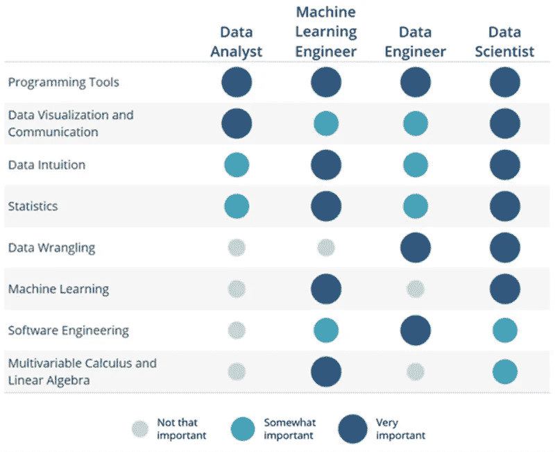
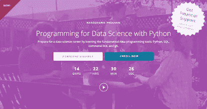
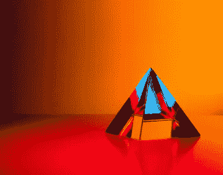
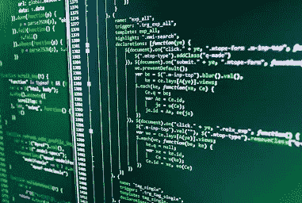
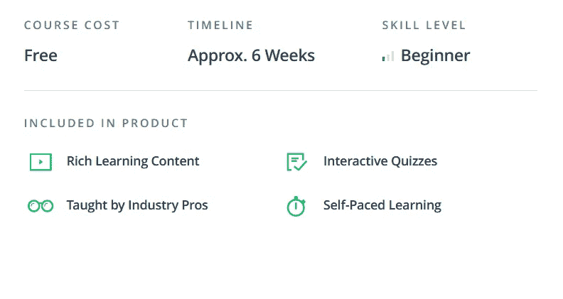
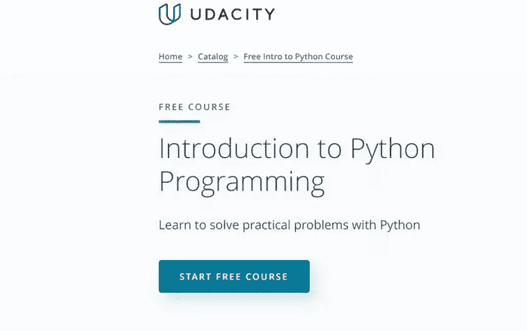
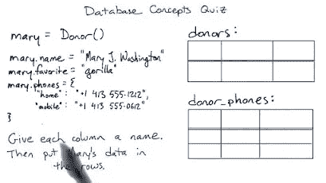
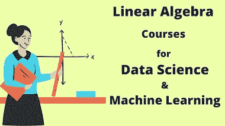

# 2023 年学习 Python 和数据科学的 10 门最佳免费 Udacity 课程

> 原文：<https://medium.com/javarevisited/10-best-and-free-udacity-courses-to-learn-python-and-data-science-in-2022-61f382d5fd93?source=collection_archive---------3----------------------->

## 这些是来自流行的在线学习门户之一 Udacity 的最好的 Python 课程和 Nanodegree 项目。

大家好，如果你正在 Udacity 上寻找最好的免费和付费 Python 和数据科学课程来开始你的职业生涯，那么你来对地方了。在这篇文章中，我将分享 Udacity 最好的免费在线课程以及纳米学位课程，以在 2023 年学习基本的技术技能。

*披露——顺便说一句，其中一些链接是附属链接，如果你使用我的链接加入这些课程，我可能会得到报酬。*

**Udacity** 是学习热门技术技能的最佳地点之一，因为它与行业领导者合作创建基于项目的在线学习项目，这意味着你可以学习雇主最重视的技术技能，如 Python、数据科学、机器学习等。

过去，我曾在 Coursera 上分享过 [Python 路线图](/javarevisited/the-2022-python-programmer-roadmap-bafb365071a3)、[最佳 Python 课程](https://javarevisited.blogspot.com/2020/02/10-best-coursera-courses--for-python.html)和 Udemy 上的[最佳 Python 课程，在本文中，我将分享 2023 年学习 Python 和数据科学的最佳免费和付费 Udacity 在线课程。](https://javarevisited.blogspot.com/2020/05/top-10-udemy-courses-to-learn-python-programming.html)

但是，在我们进入 10 个最好的免费 Udacity 课程之前，这些课程将教你关于 Python 和数据科学需要知道的一切。让我告诉你一点它到底是什么。

你基本上可以把 [Python](/javarevisited/the-2022-python-programmer-roadmap-bafb365071a3) 看作是一种高级的、通用的编程语言，它有简单而优雅的语法。它允许程序员专注于解决问题，而不用考虑语法。

Python 的基本目标是让开发者保持编程乐趣。如今， [Python](https://www.python.org/) 在软件开发、基础设施管理、人工智能和数据科学领域扮演着非常重要的角色。

你应该学习 Python 的主要原因很简单——它是迄今为止世界上最流行的编程语言。它可以用于构建许多不同类型的应用程序。如果你精通 Python，在 it 行业找工作就容易多了。

你可以成为开发人员、软件工程师、测试人员、数据科学家或机器学习专家。这意味着学习 Python 是获得丰厚回报的职业生涯的第一步。Python 最初是由吉多·范·罗苏姆在 20 世纪 90 年代末创建的。他想建立一种编程语言来解决当时程序员面临的所有问题。

# 2023 年学习 Python 和数据科学的 10 门最佳免费 Udacity 课程

在这里，我们为 Python 开发者整理了一份 10 门最佳 Udacity 课程的列表。该列表包括在线课程和 Udacity Nanodegree 项目，涵盖 Python、编程、数据科学、机器学习和人工智能，这些都是 Python 开发人员的关键工作领域。

## 1.[使用 Python 进行数据科学编程](https://imp.i115008.net/c/3294490/786224/11298?u=https%3A%2F%2Fwww.udacity.com%2Fcourse%2Fprogramming-for-data-science-nanodegree--nd104)【uda city】

这是一门很棒的课程，它将教你关于 Python 和现代数据科学的一切知识。这样的话，对于完全的初学者来说绝对是完美的。

**课程时长:3 小时
课程评分:4.6 星(满分 5 分)
课程讲师:乔希·伯恩哈德
课程价格:50 美元**

对于希望进入 Python 这个神奇世界的初学者来说，这是一个完美的入门指南。

以下是加入本课程的链接— [使用 Python 进行数据科学编程](https://imp.i115008.net/c/3294490/786224/11298?u=https%3A%2F%2Fwww.udacity.com%2Fcourse%2Fprogramming-for-data-science-nanodegree--nd104)

## 2.[用 Python 进行 AI 编程](https://imp.i115008.net/c/3294490/786224/11298?u=https%3A%2F%2Fwww.udacity.com%2Fcourse%2Fai-programming-python-nanodegree--nd089)【uda city】

在这个奇妙的课程中，你将学习用 Python 进行人工智能编程的所有核心特性。你也将成为一名非常高级的 Python 开发者。

**课程时长:2 小时
课程评分:4.6 星
课程讲师:Ortal Arel
课程价格:免费**

通过学习这门课程，你将能够掌握熊猫和熊猫。本课程结束时，您将成为一名专业的 Python 开发人员。

**这里是加入本课程**——[用 Python 进行人工智能编程](https://imp.i115008.net/c/3294490/786224/11298?u=https%3A%2F%2Fwww.udacity.com%2Fcourse%2Fai-programming-python-nanodegree--nd089)的链接

## 3.[中级巨蟒](https://imp.i115008.net/c/3294490/786224/11298?u=https%3A%2F%2Fwww.udacity.com%2Fcourse%2Fintermediate-python-nanodegree--nd303)【乌达城】

本课程将对 Python 这个神奇的世界做一个很好的简要介绍。它非常适合初学者，因为你将从零开始学习 Python。

**课程时长:2 小时
课程评分:4.5 星(满分 5 分)
课程讲师:山姆·雷德蒙
课程价格:55 美元**

您将确切了解 Python 是什么以及为什么使用它。本课程将教你关于 Python 中函数式和基于类的组件的所有知识。

以下是加入本课程的链接— [中级 Python](https://imp.i115008.net/c/3294490/786224/11298?u=https%3A%2F%2Fwww.udacity.com%2Fcourse%2Fintermediate-python-nanodegree--nd303)

## 4.[数据分析入门](https://imp.i115008.net/c/3294490/786224/11298?u=https%3A%2F%2Fwww.udacity.com%2Fcourse%2Fintro-to-data-analysis--ud170)【免费 Udacity 课程】

这是一门很棒的课程，它将帮助你把你的 Python 技能提升到另一个层次，并教会你数据分析。通过使用不同于传统 Python 的 Python 库，您将能够做到这一点。您还将学习如何使用 Numpy、Pandas 和 Matplotlib。

在这个免费的 Udacity 课程中，你不仅会学到如何将你的数据转换成你可以使用的格式，以及如何解决任何相关问题。您将学习如何探索数据，从中寻找模式，并建立对数据的直觉

您还将学习如何使用 Python 库 NumPy、Pandas 和 Matplotlib 来编写更干净、更简洁、运行更快的代码。

**课程时长:6 周
课程评分:4.4 星满分 5 分
课程讲师:Caroline Buckey
课程价格:免费**

**这里是加入这个免费课程的链接**——[数据分析简介](https://imp.i115008.net/c/3294490/786224/11298?u=https%3A%2F%2Fwww.udacity.com%2Fcourse%2Fintro-to-data-analysis--ud170)

## 5.[Python 编程入门](https://imp.i115008.net/c/3294490/786224/11298?u=https%3A%2F%2Fwww.udacity.com%2Fcourse%2Fintroduction-to-python--ud1110)【免费】

这是一门激动人心的课程，它将在尽可能短的时间内教会你所有你需要知道的 Python 基础知识。本课程还将教给你所有你需要知道的关于数据结构、列表、集合、元组和自定义函数的知识。

**课程时长:1 小时**

**课程评分:4.6 星(满分 5 分)**

**课程讲师:朱诺·李**

**课程价格:免费**

这里是加入这个免费课程的链接—[Python 编程简介](https://imp.i115008.net/c/3294490/786224/11298?u=https%3A%2F%2Fwww.udacity.com%2Fcourse%2Fintroduction-to-python--ud1110)

## 6.[关系数据库介绍](https://imp.i115008.net/c/3294490/786224/11298?u=https%3A%2F%2Fwww.udacity.com%2Fcourse%2Fintro-to-relational-databases--ud197)【免费 Udacity】

在这个精彩的课程中，你将学到你需要知道的关于 Python 和关系数据库的不同组件的一切。本课程将从学习 Python 编程语言的基础开始。

然后你将继续理解什么是关系数据库。本课程结束时，您将能够利用所学的一切创建一个非常简单但高效的 web 应用程序。

**课程时长:2 小时**

**球场评分:4.5 星(满分 5 分)**

**课程讲师:卡尔·克鲁格**

**课程价格:免费**

## 7.[编程入门](https://imp.i115008.net/c/3294490/786224/11298?u=https%3A%2F%2Fwww.udacity.com%2Fcourse%2Fintro-to-programming-nanodegree--nd000)【uda city】

在这个精彩的课程中，您将学习如何像以前一样快速创建一个精彩的 Python 程序。你将通过学习所有不同的编程语言以及它们的功能来做到这一点。这也是初学者在 [Udacity](https://www.udacity.com/) 上学习编程的最佳课程之一。

**课程时长:2 小时**

**课程评分:4 星(满分 5 分)**

课程导师:卡尔·克鲁格

课程价格:60 美元

以下是加入本课程的链接— [编程简介](https://imp.i115008.net/c/3294490/786224/11298?u=https%3A%2F%2Fwww.udacity.com%2Fcourse%2Fintro-to-programming-nanodegree--nd000)

## 8.[全栈 Web 开发者](https://imp.i115008.net/c/3294490/786224/11298?u=https%3A%2F%2Fwww.udacity.com%2Fcourse%2Ffull-stack-web-developer-nanodegree--nd0044)【uda city】

这个奇妙的课程将帮助你提高你的 Python 技能。通过将一个普通的 HTML 网站转换成一个令人兴奋的 Python 应用程序，你将能够做到这一点。学完本课程后，您将成为高级全栈开发人员。

**课程时长:1 小时**

**课程评分:4 星(满分 5 分)**

**课程导师:Amy Hua**

**课程价格:55 美元**

**这里是加入本课程的链接**——[全栈 Web 开发者](https://imp.i115008.net/c/3294490/786224/11298?u=https%3A%2F%2Fwww.udacity.com%2Fcourse%2Ffull-stack-web-developer-nanodegree--nd0044)

## 9.[数据结构和算法](https://imp.i115008.net/c/3294490/786224/11298?u=https%3A%2F%2Fwww.udacity.com%2Fcourse%2Fdata-structures-and-algorithms-nanodegree--nd256)【uda city】

通过这门激动人心的课程，你将能够学习 Python 中数据结构和算法的基础知识。你也可以通过使用这种神奇的编程语言开始你的神奇之旅。

**课程时长:1 小时**

**课程评分:4.2 星(满分 5 分)**

**课程讲师:布林·克莱普尔**

**课程价格:50 美元**

**这里是加入本课程** — [数据结构与算法](https://imp.i115008.net/c/3294490/786224/11298?u=https%3A%2F%2Fwww.udacity.com%2Fcourse%2Fdata-structures-and-algorithms-nanodegree--nd256)的链接

## 10.线性代数复习课程

在这个奇妙的课程中，您将借助线性代数了解 Python 的所有核心特性。你也将成为一名非常高级的 Python 开发者。你将能够掌握向量和交点。本课程结束时，您将成为一名专业的 Python 开发人员。

**课程时长:2 小时**

**课程评分:4.6 星**

课程讲师:克里斯·普里比

**课程价格:免费**

**这里是加入本课程** — [线性代数复习课程](https://imp.i115008.net/c/3294490/786224/11298?u=https%3A%2F%2Fwww.udacity.com%2Fcourse%2Flinear-algebra-refresher-course--ud953)的链接

以上就是 2023 年**面向 Python 开发者的最佳 Udacity 课程**。我试图将 Udacity 课程和 nanodegrees 以及涵盖不同技能的课程包括在内，如 Python 的数据科学、Python 的数据分析、数据结构和算法等等。

如果你喜欢 Udacity 上的 10 个最佳 Python 课程列表，请随意与你的朋友和家人分享。如果您对 Python 有任何疑问，也可以发表评论，我们会尽快回复您。

其他 **Python** **编程文章**你可能喜欢

*   [2023 年学习 Python 的 10 个理由](https://javarevisited.blogspot.com/2018/05/10-reasons-to-learn-python-programming.html)
*   [面向初学者和中级开发人员的 8 个 Python 项目](/@javinpaul/8-projects-you-can-buil-to-learn-python-in-2020-251dd5350d56)
*   [来自谷歌和微软的免费 Python 教程](/javarevisited/10-free-python-tutorials-and-courses-from-google-microsoft-and-coursera-for-beginners-96b9ad20b4e6)
*   [2023 年学习 Python 的前 5 本书](https://www.java67.com/2019/08/top-5-books-to-learn-python-for-beginners.html)
*   [初学者学习 Python 的 15 门免费课程](/swlh/5-free-python-courses-for-beginners-to-learn-online-e1ca90687caf)
*   [我最喜欢的初学者学习 Django 的课程](/@javinpaul/my-favorite-courses-to-learn-django-for-beginners-2020-ac172e2ab920?source=rss------web_development-5)
*   [哈佛和 IBM 的 9 门数据科学课程](https://becominghuman.ai/9-data-science-and-machine-learning-courses-by-harvard-ibm-udemy-and-others-12a0c7c23ec1)
*   [Python 与 Java——从哪个开始比较好](/javarevisited/python-or-java-which-programming-language-beginners-should-learn-in-2020-de992b2650ec)
*   学习 Web 开发 Python 的 10 门课程
*   [学习数据科学 Python 的 5 本书](https://javarevisited.blogspot.com/2019/08/top-5-python-books-for-data-science-and-machine-learning.html)
*   [Coursera 颁发的 10 个最佳 Python 专业和证书](https://javarevisited.blogspot.com/2020/02/10-best-coursera-courses--for-python.html)
*   [2023 年学习烧瓶的前 5 门课程](https://javarevisited.blogspot.com/2020/01/top-5-courses-to-learn-flask-for-web-development-with-python.html)
*   [8 个用于机器学习的 Python 库](https://javarevisited.blogspot.com/2018/10/top-8-python-libraries-for-data-science-machine-learning.html)
*   每个 Java 开发人员都应该知道的 10 个测试库
*   [Web 开发可以学习的 5 个 Python 框架](https://javarevisited.blogspot.com/2019/04/top-5-python-web-development-frameworks.html)

感谢您阅读本文。如果你发现这些*最好的 Python 编码课程在 2023 年有用*，那么请与你的朋友和同事分享。如果您有任何问题或反馈，请留言。

**P. S. —** 如果你想学习 Python 编程，但负担不起这些在线培训课程或寻找免费资源开始学习 Python 编程，那么我也建议你看看 Udemy 的[**Python 编程简介**](http://bit.ly/2D5vvnV) 。这是完全免费的，你需要的只是一个免费的 Udemy 帐户来注册这门课程。已经有超过 100 万的学生通过这门课程学习了 Python。

</javarevisited/10-best-and-free-datacamp-courses-to-learn-python-and-data-skills-in-2021-39e42682fd76> 