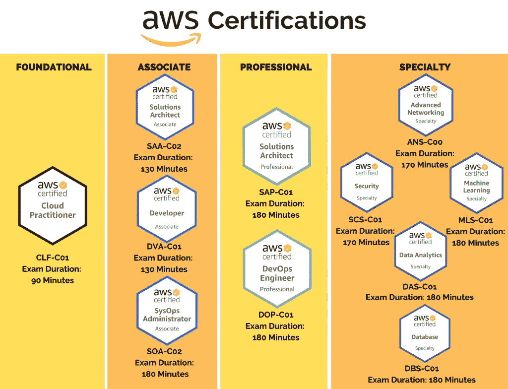
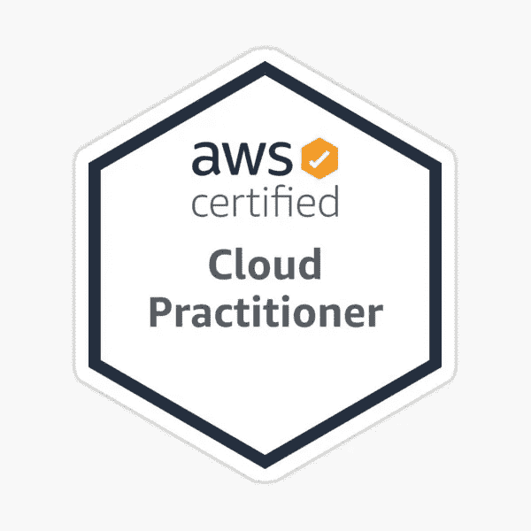
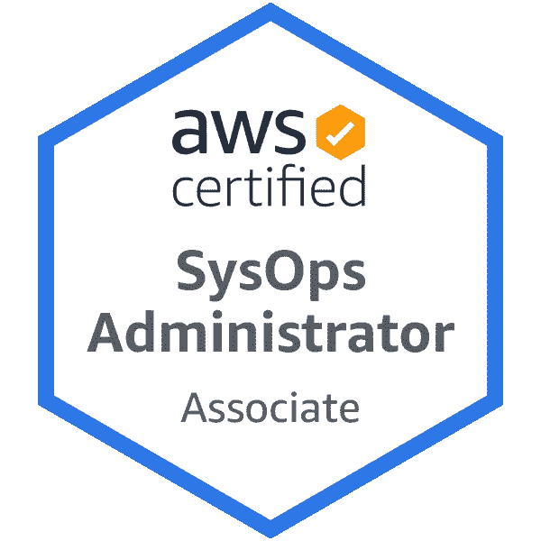
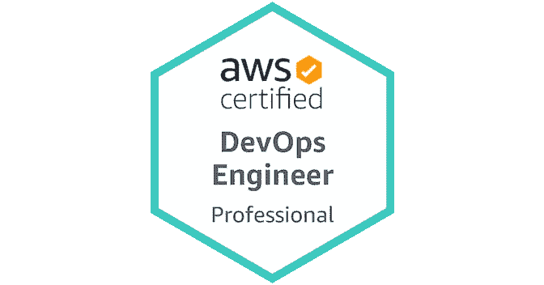
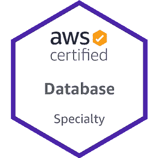

# 2023 年 10 项最佳 AWS 认证，适用于初学者和有经验者

> 原文：<https://medium.com/javarevisited/10-best-aws-certifications-to-aim-in-2022-713c37fac147?source=collection_archive---------0----------------------->

## 根据您的技能、经验和职业发展，通过资源链接找到适合您的 AWS 云认证。

image_credit — Whizlabs

大家好，如果你想在 2023 年将你的云技能提升到一个新的水平，或者想成为 AWS 认证的云专家，那么你来对地方了。

以前我分享过很多免费和付费的课程学习 [AWS](/javarevisited/5-best-aws-courses-for-beginners-and-experienced-developers-to-learn-in-2021-563212409fbd) 、 [Azure](/javarevisited/5-best-azure-fundamentals-courses-to-pass-az-900-certification-exam-in-2020-9e602aea035d) 、 [Google 云认证](https://javarevisited.blogspot.com/2019/07/top-5-google-cloud-platform-gcp-courses-certifications-online.html)，而今天我要分享的是 2023 年 AWS 云专业人士可以瞄准的 10 个最好的云认证。

这些认证都是亚马逊自己提供的，评价很高。这些也是基于角色的认证，这意味着您拥有来自开发人员、开发运维工程师、系统管理员、软件架构师、数据库管理员、安全专家、网络专家、大数据专业人员和数据分析师的证书。你可以根据你的技能和经验来选择。顺便说一句，如果你是一个完全的云初学者，那么我强烈推荐你从 AWS 云从业者开始，这是所有 AWS 认证中最简单的，你可以在一周的认真学习中通过。您还可以使用该认证来学习云计算的基础知识以及更多内容。

许多公司已经从使用虚拟主机转变为使用[云计算](/javarevisited/5-best-cloud-computing-courses-to-learn-in-2020-f5f091159401)如 AWS，云计算一词已经从使用云主机来运营业务转变为强制性的，企业不能改变或使用常规虚拟主机或共享虚拟主机。

这些变化要求员工学习新的开发、维护和部署技能，以及在云中管理您的 web 应用程序，而没有比 [Amazon AWS](https://javarevisited.blogspot.com/2020/05/top-5-amazon-web-services-aws-courses-for-beginners-and-experienced-programmers.html) 更好的地方来部署您的工作，Amazon AWS 是由 gain 公司 Amazon 提供的一系列服务，用于在云中运行和托管您的应用程序。

今天的文章将向您展示许多在线课程，这些课程为学习不同的任务提供认证，例如学习如何在云上部署和管理应用程序，保护您企业的安全等等。

# 面向 IT 专业人员的 10 大最佳 AWS 云认证

以下是 2023 年你可以瞄准的最佳 AWS 和云认证清单。除非你想成为夏羽·马雷克那样的 AWS 英雄，否则你不需要通过所有这些 [AWS 认证](https://www.java67.com/2020/09/top-10-cloud-certification-you-can-aim.html)，但是你可以根据你的个人资料、职业抱负和经验选择最适合你的认证。

该列表从开发人员认证开始，但它有针对初学者、项目经理、系统管理员、数据库人员、大数据和机器学习专家的认证。

## 3.AWS 认证云从业者(初学者最佳云证书)

该证书面向希望了解亚马逊 AWS 的核心和一般基础设施而不关注特定服务的入门级人员，您可以在完成该计划后参加助理认证。

如果您的组织正在使用 AWS，那么申请该认证是明智之举，即使您的组织没有使用 AWS，但您希望从 AWS 开始，那么 Cloud Practitioner 应该是第一个以 2023 年为目标的认证。

您需要参加并通过 *AWS 认证云从业者*考试(CLF-C01)才能获得该认证。考试的特点是多项选择和多项选择问题的结合

如果你需要资源，我强烈推荐这个 [**终极 AWS 认证云从业者**](https://click.linksynergy.com/deeplink?id=JVFxdTr9V80&mid=39197&murl=https%3A%2F%2Fwww.udemy.com%2Fcourse%2Faws-certified-cloud-practitioner-new%2F) 可以帮助你的旅程。

## 2.AWS 认证开发人员助理(程序员最佳云认证)

这是对软件开发者和程序员最好的云认证。该认证面向至少有一年开发和维护 AWS 应用程序经验的人员，它将教您 AWS 服务的核心以及如何使用这些服务的基础知识。

如果你是 Java 开发者或者 Python 开发者之类的开发者，想要学习云计算和 AWS，那么这是对你最好的认证。

如果你已经下定决心要在 2023 年通过这项认证，并且需要一个好的资源，那么这个名为 [**AWS 认证开发人员—助理**](https://click.linksynergy.com/deeplink?id=JVFxdTr9V80&mid=39197&murl=https%3A%2F%2Fwww.udemy.com%2Fcourse%2Faws-certified-developer-associate%2F) 的 Udemy 课程将为你准备这项认证。

## 3.AWS 认证解决方案架构师助理(软件架构师最佳云证书)

这可能是最受欢迎的 AWS 证书，也是经验丰富的人的最佳证书，如经验丰富的开发人员、软件架构师、技术主管和解决方案架构师。

这种证书对于想要执行和定义解决方案架构师(如部署 web 应用程序和保护它们)的人来说是很好的。简而言之，高级开发人员和解决方案架构师的最佳云认证。

要获得此*认证*，您需要参加并通过 *AWS 认证解决方案架构师* — *助理考试* (SAA-C02)，该考试不仅需要回答问题，还需要进行一些实验室活动。

该考试也非常注重场景，需要对不同的 AWS 服务有深入的理解才能正确回答。这就是你需要努力准备成为 AWS 认证解决方案架构师的原因。

值得庆幸的是，有很多课程教你这些技能，其中一门叫做 [**终极 AWS 认证解决方案架构师助理**](https://click.linksynergy.com/deeplink?id=JVFxdTr9V80&mid=39197&murl=https%3A%2F%2Fwww.udemy.com%2Fcourse%2Faws-certified-solutions-architect-associate-saa-c02%2F) 由 AWS 大师夏羽·马雷克在 Udemy 平台上提供，我向任何认真参加 2023 年 AWS 解决方案架构师助理考试的人强烈推荐这门课程。

## 4.AWS 认证系统运营管理员—助理(系统管理员最佳云证书)

*AWS 认证系统管理员* — *助理*考试验证候选人是否有经验和技能做出贡献并“立即进入角色”。

这是面向 Linux 管理员、系统管理员和支持专业人员的最佳 AWS 认证之一，在准备该认证的过程中，您将获得广泛的知识和技能，包括在 AWS 上部署、管理和操作可扩展、高可用性和容错的系统。

它还将帮助您为下一个应用程序选择正确的服务，以及确定成本和控制 AWS 帐户的数据流。

如果你想成为一名 AWS 认证系统管理员，需要准备一门课程，那么这门名为 [**的终极 AWS 认证系统管理员助理**](https://click.linksynergy.com/deeplink?id=JVFxdTr9V80&mid=39197&murl=https%3A%2F%2Fwww.udemy.com%2Fcourse%2Fultimate-aws-certified-sysops-administrator-associate%2F) 的课程可能是让你为这个角色做好准备并获得认证的最佳课程。

## 5.AWS 认证数据分析—专业(数据分析师最佳云证书)

*AWS 认证数据分析* — *专业*考试验证具备构建、部署和调优*数据*模型所需的深入技能的个人，要获得此*认证*，您需要参加并通过 *AWS 认证数据分析* — *专业*考试(DAS-C01)。

对于数据科学家来说，这是最好的 AWS 认证之一，完全值得，因为你将对数据科学需求层次的基础层有一个坚实的理解。

这一专业认证将为您在数据分析方面的角色做好准备，您的工作是收集数据，然后存储它们并进行处理，最后，可视化以获得您的 AWS 帐户的洞察力会消耗数据和电力。

如果你想成为一名 AWS 认证数据分析工程师，那么你可以参加 udemy 上的这个课程 [**AWS 认证数据分析专业**](https://click.linksynergy.com/deeplink?id=JVFxdTr9V80&mid=39197&murl=https%3A%2F%2Fwww.udemy.com%2Fcourse%2Faws-big-data%2F) 来帮助你获得这个证书。

## 6.AWS 认证高级网络—专业(网络专家最佳云证书)

*AWS 认证高级网络* — *专业*面向具有五年实践经验的执行复杂*网络*任务的个人。您需要通过**AWS 认证高级网络专业(ANS-C00)** 考试，才能成为 AWS 认证网络工程师。

对于参与设计、部署和管理 AWS 云和混合网络解决方案的网络架构师、网络工程师和 DevOps 工程师来说，这是最好的 AWS 认证之一。

您将学习和执行与网络相关的复杂任务，以及设计、开发和部署您的应用程序到 AWS 云，并维护 AWS 的所有网络架构。

udemy 上的一门名为 [**AWS 认证高级网络专业**](https://click.linksynergy.com/deeplink?id=JVFxdTr9V80&mid=39197&murl=https%3A%2F%2Fwww.udemy.com%2Fcourse%2Faws-certified-advanced-networking-specialty%2F) 的课程可以帮助你学习通过认证考试所需的技能。

## 7.AWS 认证安全—专业(安全专家最佳云证书)

*AWS 认证安全* — *专业*考试验证在 *AWS 上保护和强化工作负载和架构的技术技能和经验。*

要获得这个*认证*，你需要参加并通过 *AWS 认证安全* — *专业*考试(SCS-C01)。该认证面向在 AWS 工作负载方面至少有两年经验，并且希望学习安全性(如数据加密和保护您的 AWS 帐户内的 web 应用程序)的人员。

对于安全专业人员，尤其是那些参与云安全的人员来说，这是最好的 AWS 认证之一，如果您想获得该认证并需要资源，那么您应该查看 udemy 上名为 [**AWS 认证高级网络-专业**](https://click.linksynergy.com/deeplink?id=JVFxdTr9V80&mid=39197&murl=https%3A%2F%2Fwww.udemy.com%2Fcourse%2Faws-certified-security-specialty%2F) 的高级课程，帮助您学习这些技能。

## 8.AWS 认证 DevOps 工程师-专业(DevOps 工程师最佳云证书)

*AWS 认证开发运维工程师* —专业考试验证在供应、操作和管理分布式应用系统方面的技术专长，要获得该认证，您需要参加并通过 *AWS 认证开发运维工程师* —专业考试(DOP-C01)。

这是一个 AWS 专业证书，面向使用 AWS 服务至少两年的人，您将学习设计和维护自动化工具，以及监控 AWS 系统的指标，自动化安全控制等。

对于 DevOps 工程师和 DevOps 冠军来说，这是最好的 AWS 认证之一，如果你想在 2023 年准备这个认证，那么你也可以在 Udemy 上查看一个名为 [**AWS 认证 DevOps 工程师专业**](https://click.linksynergy.com/deeplink?id=JVFxdTr9V80&mid=39197&murl=https%3A%2F%2Fwww.udemy.com%2Fcourse%2Faws-certified-devops-engineer-professional-hands-on%2F) 的综合课程，以便更好地准备。

## 9.AWS 认证数据库—专业(数据库管理员的最佳云证书)

专业认证建议您至少拥有五年的数据库技术工作经验和两年的 AWS 服务经验，并且您将学习如何在 AWS 中为您的 web 应用程序设计和维护数据库。

这是数据库管理员最好的 AWS 认证之一。 *AWS 认证数据库* — *专业*考试验证推荐、设计和维护最佳 *AWS 数据库*解决方案的专业知识。

要获得这个*认证*，你需要参加并通过 *AWS 认证数据库* — *专业*考试(DBS-C01)。如果你想参加这次考试，并且需要准备资源，那么你也可以参加名为 [**终极 AWS 认证数据库专业**](https://click.linksynergy.com/deeplink?id=JVFxdTr9V80&mid=39197&murl=https%3A%2F%2Fwww.udemy.com%2Fcourse%2Faws-certified-database-specialty-dbs%2F) 的课程，这是开始你的旅程的一个很好的选择。

## 10.AWS 认证大数据—专业(位数据专业人员的最佳云证书)

如果你喜欢处理大型数据集，那么这个认证非常适合你，因为你可以学习如何处理复杂的大数据，如设计和数据分析，以及创建分析它们的自动化工具。

*AWS 认证大数据* —专业认证面向执行复杂大数据分析且拥有至少两年经验的个人。

要获得该认证，您需要参加并通过 *AWS 认证数据*分析—专业考试(DAS-C01)。对于大数据开发者来说，这是最好的 AWS 认证之一。

如果你想成为一名 AWS 认证大数据开发人员，那么 udemy 上的这门名为 [**AWS 认证大数据**](https://click.linksynergy.com/deeplink?id=JVFxdTr9V80&mid=39197&murl=https%3A%2F%2Fwww.udemy.com%2Fcourse%2Faws-certified-big-data-speciality-certification-learnkarts%2F) 的课程可以帮你实现这个目标。

这就是你在 2023 年的目标的所有**最佳 AWS 认证。你已经看到了许多亚马逊 AWS 认证，你可以在家获得，并开始你的下一个新的职业生涯:开发、设计、保护你的企业 web 应用程序，以及分析数据等等。

我也分类了哪些认证是给初学者的，哪些是给专家的。你可以选择依靠你的经验和技能，但如果你是初学者，我强烈建议你从 AWS 云从业者认证开始，这是最容易的，你只需一周的认真学习就可以通过考试。

其他**认证资源**面向 **IT 专业人士**和 Java 程序员**

*   [破解 AWS 解决方案架构师专业考试的前 5 门课程](https://javarevisited.blogspot.com/2020/04/top-5-course-to-crack-aws-solution-architect-professional-sap-c01-certification-exam.html)
*   [如何通过 Spring Core Professional 5.0 认证](https://javarevisited.blogspot.com/2018/08/how-to-crack-spring-core-professional-certification-exam-java-latest.html)
*   [如何成为 Azure 认证管理员助理？](https://javarevisited.blogspot.com/2020/04/how-to-crack-microsoft-az-103-azure-administrator-associate-exam-certification.html)
*   [破解 AWS 解决方案架构师认证的 5 大课程](https://javarevisited.blogspot.com/2019/05/top-5-courses-to-crack-aws-solutions-architect-associate-certification-exam-SAA-C01.html#axzz5rHwAwycj)
*   [破解 Azure 云架构师(AZ-300)考试的前 5 门课程](https://javarevisited.blogspot.com/2019/07/top-5-courses-to-crack-azure-architecture-technologies-certification-az-300-exam.html#axzz6E6VuRMsx)
*   [破解 AWS DevOps 工程师考试的前 5 门课程](https://javarevisited.blogspot.com/2020/04/top-5-course-to-crack-aws-certified-devops-engineer-professional-exam-certification.html)
*   [程序员前 5 名 AZ-900 模拟测试](https://javarevisited.blogspot.com/2020/02/top-5-AZ-900-exam-Azure-Fundamentals-certification-practice-tests-and-mock-exams-to.html)
*   [学习 Docker 和 Kubernetes 的十大课程](https://dev.to/javinpaul/top-10-courses-to-learn-docker-and-kubernetes-for-programmers-4lg0)
*   [通过谷歌助理云工程师认证的前 5 门课程](https://javarevisited.blogspot.com/2019/07/top-5-google-cloud-platform-gcp-courses-certifications-online.html)
*   [5 次免费的 AWS 解决方案架构师实践测试](https://javarevisited.blogspot.com/2019/08/top-5-free-aws-solution-architect-Associate-certification-dumps-practice-questions.html)
*   [如何破解 Azure Fundamentals (AZ-900)认证](https://javarevisited.blogspot.com/2020/04/how-to-crack-microsoft-azure-fundamentals-certification-az-900-exam.html)
*   [学习 Docker 和 Kubernetes 的十大课程](https://dev.to/javinpaul/top-10-courses-to-learn-docker-and-kubernetes-for-programmers-4lg0)
*   [如何破解甲骨文 2023 年 Java 认证？](https://medium.freecodecamp.org/how-to-pass-oracles-java-certifications-a-practical-guide-for-developers-e9b607ba6173)
*   [成为 GCP 准云工程师的前 5 名课程](https://javarevisited.blogspot.com/2020/05/top-5-course-to-crack-google-cloud-associate-cloud-engineer-certification-exam.html) r
*   [如何通过 AZ-300 Azure 解决方案架构师考试？](https://javarevisited.blogspot.com/2020/04/how-to-crack-microsoft-azure-solution-architect-exam-az-300.html)
*   [通过谷歌助理云工程师认证的前 5 门课程](https://javarevisited.blogspot.com/2019/07/top-5-google-cloud-platform-gcp-courses-certifications-online.html)
*   [通过 AWS 云从业者认证的前 5 门课程](https://javarevisited.blogspot.com/2020/02/top-5-courses-to-crack-aws-certified-cloud-practitioner-exam-certification-clf-c01.html)

感谢您阅读本文。如果你喜欢这些 *AWS 和云认证*，那么请与你的朋友和同事分享。如果这些问题帮助你通过了考试，那么请把它传播出去，让其他人也能受益。

**P. S.** —如果你是 AWS 和云计算的完全初学者，并且正在寻找一些学习 AWS 的免费课程，那么你也可以在 Udemy 上查看来自 Linux Academy 的这个 [**AWS 要点**](http://bit.ly/2hjzvZ4) **(免费课程)**。这是一门很好的入门课程，你可以免费学习。你只需要一个 Udemy 帐户就可以进入本课程。

<https://www.java67.com/2018/05/top-5-amazon-web-services-or-aws-courses-to-learn-online.html> 