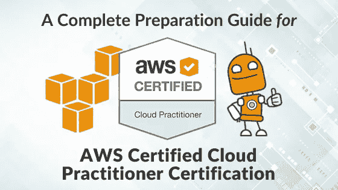
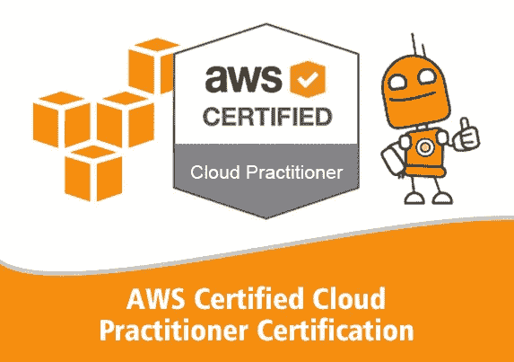
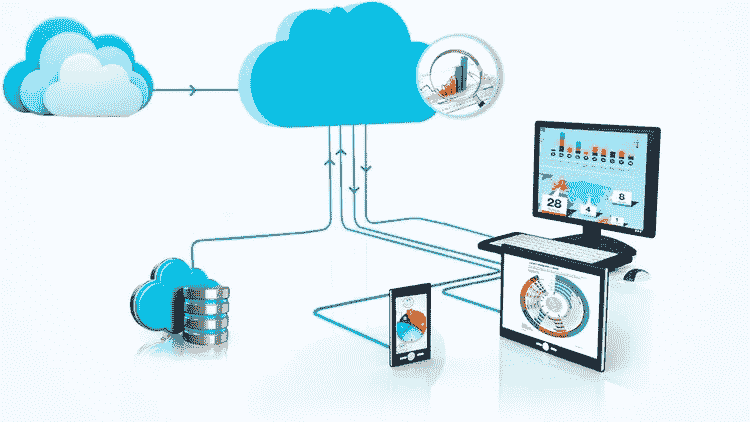
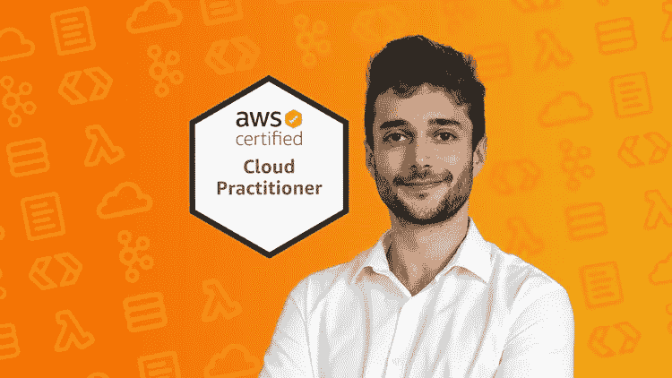
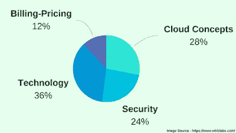

# 11 2023 年最佳 AWS 云从业者(CLF-C01)认证课程和实践测试

> 原文：<https://medium.com/javarevisited/10-best-aws-certified-cloud-practitioner-clf-c01-online-courses-and-practice-test-to-crack-ecc0f913091e?source=collection_archive---------0----------------------->

image_credit — AWS 课程 Udemy

伙计们，你们可能听说过关于云计算和 AWS 的讨论，云计算对于今天的程序员、开发人员、IT 专业人员和项目经理来说确实是必不可少的。

而且，如果你想从头开始了解云计算的概念，最好的办法就是去参加像 AWS 认证云从业者(CLF-C01)或 Azure 基础( [AZ-900](https://javarevisited.blogspot.com/2020/02/top-5-courses-to-crack-az-900-microsoft-azure-fundamentals-certification-exam.html) )这样的认证。

这些都是上云的第一块敲门砖，也是你在云计算上能拿到的最简单的认证。他们不仅概述了[云计算概念](https://javarevisited.blogspot.com/2019/07/top-5-online-courses-to-learn-cloud-computing-aws.html)，如 IaaS、Pass、Saas，还介绍了云的一般工作方式以及云的成本和灵活性优势。

AWS Cloud practicing 和 Azure Fundamental 的唯一区别是前者来自亚马逊，后者来自微软，他们专注于自己的云服务。如果您选择 AWS 作为您的云提供商，那么 AWS 认证云从业者认证是开始您的旅程的最佳方式。

*为什么是 AWS？*嗯，因为亚马逊网络服务，也被称为 [AWS](https://hackernoon.com/top-5-amazon-web-services-or-aws-courses-to-learn-online-free-and-best-of-lot-d94e192054b7) ，是最古老和最受欢迎的公共云平台，AWS 云专业人员也很受欢迎。

它还拥有最重要的市场和最高的现成云服务。由于越来越多的公司采用云来降低成本和提高敏捷性，因此需要 AWS 经验和技能，尤其是对认证专业人员而言。

越来越多的公司正在寻找能够帮助他们进行云迁移和管理云资产的认证人员。如果你正在寻找一份云计算工程师或 [DevOps 工程师](https://javarevisited.blogspot.com/2018/09/10-devops-courses-for-experienced-java-developers.html)的工作，特别是 AWS，那么我强烈建议你获得 AWS 认证。它不仅能让你很好地了解基本的 AWS 服务和云计算基础知识，还能让你在竞争中脱颖而出。

说实话，没有多少 AWS 认证的云从业者或 [AWS 解决方案架构师](https://dev.to/javinpaul/top-5-courses-to-pass-amazon-aws-certified-solutions-architect-associate-exam-saa-c01-in-2020-56g7)，此时需求远远高于供应，这是你赚钱的机会。

# 面向初学者的 2023 AWS 认证路线图

[云计算](/javarevisited/10-free-courses-to-learn-cloud-computing-for-beginners-4f3cd984ddb1)前景光明，AWS 是最强大、最全面、最安全的云提供商。从小型创业公司到独角兽，从小型公司到财富 500 强公司，每个人都使用 AWS 云解决方案来部署他们的应用程序。

如果你已经在准备 2023 年的 AWS 云从业者认证，正在寻找一些优秀的在线课程让自己准备，那么你来对地方了。

在本文中，我将分享一些最好的 AWS 认证课程，特别是针对 *AWS 认证云从业者*考试(CLF-C01)。

如果您希望获得所有的 [9 个 AWS 云认证](https://javarevisited.blogspot.com/2020/09/top-10-aws-certifications-for-cloud-professionals.html)，这里有一个很好的 **AWS 认证路线图**可以帮助您获得所有认证:

# 破解 AWS 认证云从业者认证的 11 大在线课程和练习题

为了不浪费你更多的时间，这里是我推荐的通过 AWS 认证云从业者(CLF-C01)考试的课程。这些是来自于 [Udemy](https://javarevisited.blogspot.com/2019/08/top-10-udemy-courses-and-certifications-for-programmers.html) 、 [Pluralsight](https://dev.to/javinpaul/pluralsight-vs-udemy-review-which-is-better-for-software-developers-276c) 、 [ZTM 学院](https://academy.zerotomastery.io/a/aff_fvgz1fnn/external?affcode=441520_zytgk2dn)、 [Coursera](https://academy.zerotomastery.io/a/aff_fvgz1fnn/external?affcode=441520_zytgk2dn) 、YouTube 以及其他专注于 AWS 认证云从业者认证的地方的一些最好的 AWS 课程。

他们涵盖了云基础、计算资源、存储、网络、安全性、定价、计费和可扩展性等大部分主题。一旦你完成了这些课程中的一门，你应该为你的 AWS 云从业者认证做好更充分的准备。

## 1.[终极 AWS 认证云从业者— 2023 年【全新】](https://click.linksynergy.com/deeplink?id=JVFxdTr9V80&mid=39197&murl=https%3A%2F%2Fwww.udemy.com%2Fcourse%2Faws-certified-cloud-practitioner-new%2F)

如果您很匆忙，想在一周内通过 AWS Cloud pracer 考试，并在寻找一门扎实的在线课程，涵盖考试主题、测验和期末准备练习测试等所有内容，那么您必须在 Udemy 上通过[夏羽·玛瑞克](https://click.linksynergy.com/deeplink?id=JVFxdTr9V80&mid=39197&murl=https%3A%2F%2Fwww.udemy.com%2Fuser%2Fstephane-maarek%2F)参加这门终极 AWS Cloud pracer 课程。

我非常喜欢这门课程，它结构严谨，内容新颖，信息丰富，不仅可以帮助您通过 AWS 云从业者认证，还可以在任何 AWS 环境中工作。
他甚至在一次 AWS 考试中得了 980 分/1000 分，这是惊人的。

简而言之，如果您想在 1 周或 1 个月内成为一名 AWS 认证的云从业者，您必须参加本课程。1 周虽然是一个现实的有点伸展的目标，并要求您把超过 12 小时，每天，但 1 个月是更现实的，很容易实现与 4 至 5 小时的研究，每天和使用本课程。

我强烈建议任何想成为经过认证的 AWS 云实践者的人学习本课程。

**以下是参加本课程的链接** — [最终 AWS 认证云从业者](https://click.linksynergy.com/deeplink?id=JVFxdTr9V80&mid=39197&murl=https%3A%2F%2Fwww.udemy.com%2Fcourse%2Faws-certified-cloud-practitioner-new%2F)

而且，如果你想在第一次尝试中通过考试，那么你也可以把这门课程和我的 AWS Cloud practice test 结合起来，我在 5 次完整测试中分享了 325 个问题。您可以用它来检查您的准备水平、速度和准确性，以及填补您学习中的空白。以下是它的外观:

## 2. [AWS 认证云从业人员 2023](https://click.linksynergy.com/deeplink?id=JVFxdTr9V80&mid=39197&murl=https%3A%2F%2Fwww.udemy.com%2Fcourse%2Faws-certified-cloud-practitioner%2F)

这是最好的在线课程之一，可以从零开始获得 AWS，并在 2023 年通过 AWS 认证的云从业者认证。它是全面的、最新的，还包含 AWS 云从业者考试的实践测试。

本课程是为没有编程或云经验的初学者设计的。它面向那些打算开始 AWS 之旅并获得 AWS 云从业者认证和学习[云计算概念的个人。](https://javarevisited.blogspot.com/2019/07/top-5-online-courses-to-learn-cloud-computing-aws.html)

通过简单易懂的视频和 **170+练习题**，本课程是获得 AWS 云从业者认证所需的全部内容。

谈到社交证明，超过 60，000 名学生信任这门课程，近 8000 名参与者对这门课程的平均评分为 4.4，这说明了这门课程的质量和内容。非常感谢 Zeal Vora 创建了这个课程。

**以下是加入本 AWS 课程的链接** — [AWS 认证云从业者 2023](https://click.linksynergy.com/deeplink?id=JVFxdTr9V80&mid=39197&murl=https%3A%2F%2Fwww.udemy.com%2Fcourse%2Faws-certified-cloud-practitioner%2F)

## 3. [AWS 认证云从业者 2023 培训训练营](https://click.linksynergy.com/deeplink?id=JVFxdTr9V80&mid=39197&murl=https%3A%2F%2Fwww.udemy.com%2Fcourse%2Fintro-to-aws-cloud-computing%2F)

这是 Udemy 上 AWS 云从业者考试的又一门优秀课程。它不仅包括视频讲座，还提供了两个完整的模拟测试练习。

它涵盖了所有 AWS 认证云从业者 CLF-C01 考试主题，如 AWS CLI、数据库、计算、AWS Lambda、无服务器、安全性、VPC 和深度联网。它也是最新的，每当考试增加新的题目时，你都会得到免费的更新。这是一件非常好的事情，因为 AWS 认证是不断变化的，如果你使用旧的课程进行准备，你可能会错过一些东西。

本课程还包含了作为云从业者如何从里到外使用 AWS 的实用知识。您将通过使用 AWS 免费层的实验来学习如何在指导下使用不同的 AWS 服务。它还包含每个模块中的测验和 400 多张 PDF 幻灯片供下载和离线阅读。谈到社会证明，已经有超过 17000 名学生注册了这门课程，1258 名参与者平均给了它 4.5 分。

**以下是加入 AWS 在线课程**的链接——[AWS 认证云从业者 2023 培训训练营](https://click.linksynergy.com/deeplink?id=JVFxdTr9V80&mid=39197&murl=https%3A%2F%2Fwww.udemy.com%2Fcourse%2Fintro-to-aws-cloud-computing%2F)

## 4. [AWS 认证云从业者终极考试培训 2023](https://click.linksynergy.com/deeplink?id=JVFxdTr9V80&mid=39197&murl=https%3A%2F%2Fwww.udemy.com%2Fcourse%2Faws-certified-cloud-practitioner-training-course%2F)

这是另一门为 Udemy 的亚马逊 AWS 认证云从业者考试做准备的优秀课程。它太好了，我不得不推荐它。这也是最全面和最新的课程之一，您将在一个地方找到理论讲座、动手实验、练习题、测验和导游。

Neal Davis 是 AWS 认证解决方案架构师&认证开发人员，来自 Digital Cloud Training，也是本课程的作者，他在将复杂的主题分解为易于理解且结构良好的部分方面做得非常出色，这些部分由逻辑图支持，有助于您将所学内容可视化。

由于有超过 **90 项服务**，要找到本次 AWS 认证云从业者考试涵盖哪些服务并不容易。尽管如此，本课程也对这一点进行了检查，并且它与不断变化的 AWS 认证云从业者考试密切相关。

您将在不偏离 CLF-C01 考试大纲的情况下，学习从开立您的第一个 AWS 免费等级账户到启动核心 AWS 服务的所有内容。

**以下是参加本课程的链接** — [AWS 认证云从业者终极考试培训 2023](https://click.linksynergy.com/deeplink?id=JVFxdTr9V80&mid=39197&murl=https%3A%2F%2Fwww.udemy.com%2Fcourse%2Faws-certified-cloud-practitioner-training-course%2F)

它还包含 620 个练习题，这可能是 AWS 云从业者练习题的最大集合。他们还在有限的时间内提供对数字云培训网站上的考试模拟器的免费访问(需要注册)。

在线考试模拟器从 500 多个不同的问题中随机选择 65 个问题，模拟真实的 AWS 考试环境。总的来说，这是一门为 AWS 云从业者考试做好准备的极好的课程。

## [ZTM 学院的 5 名 AWS 认证云从业者](https://academy.zerotomastery.io/a/aff_1f8vmvjz/external?affcode=441520_zytgk2dn)

这是另一个令人惊叹的、最新的、关注度较低的课程，既要学习 AWS 云计算，也要通过 2023 年的 AWS 云从业者考试。

在这个长达 7 小时的高质量 AWS 课程中，您将学习 AWS 基础知识以及先进的云技术(来自一位拥有 15 年以上经验的专家！)，以便您能够通过认证考试，并被聘为云工程师！

以下是您将在本 AWS 课程中学到的重要内容:

*   项目中 AWS 技术的实践学习和演示
*   学习并掌握云架构设计原则
*   了解云的基础知识和业务，包括安全性、可扩展性和 AWS 的经济性
*   了解整个亚马逊网络服务云生态系统，包括 EC2 实例、S3 存储、ElasticCache、RDS +等等

除此之外，你还会得到一个完整的模拟实际考试的模拟考试，包括每个答案的详细解释。

本课程最大的好处是，您将准确地了解以高效和有效的方式通过认证考试所需的内容。您还将找到策略、提示、考试指南和练习题，并获得自信地申请 AWS 云工作的技能和理解

**以下是参加 AWS 课程的链接**——[ZTM 学院 AWS 认证云从业者](https://academy.zerotomastery.io/a/aff_1f8vmvjz/external?affcode=441520_zytgk2dn)

顺便说一下，你需要一个 [**ZTM 会员**](https://academy.zerotomastery.io/a/aff_c0gnlvf7/external?affcode=441520_zytgk2dn) 来观看这个课程，这个课程每月花费大约 39 美元，但是也提供了许多像这样的超级吸引人和有用的课程。您还可以使用我的代码 **FRIENDS10** 获得您选择的任何套餐的 10%折扣。

 [## 学习需求技能。被录用。推进你的事业。|零到精通

### 不要在无聊、过时的教程上浪费时间。加入 750，000 多名学生的行列，学习受欢迎的技能，并在…

academy.zerotomastery.io](https://academy.zerotomastery.io/a/aff_c0gnlvf7/external?affcode=441520_zytgk2dn) 

## 6. [AWS 认证云从业者:您需要知道的一切](https://pluralsight.pxf.io/c/1193463/424552/7490?u=https%3A%2F%2Fwww.pluralsight.com%2Fcourses%2Faws-certified-cloud-practitioner)

这是一门简短但出色的课程，旨在为 Pluralsight 上的 AWS 认证云从业者考试做准备。这门课程最棒的地方是讲师 David Tucker，他是一名技术架构师和云顾问。他的日常工作是为一个组织的云资产提供建议，这体现在他解释核心 AWS 服务的时候。

在本课程中，您不仅将学习 IasS、PasS、SaaS 等基础云计算概念，还将学习获得 [AWS 认证云从业者认证](https://www.java67.com/2020/07/top-5-aws-certified-cloud-practitioner-courses-and-practice-test.html)所需的 AWS 服务。

您将首先学习云计算的核心概念及其与传统数据中心的区别。接下来，您将回顾考试中涵盖的核心 AWS 服务。

最后，你将复习考试技巧，这将提高你的整体分数。学完本课程后，您将具备成功完成 AWS 认证云从业者考试所需的知识和技能。

**以下是参加 Pluralsight AWS 课程的链接** — [AWS 认证云从业者:你需要知道的一切](https://pluralsight.pxf.io/c/1193463/424552/7490?u=https%3A%2F%2Fwww.pluralsight.com%2Fcourses%2Faws-certified-cloud-practitioner)

不过，你需要一个 [Pluralsight 会员](https://javarevisited.blogspot.com/2019/10/udemy-vs-pluralsight-review-which-is-better-to-learn-code.html)才能进入这门课程，费用大约是每月 29 美元或每年 299 美元(节省 14%)。如果你没有，我建议你买一个来促进你的学习，因为你需要让自己跟上科技的发展，而 Pluralsight 在这方面有所帮助。我是 Pluralsight 的会员，如果你能在一年内为学习投入那么多钱，我也建议你加入它。无论如何，即使你没有 Pluralsight 会员资格，你仍然可以通过注册 [**10 天免费试用**](https://pluralsight.pxf.io/c/1193463/424552/7490?u=https%3A%2F%2Fwww.pluralsight.com%2Flearn) 来免费学习这门课程，这将提供 200 分钟的时间来学习他们所有的课程。

 [## 对个人来说

### Pluralsight 帮助个人学习者获得掌握最新软件开发所需的技术技能…

pluralsight.pxf.io](https://pluralsight.pxf.io/c/1193463/424552/7490?u=https%3A%2F%2Fwww.pluralsight.com%2Flearn) 

## 7.[免费 AWS 认证云从业者学习课程(85+视频！)作者:ExamPro](https://www.youtube.com/watch?v=dh00WNoQDNk&list=PLBfufR7vyJJ4fOplWPOtYqRyQ6YPMsBsF) 的安德鲁·布朗

ExamPro 的首席执行官兼 AWS 培训师安德鲁·布朗(Andrew Brown)在 Youtube 上为 AWS 认证创建了许多学习材料，而这门课程是你可以在 Youtube 上观看的 85+个免费讲座的集合。

最好学习最新的材料，并涵盖所有主题，如基本服务、计费、计算资源、存储、全球基础设施、部署、安全性以及此认证所需的一般技术概述。

如果你不介意从免费资源中学习，那么这是你首次尝试破解 AWS 认证云从业者考试的绝佳学习资料。为了获得最佳效果，我建议将本课程与亚马逊、Whizlabs 或 Exampro 本身的一些 AWS 认证云从业者实践测试结合起来。

他们有自己的 LMS 平台，有抽认卡、白皮书摘要、旅程路径和考试模拟器，可以帮助你做好各种 AWS 认证，包括 Cloud Practioner one。

这是你可以免费观看的 Youtube 课程

## 8.[来自 Whizlabs 的 AWS 认证云从业者课程](https://shrsl.com/25qj6)

除了实践测试，Whizlabs 还为 AWS 云从业者认证参与者提供了在线课程。该测试包含 6 个多小时的培训视频，涵盖所有考试目标(100%涵盖教学大纲)。

它还有 11 个 AWS 认证云从业者考试实验室，为您提供一些基本 AWS 服务的实践和体验，如 IAM、EC3、S3、RDS 和 DynamoDB 等。

**这是加入本 Whizlabs AWS 课程的链接**—[whiz labs 的 AWS 认证云从业者课程](https://shrsl.com/25qj6)

## 9.[来自 Whizlabs 的 AWS 认证云从业者实践测试](https://shrsl.com/25qiz%20rel=)

模拟测试是通过任何 AWS 认证不可或缺的一部分，它通常是成功和失败候选人之间的区别。说到购买考试模拟器或模拟考试，Whizlabs 是我值得信赖的去处。

我过去用 Whizlabs 通过了很多 Java 认证，他们的 AWS 云从业者测试也是同样的质量。

这个软件包包含 3 套模拟测试，每个实验 65 个问题。您可以使用这些测试来评估通过考试所需的速度和准确性。这也会帮助你找到自己的强项和弱项。

还包含 AWS 认证云从业者考试的 11 个实验室，会给你一些动手体验。此外，对每个问题都提供了详尽的解释，您将可以无限制地访问，这意味着新问题无需额外付费。简而言之，您可以将本练习测试与任何其他课程一起使用，为 AWS 云从业者考试做好准备。

**这是参加 AWS 实践测试**的链接— [来自 Whizlabs 的 AWS 认证云从业者实践测试](https://shrsl.com/25qiz%20rel=)

## 10. [AWS 认证云从业者:2023 年 6 次全实践考试](https://click.linksynergy.com/deeplink?id=JVFxdTr9V80&mid=39197&murl=https%3A%2F%2Fwww.udemy.com%2Fcourse%2Faws-certified-cloud-practitioner-practice-test%2F)

这是 Udemy 的 AWS 认证云从业者考试的另一个综合实践测试，您可以认真准备。

本课程有 6 个模拟测试，每个测试有 65 个问题，这对练习和提高每个考试主题的知识非常有用。

它们也是定时测试，因此您可以使用它们来提高考试所需的速度和准确性。

**以下是参加本次实践考试的链接** — [AWS 认证云从业者:6 次全实践考试 2023](https://click.linksynergy.com/deeplink?id=JVFxdTr9V80&mid=39197&murl=https%3A%2F%2Fwww.udemy.com%2Fcourse%2Faws-certified-cloud-practitioner-practice-test%2F)

## 11.[实践考试| AWS 认证云从业者 CLF-C01](https://click.linksynergy.com/deeplink?id=JVFxdTr9V80&mid=39197&murl=https%3A%2F%2Fwww.udemy.com%2Fcourse%2Fpractice-exams-aws-certified-cloud-practitioner%2F)

这是 2023 年通过 AWS 认证云从业者 CLF-C01 认证的另一个最佳实践问题。由 Stéphane Maarek 创建的这 325 个独特的高质量问题将深入测试您的知识，它们的详细解释将帮助您填补学习中的空白。

这些模拟考试由夏羽·马瑞克和阿布舍克·辛格共同编写，他们将通过 17 项 AWS 认证的集体经验带到了桌面上。

这 325 个问题分为 5 个全程模拟 AWS 认证考试。这里有一个样题，看看你能不能回答出来:

以下哪一项是允许内部应用程序访问 AWS 云数据的混合存储服务？

1.  AWS 存储网关
2.  AWS 直接连接
3.  AWS 雪球
4.  亚马逊 EBS

**如果你知道答案，请在评论中告诉我们，别忘了查看课程页面上的解释，一个很长很详细的解释。**

下面是加入 this occurs 查看解释的链接- [实践考试| AWS 认证云从业者 CLF-C01](https://click.linksynergy.com/deeplink?id=JVFxdTr9V80&mid=39197&murl=https%3A%2F%2Fwww.udemy.com%2Fcourse%2Fpractice-exams-aws-certified-cloud-practitioner%2F)

# AWS 认证云从业者认证提示

以下是一些关于 AWS 认证云从业者(CLF-C01)需要了解的基本情况:

1。AWS 认证云从业者考试的费用是 100 美元，您也可以从亚马逊额外支付 20 美元购买实践考试。

2。以下是通过 AWS 云从业者认证的一些重要主题:

3.您将有 90 分钟的时间完成考试

4。你可以在考试中心、办公室或家里参加在线监考，这意味着你需要在笔记本电脑上安装一个网络摄像头。

5。格式为多选多答。
⑥
。及格分数是 1000 分中的 700 分。你的分数显示了你在考试中的整体表现以及你是否及格。分级评分模型用于使难度水平略有不同的多种考试形式的分数相等。

7。您可以从 AWS 认证门户网站[这里](https://d1.awsstatic.com/training-and-certification/Docs%20-%20Cloud%20Practitioner/AWS_Certified_Cloud_Practitioner_Exam_Guide_v2.1.pdf)下载考试指南。

8。您也可以点击[此处](https://d1.awsstatic.com/training-and-certification/Docs%20-%20Cloud%20Practitioner/AWS%20Certified%20Cloud%20Practioner_Sample%20Questions_v1.1_FINAL.PDF)从 AWS 下载一些示例问题 pdf。

9。常见的一个问题是，通过这个认证需要多少时间？嗯，亚马逊推荐 6 个月的 AWS 工作经验，但这不是强制性的。如果你能每天工作 8 到 10 个小时，那么你应该准备好在一周内通过考试。或者，2 周的适度努力足以通过这次考试。
10
。这里有一个漂亮的表格，上面有一些关于 [AWS 认证云从业者考试](/javarevisited/7-free-aws-cloud-practitioner-certification-courses-to-crack-exam-in-2021-f13d6a996019) (CLF-C01)的重要信息:

以上是关于 2023 年通过 AWS 认证云从业者(CLF-C01)考试的**最佳课程。正如我所说，这是您可以获得的最简单的 AWS 云认证，它可以是学习 AWS 基础知识和云计算概念的绝佳平台。**

我建议每个开发人员、架构师、项目经理、销售人员、技术人员、业务分析师和 IT 专业人员都去参加这个认证。

了解云计算在当今世界绝对至关重要，本课程将为你提供足够的知识和经验，与你的同行和客户交流。通过完成这项考试，你将获得的认可将对你的职业生涯大有帮助。

如果你现在只想做一件事，我建议加入 Udemy 上夏羽·马瑞克的 [**终极 AWS 认证云从业者**](https://click.linksynergy.com/deeplink?id=JVFxdTr9V80&mid=39197&murl=https%3A%2F%2Fwww.udemy.com%2Fcourse%2Faws-certified-cloud-practitioner-new%2F) 课程，开始你的云计算之旅。

 [## 成为 AWS 云从业者。Ace 认证。被录用。|零到精通

### 该 AWS 云从业者课程涵盖 2023 年的所有新信息和最佳实践，重点关注效率…

academy.zerotomastery.io](https://academy.zerotomastery.io/a/aff_1f8vmvjz/external?affcode=441520_zytgk2dn) 

面向 **IT 专业人员**和 Java 程序员的其他**认证资源**

*   [如何通过 Azure 云架构师(AZ-300)认证](https://javarevisited.blogspot.com/2019/07/top-5-courses-to-crack-azure-architecture-technologies-certification-az-300-exam.html)
*   [如何破解甲骨文 2023 年 Java 认证](https://medium.freecodecamp.org/how-to-pass-oracles-java-certifications-a-practical-guide-for-developers-e9b607ba6173)
*   [Spring 认证对工作和事业有帮助吗？](https://javarevisited.blogspot.com/2017/07/does-spring-certification-help-in-job-and-career.html)
*   [如何通过 Spring Core Professional 5.0 认证](https://javarevisited.blogspot.com/2018/08/how-to-crack-spring-core-professional-certification-exam-java-latest.html)
*   [10 门免费学习数据结构和算法的课程](http://www.java67.com/2019/02/top-10-free-algorithms-and-data.html)
*   [破解 AWS 解决方案架构师认证的 5 大课程](https://javarevisited.blogspot.com/2019/05/top-5-courses-to-crack-aws-solutions-architect-associate-certification-exam-SAA-C01.html)
*   [如何在 2023 年成为 DevOps 工程师](https://javarevisited.blogspot.com/2018/09/the-2018-devops-roadmap-your-guide-to-become-DevOps-Engineer.html)
*   每个软件开发人员都应该学习的 10 件事
*   [通过 AWS 解决方案架构师助理考试的 5 次免费模拟测试](https://javarevisited.blogspot.com/2019/08/top-5-free-aws-solution-architect-Associate-certification-dumps-practice-questions.html)
*   [学习 Linux 命令行的 5 门免费课程](https://hackernoon.com/top-5-free-linux-courses-for-programmers-4a433b4edade)
*   [程序员学习 Git 的 5 大免费课程](https://javarevisited.blogspot.com/2018/01/5-free-git-courses-for-programmers-to-learn-online.html)
*   [OCAJP 和 OCPJP 考试 10 道免费样题](http://www.java67.com/2017/05/10-free-java-8-certification-sample-questions-OCAJP8-OCPJP8-Mock-Exams.html)
*   [如何在 2023 年成为 AWS 认证开发者](https://javarevisited.blogspot.com/2020/05/top-5-courses-to-crack-aws-certified-developer-associate-certification-exam.html)
*   [如何通过 AWS 解决方案架构师专业考试](https://javarevisited.blogspot.com/2020/04/top-5-course-to-crack-aws-solution-architect-professional-sap-c01-certification-exam.html)
*   [如何成为 AWS 认证的系统运行管理员](https://javarevisited.blogspot.com/2020/07/top-5-courses-to-pass-aws-sysops-administrator-associate-certification-exam.html)
*   [如何在 1 周内通过 Azure 基础认证](https://javarevisited.blogspot.com/2020/04/how-to-crack-microsoft-azure-fundamentals-certification-az-900-exam.html)

感谢您阅读本文。如果您发现这些 AWS 课程有助于通过 *AWS 认证云从业者(CLF-C01)考试，*请与您的朋友和同事分享。如果您有任何问题或反馈，请留言。

**附言——**如果你是 AWS 世界的新手，并希望通过一些免费的 AWS 培训课程开始你的旅程，那么你也可以查看这份清单 [**10 个免费的 AWS 培训课程**](https://www.java67.com/2020/08/top-5-free-courses-to-pass-aws-cloud.html) ，从头开始学习亚马逊网络服务。

 [## 我最喜欢的学习亚马逊网络服务(AWS)和云计算的初学者课程

### 大家好，如果你想学习亚马逊网络服务，俗称 AWS，并寻找一些优秀的资源…

medium.com](/javarevisited/top-10-courses-to-learn-amazon-web-services-aws-cloud-in-2020-best-and-free-317f10d7c21d)