# 2023 年学习 AWS、GCP 和 Azure Cloud 的 11 个最佳 Coursera 课程和认证

> 原文：<https://medium.com/javarevisited/10-best-aws-google-cloud-and-azure-courses-and-certification-from-coursera-to-join-in-2021-5c5e2029a8e7?source=collection_archive---------0----------------------->

## 这些是 AWS、谷歌云平台、微软 Azure 和云计算的最佳 Coursera 课程

[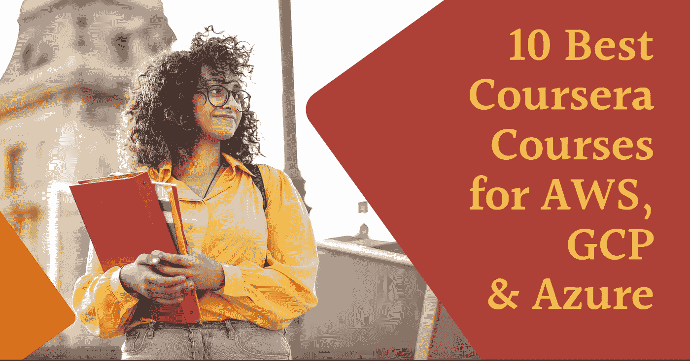](https://click.linksynergy.com/deeplink?id=JVFxdTr9V80&mid=40328&murl=https%3A%2F%2Fwww.coursera.org%2F)

大家好，如果你热衷于学习云计算和基本的云平台，如 AWS、Google Cloud、Microsoft Azure，并寻找最好的 Coursera 认证、课程、专业和项目，那么你来对地方了。

早些时候，我已经分享了最好的 Coursera 课程和证书，以学习[人工智能](https://javarevisited.blogspot.com/2020/08/top-10-coursera-courses-and-certification-for-artificial-intelligence-and-machine-learning.html)、 [Python](https://javarevisited.blogspot.com/2020/02/10-best-coursera-courses--for-python.html) 、[软件开发](https://javarevisited.blogspot.com/2020/08/top-10-coursera-courses-to-learn-sofware-development-computer-science.html)和 [Web 开发](https://javarevisited.blogspot.com/2020/08/top-10-coursera-certifications-to-learn-web-development.html#axzz6WbpwHhYm)，今天，我将分享最好的 Coursera 云计算技能课程，如 AWS、GCP 和 Azure，来自知名大学如 Illionis 和科技公司如亚马逊、谷歌云等。

云计算是程序员、软件开发人员和任何 IT 专业人员都需要的技能，包括支持工程师、系统管理员，甚至 QA 和业务分析师。

在过去的几年中，越来越多的公司已经转移到了云，大多数技术开发都在那里进行，因此云计算已经成为服务于技术世界的一项基本技能。如果你想成为云开发者或 T2 管理员，或者只是想了解云计算，那么你来对地方了。

过去我分享过最好的 [AWS](https://javarevisited.blogspot.com/2020/05/top-5-amazon-web-services-aws-courses-for-beginners-and-experienced-programmers.html) 、 [GCP](https://javarevisited.blogspot.com/2019/07/top-5-google-cloud-platform-gcp-courses-certifications-online.html) 、[微软 Azure 在线课程](https://javarevisited.blogspot.com/2020/02/top-5-courses-to-crack-az-900-microsoft-azure-fundamentals-certification-exam.html)，今天我分享**用 AWS 和 Google 云平台学习云计算的最佳 Coursera 课程。**

[Coursera](https://www.coursera.org/)是最受欢迎的在线学习网站之一，让你向世界顶尖大学和顶尖 IT 公司学习。这个列表中的课程是由像 IBM、Google 和 Amazon 这样的公司创建的。这意味着你将从最权威的来源学习。

[云计算](/javarevisited/5-best-cloud-computing-courses-to-learn-in-2020-f5f091159401)是拥有数百万用户的大型行业之一，吸引了来自世界各地的投资者，与 IT 领域的其他服务或行业相比，它创造了令人难以置信的收入，因为所有组织都需要托管自己的网站和服务来吸引和联系他们的客户。

认证可以让你的员工获得聘用，拥有职业生涯，或者远离竞争，因此，许多平台来到现实世界，为许多行业提供一些在线课程，云计算就是其中之一。

今天你将在这篇文章中看到 Coursera 的几门云计算课程，这些课程能够在完成课程后获得认证，并涵盖许多云服务，如[亚马逊 AWS](/javarevisited/10-best-aws-certified-cloud-practitioner-clf-c01-online-courses-and-practice-test-to-crack-ecc0f913091e) 和[谷歌云](https://www.java67.com/2020/08/top-5-free-courses-to-become-google.html)。

# 用 AWS 和 Google 云平台学习云计算的 11 门最佳 Coursera 课程

这里列出了 2023 年你可以参加的[最佳 Coursera 课程](/javarevisited/18-coursera-courses-you-can-join-in-2020-to-learn-from-the-worlds-top-tech-companies-google-74af46967d1e?source=collection_home---4------0-----------------------)、认证、专业化和指导项目，以通过 [AWS](/javarevisited/top-5-online-courses-to-become-aws-certified-developer-associate-in-2020-best-of-lot-9b22baf84ca8) 和[谷歌云平台](https://www.java67.com/2020/10/5-free-courses-to-pass-google-cloud-professional-data-engineer-certification-exam.html)学习云计算。

这些课程由知名大学和公司提供，如 IBM、Google 和 AWS 本身。大多数课程都是**免费审核**的，这意味着你可以免费学习，但你需要支付认证、测验和评估的费用。

## 1. [AWS 基础知识](https://coursera.pxf.io/c/3294490/1164545/14726?u=https%3A%2F%2Fwww.coursera.org%2Fspecializations%2Faws-fundamentals)

学习 Amazon web services 的最佳专业知识由 Amazon 自己提供，从初学者开始，例如 AWS 基础架构如何构建和工作，然后解决安全问题，如何保护您的应用程序，然后学习如何将您的工作迁移到云，然后向您介绍 AWS 无服务器应用程序。

**以下是参加本课程** — [AWS 基础](https://coursera.pxf.io/c/3294490/1164545/14726?u=https%3A%2F%2Fwww.coursera.org%2Fspecializations%2Faws-fundamentals)的链接

[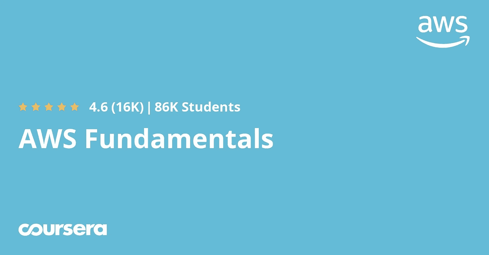](https://coursera.pxf.io/c/3294490/1164545/14726?u=https%3A%2F%2Fwww.coursera.org%2Fspecializations%2Faws-fundamentals)

除了 AWS 课程，Coursera 现在还与 AWS 合作增加了 AWS 应用开发课程，如

1.  [**AWS 专业化上用 Java 开发现代应用**](https://coursera.pxf.io/c/3294490/1164545/14726?u=https%3A%2F%2Fwww.coursera.org%2Fspecializations%2Faws-java-serverless-development)
2.  [**现代应用开发用 Node.js 对 AWS 进行专业化**](https://coursera.pxf.io/c/3294490/1164545/14726?u=https%3A%2F%2Fwww.coursera.org%2Fspecializations%2Faws-nodejs-serverless-development)
3.  [**现代应用开发与 Python 在 AWS 上的专业化**](https://coursera.pxf.io/c/3294490/1164545/14726?u=https%3A%2F%2Fwww.coursera.org%2Fspecializations%2Faws-python-serverless-development)

如果您是一名应用程序开发人员，那么我也建议您根据您是使用 Java、Node.js 还是 Python 进行应用程序开发来看一看这些课程。

顺便说一下，如果你计划参加多个 Coursera 课程或专业，那么考虑参加 [**Coursera Plus 订阅**](https://coursera.pxf.io/c/3294490/1164545/14726?u=https%3A%2F%2Fwww.coursera.org%2Fcourseraplus) ，它为你提供无限制的访问他们最受欢迎的课程、专业、专业证书和指导项目的机会，每年 399 美元。考虑到 Coursera 认证的价值和这些课程的质量，我认为这是值得的。

<https://coursera.pxf.io/c/3294490/1164545/14726?u=https%3A%2F%2Fwww.coursera.org%2Fcourseraplus>  

## 2.[微软 Azure 基础 AZ-900 考试准备专业化](https://coursera.pxf.io/c/3294490/1164545/14726?u=https%3A%2F%2Fwww.coursera.org%2Fspecializations%2Fmicrosoft-azure-fundamentals-az-900)

如果你想学习微软 Azure 平台，同时你也想准备 AZ-900 或 Azure 基础考试，这是最好的 Coursera 课程。

本课程将提供关键 Microsoft Azure 概念的基础知识，例如:

1.  核心微软 Azure 服务
2.  核心解决方案和管理工具；
3.  一般安全和网络安全；
4.  治理、隐私和合规性特征；
5.  微软 Azure 成本管理和服务水平协议。

这门课程非常适合刚开始使用 Microsoft Azure 的 IT 人员或任何想学习的人。它还将为您参加 AZ-900: Microsoft Azure 基础知识考试做准备。完成专业化认证后，您将获得实际 AZ-900 考试的 50%折扣券。

**这里是加入本课程的链接—** [微软 Azure 基础知识 AZ-900 考试准备专业化](https://coursera.pxf.io/c/3294490/1164545/14726?u=https%3A%2F%2Fwww.coursera.org%2Fspecializations%2Fmicrosoft-azure-fundamentals-az-900)

[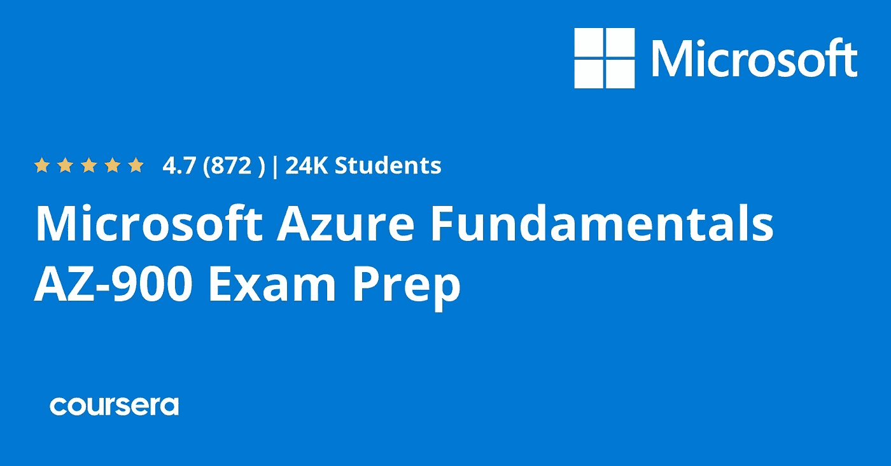](https://coursera.pxf.io/c/3294490/1164545/14726?u=https%3A%2F%2Fwww.coursera.org%2Fspecializations%2Fmicrosoft-azure-fundamentals-az-900)

## 3.[IBM 在 Coursera 上介绍云计算](https://coursera.pxf.io/c/3294490/1164545/14726?u=https%3A%2F%2Fwww.coursera.org%2Flearn%2Fintroduction-to-cloud)

IBM 提供的另一个很好的课程是学习云计算，从云服务的定义和革命开始，然后是云计算模型，如 Saas Paas 和 Laas，以及云组件，如虚拟化、安全性和加密，以保护您的应用程序。

**这里是加入本课程**——[云计算简介](https://coursera.pxf.io/c/3294490/1164545/14726?u=https%3A%2F%2Fwww.coursera.org%2Flearn%2Fintroduction-to-cloud)的链接

[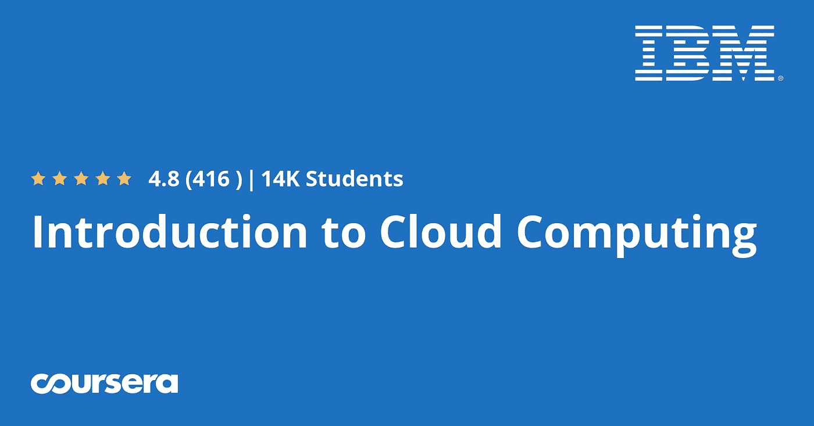](https://coursera.pxf.io/c/3294490/1164545/14726?u=https%3A%2F%2Fwww.coursera.org%2Flearn%2Fintroduction-to-cloud)

除此之外，IBM 还有一个 [**全栈云开发者认证**](https://coursera.pxf.io/c/3294490/1164545/14726?u=https%3A%2F%2Fwww.coursera.org%2Fprofessional-certificates%2Fibm-full-stack-cloud-developer) 项目，对于希望在 2023 年学习云原生开发的全栈开发者来说非常棒。

<https://coursera.pxf.io/c/3294490/1164545/14726?u=https%3A%2F%2Fwww.coursera.org%2Fprofessional-certificates%2Fibm-full-stack-cloud-developer>  

## 4.[使用谷歌云的云架构](https://coursera.pxf.io/c/3294490/1164545/14726?u=https%3A%2F%2Fwww.coursera.org%2Fprofessional-certificates%2Fgcp-cloud-architect)

学习谷歌云架构的最佳培训课程之一是由谷歌自己提供的，从学习其云服务的核心基础设施开始，然后了解各种组件，如网络以及其他一些服务扩展和自动化等。

**这是加入本课程**—[Google Cloud 云架构](https://coursera.pxf.io/c/3294490/1164545/14726?u=https%3A%2F%2Fwww.coursera.org%2Fprofessional-certificates%2Fgcp-cloud-architect)的链接

[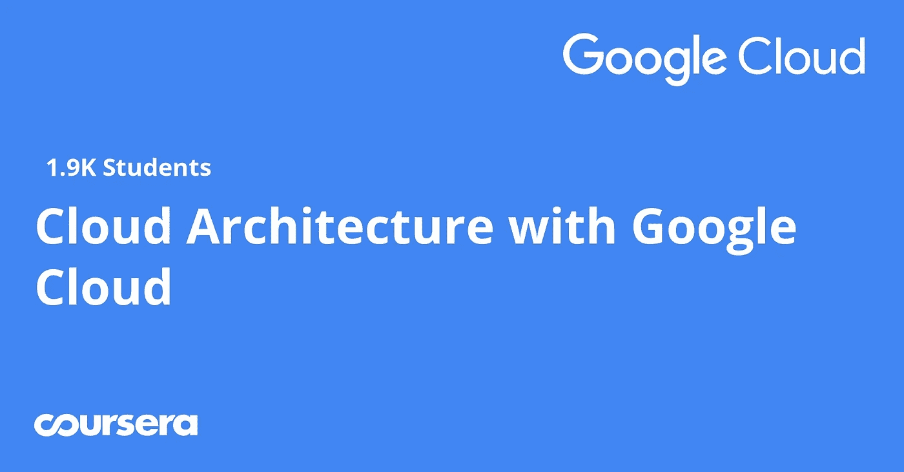](https://coursera.pxf.io/c/3294490/1164545/14726?u=https%3A%2F%2Fwww.coursera.org%2Fprofessional-certificates%2Fgcp-cloud-architect)

除了这个谷歌云架构课程，Coursera 还有许多课程和专业与各种谷歌认证紧密相关，如 [**谷歌云数字领导者**](https://coursera.pxf.io/c/3294490/1164545/14726?u=https%3A%2F%2Fwww.coursera.org%2Fprofessional-certificates%2Fgoogle-cloud-digital-leader-training)[**谷歌云工程师**](https://coursera.pxf.io/c/3294490/1164545/14726?u=https%3A%2F%2Fwww.coursera.org%2Fprofessional-certificates%2Fcloud-engineering-gcp)[**谷歌云开发工程师**](https://coursera.pxf.io/c/3294490/1164545/14726?u=https%3A%2F%2Fwww.coursera.org%2Fprofessional-certificates%2Fsre-devops-engineer-google-cloud) 等等。

<https://coursera.pxf.io/c/3294490/1164545/14726?u=https%3A%2F%2Fwww.coursera.org%2Fprofessional-certificates%2Fsre-devops-engineer-google-cloud>  

如果你正在准备这些认证，那么你应该检查这些课程，因为这些课程与教学大纲紧密相关，并且是由谷歌专家自己准备的。

## 5.[伊利诺伊大学的云计算](https://coursera.pxf.io/c/3294490/1164545/14726?u=https%3A%2F%2Fwww.coursera.org%2Fspecializations%2Fcloud-computing)

伊利诺伊大学提供的云计算硕士学位的一部分，面向中级人士，从一些概念开始，如 [NoSQL 数据库](/javarevisited/5-best-mongodb-courses-to-learn-nosql-for-beginners-in-2020-42df5af5496c)以及基础设施、[大数据](/javarevisited/top-10-courses-to-learn-big-data-and-hadoop-best-of-lot-23ef8691633f)和数据分析，然后转移到云网络，最后是一个顶点项目。

**这里是加入本课程** — [云计算](https://coursera.pxf.io/c/3294490/1164545/14726?u=https%3A%2F%2Fwww.coursera.org%2Fspecializations%2Fcloud-computing)的链接

[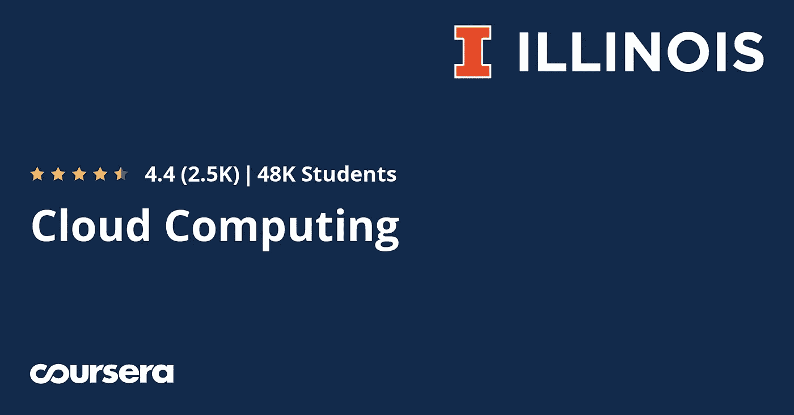](https://coursera.pxf.io/c/3294490/1164545/14726?u=https%3A%2F%2Fwww.coursera.org%2Fspecializations%2Fcloud-computing)

## 6. [AWS:从头发布一个 NodeJS 网站](https://coursera.pxf.io/c/3294490/1164545/14726?u=https%3A%2F%2Fwww.coursera.org%2Fprojects%2Faws-publish-nodejs-website-from-scratch)

这个基于项目的课程将向您展示如何使用 SSH 客户端将 Node.js 网站部署到 Amazon AWS Lightsail，以便您创建 amazon Lightsail 实例，然后配置 SSH 客户端协议，然后使用 Apache webserver 将您的网站文件部署或上传到服务器，等等。

**这里是加入本课程的链接** — [AWS: *从头开始发布*一个 NodeJS 网站](https://coursera.pxf.io/c/3294490/1164545/14726?u=https%3A%2F%2Fwww.coursera.org%2Fprojects%2Faws-publish-nodejs-website-from-scratch)

## 6.[云计算基础知识(云 101)](https://coursera.pxf.io/c/3294490/1164545/14726?u=https%3A%2F%2Fwww.coursera.org%2Flearn%2Fcloud-computing-basics)

学习云计算基础知识的另一个很好的课程是从云及其基础架构的定义开始，然后是 Laas、Paas、Saas 等托管服务的级别，以及不同的部署模式公共与私有，您将会看到许多云提供商之间的比较。

**这是加入本课程的链接**——[云计算基础知识(云 101)](https://coursera.pxf.io/c/3294490/1164545/14726?u=https%3A%2F%2Fwww.coursera.org%2Flearn%2Fcloud-computing-basics)

[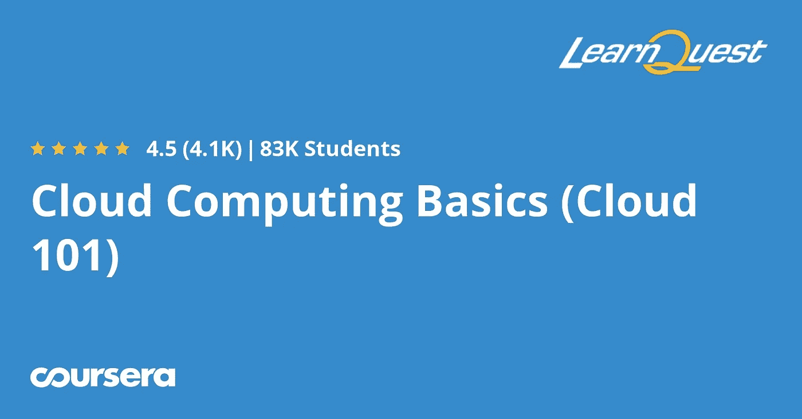](https://coursera.pxf.io/c/3294490/1164545/14726?u=https%3A%2F%2Fwww.coursera.org%2Flearn%2Fcloud-computing-basics)

## 7.[先进的系统安全设计](https://coursera.pxf.io/c/3294490/1164545/14726?u=https%3A%2F%2Fwww.coursera.org%2Fspecializations%2Fadvanced-system-security-design)

学习云中安全性的最佳培训课程首先学习云的基础知识，然后了解 DDoS 攻击和如何防御这些攻击，以及 TOR 网络内部的隐私和如何安全地访问您的 web 文档和网络资源。

**这里是加入本课程**——[高级系统安全设计](https://coursera.pxf.io/c/3294490/1164545/14726?u=https%3A%2F%2Fwww.coursera.org%2Fspecializations%2Fadvanced-system-security-design)的链接

[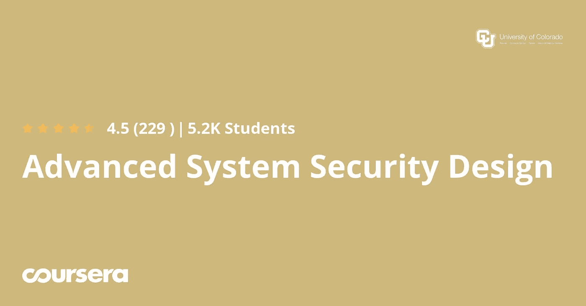](https://coursera.pxf.io/c/3294490/1164545/14726?u=https%3A%2F%2Fwww.coursera.org%2Fspecializations%2Fadvanced-system-security-design)

## 8.[谷歌云中的网络](https://coursera.pxf.io/c/3294490/1164545/14726?u=https%3A%2F%2Fwww.coursera.org%2Fspecializations%2Fnetworking-google-cloud-platform)

这是一门非常棒的课程，适合有网络背景并希望迁移到云的人，您将从了解谷歌云服务的核心开始，然后探索谷歌云网络，如谷歌虚拟专用网和云 VPC，以及共享网络的防火墙等。

**这是参加本课程** — [谷歌云网络](https://coursera.pxf.io/c/3294490/1164545/14726?u=https%3A%2F%2Fwww.coursera.org%2Fspecializations%2Fnetworking-google-cloud-platform)的链接

[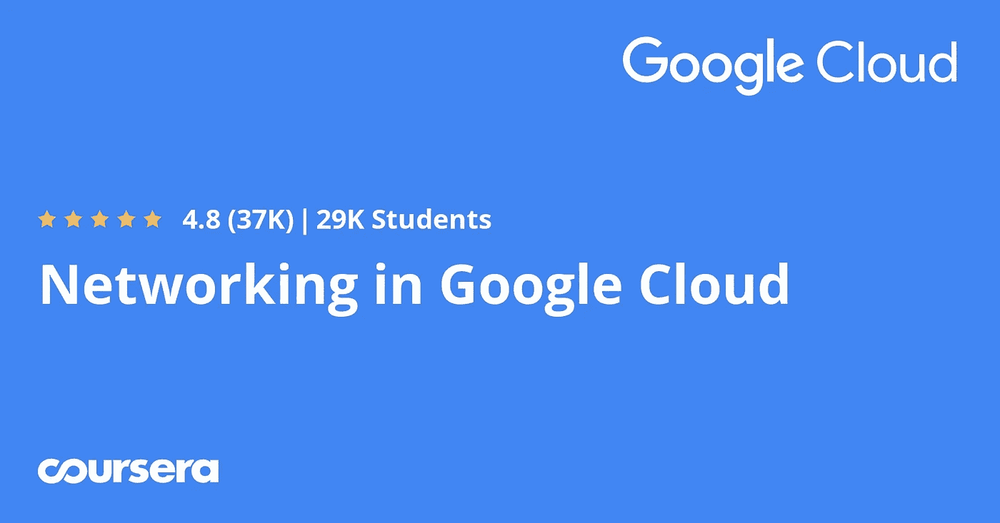](https://coursera.pxf.io/c/3294490/1164545/14726?u=https%3A%2F%2Fwww.coursera.org%2Fspecializations%2Fnetworking-google-cloud-platform)

## 9.[借助谷歌云实现业务转型](https://coursera.pxf.io/c/3294490/1164545/14726?u=https%3A%2F%2Fwww.coursera.org%2Flearn%2Fbusiness-transformation-google-cloud)

企业家和人们如何开始他们的在线业务的最佳课程，因此您首先要了解什么是云，以及它如何能够转变您的业务，并使用云构建转型解决方案，以及其背后的安全风险，以及本课程中包含的许多其他主题。

**以下是参加本课程的链接** — [使用谷歌云进行业务转型](https://coursera.pxf.io/c/3294490/1164545/14726?u=https%3A%2F%2Fwww.coursera.org%2Flearn%2Fbusiness-transformation-google-cloud)

[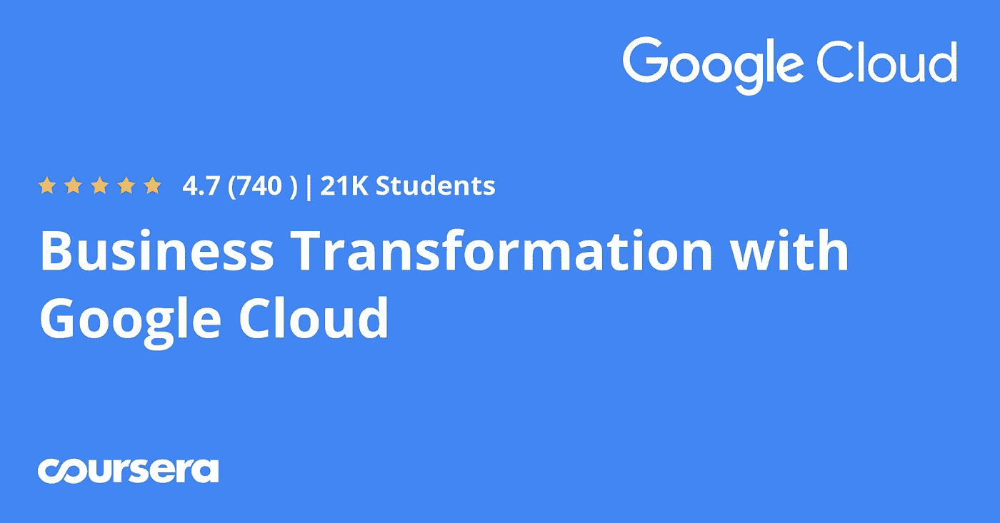](https://coursera.pxf.io/c/3294490/1164545/14726?u=https%3A%2F%2Fwww.coursera.org%2Flearn%2Fbusiness-transformation-google-cloud)

## 10.[谷歌云平台的安全性](https://coursera.pxf.io/c/3294490/1164545/14726?u=https%3A%2F%2Fwww.coursera.org%2Fspecializations%2Fsecurity-google-cloud-platform)

本课程是关于 Google cloud 中的安全性，通常从理解云基础设施和不同的服务开始，然后转移到管理平台中的安全性，如防火墙和安全密钥，以及如何保护自己免受黑客攻击和减轻 Google cloud 中的安全漏洞。

**这里是加入本课程的链接**——[谷歌云平台中的安全性](https://coursera.pxf.io/c/3294490/1164545/14726?u=https%3A%2F%2Fwww.coursera.org%2Fspecializations%2Fsecurity-google-cloud-platform)

[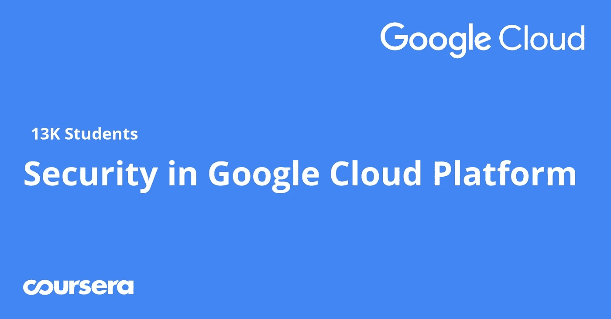](https://coursera.pxf.io/c/3294490/1164545/14726?u=https%3A%2F%2Fwww.coursera.org%2Fspecializations%2Fsecurity-google-cloud-platform)

以上是关于**学习 AWS 和谷歌云平台云计算的最佳 Coursera 课程和认证。**这些证书是在云计算领域开始职业生涯的最佳证书之一，无论是专门研究亚马逊 AWS 还是谷歌云平台，并学习这个令人惊叹的行业的基础知识以及网络和安全性。顺便说一下，如果你发现 Coursera 的课程和认证有用，因为它们是由世界各地的知名公司和大学提供的，那么我强烈推荐你加入 Coursera 的订阅计划。

<https://coursera.pxf.io/c/3294490/1164545/14726?u=https%3A%2F%2Fwww.coursera.org%2Fcourseraplus>  

这个 Coursera 订阅计划让您可以无限制地访问他们最受欢迎的课程、专业、专业证书和指导项目。大约花费 399 美元/年，但是它完全物有所值，因为你可以获得无限的证书，事实上，如果你参加多个专业和认证，它是划算的。

你可能喜欢的其他 **Coursera 和编程文章**

*   [2023 年程序员十大课程课程](https://javarevisited.blogspot.com/2020/08/top-10-coursera-courses-specilizations-and-certifications.html)
*   [学习云计算的 10 门最佳 Coursera 课程](https://javarevisited.blogspot.com/2020/08/top-10-coursera-certifications-to-learn-cloud-computing-aws.html#axzz6WK1yC5WW)
*   [学习数据科学的十大课程](https://javarevisited.blogspot.com/2020/08/top-10-coursera-certifications-to-learn-Data-Science-Visualization-and-Data-Analysis.html)
*   [学习谷歌和 IBM 的 18 门 Coursera 课程](/javarevisited/18-coursera-courses-you-can-join-in-2020-to-learn-from-the-worlds-top-tech-companies-google-74af46967d1e?source=collection_home---4------0-----------------------)
*   [YouTube 上的最佳 Coursera 认证](https://www.youtube.com/watch?v=6NKULJuitcU)
*   [面向程序员和开发者的 Coursera 十大项目](https://javarevisited.blogspot.com/2020/08/top-10-coursera-projects-to-learn-essential-programming-skills.html)
*   [Coursera Plus Review——在 Coursera 上学习的更好方式](https://javarevisited.blogspot.com/2020/08/coursera-plus-better-way-to-take-coursera-courses-specilizations-certification.html)
*   [学习 Web 开发的 10 大 Coursera 课程](https://javarevisited.blogspot.com/2020/08/top-10-coursera-certifications-to-learn-web-development.html)
*   [学习 Python 的 10 个 Coursera 专业和认证](https://javarevisited.blogspot.com/2020/02/10-best-coursera-courses--for-python.html)
*   [5 个最佳 Coursera 程序员职业证书](https://javarevisited.blogspot.com/2019/10/top-5-coursera-professional-certificates-for-programmers-IT-professionals.html)
*   [2023 年学习 Python 可以做的 8 个项目](/javarevisited/8-projects-you-can-buil-to-learn-python-in-2020-251dd5350d56)
*   [你可以在 Coursera 上在线申请的前 5 个计算机科学学位](https://javarevisited.blogspot.com/2020/04/is-it-possible-to-get-master-of-computer-science-degree-online-coursera.html)
*   [Udemy vs Coursera？学理工和编程哪个好](https://javarevisited.blogspot.com/2020/01/coursera-vs-udemy-which-is-better-for-programming-tech.html)
*   Coursera 证书对工作和事业有帮助吗？
*   [开始职业生涯的十大 Coursera 认证](/javarevisited/top-10-coursera-certificates-to-start-your-career-in-cloud-data-science-ai-mainframe-and-it-558690c83587)
*   [2023 年学习人工智能的 7 门最佳课程](/javarevisited/7-best-courses-to-learn-artificial-intelligence-in-2020-26d59d62f6fe)
*   Udemy vs Pluralsight？哪个学习平台比较好？
*   [Udemy vs CodeCademy vs OneMonth？](https://javarevisited.blogspot.com/2019/09/codecademy-vs-udemy-vs-onemonth-which-is-better-for-learning-code.html#axzz6VYKcmyZz)
*   [Udemy vs Educative vs CodeCademy？新手用哪个比较好](/javarevisited/codecademy-or-pluralsight-which-is-a-better-platform-to-learn-coding-skills-59251a080642)
*   [你可以在 Coursera Online 上获得 5 个数据科学学位](https://www.java67.com/2020/06/top-5-data-science-degree-you-can-earn-online-coursera-edx.html)
*   【Coursera 的 10 项数据科学和机器学习认证

感谢阅读这篇文章。如果你喜欢 Coursera 的这些*最好的云计算、AWS 和谷歌云平台课程，那么请与你的朋友和同事分享。如果您有任何问题或反馈，请留言。*

**P. S.** —如果你正在寻找学习云计算和 AWS 的最佳 Udemy 课程，那么你也可以查看我列出的 2023 年学习云计算的最佳在线课程**<https://javarevisited.blogspot.com/2019/07/top-5-online-courses-to-learn-cloud-computing-aws.html>****。**它包含了从零开始学习云计算的最好的 Udemy 课程。****

****</javarevisited/5-best-cloud-computing-courses-to-learn-in-2020-f5f091159401> ****