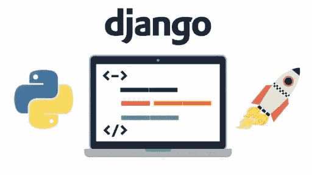
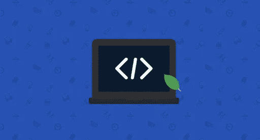
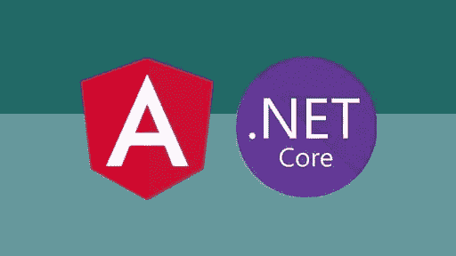
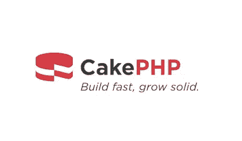
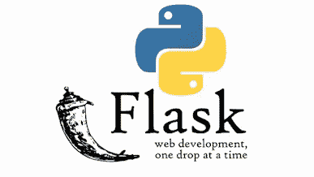
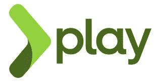

# 2023 年 Web 开发的 10 个最佳后端框架

> 原文：<https://medium.com/javarevisited/10-best-backend-frameworks-for-web-development-8d19e337f774?source=collection_archive---------0----------------------->

## 这些是 2023 年 Java、Ruby、Python、JavaScript、PHP、Scala 和 Golang 中 web 开发的最佳后端开发框架

大家好，如果你是一名应用程序编程人员，并且正在寻找 2023 年要学习的最好的后端框架，那么你来对地方了。早些时候，我已经分享了 [**最佳全栈开发课程**](https://javarevisited.blogspot.com/2020/04/top-5-courses-to-become-full-stack-java-developer-with-Angular-and-Reactjs.html) ，在本文中，我将与您分享创建 web 应用程序的 10 个最佳后端框架。

Web 开发一般分为两类——前端开发和后端开发。后端开发人员负责构建 web 应用程序的服务器端。

由于前端部分与用户交互，后端部分负责内部工作。没有后端，前端可能工作，也可能不工作，但要创建一个功能齐全的 web 应用程序，有必要将一个适当的后端与前端连接起来。

后端开发人员的角色不同于[前端开发人员](https://www.java67.com/2020/10/best-frontend-skills-web-developer.html)。前端开发人员更关注应用程序的外观，而后端开发人员则关注服务器、数据库以及两端如何相互连接和交互。

一个后端开发者应该具备很多必备的技能。理解后端框架就是其中之一。有几种后端框架，本文将讨论目前使用的顶级后端框架。

该列表包括基于[编程语言](https://www.java67.com/2017/12/10-programming-languages-to-learn-in.html)和技术栈的最佳后端框架。这意味着你不需要学习所有的方法，而是选择一种与你选择的编程语言和技术相匹配的方法。

# 2023 年 Web 开发的 10 个最佳后端框架

为了不浪费你的时间，这里列出了程序员可以学习的 10 个最好的 web 开发后端框架。虽然对于 Java 开发人员来说，在特定的技术堆栈或编程语言中有许多选择，但也有 [MicroNaut](https://javarevisited.blogspot.com/2020/09/top-5-courses-to-learn-dropwizard-Micronaut-Quarkus-Java-Microservices.html) 、 [Quarkus](/javarevisited/10-best-free-dropwizard-vert-x-micronaut-and-quarkus-online-courses-for-java-developers-9c2b4161f17) 、Vert。x 和其他框架，但我只选择了最好的框架，如 Spring Boot 基于流行度，成熟度和功能。

## 1.面向 Java 开发者的 Spring 框架+ Spring boot

Java 被认为是常青树编程语言。它的一个流行用途是在后端开发中。Spring 框架是最好的 Java 框架之一。

它发布于 2002 年，如今，它是最流行的后端框架之一，用于创建生产级的基于 spring 的独立应用程序。

使用 [Spring boot](/javarevisited/top-10-courses-to-learn-spring-boot-in-2020-best-of-lot-6ffce88a1b6e) 很容易，因为它省略了 Spring 框架所具有的各种配置开销。当你使用像 Spring Boot、Spring Cloud Spring Security 等 Spring 框架项目时，你可以获得很多有用的功能，比如缓存、事务管理、配置管理、监控、安全蚀刻。

如果你想在 2023 年学习 Spring 框架和 Spring Boot，需要一个资源，那么我强烈推荐你加入 Udemy 上的 [**Spring 和 Hibernate(包含 Spring Boot)**](https://click.linksynergy.com/deeplink?id=CuIbQrBnhiw&mid=39197&murl=https%3A%2F%2Fwww.udemy.com%2Fcourse%2Fspring-hibernate-tutorial%2F) 课程。超过 200，000 名 Java 开发人员参加了这个课程，学习 Spring、Hibernate 和 Spring Boot，这是 Java 中最重要的三个后端框架。

## 2.面向 Python 开发者的 Django

Django 是 web 开发中最流行的 Python 框架。基于 do not Repeat Yourself(DRY)原则，Django 专注于代码重用，从而提高开发速度。这也是一个非常安全的框架。

作为一个 Python 框架， [Django](/javarevisited/7-free-courses-to-learn-django-framework-in-python-bd50acc8484) 非常用户友好并且易于学习。它也是最受欢迎的全栈框架之一，提供了许多开箱即用的功能，如 REST API 支持。

如果你想在 2023 年学习 Django，那么我建议你参加由何塞·波尔蒂利亚在 Udemy 上开设的 [**Python 和 Django 全栈 Web 开发者训练营**](https://click.linksynergy.com/deeplink?id=CuIbQrBnhiw&mid=39197&murl=https%3A%2F%2Fwww.udemy.com%2Fcourse%2Fpython-and-django-full-stack-web-developer-bootcamp%2F) 课程。

Jose 是一位优秀的讲师，这个 32 小时的 Django 课程是在线学习 Django 最全面的资源之一。

## 3.面向 JavaScript 开发人员的 Express.js

JavaScript 是世界上最流行的编程语言。随着 Node.js 的出现，JavaScript 在后端开发社区中的受欢迎程度迅速增加，在过去十年中， [Node.js](/javarevisited/top-10-online-courses-to-learn-node-js-in-depth-8ef0e31ca139) 已经成为顶级名称之一。

这也是 2010 年针对节点开发者发布 Express 的原因。它是一个最小的 Node.js 框架，用于开发高度灵活的应用程序。

鉴于 [JavaScript](/javarevisited/10-best-online-courses-to-learn-javascript-in-2020-af5ed0801645) 是最流行的 web 开发语言，并且可能是唯一一种提供从前端到后端到移动学习的全栈开发的语言，Expressjs 可能是程序员的一个很好的选择。

如果你想在 2023 年学习 Express.js，并且需要一个资源，我推荐我最喜欢的 Udemy 导师 Brad Traversy 的 [**MERN 栈从前到后:全栈 React，Redux & Node.js**](https://click.linksynergy.com/deeplink?id=CuIbQrBnhiw&mid=39197&murl=https%3A%2F%2Fwww.udemy.com%2Fcourse%2Fmern-stack-front-to-back%2F) 课程，这个课程对任何想学习使用 MERN 栈的全栈 web 开发的人来说都很棒，包括 React 和 Express.js

## 4.ASP.NET 核心为。NET 开发人员

ASP。网芯是 ASP.NET 的接班人。它是一个开源的、独立于平台的框架，用于在。NET 平台。它被认为是性能最好的后端框架之一。

它基本上是 ASP.NET MVC 和 ASP.NET Web API 在一个编程模块中的联合版本，从而使它更加强大。

如果你想在 2023 年学习 ASP.NET 核心课程并需要资源，那么我建议你加入 Udemy 网站上 Mosh Hamedani 的[**ASP.NET MVC 5 课程**](https://click.linksynergy.com/deeplink?id=CuIbQrBnhiw&mid=39197&murl=https%3A%2F%2Fwww.udemy.com%2Fcourse%2Fthe-complete-aspnet-mvc-5-course%2F) 。这个 7.5 小时的课程最适合 C#和。想学习 ASP .NET 的 NET 开发人员。

## 5.面向 PHP 程序员的 Laravel

PHP 是后端开发中使用最多的编程语言之一。Laravel 是一个基于 MVC 架构的 PHP 框架。这是一个初学者友好的框架，具有用户友好的界面、丰富的库和出色的 API 支持。

使用 Laravel 简化了后端开发，同时构建了现代安全的 web 应用程序。如果您正在处理重要的应用程序，这一点尤其正确。

如果你想学习幼体，并且正在寻找 PHP 开发人员学习 Laravel 的最佳在线课程，那么你也可以在 Udemy 上查看 [**PHP 与 Laravel 的初学者——成为 Laravel**](https://click.linksynergy.com/deeplink?id=CuIbQrBnhiw&mid=39197&murl=https%3A%2F%2Fwww.udemy.com%2Fcourse%2Fphp-with-laravel-for-beginners-become-a-master-in-laravel%2F) 课程的大师。这个 43 小时的课程是在线学习 Laravael 的最佳课程之一。

## 6.面向 Ruby 程序员的 Ruby on Rails

Ruby on rails，通常被称为 rails，是一个基于 MVC 架构的服务器端框架。这是一个初学者友好的框架，易于理解和学习。

然而，它的优点和缺点仍有争议，但它因用户友好而受到全世界后端开发人员的喜爱。

如果你想在 2023 年学习 Ruby on Rails 并且需要一个资源 [**由 Rob Percival 在 Udemy 上完成的 Ruby on Rails 开发者课程**](https://click.linksynergy.com/deeplink?id=CuIbQrBnhiw&mid=39197&murl=https%3A%2F%2Fwww.udemy.com%2Fcourse%2Fthe-complete-ruby-on-rails-developer-course%2F) 是一个很好的加入课程。它有超过 46 小时的内容和 157 篇文章，8 个编码练习和 1 个可下载资源。

## 7.面向 Golang 开发者的纤程框架

Fiber 是一个面向 Golang 程序员的 web 开发框架。它建立在 Fasthttp 之上，fast http 是 Go 最快的 HTTP 引擎。它旨在简化快速开发的工作，并考虑到零内存分配和性能

Fiber 是一个精简但非常强大的框架。由于极其精简，很容易将第三方库与 **Martini** 集成。该框架提供了更多的可伸缩性和更少的开销问题。

它类似于 Express.js，对路由、服务静态文件、构建 REST APIs、灵活的中间件支持、模板引擎和低内存占用有很好的支持。

如果你想学习更多关于使用 Golang 和 Fiber 构建 web 应用程序的知识，我建议你加入 Udemy 上 Rob Percival 和 CodeStars 的 [**完整的 React & Golang 课程**](https://click.linksynergy.com/deeplink?id=CuIbQrBnhiw&mid=39197&murl=https%3A%2F%2Fwww.udemy.com%2Fcourse%2Fthe-complete-react-golang-course%2F) 。这是一个基于项目的课程，您将使用 React 和 Golang Fiber 从头构建一个管理应用程序。

## 8.面向 PHP 开发人员的 CakePHP 框架

CakePHP 是另一个 PHP 框架，它基于另一个流行的后端框架的概念， [Ruby on rail](/javarevisited/top-5-free-courses-to-learn-ruby-and-rails-for-beginners-best-of-lot-e149fe03c964) s

它遵循 MVC 架构，并提供了一些有用的特性，如模型-视图-控制器、前端控制器、活动记录、数据映射和配置之上的约定。

如果你想从零开始学习 CakePHP，并且需要一个资源，我建议你查看 Udemy 上的 [**CakePHP for 初学者，以完成项目**](https://click.linksynergy.com/deeplink?id=CuIbQrBnhiw&mid=39197&murl=https%3A%2F%2Fwww.udemy.com%2Fcourse%2Fcakephp-complete-project%2F) 课程。这个长达 6 小时的课程是 Udemy 上评分最高的 CakePHP 课程，适合初学者和有经验的 PHP 程序员。

## 9.Python 开发者的 Flask 框架

Flask 是另一个可以用于后端开发的 python 框架。它被视为一个微框架，因为它省略了特定工具和库的使用。此外，没有数据库抽象层、表单验证或外部源依赖。

这是一个简单、高度灵活、高性能的 web 框架。作为一个轻量级框架，或微框架，很容易学习和理解 Flask。此外，作为一个 [Python 框架](/javarevisited/top-5-python-frameworks-for-web-development-e034ebe85574)，它非常用户友好。

如果你想从头开始学习 Flask，并且需要一个资源，那么你也可以在 Udemy 上查看带有 Flask 的[**REST API 和 Python**](https://click.linksynergy.com/deeplink?id=CuIbQrBnhiw&mid=39197&murl=https%3A%2F%2Fwww.udemy.com%2Fcourse%2Frest-api-flask-and-python%2F) 课程。这个由何塞·萨尔瓦蒂耶拉创建的长达 17 个小时的课程非常适合学习 Flask for web development。

## 10.面向 Scala 开发者的 Play 框架

PLAY 用 Scala 和 Java 编写，是最强大的后端 web 框架之一。它基于 MVC 架构，并提供各种功能，如热代码重载、显示程序错误和专注于提升开发人员的盈利能力。

此外，它是 RESTfull 和非阻塞的。

如果你想学习 Scala 并开始使用 Play Framework 进行 web 开发，并且需要一个资源来开始在线学习，那么我推荐你加入 Udemy 上的 [**Scala &初学者函数式编程|摇滚 JVM**](https://click.linksynergy.com/deeplink?id=CuIbQrBnhiw&mid=39197&murl=https%3A%2F%2Fwww.udemy.com%2Fcourse%2Frock-the-jvm-scala-for-beginners%2F) 课程。

这是在线学习 Scala 的一门很棒的课程，是 Play 框架的必修课，已经有超过 30K 名学生加入了这门课程。

这就是 2023 年程序员能学到的**最好的后端框架。我说过，如果你想成为一名全栈工程师或者后端工程师，学习后端开发是值得的。今天，后端开发依赖于后端框架。**

有几种后端框架，有些流行，有些不流行。在本文中，我们讨论了常见的后端框架。所有这些框架在后端社区都非常受欢迎，就业市场对它们有巨大的需求。

这些框架大多是用流行的编程语言编写的，比如 [Java](/javarevisited/10-best-places-to-learn-java-online-for-free-ce5e713ab5b2) 、 [Python](/javarevisited/8-advanced-python-programming-courses-for-intermediate-programmer-cc3bd47a4d19) 、以及 [JavaScript](/javarevisited/my-favorite-free-tutorials-and-courses-to-learn-javascript-8f4d0a71faf2) 。如果是初学者，可以从 [**Ruby on rails**](/javarevisited/10-best-ruby-on-rails-courses-for-beginners-dca4d66e9f7b) 等初学者友好的框架或者 [**Flask**](/javarevisited/5-best-python-flask-courses-for-beginners-2f262f8e23da) 等轻量级框架开始。如果你热衷于学习最受欢迎的课程，那么你可以选择**[**Django**](/javarevisited/my-favorite-courses-to-learn-django-for-beginners-2020-ac172e2ab920)，或者 [Express](https://www.java67.com/2020/06/top-5-courses-to-learn-mern-stack-for-web-development.html) 。**

**您可能喜欢的其他**编程和开发文章****

*   **[2023 年 Java 开发者路线图](https://javarevisited.blogspot.com/2019/10/the-java-developer-roadmap.html)**
*   **[前端和后端开发者路线图](https://javarevisited.blogspot.com/2019/02/the-2019-web-developer-roadmap.html)**
*   **[2023 年每个 Java 开发人员都要学习的 10 种工具](https://www.java67.com/2018/04/10-tools-java-developers-should-learn.html)**
*   **[成为更好的 Java 开发人员的 10 个技巧](https://javarevisited.blogspot.com/2018/05/10-tips-to-become-better-java-developer.html)**
*   **[2023 年面向 Java 和 Web 开发人员的 10 个框架](http://javarevisited.blogspot.sg/2018/01/10-frameworks-java-and-web-developers-should-learn.html)**
*   **[2023 年学习 Spring Boot 的 5 大课程](https://www.java67.com/2018/06/5-best-courses-to-learn-spring-boot-in.html)**
*   **[Java 开发人员应该知道的 20 个库](http://javarevisited.blogspot.sg/2018/01/top-20-libraries-and-apis-for-java-programmers.html)**
*   **[我最喜欢的深入学习 Java 的免费课程](/javarevisited/10-free-courses-to-learn-java-in-2019-22d1f33a3915)**
*   **[每位软件开发人员必备的 11 项技能](https://dev.to/javinpaul/11-essential-skills-software-developers-should-learn-in-2020-1bio)**
*   **[深入学习 Spring 框架的前 5 门课程](https://javarevisited.blogspot.com/2018/06/top-6-spring-framework-online-courses-Java-programmers.html)**
*   **[2023 年要学的 10 种编程语言](http://www.java67.com/2017/12/10-programming-languages-to-learn-in.html)**
*   **[2023 年 Java 开发人员应该阅读的 10 本书](http://www.java67.com/2018/02/10-books-java-developers-should-read-in.html)**
*   **[学习 Maven、Jenkins 和 Docker 的 10 门免费课程](/javarevisited/top-10-free-courses-to-learn-maven-jenkins-and-docker-for-java-developers-51fa7a1e66f6)**
*   **[2023 年将获得 10 项 AWS 和云认证](https://www.java67.com/2020/09/top-10-cloud-certification-you-can-aim.html)**
*   **[react . js 开发者路线图](https://javarevisited.blogspot.com/2018/10/the-2018-react-developer-roadmap.html)**
*   **[为什么 2023 年每个开发者都要学习 Docker](https://javarevisited.blogspot.com/2020/11/why-devops-engineer-learn-docker-kubernetes.html#axzz6dXsEfLvJ)**

**感谢您阅读本文。如果你喜欢这份*web 开发最佳后端框架清单，那么请与你的朋友和同事分享。如果您有任何问题或反馈，请留言。***

***如果你是 web 开发新手，并且正在寻找一个在线课程来从头开始学习 web 开发，那么我强烈推荐你参加 Udemy 网站上由 Angela Yu 举办的[**2023 年 Web 开发训练营。这是学习 web 开发的最全面、最吸引人、最新和结构良好的课程之一。**](https://click.linksynergy.com/deeplink?id=JVFxdTr9V80&mid=39197&murl=https%3A%2F%2Fwww.udemy.com%2Fcourse%2Fthe-complete-web-development-bootcamp%2F)***

*** [## 2023 年成为全栈 Java 程序员的 10 门最佳在线课程

### 以上是 Udemy 学习全栈 web 最好的 Java+Spring Boot+Angular+react js+Kubernetes 课程…

medium.com](/javarevisited/10-best-java-full-stack-web-development-courses-to-join-in-2020-6cd6cd2e5868)***