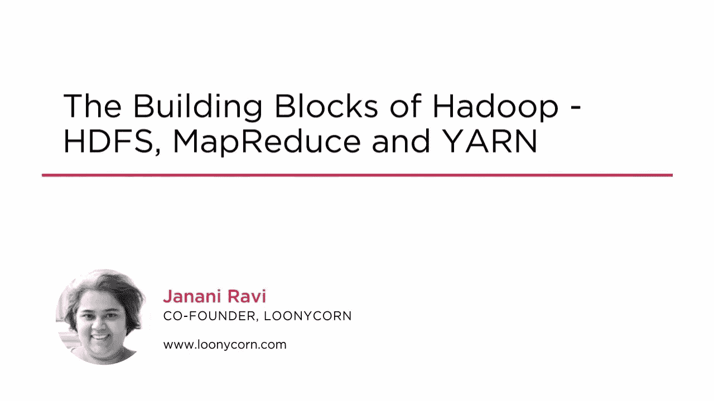
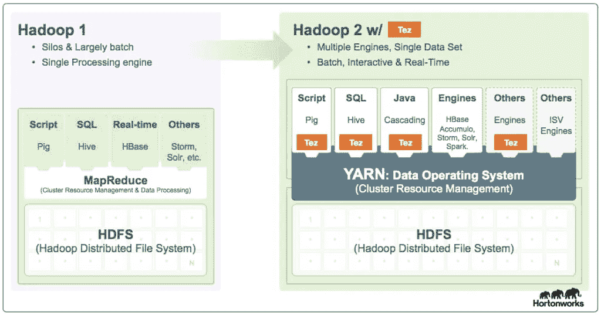
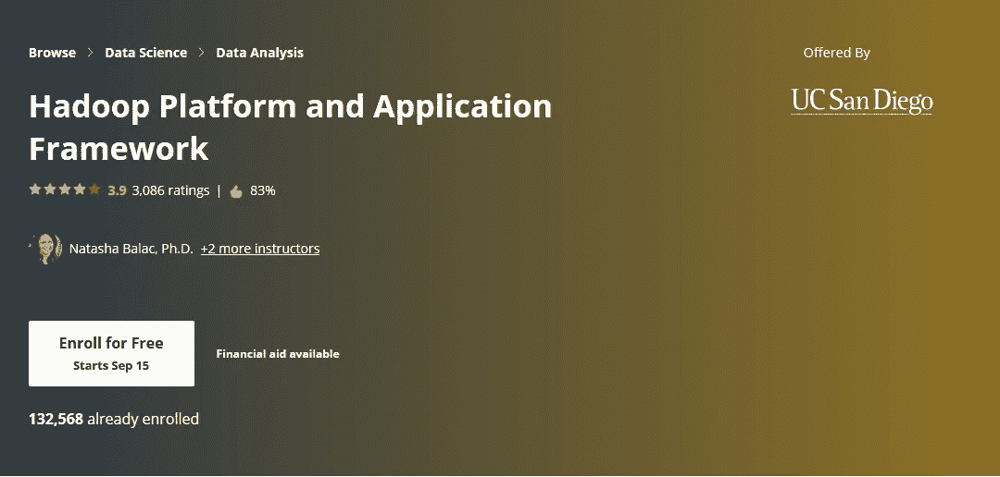

# 2023 年 10 大数据和 Hadoop 最佳教程、书籍和课程

> 原文：<https://medium.com/javarevisited/10-best-big-data-and-hadoop-tutorials-books-and-courses-to-learn-in-2020-aaca8cfccb80?source=collection_archive---------0----------------------->

image_credit — Udemy

大家好，如果你想学习大数据和 Hadoop，并寻找一些优秀的书籍、课程和教程，那么你来对地方了。

过去我曾分享过一些[免费的大数据和 Hadoop 课程](/swlh/5-free-online-courses-to-learn-big-data-hadoop-and-spark-in-2019-a553e6ccfe30)和[最佳大数据课程](/javarevisited/top-10-courses-to-learn-big-data-and-hadoop-best-of-lot-23ef8691633f)，在本文中，我将分享一些学习大数据和 Hadoop 的最佳资源，包括教程、书籍和在线课程。

您可以在方便的时间和地点使用这些资源学习大数据，尤其是 Hadoop。

# 2023 年面向初学者的 10 本最佳大数据和 Hadoop 书籍、课程和教程

那么，还等什么，让我们一起潜入最好的书籍、课程、教程，深入学习大数据和 Hadoop 吧？以下是学习大数据的最佳在线资源列表:

## 1.终极实践 Hadoop(【udemy.com】T4)

在线学习 Hadoop 的优秀课程。它非常全面，涵盖了 Hadoop、MapReduce、HDFS、 [Spark](/javarevisited/5-best-apache-spark-courses-for-java-and-python-developers-bbd9d63eb76c) 、Pig、Hive、HBase、MongoDB、Cassandra、Flume——不胜枚举！超过 25 项技术。

这是 Udemy 上最好的大数据和 Hadoop 课程之一，由 Frank Kane 创建，这门课程真的是深入学习 Hadoop 的终极教程。

如果你只能从这个列表中选择一门课程，那就选这门。它不是免费的，但它的价格是值得的，你可以在 Udemy 的销售中得到 10 美元，这种销售时有发生。

**以下是参加本课程**—[Hadoop 终极实践](https://click.linksynergy.com/deeplink?id=JVFxdTr9V80&mid=39197&murl=https%3A%2F%2Fwww.udemy.com%2Fthe-ultimate-hands-on-hadoop-tame-your-big-data%2F)的链接

## 2.Hadoop 的构建模块——HDFS、MapReduce 和 YARN([pluralsight.com](https://pluralsight.pxf.io/c/1193463/424552/7490?u=https%3A%2F%2Fwww.pluralsight.com%2Fcourses%2Fbuilding-blocks-hadoop-hdfs-mapreduce-yarn))

处理数十亿条记录需要对分布式计算有深刻的理解。在本课程中，您将了解 Hadoop，这是一个开源分布式计算框架，可以帮助您做到这一点。

顺便说一下，你需要一个 Pluralsight 会员才能参加这个课程，费用大约是每月 29 美元或每年 299 美元(14%的折扣)。

我向所有程序员强烈推荐这个订阅，因为它提供了超过 7000 个在线课程的即时访问，以学习任何技术技能。或者，你也可以使用他们的 [**10 天免费通行证**](https://pluralsight.pxf.io/c/1193463/424552/7490?u=https%3A%2F%2Fwww.pluralsight.com%2Flearn) 免费观看这个课程。

**以下是加入本课程的链接—**[**Hadoop 的构建模块— HDFS、MapReduce 和 YARN**](https://pluralsight.pxf.io/c/1193463/424552/7490?u=https%3A%2F%2Fwww.pluralsight.com%2Fcourses%2Fbuilding-blocks-hadoop-hdfs-mapreduce-yarn)

## 3.雅虎！Hadoop 教程([developer.yahoo.com](https://developer.yahoo.com/hadoop/tutorial/))

本教程包括以下旨在教您如何使用 Hadoop 分布式数据处理环境的材料:

*   Hadoop 0.18.0 发行版(包括全部源代码)
*   运行 Ubuntu Linux 并预先配置了 Hadoop 的虚拟机映像
*   运行虚拟机映像的 VMware Player 软件
*   本教程将指导您了解 Hadoop 安装和操作的许多方面。

总的来说，这是一个针对初学者和有经验的开发人员学习 Hadoop 的深入教程。

## 4.面向绝对初学者的大数据和 Hadoop([udemy.com](https://click.linksynergy.com/deeplink?id=JVFxdTr9V80&mid=39197&murl=https%3A%2F%2Fwww.udemy.com%2Flearn-hadoop-step-by-step-from-scratch%2F))

对于任何初学者来说，这都是一门很好的课程，可以让他们以简化的方式熟悉基本的大数据和 Hadoop 概念。本课程也非常注重实践，因为您不仅将学习如何从头安装和构建 Hadoop 集群，还将学习在生产或实际环境中管理 Hadoop 集群。

**这里是加入本课程的链接** — [大数据和 Hadoop，绝对初学者](https://click.linksynergy.com/deeplink?id=JVFxdTr9V80&mid=39197&murl=https%3A%2F%2Fwww.udemy.com%2Flearn-hadoop-step-by-step-from-scratch%2F)

## 5.Hadoop 教程([tutorialspoint.com](https://www.tutorialspoint.com/hadoop/))

又一个牛逼的免费学习 Hadoop 的教程。本教程是为有志于使用 Hadoop 框架学习大数据分析基础知识并成为 Hadoop 开发人员的专业人士准备的。软件专业人员、分析专业人员和 ETL 开发人员是本课程的主要受益者。

## 6.Hadoop MapReduce 深度([udemy.com](https://click.linksynergy.com/deeplink?id=JVFxdTr9V80&mid=39197&murl=https%3A%2F%2Fwww.udemy.com%2Fhadoop-mapreduce-in-depth-a-real-time-course-on-mapreduce%2F))

MapReduce 框架在处理数据方面最接近 Hadoop。它被认为是 Hadoop 中的一个原子处理单元，这就是它永远不会过时的原因。如果你想学习 Hadoop 中的这个基本概念，那么这是最好的入门课程。

**这里是加入本课程的链接**——[Hadoop MapReduce 深度](https://click.linksynergy.com/deeplink?id=JVFxdTr9V80&mid=39197&murl=https%3A%2F%2Fwww.udemy.com%2Fhadoop-mapreduce-in-depth-a-real-time-course-on-mapreduce%2F)

## 7.“Hadoop 入门”教程([cloudera.com](https://www.cloudera.com/developers/get-started-with-hadoop-tutorial.html))

无论您是计算机科学专业的学生还是经验丰富的开发人员，开始使用 Apache Hadoop 堆栈都是一个挑战。有许多可移动的部分，除非您在具有示例数据的更广泛的用例环境中获得每个部分的实践经验，否则攀登将是陡峭的。

使用 Cloudera 的 QuickStart VM 或 Docker 映像作为沙盒环境来学习本教程，将为您提供如何开始使用 CDH 提供的一些工具(Cloudera 的平台，包含 Hadoop 和相关项目)以及如何通过 Cloudera Manager 管理您的服务的示例。这也会让你体会到“提出更大的问题”意味着什么本教程结束时，您将了解如何使用 CDH 的一些强大工具，并知道如何设置和执行一些基本的商业智能和分析用例。

## 8.Apache Hadoop —教程([vogella.com](https://www.vogella.com/tutorials/ApacheHadoop/article.html))

Lars Vogel 的另一个有趣的 Hadoop 教程。在本教程中，您将从零开始学习如何使用 Apache Hadoop。首先，你将学习一些基本概念，比如什么是 Apache Hadoop，什么是 MapReduce，Hadoop 文件系统或者 HDFS 等等。然后通过在您的本地机器上安装和使用 Apache Hadoop 获得一些实践经验。

## 9.Hadoop:权威指南([Amazon.com](https://www.amazon.com/Hadoop-Definitive-Storage-Analysis-Internet/dp/1491901632?tag=javamysqlanta-20))

在某种程度上，权威指南是“Hadoop 圣经”,在使用 Hadoop 时可以作为很好的参考，但不要指望它能为编写 Map Reduce 提供简单的入门教程。这本书对于真正理解一切是如何工作的以及所有的系统是如何配合在一起的非常好。

这里是购买这本书的链接——[Hadoop:权威指南](https://www.amazon.com/Hadoop-Definitive-Storage-Analysis-Internet/dp/1491901632?tag=javamysqlanta-20)

## 10.Hadoop 平台和应用框架(【coursera.org】T4)

这是从 Hadoop 和大数据入手的另一个好资源。对于希望了解用于争论和分析大数据的核心工具的程序员新手或商务人士来说，这尤其有用。

在没有任何经验的情况下，您将有机会通过 Hadoop 和 Spark 框架(业界最常见的两个框架)进行实践。

**这里是加入本课程** — [Hadoop 平台和应用框架](https://coursera.pxf.io/c/3294490/1164545/14726?u=https%3A%2F%2Fwww.coursera.org%2Flearn%2F)的链接

顺便说一句，如果你觉得 Coursera 认证和在线课程有用，那么我建议你加入 [**Coursera Plus**](https://coursera.pxf.io/c/3294490/1164545/14726?u=https%3A%2F%2Fwww.coursera.org%2Fcourseraplus) ，这是 Coursera 的一个伟大的订阅计划，让你无限制地访问他们最受欢迎的课程、专业化、专业证书和指导项目。它每年花费大约 399 美元，但是它完全物有所值，因为你可以获得无限的证书。

<https://coursera.pxf.io/c/3294490/1164545/14726?u=https%3A%2F%2Fwww.coursera.org%2Fcourseraplus>  

以上是学习 Apache Hadoop 的一些**最佳教程。我还包括了一些课程和书籍，因为它们提供了更全面的学习，而且大多数时候，是最好的起点。如果你有任何你认为应该在这个列表中的 Hadoop 课程，请随意留言。

其他**编程文章**你可能喜欢
[完整的 Java 开发者路线图](https://javarevisited.blogspot.com/2019/10/the-java-developer-roadmap.html#123)
[2023 年 Web 开发者路线图](https://javarevisited.blogspot.com/2019/02/the-2019-web-developer-roadmap.html#axzz5lw0q4I4s)
[2023 年 Java 程序员应该学习的 10 件事](https://javarevisited.blogspot.com/2017/12/10-things-java-programmers-should-learn.html#axzz5atl0BngO)
[2023 年学习 Python 的 10 个理由](https://javarevisited.blogspot.com/2018/05/10-reasons-to-learn-python-programming.html)
[每个 Java 开发者都应该知道的 10 个工具](http://www.java67.com/2018/04/10-tools-java-developers-should-learn.html)
[学习 Java 编程语言的 10 个理由 2023 年成为更好的 Java 开发者的 10 个技巧](http://javarevisited.blogspot.sg/2013/04/10-reasons-to-learn-java-programming.html)
[2023 年要学习的 5 大 Java 框架](http://javarevisited.blogspot.sg/2018/04/top-5-java-frameworks-to-learn-in-2018_27.html)
[2023 年可以学习的 10 种编程语言](http://www.java67.com/2017/12/10-programming-languages-to-learn-in.html)
[10 个测试库每个 Java 开发者都应该知道的](https://javarevisited.blogspot.sg/2018/01/10-unit-testing-and-integration-tools-for-java-programmers.html)
[最适合初学者的数据科学课程](/javarevisited/my-favorite-data-science-and-machine-learning-courses-from-coursera-udemy-and-pluralsight-eafc73acc73f)
[最适合初学者的 AWS 和云计算课程](/javarevisited/top-10-courses-to-learn-amazon-web-services-aws-cloud-in-2020-best-and-free-317f10d7c21d)
[最适合初学者的 React Native 课程](/javarevisited/top-5-react-native-courses-for-mobile-application-developers-b82febdf8a46?source=---------112------------------)**

感谢您阅读本文。如果你喜欢这篇文章，请鼓掌，想拍多少次就拍多少次，并在脸书、LinkedIn、Twitter 和电子邮件上与你的朋友和同事分享。如果你想得到每篇新文章的通知，请考虑订阅这个博客，并且不要忘记在 Twitter 上关注**[**javarestived**](https://twitter.com/javarevisited)！和培养基上的 javinpaul。**

****附言——**如果你正在寻找一门免费的 Udemy 课程来学习大数据和 Hadoop，那么你也可以看看这门绝对免费的 [**大数据和 Hadoop 基础课程**](https://click.linksynergy.com/deeplink?id=JVFxdTr9V80&mid=39197&murl=https%3A%2F%2Fwww.udemy.com%2Fcourse%2Fbig-data-and-hadoop-essentials-free-tutorial%2F) 。你只需要一个 Udemy 帐户就可以加入这个课程。**

**<https://click.linksynergy.com/deeplink?id=JVFxdTr9V80&mid=39197&murl=https%3A%2F%2Fwww.udemy.com%2Fcourse%2Fbig-data-and-hadoop-essentials-free-tutorial%2F> **