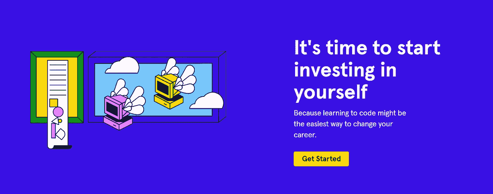
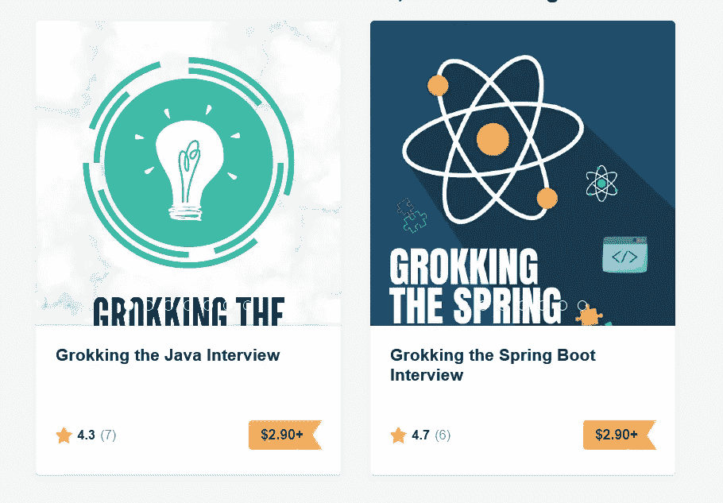
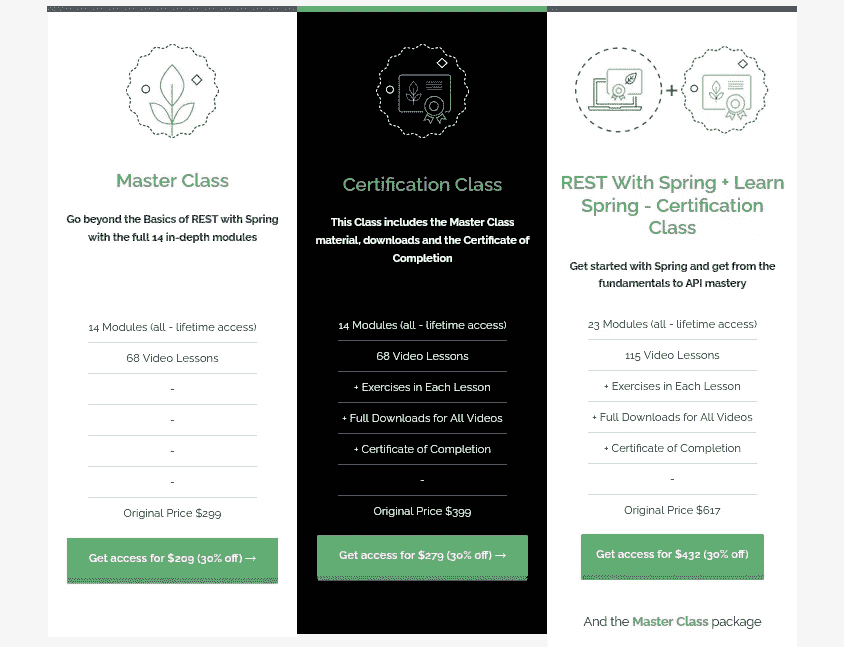
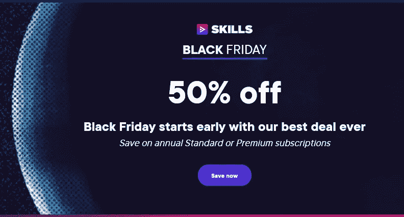
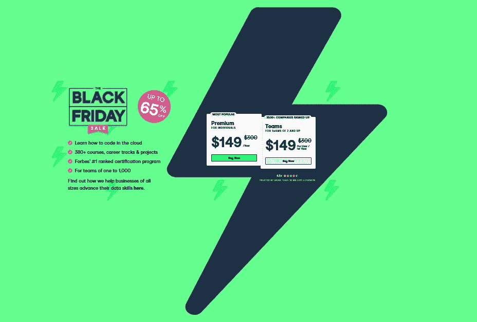
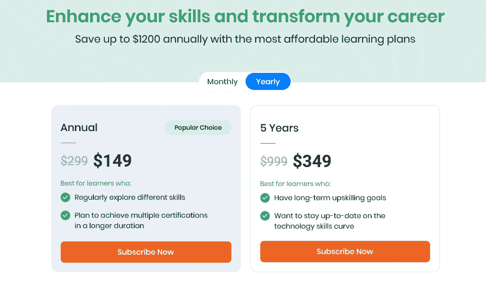
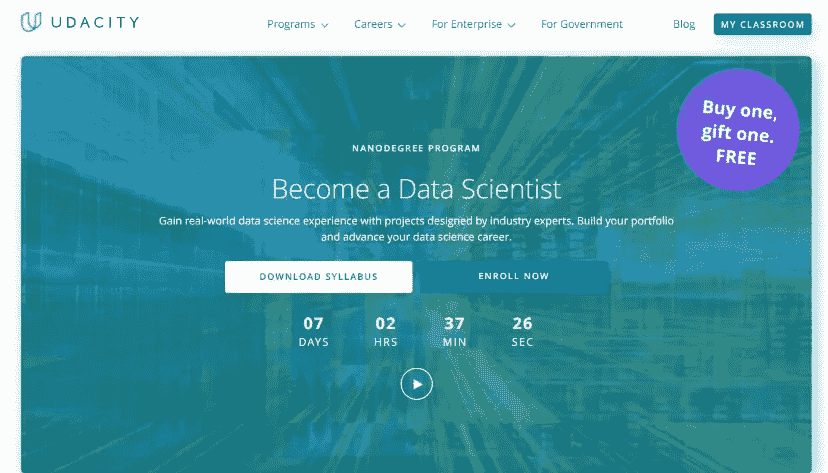

# 2023 年程序员和软件开发人员的 10 笔最佳交易

> 原文：<https://medium.com/javarevisited/10-best-black-friday-and-cyber-monday-deals-2021-to-level-up-your-skills-in-2022-bf4a7e8008b6?source=collection_archive---------0----------------------->

## 对于程序员和开发人员来说，我最喜欢的 2023 年黑色星期五和网络星期一交易是学习新的技术技能，提升自己。

image_credit- Codecademy

**披露:** *一些链接是附属链接，如果你使用我的链接购买任何交易，我会为你赚取一小笔佣金，没有额外的费用(没有任何！).*

你好，程序员和开发者，如果你正在寻找最好的黑色星期五和网络星期一交易来投资你的学习，那么你来对地方了。

在这篇文章中，我为程序员、开发人员、软件工程师和 IT 专业人士选择了*最佳黑色星期五和网络星期一交易*，他们希望在 2023 年投资学习新技术和提升自己的技能。

黑色星期五是一个特殊的日子，也可能是投资技能的最佳时机。这是每个公司在书籍、课程、工具和对程序员和开发人员最重要的东西上提供优惠的时候。

但是，与此同时，找到对你来说物有所值的好交易并不容易。我已经收到了很多来自像 [Udemy](https://click.linksynergy.com/fs-bin/click?id=JVFxdTr9V80&offerid=323058.9410&type=3&subid=0) 、 [Pluralsight](https://pluralsight.pxf.io/c/1193463/424552/7490?u=https%3A%2F%2Fwww.pluralsight.com%2Flearn) 、[educational](https://www.educative.io/subscription?affiliate_id=5073518643380224)、 [CodeCademy](https://bit.ly/codecademypro) 、 [DataCamp](https://datacamp.pxf.io/c/1193463/1012793/13294?u=https%3A%2F%2Fwww.datacamp.com%2Fpricing) 、 [Coursera](https://coursera.pxf.io/c/3294490/1164545/14726?u=https%3A%2F%2Fwww.coursera.org%2F) 这样的网站的关于他们黑色星期五交易的优惠，我的很多读者也在问我这个问题。

在电子邮件和社交网络上分别回答了这些问题后，我想把程序员和软件开发人员的最佳黑色星期五交易放在一起。

这不仅有助于你找到很好的交易，而且你可以在它们过期前得到它们，因为这些优惠对时间非常敏感，下周左右就结束了。如果你想购买 [Udemy 课程](/javarevisited/10-best-udemy-online-courses-for-java-developers-4c9ab70cd01f)，你可以购买多个课程，因为 Udemy 提供终身访问，所以你可以在需要时观看这些课程。同样地，如果你有一个多元化或教育性的年度计划，这是更新它们并为你将来的学习储蓄的最佳时机。

而且，如果你想买书，你也可以看看我写了 10 年 Java 文章后的第一本书——[**搜索 Java 访谈**](https://gumroad.com/l/QqjGH) ，本周黑色星期五特价 **$2.90** 出售，作为黑色星期五和网络星期一的交易。

# 开发者和学习者的 10 个最佳黑色星期五和网络星期一教育项目

在不浪费你更多时间的情况下，这里为程序员和开发人员列出了最好的黑色星期五和网络星期一交易。我主要选择了允许你以 20%到 40%的巨大折扣购买课程、书籍和其他技术会员的交易，在 Udemy 销售的情况下最高可达 90%。

这是购买本课程和服务的最佳时机，因为你可以获得比平时几乎两倍的价值。所以，如果你想投资你的职业和学习，这是投资的最佳时机。

## 1.[贝尔东的第一笔黑色星期五交易](https://www.baeldung.com/learn-spring-course?affcode=22136_bkwjs9xa)(七折)

我认识欧根这么多年了，但他从来没有经营过黑色星期五销售或提供任何网络星期一交易，但今年不同，因为欧根和贝尔东正在经营他们的第一个黑色星期五交易，你可以以 30%的价格获得他们所有的春季和 Spring Boot 课程。

毫无疑问，Baeldung 是学习 Spring 和 Spring Boot 的最佳地点之一，这使得它成为 2023 年 Java 开发人员的最佳黑色星期五交易。

以下是在这个黑色星期五你可以买到的最好的贝尔登 Spring Boot 球场，并节省 30%

1.  [**学春 5、**](https://www.baeldung.com/learn-spring-course?affcode=22136_bkwjs9xa)
2.  [**歇着弹簧**](http://www.baeldung.com/rest-with-spring-course?utm_source=javarevisited&utm_medium=web&utm_campaign=rws&affcode=22136_bkwjs9xa)
3.  [**学春安全**](http://www.baeldung.com/learn-spring-security-course?utm_source=javarevisited&utm_medium=web&utm_campaign=lss&affcode=22136_bkwjs9xa)
4.  [**学春数据 JPA**](https://www.baeldung.com/learn-spring-data-jpa-course?affcode=22136_bkwjs9xa)

## 2.101 区块链【五折】

对于 2023 年想要学习区块链开发的开发者来说，这是又一个伟大的黑色星期五交易。101 区块链是最受欢迎的学习区块链的地方之一，他们现在在黑色星期五和网络星期一为他们的课程和认证提供巨大的折扣。

凭借优惠券 [**黑色星期五**](http://shrsl.com/349rm) ，您有机会在个别课程和认证上节省 50%的费用。

您还可以以 60%的折扣注册[年度会员计划](http://shrsl.com/349rm)，将您在区块链的专业知识提升到一个新的水平，并无限制地参加我们的 20 多门专业课程。

我特别兴奋的是[认证企业区块链专业人士(CEBP)](https://www.shareasale.com/r.cfm?b=1713885&u=880419&m=105464&urllink=&afftrack=) 和[认证企业区块链架构师(CEBA)](https://www.shareasale.com/r.cfm?b=1713895&u=880419&m=105464&urllink=&afftrack=) 他们两个最好的区块链认证。

如果你正在寻求进入利润丰厚的区块链世界，这笔交易可能是最适合你的。

这里是获得交易的链接—[**101 个区块链订阅的 50%折扣。**](http://shrsl.com/349rm)

## 3. [Pluralsight 黑色星期五和网络星期一交易](https://pluralsight.pxf.io/c/1193463/424552/7490?u=https%3A%2F%2Fwww.pluralsight.com%2Flearn)【五折】

Pluralsight 是我学习新技能的另一个地方。它收集了最好的在线课程，这些课程来自著名的讲师，如 Java 冠军 Jose Paumard 和 Richard Warburton，以及我非常钦佩的 SQL 专家 Pinal Dave。

Pluralsight 对他们的角色、年度和高级会员资格提供高达 50%的折扣**，这意味着你只需每年 179 美元就可以在**购买他们的年度会员资格，而不是通常的每年 299 美元，他们的高级会员资格包括测验、练习和互动课程，现在只需 269 美元，而不是一年 449 美元。****

****折扣——高达 50%的折扣****

**在这篇文章中，你将了解关于 Pluralsight 黑色星期五交易和优惠券代码的一切，以及如何使用它们，并加入 Pluralsight 免费周末，免费试用他们的所有课程一个周末**

****这里是抢你折扣的链接**——[**plural sight 五折**](https://pluralsight.pxf.io/c/1193463/424552/7490?u=https%3A%2F%2Fwww.pluralsight.com%2Flearn)**

**让你的技能更上一层楼。**立即享受套餐五折优惠。****

****

**如果你喜欢会员制网站，那么我强烈推荐获得他们的高级会员资格，现在只需每年 269 美元。如果你有疑问，你仍然可以试试他们的**10 天免费通行证来检查课程质量，我 100%肯定你会很高兴的。****

**** [## Pluralsight |个人免费试用

### 了解有关 Pluralsight 免费试用版的更多信息。

pluralsight.pxf.io](https://pluralsight.pxf.io/c/1193463/424552/7490?u=https%3A%2F%2Fwww.pluralsight.com%2Fpricing%2Ffree-trial) 

他们还在经营一个 [**免费周末**](https://pluralsight.pxf.io/c/1193463/1192599/7490) ，他们所有的 7500+课程都是免费的，包括 20 个项目。我认为你应该利用这一点来感受一下多视质量。

 [## Pluralsight |免费周末

### 为周末做好准备，尽可能多的学习吧！我们正在释放我们的技术技能…

pluralsight.pxf.io](https://pluralsight.pxf.io/c/1193463/1192599/7490) 

## 4.[教育性黑色星期五交易(大折扣)](https://www.educative.io/subscription?affiliate_id=5073518643380224)

Educative 是一个基于文本的交互式平台，允许您在浏览器上运行代码。这意味着您不需要设置您的环境，这通常是学习新技术的最大障碍。

我喜欢教育性的课程，尤其是他们的编码面试课程，像[探索系统设计](/javarevisited/10-best-system-design-courses-for-coding-interviews-949fd029ce65)和[探索编码面试模式](/hackernoon/10-data-structure-algorithms-and-programming-courses-to-crack-any-coding-interview-e1c50b30b927)课程。

如果你正在准备编码面试，并且喜欢基于文本的互动课程，那么你将会喜欢这个教育门户网站。他们也有很多有用的学习途径，比如面向程序员的 Java，面向前端开发人员，面向开发人员的可扩展性和系统设计。

他们现在为他们的年度计划提供额外的 20%的折扣，这使他们能够访问他们的 200 多个课程。这意味着你只需 14.99 美元就可以购买他们的年度计划**，**通常价格为 39.99 美元，因此总折扣超过 70%。优惠将于 11 月 30 日截止。

以下是链接— [**教育无限，售价 14.9 美元**](https://www.educative.io/subscription?affiliate_id=5073518643380224)

## 5. [CodeCademy 黑色星期五&网络星期一交易](https://bit.ly/codecademyhome)【五折】

CodeCademy 是交互式学习的先驱之一，我从他们的免费课程中学到了很多有用的技能，比如 JavaScript。现在，他们已经将他们的门户网站提升到了一个新的水平，并创建了许多学习途径，在这些途径中，您可以通过遵循“边做边学”的方法，以结构化的方式学习所需的技能。

他们的结构是超级的，包括一小段知识和互动练习，然后是一个应用所有知识并获得自信的项目。

**折扣—** *年度订购享受 50%的折扣*

他们对他们所有的年度计划 提供 50%的折扣[**，代码为 **CYBER22** ，这意味着你只需每月**11.99 美元**就可以购买他们的 CodeCademy Pro 年度计划，这是一门 Udemy 课程的费用，你将可以访问他们的许多课程、测验和职业道路。**](https://bit.ly/codecademyhome)

***这是获得折扣的链接** — [**在 CodeCademy**](https://bit.ly/codecademyhome) 享受 50%的直接年费优惠*

**

## *6.[数据营黑色星期五和网络星期一交易](https://datacamp.pxf.io/c/1193463/1012793/13294?u=https%3A%2F%2Fwww.datacamp.com%2Fpromo%2Fnovember-flash-sale-2021)【65%折扣】*

*DataCamp 是学习 Python、SQL、Power BI、DataScience 和机器学习的最佳网站之一。Data Science 提供高达 62%的折扣，这意味着你只需每年 149 美元就可以购买一份年度订阅，而不是每年 399 美元。*

*通过订阅，您将获得 340 多门课程和 10，400 多项练习。如果你想在 2023 年学习基本的**数据技能，那么我强烈推荐 Datacamp，这是获得会员资格并节省 62%的最佳时间。***

***折扣—年度计划享受 65%的折扣***

*如果你想在 2023 年学习数据技能，那么你应该利用最新的 DataCamp 销售或折扣来学习数据科学，并获得数百门互动课程，涵盖 Python、R、SQL、机器学习、非编码基础知识等等。*

***此处是获得折扣的链接** — [***享受最高 65%的保费优惠***](https://datacamp.pxf.io/c/1193463/1012793/13294?u=https%3A%2F%2Fwww.datacamp.com%2Fpromo%2Fnovember-flash-sale-2021)*

**

## *7.Vlad Mihalcea 的冬眠书籍和课程可享受 40%的折扣*

*Java 冠军和博客作者 Vlad Mihalcea 正在进行一个在线研讨会，深入地教你 Hibernate。是的， [***高性能 Java 持久性培训***](https://vladmihalcea.teachable.com/p/high-performance-java-persistence-mach-3-online?coupon_code=BLACKFRIDAY22&affcode=172599_kuoszt8s) 现在开放了*

*这将是一次在线直播的 zoom 培训，由 4 节 **4 小时**组成**每节**定于 11 月 29 日**至 12 月 2 日**，从 **15:30** 至 **19:30 CET。***

*众所周知，Hibernate 是最流行的 JPA 提供者，也是 Java 开发人员最重要的框架之一。了解其内部工作原理可以区分高性能企业应用程序和勉强爬行的应用程序。*

*这个在线研讨会是基于 Vlad 的流行的，[，*高性能 Java 持久性*，](https://vladmihalcea.teachable.com/p/high-performance-java-persistence-ebook?coupon_code=BLACKFRIDAY21&affcode=172599_kuoszt8s)，一本受到超过 7500+开发人员信任的书。这个在线研讨会旨在关注 Java 开发人员和数据库编程之间的差距。*

*以下是 Vlad 将在本次实时休眠培训中涉及的主题:*

*   *日志记录、测试、模式管理最佳实践*
*   *数据建模(类型、标识符、实体映射、继承)*
*   *批处理(持久性上下文管理、批量更新、批量更新)*
*   *获取最佳实践*
*   *事务和并发控制*
*   *缓存最佳实践*

*此外，弗拉德还在开展黑色星期五和网络星期一活动，你可以以 40%的价格购买他的书籍和课程。*

*以下是链接— [**高性能 Java 持久性课程 40%折扣**](https://vladmihalcea.teachable.com/p/high-performance-java-persistence-mach-3-online?coupon_code=BLACKFRIDAY22&affcode=172599_kuoszt8s)*

**

## *8.Whizlabs [模拟测试和课程 50%折扣]*

*我也很高兴地通知您，Whizlabs 黑色星期五销售也将于 11 月 23 日开始。在今年最热的销售期间，我们将在他们所有最好的在线课程&练习测试中获得 5 *0%的折扣*，在他们所有的高级订阅计划 中获得高达 [**25%的折扣。**](https://shareasale.com/r.cfm?b=1551042&u=880419&m=43514&urllink=&afftrack=)*

*如果你不知道，如果你正在准备认证，Whizlabs 是最好的去处。我用他们的实践测试通过 Java、Spring、云认证已经很久了。*

*以下是一些面向 Java 开发人员的最佳 Whizlabs 课程和实践测试:*

1.  *[**AWS 认证云从业者**](https://shrsl.com/25qiz)*
2.  *[**AWS 认证开发人员助理**](https://shrsl.com/25qjc)*
3.  *[AWS 认证解决方案架构师助理](https://shareasale.com/m-pr.cfm?merchantid=43514&userid=880419&productid=792775328&afftrack=)*

*如今，Whizlabs 也有一个订阅计划，以一个价格提供所有课程和练习测试。*

*如果您正在准备认证，请考虑订阅 Whizlabs，它提供对 AWS、Java、Cloud、Docker 和 Kubernetes 等不同认证的所有在线培训课程和实践测试的完全访问权限，只需 [**、每年 149 美元(现在享受 35%的折扣)**](https://shareasale.com/r.cfm?b=1551042&u=880419&m=43514&urllink=&afftrack=) 。我强烈推荐这个订阅计划，因为 Whizlabs 有最好的材料来准备 IT 认证。*

**

## *9.。Udemy 黑色星期五和网络星期一特卖(9.99 美元)*

*Udemy 正在进行今年最大的促销活动，课程价格从 10 美元到 12 美元不等。你可以只花 10 美元就获得 20 多个小时内容的综合课程，这是荒谬而真实的。*

*Udemy 认真地使教育负担得起，这就是为什么我喜欢 Udemy 的课程。而这可能是购买 Udemy 课程的最佳时机。*

*由于 Udemy 提供终身访问他们的课程，我通常会在这段时间购买很多课程。如果你需要一些推荐，这里有几个你可以在这个黑色星期五买到的最好的 Udemy 课程:

**1。**[**Docker&Kubernetes:实用指南**](https://click.linksynergy.com/deeplink?id=JVFxdTr9V80&mid=39197&murl=https%3A%2F%2Fwww.udemy.com%2Fcourse%2Fdocker-kubernetes-the-practical-guide%2F) **2。** [**完整的 SQL +数据库训练营:零到精通【2023】**](https://click.linksynergy.com/deeplink?id=JVFxdTr9V80&mid=39197&murl=https%3A%2F%2Fwww.udemy.com%2Fcourse%2Fcomplete-sql-databases-bootcamp-zero-to-mastery%2F)

这些是你可以在今年的 Udemy 黑色星期五和网络星期一特卖中买到的最新、最吸引人、最全面的课程。*

***折扣—高达 80%的折扣
优惠券代码—无需优惠券***

***这是获得折扣的链接**——[我的黑色星期五和网络星期一特卖(9.99 美元)](https://click.linksynergy.com/fs-bin/click?id=JVFxdTr9V80&offerid=323058.9410&type=3&subid=0)*

**

## *10. [Coursera 加 100 美元折扣](https://coursera.pxf.io/c/3294490/1164545/14726?u=https%3A%2F%2Fwww.coursera.org%2F)*

*这是今年又一次最大的销售，对于那些想在 Coursera 上学习并尝试 Coursera 课程、专业认证和专业化的人来说，这可能是最好的黑色星期五交易。*

*Coursera 现在提供他们的高级订阅计划 [**Coursera Plus 优惠 100 美元**](https://coursera.pxf.io/c/3294490/1164545/14726?u=https%3A%2F%2Fwww.coursera.org%2F) 。*

*如果你不知道 [Coursera](https://coursera.pxf.io/c/3294490/1164545/14726?u=https%3A%2F%2Fwww.coursera.org%2F) 拥有来自谷歌、微软和 AWS 等顶级科技公司以及世界上最好的大学的最好的课程，Coursera plus 可以无限制地访问 Coursera 上超过 90%的课程、指导项目、专业和专业证书，由顶尖大学和公司的顶级讲师授课。*

*如果你一直想尝试 [**Coursera Plus**](https://coursera.pxf.io/c/3294490/1164545/14726?u=https%3A%2F%2Fwww.coursera.org%2Fcourseraplus) ，这是最好的时机，因为你可以花 1 美元尝试，但请记住，在第一个月之后，该订阅每月自动续订 59 美元。*

*顺便说一下，这个优惠只对新 Coursera Plus 用户有效。第一个月后，该套餐每月自动续订 59 美元。*

***这里是 1 美元**——[**Coursera Plus 1 美元**](https://coursera.pxf.io/c/3294490/1164545/14726?u=https%3A%2F%2Fwww.coursera.org%2Fcourseraplus) 的链接*

**

## *11.uda city[买一送一免费纳米学位项目]*

*当大家都在运行黑色星期五优惠时，另一个领先的在线学习平台 Udacity 怎么会被甩在后面。他们还推出了 [**买一送一的纳米学位项目**](https://imp.i115008.net/c/1193463/1201337/11298) 。*

*当您购买任何纳米学位计划的多月访问权限时，您将免费获得另一个纳米学位计划的多月访问权限的促销代码！*

*要获得[买一赠一促销活动](https://imp.i115008.net/c/1193463/1201337/11298)，请在注册时选择“预付”选项，以便多月访问 Nanodegree 计划，您将通过电子邮件收到一个代码，其中包含您的免费访问代码。*

*这个促销代码将适用于另一个纳米学位项目的预付费用。100%折扣仅适用于“预付”金额；超过访问期限的注册用户将被收取标准月费。*

*可以用这个报名 [**Udacity 数据科学纳米学位**](https://imp.i115008.net/c/1193463/786224/11298?u=https%3A%2F%2Fwww.udacity.com%2Fcourse%2Fdata-scientist-nanodegree--nd025) 。所以，首先，打开这个纳米学位程序。*

**

## *12.[苹果 AirPods Pro 八折](https://www.amazon.com/dp/B0BDHWDR12?tag=javamysqlanta-20)*

*如果你喜欢像我一样边编码或写作边听音乐，那么你会喜欢这个交易。从来不提供任何折扣的苹果公司现在在他们的 AirPods Pro 上提供高达 20%的折扣，这是编码员可以期待的最好的黑色星期五交易。趁存货最后一次，交易有效，本周末到期，立即购买。点击此处获得折扣*

**

## *13.CodeGym 黑色星期五优惠(五折)*

*CodeGym 是另一个通过互动内容和游戏学习 Java 的好地方，他们在 2023 年黑色星期五提供高达 50%的折扣。如果你想在 2023 年或 2023 年学习 Java，那么这是你能得到的最好的黑色星期五交易。*

*你在学习上投入的任何东西都是值得的，黑色星期五可能是你在 2023 年购买提升技能所需的所有东西的最佳时机。*

*这里是获得五折优惠的链接— [**CodeGym 五折**](https://bit.ly/3zL3CwG)*

**

*以上是关于程序员和开发者的**最佳黑色星期五和网络星期一 2023 交易**。你可以看到折扣每天都在飞来飞去，但它们的期限非常有限，所以最好在它们到期前抓住它们。*

*如果你热爱 Udemy 课程，我已经公布了你应该在今年的黑色星期五和 2023 年网络星期一特卖中购买的 [**最佳 Udemy 课程**](/javarevisited/10-best-udemy-online-courses-for-java-developers-4c9ab70cd01f) 。*

*您可能喜欢的其他**编程和课程文章***

*   *[完整的 Java 开发者路线图](https://javarevisited.blogspot.com/2019/10/the-java-developer-roadmap.html#axzz6N3akNoox)*
*   *[Udemy vs CodeCademy vs one month？](https://javarevisited.blogspot.com/2019/09/codecademy-vs-udemy-vs-onemonth-which-is-better-for-learning-code.html#axzz6VYKcmyZz)*
*   *[向谷歌和 IBM 学习的 18 门 Coursera 课程](/javarevisited/18-coursera-courses-you-can-join-in-2020-to-learn-from-the-worlds-top-tech-companies-google-74af46967d1e?source=collection_home---4------0-----------------------)*
*   *[面向程序员和开发人员的 Coursera 十大项目](https://javarevisited.blogspot.com/2020/08/top-10-coursera-projects-to-learn-essential-programming-skills.html)*
*   *[2023 年程序员十大课程](https://javarevisited.blogspot.com/2020/08/top-10-coursera-courses-specilizations-and-certifications.html)*
*   *[Udemy vs 复数视线？哪个学习平台比较好？](https://javarevisited.blogspot.com/2019/10/udemy-vs-pluralsight-review-which-is-better-to-learn-code.html)*
*   *[学习数据科学的十大课程](https://javarevisited.blogspot.com/2020/08/top-10-coursera-certifications-to-learn-Data-Science-Visualization-and-Data-Analysis.html)*
*   *[2023 年学习 Python 可以做的 8 个项目](/javarevisited/8-projects-you-can-buil-to-learn-python-in-2020-251dd5350d56)*
*   *[Udemy vs Coursera？学理工和编程哪个好](https://javarevisited.blogspot.com/2020/01/coursera-vs-udemy-which-is-better-for-programming-tech.html)*
*   *[学习 Python 的 10 个 Coursera 专业化认证](https://javarevisited.blogspot.com/2020/02/10-best-coursera-courses--for-python.html)*
*   *Coursera 证书对工作和事业有帮助吗*
*   *[2023 年学习人工智能的 7 门最佳课程](/javarevisited/7-best-courses-to-learn-artificial-intelligence-in-2020-26d59d62f6fe)*
*   *[5 个最佳 Coursera 程序员职业证书](https://javarevisited.blogspot.com/2019/10/top-5-coursera-professional-certificates-for-programmers-IT-professionals.html)*
*   *[开始职业生涯的十大 Coursera 认证](/javarevisited/top-10-coursera-certificates-to-start-your-career-in-cloud-data-science-ai-mainframe-and-it-558690c83587)*
*   *Udemy vs Educative vs Codecademy？新手用哪个比较好*
*   *[你可以在 Coursera Online 上获得 5 个数据科学学位](https://www.java67.com/2020/06/top-5-data-science-degree-you-can-earn-online-coursera-edx.html)*
*   *[Coursera 的 10 项数据科学和机器学习认证](/javarevisited/top-10-machine-learning-and-data-science-certifications-and-training-courses-for-beginners-and-a6308497b764)*

*感谢阅读这篇文章。如果你喜欢这些*最佳黑色星期五和网络星期一交易，程序员和开发人员折扣券*，那么请与你的朋友和同事分享。如果你有另一个伟大的黑色星期五和程序员和开发人员的网络星期一交易，那么请随时与我们分享。*

*如果你正在寻找在黑色星期五促销中可以买到的最好的 Udemy 课程，那么你也可以看看我列出的在黑色星期五促销中可以买到的 [**10 个最好的 Udemy 课程**](https://javarevisited.blogspot.com/2020/11/top-10-udemy-courses-you-can-buy-in.html#axzz6enw6Ycw1) 。包含了最好的 Udemy 课程，学习 Docker、微服务、Spring Boot、MERN 栈、SQL、Python、网页设计，以及其他软件开发所需的必备技能。*

* [## 2023 年面向程序员和开发者的 10+最佳 Udemy 课程

### 大家好，毫无疑问，Udemy 是最受欢迎的电子学习平台之一，它的帮助越来越大…

medium.com](/javarevisited/my-favorite-udemy-online-courses-for-programmers-and-software-engineers-f9d941dd0035)*****