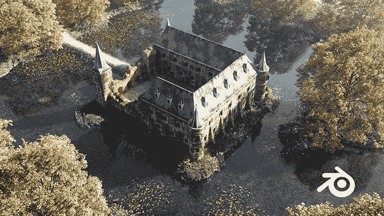
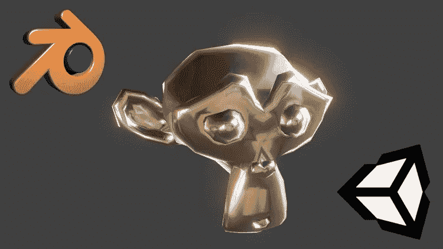
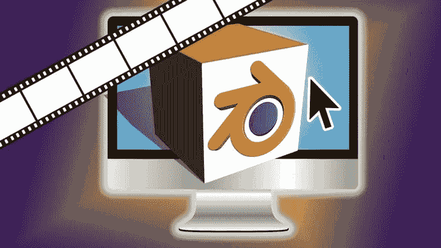
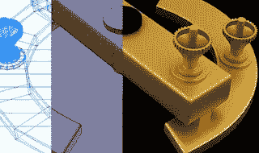
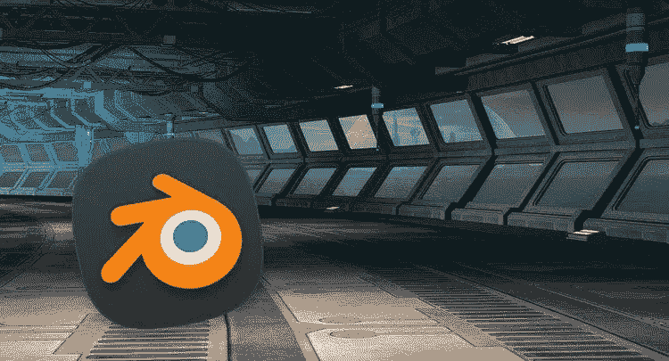
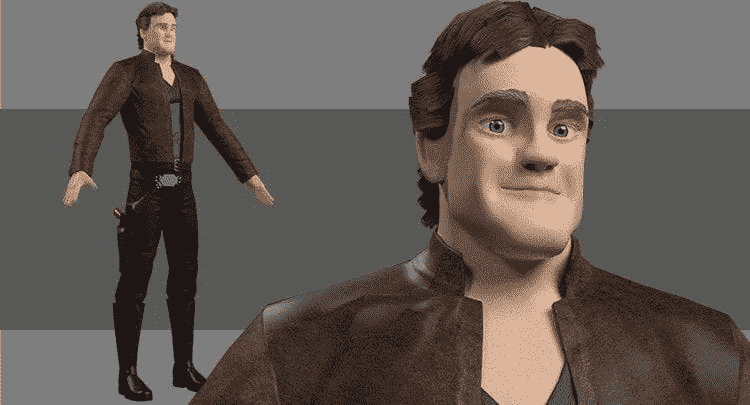
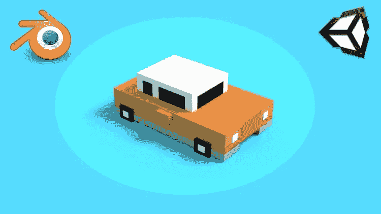

# 2023 年初学者学习 3D 建模的 10 个最佳 Blender 课程

> 原文：<https://medium.com/javarevisited/10-best-blender-courses-to-learn-3d-modeling-for-beginners-6bda57818347?source=collection_archive---------0----------------------->

## 这些是我最喜欢的在线课程，从零开始学习 3D 建模的 Blender 工具。它来自 Udemy、Pluralsight 和其他流行的在线学习门户网站。

image_credit — Udemy

大家好，如果你想学习 Blender，2023 年最流行的 3D 建模工具之一，并寻找最好的在线课程和其他学习资源，那么你来对地方了。

在过去，我已经分享了学习 Unity 游戏引擎和[虚幻引擎课程](/javarevisited/6-best-unreal-engine-courses-for-c-game-developers-in-2021-41ca05907ae4)的[最佳课程，在这篇文章中，我将分享 2023 年学习 **Blender** 和 3D 建模的最佳在线课程。](/@javinpaul/7-best-courses-to-learn-unity-for-game-development-in-2020-99f870d88e5e)

当你看一些动画电影，看到 3D 角色的华丽设计时，你可能会想知道他们是如何设计的，这个过程叫什么。

嗯，它被称为 **3D 建模**，这是一个让计算机创建这些角色的 3D 表示或你看到的任何 3D 形状的过程，如家庭、汽车、环境等等。

制作这种 3D 模型的人被称为 **3D 艺术家**，他使用一些软件来创建这些形状。许多创建这些设计的付费和免费软件，如 AutoDesk 的[Maya](https://www.autodesk.com/products/maya/overview)已经成为创建 3D 模型的标准工具，但 [Blender](https://www.blender.org/) 是 3D 建模的最佳免费工具。

本文将重点介绍如何使用名为**blend**r 的免费软件，这是一款开源软件，任何人都可以为开发其功能和性能做出贡献，并用于创建动画视频以及任何 3D 对象。

本指南将与您讨论一些学习 3D 建模和 Blender 软件的最佳资源，并开始创建您的 3D 对象和角色，也许在这个行业开始职业生涯。

3D Modeler 也是一项受欢迎的技能，如果你正在找工作或想做自由职业来赚取额外收入，学习 3D 建模和 Blender 在时间和金钱方面都是一项不错的投资。

3D 建模师的平均工资在 40，000 到 80，000 美元之间，取决于你的经验、技能和工作地点。

# 2023 年学习 3D 建模的 10 个最佳 Blender 在线课程

以下是我列出的从零开始学习 Blender 和 3D 建模的最佳在线课程。这些课程是从 Udemy、Pluralsight 和 edX 等网站上挑选出来的，它们是由专家和在日常工作中使用 Blender 的人创建的。

他们也被全球成千上万的开发者所信任，学习 3D 建模和 Blender。

## 1.[完整的 Blender Creator:初学者学习 3D 建模](https://click.linksynergy.com/deeplink?id=CuIbQrBnhiw&mid=39197&murl=https%3A%2F%2Fwww.udemy.com%2Fcourse%2Fblendertutorial%2F)

这是 Udemy 上从零开始学习 Blender 最好的课程之一。本课程提供了 Blender 软件创建 3D 对象的完整指南，从软件的基础和导航开始。

以下是您将在本课程中学到的*关键技能*:

*   如何使用搅拌机
*   如何用简单的颜色创建 3D 模型
*   如何创建自己的材料
*   理解建模的原理
*   学习动画基础知识
*   如何 UV 映射和展开你的模型

你也将创建你的第一个三维建模对象，使用盒建模技术，如保龄球和低聚象棋和一些先进的三维像绒毛兔子和人头等等。

**这是加入本课程**的链接。[完整的 Blender Creator:初学者学习 3D 建模](https://click.linksynergy.com/deeplink?id=CuIbQrBnhiw&mid=39197&murl=https%3A%2F%2Fwww.udemy.com%2Fcourse%2Fblendertutorial%2F)

## 2.[在 Blender 中创建 3D 环境](https://click.linksynergy.com/deeplink?id=CuIbQrBnhiw&mid=39197&murl=https%3A%2F%2Fwww.udemy.com%2Fcourse%2Fblender-environments%2F)

另一个学习使用 blender 创建环境的很好的课程，如 houses castle the land 等，在前两章从 blender 和环境设计的基础开始，然后转到高级材料，如创建草地景观和农舍，以及道路和小路等。

以下是您将在本课程中学到的主要内容:

*   如何创造令人惊叹的独特环境
*   如何组织你的工作流程来制作大型环境场景
*   如何在 Unity 3D 中烘焙和导入模型

这个 66.5 小时的课程是在线学习 Blender 最全面的课程之一。

你不仅可以获得伟大的教程，还可以获得电子书:旧大师揭秘(250 页)以及许多中世纪的参考照片。

这是加入课程的链接— [在 Blender 中创建 3D 环境](https://click.linksynergy.com/deeplink?id=CuIbQrBnhiw&mid=39197&murl=https%3A%2F%2Fwww.udemy.com%2Fcourse%2Fblender-environments%2F)

## 3.[面向 Unity 游戏开发者的 Blender 2.8 3D 建模](https://click.linksynergy.com/deeplink?id=CuIbQrBnhiw&mid=39197&murl=https%3A%2F%2Fwww.udemy.com%2Fcourse%2F3d-modeling-in-blender-2-8-for-unity-video-game-developers%2F)

如果你是一个 unity 游戏开发者，那么这个课程是你学习创建你的游戏角色和环境的好机会，从学习如何在你的软件中导航开始，然后创建一些 3D 形状和物体，以及真实的树等等。

以下是您将在本课程中学到的内容:

*   使用 Blender 2.8 进行 3D 建模
*   如何创建简单的低多边形道具
*   工具、快捷方式、提示和技巧

完成本课程后，您应该能够为您的 Unity 原型游戏构建基本的 3D 道具。

有了足够的实践和经验，你就可以顺利地发布你的第一个游戏了。

**这里是加入**——[Unity 游戏开发者 Blender 2.8](https://click.linksynergy.com/deeplink?id=CuIbQrBnhiw&mid=39197&murl=https%3A%2F%2Fwww.udemy.com%2Fcourse%2F3d-modeling-in-blender-2-8-for-unity-video-game-developers%2F)的链接

## 4. [Blender 3D 建模&动画](https://click.linksynergy.com/deeplink?id=CuIbQrBnhiw&mid=39197&murl=https%3A%2F%2Fwww.udemy.com%2Fcourse%2Fblender-3d-modelling-for-unity-game-development%2F)

使用 blender 和 Unity 3D 创建您的第一个 3D 建模对象和游戏，从 Blender 和如何使用其基础知识开始，创建一些对象，如多边形岩石和树木，山脉，然后移动到高级技术，如雪人，最后使用您到目前为止创建的所有内容，使用 Unity 3D 创建一个游戏。

以下是您将在本 udemy 课程中学到的一些关键技能:

*   如何使用 Blender 进行 3D 建模
*   搅拌机工具的基础
*   如何用 Blender 创建 3D 动画
*   如何在 Unity 游戏引擎中导入 3D 游戏模型
*   如何进行 UV 贴图和纹理绘制
*   如何用 Unity 创建一个完整的 3D 游戏？

完成本 Blender 和 3D 建模课程后，您将对使用 Blender 构建全功能 3D 模型并在 [Unity 3D 游戏引擎](https://www.java67.com/2020/07/top-5-courses-to-learn-unity-3d-in-2020.html)中使用它们所需的基本概念、工具和功能有一个坚实的理解。

下面是加入的链接— [Blender 3D 建模&动画](https://click.linksynergy.com/deeplink?id=CuIbQrBnhiw&mid=39197&murl=https%3A%2F%2Fwww.udemy.com%2Fcourse%2Fblender-3d-modelling-for-unity-game-development%2F)

## 5.[搅拌机基础知识](https://pluralsight.pxf.io/c/1193463/424552/7490?u=https%3A%2F%2Fwww.pluralsight.com%2Fcourses%2Fblender-fundamentals)【最佳多视课程】

这是从零开始学习 Blender 最好的 Pluralsight 课程之一。这个 Blender 课程面向想学习软件基础的初学者。

您将学习 Blender，首先了解它的选项和用户界面，然后学习如何使用一些建模工具，并开始 UV 映射无人机和转换为 3D 对象，以及添加动态模拟等等。

顺便说一下，你需要一个 Pluralsight 会员才能参加这个课程，费用大约是每月 29 美元或每年 299 美元(14%的折扣)。

我向所有程序员强烈推荐这个订阅，因为它提供了超过 7000 个在线课程的即时访问，以学习任何技术技能。

或者，你也可以使用他们的 [**10 天免费通行证**](https://pluralsight.pxf.io/c/1193463/424552/7490?u=https%3A%2F%2Fwww.pluralsight.com%2Fpricing%2Ffree-trial) 免费*观看此课程*。

 [## Pluralsight |个人免费试用

### 了解有关 Pluralsight 免费试用版的更多信息。

pluralsight.pxf.io](https://pluralsight.pxf.io/c/1193463/424552/7490?u=https%3A%2F%2Fwww.pluralsight.com%2Fpricing%2Ffree-trial) 

## 6.[使用 Blender 的基础 3D 动画](https://www.awin1.com/cread.php?awinmid=6798&awinaffid=631878&platform=dl&ued=https%3A%2F%2Fwww.edx.org%2Fmicromasters%2Fbasic-3d-animation-using-blender)【最佳 edx 课程】

另一个很好的初学者教师课程，你使用 Blender 软件创建 3D 动画，包含测验和活动，如开发你自己的 3D 设计，从探索 3D 可视化概念开始，并应用这些概念创建 3D 动画等等。

## 7. [Blender 新手角色建模高清](https://click.linksynergy.com/deeplink?id=CuIbQrBnhiw&mid=39197&murl=https%3A%2F%2Fwww.udemy.com%2Fcourse%2Fblender-character-modeling-for-beginners-hd%2F)

这是一门很好的课程，适合想设计人物和 3D 人物的人，从了解 Blender 的基础开始，然后学习如何创建人物的头部，并完成身体，在这门课程的各个章节中，你会添加更多的细节，直到你看到一个惊人的结果。

## 8.[初学者掌握 Blender 3D 建模](https://click.linksynergy.com/deeplink?id=CuIbQrBnhiw&mid=39197&murl=https%3A%2F%2Fwww.udemy.com%2Fcourse%2Fmastering-3d-modeling-with-blender-for-beginners%2F)

这是另一个在 2023 年使用 Blender 创建 e 惊人人物和物体的惊人 Udemy 课程。

本课程是专门为初学者从零开始学习 Blender 和 3D 建模而创建的。

在本课程中，从安装和基础开始，然后转到 3D 视点，使用对象并了解它们的不同类型，然后进入高级阶段，并学习使用强大的 3D 建模工具，最后是两个项目。

下面是加入这个列表的链接— [初学者用 Blender 掌握 3D 建模](https://click.linksynergy.com/deeplink?id=CuIbQrBnhiw&mid=39197&murl=https%3A%2F%2Fwww.udemy.com%2Fcourse%2Fmastering-3d-modeling-with-blender-for-beginners%2F)

## 9.[用搅拌机创造游戏角色](https://click.linksynergy.com/deeplink?id=CuIbQrBnhiw&mid=39197&murl=https%3A%2F%2Fwww.udemy.com%2Fcourse%2Fcreate-game-characters-with-blender%2F)

在本课程中，为初学者创建强大的游戏角色并建立强大的技能，从基础网格开始，这是你在开始任何设计之前必须了解的第一件事，然后创建实际的 3D 角色以及在 unity 中设置角色。

以下是您将在本课程中学到的重要内容:

*   如何在 Blender 中建模和塑造游戏角色
*   如何创建 UV 贴图和烘焙纹理贴图
*   如何将 Blender 字符导入 Unity？
*   如何使用 Blender 的修图工具？
*   如何使用 Blender 的纹理绘画工具
*   如何在 Unity 中设置角色控制器来移动你的角色？

总的来说，对于想在 Blender 中创建自己的游戏角色的人来说，这是一门完美的课程。

这是加入本课程的链接— [用搅拌机创造游戏角色](https://click.linksynergy.com/deeplink?id=CuIbQrBnhiw&mid=39197&murl=https%3A%2F%2Fwww.udemy.com%2Fcourse%2Fcreate-game-characters-with-blender%2F)

## 10.[2023 搅拌机入门](https://click.linksynergy.com/deeplink?id=CuIbQrBnhiw&mid=39197&murl=https%3A%2F%2Fwww.udemy.com%2Fcourse%2Fthe-complete-blender-course%2F)

使用 blender 创建 3D 建模、动画和渲染的大量课程，通过一些练习来增强您的技能，从基础开始，然后通过练习创建 3D 建模，然后转到 3D 动画基础和 3D 渲染，等等。

以下是您将在本课程中学到的关键技能:

*   学习和掌握搅拌机工具内外
*   了解完整的 3D 管道:建模、动画和渲染。
*   如何在没有帮助的情况下制作自己的 3D 模型
*   如何创建自己的 3D 动画项目
*   学习关键的渲染概念，如灯光和灯光的定位
*   如何在 Blender 或外部创建自己的纹理

总的来说，这是一门深入学习 Blender 的精彩课程。本课程也适用于 Blender 软件的 2.8x 和 2.9x 版本，这意味着您不需要加入另一门课程来学习 Blender 2.9 版本。

以下是加入本课程的链接—[2023 年搅拌机入门](https://click.linksynergy.com/deeplink?id=CuIbQrBnhiw&mid=39197&murl=https%3A%2F%2Fwww.udemy.com%2Fcourse%2Fthe-complete-blender-course%2F)

以上就是 2023 年**学习 Blender 和 3D 建模的最佳在线课程**。对于 3D 建模工作来说，这是一个重要的工具和技能，我希望这个课程列表能帮助你找到合适的课程，开始你的 3D 艺术家生涯。

您可能想探索的其他**资源文章**

*   学习响应式网页设计的 5 门最佳课程
*   [在线学习 React.js 的 5 大课程](https://javarevisited.blogspot.com/2018/08/top-5-react-js-and-redux-courses-to-learn-online.html)
*   [学习 Web 开发 TypeScript 的 10 门免费课程](/javarevisited/top-10-free-typescript-courses-to-learn-online-best-of-lot-44bce9da41d1)
*   [2023 年 Java 开发人员应该学会的 10 件事](https://javarevisited.blogspot.com/2017/12/10-things-java-programmers-should-learn.html#axzz5atl0BngO)
*   [Web 开发的五大 Python 框架](https://javarevisited.blogspot.com/2019/04/top-5-python-web-development-frameworks.html)
*   [2023 年学习 WordPress 的 5 门最佳在线课程](https://javarevisited.blogspot.com/2020/08/top-5-courses-to-learn-wordpress-in.html)
*   [成为全栈式 Web 开发人员的 10 大在线课程](/@javinpaul/top-10-online-courses-to-become-a-fullstack-web-developer-in-2020-d608a6b63232)
*   Java 和 Web 开发人员应该学习的 10 个框架
*   [Web 开发人员学习 Angular 的 10 门免费课程](https://javarevisited.blogspot.com/2019/04/10-free-angular-and-react-courses-for.html)
*   [学习使用 Python 进行全栈 web 开发的 5 门课程](https://javarevisited.blogspot.com/2020/06/top-5-courses-to-learn-python-full-stack-web-development.html)
*   [2023 年学习 Web 开发的十大课程](https://dev.to/javinpaul/top-6-courses-to-learn-web-development-best-of-lot-2fae)
*   [2023 年前端开发者路线图](https://javarevisited.blogspot.com/2019/02/the-2019-web-developer-roadmap.html)
*   [2023 年学习 JavaScript 的 12 门免费课程](/javarevisited/12-free-courses-to-learn-javascript-and-es6-for-beginners-and-experienced-developers-aa35874c9a32)
*   [学习 Node.js 和 Express.js 框架的前 5 门课程](http://javarevisited.blogspot.sg/2018/01/top-5-nodejs-and-express-js-online-courses-for-web-developers.html)
*   [2023 react . js 开发者路线图](https://javarevisited.blogspot.com/2018/10/the-2018-react-developer-roadmap.html)
*   [成为全栈 Java 开发人员的 10 门免费课程](/javarevisited/10-free-full-stack-java-development-courses-for-beginners-and-experienced-programmers-8473390bec03)

感谢您阅读本文。

如果你喜欢这些*3D 建模的最佳 Blender 课程*，那么请分享给你的朋友和同事。

如果您有任何问题或反馈，请留言。

**附言——**如果你是 3D 建模和 Blender 的新手，并且正在寻找免费的在线培训课程来学习 Blender 基础知识，那么你也可以在 Udemy 上查看这个 [**学习 3D 建模:Blender 基础知识不到 2 小时【免费】**](https://click.linksynergy.com/deeplink?id=CuIbQrBnhiw&mid=39197&murl=https%3A%2F%2Fwww.udemy.com%2Fcourse%2Flearn-3d-modeling-blender-basics-in-under-2-hours%2F) 课程。该课程完全免费，已经有超过 73，000 名学生加入了该课程。

 [## 免费搅拌机教程-学习三维建模:搅拌机基础知识在 2 小时内

### 了解流行的 3D 建模软件 Blender 的基本工具、快捷方式和重要方面，没有任何事先…

udemy.com](https://click.linksynergy.com/deeplink?id=CuIbQrBnhiw&mid=39197&murl=https%3A%2F%2Fwww.udemy.com%2Fcourse%2Flearn-3d-modeling-blender-basics-in-under-2-hours%2F)