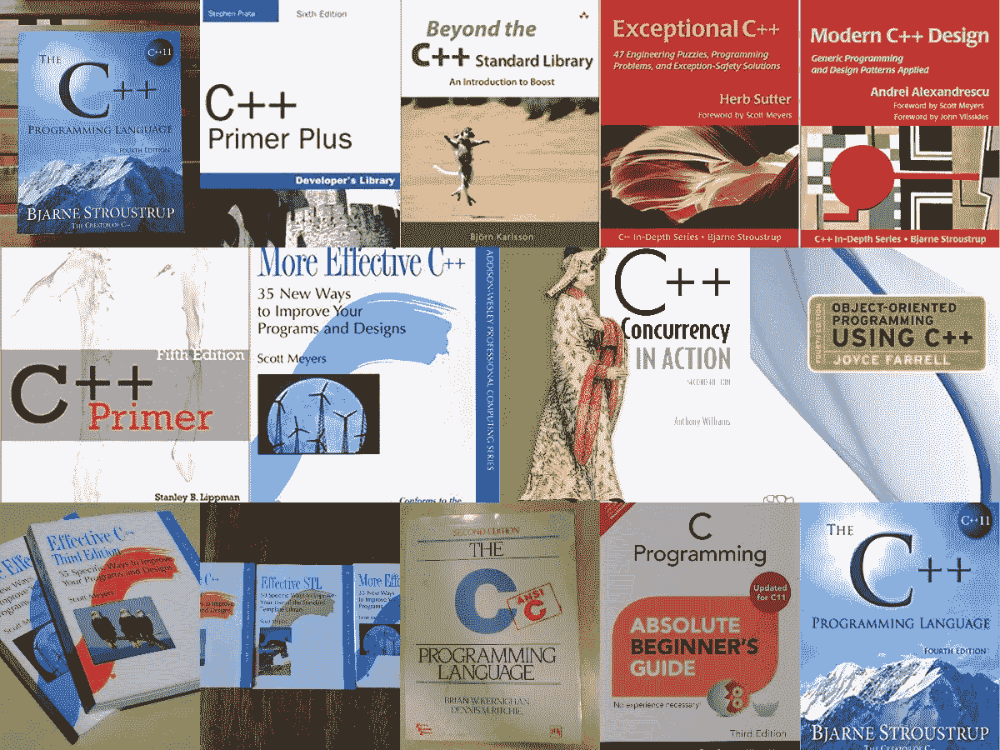
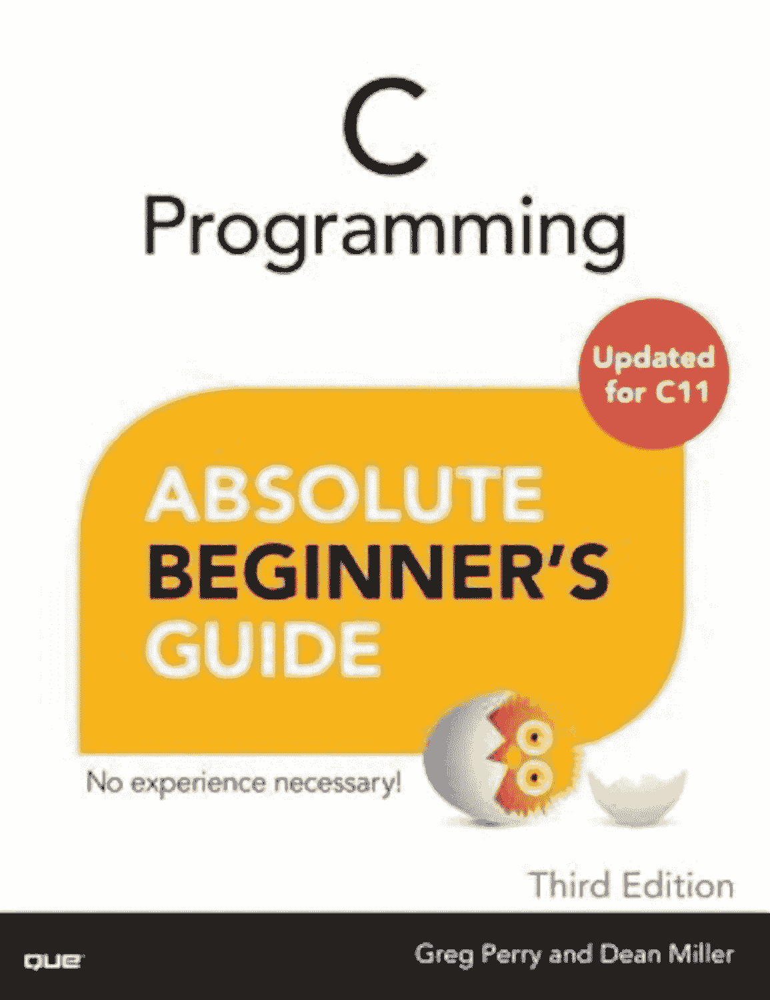
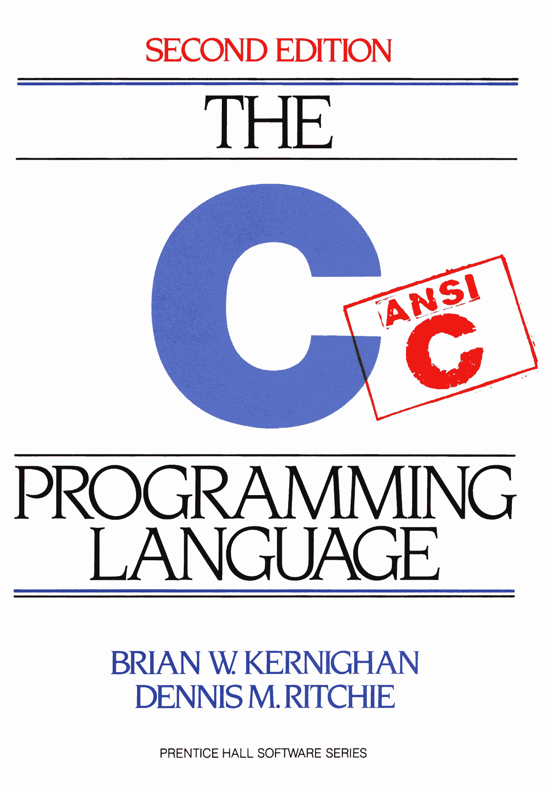
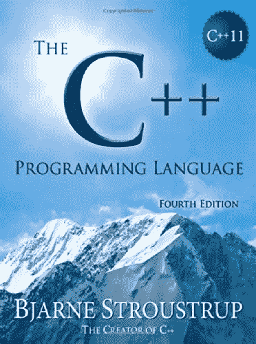
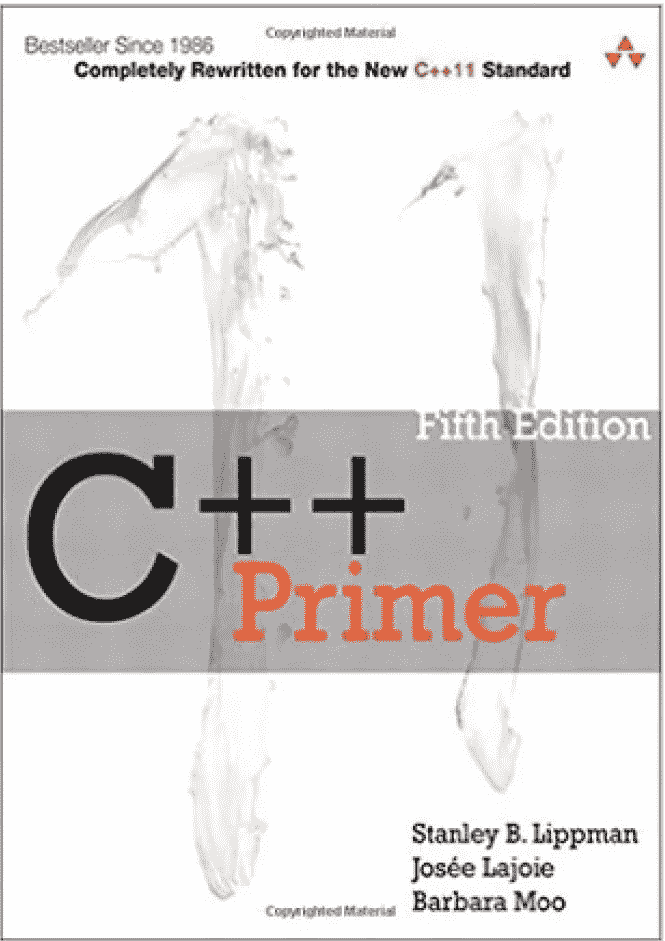
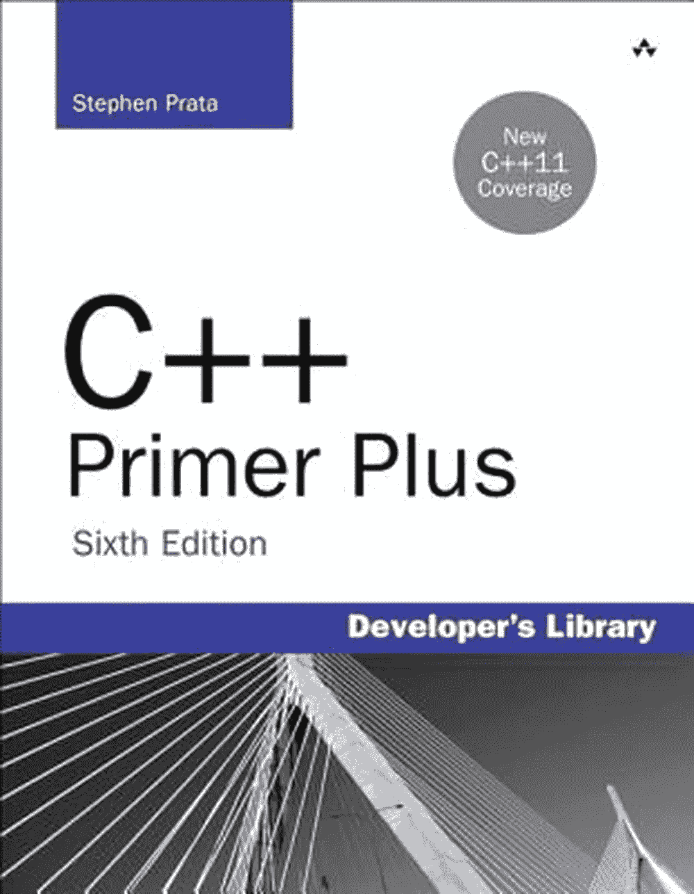
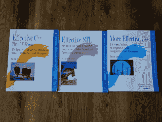
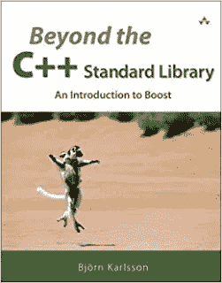
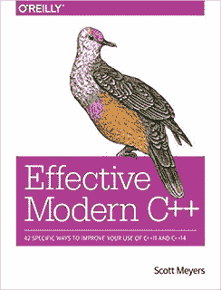

# 2023 年 10 本最适合初学者和有经验程序员的 C 和 C++编程书籍

> 原文：<https://medium.com/javarevisited/10-best-c-and-c-programming-books-for-beginners-and-experienced-programmers-eb5ee8dbdc5a?source=collection_archive---------0----------------------->

## 这些是掌握 C 和 C++编程语言的最佳书籍。它包括面向各种经验丰富的 C/C++开发人员的书籍。

如果你刚刚开始你的编程生涯，并对选择哪种编程语言学习编码感到困惑，那么你并不孤单。编程语言的数量之多简直令人应接不暇。

因此，值得一提的是，这些语言中有相当一部分大量借用了 [C](http://www.java67.com/2017/12/10-programming-languages-to-learn-in.html) 的语法，这使得用 C 编程语言开始您的编程之旅成为一个合适的选择。

在学习 Java 之前，我已经用 C 和 C++开始了我的编程生涯，自从我使用 C++以来已经超过 11 年了，虽然不像 [Java](https://javarevisited.blogspot.com/2018/05/top-5-java-courses-for-beginners-to-learn-online.html) 那样频繁，这已经成为我的主要技能，但是我的 C++知识帮助我从事同时使用 C++和 Java 的项目。

曾经被认为是结构化编程时代通用软件开发的首选语言，C 已经影响了相当多的语言，包括 [PHP](https://www.java67.com/2018/02/5-free-php-and-mysql-courses-for-web-developers.html) 、 [JavaScript](https://javarevisited.blogspot.com/2018/06/top-10-courses-to-learn-javascript-in.html) 、 [Java](https://www.java67.com/2018/08/top-10-free-java-courses-for-beginners-experienced-developers.html) 和 [Python](https://javarevisited.blogspot.com/2018/03/top-5-courses-to-learn-python-in-2018.html) 。

使用熟悉的 C 结构使新语言提高接受度成为可能。C++建立在 C 之上，现在提供对对象和类的支持。

很多时候，我对 C++很生疏，只写了很少的代码，但是每当我需要更新知识时，我都有合适的书和课程来做。我在专业和个人项目中都使用过 C++，并且大多使用 GCC 编译器。

**如果你问我 C++和 Java 哪个难学？我会说 C++？它甚至很难掌握，除非你每天都在编写 C++代码，否则你无法掌握它。**

这就是为什么从一开始就选择合适的书籍来学习 C++也是非常重要的，但由于市场上有如此多的 C++书籍，这往往很难做到。

在这篇文章中，我将分享几本我认为对初学者和中级 C++程序员都有好处的书。

我认为自己处于初级和中级 C++程序员之间，因为我实际上编写 C++，使用 Boost 项目的库，这就像 JDK，但提供的算法比集合框架更多。

通过使用 Boost 和 STL，你感觉像是在用 Java 编程，因为你不需要重新实现套接字、集合、序列化等常见功能。因此，我还收录了解释 STL 和 Boost 的最佳 C++书籍，这是任何专业 C++开发人员的两个基本库。

如果你像我一样是一个视觉化的主动学习者，那么你也可以将这些书籍与在线课程结合起来，如[**《c++编程入门——从入门到超越》**](https://click.linksynergy.com/deeplink?id=JVFxdTr9V80&mid=39197&murl=https%3A%2F%2Fwww.udemy.com%2Fcourse%2Fbeginning-c-plus-plus-programming%2F) ，它涵盖了你需要了解的关于 CPP 的一切，也提供了一个更加主动和视觉化的学习体验。这种书和课程的结合很好地在短时间内学习了新的东西。

<https://click.linksynergy.com/deeplink?id=JVFxdTr9V80&mid=39197&murl=https%3A%2F%2Fwww.udemy.com%2Fcourse%2Fbeginning-c-plus-plus-programming%2F>  

# 2023 年初学者和有经验的开发人员学习 C 和 C++的十大书籍

在不浪费你更多时间的情况下，从初学者的角度来看，这里列出了学习 C 和 C++的最佳书籍。不过，我也为有经验的开发人员和高年级学生提供了一些高级 C++书籍。

## 1. [C 编程绝对初学者指南](https://www.amazon.com/Programming-Absolute-Beginners-Guides-2013-08-07/dp/B0182PVZ08?tag=javamysqlanta-20)

这是初学者应该阅读的最好的 C 编程书籍之一。考虑到 C 具有被认为是低级的特性和操作，并且其不同大小的变量使得新程序员难以学习。

作者使用的方法是在广泛了解基础知识之后，逐渐增加内容的复杂性。使用 Code: Blocks IDE，这本书引导读者从基本的变量声明到更高级的主题，如使用函数、搜索和排序数组。

作者:Greg Perry 和 Dean Miller

虽然这本书对初学程序员来说很棒，但如果在书中更早地解决流控制问题，并将一些 C 相关的内容(如堆管理)留到最后，那就更好了。

尽管如此，这本书仍然是学习 C 语言的有效指南，你可以通过参加 Udemy 上的 C 语言编程在线课程来弥补这些不足，比如 [**C 语言初学者编程**](https://click.linksynergy.com/deeplink?id=JVFxdTr9V80&mid=39197&murl=https%3A%2F%2Fwww.udemy.com%2Fcourse%2Fc-programming-for-beginners-%2F) 。我强烈建议将这本书和课程结合起来，开始你的 C 编程之旅。

## 2.[C 语言程序设计(第二版)](https://www.amazon.com/Programming-Language-2nd-Brian-Kernighan/dp/0131103628?tag=javamysqlanta-20)

这可能是有史以来最值得推荐的 C 编程书籍。这本书通常被称为 **K & R** ，是所有 C 程序员的必读书籍，包括初学者和有经验的开发人员。

由 C 语言的设计者之一， **Dennis Ritchie，**撰写的这篇短文包含了语言背后的基本概念。正因为如此，C 语言在它的早期发展过程中得到了普及。对于所有需要详细 C 证明资料的人来说，这是事实上的标准。

作者:Brian W Kernighan 和 Dennis M Ritchie

K&R 涵盖了整个语言的规范，这对于其他不同语言的书籍来说是非常罕见的。除了基础知识之外，C 库也有很好的介绍，并且有大量的例子可供尝试。它的工作流程组织得更好，有助于学习者慢慢积累所涵盖的内容。

这里是获得这本书的链接

如果你需要一门网络课程来搭配这本书，我建议你在 Coursera 加入杜克大学的[**C 专业编程入门**](https://coursera.pxf.io/c/3294490/1164545/14726?u=https%3A%2F%2Fwww.coursera.org%2Fspecializations%2Fc-programming) 。这是一个在几周内学习和掌握 C 编程的伟大课程集。

<https://coursera.pxf.io/c/3294490/1164545/14726?u=https%3A%2F%2Fwww.coursera.org%2Fspecializations%2Fc-programming>  

除此之外，Coursera 还为每个人提供了 [**编码:C 和 C++特殊化**](https://coursera.pxf.io/c/3294490/1164545/14726?u=https%3A%2F%2Fwww.coursera.org%2Fspecializations%2Fcoding-for-everyone) 和 [**C++编程:这是一个实用的入门特殊化**](https://coursera.pxf.io/c/3294490/1164545/14726?u=https%3A%2F%2Fwww.coursera.org%2Fspecializations%2Fhands-on-cpp) ，非常适合学习 C++编码和开发

<https://coursera.pxf.io/c/3294490/1164545/14726?u=https%3A%2F%2Fwww.coursera.org%2Fspecializations%2Fhands-on-cpp>  

顺便说一下，除了单独加入这些课程和专业，你还可以加入 [**Coursera Plus**](https://coursera.pxf.io/c/3294490/1164545/14726?u=https%3A%2F%2Fwww.coursera.org%2Fcourseraplus) ，这是 Coursera 的一个订阅计划，让你可以无限制地访问他们最受欢迎的课程、专业、专业证书和指导项目。

<https://coursera.pxf.io/c/3294490/1164545/14726?u=https%3A%2F%2Fwww.coursera.org%2Fcourseraplus>  

## 3.[《c++程序设计语言(第四版)](https://www.amazon.com/C-Programming-Language-4th/dp/0321563840?tag=javamysqlanta-20)

这是从头学习 C++编程的最佳书籍之一，对初学者和有经验的程序员都有好处。由比雅尼·斯特劳斯特鲁普创作的这本书非常适合学习最流行的语言之一，C++增加了面向对象的概念(数据抽象、多态、继承和封装)。

此外，它还引入了函数重载和异常处理，这在 C 编程中是没有的。这种语言的创造者和开发者撰写了这本书，作为不断发展的编程语言的文档。随后的版本包括了语言的变化。虽然它涵盖了该语言的结构，但它的一些内容对于编程新手来说可能显得有些高深。

不过，掌握好基础知识，这本书对于各个层次的程序员来说都是极好的。它的姊妹书，David Vandevoorde 的 C++解决方案，为学习者提供了 Bjarne 书中的练习的分步解决方案。

如果你愿意，你也可以将这本书与 Udemy 上类似于 [**C++初学者教程**](https://click.linksynergy.com/fs-bin/click?id=JVFxdTr9V80&subid=0&offerid=323058.1&type=10&tmpid=14538&RD_PARM1=https%3A%2F%2Fwww.udemy.com%2Ffree-learn-c-tutorial-beginners%2F) 的免费在线课程结合起来，从一些积极的学习体验中受益。这个课程也是完全免费的，已经有超过 30 万的学生加入了。

## 4. [C++初级读本(第五版)](https://www.amazon.com/Primer-5th-Stanley-B-Lippman/dp/0321714113?tag=javamysqlanta-20)

作者:Stanley B Lippman，Josee Lajoie，和 Barbara E Moo

许多人都认为这篇文章是这门语言最有效的介绍之一。这本书努力成为各级程序员的参考书和学习工具。

只需要对编程结构有一个基本的理解，这本书很快就建立在一个人的知识上，涵盖了重要的概念，如 C++的模板设施，算法库和类。它广泛覆盖了该语言的特性，甚至为有经验的程序员提供了很好的见解。和这本书的传统一样，随着 C++分类的变化，文本也在不断更新。

这一有价值的资源还提供了许多旧版本中没有的新例子。如果你需要一门课程来搭配这本书，请查看 Udemy 上的 [**C++:从初学者到专家**](https://click.linksynergy.com/deeplink?id=JVFxdTr9V80&mid=39197&murl=https%3A%2F%2Fwww.udemy.com%2Fcourse%2Fvideo-course-c-from-beginner-to-expert%2F) 。

## 5. [C++ Primer Plus(第 6 版)](https://www.amazon.com/Primer-Plus-6th-Developers-Library/dp/0321776402?tag=javamysqlanta-20)

这本书是由 Stephen Prata 撰写的，对于新程序员、学生和有经验的开发人员来说都很棒，他们会发现这本书在 C++的编程逻辑方面很有帮助。

它引人入胜的解释，加上解释良好的例子，为新程序员提供了坚实的语言背景。文本也充分涵盖了面向对象的编程概念。这一点非常重要，因为对于新程序员来说，这个话题经常很混乱。Farrell 阐明了类和对象，使新程序员开始开发更复杂的程序结构成为可能。与列表中的其他文本相似，这本书详细介绍了 C++中模板的概念以及异常处理。有经验的程序员会发现它对随机数生成的解释非常有用，尤其是对于科学模拟。

而且，如果你需要一门高级课程来搭配这本书，可以看看约翰·珀塞尔的《学习高级 C++编程》 。

<https://click.linksynergy.com/deeplink?id=JVFxdTr9V80&mid=39197&murl=https%3A%2F%2Fwww.udemy.com%2Fcourse%2Flearn-advanced-c-programming%2F>  

## 6.[有效的 C++和更有效的 C++](https://www.amazon.com/Effective-Digital-Collection-Improve-Programming-ebook/dp/B008E30L9A?tag=javamysqlanta-20)

我在读了约书亚·布洛赫的《有效的 Java》之后，又读了斯科特·迈耶斯的《有效的 C++》。顾名思义，这本书旨在教你正确有效地使用 C++。

这本书的目标是成为第二好的 C++编程书籍，它就在那里。

这是一本非常棒的书，适合所有来自不同背景的程序员[学习 C++](/javarevisited/top-10-courses-to-learn-c-for-beginners-best-and-free-4afc262a544e) 像来自 C 的程序员和来自 Java 的程序员。

《高效 C++第三版》包含 55 篇短文，旨在提高您的 [C++程序和设计技能](https://javarevisited.blogspot.com/2020/07/top-10-courses-to-learn-c-in-depth-best.html)。这也有助于更好地理解 C++。简而言之，有经验的 C++开发人员必读的 C++书籍之一。

简而言之，这是任何 C++中级和有经验的开发人员的必读书籍之一。

## 7.[超越 C++标准库:Boost 简介](https://www.amazon.com/Beyond-Standard-Library-Introduction-Boost-ebook/dp/B003WOLHUI/?tag=javamysqlanta-20)

即使现在 C++标准库在 C++1 中已经有了很大的改进，但无论是专业项目还是个人项目，Boost 仍然是使用最多的 C++库。这本书很好地描述了 base Boost 库。这本书主要面向中级和有经验的 C++程序员，因为它不仅解释了如何使用 boost 库，还解释了为什么应该使用这些库。作为一名专业的 C++开发人员，必须学习并熟悉 Boost 库，没有比这本书更好的书了。

你也可以把这本书和 Udemy 的 John Purcell 的 [**学习高级 C++编程**](https://click.linksynergy.com/deeplink?id=JVFxdTr9V80&mid=39197&murl=https%3A%2F%2Fwww.udemy.com%2Fcourse%2Flearn-advanced-c-programming%2F) 课程结合起来。本课程不仅涵盖了 C++ STL 库，还介绍了 C++ 11 中引入的现代 C++概念，如 Lambda 表达式。

## 8.[有效的现代 C++](https://www.amazon.com/Effective-Modern-Specific-Ways-Improve/dp/1491903996?tag=javamysqlanta-20)

这是 Scott Mayor 的另一个杰作，他是最有效的 C++作者。这基本上是有效 C++的新版本，帮助 C++程序员从 C++03 升级到 C++11 和 C++14。

我强烈建议和 Effective C++一起阅读 Effective Modern C++，以便更好地学习 C++。

如果你需要一门课程，你也可以查看 Rainer Grimm on Educative 的 [**C++标准库包括 C++ 14 & C++ 17**](https://www.educative.io/courses/cpp-standard-library-including-cpp-14-and-cpp-17?affiliate_id=5073518643380224) 课程，进行一些互动学习体验。

## 9. [C++模板元编程](https://www.amazon.com/Template-Metaprogramming-Concepts-Techniques-Beyond/dp/0321227255?tag=javamysqlanta-20)

这是 C++深入系列中最好的 C++书籍之一。这本书是关于 C++中的元编程，基于 Boost 元编程库。这本书的第一部分解释了模板编程的基础，并很好地描述了 boost MPL 库。它有很多例子来引导你理解概念，它还解释了元编程，这是很多 C++程序员都不知道的。这不是一本初学者的书，而是一本适合 C++编程专家的好书。

如果你需要 C++模板的课程，我推荐 Udemy 上的 [**初学 C++模板课程**](https://click.linksynergy.com/deeplink?id=JVFxdTr9V80&mid=39197&murl=https%3A%2F%2Fwww.udemy.com%2Fcourse%2Fbeg-cpp-temp%2F) 。这是一门免费课程，这意味着你不需要支付任何费用，但你会学到很多东西。

## 10. [C++并发运行](https://www.amazon.sg/Concurrency-Action-2E-Anthony-Williams/dp/1617294691?tag=javamysqlanta-20)

这是使用 C++学习并发性的最好的书之一，这本书是安东尼·威廉姆斯写的，对于有经验的 C++开发人员或者想成为 C++编程专家的人来说是一本很好的书。对于 Java 开发人员来说，这就像是 Java 并发性在起作用。在 C++中，并发性一直是个棘手的问题，这也是 Java 取得好成绩的主要领域，但是 C++并发性已经有了长足的进步。第一版是一本很好的书，涵盖了 C++11 并发支持，包括线程库、原子库、C++内存模型、锁和互斥锁，以及多线程和并发应用程序的设计和调试问题。这是去年发行的第二版。更新后涵盖了 C++ 14 和 C++ 17 的所有最新变化。这本书将教你 C++开发人员编写健壮、高性能、优雅的并发 C++应用程序所需要知道的一切。如果你对 C++编程很认真，我强烈推荐你阅读这本书。如果你愿意，你也可以将这本书与 Udemy 上 Kasun Liyanage 的 [**现代 C++并发深度**](https://click.linksynergy.com/deeplink?id=JVFxdTr9V80&mid=39197&murl=https%3A%2F%2Fwww.udemy.com%2Fcourse%2Fmodern-cpp-concurrency-in-depth%2F) 课程结合起来，以便更快更积极地学习。它很好地补充了这本书。

以上是关于初学者、学生、初级程序员和开发人员学习 C 和 C++编程的最佳书籍**。无论是作为一名业余程序员还是计算机科学专业的学生，清单上的任何一本书都将成为你图书馆中必不可少的一部分。**

**即使每隔几年就有新的编程语言被开发出来， [C](/javarevisited/10-best-c-programming-courses-for-beginners-2c2c1f6bcb12) 和 [C++](/javarevisited/top-10-courses-to-learn-c-for-beginners-best-and-free-4afc262a544e) 仍然排名很高。事实证明，它们是学习其他编程语言的重要工具和途径。**

**因此，即使在今天的软件开发

其他**编程** **文章中，它们仍然是相关的和值得学习的****

*   **[初学者学习 C 编程的 5 大课程](https://javarevisited.blogspot.com/2019/11/top-5-courses-to-learn-c-programming-in.html)**
*   **[每个程序员都应该阅读的十大算法书籍](http://www.java67.com/2015/09/top-10-algorithm-books-every-programmer-read-learn.html)**
*   **[Java 和 Web 开发人员应该学习的 10 件事](http://javarevisited.blogspot.sg/2017/12/10-things-java-programmers-should-learn.html#axzz53ENLS1RB)**
*   **[2023 年学习数据结构排名前五的课程](https://javarevisited.blogspot.com/2018/11/top-5-data-structures-and-algorithm-online-courses.html)**
*   **[Java 开发人员应该知道的 10 个测试工具](http://javarevisited.blogspot.sg/2018/01/10-unit-testing-and-integration-tools-for-java-programmers.html)**
*   **Java 开发人员在日常工作中使用的 10 种工具**
*   **每个 Java 程序员都应该阅读的 10 本书**
*   **[Java 开发者应该学习的 5 个框架](http://javarevisited.blogspot.sg/2018/04/top-5-java-frameworks-to-learn-in-2018_27.html)**
*   **[学习 Python 编程语言的 10 个理由](https://javarevisited.blogspot.sg/2018/05/10-reasons-to-learn-python-programming.html)**
*   **[2023 年学习 Python 的前 5 本书](https://javarevisited.blogspot.com/2019/07/top-5-books-to-learn-python-in-2019.html)**
*   **[每个 Java 开发者都应该学习的 20 个库](https://javarevisited.blogspot.com/2018/01/top-20-libraries-and-apis-for-java-programmers.html)**
*   **[深入学习数据结构和算法的 10 门免费课程](http://www.java67.com/2019/02/top-10-free-algorithms-and-data.html)**
*   **[十大编程语言开始学习编码](http://www.java67.com/2017/12/10-programming-languages-to-learn-in.html)**
*   **[初学者学习 C++的 10 门免费课程](https://dev.to/javinpaul/top-10-courses-to-learn-c-in-depth-best-of-lot-1k7)**

****P. S. —** 虽然这些书对于学习 C 和 C++都是非常好和完美的，但是如果对你来说越来越难，那么我也建议你参加一个像 [**开始 C++编程—从初学者到超越**](https://click.linksynergy.com/deeplink?id=JVFxdTr9V80&mid=39197&murl=https%3A%2F%2Fwww.udemy.com%2Fcourse%2Fbeginning-c-plus-plus-programming%2F) 这样的课程，它涵盖了你需要知道的关于 CPP 的一切，并提供了一个更加积极和可视化的学习体验。**

**<https://click.linksynergy.com/deeplink?id=JVFxdTr9V80&mid=39197&murl=https%3A%2F%2Fwww.udemy.com%2Fcourse%2Fbeginning-c-plus-plus-programming%2F> **