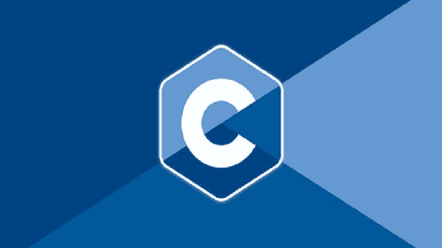
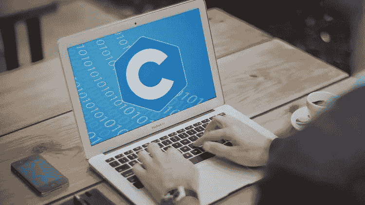
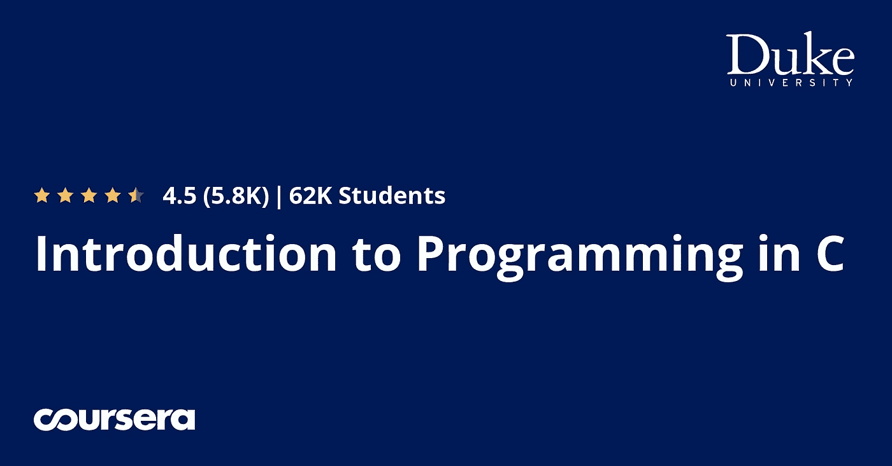
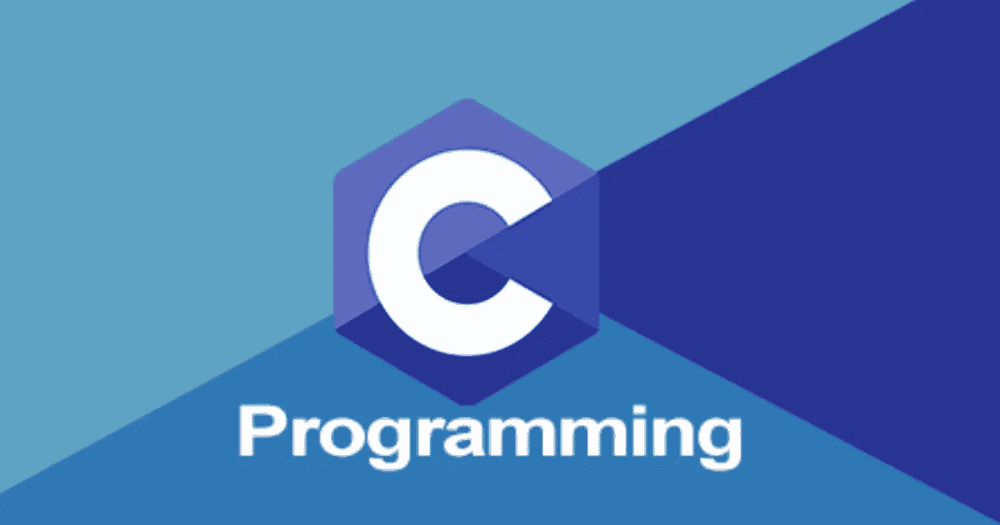
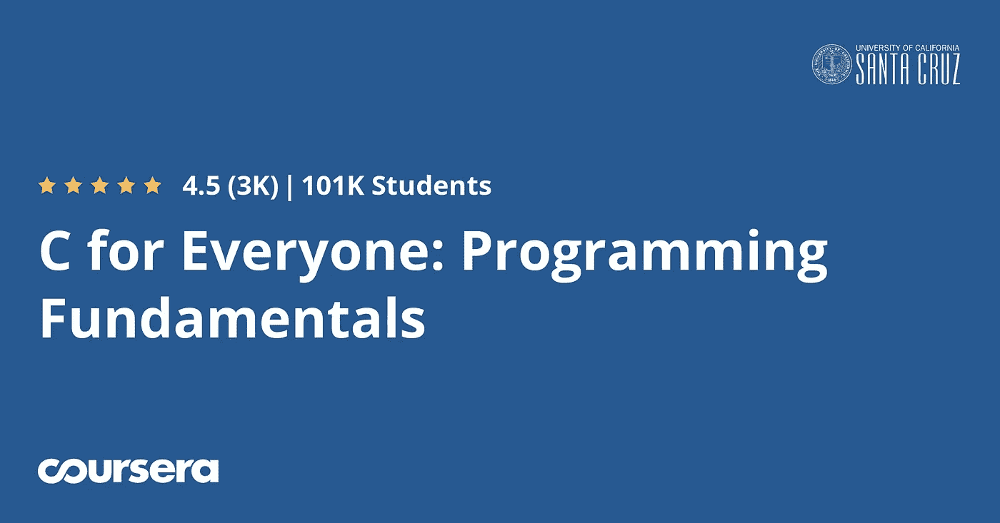
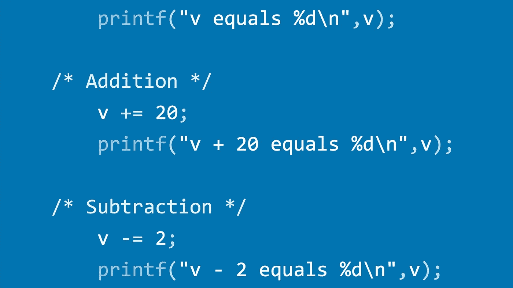
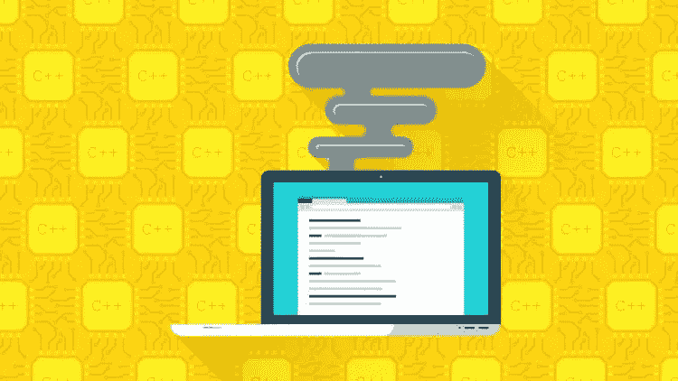

# 2023 年初学者学习的 10 门最佳 C 编程课程

> 原文：<https://medium.com/javarevisited/10-best-c-programming-courses-for-beginners-2c2c1f6bcb12?source=collection_archive---------0----------------------->

## 这些是 Udemy、Pluralsight、Coursera 和教育网站为初学者提供的学习 C 编程的最佳在线课程

各位好，如果你对 2023 年的**学习 C 编程感兴趣，想找最好的 C 编程课程，那么你来对地方了。**

早些时候，我已经分享了 [**最好的 C++编程课程**](/javarevisited/top-10-courses-to-learn-c-for-beginners-best-and-free-4afc262a544e) ，在这篇文章中，我将分享一些你可以在 2023 年从头开始学习 C 的最好的 C 编程课程。

c 编程语言是最古老、最强大的编程语言之一，已经存在了 50 年。是的，没错，50 年。任何技术能在如此长的时间内保持相关性，都是一项伟大的成就。

如果你不知道，C 编程语言是最早的通用编程语言之一，由 Dennis Ritchie 和 Ken Thomson 在 1969 年左右发明。Ken 当时正在编写 UNIX，这是另一种已经存在了 50 年的技术，需要一种可以完成各种任务的编程语言；其结果是 C 编程语言。

在那之后，C 统治了世界很长一段时间，在创造程序员日常使用的软件方面发挥了作用，像操作系统、数据库管理系统、设备驱动、游戏机等。

由于[Java](https://javarevisited.blogspot.com/2018/05/top-5-java-courses-for-beginners-to-learn-online.html)[c++](https://www.java67.com/2018/02/5-free-cpp-courses-to-learn-programming.html)[Python](https://javarevisited.blogspot.com/2018/12/10-free-python-courses-for-programmers.html)在应用开发上的领先，C 的魅力在过去的 20 年里一点点暗淡下来。但是对于嵌入式编程和底层系统编程，C 还是很受欢迎的。这种现象在学校、学院和大学等学术机构中也很普遍。事实上，这是我学习的第一门编程语言，正因为如此，我可以非常轻松地学习 Java 和 C++。

即使 [Python 作为第一编程语言更容易学习](https://dev.to/javinpaul/why-every-programmer-should-learn-python-in-2019-157i)，C 也是正确的选择，尤其是如果你想学习低级系统编程的话。

当你学习 C 的时候，你会学到你的程序是如何使用内存的，理解你读写变量的时候会发生什么，数组是如何工作的，指针和内存寻址是如何工作的。

这些是你用 [Java](/javarevisited/10-free-courses-to-learn-java-in-2019-22d1f33a3915) 或 [Python](/better-programming/top-5-courses-to-learn-python-in-2018-best-of-lot-26644a99e7ec) 学不到的东西，只有用 C 和 C++才能学到，这就是为什么我也建议程序员从 C 开始作为他们的第一编程语言。

# 初学者的 10 门最佳 C 编程课程

正如我说过的，C 是一种强大的通用编程语言，当你开始编程时，它也是一种很好的学习语言。它让你对程序如何使用内存有更多的控制，这是一个棘手的部分，但如果你想成为一名更好的程序员，这也是非常重要的。

它被大量用作系统编程语言，你会发现 [C](https://javarevisited.blogspot.com/2018/01/top-5-free-data-structure-and-algorithm-courses-java--c-programmers.html) 在嵌入式编程、电信和硬件接口等领域有很多用法。例如，它比任何其他语言都更多地用于编写设备驱动程序、处理器和微控制器。

现在，不要再浪费你的时间了，这里是我列出的一些从头开始学习 C 编程[的最佳课程。C 编程语言课程旨在为您提供成为一名高效 C 程序员所需的一切。](https://javarevisited.blogspot.com/2019/11/top-5-courses-to-learn-c-programming-in.html)

## 1. [C 编程初学者—掌握 C 语言](https://click.linksynergy.com/deeplink?id=JVFxdTr9V80&mid=39197&murl=https%3A%2F%2Fwww.udemy.com%2Fcourse%2Fc-programming-for-beginners-%2F) (Udemy)

这是我向所有初学者推荐的学习 C 的课程。这是一门结构非常好的课程，它将教你用 C 语言编程，这是最强大的通用编程语言之一。

本课程由 Tim Buchalka 的 Learn Programming Academy 和初级讲师 Jason Fedin 共同打造。如果你不知道，Tim 的学院制作了许多很棒的课程来学习像 Java、Android、Kotlin 等主要技术。

在本课程中，你将学习数据类型、运算符、控制结构、函数、数组，甚至指针，这些对于成为一名成功的 C 开发人员至关重要。

它有 23 个小时的内容，什么都有详细的讲解，对于初学者来说非常重要。如果你愿意，可以把这个和大卫和道恩·格里菲斯的 [**Head First C**](https://www.amazon.com/Head-First-C-Brain-Friendly-Guide/dp/1449399916?tag=javamysqlanta-20) 书结合起来，我最喜欢的学习 C 的书。

**这里是加入本课程的链接** — [C 语言编程初学者—掌握 C 语言](https://click.linksynergy.com/deeplink?id=JVFxdTr9V80&mid=39197&murl=https%3A%2F%2Fwww.udemy.com%2Fcourse%2Fc-programming-for-beginners-%2F)

## 2.C 编程初学者 (Udemy)

这是另一个在 Udemy 上学习 C 语言的课程。这个课程是由 Huw Collingbourne 创建的，他也是 C 语言小书、指针小书和逐位运算递归小书的作者。这门课程将从零开始教你 C 语言编程。本课程的好处在于，示例在 Windows 和 macOS 中都有显示，这意味着如果您使用 MacBook 进行编程，也不必担心。

课程结构合理，进展良好；您从基本工具开始，如 C 编译器、NetBeans 等 ide 和 Visual Studio，这是专业 C 开发所需要的。

在介绍了必要的工具之后，你将学习变量、数据类型、操作符、函数、结构、数组、指针和其他 C 语言特有的东西。

**这里是加入本课程** — [初学者 C 编程](https://click.linksynergy.com/deeplink?id=JVFxdTr9V80&mid=39197&murl=https%3A%2F%2Fwww.udemy.com%2Fcourse%2Fc-programming-for-beginners%2F)的链接

您还将学习 C 语言中的文件处理，这是许多其他课程没有涉及到的。总的来说，这是一个非常好的课程，适合初学 C 语言的人，或者是多年前在学校或大学学习 C 语言后，想更新 C 语言知识的人。

## 3.[C 专业编程入门](https://coursera.pxf.io/c/3294490/1164545/14726?u=https%3A%2F%2Fwww.coursera.org%2Fspecializations%2Fc-programming) (Coursera)

你可能不知道 Coursera 在 C 编程方面也有出色的专长。如果你正在学习 C 作为你的第一编程语言，那么这种专业化确实能给你很大的帮助。这个专业由杜克大学提供，它帮助那些想要通过编写计算机程序来解决复杂问题的学习者开发强大的编程基础，这意味着你不仅要学习 C 语言，还要学习如何编程。

通过四门课程，你将学会系统地开发算法，并读写实现算法的 C 代码。这将为你从事软件开发或其他计算领域的职业做好准备。

专业化还附带一个动手项目，当你完成它时，你还将获得一个证书，可以添加到你的简历或 LinkedIn 个人资料中。

**这里是加入本次 C 课程的链接**——[C 语言编程入门](https://coursera.pxf.io/c/3294490/1164545/14726?u=https%3A%2F%2Fwww.coursera.org%2Fspecializations%2Fc-programming)

顺便说一句，如果你发现 Coursera 专业化和认证有用，那么我建议你加入 [**Coursera Plus**](https://coursera.pxf.io/c/3294490/1164545/14726?u=https%3A%2F%2Fwww.coursera.org%2Fcourseraplus) ，这是 Coursera 的一个伟大的订阅计划，让你无限制地访问他们最受欢迎的课程、专业化、专业证书和指导项目。

它每年花费大约 399 美元，但是它完全值得你的钱，因为你得到了**无限证书**。

 [## Coursera Plus |无限制访问 7，000 多门在线课程

### 用 Coursera Plus 投资你的职业目标。无限制访问 90%以上的课程、项目…

coursera.pxf.io](https://coursera.pxf.io/c/3294490/1164545/14726?u=https%3A%2F%2Fwww.coursera.org%2Fcourseraplus) 

## 4.c 在 4 小时内(由 FreeCodeCamp 提供的免费 Youtube 课程)

这是 FreeCodeCamp 的 Youtube 频道提供的 4 小时学习 C 编程的免费课程。本课程由 Mike Dane 开发，并贡献给 FreeCodeCamp。

本课程将向你全面介绍 C 编程语言的所有核心概念。跟随教程视频，你很快就会成为一名 C 程序员！

这里是完整的课程，你也可以在这里免费观看。

## 5.肯尼·克尔的《C 编程语言基础》

这是在 Pluralsight 上学习 C 语言的另一个极好的课程，它旨在教你成为一个高效的 C 程序员所需的一切。

**这里是加入本次 C 语言基础课程**——[C 语言程序设计基础](https://pluralsight.pxf.io/c/1193463/424552/7490?u=https%3A%2F%2Fwww.pluralsight.com%2Fcourses%2Fc-lang-fundamentals)的链接

不过，你需要 Pluralsight 会员资格才能参加这门课程。我已经有一个了，如果你不断学习新东西，我建议你也买一个，这对程序员来说很重要。

会员费大约每月 29 美元，但你可以通过注册 299 美元的年度会员节省 14%。他们还提供 [**10 天免费试用**](http://pluralsight.pxf.io/c/1193463/424552/7490?u=https%3A%2F%2Fwww.pluralsight.com%2Flearn) ，这是探索他们平台的绝佳机会，你甚至可以免费完成这门课程。

 [## 个人技术技能|多视角

### 借助 Pluralsight，在开发运维、机器学习、云、安全基础设施等领域构建所需技能…

pluralsight.pxf.io](http://pluralsight.pxf.io/c/1193463/424552/7490?u=https%3A%2F%2Fwww.pluralsight.com%2Flearn) 

## 6.[从零开始学 C 语言](https://www.educative.io/courses/learn-c-from-scratch?affiliate_id=5073518643380224)(免费课程教学)

这是一门从零开始学习 C 的免费课程，由创始人兼伟大作家、讲师 Fahim Ul Haq 教授，他是一名 C/C++程序员，曾在[微软](https://javarevisited.blogspot.com/2015/12/30-microsoft-interview-questions-for-software-development-engineers.html)等科技巨头工作。我已经是他的文笔和文章清晰的粉丝了，这门课也不例外。

本课程将以全面而简洁的方式向您从头开始教授基本的编程概念，如数据类型、控制流、函数、输入/输出、内存、编译、调试和其他高级主题。

如果你想学习 C 并且正在寻找免费的资源，我强烈建议你加入这个开放互动的课程来学习 C。

这里是加入这个免费 C 语言课程的链接— [从零开始学习 C 语言](https://www.educative.io/courses/learn-c-from-scratch?affiliate_id=5073518643380224)

如果你不知道，Educative.io 是一个相对较新的在线学习平台，但我在那里找到了一些有益的课程，如[寻找系统设计面试](https://www.educative.io/collection/5668639101419520/5649050225344512?affiliate_id=5073518643380224)和[寻找编码模式](https://www.educative.io/collection/5668639101419520/5671464854355968?affiliate_id=5073518643380224)。我不知道他们也有一些免费的课程，但在探索的过程中，我发现了这块宝石。

而且，如果你发现教育平台和他们的互动课程很有用，那么你还可以获得[教育订阅](https://www.educative.io/subscription?affiliate_id=5073518643380224)，每月只需 18 美元，不仅可以获得这门课程，还可以获得他们的 100 多门课程。它非常划算，非常适合获得一些实践学习经验。

 [## 介绍:教育性订阅。获得无限制的访问权限！

### 技术领域永远不会停滞不前，我们也一样。我们定期更新课程，并不断增加新的课程…

www.educative.io](https://www.educative.io/subscription?affiliate_id=5073518643380224) 

## 7. [C for Everyone:编程基础](https://coursera.pxf.io/c/3294490/1164545/14726?u=https%3A%2F%2Fwww.coursera.org%2Flearn%2Fc-for-everyone)【Coursera 最佳课程】

这是另一个伟大的 Coursera 课程学习 C 编程的初学者。顾名思义，这门课程适合所有人。这意味着即使你没有编程经验，你也可以参加这个课程，从头开始学习 C 语言和编程。本课程是 [*为大家编码的一部分:C 和 C++特殊化*](https://coursera.pxf.io/c/3294490/1164545/14726?u=https%3A%2F%2Fwww.coursera.org%2Fspecializations%2Fcoding-for-everyone)

C 语言特别适合作为介绍编码的入门课程:它是一种久经考验的语言，它允许你在更深的层次上理解计算过程。

本课程不需要事先掌握编码知识。你将从头开始学习编程。本课程预计时间为五周，每周五小时。

**这里是加入本课程** — [C 给大家:编程基础](https://coursera.pxf.io/c/3294490/1164545/14726?u=https%3A%2F%2Fwww.coursera.org%2Flearn%2Fc-for-everyone)的链接

## 8.[高级 C 编程](http://linkedin-learning.pxf.io/c/1193463/449670/8005?u=https%3A%2F%2Fwww.linkedin.com%2Flearning%2Fadvanced-c-programming)(领英学习)

这是一门高级 C 编程课程，面向已经熟悉 C 语言和一般编程的人。在本课程中，Dan Gookin 提供了一些帮助您扩展 C 编程技能的技巧。

在本课程中，您将学习如何读写主函数参数，构建更多有用的变量，以及使用[数组](/javarevisited/20-array-coding-problems-and-questions-from-programming-interviews-869b475b9121)和结构。此外，获取生成指针的技巧，并在此过程中接受实践挑战来测试您的学习。

**这里是加入本课程** — [高级 C 编程](http://linkedin-learning.pxf.io/c/1193463/449670/8005?u=https%3A%2F%2Fwww.linkedin.com%2Flearning%2Fadvanced-c-programming)的链接

## 9.面向初学者的 C 编程:理论、实践和动手操作！

这是学习 C 编程的另一门评分最高的课程，强烈推荐给初学者。本课程由 Vlad Budnitski 创建，将在 12 年内教您 C 编程。五个小时。

以下是本课程涵盖的主要内容:

1.  一般编程概念。
2.  输入和输出。
3.  变量如何工作。
4.  条件和控制流程。
5.  不同类型的循环。
6.  功能。
7.  数组。
8.  指针。
9.  弦乐。
10.  递归。

这个课程主要是为那些想以简单有趣的方式学习新技能的初学者和业余爱好者准备的。

**这里是加入本课程的链接**——[初学者 C 语言编程:理论、实践和动手操作！](https://click.linksynergy.com/deeplink?id=JVFxdTr9V80&mid=39197&murl=https%3A%2F%2Fwww.udemy.com%2Fcourse%2Fc-programming-for-beginners-programming-in-c%2F)

以上就是 2023 年从零开始学习 C 编程的一些**最好的课程。正如我所说，C 是最早的通用编程语言之一，也是所有编程语言之母，如 [Java](/javarevisited/top-5-java-online-courses-for-beginners-best-of-lot-1e1e240a758) 、 [Python](https://hackernoon.com/top-5-courses-to-learn-python-in-2020-best-of-lot-bdq3y42) 、 [C++](https://dev.to/javinpaul/top-10-courses-to-learn-c-in-depth-best-of-lot-1k7) 、 [JavaScript](/javarevisited/my-favorite-free-tutorials-and-courses-to-learn-javascript-8f4d0a71faf2) 、 [Swift](/javarevisited/top-5-online-courses-to-learn-ios-12-swift-in-2019-a35ae1be7b2b) 和 [Go](https://www.java67.com/2019/12/top-5-courses-to-learn-go-or-golang.html) 。**

从 C 开始不仅能帮助你更好地理解这门语言，还能让你更接近机器。当你使用 C 语言时，你会了解计算机，因为它大量用于编写设备驱动程序、微控制器和低级系统编程。

其他**编程资源(免费和付费)**您可以查看一下

*   [面向初学者的五大免费 C 编程课程](https://www.java67.com/2020/07/5-free-courses-to-learn-c-programming.html)
*   [2023 年 Java 开发者路线图](https://javarevisited.blogspot.com/2019/10/the-java-developer-roadmap.html)
*   [2023 年学习 Python 的十大课程](/better-programming/top-5-courses-to-learn-python-in-2018-best-of-lot-26644a99e7ec)
*   [面向 Java 和 DevOps 工程师的 5 门免费 Docker 课程](http://www.java67.com/2018/02/5-free-docker-courses-for-java-and-DevOps-engineers.html)
*   [学习 Ruby 编程的 5 大课程](https://www.java67.com/2018/02/5-free-ruby-and-rails-courses-to-learn-online.html)
*   [学习核心 Spring、Spring Boot 和 Spring MVC 的 5 门免费课程](http://www.java67.com/2017/11/top-5-free-core-spring-mvc-courses-learn-online.html)
*   [免费学习区块链技术的 5 门课程](http://www.java67.com/2018/02/5-free-blockchain-technology-courses.html)
*   [面向 JavaScript 开发人员学习 React JS 的 5 门免费课程](http://www.java67.com/2018/02/5-free-react-courses-for-web-developers.html)
*   [学习 Java 编程的 5 门免费课程](https://javarevisited.blogspot.com/2018/05/top-5-java-courses-for-beginners-to-learn-online.html)
*   [为网络开发者提供 5 门免费的 JavaScript 课程](http://www.java67.com/2018/04/top-5-free-javascript-courses-to-learn.html)
*   [学习 Learn RESTful Web 服务的 3 本书和课程](http://www.java67.com/2018/02/3-books-and-courses-to-learn-restful-web-services-with-spring.html)
*   学习亚马逊网络服务或 AWS 的 5 门课程
*   [10 面向程序员的机器学习和数据科学课程](https://javarevisited.blogspot.com/2018/10/data-science-and-machine-learning-courses-using-python-and-R-programming.html)

感谢您阅读本文。如果你喜欢这些 **C 编程课程**，那么请分享给你的朋友和同事。如果您有任何问题或反馈，请留言。

**P. S.** —如果你真的想学习 C 编程并寻找一些免费资源，如书籍和课程，那么你也可以在 Udemy 上查看这个 [**完全 C 编程(免费)**](https://click.linksynergy.com/deeplink?id=JVFxdTr9V80&mid=39197&murl=https%3A%2F%2Fwww.udemy.com%2Fcourse%2Fthe-complete-c-programming%2F) 课程。这是完全免费的，你只需要一个 Udemy 帐户就可以加入这个课程。

 [## 免费 C 教程-完整的 C 编程

### 我的名字是 Tweneboah 德里克奥武苏，我是 Spart 咨询有限责任公司的创始人。Spartee 公司毕业于…

udemy.com](https://click.linksynergy.com/deeplink?id=JVFxdTr9V80&mid=39197&murl=https%3A%2F%2Fwww.udemy.com%2Fcourse%2Fthe-complete-c-programming%2F)