# 2023 年 11 个最佳 Coursera 认证和初学者学习技术技能的课程

> 原文：<https://medium.com/javarevisited/10-best-coursera-certifications-and-courses-for-beginners-b13e930f2830?source=collection_archive---------0----------------------->

## 我最喜欢的 Coursera 课程、认证、专业化和 2023 年学习热门技术技能的项目

[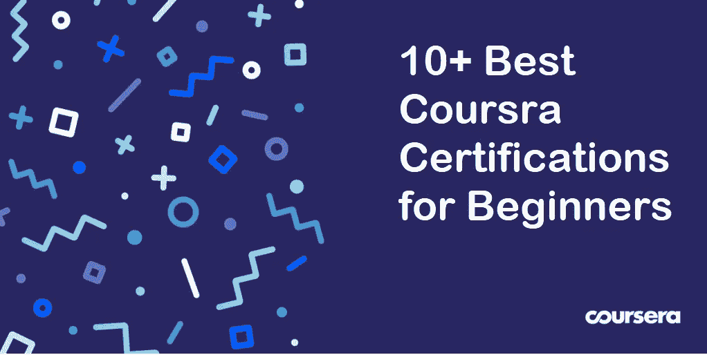](https://coursera.pxf.io/c/3294490/1164545/14726?u=https%3A%2F%2Fwww.coursera.org%2F)

图片 _ 来源— Coursera

大家好，如果你正在寻找最好的 Coursera 课程、认证和专业，以开始你的 IT 职业生涯或进行职业转换，那么你来对地方了。

过去，我曾分享过学习</javarevisited/10-best-aws-google-cloud-and-azure-courses-and-certification-from-coursera-to-join-in-2021-5c5e2029a8e7>**[**人工智能**](/javarevisited/10-best-coursera-certifications-courses-for-machine-learning-and-artificial-intelligence-256d9a125822)[**Python 编程**](/javarevisited/10-best-python-certification-courses-from-coursera-4576890eb6b3)[**软件开发**](/javarevisited/10-best-software-development-courses-certifications-from-coursera-4ccc59aae201) 和 [**Web 开发**](https://javarevisited.blogspot.com/2020/08/top-10-coursera-certifications-to-learn-web-development.html#axzz6WbpwHhYm) 的最佳 Coursera 课程和认证，在这篇文章中，我将分享你可以加入的最佳课程、项目、认证和专业，为你的职业生涯增光添彩 Coursera 是一个大规模的学习平台，为世界上所有愿意接受更多教育和获得更多经验的人开放，针对任何水平的经验，无论你是初学者还是专家。该平台由两位科学家[吴恩达](https://coursera.pxf.io/c/3294490/1164545/14726?u=https%3A%2F%2Fwww.coursera.org%2Finstructor%2Fandrewng)和[达芙妮·柯勒](https://coursera.pxf.io/c/3294490/1164545/14726?u=https%3A%2F%2Fwww.coursera.org%2Finstructor%2Fkoller)于 2012 年创建。该平台提供多种类型的课程，如专业化，这是一套课程，当你完成这些课程后，你将获得一个证书，证明你已经掌握了某个行业或领域，还有专业认证，这是大学提供的硕士学位的一部分。Coursera 最大的好处是你有机会向密歇根大学、耶鲁大学、伦敦大学等世界知名大学以及 IBM、谷歌、亚马逊和 SAS 等世界最大的顶级科技公司学习。从他们精心研究和精心组织的项目中学习意味着你将学到促进职业发展所需的所有必要技能，你还将从他们那里获得认证，这将提升你的简历和 LinkedIn 档案。将你的简历与谷歌、亚马逊和 IBM 这样的公司联系起来，是你能为提升职业前景所做的最好的事情。**

# **2023 年 11 大 Coursera 认证和课程**

**Coursera 为许多行业的程序员提供了许多专业，但在这篇文章中，你会看到 10 个最好的专业来开始你在 IT 行业的职业生涯，无论是作为一名 [python 开发者](https://javarevisited.blogspot.com/2020/09/python-for-everybody-course-from-coursera-review.html)还是 [AWS 工程师](/javarevisited/top-5-aws-training-courses-to-crack-amazon-web-service-solutions-architect-associate-certification-3f4affa8f660?source=collection_home---4------0-----------------------)。Coursera 也有学习数据科学、机器学习和人工智能等按需技能的课程和专业。**

## **1.[谷歌 IT 支持](https://coursera.pxf.io/c/3294490/1164545/14726?u=https%3A%2F%2Fwww.coursera.org%2Fprofessional-certificates%2Fgoogle-it-support)**

**这是开始您 IT 支持职业生涯的最佳 Coursera 专业。这个项目是几年前开始的，由 5 门课程组成，旨在为初学者进入 IT 行业在小型企业服务台工作做准备。**

**这一专业向您介绍了许多术语，如 Linux 等操作系统，以及如何对它们进行故障排除，网络和客户支持等等。**

****这里是加入这个项目的链接** — [谷歌 IT 支持](https://coursera.pxf.io/c/3294490/1164545/14726?u=https%3A%2F%2Fwww.coursera.org%2Fprofessional-certificates%2Fgoogle-it-support)**

**[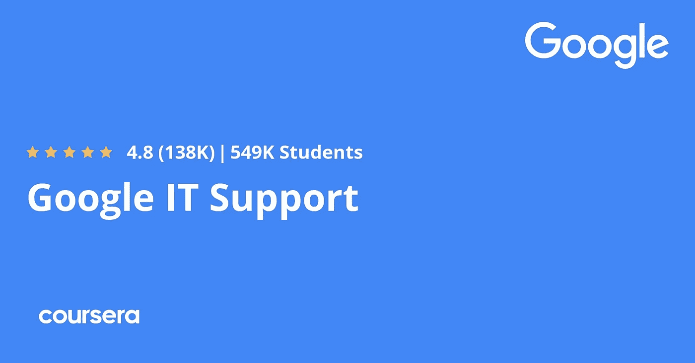](https://coursera.pxf.io/c/3294490/1164545/14726?u=https%3A%2F%2Fwww.coursera.org%2Fprofessional-certificates%2Fgoogle-it-support)**

## **2.[面向所有人的编程(Python 入门)](https://coursera.pxf.io/c/3294490/1164545/14726?u=https%3A%2F%2Fwww.coursera.org%2Flearn%2Fpython)**

**这是 Coursera 上最受欢迎的 Python 3 课程，每个人都应该参加，包括想要学习 Python 的初学者和有经验的程序员。**

**这门课程是由密歇根大学提供的[**Python for Everybody Specialization**](https://coursera.pxf.io/c/3294490/1164545/14726?u=https%3A%2F%2Fwww.coursera.org%2Fspecializations%2Fpython)的一部分，旨在教授每个人使用 Python 编写计算机程序的基础知识。它涵盖了如何从 Python 中的一系列简单指令构造程序的基础知识。**

**这门课程没有先决条件，除了最简单的数学之外，它避开了所有内容。任何有一定计算机经验的人都应该能够掌握这门课程的内容。**

**本课程涵盖教材 [**“人人用 Python**](https://www.amazon.com/Python-Everybody-Exploring-Data/dp/1530051126?tag=javamysqlanta-20)”的第 1-5 章。一旦学生完成这门课程，他们将准备参加更高级的编程课程。**

****这里是加入这个为大家准备的** — [编程](https://coursera.pxf.io/c/3294490/1164545/14726?u=https%3A%2F%2Fwww.coursera.org%2Flearn%2Fpython)最佳课程的链接**

**[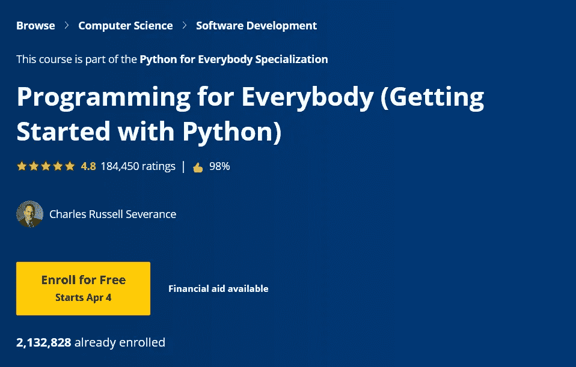](https://coursera.pxf.io/c/3294490/1164545/14726?u=https%3A%2F%2Fwww.coursera.org%2Flearn%2Fpython)**

## **3.[使用 Python 实现谷歌 IT 自动化](https://coursera.pxf.io/c/3294490/1164545/14726?u=https%3A%2F%2Fwww.coursera.org%2Fprofessional-certificates%2Fgoogle-it-automation)**

**这是 Google 针对希望成为 python 开发人员的人提供的另一个很好的专业化，通过许多小课程向他们展示从初学者到专家的过程，教你 Python 的基本语法，[数据结构，](/javarevisited/7-best-courses-to-learn-data-structure-and-algorithms-d5379ae2588)自动化，[面向对象编程](/javarevisited/my-favorite-courses-to-learn-object-oriented-programming-and-design-in-2019-197bab351733?source=---------103------------------)，如何使用 Git 和 Github，以及这个专业化中包含的更多主题。**

**该证书可以在大约 6 个月内完成，旨在为您在 IT 领域的各种角色做准备，如更高级的 IT 支持专家或初级系统管理员职位。**

**完成后，你可以与潜在雇主分享你的信息，像沃尔玛，Sprint，Hulu，美国银行，谷歌(当然！)，还有更多。**

****以下是加入该认证的链接** — [用 Python 实现谷歌 IT 自动化](https://coursera.pxf.io/c/3294490/1164545/14726?u=https%3A%2F%2Fwww.coursera.org%2Fprofessional-certificates%2Fgoogle-it-automation)**

****

## **4.[来自 DeepLearning 的 AI for Everyone。艾](https://coursera.pxf.io/c/3294490/1164545/14726?u=https%3A%2F%2Fwww.coursera.org%2Flearn%2Fai-for-everyone)**

**这是初学者学习 AI 最好的 Coursera 课程。这门课程是由 Coursera 的创始人和顶级讲师之一吴恩达创建的，它将向你概述什么是人工智能，以及它如何帮助带来积极的变化。**

**以下是您将在本课程中学到的内容:**

1.  **常见人工智能术语背后的含义，包括神经网络、机器学习、深度学习和数据科学**
2.  **人工智能实际上能做什么和不能做什么**
3.  **如何在你自己的组织中发现应用人工智能解决问题的机会**
4.  **构建机器学习和数据科学项目是什么感觉**
5.  **如何与人工智能团队合作，并在您的公司中建立人工智能战略**
6.  **如何驾驭围绕人工智能的伦理和社会讨论**

**您还将学习机器学习和深度神经网络等术语，以及它们如何工作，因此您将获得一些关于人工智能的技术概述。**

****这里是加入这个节目的链接**——[来自深度学习的 AI for Everyone。艾](https://coursera.pxf.io/c/3294490/1164545/14726?u=https%3A%2F%2Fwww.coursera.org%2Flearn%2Fai-for-everyone)**

**[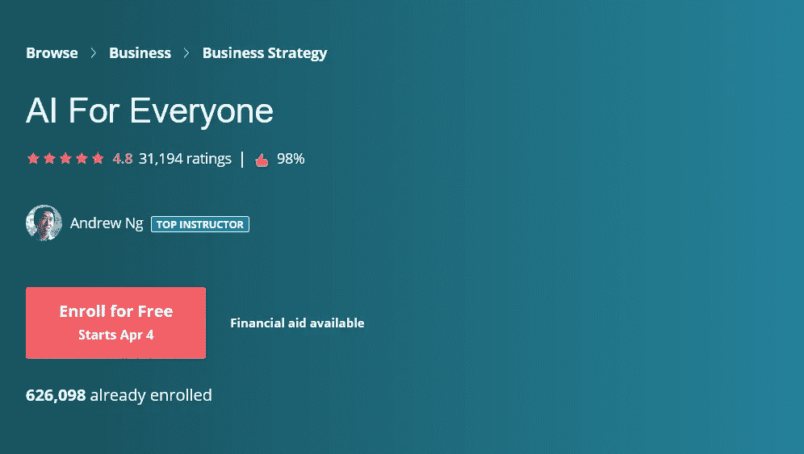](https://coursera.pxf.io/c/3294490/1164545/14726?u=https%3A%2F%2Fwww.coursera.org%2Flearn%2Fai-for-everyone)**

## **5. [IBM 数据科学](https://coursera.pxf.io/c/3294490/1164545/14726?u=https%3A%2F%2Fwww.coursera.org%2Fprofessional-certificates%2Fibm-data-science)**

**该证书将不同程度地帮助任何考虑从事数据科学或机器学习职业的人，这些人之前没有编程或计算机科学方面的经验，从 python 初学者和库数据库和 [SQL](/hackernoon/top-5-sql-and-database-courses-to-learn-online-48424533ac61) 以及数据可视化和机器学习等等开始。**

**该专业的每门课程都包括理解测试，旨在评估每位学员理解所介绍的概念以及在实际实践中运用这些概念的能力。**

**具体而言，这些概念与关于 1)人工智能的介绍性知识相关；2)数据科学，以及；3)人工智能阶梯。**

****这里是加入这个专业** — [IBM 数据科学](https://coursera.pxf.io/c/3294490/1164545/14726?u=https%3A%2F%2Fwww.coursera.org%2Fprofessional-certificates%2Fibm-data-science)的链接**

**[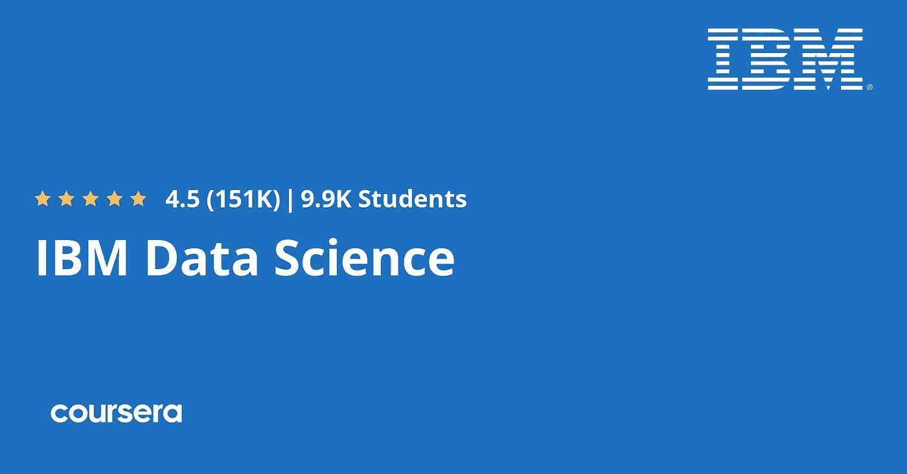](https://coursera.pxf.io/c/3294490/1164545/14726?u=https%3A%2F%2Fwww.coursera.org%2Fprofessional-certificates%2Fibm-data-science)**

## **6. [AWS 基础知识](https://coursera.pxf.io/c/3294490/1164545/14726?u=https%3A%2F%2Fwww.coursera.org%2Fspecializations%2Faws-fundamentals)**

**该专业面向至少有一些 IT 行业背景并希望学习 amazon web services [AWS](/javarevisited/top-5-online-courses-to-become-aws-certified-developer-associate-in-2020-best-of-lot-9b22baf84ca8) 的基础设施以及这一庞大服务的优势和功能的人。**

**在整个专业化过程中，您将通过完成由 AWS 讲师创建的练习，获得如何使用它的实践经验。**

**下面是加入这个项目的链接— [**AWS 基础**](https://coursera.pxf.io/c/3294490/1164545/14726?u=https%3A%2F%2Fwww.coursera.org%2Fspecializations%2Faws-fundamentals)**

**[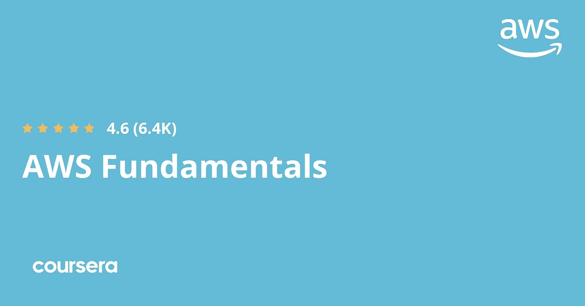](https://coursera.pxf.io/c/3294490/1164545/14726?u=https%3A%2F%2Fwww.coursera.org%2Fspecializations%2Faws-fundamentals)**

## **7.[AWS 机器学习入门](https://coursera.pxf.io/c/3294490/1164545/14726?u=https%3A%2F%2Fwww.coursera.org%2Flearn%2Faws-machine-learning)**

**这个专业是为那些想从事机器学习和[人工智能](/javarevisited/7-best-courses-to-learn-artificial-intelligence-in-2020-26d59d62f6fe)的人准备的。这个项目教你如何在 amazon web service、AWS SageMaker(如计算机视觉和自然语言处理)上构建、训练和部署你的模型，以及如何使用其他服务。**

**每个主题由几个模块组成，深入探讨各种 ML 概念、AWS 服务以及专家将概念付诸实践的见解。**

****这里是加入本节目的链接**—[AWS 机器学习入门](https://coursera.pxf.io/c/3294490/1164545/14726?u=https%3A%2F%2Fwww.coursera.org%2Flearn%2Faws-machine-learning)**

**[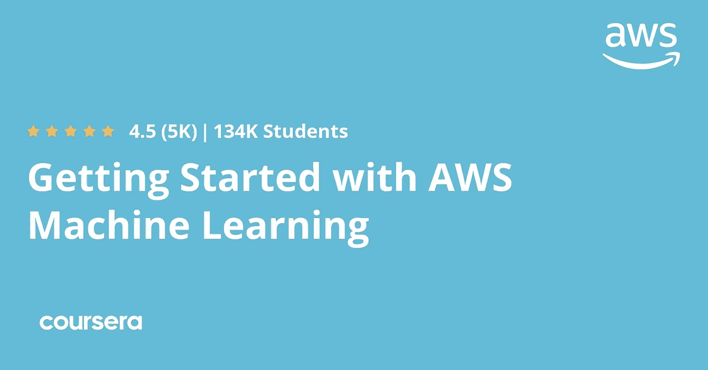](https://coursera.pxf.io/c/3294490/1164545/14726?u=https%3A%2F%2Fwww.coursera.org%2Flearn%2Faws-machine-learning)**

## **8. [AWS 计算机视觉:GluonCV 入门](https://coursera.pxf.io/c/3294490/1164545/14726?u=https%3A%2F%2Fwww.coursera.org%2Flearn%2Faws-computer-vision-gluoncv)**

**对于任何想要借助[深度神经网络](https://javarevisited.blogspot.com/2019/08/top-5-courses-to-learn-deep-learning.html)创建计算机视觉应用的人来说，都可以注册这个专业，它将教你如何使用许多亚马逊 AWS 服务来实现这一目标，如亚马逊 Rekognition、AWS SegeMaker 等等。**

**本课程涵盖 AWS 服务和框架，包括 Amazon Rekognition、Amazon SageMaker、Amazon SageMaker GroundTruth 和 Amazon SageMaker Neo、通过 Amazon EC2 的 AWS 深度学习 AMIs、AWS 深度学习容器和 AWS 上的 Apache MXNet。**

**本课程由视频讲座、动手练习指南、演示和测验组成。**

****以下是加入本课程的链接** — [AWS 计算机视觉:GluonCV 入门](https://coursera.pxf.io/c/3294490/1164545/14726?u=https%3A%2F%2Fwww.coursera.org%2Flearn%2Faws-computer-vision-gluoncv)**

**[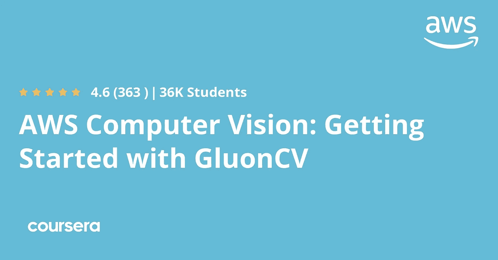](https://coursera.pxf.io/c/3294490/1164545/14726?u=https%3A%2F%2Fwww.coursera.org%2Flearn%2Faws-computer-vision-gluoncv)**

## **9.[阿里云上的云计算基础](https://coursera.pxf.io/c/3294490/1164545/14726?u=https%3A%2F%2Fwww.coursera.org%2Flearn%2Falibaba-cloud-computing)**

**该课程由阿里云提供，类似于亚马逊的 AWS，旨在向个人和企业展示如何利用云计算的力量，以及如何通过使用几种阿里云服务并学习如何以最佳方式使用它们来帮助他们扩展业务。**

**完成本课程后，学习者应具备云计算、网络安全和 IT 行业的一般知识。能够基于阿里云的产品开发通用解决方案和企业最佳实践。**

****这里是加入本课程的链接**——[阿里云上的云计算基础](https://coursera.pxf.io/c/3294490/1164545/14726?u=https%3A%2F%2Fwww.coursera.org%2Flearn%2Falibaba-cloud-computing)**

****

## **10.[使用谷歌云的云架构](https://coursera.pxf.io/c/3294490/1164545/14726?u=https%3A%2F%2Fwww.coursera.org%2Fprofessional-certificates%2Fgcp-cloud-architect)**

**谷歌提供的这种专业化旨在针对那些希望成为专业云架构师的人，以便他们让组织利用[谷歌云计算](https://javarevisited.blogspot.com/2020/05/top-5-course-to-crack-google-cloud-associate-cloud-engineer-certification-exam.html)的力量，并帮助他们设计和开发业务问题的解决方案。**

****以下是加入该认证的链接—**[Google Cloud 云架构](https://coursera.pxf.io/c/3294490/1164545/14726?u=https%3A%2F%2Fwww.coursera.org%2Fprofessional-certificates%2Fgcp-cloud-architect)**

**[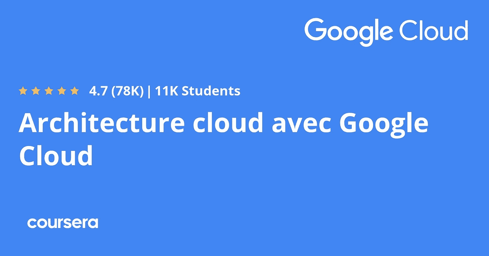](https://coursera.pxf.io/c/3294490/1164545/14726?u=https%3A%2F%2Fwww.coursera.org%2Fprofessional-certificates%2Fgcp-cloud-architect)**

## **11.[谷歌云平台的安全性](https://coursera.pxf.io/c/3294490/1164545/14726?u=https%3A%2F%2Fwww.coursera.org%2Fspecializations%2Fsecurity-google-cloud-platform)**

**专业化是为那些将使用谷歌云平台( [GCP](https://javarevisited.blogspot.com/2019/07/top-5-google-cloud-platform-gcp-courses-certifications-online.html) )开展业务的人设计的，它将教会你许多谷歌服务，以及如何部署你的应用程序并保护它们免受攻击者的攻击。**

****这里是加入本课程的链接**——[谷歌云平台中的安全性](https://coursera.pxf.io/c/3294490/1164545/14726?u=https%3A%2F%2Fwww.coursera.org%2Fspecializations%2Fsecurity-google-cloud-platform)**

**[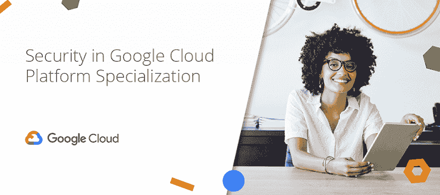](https://coursera.pxf.io/c/3294490/1164545/14726?u=https%3A%2F%2Fwww.coursera.org%2Fspecializations%2Fsecurity-google-cloud-platform)**

# **2023 年谷歌、IBM 和脸书的最佳 Coursera 专业认证**

**到目前为止，我们已经涵盖了最受欢迎的 Coursera 课程和认证，以学习 Python、数据科学、云计算、AWS、谷歌云平台及其时间，以查看最佳 Coursera 认证，特别是来自谷歌、脸书、IBM 和 Salesforce 的专业证书。**

**这里列出了数据分析、项目管理、用户界面和 UX 设计、市场营销、网络安全、云计算和全栈开发方面的最佳 Coursera 认证。**

**以下是其中的佼佼者。**

1.  **[**谷歌数据分析专业证书**](https://coursera.pxf.io/c/3294490/1164545/14726?u=https%3A%2F%2Fwww.coursera.org%2Fprofessional-certificates%2Fgoogle-data-analytics)**【48.6 万学生】****
2.  **[**谷歌项目管理:专业证书**](https://coursera.pxf.io/c/3294490/1164545/14726?u=https%3A%2F%2Fwww.coursera.org%2Fprofessional-certificates%2Fgoogle-project-management)**【332k 学员】****
3.  **[**谷歌 UX 设计专业证书**](https://coursera.pxf.io/c/3294490/1164545/14726?u=https%3A%2F%2Fwww.coursera.org%2Fprofessional-certificates%2Fgoogle-ux-design)**【27 万学生】****
4.  **[**脸书社交媒体营销专业证书**](https://coursera.pxf.io/c/3294490/1164545/14726?u=https%3A%2F%2Fwww.coursera.org%2Fprofessional-certificates%2Ffacebook-social-media-marketing)**【75K 学员】****
5.  **[**IBM 网络安全分析师职业证书**](https://coursera.pxf.io/c/3294490/1164545/14726?u=https%3A%2F%2Fwww.coursera.org%2Fprofessional-certificates%2Fibm-cybersecurity-analyst)**【52K 学员】****
6.  **[**IBM 全栈云开发者职业证书**](https://coursera.pxf.io/c/3294490/1164545/14726?u=https%3A%2F%2Fwww.coursera.org%2Fprofessional-certificates%2Fibm-full-stack-cloud-developer)**【17K 学员】****

**如果你对这些主题感兴趣，你想在网络安全、UI 设计、项目管理、云计算和全栈开发方面开始你的职业生涯，那么你可以查看这些 Coursera 专业认证，特别是来自谷歌、IBM 和脸书的认证。**

**[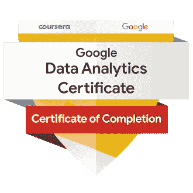](https://coursera.pxf.io/c/3294490/1164545/14726?u=https%3A%2F%2Fwww.coursera.org%2Fprofessional-certificates%2Fgoogle-data-analytics)**

**这就是 2023 年关于学习关键技术技能的最佳 Coursera 专业的全部内容，如 IT 支持、云计算和数据科学。Coursera specializations 是任何人都可以参加的最好的课程之一，可以在许多行业学习和获得真实世界的经验，由主要大学提供，与你在大学的花费相比价格便宜。

您可以单独加入这些课程和专业，但是，如果您计划加入多个 Coursera 课程或专业，那么可以考虑参加 [***Coursera Plus 订阅***](https://coursera.pxf.io/c/3294490/1164545/14726?u=https%3A%2F%2Fwww.coursera.org%2Fcourseraplus) ，它将为您提供不受限制的最受欢迎的课程、专业、专业证书和指导项目。**

**<https://coursera.pxf.io/c/3294490/1164545/14726?u=https%3A%2F%2Fwww.coursera.org%2Fcourseraplus>  

它每年花费大约 399 美元，但它完全值得你的钱，因为你可以获得无限的证书。

你可能喜欢的其他 **Coursera 和编程文章**

*   [面向程序员和开发人员的 Coursera 十大项目](https://javarevisited.blogspot.com/2020/08/top-10-coursera-projects-to-learn-essential-programming-skills.html)
*   [学习数据科学的十大 Coursera 课程](https://javarevisited.blogspot.com/2020/08/top-10-coursera-certifications-to-learn-Data-Science-Visualization-and-Data-Analysis.html)
*   [2023 年程序员十大课程课程](https://javarevisited.blogspot.com/2020/08/top-10-coursera-courses-specilizations-and-certifications.html)
*   [学习云计算的 10 门最佳 Coursera 课程](https://javarevisited.blogspot.com/2020/08/top-10-coursera-certifications-to-learn-cloud-computing-aws.html#axzz6WK1yC5WW)
*   [Youtube 上的最佳 Coursera 认证](https://www.youtube.com/watch?v=6NKULJuitcU)
*   [Coursera Plus Review——在 Coursera 上学习的更好方式](https://javarevisited.blogspot.com/2020/08/coursera-plus-better-way-to-take-coursera-courses-specilizations-certification.html)
*   [学习 Web 开发的十大 Coursera 课程](https://javarevisited.blogspot.com/2020/08/top-10-coursera-certifications-to-learn-web-development.html)
*   [Udemy vs CocdeCademy vs one month？](https://javarevisited.blogspot.com/2019/09/codecademy-vs-udemy-vs-onemonth-which-is-better-for-learning-code.html#axzz6VYKcmyZz)
*   [Udemy vs Educative vs Codecademy？新手用哪个比较好](/javarevisited/codecademy-or-pluralsight-which-is-a-better-platform-to-learn-coding-skills-59251a080642)
*   [Udemy vs Coursera？学理工和编程哪个好](https://javarevisited.blogspot.com/2020/01/coursera-vs-udemy-which-is-better-for-programming-tech.html)
*   【Coursera 证书对工作和事业有帮助吗？
*   [开始职业生涯的十大 Coursera 认证](/javarevisited/top-10-coursera-certificates-to-start-your-career-in-cloud-data-science-ai-mainframe-and-it-558690c83587)
*   [Udemy vs 复数视线？哪个学习平台比较好？](https://javarevisited.blogspot.com/2019/10/udemy-vs-pluralsight-review-which-is-better-to-learn-code.html)
*   [你可以在 Coursera 上在线申请的前 5 个计算机科学学位](https://javarevisited.blogspot.com/2020/04/is-it-possible-to-get-master-of-computer-science-degree-online-coursera.html)
*   [2023 年学习人工智能的 7 门最佳课程](/javarevisited/7-best-courses-to-learn-artificial-intelligence-in-2020-26d59d62f6fe)
*   [学习 Python 的 10 个 Coursera 专业化和认证](https://javarevisited.blogspot.com/2020/02/10-best-coursera-courses--for-python.html)
*   5 个最好的程序员 Coursera 职业证书
*   [2023 年学习 Python 可以做的 8 个项目](/javarevisited/8-projects-you-can-buil-to-learn-python-in-2020-251dd5350d56)
*   [你可以在 Coursera Online 上获得 5 个数据科学学位](https://www.java67.com/2020/06/top-5-data-science-degree-you-can-earn-online-coursera-edx.html)
*   【Coursera 的 10 项数据科学和机器学习认证

感谢阅读这篇文章。如果你喜欢这些*最好的 Coursera 课程和认证*来学习 IT 支持、人工智能、数据科学、谷歌云、AWS、机器学习、计算机视觉和阿里云，请分享给你的朋友和同事。如果您有任何问题或反馈，请留言。

**p . s .**——如果你正在为 IT 专业人士寻找最好的 Udemy 课程，并学习关键的技术技能，那么你也可以看看我之前的一篇关于 [**程序员十大 Udemy 课程**](https://javarevisited.blogspot.com/2019/08/top-10-udemy-courses-and-certifications-for-programmers.html) 的文章。它包含学习 SQL、Python、Java、数据结构、算法和其他关键技能的课程。

</javarevisited/15-best-udemy-courses-programmers-can-buy-on-black-friday-and-cyber-monday-2020-a803874f41d9> **