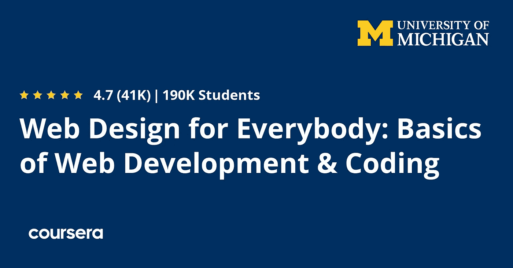
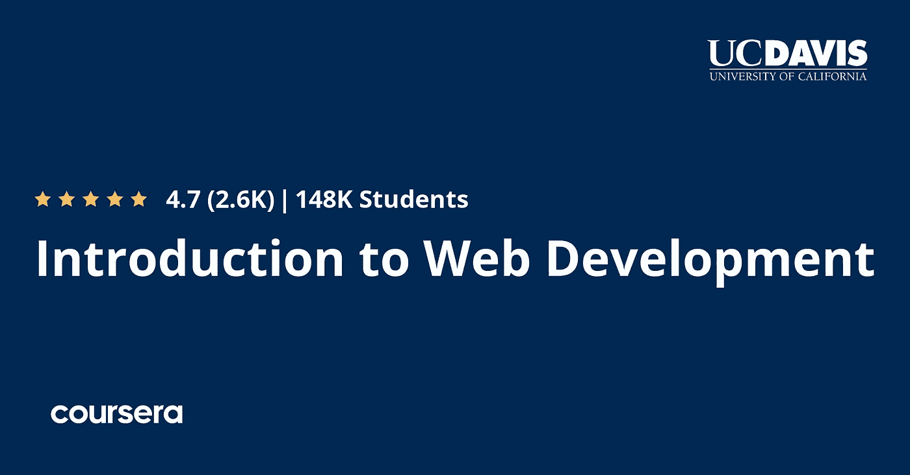
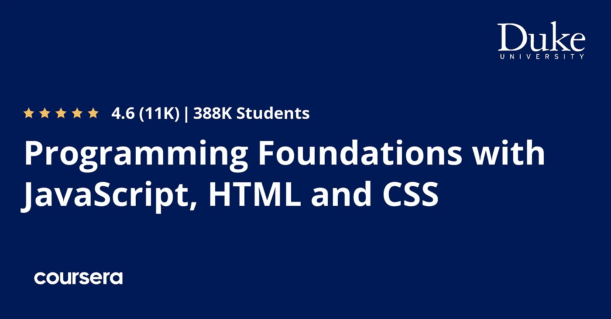
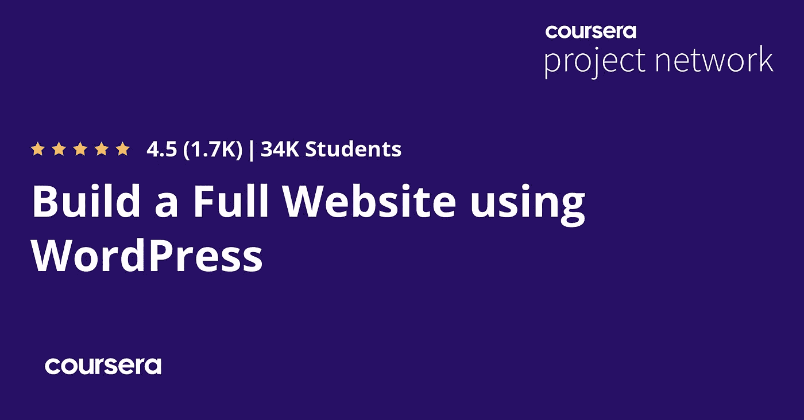
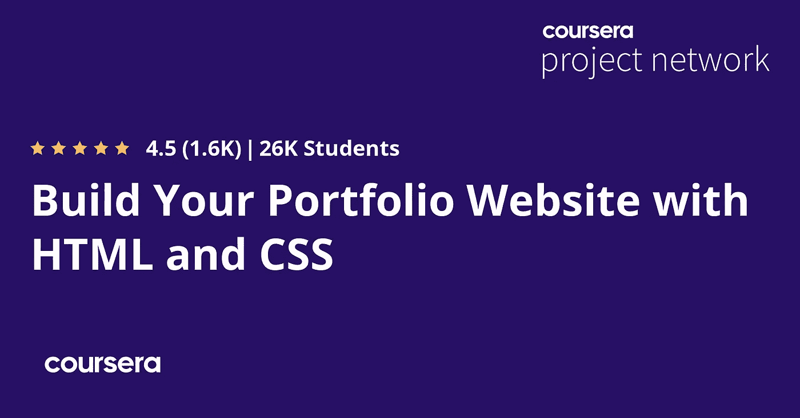

# 2023 年网站开发和网站设计的 10 个最佳 Coursera 课程和认证

> 原文：<https://medium.com/javarevisited/10-best-coursera-courses-for-web-development-and-web-design-9ec54ed92dd9?source=collection_archive---------0----------------------->

## 这些是 2023 年学习使用 HTML、CSS、JavaScript、React、NodeJS、PHP、Python 和 Django 进行 web 开发的最佳 Coursera 课程、专业化、认证和项目

image_credit — Coursera

大家好，如果你想在 2023 年学习网络开发，并且寻找最好的 Coursera 课程、认证和项目，那么你来对地方了。前面我已经分享了 Udemy 学习 web 开发的 [**最佳课程，今天我要分享的是我最喜欢的在线学习门户之一 Coursera 的最佳 web 开发资源。**](/better-programming/my-5-favorite-courses-to-learn-web-development-in-2019-a5e74167f8b2)

如果 10 年前有人问我如何学习 web 开发并找到工作，我更可能会说，你必须上大学并获得学士学位，在花了数年的教育和数千美元后，你将成为一名计算机工程师和 web 开发人员，但现在互联网已经彻底改变了游戏。

如今，许多在线平台如 [Coursera](https://click.linksynergy.com/deeplink?id=JVFxdTr9V80&mid=40328&murl=https%3A%2F%2Fwww.coursera.org%2F) 、 [Udemy](https://click.linksynergy.com/fs-bin/click?id=JVFxdTr9V80&offerid=323058.9410&type=3&subid=0) 、 [Pluralsight](https://pluralsight.pxf.io/c/1193463/424552/7490?u=https%3A%2F%2Fwww.pluralsight.com%2Flearn) 、 [Codecademy](https://bit.ly/codecademyhome) 和 [Educative](https://www.educative.io/subscription?affiliate_id=5073518643380224) 出现在这个世界上，允许人们参加几乎任何行业的在线培训课程，web 开发就是其中之一。

如果你渴望成为一名网络开发人员，并且正在寻找**最好的网络开发课程认证和课程**，那么你来对地方了。在这篇文章中，我将分享 2023 年学习 web 开发的最佳 Coursera 认证和课程。

Coursera 是一个创建于 2012 年的在线平台，旨在与世界上的每个人分享由顶级大学和组织提供的知识。

它拥有一些[最优质的在线课程](/javarevisited/18-coursera-courses-you-can-join-in-2020-to-learn-from-the-worlds-top-tech-companies-google-74af46967d1e?source=collection_home---4------0-----------------------)、项目和培训材料，来自密歇根大学等顶级大学和谷歌、脸书、IBM、 [AWS](https://javarevisited.blogspot.com/2020/02/top-5-courses-to-crack-aws-certified-cloud-practitioner-exam-certification-clf-c01.html) 等公司。今天，在这篇文章中，我想和你分享一些 Coursera 关于学习 web 开发的在线认证，其中一些会教你在这个行业开始职业生涯所需的所有技能。

# 2023 年 Coursera 的 10 个最佳网络开发课程和认证

以下是 Coursera 提供的最佳 web 开发认证、专业化、在线课程和指导项目列表。

这些课程和专业由一些顶级大学提供，如密歇根大学、加州大学戴维斯分校和世界顶级公司，它们是 2023 年学习 web 开发的结构良好的培训材料。你可以加入他们，学习一项对你的职业生涯有需求且有用的技能。

## 1.[面向所有人的网页设计](https://coursera.pxf.io/c/3294490/1164545/14726?u=https%3A%2F%2Fwww.coursera.org%2Fspecializations%2Fweb-design)【Coursera 专业化】

本文从最佳专业化开始，通过学习 HTML 5 和如何创建标题和文本来教你 web 设计和开发，然后转到 CSS 3 来设计你的网站，如颜色和字体，你还将学习如何使用 Javascript 使你的网站交互式，并结合所有这些来开发一个高质量的网站。

这个专业包括如何编写语法正确的 HTML5 和 CSS3，以及如何用 JavaScript 创建交互式 web 体验。

以下是您将在本课程中学到的内容

*   使用 Javascript 为网页添加交互性
*   描述级联样式表(CSS3)的基础知识
*   使用文档对象模型(DOM)来修改页面
*   应用响应式设计，使页面能够被各种设备查看

掌握这一系列技术将使你能够开发高质量的网站，在移动设备、平板电脑和大屏幕浏览器上无缝工作。

**这里是加入这个 Coursera 证书的链接**——[为大家设计的网页](https://coursera.pxf.io/c/3294490/1164545/14726?u=https%3A%2F%2Fwww.coursera.org%2Fspecializations%2Fweb-design)

## 2.[面向网络开发者的 HTML、CSS 和 JavaScript】](https://coursera.pxf.io/c/3294490/1164545/14726?u=https%3A%2F%2Fwww.coursera.org%2Flearn%2Fhtml-css-javascript-for-web-developers)

如果你想在一个课程中掌握 web 开发，那么这个课程适合你从 HTML 开始，创建简单的页面，然后使用 CSS 框架设计它，然后转向高级编程，使用 JavaScript 使网站能够响应所有设备，如手机。

本课程由美国约翰霍普金斯大学提供。你会学到每个网页编码者都需要知道的工具。

本课程从学习如何用 HTML 和 CSS 实现现代网页开始。然后，我们将学习如何对页面进行编码，使其组件根据用户屏幕的大小自动重新排列和调整大小。

你将能够编写一个网页，它在手机上和在台式电脑上一样有用

**这是加入本课程的链接** — [面向 Web 开发人员的 HTML、CSS 和 JavaScript】](https://coursera.pxf.io/c/3294490/1164545/14726?u=https%3A%2F%2Fwww.coursera.org%2Flearn%2Fhtml-css-javascript-for-web-developers)

## 3.[采用 React 的全栈 Web 开发](https://coursera.pxf.io/c/3294490/1164545/14726?u=https%3A%2F%2Fwww.coursera.org%2Fspecializations%2Ffull-stack-react)【认证】

这是使用 Coursera 上的 React 在一门课程中学习 web 开发和移动应用程序开发的最佳课程之一。

课程从前端开发开始，在前两个课程中使用 Bootstrap 4 和 React，并使用 MongoDB 学习 [NoSQL 数据库](https://javarevisited.blogspot.com/2019/03/top-5-nosql-database-web-developers-should-learn.html#ixzz64aBvbXQ4)，然后使用 React native 创建移动应用，而不是使用 Node.js 和 Express with MongoDB 创建一些后端应用。

您还将学习使用 [**React Native**](/javarevisited/top-5-react-native-courses-for-mobile-application-developers-b82febdf8a46?source=---------112------------------) 创建混合移动应用程序。在服务器端，您将学习使用 **MongoDB** 实现 NoSQL 数据库，在 [**Node.js**](/javarevisited/top-10-online-courses-to-learn-node-js-in-depth-8ef0e31ca139) 环境和 [**Express**](/javarevisited/top-5-online-courses-to-learn-mern-stack-in-depth-9947230f194?source=---------9------------------) 框架中工作，并通过 RESTful API 与客户端通信。

这是一种专业化，意味着将课程和项目结合起来，逐步学习一项完整的技能。完成所有评估和项目后，您还将获得证书。

**这是加入 React 课程**—[React 全栈 Web 开发](https://coursera.pxf.io/c/3294490/1164545/14726?u=https%3A%2F%2Fwww.coursera.org%2Fspecializations%2Ffull-stack-react)的链接

## 4.[Web 开发入门](https://coursera.pxf.io/c/3294490/1164545/14726?u=https%3A%2F%2Fwww.coursera.org%2Flearn%2Fweb-development)【Coursera 课程】

另一个 Coursera 关于全栈 web 开发的在线课程照常开始，学习前端技术，使用 HTML 和 [CSS](/javarevisited/5-free-html-and-css-courses-to-learn-front-end-web-development-online-8b04517c6ecb?source=---------85------------------) 来设计这些页面，然后使用你到目前为止所学的知识创建一些简单的项目，然后使用 [JavaScript](/javarevisited/my-favorite-free-tutorials-and-courses-to-learn-javascript-8f4d0a71faf2) 来创建更高级的网页以及网站的后端。

这门课程旨在让你踏上未来学习网页开发和设计的道路，不管你目前的经验和技术知识有多少。

本课程结束时，您将能够描述万维网的结构和功能，使用 HTML、CSS 和 JavaScript 的组合创建动态网页，在创建 HTML 表单时应用基本的编程语言概念，选择合适的 web 托管服务，并将您的网页发布给全世界

**这是加入这个网页开发课程的链接**——[网页开发简介](https://coursera.pxf.io/c/3294490/1164545/14726?u=https%3A%2F%2Fwww.coursera.org%2Flearn%2Fweb-development)

## 5.[响应式网站开发与设计](https://coursera.pxf.io/c/3294490/1164545/14726?u=https%3A%2F%2Fwww.coursera.org%2Fspecializations%2Fwebsite-development)【认证】

使用多种语言学习 web 开发和 web 设计的大规模专业化，从使用 HTML CSS 和 JavaScript 的前端技术的基础开始，并在项目中应用所有这些，而不是使用 [JavaScript](/javarevisited/12-free-courses-to-learn-javascript-and-es6-for-beginners-and-experienced-developers-aa35874c9a32) 和 [MongoDB](/javarevisited/5-best-mongodb-courses-to-learn-nosql-for-beginners-in-2020-42df5af5496c) 以及其他一些具有顶点项目的库学习后端开发。

以下是您将在本课程中学到的关键技能:

*   现代全栈 web 开发
*   被动/多用户 web 应用程序
*   API 和动画
*   协作式多用户体验

您还将在您的作品集中添加几个项目，以展示您在整个专业化过程中的技能和成长。您将使用控制布局和样式的基本元素创建网页，使用响应式 web 设计原则将网站从线框变为网站，实现安全功能，并创建协作式多用户体验。

**这里是加入本在线课程** — [响应式网站开发与设计](https://coursera.pxf.io/c/3294490/1164545/14726?u=https%3A%2F%2Fwww.coursera.org%2Fspecializations%2Fwebsite-development)的链接

## 6.[面向所有人的网络应用](https://coursera.pxf.io/c/3294490/1164545/14726?u=https%3A%2F%2Fwww.coursera.org%2Fspecializations%2Fweb-applications)【Coursera 专业化】

学习使用 PHP 进行全栈 web 开发的最完整的课程，但要求您对前端技术有一个基本的了解，这样您就可以使用 [PHP](/javarevisited/top-10-free-courses-to-learn-php-and-mysql-for-web-development-e96e69982675?source=---------34------------------) 直接开始学习后端，学习其数据结构，然后转而使用 SQL 和 [MySQL](/javarevisited/top-5-courses-to-learn-mysql-in-2020-4ffada70656f) 作为数据库技术。

这个专业是为那些已经对使用 [JavaScript](/javarevisited/10-best-online-courses-to-learn-javascript-in-2020-af5ed0801645) 、 [HTML](/javarevisited/top-10-free-courses-to-learn-html-5-css-3-and-web-development-872d62d97a97) 和 [CSS](/javarevisited/top-5-advanced-css-courses-to-learn-flexbox-grid-and-sass-da8e37b09b1d?source=---------8------------------) 进行响应式 web 设计有基本了解的人构建 web 应用程序的入门。

在本专业课程中，您将创建几个 web 应用程序添加到您的开发人员组合中。这个专业(及其先决条件)将为你做好准备，即使你在编程或技术方面几乎没有经验，也可以从事 PHP 的入门级 web 开发工作。

**这是加入这个在线课程** — [每个人的网络应用](https://coursera.pxf.io/c/3294490/1164545/14726?u=https%3A%2F%2Fwww.coursera.org%2Fspecializations%2Fweb-applications)的链接

## 7.【JavaScript、HTML 和 CSS 编程基础

Coursera 上另一个学习前端 web 开发的奇妙课程。

以下是您将在本课程中学到的内容:

1.  如何批判性地思考如何使用[编程](https://javarevisited.blogspot.com/2019/03/top-5-online-courses-to-learn-to-code.html#axzz5kKVMEdwb)解决问题；
2.  如何使用函数、for 循环和条件语句编写 JavaScript 程序
3.  如何使用 [HTML](/javarevisited/10-best-html-and-css-courses-for-beginners-in-2021-6757eec00032) 构建一个包含段落、div、图片、链接和列表的网页
4.  如何用 CSS Ids 和类给网页添加样式
5.  如何使网页与 alert、onClick、onChange 等 JavaScript 命令交互，添加图像画布、按钮和滑块等输入功能。

超过 36%的人在完成这些课程后开始了新的职业生涯，超过 35%的人从这门课程中获得了切实的职业利益

**这里是加入这个在线课程**—[JavaScript、HTML 和 CSS 编程基础](https://coursera.pxf.io/c/3294490/1164545/14726?u=https%3A%2F%2Fwww.coursera.org%2Flearn%2Fduke-programming-web)的链接

## 8.使用 WordPress 建立一个完整的网站

现在来创建一些项目，在这个例子中是一个 WordPress 网站，使用这个开源项目来创建网页，如主页，添加图像和链接，发布博客文章，并通过添加社交媒体按钮等使其更具吸引力。

在与您的工作区域分屏播放的视频中，您的讲师将指导您完成以下步骤:

1.  在[建立一个新的开发站点](https://javarevisited.blogspot.com/2020/08/top-5-courses-to-learn-wordpress-in.html?utm_source=dlvr.it&utm_medium=facebook#axzz6kuqvKTq4)
2.  更新主页设置和编辑内容
3.  编辑主页
4.  添加和链接二级网页
5.  编辑和发布网页和博客帖子
6.  嵌入链接
7.  添加社交媒体按钮

如果你不知道，Coursera 也有一些项目，你可以通过构建这些项目来逐步学习。

**这是加入这个在线课程的链接**——[使用 WordPress](https://coursera.pxf.io/c/3294490/1164545/14726?u=https%3A%2F%2Fwww.coursera.org%2Fprojects%2Fbuild-a-full-website-using-wordpress) 建立一个完整的网站

## 9.[Django for every one](https://coursera.pxf.io/c/3294490/1164545/14726?u=https%3A%2F%2Fwww.coursera.org%2Fspecializations%2Fdjango)【Coursera 专业化】

Coursera 中学习 Django 全栈 web 开发框架的唯一课程，首先从学习 Django 如何与 SQL 数据库通信开始，然后你将看到它的特性和如何构建真实世界的项目，以及如何将 Javascript 添加到你的应用程序中以获得更多功能。

顺便说一句，我们鼓励你在开始这个专业之前学习 Python for Everybody specialization 或同等课程。有些人可能会发现在本系列之前或之后参加[人人网页设计](https://click.linksynergy.com/deeplink?id=JVFxdTr9V80&mid=40328&murl=https%3A%2F%2Fwww.coursera.org%2Fspecializations%2Fweb-design)专业化培训会有所帮助。

以下是您将在 Coursera 专业化认证中学习到的内容:

1.  如何安装和部署 Django 应用程序；构建 CSS 样式的 HTML 网页。
2.  如何在 Django 中应用内置的登录功能；定义会话、cookies 和一对多模型
3.  构建对象并编写语法正确的 JavaScript 语言；解释低级 jQuery 的基本元素

**这是加入 Django 课程的链接**——[Django for every one](https://coursera.pxf.io/c/3294490/1164545/14726?u=https%3A%2F%2Fwww.coursera.org%2Fspecializations%2Fdjango)

## 10.[用 HTML 和 CSS 建立你的作品集网站](https://coursera.pxf.io/c/3294490/1164545/14726?u=https%3A%2F%2Fwww.coursera.org%2Fprojects%2Fbuild-portfolio-website-html-css)【项目】

最后一门课程是基于项目的课程，在这门课程中，你将利用你在 HTML 和 CSS 中所学的知识来构建你的作品集网站，方法是创建网页并添加文本图像链接标题，然后使用 CSS 控制字体和颜色等来设计所有这些内容。

项目结束时，你将拥有一个网站，可以用来向世界展示你的工作和简历！

**这是加入这个 HTML 课程的链接** — [用 HTML 和 CSS 建立你的作品集网站](https://coursera.pxf.io/c/3294490/1164545/14726?u=https%3A%2F%2Fwww.coursera.org%2Fprojects%2Fbuild-portfolio-website-html-css)

以上是关于**最佳 Coursera 认证、课程、项目和学习 web 开发的专业化**。这些是 Coursera 上最好的课程，教你如何从头开始建立网站，无论是前端还是后端，并在简单易学和实践的在线课程中成为 web 开发的大师，现在你就是实现这一目标的一步。顺便说一下，如果你觉得 Coursera 的课程有用，因为它们是由世界各地知名的公司和大学创建的，那么我强烈推荐你加入 Coursera 的订阅计划。

<https://coursera.pxf.io/c/3294490/1164545/14726?u=https%3A%2F%2Fwww.coursera.org%2Fcourseraplus>  

这个 Coursera 订阅让您可以无限制地访问他们最受欢迎的课程、专业、专业证书和指导项目。费用大约为 399 美元/年 ,但它完全值得你的钱，因为你可以获得无限的证书，事实上，如果你参加多个专业和认证，它是划算的。

其他**你可能喜欢探索的网页设计和网页开发文章**

*   [2023 年前端开发者路线图](https://javarevisited.blogspot.com/2019/02/the-2019-web-developer-roadmap.html)
*   [成为全栈式 Web 开发人员的 10 大在线课程](/@javinpaul/top-10-online-courses-to-become-a-fullstack-web-developer-in-2020-d608a6b63232)
*   [Java 和 Web 开发人员应该学习的 10 个框架](http://javarevisited.blogspot.sg/2018/01/10-frameworks-java-and-web-developers-should-learn.html)
*   [10 JavaScript 教程 Web 开发人员应该查看](https://javarevisited.blogspot.com/2018/06/top-10-courses-to-learn-javascript-in.html)
*   [在线学习 React.js 的五大课程](https://javarevisited.blogspot.com/2018/08/top-5-react-js-and-redux-courses-to-learn-online.html)
*   [学习使用 Python 进行全栈 web 开发的 5 门课程](https://javarevisited.blogspot.com/2020/06/top-5-courses-to-learn-python-full-stack-web-development.html)
*   学习网络开发打字稿的 10 门免费课程
*   [每个 Fullstack 开发者都应该知道的 10 个框架](https://javarevisited.blogspot.com/2019/01/10-web-development-frameworks-fullstack-developer-should-learn.html)
*   [2023 react . js 开发者路线图](https://javarevisited.blogspot.com/2018/10/the-2018-react-developer-roadmap.html)
*   [Web 开发的五大 Python 框架](https://javarevisited.blogspot.com/2019/04/top-5-python-web-development-frameworks.html)
*   [学习云计算的 10 门最佳 Coursera 课程](https://javarevisited.blogspot.com/2020/08/top-10-coursera-certifications-to-learn-cloud-computing-aws.html#axzz6WK1yC5WW)
*   [Coursera Plus Review——在 Coursera 上学习的更好方式](https://javarevisited.blogspot.com/2020/08/coursera-plus-better-way-to-take-coursera-courses-specilizations-certification.html)
*   [向谷歌和 IBM 等顶级科技公司学习的 18 门 Coursera 课程](/javarevisited/18-coursera-courses-you-can-join-in-2020-to-learn-from-the-worlds-top-tech-companies-google-74af46967d1e?source=collection_home---4------0-----------------------)
*   [面向程序员和开发者的 Coursera 十大项目](https://javarevisited.blogspot.com/2020/08/top-10-coursera-projects-to-learn-essential-programming-skills.html)

感谢您阅读本文。如果你喜欢这些网页开发课程，那么请与你的朋友和同事分享。如果您有任何问题或反馈，请留言。

**p . s .**——如果你热衷于学习网页设计，但又在寻找免费的在线课程来启动你的学习，那么你一定要看看 Jonas Schmedtmann 的 [**网页开发人员网页设计:建立漂亮的网站**](https://click.linksynergy.com/deeplink?id=JVFxdTr9V80&mid=39197&murl=https%3A%2F%2Fwww.udemy.com%2Fcourse%2Fweb-design-secrets%2F) 课程。这门课程完全免费，没有任何资源和电子书。你只需要一个免费的 Udemy 帐户就可以参加这个课程。

<https://click.linksynergy.com/deeplink?id=JVFxdTr9V80&mid=39197&murl=https%3A%2F%2Fwww.udemy.com%2Fcourse%2Fweb-design-secrets%2F> 