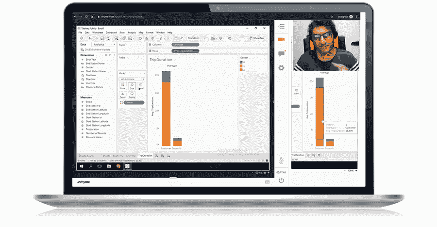
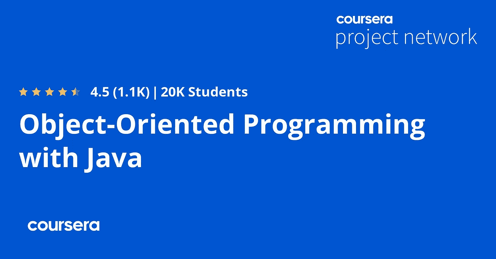
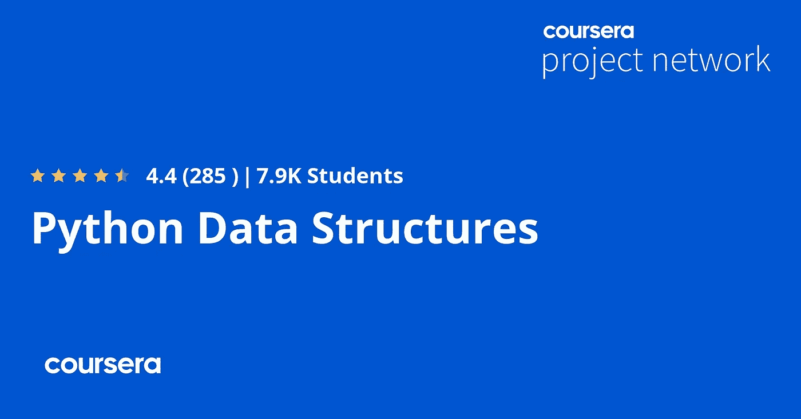
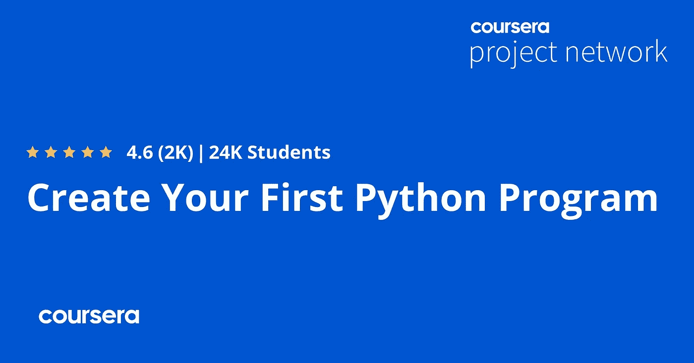
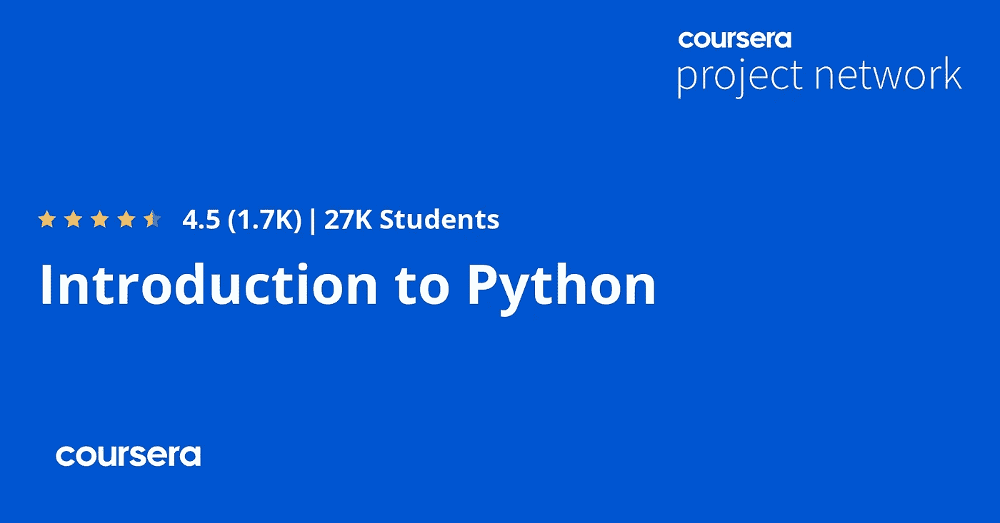
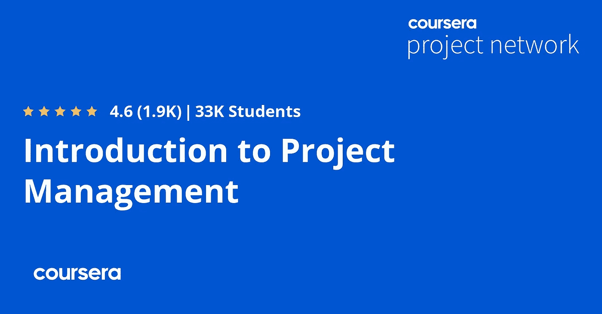
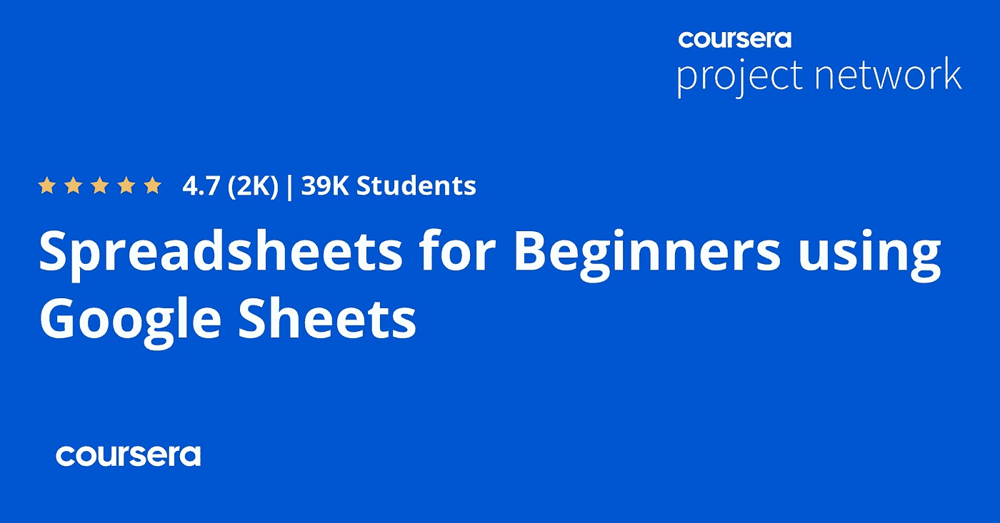
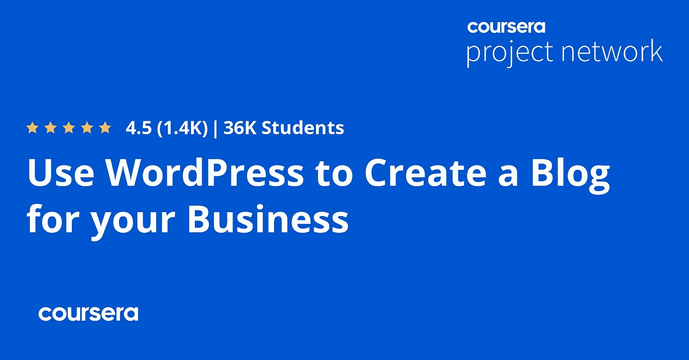
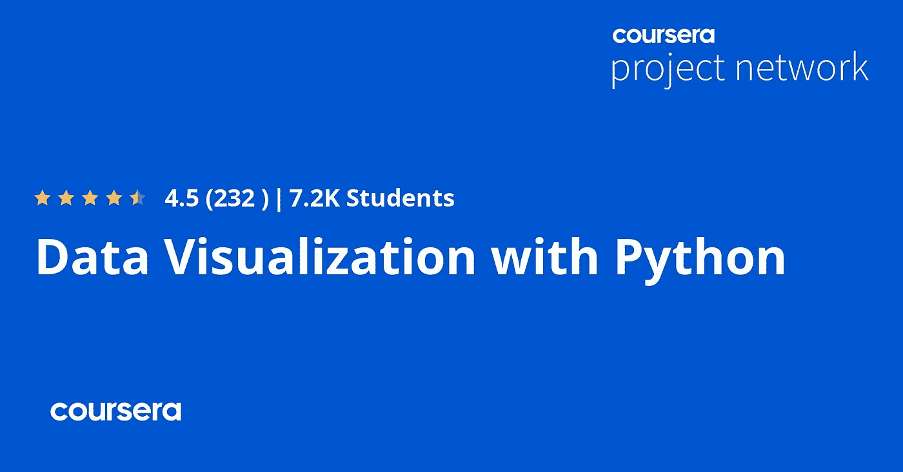
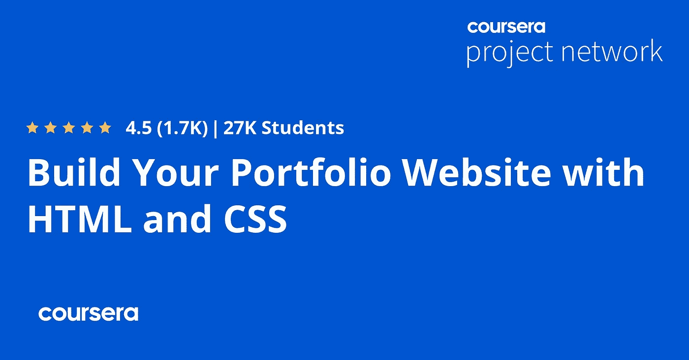

# 2022 年学习 Python、Java 和 SQL 的 10 个最佳 Coursera 项目

> 原文：<https://medium.com/javarevisited/10-best-coursera-projects-for-java-and-python-developers-623ba816939f?source=collection_archive---------1----------------------->

## 我最喜欢的 Coursera 指导项目学习 Java、Python、数据结构、SQL 等等。Coursera 项目提供实践学习，在 2 小时内教会你任何技能

大家好，如果你是 Coursera 的粉丝，并且正在寻找最好的 Coursera 项目来学习 2022 年急需的技能，如 Java、Python、Web 开发、创建网站和项目管理，那么你来对地方了。

以前我分享过最好的 Coursera 课程学习 [**Python**](/javarevisited/10-best-python-certification-courses-from-coursera-4576890eb6b3?source=extreme_sidebar----d3a191ac6ed-----0-1----------------------) **，** [**云计算**](/javarevisited/10-best-aws-google-cloud-and-azure-courses-and-certification-from-coursera-to-join-in-2021-5c5e2029a8e7) **，** [**人工智能**](/javarevisited/10-best-coursera-certifications-courses-for-machine-learning-and-artificial-intelligence-256d9a125822) **，** [**软件开发**](/javarevisited/10-best-software-development-courses-certifications-from-coursera-4ccc59aae201) **t，以及** [**Web 开发**](/javarevisited/10-best-coursera-courses-for-web-development-and-web-design-9ec54ed92dd9)t

**如果你不知道，Coursera 的指导项目提供实践学习，你可以在两个小时内学会任何技能。您不需要下载任何软件或设置您的开发，这对于经常努力自己设置东西的初学者来说是一个很大的优势。**

**Coursera 项目提供间接课程，你在云桌面上工作，所以一切都在浏览器上。你按照侧窗中的一步一步的指示学习。**

**学习新的[技能](https://javarevisited.blogspot.com/2020/04/5-essential-skills-to-crack-coding-interviews.html)和[编程语言](https://javarevisited.blogspot.com/2020/01/top-5-programming-language-for-freelancers-and-startups.html)对于任何想要拥有职业生涯的人来说都是必不可少的，但是大多数人认为阅读书籍和观看一些教程会让他们在他们正在做的事情上变得专业和专家，但是这是完全错误的，他们**需要创建项目**来测试他们的技能。**

**出于这个原因，你必须越来越多地练习，获得你需要称自己为专业程序员或开发人员的技能，这里有一个名为 [Coursera](https://javarevisited.blogspot.com/2020/08/top-10-coursera-courses-specilizations-and-certifications.html) 的在线学习平台的好处，它为你提供学习技能的课程，然后你也可以参加一个名为指导项目的项目来测试你的技能。

Coursera 的 [**引导项目**](https://coursera.pxf.io/c/3294490/1164545/14726?u=https%3A%2F%2Fwww.coursera.org%2Fcourses%3Fquery%3Dguided%2520projects) 是学习助推器，它提供了关于某个特定主题的简短的、动手的、实用的知识。例如，你可以通过 2 到 4 个小时的指导项目来学习关键技能，如如何建立一个网站或*如何使用 Python 收集网络数据。*

它们也非常省事，你不需要安装任何东西或者设置你的开发环境。您将在浏览器中编写代码，讲师将在分屏讲座中一步一步地指导您。这就是为什么这些[在线课程](/javarevisited/top-15-free-coursera-courses-and-certifications-for-it-professionals-384207d56f45)被称为引导式项目。**

****

**这些 Coursera 指导的项目也是应用你的知识和测试你的技能的好地方。**

**例如，如果你已经知道了 [Python](https://javarevisited.blogspot.com/2018/03/top-5-courses-to-learn-python-in-2018.html) ，那么你可以检查第一个项目，看看你是否能在要求的时间内构建它。一路走来，你会学到缺失的技能，进一步巩固知识。

如果你正在学习一门编程语言，或者已经完成了一些关于[软件开发的课程](/javarevisited/top-10-pluralsight-courses-to-learn-programming-and-software-development-during-covid-19-stay-at-30b7d8a4f88f?source=---------11------------------)，并且你想进一步提高你的知识并测试你的技能，那么继续阅读这篇文章，寻找一些你可以为此做的项目。**

# **2022 年 Coursera 上供初学者学习的 10 个最佳 Python、Java 和 Web 开发项目**

**这些是来自 Coursera 的最好的 Python 和 Java 项目课程，Coursera 是一个受欢迎的在线学习平台，它提供了来自斯坦福大学、耶鲁大学等知名大学以及世界上最大的科技公司如 [Google](/javarevisited/review-googles-it-automation-with-python-professional-certification-on-coursera-f75c1ba670e8) 、 [IBM](/javarevisited/review-is-introduction-to-machine-learning-specialization-by-ibm-on-coursera-worth-it-973dfe055855) 和 [AWS](/javarevisited/5-best-aws-courses-for-beginners-and-experienced-developers-to-learn-in-2021-563212409fbd) online 的学习材料。
该列表包含学习关键编程技能的项目，如 Java、Python、数据结构、如何建立网站、数据可视化、SQL、项目管理、Google Sheets 等等。**

## **1.[用 Java 进行面向对象编程](https://coursera.pxf.io/c/3294490/1164545/14726?u=https%3A%2F%2Fwww.coursera.org%2Fprojects%2Fobject-oriented-programming-java)**

**这个 Coursera 指导的项目面向对 Java 编程语言有一些基本了解的中级 Java 开发人员，您将学习 Java 的四个面向对象编程范例，然后创建一个令人兴奋的带有用户界面的社交媒体项目，这是一个用于宠物的社交媒体档案应用程序。**

**项目结束时，您将理解面向对象编程的所有四个原则，用 Java 编写面向对象代码，并能够将相同的概念应用于其他面向对象编程语言！**

****这里是加入这个项目**——[用 Java 进行面向对象编程](https://coursera.pxf.io/c/3294490/1164545/14726?u=https%3A%2F%2Fwww.coursera.org%2Fprojects%2Fobject-oriented-programming-java)的链接**

****

## **2. [Python 数据结构](https://coursera.pxf.io/c/3294490/1164545/14726?u=https%3A%2F%2Fwww.coursera.org%2Fprojects%2Fpython-data-structures)**

**这个 Coursera 项目测试你在 python 结构方面的技能，所以你将制作一个小的 python 应用程序，它可以读取一个包含一些单词及其定义的简单文件，你的工作是使用 python 内置函数制作一个基于这些单词及其定义的测验应用程序。**

**这里是加入这个项目的链接 — [Python 数据结构](https://coursera.pxf.io/c/3294490/1164545/14726?u=https%3A%2F%2Fwww.coursera.org%2Fprojects%2Fpython-data-structures)**

****

## **3.[关系数据库和 SQL 简介](https://coursera.pxf.io/c/3294490/1164545/14726?u=https%3A%2F%2Fwww.coursera.org%2Fprojects%2Fintroduction-to-relational-database-and-sql)**

**基础项目课程将首先教您如何使用 SQL 语言从 MYSQL 和 Oracle 数据库中获取数据，并使用其命令，如选择行和删除行，更新等等，然后您将在本指导项目结束时创建计费报告和俱乐部成员花名册。**

****这里是加入本项目的链接** — [介绍*到*关系数据库和 SQL](https://coursera.pxf.io/c/3294490/1164545/14726?u=https%3A%2F%2Fwww.coursera.org%2Fprojects%2Fintroduction-to-relational-database-and-sql)**

****

## **4.[创建你的第一个 Python 程序](https://coursera.pxf.io/c/3294490/1164545/14726?u=https%3A%2F%2Fwww.coursera.org%2Fprojects%2Ffirst-python-program)**

**这个项目将从学习 python 的基础开始，例如使用变量和函数以及循环条件语句，并从用户那里获得数据输入，然后在整个课程中，您将创建自己的命令行应用程序来管理待办事项列表和其他一些小项目。**

**这里是加入这个项目的链接——[创建你的第一个 Python 程序](https://coursera.pxf.io/c/3294490/1164545/14726?u=https%3A%2F%2Fwww.coursera.org%2Fprojects%2Ffirst-python-program)**

****

## **5.[Python 简介](https://coursera.pxf.io/c/3294490/1164545/14726?u=https%3A%2F%2Fwww.coursera.org%2Fprojects%2Fintroduction-to-python)**

**本课程项目将向初学者展示如何使用 python，例如使用变量、循环输入，然后转到创建一个猜谜游戏的项目，用户输入一个数字，计算机告诉他该数字是低还是高。**

****这里是加入这个项目的链接**——[Python 简介](https://coursera.pxf.io/c/3294490/1164545/14726?u=https%3A%2F%2Fwww.coursera.org%2Fprojects%2Fintroduction-to-python)**

****

## **6.[项目管理介绍](https://coursera.pxf.io/c/3294490/1164545/14726?u=https%3A%2F%2Fwww.coursera.org%2Fprojects%2Fintroduction-project-management)【Coursera 项目】**

**在这个项目中，你将 asana 创建一个筹款活动，在那里你将学习如何雇用团队成员来帮助你，你将建立一个时间表，学习各种不同的方法来管理项目，以及学习如何建立一个工作时间表，并在 asana 中比较许多项目视图的差异。**

****以下是加入本项目** — [项目管理简介](https://coursera.pxf.io/c/3294490/1164545/14726?u=https%3A%2F%2Fwww.coursera.org%2Fprojects%2Fintroduction-project-management)的链接**

****

## **7.[使用谷歌工作表的初学者的电子表格](https://coursera.pxf.io/c/3294490/1164545/14726?u=https%3A%2F%2Fwww.coursera.org%2Fprojects%2Fspreadsheets-beginner-google-sheets)**

**这个指导项目将开始与谷歌表没有以前的经验，教你许多概念，如数据输入，以及一些功能，如计算平均总和最小，甚至先进的，然后你会创建一个电子表格，帮助你计算家庭开支。**

****这里是加入这个项目的链接**——[使用谷歌工作表的初学者的电子表格](https://coursera.pxf.io/c/3294490/1164545/14726?u=https%3A%2F%2Fwww.coursera.org%2Fprojects%2Fspreadsheets-beginner-google-sheets)**

****

## **8.[使用 WordPress 创建博客](https://coursera.pxf.io/c/3294490/1164545/14726?u=https%3A%2F%2Fwww.coursera.org%2Fprojects%2Fwordpress-create-blog-business)**

**您将使用名为 [WordPress](/javarevisited/5-best-wordpress-courses-for-beginners-and-experienced-website-developers-b45f7976ee40) 的著名内容管理系统为您的企业创建您的博客网站，方法是使用该平台中包含的一些页面工具来创建主页、定制主页以及创建一些博客帖子和页脚部分。**

**这里是加入的链接— [使用 WordPress 创建博客](https://coursera.pxf.io/c/3294490/1164545/14726?u=https%3A%2F%2Fwww.coursera.org%2Fprojects%2Fwordpress-create-blog-business)**

****

## **9.[用 Python 实现数据可视化](https://coursera.pxf.io/c/3294490/1164545/14726?u=https%3A%2F%2Fwww.coursera.org%2Fprojects%2Fdata-visualization-with-python)**

**Python 广泛用于数据可视化，该项目将测试您在该行业的技能，您将获得一些数据并使用 [pandas](/javarevisited/5-best-courses-to-learn-pythons-pandas-libary-for-data-analysis-and-data-science-34b62abb0e96) 读取这些数据，然后尝试使用 matplotlib 和 seaborn 创建各种图，如散点图和热图图以及联合图分布。**

****这里是加入这个项目的链接——**[**用 Python 实现数据可视化**](https://coursera.pxf.io/c/3294490/1164545/14726?u=https%3A%2F%2Fwww.coursera.org%2Fprojects%2Fdata-visualization-with-python)**

********

## ****10.[建立你的投资组合网站](https://coursera.pxf.io/c/3294490/1164545/14726?u=https%3A%2F%2Fwww.coursera.org%2Fprojects%2Fbuild-portfolio-website-html-css)****

****该项目是关于创建一个使用 HTML 和 CSS 的组合网站，首先作为初学者学习这两种语言，如字体，标题，超链接等等，然后增强你的网站的外观，使其专业，然后上传到你的子域 Github 上。****

******这里是加入这个项目的链接—** [建立你的作品集网站](https://coursera.pxf.io/c/3294490/1164545/14726?u=https%3A%2F%2Fwww.coursera.org%2Fprojects%2Fbuild-portfolio-website-html-css)****

********

****以上是关于学习 Python、SQL、HTML、CSS 和其他关键编程技能的**最佳 Coursera 项目。这篇文章向您展示了许多项目，您可以通过实践来提高自己的技能并获得一些真实世界的经验，现在您距离实现这一目标并拥有更加专业的职业生涯只有一步之遥。

您可以通过单独购买的方式逐个加入这些项目，但是，如果您计划加入多个 Coursera 课程或专业，那么可以考虑参加[**Coursera Plus**](https://coursera.pxf.io/c/3294490/1164545/14726?u=https%3A%2F%2Fwww.coursera.org%2Fcourseraplus)**订阅，它将为您提供无限制的访问最受欢迎的课程、专业、专业证书和指导项目的机会。它每年花费大约 399 美元，但它完全值得你的钱，因为你可以获得无限的证书。********

**** [## Coursera Plus |无限制访问 7，000 多门在线课程

### 用 Coursera Plus 投资你的职业目标。无限制访问 90%以上的课程、项目…

coursera.pxf.io](https://coursera.pxf.io/c/3294490/1164545/14726?u=https%3A%2F%2Fwww.coursera.org%2Fcourseraplus) 

你可能喜欢的其他最好的 Coursera 和编程文章

*   [向谷歌、微软、AWS 和 IBM 学习的 18 门 Coursera 课程](/javarevisited/18-coursera-courses-you-can-join-in-2020-to-learn-from-the-worlds-top-tech-companies-google-74af46967d1e?source=collection_home---4------0-----------------------)
*   [Coursera Plus Review——在 Coursera 上学习的更好方式](https://javarevisited.blogspot.com/2020/08/coursera-plus-better-way-to-take-coursera-courses-specilizations-certification.html)
*   [学习 Web 开发的十大 Coursera 课程](https://javarevisited.blogspot.com/2020/08/top-10-coursera-certifications-to-learn-web-development.html)
*   [Udemy vs 复数视线？哪个学习平台比较好？](https://javarevisited.blogspot.com/2019/10/udemy-vs-pluralsight-review-which-is-better-to-learn-code.html)
*   你可以在 Coursera 上在线申请排名前五的计算机科学学位
*   [Udemy vs Coursera？学理工和编程哪个好](https://javarevisited.blogspot.com/2020/01/coursera-vs-udemy-which-is-better-for-programming-tech.html)
*   Coursera 证书对工作和事业有帮助吗
*   [学习 Web 开发的十大 Coursera 课程](https://javarevisited.blogspot.com/2020/08/top-10-coursera-certifications-to-learn-web-development.html)
*   [学习数据科学的十大 Coursera 课程](https://javarevisited.blogspot.com/2020/08/top-10-coursera-certifications-to-learn-Data-Science-Visualization-and-Data-Analysis.html)
*   [学习云计算的 10 门最佳 Coursera 课程](https://javarevisited.blogspot.com/2020/08/top-10-coursera-certifications-to-learn-cloud-computing-aws.html#axzz6WK1yC5WW)
*   [面向程序员和开发人员的十大 Coursera 项目](https://javarevisited.blogspot.com/2020/08/top-10-coursera-projects-to-learn-essential-programming-skills.html)
*   [开始职业生涯的 10 大 Coursera 认证](/javarevisited/top-10-coursera-certificates-to-start-your-career-in-cloud-data-science-ai-mainframe-and-it-558690c83587)
*   [2022 年学习人工智能的 7 门最佳课程](/javarevisited/7-best-courses-to-learn-artificial-intelligence-in-2020-26d59d62f6fe)
*   [Udemy vs CocdeCademy vs one month？](https://javarevisited.blogspot.com/2019/09/codecademy-vs-udemy-vs-onemonth-which-is-better-for-learning-code.html#axzz6VYKcmyZz)
*   Udemy vs Educative vs Codecademy？新手用哪个比较好
*   [学习 Python 的 10 个 Coursera 专业化和认证](https://javarevisited.blogspot.com/2020/02/10-best-coursera-courses--for-python.html)
*   [5 个最佳 Coursera 程序员职业证书](https://javarevisited.blogspot.com/2019/10/top-5-coursera-professional-certificates-for-programmers-IT-professionals.html)
*   [2022 年学习 Python 可以做的 8 个项目](/javarevisited/8-projects-you-can-buil-to-learn-python-in-2020-251dd5350d56)
*   [Coursera 的 10 项数据科学和机器学习认证](/javarevisited/top-10-machine-learning-and-data-science-certifications-and-training-courses-for-beginners-and-a6308497b764)

感谢阅读这篇文章。如果你喜欢这些 b *est Coursera 项目来学习 Java、Python、SQL、数据结构和算法、项目管理、Google Sheets 和数据可视化*那么请与你的朋友和同事分享它们。如果您有任何问题或反馈，请留言。

如果你正在寻找最好的 Udemy 课程来学习基本的编程和技术技能，那么你也可以看看我之前的一篇关于 [**十大 Udemy 程序员课程**](https://javarevisited.blogspot.com/2019/08/top-10-udemy-courses-and-certifications-for-programmers.html) 的文章。它包含学习 SQL、Python、Java、数据结构、算法和其他关键技能的课程。

 [## 2022 年 Java 开发者 10 大最佳 Udemy 课程

### 大家好，如果你是一名 Java 开发人员，或者想成为一名专业的 Java 开发人员，并且正在寻找最好的 Udemy…

medium.com](/javarevisited/10-best-udemy-online-courses-for-java-developers-4c9ab70cd01f)****