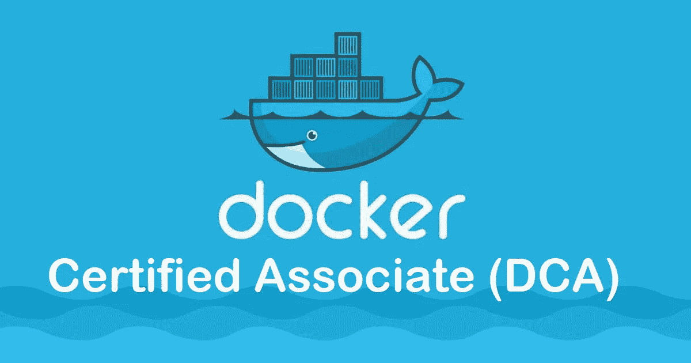
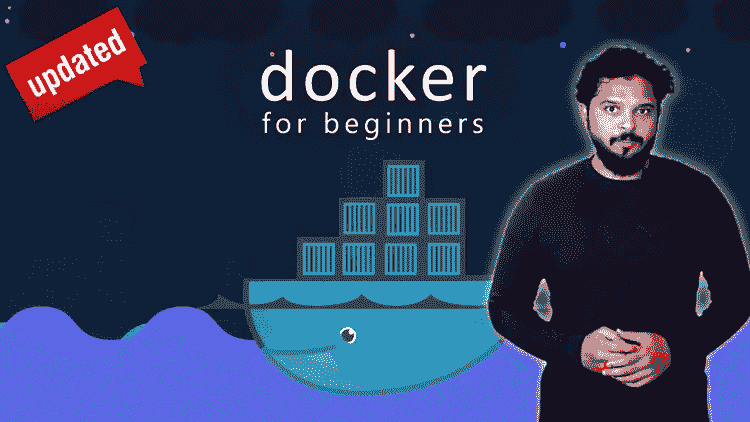
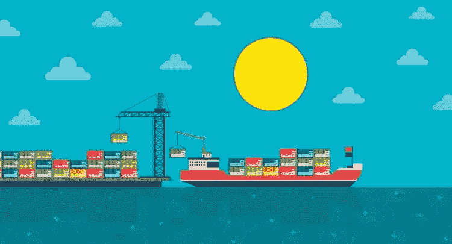
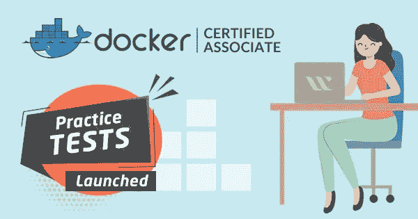
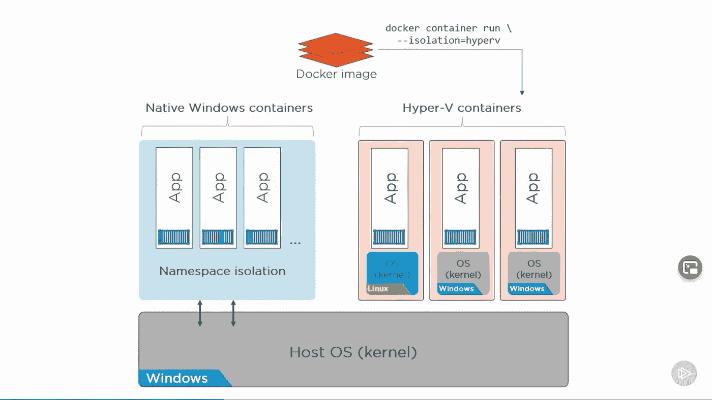
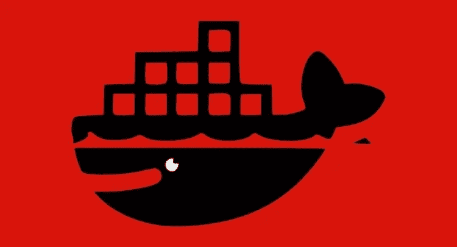
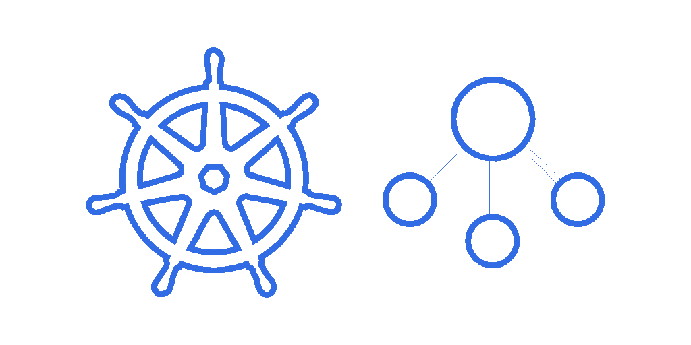
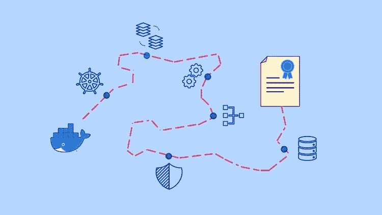
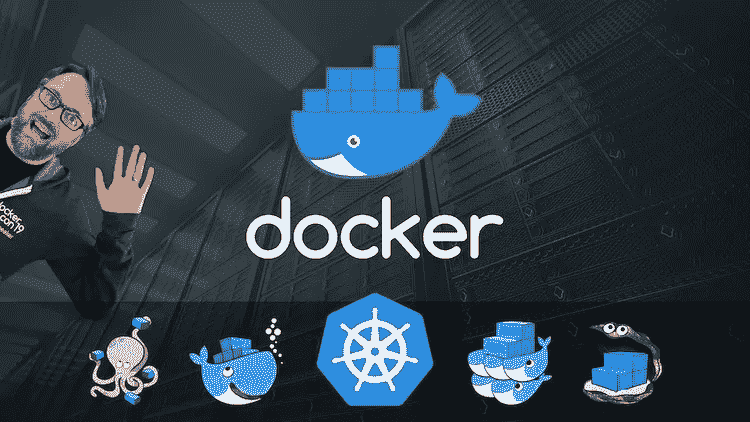

# 通过 Docker 认证助理(DCA)认证考试的 10 门最佳课程和实践测试

> 原文：<https://medium.com/javarevisited/10-best-courses-and-practice-tests-to-crack-docker-certified-associate-dca-certification-exam-b0b21648df4e?source=collection_archive---------0----------------------->

## 一系列最佳 Docker 课程和实践测试，为 2023 年的 Docker 认证助理(DCA)认证做准备

大家好，如果你正在准备 *Docker Associate 考试*或者想要成为一名注册 Docker Associate，并且正在寻找最好的在线课程和练习测试来开始你的准备，那么你来对地方了。

以前我分享过学习 Docker 和 [**Kubernetes**](/javarevisited/7-free-online-courses-to-learn-kubernetes-in-2020-3b8a68ec7abc) 的 [**最佳课程而今天我要分享的是破解 2023 年 Docker 注册助理考试的最佳在线课程。**](/javarevisited/top-15-online-courses-to-learn-docker-kubernetes-and-aws-for-fullstack-developers-and-devops-d8cc4f16e773)

这些是来自 [Udemy](/javarevisited/my-favorite-udemy-online-courses-for-programmers-and-software-engineers-f9d941dd0035) 、 [Coursera](https://coursera.pxf.io/c/3294490/1164545/14726?u=https%3A%2F%2Fwww.coursera.org%2F) 、 [Pluralsight](/javarevisited/top-10-pluralsight-courses-to-learn-programming-and-software-development-during-covid-19-stay-at-30b7d8a4f88f) 和 [Whizlabs](https://shareasale.com/r.cfm?b=1551042&u=880419&m=43514&urllink=&afftrack=) 的最好的 Docker 课程，对 Docker Certified Associate 认证非常有用。他们是由 Nigel Poulton 这样的专家创建的，Nigel Poulton 是 Docker 的队长，他们也信任世界上成千上万的 Docker 开发者。

Docker 是 IT 行业的顶级趋势之一。这是一项具有挑战性的技术。如果一个人想验证他/她的码头工人技能，那么他/她必须参加码头工人认证助理(DCA)考试。

**Docker 认证助理考试**旨在验证 Docker 的核心现实问题技能组合。这些问题是由经验丰富的 docker 从业者设计的。如果你通过了这次考试，那么你将有资格申请任何码头工人的职位，因为这次考试在工作面试中排名很高。但是如前所述，这项技术以及 Docker 认证助理考试都具有挑战性。因此，在本文中，我们将列出前五门课程，帮助您通过考试。

顺便说一句，如果你不熟悉 DevOps、容器和 Dockers，Coursera 也有一个名为 [**IBM DevOps 和软件工程专业证书**](https://coursera.pxf.io/c/3294490/1164545/14726?u=https%3A%2F%2Fwww.coursera.org%2Fprofessional-certificates%2Fdevops-and-software-engineering) 的专业证书，你可以用它来学习与 Docker 和 DevOps 相关的一切，并获得证书。

<https://coursera.pxf.io/c/3294490/1164545/14726?u=https%3A%2F%2Fwww.coursera.org%2Fprofessional-certificates%2Fdevops-and-software-engineering>  

# 2023 年面向开发人员的 10 门最佳 Docker 助理认证课程

以下是通过 Docker 认证助理(DCA)认证的最佳 Docker 认证课程列表。你可以参加这个列表中的一到两门课程，为 2023 年的 Docker Certified Associate (DCA)考试做准备。它们完全是在线的，你可以在家里或办公室学习这些课程和培训材料。

## 1.[面向绝对初学者的 Docker 动手——devo PS](https://click.linksynergy.com/deeplink?id=JVFxdTr9V80&mid=39197&murl=https%3A%2F%2Fwww.udemy.com%2Fcourse%2Flearn-docker%2F)

这是 Udemy 最畅销的 docker 课程。这个课程是为那些完全是 docker 初学者的人设计的。讲师从初级知识开始，然后逐渐过渡到 docker 概念的下一个级别。

本课程涵盖所有重要概念，如 docker 命令、docker 运行、docker 映像、docker-compose、docker 引擎、安全性和网络。
要求
1。系统管理员基本技能

本课程的授课老师是 Udemy 最畅销的讲师之一。超过六万七千名学生注册了这门课程。

**这里是加入本课程 Docker 课程**——[Docker 的链接，适合绝对初学者](https://click.linksynergy.com/deeplink?id=JVFxdTr9V80&mid=39197&murl=https%3A%2F%2Fwww.udemy.com%2Fcourse%2Flearn-docker%2F)

## 2.[Docker Certified Associate 2023(硕士课程)](https://click.linksynergy.com/deeplink?id=JVFxdTr9V80&mid=39197&murl=https%3A%2F%2Fwww.udemy.com%2Fcourse%2Fdocker-certified-associate%2F)

这是为 2023 年 Docker Certified Associate (DCA)考试做准备的硕士课程之一。本课程由我最喜欢的 Udemy 导师之一 Zeal Vora 创建，是专门为准备“**码头工人认证助理**”**认证**的人以及打算获得码头工人坚实基础的人设计的。

以下是你将在本课程中学到的东西—

*   码头工人的坚实基础
*   Docker Swarm 的编排
*   码头保安
*   Docker 网络、存储和映像管理

通过大量的测验、精彩的讲座和讲师的大力支持，本课程是您掌握 Docker Certified Associate 认证所需的全部内容。

**以下是参加 DCA 课程的链接**——[Docker Certified Associate 2023](https://click.linksynergy.com/deeplink?id=JVFxdTr9V80&mid=39197&murl=https%3A%2F%2Fwww.udemy.com%2Fcourse%2Fdocker-certified-associate%2F)

## 3. [Docker & Kubernetes:实用指南](https://click.linksynergy.com/deeplink?id=JVFxdTr9V80&mid=39197&murl=https%3A%2F%2Fwww.udemy.com%2Fcourse%2Fdocker-kubernetes-the-practical-guide%2F)

这是 Udemy 学习 Docker 和 Kubernetes 的又一个很棒的课程。由最好的 Udemy 导师之一创建 [Maximillian Schwarzmuller](https://click.linksynergy.com/deeplink?id=JVFxdTr9V80&mid=39197&murl=https%3A%2F%2Fwww.udemy.com%2Fuser%2Fmaximilian-schwarzmuller%2F) 如果你正在从头开始准备 Docker 认证，这个课程是完美的

以下是您将在本课程中学到的内容:

1.  码头基础知识
2.  Docker 撰写
3.  多容器项目
4.  部署
5.  从头开始的 Kubernetes

在此过程中，您将详细探索**所有关键概念**，并通过实例和演示探索**—从映像和容器、卷和网络一直到部署和 Kubernetes 集群。**

**这是加入本课程的链接**—[Docker&Kubernetes:实用指南](https://click.linksynergy.com/deeplink?id=JVFxdTr9V80&mid=39197&murl=https%3A%2F%2Fwww.udemy.com%2Fcourse%2Fdocker-kubernetes-the-practical-guide%2F)

## 4. [Docker 认证助理— Whizlabs](https://www.shareasale.com/r.cfm?b=1366998&u=880419&m=43514&urllink=&afftrack=)

这是在 whizlabs 学习 docker 的最好课程。该课程涵盖了所有重要的码头概念。它分为十一个模块，每个模块都包含视频讲座。

这些模块包括 docker 网络、docker 映像、docker 存储和卷、docker-compose、docker swarm 和安全性等概念。此外，还有两门与本课程相关的课程，包含练习题。

本课程总内容为六个小时，为中级课程。

要求
1。docker 知识

**以下是加入 Docker 课程** — [Docker 认证助理](https://www.shareasale.com/r.cfm?b=1366998&u=880419&m=43514&urllink=&afftrack=)的链接

为了更好地准备，您还可以将本课程与 Whizlab 的[*Docker Certified Associate Practice Tests*](https://www.shareasale.com/r.cfm?b=1366997&u=880419&m=43514&urllink=&afftrack=)结合起来，这样您可以在真正考试之前提高速度和准确度。你也可以用它们来找到你的强项和弱项，并专注于它们以取得更好的分数。

而且，如果你从 Whizlabs 购买多门课程和练习题，那么订阅 Whizlabs 的<https://shareasale.com/r.cfm?b=1551042&u=880419&m=43514&urllink=&afftrack=>**可以帮你节省一些钱。**

**只需每年 99 美元(现在有 50%的折扣)，您就可以完全访问他们所有的在线培训课程和不同认证的实践测试，如 AWS、Java、Cloud、Docker 和 Kubernetes。**

**我强烈推荐这个订阅计划，因为 Whizlabs 有最好的材料来准备 IT 认证。**

**<https://www.whizlabs.com/subscription/?sscid=21k5_d5a21> ** 

## **5.[Docker 简介:建立自己的作品集网站](https://coursera.pxf.io/c/3294490/1164545/14726?u=https%3A%2F%2Fwww.coursera.org%2Fprojects%2Fintroduction-to-docker-build-portfolio-site)**

**这是 Coursera 的一个指导性项目。在这个指导项目中，个人将学习如何使用 docker 客户端与服务进行通信，以及如何执行各种操作。它将指导您在现实环境中使用 docker 服务。**

**这个课程/项目是为初学者准备的。本课程分为几个任务。每个任务都将引导您进一步使用 docker 容器创建一个真实的应用程序。
要求
1。推荐 docker 的基础知识

这个指导性项目的主要目标是使用 docker 容器创建一个真实世界的应用程序。**

****这里是加入 Docker 项目的链接**——[Docker 简介:建立自己的作品集网站](https://coursera.pxf.io/c/3294490/1164545/14726?u=https%3A%2F%2Fwww.coursera.org%2Fprojects%2Fintroduction-to-docker-build-portfolio-site)**

****

**除此之外，Coursera 还有 [**IBM DevOps 和软件工程专业证书**](https://coursera.pxf.io/c/3294490/1164545/14726?u=https%3A%2F%2Fwww.coursera.org%2Fprofessional-certificates%2Fdevops-and-software-engineering) ，这是一个完整的证书，适合任何想学习 Docker 和 DevOps 的人。**

**顺便说一句，如果你计划参加多个 Coursera 课程或专业，那么考虑参加 [**Coursera Plus**](https://coursera.pxf.io/c/3294490/1164545/14726?u=https%3A%2F%2Fwww.coursera.org%2Fcourseraplus) 订阅，为你提供无限制的访问他们最受欢迎的课程、专业、专业证书和指导项目的机会。它每年花费大约 399 美元，但它完全值得你的钱，因为你可以获得无限的证书。**

**<https://coursera.pxf.io/c/3294490/1164545/14726?u=https%3A%2F%2Fwww.coursera.org%2Fcourseraplus> ** 

## **6.[奈杰尔·波尔顿的《多克深潜》](https://pluralsight.pxf.io/c/1193463/424552/7490?u=https%3A%2F%2Fwww.pluralsight.com%2Fcourses%2Fdocker-deep-dive-update)**

**这是 Pluralsight 提供的最好的码头课程。在本课程中，讲师将深入探讨 docker 容器，并尝试解释每个必要的概念。**

**在本课程中，学生将学习如何从码头工人开始。教练 Nigel Poulton 是 Docker 的队长，他也关注 Kubernetes 基金会。

本课程的主要目的是让个人为 *Docker 认证助理(DCA)考试*做好准备。课程将近五个小时，属于中级课程。**

****这是加入本课程**——[码头工人深度潜水](https://pluralsight.pxf.io/c/1193463/424552/7490?u=https%3A%2F%2Fwww.pluralsight.com%2Fcourses%2Fdocker-deep-dive-update)的链接**

****

**顺便说一下，你需要一个 [*Pluralsight 会员*](https://pluralsight.pxf.io/c/1193463/424552/7490?u=https%3A%2F%2Fwww.pluralsight.com%2Flearn) 才能加入这个课程，费用大约是每月 29 美元或每年 299 美元(14%的折扣)。**

**我向所有程序员强烈推荐这个订阅，因为它提供了超过 7000 个在线课程的即时访问，以学习任何技术技能。或者，你也可以使用他们的 [**10 天免费试用**](https://pluralsight.pxf.io/c/1193463/424552/7490?u=https%3A%2F%2Fwww.pluralsight.com%2Flearn) 免费观看本课程。**

**<https://pluralsight.pxf.io/c/1193463/424552/7490?u=https%3A%2F%2Fwww.pluralsight.com%2Flearn> ** 

## **7.[介绍 Docker 和 DCA 认证](https://click.linksynergy.com/deeplink?id=JVFxdTr9V80&mid=39197&murl=https%3A%2F%2Fwww.udemy.com%2Fcourse%2Fintroduction-to-docker-and-the-dca-certification%2F)**

**这是学习 Docker 和准备 DCA 认证的又一个牛逼课程。本课程将向您介绍 Docker 的所有主要概念，并重点让您在所有实验部分使用该工具。本课程的主要主题包括:**

****图片**:定义你的容器的模板**

****容器**:它们是什么以及[Docker 如何帮助](https://www.java67.com/2020/11/why-learn-docker-container-and-tool-in.html)你创建它们**

****存储**:管理容器中数据的卷、绑定挂载和 tmpfs**

****网络**:调节容器的连通性，无论是在单个主机上还是在集群中**

****Docker Swarm** :内置的容器编排工具**

****Docker EE、UCP 和 DTR**:Docker 的企业产品**

**简而言之，对于任何想参加并通过 Docker 认证助理考试的人来说，这是一门很棒的课程**

****这是参加本课程**—[Docker 和 DCA 认证介绍](https://click.linksynergy.com/deeplink?id=JVFxdTr9V80&mid=39197&murl=https%3A%2F%2Fwww.udemy.com%2Fcourse%2Fintroduction-to-docker-and-the-dca-certification%2F)的链接**

****

## **8.[面向开发者的 Docker【教育性】](https://www.educative.io/courses/docker-for-developers?affiliate_id=5073518643380224)**

**本课程与列表中的其他 docker 课程略有不同，因为它是一门基于文本的交互式课程，允许您在浏览器上练习 Docker 命令。**

**在本课程中，您将从零开始了解 docker，比如 Docker 是什么以及[为什么需要 Docker](https://javarevisited.blogspot.com/2020/11/why-devops-engineer-learn-docker-kubernetes.html#axzz6dXsEfLvJ) ？之后，您将通过构建 docker 映像和运行 Docker 容器进行一些实践学习。**

**如果你喜欢互动学习，那么在你参加更高级的 Docker 认证课程之前，这个课程是学习 Docker 基础知识的好课程。**

****这里是加入本课程的链接**——[开发者 Docker](https://www.educative.io/courses/docker-for-developers?affiliate_id=5073518643380224)**

****

**此外，如果你喜欢教育平台和他们的互动课程，那么你还可以获得 [**教育订阅**](https://www.educative.io/subscription?affiliate_id=5073518643380224) ，每月只需**14.9 美元**就可以访问他们的 100 多门课程。非常划算，非常适合准备编码面试。**

**<https://www.educative.io/subscription?affiliate_id=5073518643380224> ** 

## **9. [Docker 认证助理(DCA)实践测试](https://click.linksynergy.com/deeplink?id=JVFxdTr9V80&mid=39197&murl=https%3A%2F%2Fwww.udemy.com%2Fcourse%2Fdocker-certified-associate-dca-practice-tests%2F)**

**从认证的角度来看，模拟测试非常重要，你通过参加课程所学到的所有知识都将通过在真实的考试场景中解决问题来进行测试**

**目前，大约有 330 个独特的练习题，更多的练习题正在编写中，不久将会添加进来。330 个问题**根据 [Docker 注册助理考试](https://javarevisited.blogspot.com/2020/09/top-5-courses-to-crack-docker-certified-associate-certification.html)的 6 个领域**进行分组。这将有助于在您完成 6 个领域的学习后验证您的知识。**

**您还将获得**详细解释**和**图表**和**参考链接**每套的末尾都有完整详细的解释和完整的参考链接，以便您可以检查和验证答案是否正确。**

****以下是参加本次模拟考试**——[Docker 认证助理(DCA)模拟考试](https://click.linksynergy.com/deeplink?id=JVFxdTr9V80&mid=39197&murl=https%3A%2F%2Fwww.udemy.com%2Fcourse%2Fdocker-certified-associate-dca-practice-tests%2F)的链接**

****

## **10.[码头工人精通:用码头工人船长的 Kubernetes+蜂群](https://click.linksynergy.com/deeplink?id=JVFxdTr9V80&mid=39197&murl=https%3A%2F%2Fwww.udemy.com%2Fcourse%2Fdocker-mastery%2F)**

**这是 Udemy 的另一个高评级码头工人课程，深入学习码头工人，由码头工人船长亲自授课。**

**本最佳 docker 课程涵盖了准备 *Docker 助理认证*所需的所有 Docker 概念，如容器、如何运行容器、如何创建 Docker 映像、docker-compose 和 docker swarm。本课程旨在让你快速入门，但也让你深入了解事情的“为什么”，如果你想通过 Docker Certified Associate 考试(DCA)，这一点非常重要。

讲师不慌不忙的详细讲解每一个概念。这是一门 10.5 小时的综合课程。所以如果你有兴趣深入学习这些概念，你应该去上这门课。**

****这里是加入这个码头工人课程的链接** — [码头工人掌握:来自码头工人队长的 Kubernetes+Swarm](https://click.linksynergy.com/deeplink?id=JVFxdTr9V80&mid=39197&murl=https%3A%2F%2Fwww.udemy.com%2Fcourse%2Fdocker-mastery%2F)**

****

**以上是关于**考取 Docker 认证助理考试的最佳在线课程。**本文所列课程选自 [Udemy](/javarevisited/top-15-java-and-spring-framework-courses-from-udemy-best-of-lot-d7b965b62a9f) 、 [Whizlabs](https://shareasale.com/r.cfm?b=1551042&u=880419&m=43514&urllink=&afftrack=) 、 [Coursera](/javarevisited/10-best-software-development-courses-certifications-from-coursera-4ccc59aae201) 等知名教育网站。**

**这些课程是经过适当研究后选择的，每一门课程都能够帮助你通过*Docker Certified Associate(DCA)*考试。这些课程有些是中级的，有些是为初学者开设的。浏览每门课程，然后做出选择。你可能喜欢的其他课程**

*   **[2023 年开发运维开发者路线图](/hackernoon/the-2018-devops-roadmap-31588d8670cb)**
*   **[5 门最佳 Kubernetes 开发者认证课程](https://javarevisited.blogspot.com/2020/09/top-5-courses-to-crack-certified-kubernetes-application-develope-certification-CKAD-exam.html)**
*   **[面向程序员的 10 门 Docker 和 Kubernetes 课程](https://dev.to/javinpaul/top-10-courses-to-learn-docker-and-kubernetes-for-programmers-4lg0)**
*   **[面向 Java 和 DevOps 专业人员的 10 门免费 Docker 课程](https://javarevisited.blogspot.sg/2018/02/10-free-docker-container-courses-for-Java-Developers.html)**
*   **[破解 AWS 解决方案架构师专业考试的 5 门最佳课程](https://javarevisited.blogspot.com/2020/04/top-5-course-to-crack-aws-solution-architect-professional-sap-c01-certification-exam.html)**
*   **[如何通过 Spring Core Professional 5.0 认证](https://javarevisited.blogspot.com/2018/08/how-to-crack-spring-core-professional-certification-exam-java-latest.html)**
*   **[如何破解 Azure Fundamentals (AZ-900)认证](https://javarevisited.blogspot.com/2020/04/how-to-crack-microsoft-azure-fundamentals-certification-az-900-exam.html)**
*   **[学习亚马逊网络服务我最喜欢的课程](https://javarevisited.blogspot.com/2020/05/top-5-amazon-web-services-aws-courses-for-beginners-and-experienced-programmers.html)**
*   **[学习 Jenkins 自动化和开发运维的五大课程](https://javarevisited.blogspot.com/2018/09/top-5-jenkins-courses-for-java-and-DevOps-Programmers.html)**
*   **[2023 年学习 Kubernetes 的 7 门免费在线课程](/javarevisited/7-free-online-courses-to-learn-kubernetes-in-2020-3b8a68ec7abc)**
*   **[如何成为 Azure 认证管理员助理？](https://javarevisited.blogspot.com/2020/04/how-to-crack-microsoft-az-103-azure-administrator-associate-exam-certification.html)**
*   **程序员前五名 AZ-900 模拟测试**
*   **[如何破解甲骨文 2023 年 Java 认证？](https://medium.freecodecamp.org/how-to-pass-oracles-java-certifications-a-practical-guide-for-developers-e9b607ba6173)**
*   **[如何通过 AZ-300 Azure 解决方案架构师考试？](https://javarevisited.blogspot.com/2020/04/how-to-crack-microsoft-azure-solution-architect-exam-az-300.html)**
*   **[通过谷歌助理云工程师认证的前 5 门课程](https://javarevisited.blogspot.com/2019/07/top-5-google-cloud-platform-gcp-courses-certifications-online.html)**
*   **[破解 Azure 云架构师(AZ-300)考试的前 5 门课程](https://javarevisited.blogspot.com/2019/07/top-5-courses-to-crack-azure-architecture-technologies-certification-az-300-exam.html#axzz6E6VuRMsx)**
*   **[通过 AWS 云从业者认证的前 5 门课程](https://javarevisited.blogspot.com/2020/02/top-5-courses-to-crack-aws-certified-cloud-practitioner-exam-certification-clf-c01.html)**
*   **[程序员学习 AWS 和云的 10 门免费课程](/javarevisited/top-10-courses-to-learn-amazon-web-services-aws-cloud-in-2020-best-and-free-317f10d7c21d)**
*   **[5 门最佳 Kubernetes 管理员认证课程](https://javarevisited.blogspot.com/2020/09/top-5-courses-to-become-certified-Kubernetes-administrator-KCA.html)**

**感谢阅读到目前为止。如果你喜欢这些最好的 *Docker 认证课程* *和模拟考试*，那么请与你的朋友和同事分享。如果您有任何问题或反馈，请留言。

**附言——**如果你是 Docker 新手，正在寻找一门免费课程，那么你也可以在 Udemy 上查看这门 [**Docker 基础知识(免费)**](https://click.linksynergy.com/deeplink?id=JVFxdTr9V80&mid=39197&murl=https%3A%2F%2Fwww.udemy.com%2Fcourse%2Fdocker-essentials%2F) 课程。它们是完全免费的，你需要的只是一个免费的 Udemy 帐户来注册这个在线培训课程。**

**<https://click.linksynergy.com/deeplink?id=JVFxdTr9V80&mid=39197&murl=https%3A%2F%2Fwww.udemy.com%2Fcourse%2Fdocker-essentials%2F> **