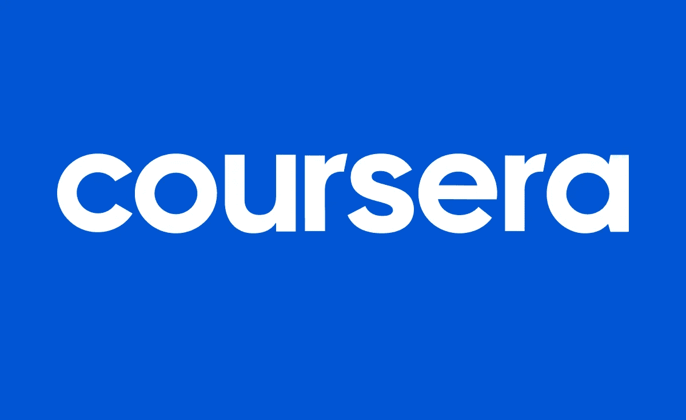
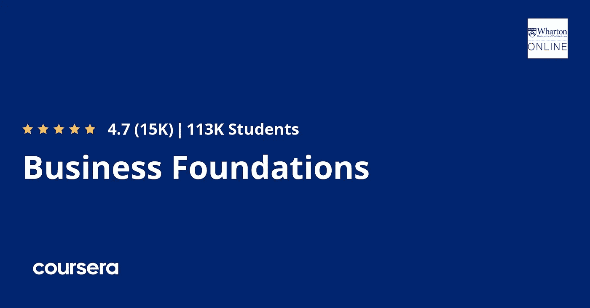
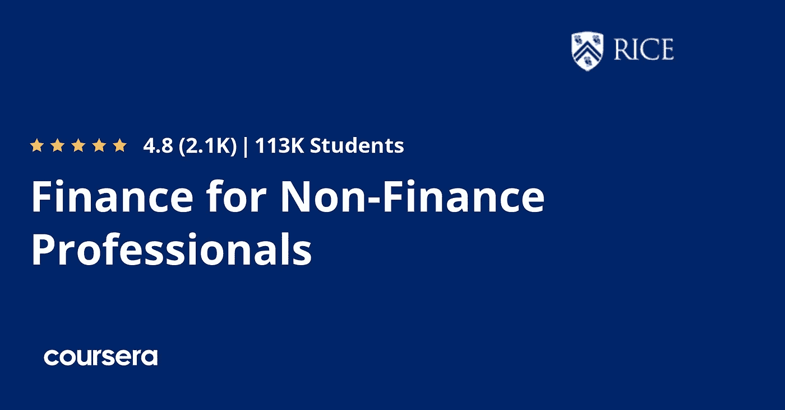
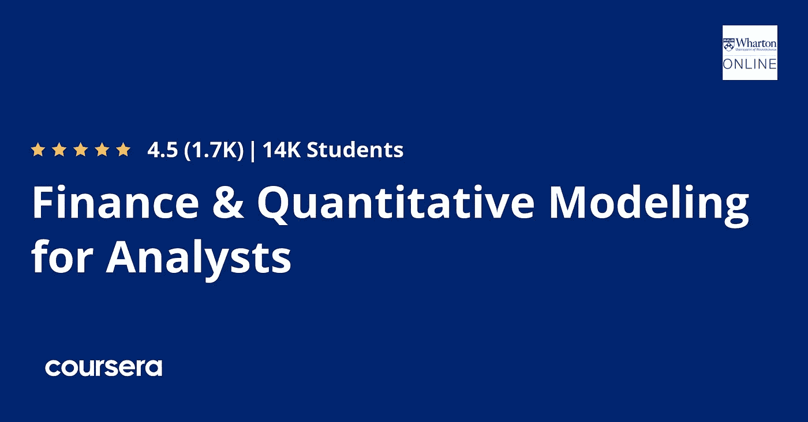
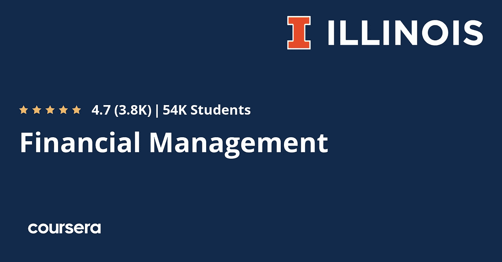
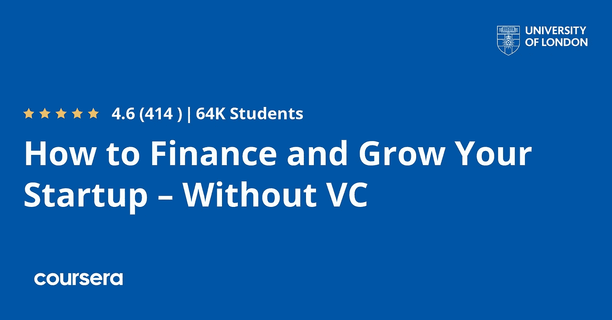
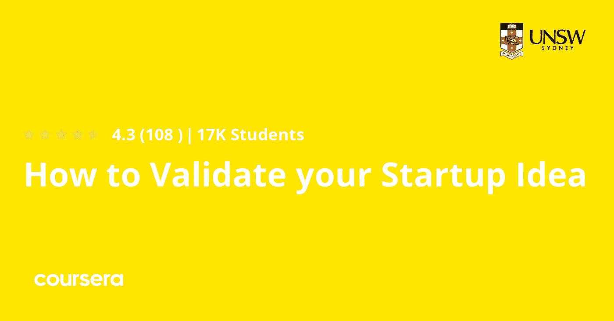
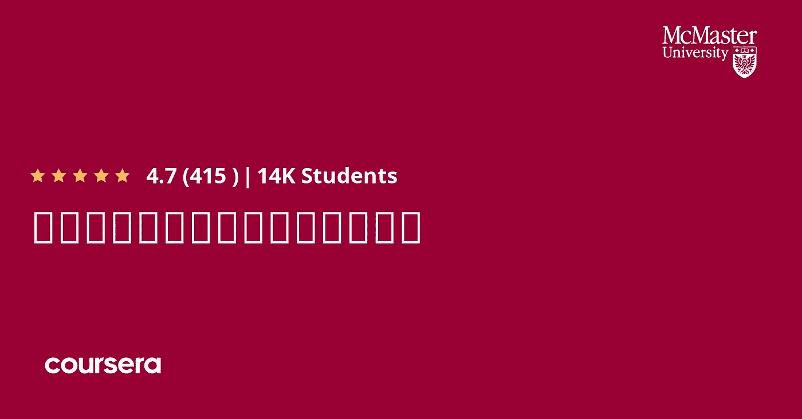
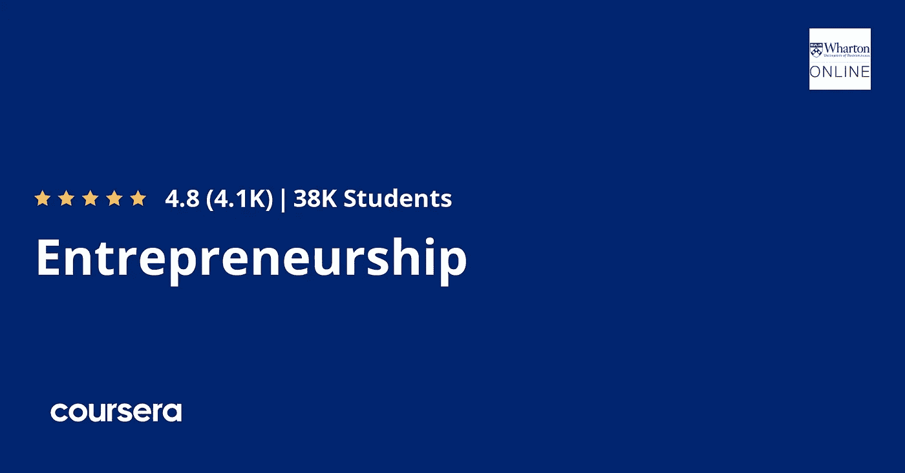

# 2023 年商业、金融和创业的 10 个最佳 Coursera 课程

> 原文：<https://medium.com/javarevisited/10-best-courses-courses-and-certifications-for-business-finance-and-entrepreneurship-616b80cbd0e6?source=collection_archive---------1----------------------->

## 我最喜欢的 Coursera 课程和认证，从世界顶级大学了解 2023 年的商业、金融、创业资金和企业家精神。

你好，伙计们，如果你渴望在商业和金融领域开始你的职业生涯，并寻找最好的 Coursera 认证、课程、专业和项目，那么你来对地方了。

之前，我已经分享了学习[**【Python】**](/javarevisited/10-best-python-certification-courses-from-coursera-4576890eb6b3?source=extreme_sidebar----d3a191ac6ed-----0-1----------------------)**，** [**人工智能**](/javarevisited/10-best-coursera-certifications-courses-for-machine-learning-and-artificial-intelligence-256d9a125822) **，** [**软件开发**](/javarevisited/10-best-software-development-courses-certifications-from-coursera-4ccc59aae201) **t，以及** [**Web 开发** t](/javarevisited/10-best-coursera-courses-for-web-development-and-web-design-9ec54ed92dd9) 的最佳课程和认证，在这篇文章中，我将分享来自

如果你想涉足金融或商业行业，或许想开自己的公司，为自己工作，你可能会去一所著名的大学，获得学士或硕士学位，所以在那个时候，你有信心知道自己应该做什么，以便开始追随自己的激情。

大学教育非常昂贵，许多人负担不起，尤其是如果你打算去另一个国家学习，但是如果我告诉你，你可以通过一个名为 [**Coursera**](https://coursera.pxf.io/c/3294490/1164545/14726?u=https%3A%2F%2Fwww.coursera.org%2F) 的平台，参加这些主要大学提供的比大学便宜得多的在线课程，会怎么样？这篇文章将向你展示一些最好的商业和金融课程，这些课程是由许多知名大学开设的，教授你金融、企业家精神，以及你如何创业和做自己的老板。

# 2023 年 Coursera 的 10 个最佳金融、创业、商业课程和认证

不浪费你更多的时间，这里有一个来自 Coursera 的最好的商业和金融课程和证书的列表。这些课程由世界各地的知名大学提供，如莱斯大学和宾夕法尼亚大学。成千上万的人已经加入了这些课程，你也可以在家里或办公室在线参加。

## 1.[商业基金会专业化](https://coursera.pxf.io/c/3294490/1164545/14726?u=https%3A%2F%2Fwww.coursera.org%2Fspecializations%2Fwharton-business-foundations)

沃顿商学院(Wharton school)提供的这一商业专业化课程教你创业所需的一切，如营销、如何保持客户忠诚度，以及分析财务报表和管理人力资本所需的技能，如做出正确的决策等。

这个专业有 5 门课程和一个项目。在五门课程中，你将学习营销、会计、运营和财务的基础知识。在最后的顶点项目中，您将应用通过制定走向市场战略所学到的技能来应对真正的业务挑战。

**这是参加本课程的链接**——[商业基础专业化](https://coursera.pxf.io/c/3294490/1164545/14726?u=https%3A%2F%2Fwww.coursera.org%2Fspecializations%2Fwharton-business-foundations)

## 2.[如何开始自己的专业化经营](https://coursera.pxf.io/c/3294490/1164545/14726?u=https%3A%2F%2Fwww.coursera.org%2Fspecializations%2Fstart-your-own-business)

另一门很棒的课程，不仅要学习如何创业，还要学习成为企业家应该具备的心态，这是你在这门课程中学到的第一项技能。

之后，你还将学会如何产生新的想法，验证它是好是坏，为你的客户创造价值，以及为你的业务建立框架等等。

该课程由密歇根州立大学提供，已有超过 22，000 人加入该课程。

以下是加入本课程的链接— [**如何开创自己的事业专业化**](https://coursera.pxf.io/c/3294490/1164545/14726?u=https%3A%2F%2Fwww.coursera.org%2Fspecializations%2Fstart-your-own-business)

## 3.[面向非金融专业人士的金融](https://coursera.pxf.io/c/3294490/1164545/14726?u=https%3A%2F%2Fwww.coursera.org%2Flearn%2Ffinance-for-non-finance)

即使你是金融行业的新手，你也可以参加莱斯大学提供的这门课程，从金融估值的基础知识开始，如复利和贴现率，然后是如何花钱和一些术语，如净现值和回报率，以及了解资本市场等。

这门课程不要求事先熟悉金融。相反，它旨在成为任何对理解股票市场、估值或公司财务感兴趣的人的第一步。

您将一起学习所有的工具和定量分析，并为理解金融专业人士做出的看似复杂的决策制定一个指南。

完成本课程后，您将了解推动和拉动财务决策的主要概念杠杆，以及它们与其他业务领域的关系。

**这是参加本课程的链接**——[非金融专业人士的金融](https://coursera.pxf.io/c/3294490/1164545/14726?u=https%3A%2F%2Fwww.coursera.org%2Flearn%2Ffinance-for-non-finance)

## 4.[经营战略专业化](https://coursera.pxf.io/c/3294490/1164545/14726?u=https%3A%2F%2Fwww.coursera.org%2Fspecializations%2Fbusiness-strategy)

你可能有自己创业的想法，但你需要了解市场和通向成功的战略，本课程将教你如何战略性地思考，如何使用一些先进的工具分析竞争和业务增长，以及如何避免常见的增长陷阱等等。

以下是您将在本课程中学到的内容:

1.  如何评价行业进化
2.  如何建立和保持竞争优势
3.  如何制定和评估商业战略
4.  如何根据组织战略调整工作

这门课程由弗吉尼亚大学提供。超过 67%上过这门课的人开始了新的职业生涯，超过 25%的人获得了加薪或升职。

**这是参加本课程** — [商业战略专业化](https://coursera.pxf.io/c/3294490/1164545/14726?u=https%3A%2F%2Fwww.coursera.org%2Fspecializations%2Fbusiness-strategy)的链接

## 5.[金融&分析师量化建模](https://coursera.pxf.io/c/3294490/1164545/14726?u=https%3A%2F%2Fwww.coursera.org%2Fspecializations%2Ffinance-quantitative-modeling-analysts)

这是另一个奇妙的专业化，对于没有金融经验的人来说，他们希望从了解定量建模和预测商业未来开始涉足这个行业。

本课程由宾夕法尼亚大学提供，它将教你如何使用 excel 电子表格以及财务报告和个人及企业财务来分析数据。

以下是您将在本课程中学到的内容:

1.  如何阅读损益表和现金流量表？
2.  如何创建自己的量化模型？
3.  如何利用电子表格的力量来绘制和预测数据

除此之外，您还将了解公司金融的世界，并更好地理解金融基础知识，包括个人金融、公司决策和金融中介的各种现实情况。

**这是加入本课程** — [金融&分析师量化建模](https://coursera.pxf.io/c/3294490/1164545/14726?u=https%3A%2F%2Fwww.coursera.org%2Fspecializations%2Ffinance-quantitative-modeling-analysts)的链接

## 6.[财务管理专业化](https://coursera.pxf.io/c/3294490/1164545/14726?u=https%3A%2F%2Fwww.coursera.org%2Fspecializations%2Ffinancial-management)

这个专业是伊利诺伊大学硕士学位的一部分，教你从财务会计以及财务交易和资产会计开始，到投资和绩效评估，促进价值创造和金融投资等。

以下是您将在本课程中学到的内容:

1.  战略财务决策的综合框架。
2.  理解财务报表及其提供的财务信息，能够批判性地评估和分析现金流量表。
3.  理解投资组合的管理和评估以及公司估值技术。
4.  了解如何将风险和不确定性纳入投资决策，了解公司如何进行融资和投资决策。

我说过，财务管理专业也是 [*伊利诺伊大学 iMBA 项目*](https://coursera.pxf.io/c/3294490/1164545/14726?u=https%3A%2F%2Fwww.coursera.org%2Fdegrees%2Fimba) 的一部分。这个专业的每门课程也满足伊利诺伊大学课程的一部分要求，可以为你赢得大学学分。

**以下是加入本课程** — [财务管理专业](https://coursera.pxf.io/c/3294490/1164545/14726?u=https%3A%2F%2Fwww.coursera.org%2Fspecializations%2Ffinancial-management)的链接

## 7.[如何在没有风险投资的情况下为你的初创公司融资并使其成长](https://coursera.pxf.io/c/3294490/1164545/14726?u=https%3A%2F%2Fwww.coursera.org%2Flearn%2Fstartup-financing-without-vc)

本课程适合那些已经拥有自己的企业并希望获得融资和投资的人，你会明白为什么一些投资如风险投资是一个坏主意，以及你如何通过企业家的一些失败和成功的故事来正确地资助你的 SaaS 企业。

这门课程提供了很多有用的信息，告诉你如何在不需要从风投或天使投资人那里获得任何资金的情况下开始你的生意或想法。伟大的见解，故事，和采访。

**这是加入本课程的链接**——[如何在没有风险投资的情况下为你的初创公司融资并使其成长](https://coursera.pxf.io/c/3294490/1164545/14726?u=https%3A%2F%2Fwww.coursera.org%2Flearn%2Fstartup-financing-without-vc)

## 8.[如何验证你的创业想法](https://coursera.pxf.io/c/3294490/1164545/14726?u=https%3A%2F%2Fwww.coursera.org%2Flearn%2Fstartup-idea)

也许你对下一个十亿美元的公司有想法，但你不确定这个想法是否会与市场一致，那么你应该看看悉尼 UNSW 大学的这门课程。

这门课程将教你如何评价自己的想法，如何接触更多的客户，扩大你的业务，投资资本是否适合你，以及向投资者推销你的想法。

通过学习课程和完成活动，你将学会如何获得反馈，系统地测试你的商业想法的不同部分。你将通过与课程之外的潜在客户、供应商、合作伙伴和投资者互动来学习如何做到这一点。

在这个过程中，你也会变得更加自信地提出你的想法。在课程结束时，你应该有一个可以马上开始的有效的商业想法。

**以下是加入本课程的链接—** [如何验证你的创业想法](https://coursera.pxf.io/c/3294490/1164545/14726?u=https%3A%2F%2Fwww.coursera.org%2Flearn%2Fstartup-idea)

## 9.[人人理财专业化](https://coursera.pxf.io/c/3294490/1164545/14726?u=https%3A%2F%2Fwww.coursera.org%2Fspecializations%2Ffinance-for-everyone)

如果你真的想学习金融行业以及资金流和其他危机之间的关系，那么你应该加入麦克马斯特大学 Coursera 上的这个专业。

本课程将教授自由市场及其对全球的影响和理念的价值，以及债务是如何创造系统的，甚至是对个人而言，不仅仅是组织，还有更多。

完成该认证后，您将能够更好地了解全球金融新闻和您自己的个人金融决策。

超过 50%的人在完成这一专业后开始了新的职业生涯，超过 25%的人获得了加薪或晋升。

**以下是参加本课程的链接—** [人人理财专业化](https://coursera.pxf.io/c/3294490/1164545/14726?u=https%3A%2F%2Fwww.coursera.org%2Fspecializations%2Ffinance-for-everyone)

## 10.[创业专业化](https://coursera.pxf.io/c/3294490/1164545/14726?u=https%3A%2F%2Fwww.coursera.org%2Fspecializations%2Fwharton-entrepreneurship)

如果你有一个想法，你想把它变成一个企业，扩大它的规模并获得资金，那么这个课程对你来说是正确的，因为你将学习如何利用机会，然后把机会变成一个组织，以及如何利用一些增长战略扩大业务，然后如何获得资金。

本课程由宾夕法尼亚大学沃顿商学院提供。它涵盖了新企业的概念、设计、组织和管理。

这个由五门课程组成的系列课程旨在引导您从发现机会到启动、发展、融资和盈利。

在沃顿商学院顶级教授的指导下，加上当前沃顿初创企业创始人和金融家的见解，你将培养一种创业思维，磨练你所需的技能，以发展具有增长和融资潜力的新企业，或在现有组织内识别和寻求增长机会。

**以下是加入本课程的链接—** [企业家专业化](https://coursera.pxf.io/c/3294490/1164545/14726?u=https%3A%2F%2Fwww.coursera.org%2Fspecializations%2Fwharton-entrepreneurship)

顺便说一句，如果你计划参加多个 Coursera 课程或专业，那么考虑参加 [**Coursera Plus**](https://coursera.pxf.io/c/3294490/1164545/14726?u=https%3A%2F%2Fwww.coursera.org%2Fcourseraplus) 订阅，它为你提供无限制的访问他们最受欢迎的课程、专业、专业证书和指导项目的机会。它每年花费大约 399 美元，但它完全值得你的钱，因为你可以获得无限的证书。

<https://coursera.pxf.io/c/3294490/1164545/14726?u=https%3A%2F%2Fwww.coursera.org%2Fcourseraplus>  

以上就是 2023 年商业、金融和创业方面的**最佳 Coursera 课程。这些几乎是主要大学提供的最好的课程和专业，用来学习金融业务，开始把你的想法变成一个组织，以及召集你的活动和筹集资金。**

如我所说，这些是由著名的大学提供的，如莱斯大学、宾夕法尼亚大学、伦敦大学等。

你可能喜欢的其他 **Coursera 和编程文章**

*   [开始职业生涯的十大 Coursera 认证](/javarevisited/top-10-coursera-certificates-to-start-your-career-in-cloud-data-science-ai-mainframe-and-it-558690c83587)
*   [向谷歌和 IBM 等顶级公司学习的 18 门 Coursera 课程](/javarevisited/18-coursera-courses-you-can-join-in-2020-to-learn-from-the-worlds-top-tech-companies-google-74af46967d1e?source=collection_home---4------0-----------------------)
*   [面向程序员和开发人员的 Coursera 十大项目](https://javarevisited.blogspot.com/2020/08/top-10-coursera-projects-to-learn-essential-programming-skills.html)
*   [Udemy vs CodeCademy vs one month？](https://javarevisited.blogspot.com/2019/09/codecademy-vs-udemy-vs-onemonth-which-is-better-for-learning-code.html#axzz6VYKcmyZz)
*   Udemy vs Educative vs Codecademy？新手用哪个好
*   [学习 Web 开发的十大 Coursera 课程](https://javarevisited.blogspot.com/2020/08/top-10-coursera-certifications-to-learn-web-development.html)
*   [学习 Python 的 10 个 Coursera 专业化和认证](https://javarevisited.blogspot.com/2020/02/10-best-coursera-courses--for-python.html)
*   [5 个最佳 Coursera 程序员职业证书](https://javarevisited.blogspot.com/2019/10/top-5-coursera-professional-certificates-for-programmers-IT-professionals.html)
*   [2023 年学习 Python 可以做的 8 个项目](/javarevisited/8-projects-you-can-buil-to-learn-python-in-2020-251dd5350d56)
*   [Udemy vs Coursera？学理工和编程哪个好](https://javarevisited.blogspot.com/2020/01/coursera-vs-udemy-which-is-better-for-programming-tech.html)
*   [2023 年学习人工智能的 7 门最佳课程](/javarevisited/7-best-courses-to-learn-artificial-intelligence-in-2020-26d59d62f6fe)
*   [Udemy vs 复数视线？哪个学习平台比较好？](https://javarevisited.blogspot.com/2019/10/udemy-vs-pluralsight-review-which-is-better-to-learn-code.html)
*   【Coursera 的 10 项数据科学和机器学习认证

感谢阅读这篇文章。如果你喜欢 Coursera 的这些**最佳商业和金融课程和证书，那么请与你的朋友和同事分享。如果您有任何问题或反馈，请留言。**

如果你正在寻找 Udemy 的最佳商业课程，那么我强烈推荐由 Chris Haroun 教授的一门课程:屡获殊荣的商学院教授课程，从创业到首次公开募股，学习你需要了解的所有商业知识。

<https://click.linksynergy.com/deeplink?id=CuIbQrBnhiw&mid=39197&murl=https%3A%2F%2Fwww.udemy.com%2Fcourse%2Fan-entire-mba-in-1-courseaward-winning-business-school-prof%2F> 