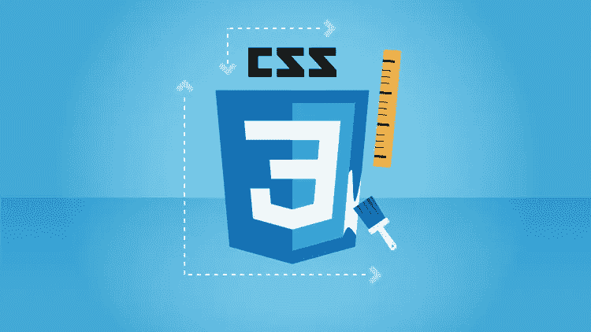
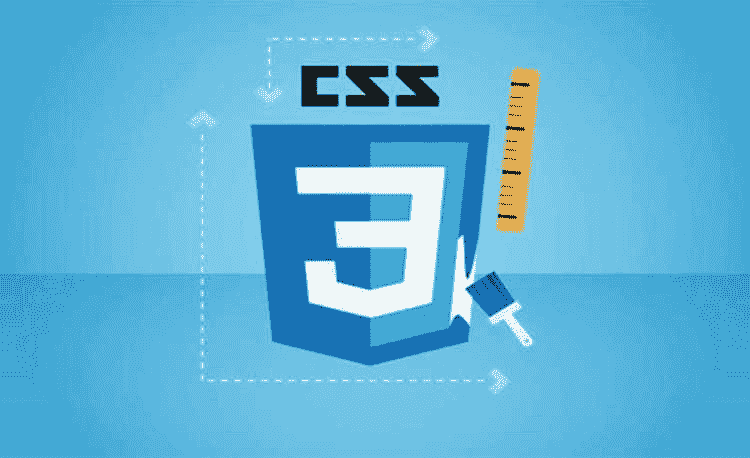
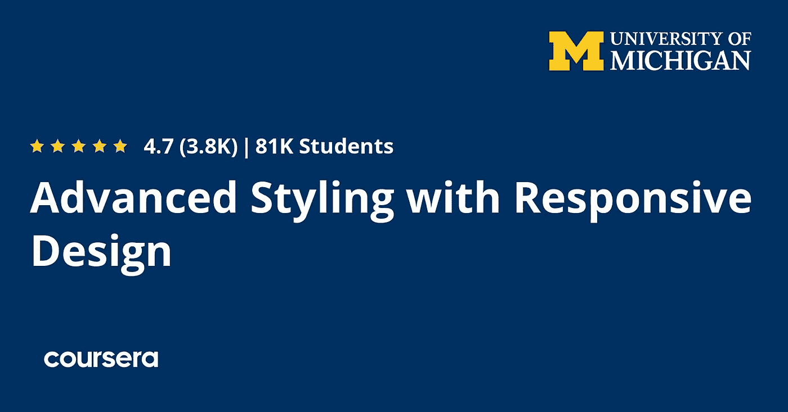
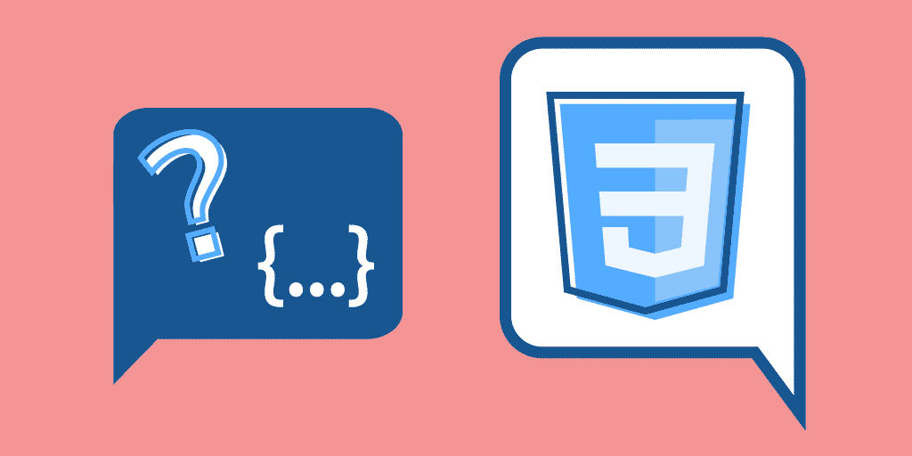
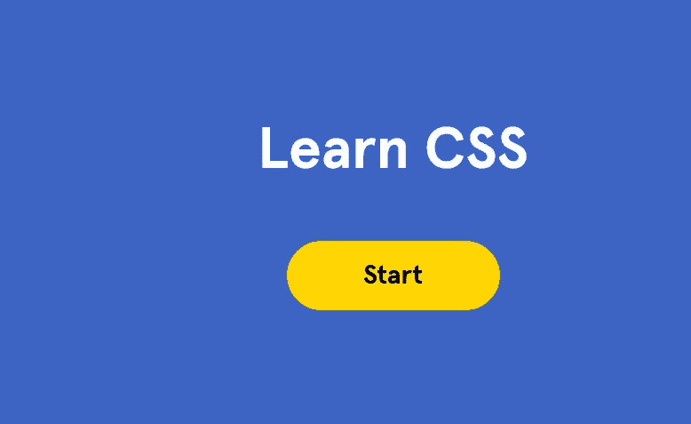
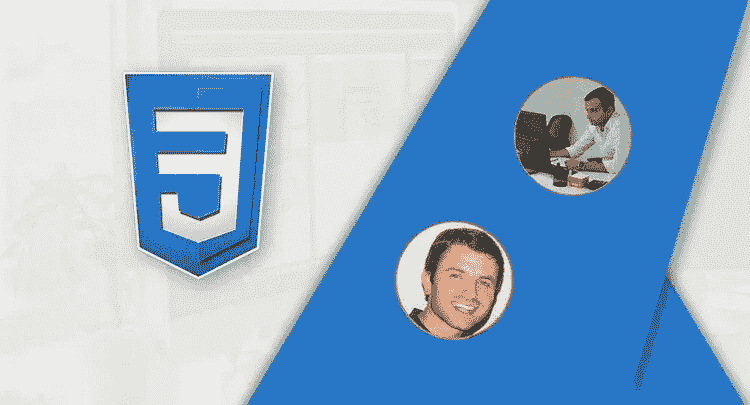

# 2023 年面向初学者和有经验开发者的 10 个最佳 CSS 在线课程

> 原文：<https://medium.com/javarevisited/10-best-css-online-courses-for-beginners-and-experienced-developers-54aa2e8c0253?source=collection_archive---------0----------------------->

## 我最喜欢的从 Udemy、Pluralsight、Coursera、freeCodeCamp、Educative 和其他优秀网站深入学习 CSS 的在线课程。

地狱那里，如果你是一个初学者或有经验的前端或后端工程师，想学习 CSS 并寻找最好的在线课程，那么你来对地方了。前面我已经分享过学习 HTML 最好的课程， [**JavaScript**](/javarevisited/10-best-online-courses-to-learn-javascript-in-2020-af5ed0801645) ， [**Angular**](/javarevisited/10-courses-to-learn-angular-for-web-development-6da1bd2856dc) ， [**React**](/javarevisited/top-10-free-courses-to-learn-react-js-c14edbd3b35f?source=extreme_main_feed----d3a191ac6ed-----5-1--------------------561c2dc6_a2b4_41e0_b7be_1d97edbf631c--8) ， [**Nodejs**](/javarevisited/top-10-online-courses-to-learn-node-js-in-depth-8ef0e31ca139) ，今天我要分享的是初学者最好的 CSS 课程。

这些课程也是由像 Maximilian Schwarzüller 这样的专家创建的，他们已经教了 100 多万人 web 开发。你也可以加入这些顶级 CSS 课程中的一门，在 2023 年从零开始学习 CSS。

级联样式表，俗称 CSS，是万维网的核心技术之一。CSS 用于以更好、更吸引人的方式表示 HTML 文档。

没有 CSS 就没有今天的网站，因为没有它，网站看起来枯燥乏味。虽然[**Bootstrap framework**](https://javarevisited.blogspot.com/2020/07/top-5-courses-to-learn-bootstrap-in.html)让任务变得简单了许多，但是学习和理解 CSS 并不是什么大事，实现它才是。

> 而且，CSS 浩如烟海。CSS 里有这么多。

所以如果你愿意成为一名[网页开发者](/hackernoon/the-2019-web-developer-roadmap-ab89ac3c380e)，你需要深入钻研 CSS。如前所述，学习和理解 CSS 并不困难，但它是巨大的，需要时间、努力和实践来学习它的实现。在本文中，我们将讨论有助于你深入学习 CSS 的顶级在线课程。

这些是最好的在线课程，来自像 Udemy T1、T2、plural sight T3、T4、自由代码营 T5、T6、CodeCademy T7、T8、Educative T9 和 Coursera T11 这样的网站，你可以加入这些课程来学习 CSS，这是成为一名网页设计师和网页开发者的必备技能之一。

<https://coursera.pxf.io/c/3294490/1164545/14726?u=https%3A%2F%2Fwww.coursera.org%2Fspecializations%2Fweb-design>  

# 2023 年学习 CSS 3 和网页设计引导的 10 个最佳在线课程

在不浪费你更多时间的情况下，这里列出了初学者和有经验的 CSS 开发人员学习 CSS 的最佳在线课程。你可以参加一到两个课程来深入学习 CSS。

这些课程也非常实惠，因为 Coursera 的大部分课程都是免费的，而 Udemy 的课程只需 10 美元就可以在 Udemy 上教授，这种情况时有发生。

## 1.[CSS—2023 年完整指南(包括 Flexbox、Grid & Sass)](https://click.linksynergy.com/deeplink?id=JVFxdTr9V80&mid=39197&murl=https%3A%2F%2Fwww.udemy.com%2Fcourse%2Fcss-the-complete-guide-incl-flexbox-grid-sass%2F)

这是 Udemy 上最畅销的 CSS 课程。它从 CSS 基础开始，逐渐过渡到更高级的 CSS 概念。在本课程中，你将深入了解一些最重要和最广泛使用的 CSS 概念。

该课程由 Udemy 最受欢迎的讲师之一 Maximilian Schwarzmüller 创建，他的 [**React 完整指南**](https://click.linksynergy.com/deeplink?id=JVFxdTr9V80&mid=39197&murl=https%3A%2F%2Fwww.udemy.com%2Fcourse%2Freact-the-complete-guide-incl-redux%2F) 和其他 web 开发课程受到了数百万开发者的信任。
T21 要求
1。HTML 基础知识 2。不需要 CSS 知识

这是一个庞大的课程，总视频内容超过 23 小时。这个课程一般是为那些想深入学习 CSS 的人开设的，即使是知道 CSS 基础知识的人也可以选择这个课程，因为里面解释了许多高级的 CSS 概念和技术。

**这里是加入这个最佳 CSS 课程的链接**——[CSS——2023 年完整指南](https://click.linksynergy.com/deeplink?id=JVFxdTr9V80&mid=39197&murl=https%3A%2F%2Fwww.udemy.com%2Fcourse%2Fcss-the-complete-guide-incl-flexbox-grid-sass%2F)

## 2.[高级造型与响应式设计](https://coursera.pxf.io/c/3294490/1164545/14726?u=https%3A%2F%2Fwww.coursera.org%2Flearn%2Fresponsivedesign)【Coursera】

这是一门为那些想深入学习高级 CSS 和 bootstrap 的人开设的课程。它涵盖了 CSS3 的基础知识，然后是高级主题，如媒体查询、线框、流体设计以及现有样式范例(如 Bootstrap)的使用。响应设计是本课程的另一个主要目标。

本课程面向懂 CSS 的人。这是一门付费课程，也是面向所有人的 [**网页设计:网页开发基础&编码专业**](https://coursera.pxf.io/c/3294490/1164545/14726?u=https%3A%2F%2Fwww.coursera.org%2Fspecializations%2Fweb-design) 的一部分，是网页设计最受欢迎的课程之一。

你可以付费参加这个课程，但是如果你有经济问题，你可以选择 Coursera 提供的经济资助选项来免费注册。

要求
HTML 和 CSS 的基础知识。

**以下是加入本 CSS 课程的链接** — [响应设计的高级造型](https://click.linksynergy.com/deeplink?id=JVFxdTr9V80&mid=40328&murl=https%3A%2F%2Fwww.coursera.org%2Flearn%2Fresponsivedesign)

顺便说一下，如果你计划参加多个 Coursera 课程或专业，那么考虑参加 [**Coursera Plus 订阅**](https://coursera.pxf.io/c/3294490/1164545/14726?u=https%3A%2F%2Fwww.coursera.org%2Fcourseraplus) ，它将为你提供无限制的访问他们最受欢迎的课程、专业、专业证书和指导项目的机会。它每年花费大约 399 美元，但它完全值得你的钱，因为你可以获得无限的证书。

<https://coursera.pxf.io/c/3294490/1164545/14726?u=https%3A%2F%2Fwww.coursera.org%2Fcourseraplus>  

## 3.[用 CSS 设计网站样式](https://pluralsight.pxf.io/c/1193463/424552/7490?u=https%3A%2F%2Fwww.pluralsight.com%2Fcourses%2Fstyling-websites-css) [Pluralsight]

Pluralsight 发布了一些深入学习 CSS 的新课程。他们有一系列 1 到 2 小时的短期课程，内容涵盖 CSS 的不同主题，如样式、布局和动画，你可以用它们来深入学习 CSS。

这个课程，用 CSS 设计网站，是初学者从 CSS 开始的一个很好的课程。您将学习用 CSS 设计 HTML 元素的样式。由 Susan Simkins 创建，这个课程将教你如何使用不同类型的 CSS 选择器创建样式表和添加样式规则。

以下是您将在本课程中学到的内容:

1.  如何编写 CSS 规则
2.  如何设置文本样式和添加字体
3.  尺寸元素
4.  不同类型的 CSS 选择器

总的来说，这是一个很好的 CSS 初学者课程。完成本课程后，你将掌握设计网站所需的 CSS 技能和知识。

**这里是加入这个课程的链接**——[用 CSS 设计网站](https://pluralsight.pxf.io/c/1193463/424552/7490?u=https%3A%2F%2Fwww.pluralsight.com%2Fcourses%2Fstyling-websites-css)

顺便说一下，你需要一个 [Pluralsight 会员](https://pluralsight.pxf.io/c/1193463/424552/7490?u=https%3A%2F%2Fwww.pluralsight.com%2Flearn)才能加入这个课程，费用大约是每月 29 美元或每年 299 美元(14%的折扣)。我向所有程序员强烈推荐这个订阅，因为它提供了超过 7000 个在线课程的即时访问，以学习任何技术技能。或者，你也可以使用他们的 [**10 天免费通行证**](https://pluralsight.pxf.io/c/1193463/424552/7490?u=https%3A%2F%2Fwww.pluralsight.com%2Flearn) 免费观看本课程。

<https://pluralsight.pxf.io/c/1193463/424552/7490?u=https%3A%2F%2Fwww.pluralsight.com%2Flearn>  

## 4.[前端面试 CSS](https://www.educative.io/courses/css-for-front-end-interviews?affiliate_id=5073518643380224)【教育性】

如果您正在准备前端面试或具有前端技能的全栈面试，并希望做一些准备，那么本课程非常适合您。完成本课程后，你将有信心去回答任何问题。

本课程汇集了前端面试中最有可能对您进行测试的一系列综合问题。这是一个中级课程，有超过 250 个编码挑战和选择题，所以有很多机会可以动手。

你将通过几个自我评估考试来了解你需要学习什么。之后，你将进入面试问题，比如文本、颜色、背景和展示。

在课程的后半部分，您将学习高级 CSS 概念，如 Flexbox、块格式化和使用 SVG。总的来说，本课程对那些开始准备前端面试的人来说是一个独立的指南。

**这里是加入这个 CSS 课程**——[前端面试 CSS](https://www.educative.io/courses/css-for-front-end-interviews?affiliate_id=5073518643380224)的链接

而且，如果你发现教育平台和他们的搜索课程，如[搜索系统设计面试](https://www.educative.io/collection/5668639101419520/5649050225344512?affiliate_id=5073518643380224)，搜索面向对象编程面试，前端面试等，那么考虑获得 [**教育订阅**](https://www.educative.io/subscription?affiliate_id=5073518643380224) ，每月只需 18 美元就可以访问他们的 100 多门课程。非常划算，非常适合准备编码面试。

<https://www.educative.io/subscription?affiliate_id=5073518643380224>  

## 5.[通过 CodeCademy 学习 CSS](https://www.gopjn.com/t/TUJGR0lLR0JHRklJSkhCR0ZISk1N?url=https%3A%2F%2Fwww.codecademy.com%2Flearn%2Flearn-css)

说到互动学习， [CodeCademy](https://bit.ly/codecademyhome) 是我最喜欢的平台之一。如果你在网上学习过 JavaScript，那么你可能熟悉 CodeCademy 的分类 [**学习 JavaScript 课程**](https://bit.ly/learnjavascriptwithcodecademy) ，这是世界上最受欢迎的 JavaScript 课程之一

最近，他们扩展并增加了许多新的课程来教授新技术，他们还有一个很棒的面向初学者的 CSS 课程，叫做 **Learn CSS** 。这是一门全面的 CSS 课程，预计完成时间约为 20 小时。

你将会学到网页设计的许多方面！您将能够设置正确的文件结构，编辑文本和颜色，并创建有吸引力的布局。有了这些技巧，你就能够定制你的网页的外观来满足你的每一个需求！你还将获得结业证书。

**这里是加入这个互动 CSS 课程**——[学习 CSS](https://www.gopjn.com/t/TUJGR0lLR0JHRklJSkhCR0ZISk1N?url=https%3A%2F%2Fwww.codecademy.com%2Flearn%2Flearn-css) 的链接

顺便说一句，你需要一个 [**CodeCademy PRO**](https://bit.ly/codecademypro) 才能加入这个课程。它的年费大约是每月 15.99 美元，提供所有 Codecademy 的内容、课程、测验和项目。你可以用这个来赚取、练习&
应用工作技能。

<https://bit.ly/codecademypro>  

## 6.先进的 CSS 和 Sass: Flexbox、网格、动画等等！

CSS 是巨大的，大多数学生很快就学会了 CSS 基础知识。因此，如果你熟悉 CSS 的基础知识，“高级 CSS 和 Sass: Flexbox，网格，动画和更多！”是深入学习 CSS 的完美课程之一。它有大量用于特效和设计的 CSS 技术。它还涵盖了高级动画、网格布局、flexbox 布局和 [Sass](/javarevisited/top-5-advanced-css-courses-to-learn-flexbox-grid-and-sass-da8e37b09b1d) 。此外，你还可以找到响应式网页设计的高级知识。

要求
正确理解 HTML 和 CSS 基础知识。这门课程很大，因为它涵盖了二十多个小时。尽管篇幅很长，但还是值得选择这门课程，因为它拥有你深入学习 CSS 所需的一切。到目前为止，已经有超过十万名学生注册了这门课程，这使得它成为最受欢迎的 [**在线**](https://www.java67.com/2020/08/5-best-online-courses-to-learn-html-5.html)CSS 课程之一。

但是这个课程不是针对初学者的，你需要有基本的 CSS 知识才能加入这个课程。这实际上是一个完美的课程，通过学习先进的 CSS 概念和库，如 Grid、Flexbox 等，将您的 CSS 技能提升到一个新的水平。

**这里是加入本课程的链接**——[高级 CSS 和 Sass: Flexbox、Grid、动画等等！](https://click.linksynergy.com/deeplink?id=JVFxdTr9V80&mid=39197&murl=https%3A%2F%2Fwww.udemy.com%2Fcourse%2Fadvanced-css-and-sass%2F)

## 7. [CSS Bootcamp —主 CSS(包括 CSS 网格/ Flexbox)](https://click.linksynergy.com/deeplink?id=JVFxdTr9V80&mid=39197&murl=https%3A%2F%2Fwww.udemy.com%2Fcourse%2Fcss-bootcamp-master-in-css-including-css-grid-flexbox%2F)

这是 Udemy 的另一个畅销课程。本课程涵盖基础知识和高级概念。讲师主要关注 CSS 网格和 flexbox。这两个都是非常重要的 CSS 概念。这门课的每一个概念都有讲师详细讲解。

是一门庞大的课程，总视频内容近十二个小时。虽然是[初级课程](/javarevisited/top-10-free-courses-to-learn-html-5-css-3-and-web-development-872d62d97a97)，但是有 CSS 基础知识的个人也可以去上。
要求
没什么

**这里是加入这个 CSS 课程的链接** — [CSS 训练营—CSS 大师](https://click.linksynergy.com/deeplink?id=JVFxdTr9V80&mid=39197&murl=https%3A%2F%2Fwww.udemy.com%2Fcourse%2Fcss-bootcamp-master-in-css-including-css-grid-flexbox%2F)

## 8.CSS 教程—零到英雄[FreeCodeCamp]

如果你正在寻找一个学习 CSS 的免费在线课程，那么没有比 freeCodeCamp 更好的地方了，它是一个充满免费教程和课程的网站，可以学习重要的技术技能。

在这个初学者的完整课程中学习 CSS。CSS 或层叠样式表负责网站的样式和外观。在这个课程中，你将从头开始学习 CSS。你将学习从基本技能，如颜色和文字，到高级技能，如自定义动画。

以下是这个免费 CSS 课程涵盖的主题:

1.  着色
2.  格式化
3.  文本
4.  布局
5.  格子
6.  [柔性盒](/javarevisited/top-5-advanced-css-courses-to-learn-flexbox-grid-and-sass-da8e37b09b1d)
7.  动画片
8.  转场等等。

你可以在 Youtube，freeCodecamp 频道，或者就在这里观看这个课程

## 9.[CSS 完全进阶指南](https://www.educative.io/collection/5191711974227968/5641332169113600?affiliate_id=5073518643380224)【教育性】

这是一个在 [**教育性**](https://www.educative.io/subscription?affiliate_id=5073518643380224) 上在线学习 CSS 的基于文本的交互式课程，这是一个面向程序员和开发人员的新的交互式学习门户。这个课程声称将带你从一个初级(或中级)CSS 用户成为你所知道的最好的 CSS 开发者之一！

本课程非常详细，完成本课程需要将近 10 个小时。它的结构也非常好，以下是本课程涵盖的主题:

1.  CSS 基础知识
2.  SVG 与响应式设计
3.  使用 CSS 动画和过渡创建流畅的界面
4.  编写可维护的 CSS 和大规模使用 CSS 的技巧
5.  通过构建来学习 CSS 网格
6.  建设实际项目
7.  Flexbox，变量，渐变，背景，响应图像，方便的专业工具，等等！

本课程假设学生之前没有 CSS 知识。对于希望提高前端设计技能的前端开发人员和后端工程师来说，这是一门理想的课程。

**这里是加入这个 CSS 课程的链接** — [完整的 CSS 进阶指南](https://www.educative.io/collection/5191711974227968/5641332169113600?affiliate_id=5073518643380224)

## 10.[CSS 和 CSS3 速成班](https://click.linksynergy.com/deeplink?id=JVFxdTr9V80&mid=39197&murl=https%3A%2F%2Fwww.udemy.com%2Fcourse%2Fthe-css-and-css3-crash-course%2F) [[Udemy]

这是 Udemy 最好的课程之一，它将帮助你深入学习 CSS 和 CSS3。这门课程涵盖了初级、中级和高级水平的所有重要概念。

从 CSS 基础知识开始，然后逐渐转移到中级主题，最后解释[现代 web 开发中使用的高级主题和技术](https://dev.to/javinpaul/top-6-courses-to-learn-web-development-best-of-lot-2fae)。

是初级课程，总视频内容超过十三个小时。

要求
没什么

**这里是加入这个在线课程**——[CSS 和 CSS3 速成班](https://click.linksynergy.com/deeplink?id=JVFxdTr9V80&mid=39197&murl=https%3A%2F%2Fwww.udemy.com%2Fcourse%2Fthe-css-and-css3-crash-course%2F)的链接

以上是关于**深入学习 CSS 的最佳在线课程**。因此，对于那些想深入学习 CSS 的人来说，这是前五名的课程。这些课程选自最好的教育网站。

你可能会发现有些课程是为初学者开设的，而有些则不是。正如本文前面提到的，CSS 非常庞大，可能你们中的许多人已经了解 CSS 基础知识。这就是为什么我们在列表中增加了一些高级课程。

其他**网页设计与开发文章**你可能喜欢

*   [2023 年前端开发者路线图](https://javarevisited.blogspot.com/2019/02/the-2019-web-developer-roadmap.html)
*   [成为全栈式 Web 开发人员的 10 大在线课程](/@javinpaul/top-10-online-courses-to-become-a-fullstack-web-developer-in-2020-d608a6b63232)
*   【Java 和 Web 开发人员应该学习的 10 个框架
*   [Web 开发人员学习 Angular 的 10 门免费课程](https://javarevisited.blogspot.com/2019/04/10-free-angular-and-react-courses-for.html)
*   [在线学习 React.js 的五大课程](https://javarevisited.blogspot.com/2018/08/top-5-react-js-and-redux-courses-to-learn-online.html)
*   [2023 年学习盖茨比的五大课程](https://javarevisited.blogspot.com/2020/09/top-5-online-courses-to-learn-gatsby-in.html)
*   [2023 年学习 JavaScript 的 12 门免费课程](/javarevisited/12-free-courses-to-learn-javascript-and-es6-for-beginners-and-experienced-developers-aa35874c9a32)
*   [学习 Node.js 和 Express.js 框架的前 5 门课程](http://javarevisited.blogspot.sg/2018/01/top-5-nodejs-and-express-js-online-courses-for-web-developers.html)
*   面向初学者的五大 WordPress 课程
*   [10 JavaScript 教程 Web 开发者应该查看](https://javarevisited.blogspot.com/2018/06/top-10-courses-to-learn-javascript-in.html)
*   [2023 年学习 Web 开发的十大课程](https://dev.to/javinpaul/top-6-courses-to-learn-web-development-best-of-lot-2fae)
*   [10 门免费学习网页开发打字稿的课程](/javarevisited/top-10-free-typescript-courses-to-learn-online-best-of-lot-44bce9da41d1)
*   [每个 Fullstack 开发者都应该知道的 10 个框架](https://javarevisited.blogspot.com/2019/01/10-web-development-frameworks-fullstack-developer-should-learn.html)
*   [2023 react . js 开发者路线图](https://javarevisited.blogspot.com/2018/10/the-2018-react-developer-roadmap.html)
*   [2023 年学习网页开发的 5 大课程](https://javarevisited.blogspot.com/2018/02/top-5-online-courses-to-learn-web-development.html)
*   [2023 年 Java 开发人员应该学会的 10 件事](https://javarevisited.blogspot.com/2017/12/10-things-java-programmers-should-learn.html#axzz5atl0BngO)
*   [Web 开发的五大 Python 框架](https://javarevisited.blogspot.com/2019/04/top-5-python-web-development-frameworks.html)

感谢您阅读本文。如果你喜欢这些*最好的 CSS(层叠样式表)在线培训课程*，那么请分享给你的朋友和同事。如果您有任何问题或反馈，请留言。

**P. S.** —如果你渴望学习 CSS 并成为一名网页设计师，但正在寻找免费的在线培训班或课程来开始你的旅程，那么你也可以在 Udemy 上查看这个 [**HTML5 和 CSS3 基础**](https://click.linksynergy.com/deeplink?id=JVFxdTr9V80&mid=39197&murl=https%3A%2F%2Fwww.udemy.com%2Fcourse%2Fhtml5-fundamentals-for-beginners%2F) 课程。

<https://click.linksynergy.com/deeplink?id=JVFxdTr9V80&mid=39197&murl=https%3A%2F%2Fwww.udemy.com%2Fcourse%2Fhtml5-fundamentals-for-beginners%2F> 