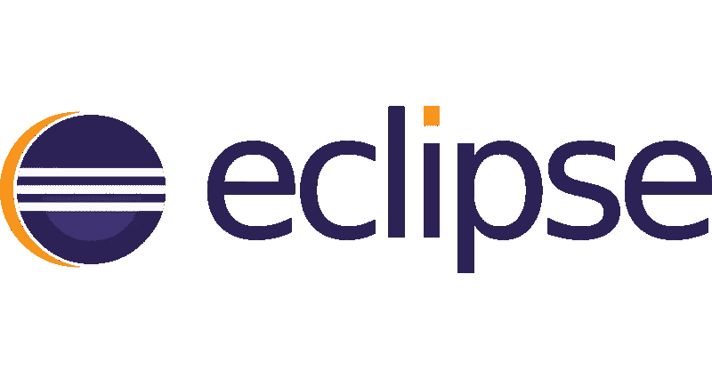
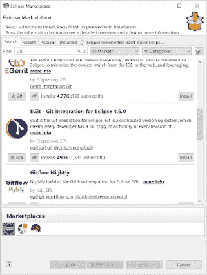
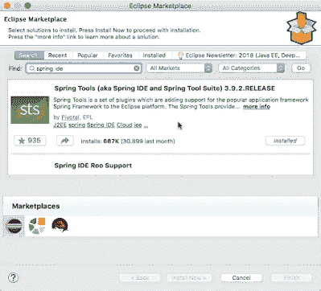
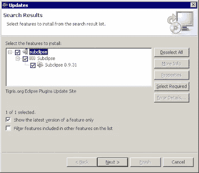
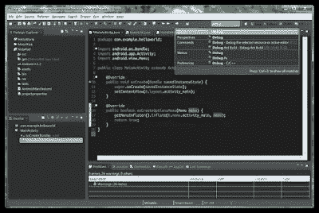
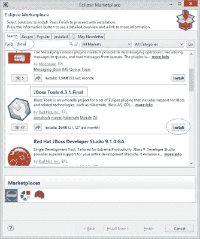
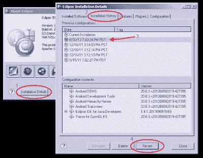
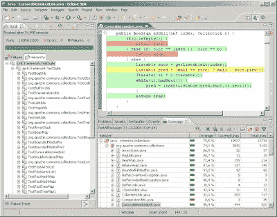
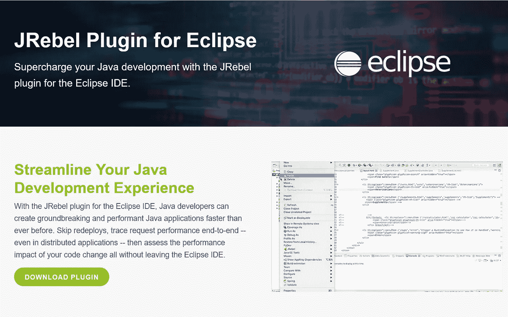

# Java 和 Spring Boot 开发的 10 个最佳 Eclipse 插件

> 原文：<https://medium.com/javarevisited/10-best-eclipse-plugins-for-java-and-spring-boot-development-e814305831cb?source=collection_archive---------0----------------------->

## 我最喜欢的 Eclipse 插件可以增强 Java 和 Spring 框架应用程序的开发

Java 开发者们好，毫无疑问，Eclipse 是 Java 开发最受欢迎的 ide 之一，而让 Eclipse 变得伟大的无非是插件。

如果你想掌握 Java 和 Spring Boot 开发的 Eclipse IDE，那么你来对地方了。早些时候，我已经分享了[最佳 Eclipse 课程](/javarevisited/6-free-best-eclipse-ide-courses-for-java-programmers-1229ee9e5d87)，今天，我将分享一些基本的 Eclipse 插件，以增强您使用 Eclipse 开发 Java 和 Spring Boot 的能力。

有数百个 Eclipse 插件用于不同类型的任务和与其他基本工具的集成，比如有从 [Github](https://www.java67.com/2019/04/top-5-courses-to-learn-git-and-github.html) 、SVN、CVS 等下载代码的插件。

有计划使用来自 Eclipse 的 [Maven](https://javarevisited.blogspot.com/2019/03/top-5-course-to-learn-apache-maven-for.html) 或 [Gradle](https://www.java67.com/2018/04/10-tools-java-developers-should-learn.html) 。有专门的插件用于 Java 开发、Python 开发、创建基于 Spring 的 Java 应用程序，以及从 Eclipse 本身创建 Android 应用程序。

我已经看到通过安装正确的插件，生产力得到了提高。例如，一旦安装了 EGit 插件，就可以直接从 Eclipse 管理 Git 存储库。

您不需要任何其他 Git 客户端。同样，添加 Spring Tools 插件可以帮助你非常容易地创建基于 [Spring](https://javarevisited.blogspot.com/2018/06/top-6-spring-framework-online-courses-Java-programmers.html) 和 [Spring Boot](https://www.java67.com/2018/06/5-best-courses-to-learn-spring-boot-in.html) 的应用程序。

我见过很多 Java 开发人员没有真正最大程度地使用 Eclipse。许多 Java 程序员创建了一个基于 Spring 的应用程序，就像其他 Java 项目一样，这并不坏，但不是最佳的。通过使用 **Spring Tools 插件**来创建基于 Spring 的应用程序，您可以极大地提高您的工作效率。一些 Java 开发人员告诉我的一个原因是，由于他们人数众多，找到合适的插件很困难，但是 Eclipse MarketPlace 已经解决了这个问题。你现在可以很容易地搜索 Eclipse 插件，还可以查看下载次数，检查它们的受欢迎程度，最棒的是，你可以从 Eclipse IDE 本身完成这项工作。

我认为不使用 Eclipse 插件的原因可能是*缺乏知识*。很明显，在你了解某样东西之前，你不能真正使用它。但是，让我担心的是，这种知识的缺乏不仅仅发生在初学 Java 的开发人员身上，也发生在已经达到学习高原的高级开发人员身上。

这就是为什么我写这篇文章来为 Java 开发人员分享一些最重要的 Eclipse 插件，包括像 [Git](https://javarevisited.blogspot.com/2019/05/10-free-websites-to-learn-git-online.html) 和 SVN 这样的源代码控制系统插件，像 [Maven](https://javarevisited.blogspot.com/2019/03/top-5-course-to-learn-apache-maven-for.html#axzz6ccm5KWKs) 和 [Gradle](https://javarevisited.blogspot.com/2020/05/top-5-courses-and-books-to-learn-gradle.html#axzz6fk6WjYD0) 这样的构建工具插件，以及像 Spring 和 Android 这样的框架插件。

所有正在做核心 Java 工作的 Java 开发者，在 Android 上开发一个 web 应用或移动应用，都可以从这些插件中受益。

Btw，如果你是初学者，建议你先去上一堂类似 [**Eclipse 初学者教程**](https://click.linksynergy.com/fs-bin/click?id=JVFxdTr9V80&subid=0&offerid=562016.1&type=10&tmpid=14538&RD_PARM1=https%3A%2F%2Fwww.udemy.com%2Feclipse-java-tutorial-for-beginners%2F) 这样的初学者课程，了解 Eclipse IDE 的核心概念，熟悉 UI 和本质特性。之后学习插件会轻松很多。

# Java 和 Spring Boot 开发的十大 Eclipse 插件

不要再浪费你的时间了，下面是我列出的 10 个 Java 开发必备插件:

## 1.EGit—Eclipse 的 Git 集成

对于今天的 Java 开发人员来说，这可能是最基本的 Eclipse 插件。它允许您从 Github 下载代码，并为 Eclipse 提供 Git 集成。

如果你不知道， [Git](https://javinpaul.medium.com/top-10-free-courses-to-learn-git-and-github-best-of-lot-967aa314ea) 是一个分布式版本控制系统，这意味着每个开发人员都有代码每个修订版的完整副本。

它也使得针对历史的搜索和执行查询变得快速和通用。如果你不熟悉 Git，我建议你首先查看一下 Git master class****，它提供了一个完整的分步指南来掌握所有关键的 Git 概念和命令**。**总之是 Java 开发必备插件。****

********

## ****2.Spring 工具(又名 Spring IDE 和 Spring 工具套件(STS))****

****毫无疑问，Spring 是最流行的 Java 框架，这个插件使得在 Eclipse 中创建 Spring 和 Spring Boot 项目变得非常容易。****

****通过使用 STS 插件，您可以使用易于使用的 start.spring.io 集成快速创建 Spring Boot 项目。它还支持基于 Spring Java-Config 的应用程序开发、高级代码完成、内容辅助、验证以及对 Spring 应用程序的快速修复支持。它也非常适合使用 Spring 进行微服务开发，因为它集成了 Cloud Foundry 的 IDE，包括在云中调试。

如果你想了解更多关于 Spring 的微服务，那么我也建议你加入 Udemy 上的 [**主微服务与 Spring Boot 和 Spring 云**](https://click.linksynergy.com/fs-bin/click?id=JVFxdTr9V80&subid=0&offerid=323058.1&type=10&tmpid=14538&RD_PARM1=https%3A%2F%2Fwww.udemy.com%2Fmicroservices-with-spring-boot-and-spring-cloud%2F) 课程，这是学习 Spring 和 Java 微服务的最佳课程之一。****

********

## ****3.Eclipse 的 Maven 集成(M2E)****

****m2e 插件或 Maven Integration for Eclipse 插件是 Java 开发所需的另一个流行的 Eclipse 插件。它为 [Eclipse](https://javarevisited.blogspot.com/2020/05/top-5-courses-to-learn-eclipse-ide-for-java-developers.html) 提供了全面的 Maven 集成。您可以使用 M2E 来管理简单的和多模块的 Maven 项目，通过 Eclipse 接口执行 Maven 构建，并与 Maven 存储库进行交互。

顺便说一句，独立的插件取决于您使用的 Eclipse 版本，就像 Eclipse Juno 和 Eclipse Luna 以及更高版本都有独立的插件一样。****

****同时，如果你想在今年提高你的 Maven 技能，你应该加入约翰·汤姆森的这个 [**Apache Maven:初学者到大师**](https://click.linksynergy.com/deeplink?id=JVFxdTr9V80&mid=39197&murl=https%3A%2F%2Fwww.udemy.com%2Fapache-maven-beginner-to-guru%2F) 课程，这是深入学习 Maven 的最佳课程之一。****

********

## ****4.亚尖端****

****这是另一个源代码控制插件，允许你从 SVN 下载代码，并从 Eclipse 执行所有与 SVN 相关的操作。它由 Subversion 核心提交者开发和维护，并且总是与最新的 Subversion 特性和版本保持同步。****

****如果你正在做一个托管在 SVN 的 Java 项目，那么这是你必须拥有的插件。如果你想刷新你的 SVN 概念，你可以进一步检查本课程。****

********

## ****5.Eclipse 颜色主题****

****我们程序员喜欢这种颜色，但是我们都有不同的选择。你们中的一些人喜欢《月食》丑陋的旧颜色主题，但其他人喜欢黑暗主题，如 [Vim](https://javarevisited.blogspot.com/2011/06/vi-editor-in-unix-example-tutorial-and.html) 和 [IntelliJ IDEA](https://javarevisited.blogspot.com/2018/09/top-5-courses-to-learn-intellij-idea-java-and-android-development.html) 。****

****Eclipse 颜色主题使得方便地切换颜色主题并且没有副作用成为可能。如果你喜欢改变颜色主题或使用多种编程语言工作，如 [Java](https://dev.to/javinpaul/top-10-courses-to-learn-spring-boot-and-microservices-for-java-programmers-3hjg) 、 [Python](https://javarevisited.blogspot.com/2019/07/top-5-books-to-learn-python-in-2019.html) 、 [JavaScript](/javarevisited/10-of-the-most-popular-javascript-frameworks-libraries-for-web-development-in-2019-a2c8cea68094) 等。，这个插件能让你真正快乐。****

********

## ****6.JBoss 工具****

****JBoss Tools 是一组 Eclipse 插件的保护伞项目，包括对 JBoss 和相关技术的支持，如 [Hibernate](https://javarevisited.blogspot.com/2018/01/top-5-hibernate-and-jpa-courses-for-java-programmers-learn-online.html) ，JBoss AS/wildly，CDI， [OpenShift](https://javarevisited.blogspot.com/2020/07/top-5-courses-to-learn-redhat-openshift.html) ，Apache Camel，Red Hat JBoss Fuse， [Docker](https://javarevisited.blogspot.com/2019/05/top-5-courses-to-learn-docker-and-kubernetes-for-devops.html) ，JSF，(X)HTML， [Maven](https://dev.to/javinpaul/10-free-devops-courses-to-learn-jenkins-docker-and-maven-for-programmers-ohp) 等等。****

********

## ****7.Eclipse 测试****

****如果您知道 [JUnit](https://javarevisited.blogspot.com/2019/04/top-5-junit-and-unit-testing-courses-java-programmers.html) 捆绑在 Eclipse 中，但是如果您正在使用 TestNG 为您的 Java 项目编写单元测试，那么这个 Eclipse 插件可以帮助您。它允许您从 Eclipse 运行 TestNG 测试。****

****您可以运行套件、组或单个方法。错误在一个单独的选项卡中报告，使您能够有效地跳转到失败的测试。

该插件还包含几个模板，可以轻松创建测试。而且，如果你今年也想提高你的 TestNG 技能并需要资源，我建议你看看 [**TestNG 完整训练营**](https://click.linksynergy.com/deeplink?id=JVFxdTr9V80&mid=39197&murl=https%3A%2F%2Fwww.udemy.com%2Fcourse%2Ftestng-complete-bootcamp%2F) 课程，它将走从新手到忍者的道路。****

********

## ****8.Eclipse 的 Android 开发工具(ADT)****

****Android Development Tools (ADT)是 Eclipse IDE 的一个插件，旨在为您提供一个健壮的集成环境来构建 Android 应用程序。

ADT 扩展了 Eclipse 的功能，让您可以快速设置新的 Android 项目、创建应用程序 UI、添加基于 Android 框架 API 的包、使用 Android SDK 工具调试您的应用程序，甚至导出签名的(或未签名的)应用程序。apk 文件来分发你的应用，如果你想在今年提升你的 Android 技能， [**完整的 Android 开发者课程**](https://click.linksynergy.com/fs-bin/click?id=JVFxdTr9V80&subid=0&offerid=323058.1&type=10&tmpid=14538&RD_PARM1=https%3A%2F%2Fwww.udemy.com%2Fcomplete-android-n-developer-course%2F) 是一个很好的开始资源。****

********

## ****9.EclEmma Java 代码覆盖率****

****EclEmma 是一个免费的用于 Eclipse 的 Java 代码覆盖工具，可以在 Eclipse 公共许可证下获得。它将代码覆盖分析直接引入 Eclipse 工作台。****

****它有助于代码覆盖分析，如果使用得当，可以通过增加快速开发/测试周期来提高代码质量。****

********

## ****10. [JRebel for Eclipse](https://www.jrebel.com/jrebel-and-xrebel-eclipse-plugins)****

****JRebel 是一个生产力工具，允许开发人员即时重新加载代码更改。它跳过了 Java 开发中典型的重建、重启和重新部署循环。JRebel 使开发人员能够在相同的时间内完成更多的工作，并在编码时保持流畅。JRebel 支持大多数现实世界的企业 Java 栈，并且很容易安装到现有的开发环境中。****

****毫无疑问，这些插件中的大部分都出现在 Eclipse MarketPlace 的 Eclipse 插件最受欢迎列表中，这也是找到一些最受欢迎的 Eclipse 插件的一个很好的来源。例如，如果你正在使用 Scala 或 Angular，你可以在这里找到插件来简化你的工作。

由于同一个工作有多个插件，因为你既有 **SubEclipse** 又有颠覆性的——从 SVN 下载源代码的 SVN 团队提供商，所以知道你选择什么是很重要的。我通常先尝试最受欢迎的一个，探索其他不符合预期。****

********

## ****11.奖励[Lombok 插件]****

****我强烈推荐的另一个插件是对 Eclipse IDE 的 Lombok 支持，这绝对是每个 Java 开发人员应该尽快安装的一个插件，以提高他们的工作效率。

以上是 Java 开发人员最基本的 **Eclipse 插件**。这些插件真的很常见，你可能已经在不知不觉中使用它们了。以防万一，如果你还没有探索它们，我建议你看一看。您可以在 Eclipse MarketPlace 中找到所有这些插件，并将它们安装在您的 Eclipse IDE 上。****

## ****您可能希望探究的其他**编程文章******

*   ****[完整的 Java 开发者路线图](https://javarevisited.blogspot.com/2019/10/the-java-developer-roadmap.html#123)****
*   ****[Java 和 Web 开发人员应该学习的 10 件事](http://javarevisited.blogspot.sg/2017/12/10-things-java-programmers-should-learn.html#axzz53ENLS1RB)****
*   ****[学习 Eclipse、JUnit 和 Mockito 的十大课程](/javarevisited/top-10-courses-to-learn-eclipse-junit-and-mockito-for-java-developers-4de1e8d62b96)****
*   ****[Java 开发人员应该知道的 10 个测试工具](http://javarevisited.blogspot.sg/2018/01/10-unit-testing-and-integration-tools-for-java-programmers.html)****
*   ****Java 开发者应该学习的 5 个框架****
*   ****成为更好的 Java 开发人员的 10 个技巧****
*   ****[完整的 Web 开发者路线图](https://hackernoon.com/the-2019-web-developer-roadmap-ab89ac3c380e)****
*   ****[学习数据结构和算法的 10 门课程](https://hackernoon.com/10-data-structure-algorithms-and-programming-courses-to-crack-any-coding-interview-e1c50b30b927)****
*   ****[如何通过 Java 认证？](https://medium.freecodecamp.org/how-to-pass-oracles-java-certifications-a-practical-guide-for-developers-e9b607ba6173)****
*   ****[如何破解 Spring 5.0 开发者认证](https://javarevisited.blogspot.com/2018/08/how-to-crack-spring-core-professional-certification-exam-java-latest.html)。****
*   ****每个 Java 程序员都应该阅读的 10 本书****
*   ****【Java 开发人员在日常工作中使用的 10 种工具****
*   ****[Java 开发人员需要学习的 21 项基本技能](https://javarevisited.blogspot.com/2020/03/top-20-skills-java-developers-can-learn.html#axzz6k4XBgTw4)****
*   ****[面向 Java 开发人员的十大云认证](https://www.java67.com/2020/09/top-10-cloud-certification-you-can-aim.html)****

****感谢您阅读本文。如果你喜欢这些用于 Java 和 Spring Boot 开发的最好的 Eclipse 插件，那么请与你的朋友和同事分享。如果您有任何问题或反馈，请留言。**** 

**** [## 深入学习面向 Java 程序员的 Eclipse IDE 的前 5 门课程——最好的

### 大家好，如果你从事 Java 开发，你可能知道 Eclipse 是最流行的 Java ide 之一…

javarevisited.blogspot.com](https://javarevisited.blogspot.com/2020/05/top-5-courses-to-learn-eclipse-ide-for-java-developers.html)****