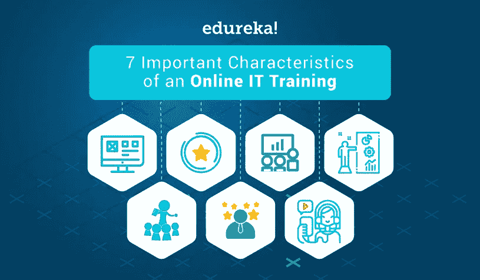
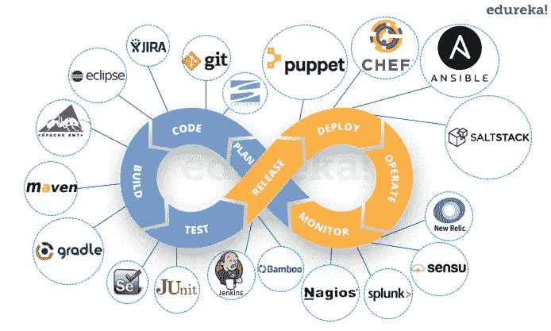
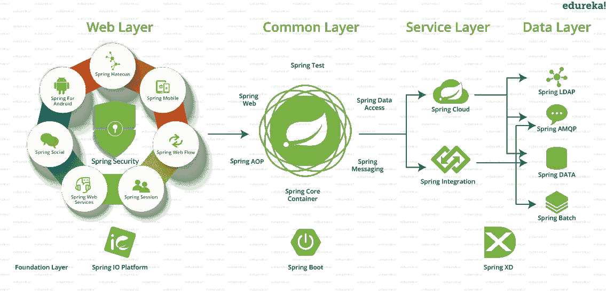
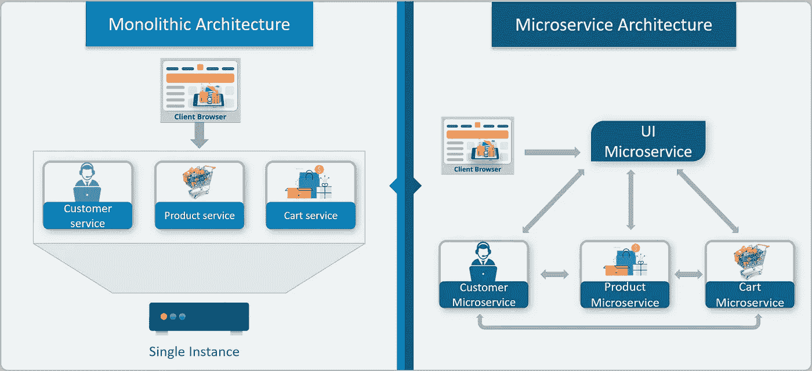
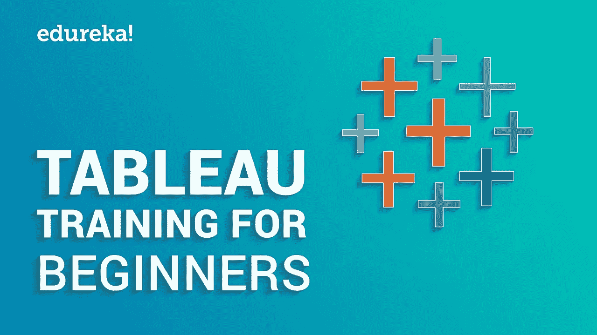
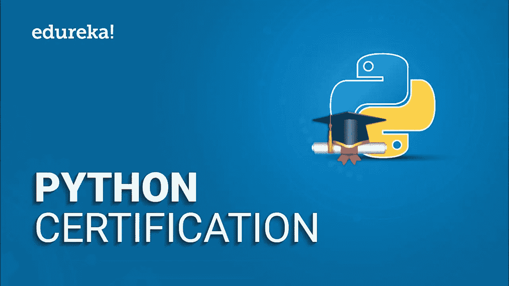

# 2022 年要学的 10 门最佳 Edureka 课程和认证

> 原文：<https://medium.com/javarevisited/10-best-edureka-courses-and-certifications-to-learn-online-e62262b6c985?source=collection_archive---------0----------------------->

## Edureka 是教师指导的在线培训课程的地方，这些是你在 2022 年可以参加的最好的 Edureka 课程和认证，以学习 Java、Spring、大数据等

你好，伙计们，如果你正在寻找 2022 年参加的最佳教育课程，那么你来对地方了。之前，我已经分享了 [**最佳 Udemy 课程**](/javarevisited/my-favorite-udemy-online-courses-for-programmers-and-software-engineers-f9d941dd0035) 和 [**最佳 Pluralsight 课程**](/javarevisited/top-10-pluralsight-courses-to-learn-programming-and-software-development-during-covid-19-stay-at-30b7d8a4f88f) 在这篇文章中，我将分享 2022 年加入的最佳 Edureka 认证课程。

如果你喜欢在线课堂培训，那么你可能听说过 Edureka，在线直播课堂培训的领导者。

在线课堂培训与在线课程有些不同，因为你将有机会与讲师现场互动，与在线课程相比，它更接近于学校和大学的传统课堂学习。由于这种独特的师生互动，在线课堂教学日益受到欢迎。

今天，互联网已经成为教育的一个重要来源。几乎每一种教育都可以在网上获得。有免费课程、付费课程、youtube 上的免费视频、文章、教程和各种其他书面材料。

这种学习材料由几个教育网站提供。它们以课程的形式提供。有些是付费的，有些是免费的。还有很多在线学习平台，像 [Udemy](https://javarevisited.blogspot.com/2019/08/top-10-udemy-courses-and-certifications-for-programmers.html) 、 [Codecademy](https://javarevisited.blogspot.com/2019/10/pluralsight-vs-codecademy-which-is-best-online-learning-platform.html) 、 [Pluralsight](https://javarevisited.blogspot.com/2019/10/udemy-vs-pluralsight-review-which-is-better-to-learn-code.html) 、 [Educative](/javarevisited/11-best-educative-courses-for-coding-interviews-and-software-development-339ad82fee50) 、 [Coursera](/javarevisited/18-coursera-courses-you-can-join-in-2020-to-learn-from-the-worlds-top-tech-companies-google-74af46967d1e) 、edX 等。

Edureka 是最受欢迎的教育网站之一。它于 2011 年推出，提供不同技术领域的几门课程，如 [Java](https://javarevisited.blogspot.com/2018/05/top-5-java-courses-for-beginners-to-learn-online.html#axzz6t8XhPyPu) 、 [Spring Framework](/javarevisited/10-best-online-courses-to-learn-spring-framework-in-2020-f7f73599c2fd) 、[微服务](/javarevisited/10-best-java-microservices-courses-with-spring-boot-and-spring-cloud-6d04556bdfed)、云计算、编程、DevOps、大数据、数据科学、区块链等等。

与 Udemy 或 CodeCadmey 等其他在线学习平台相比，Edureka 的 USP 是他们的讲师指导在线培训，非常接近传统的课堂培训，学生可以与教师实时互动。Edureka 还拥有世界一流的学习系统，允许学习者在线实践实验室，通过做的方法促进学习。

另一方面， [**Edureka 认证课程**](https://click.linksynergy.com/deeplink?id=JVFxdTr9V80&mid=42536&murl=https%3A%2F%2Fwww.edureka.co%2F&LSNSUBSITE=LSNSUBSITE) 一开始看起来有点贵，但如果你比较一下它们的综合结构、内容、支持、动手实验室和现场讲师指导培训，价格是完全合理的。

在本文中，我们将根据评级和内容列出 Edureka 提供的十大认证培训。你可以参加这些在线直播培训课程，学习云计算、区块链和数据科学等热门技能，以及 Java 和 Spring Framework 等更多面向工作的技能。

# 2022 年 10 大最佳 Edureka 认证培训课程

在不浪费你更多时间的情况下，这里有来自 Edureka 的最好的在线培训课程，程序员和开发人员可以用来学习流行的技术技能，如 DevOps、微服务、Java、Spring Framework、区块链等等。

## 1.[区块链认证培训课程](https://click.linksynergy.com/deeplink?id=JVFxdTr9V80&mid=42536&murl=https%3A%2F%2Fwww.edureka.co%2Fblockchain-training&LSNSUBSITE=LSNSUBSITE)

“区块链”一词最近非常流行。本课程由区块链顶尖专家打造。

在本课程中，您将学习各种区块链概念及其平台，如比特币、多链、以太坊和 Hyperledger。有近两万名学生注册，这是最受欢迎的区块链课程之一。

**以下是加入本次课堂培训的链接**——[区块链认证培训班](https://click.linksynergy.com/deeplink?id=JVFxdTr9V80&mid=42536&murl=https%3A%2F%2Fwww.edureka.co%2Fblockchain-training&LSNSUBSITE=LSNSUBSITE)

## 2. [DevOps 认证培训](https://click.linksynergy.com/deeplink?id=JVFxdTr9V80&mid=42536&murl=https%3A%2F%2Fwww.edureka.co%2Fdevops-certification-training&LSNSUBSITE=LSNSUBSITE)

本课程是 Edureka 最畅销和最受欢迎的培训课程之一。在本课程中，您将了解几个 DevOps 工具，如 git、docker、Jenkins、Kubernetes、puppet 等等。

该培训计划也是完全实践性的，旨在帮助您通过持续开发、持续测试、配置管理和持续集成方面的最佳实践，以及在整个开发生命周期中对软件的持续监控，成为一名认证 DevOps 工程师。

超过 94000 名学生已经在 Edureka 注册了这个最好的 DevOps 培训项目。

**以下是参加本培训课程** — [DevOps 认证培训](https://click.linksynergy.com/deeplink?id=JVFxdTr9V80&mid=42536&murl=https%3A%2F%2Fwww.edureka.co%2Fdevops-certification-training&LSNSUBSITE=LSNSUBSITE)的链接

## 3. [Java 认证培训课程](https://click.linksynergy.com/deeplink?id=JVFxdTr9V80&mid=42536&murl=https%3A%2F%2Fwww.edureka.co%2Fjava-j2ee-training-course&LSNSUBSITE=LSNSUBSITE)

毫无疑问，Java 是最流行的通用编程语言之一，可能也是最流行的后端编程语言。

鉴于许多公司正在使用 Java 和 Spring Boot 构建他们的服务器端应用程序，在 2022 年学习 Java 是一个伟大的决定，如果你想在线学习 Java，那么这门课程是一个完美的选择。

这是 Edureka 最畅销的编程课程之一。本课程涵盖了核心 Java 的基础和高级概念，包括 Spring 和 Hibernate 等框架。

***这里是参加本认证课程*** — [Java 认证培训](https://click.linksynergy.com/deeplink?id=JVFxdTr9V80&mid=42536&murl=https%3A%2F%2Fwww.edureka.co%2Fjava-j2ee-training-course&LSNSUBSITE=LSNSUBSITE)的链接

## 4. [Spring 框架认证培训](https://click.linksynergy.com/deeplink?id=JVFxdTr9V80&mid=42536&murl=https%3A%2F%2Fwww.edureka.co%2Fspring-certification-course&LSNSUBSITE=LSNSUBSITE)

Spring 是一个非常流行的 Java 框架。它在后端开发中被大量使用。事实上，它是最流行的 Java 框架，并且已经成为用 Java 开发服务器端应用程序的标准。

这个课程是为那些想要掌握 Spring 框架的个人设计的。所有主要的概念，比如数据访问、spring web、spring-security 等等。

如果您想在 2022 年学习 Spring Framework，并且正在寻找一个由讲师指导的在线认证培训课程，那么您应该参加这个课程。它完全在线，同时也是一门直播课程，所以你可以实时提出你的疑问和问题。

***这里是加入本课程***——[Spring 框架认证培训](https://click.linksynergy.com/deeplink?id=JVFxdTr9V80&mid=42536&murl=https%3A%2F%2Fwww.edureka.co%2Fspring-certification-course&LSNSUBSITE=LSNSUBSITE)的链接

## 5.[微服务架构培训](https://click.linksynergy.com/deeplink?id=JVFxdTr9V80&mid=42536&murl=https%3A%2F%2Fwww.edureka.co%2Fmicroservices-architecture-training&LSNSUBSITE=LSNSUBSITE)

本课程是云计算类别中最畅销的课程之一。是为那些想深入学习微服务概念和架构的个人准备的。

微服务和云计算携手并进，这使得微服务成为现代应用程序中最受欢迎的软件架构。

它不仅使开发模块化和更容易管理，而且使部署和扩展更容易。如果你热衷于学习微服务，这是一个很好的在线课程，可以在 2022 年加入。

**以下是参加本课程** — [微服务架构培训](https://click.linksynergy.com/deeplink?id=JVFxdTr9V80&mid=42536&murl=https%3A%2F%2Fwww.edureka.co%2Fmicroservices-architecture-training&LSNSUBSITE=LSNSUBSITE)的链接

## 6.[大数据 Hadoop 认证培训](https://click.linksynergy.com/deeplink?id=JVFxdTr9V80&mid=42536&murl=https%3A%2F%2Fwww.edureka.co%2Fbig-data-hadoop-training-certification&LSNSUBSITE=LSNSUBSITE)

有超过 16 万名学生注册，这门课程无疑是 Edureka 最受欢迎的课程之一。而且这门课的平均评分是 4.9。它是为那些想学习大数据和 Hadoop 的个人准备的。

如果您热衷于学习大数据和 Hadoop，那么这是最适合您的认证课程。您将了解一般大数据概念及其在当今数据驱动的世界中的重要性。

您还将学习各种大数据框架，特别是 Hadoop，以建立集群来处理大小公司每天生成的大量数据。

**以下是参加本课程的链接** — [大数据 Hadoop 认证培训](https://click.linksynergy.com/deeplink?id=JVFxdTr9V80&mid=42536&murl=https%3A%2F%2Fwww.edureka.co%2Fbig-data-hadoop-training-certification&LSNSUBSITE=LSNSUBSITE)

## 7. [Node.js 认证培训](https://click.linksynergy.com/deeplink?id=JVFxdTr9V80&mid=42536&murl=https%3A%2F%2Fwww.edureka.co%2Fnodejs-certification-training&LSNSUBSITE=LSNSUBSITE)

Node.js 是当今最流行的技术之一。它是 MERN 和 MEAN web 开发栈不可或缺的一部分。

本课程将帮助您了解 Node.js 以及如何将其与另一个流行的框架 Express.js 结合使用。本课程还涵盖了 MongoDB、RESTfull APIs 以及使用 Nginx 的应用部署。

**以下是参加本课程** — [Node.js 认证培训](https://click.linksynergy.com/deeplink?id=JVFxdTr9V80&mid=42536&murl=https%3A%2F%2Fwww.edureka.co%2Fnodejs-certification-training&LSNSUBSITE=LSNSUBSITE)的链接

## 8. [Tableau 培训和认证](https://click.linksynergy.com/deeplink?id=JVFxdTr9V80&mid=42536&murl=https%3A%2F%2Fwww.edureka.co%2Ftableau-certification-training&LSNSUBSITE=LSNSUBSITE)

本课程是商业智能和可视化领域最畅销、评分最高的课程。它由商业智能行业专家创建，涵盖了 Tableau 桌面、Tableau 准备生成器和 Tableau 在线等重要概念。

谈到社会证明，超过三万名学生注册了这个 Tableau 认证培训课程，这是 Tableau 上最受欢迎的讲师指导的在线直播培训课程之一。

以下是加入此认证的链接— [Tableau 培训和认证](https://click.linksynergy.com/deeplink?id=JVFxdTr9V80&mid=42536&murl=https%3A%2F%2Fwww.edureka.co%2Ftableau-certification-training&LSNSUBSITE=LSNSUBSITE)

## 9.[应对 Redux 认证培训](https://click.linksynergy.com/deeplink?id=JVFxdTr9V80&mid=42536&murl=https%3A%2F%2Fwww.edureka.co%2Freactjs-redux-certification-training&LSNSUBSITE=LSNSUBSITE)

React 是前端开发社区中最知名的公司之一。它是一个 JavaScript 库，用于创建交互式用户界面。它是广受欢迎的 [MERN 堆栈](/javarevisited/top-5-online-courses-to-learn-mern-stack-in-depth-9947230f194)的一部分。

在本课程中，您将学习 React 及其所有重要概念，如 JSX、异步编程、Jest 等。您还将了解 Redux 和 Redux-Saga。此外，该课程还涵盖了用于移动应用程序开发的 React Native。

**这里是参加本课程的链接**——[React with Redux 认证培训](https://click.linksynergy.com/deeplink?id=JVFxdTr9V80&mid=42536&murl=https%3A%2F%2Fwww.edureka.co%2Freactjs-redux-certification-training&LSNSUBSITE=LSNSUBSITE)

## 10.[数据科学 Python 认证培训](https://click.linksynergy.com/deeplink?id=JVFxdTr9V80&mid=42536&murl=https%3A%2F%2Fwww.edureka.co%2Fdata-science-python-certification-course&LSNSUBSITE=LSNSUBSITE)

Python 是当今最流行的编程语言之一。由于各种原因，它经常被用于数据科学。

在本 Edureka 认证培训课程中，您将学习各种 python 概念，如文件操作、数据操作、面向对象编程等。

它还涵盖了数据科学所需的重要库，如 Numpy、Pandas 和 Matplotlib。

**以下是参加本课程** — [数据科学 Python 认证培训](https://click.linksynergy.com/deeplink?id=JVFxdTr9V80&mid=42536&murl=https%3A%2F%2Fwww.edureka.co%2Fdata-science-python-certification-course&LSNSUBSITE=LSNSUBSITE)的链接

以上是关于 2022 年**最佳 Edureka 在线课程和认证的全部内容**您可以在线加入这些课程，学习一些热门的技术技能，如区块链、DevOps、Java、Spring Framework、大数据等。

这些是 Edureka 精心挑选的十大课程。对于希望在职业生涯中学习和成长的程序员和开发人员来说，这些也是最好的 Edureka 课程。

该网站有许多不同类别的课程。本文所选课程均为热门类别中评分最高的畅销书。本文列出的课程涵盖了 Node.js、区块链、Spring、Java、Hadoop 等按需技术。

您可能喜欢的其他**编程资源**

*   [程序员的 10 门最佳教育课程](https://javarevisited.blogspot.com/2020/05/top-10-educative-courses-for-programmers.html#axzz6t8XhPyPu)
*   [面向有经验程序员的 10 门高级 Java 课程](https://javarevisited.blogspot.com/2020/04/top-10-advanced-core-java-courses-for-experienced-developers.html#axzz6KyOHbmCo)
*   [2022 年学习 Web 开发的五大课程](https://javarevisited.blogspot.com/2018/02/top-5-online-courses-to-learn-web-development.html)
*   [2022 年学习 Spring Boot 的 5 大课程](https://javarevisited.blogspot.com/2018/05/top-5-courses-to-learn-spring-boot-in.html)
*   [2022 年最佳阿帕奇卡夫卡课程](https://javarevisited.blogspot.com/2018/04/top-5-apache-kafka-course-to-learn.html)
*   [程序员的 10 门最佳多元化课程](/javarevisited/top-10-pluralsight-courses-to-learn-programming-and-software-development-during-covid-19-stay-at-30b7d8a4f88f)
*   [面向程序员的 15 门 AWS、Docker 和 Kubernetes 课程](/javarevisited/top-15-online-courses-to-learn-docker-kubernetes-and-aws-for-fullstack-developers-and-devops-d8cc4f16e773)
*   [2022 年学习 React Native 的 5 门课程](http://javarevisited.blogspot.sg/2018/02/5-react-native-courses-to-learn-mobile-development-using-JavaScript.html)
*   [我最喜欢的免费课程学习 Maven、Jenkins 和 Docker](/javarevisited/top-10-free-courses-to-learn-maven-jenkins-and-docker-for-java-developers-51fa7a1e66f6)
*   [Web 开发人员学习 TypeScript 的五大课程](https://javarevisited.blogspot.com/2018/07/top-5-courses-to-learn-typescript.html)
*   [面向 Web 开发人员的十大 JavaScript 教程和课程](https://javarevisited.blogspot.com/2018/06/top-10-courses-to-learn-javascript-in.html)

感谢您阅读本文。如果您发现这些在线培训课程和 Edureka 平台有用，请与您的朋友和同事分享。如果您有任何问题或反馈，请留言。学习从未如此轻松有趣。

**p . s .**——如果你正在寻找免费的在线课程，那么你也可以看看这个在 Medium **上为初学者提供的 [**10 门免费编程和编码课程列表**](/javarevisited/top-10-free-interactive-programming-courses-from-educative-for-beginners-to-learn-in-2021-713cbf96d4eb) 。**这个列表包含 10 门免费的、基于文本的互动课程，这些课程来自 Educative，面向希望在 2022 年学习编码并成为软件和应用程序开发人员的初学者。

</javarevisited/10-free-courses-to-learn-java-in-2019-22d1f33a3915> 