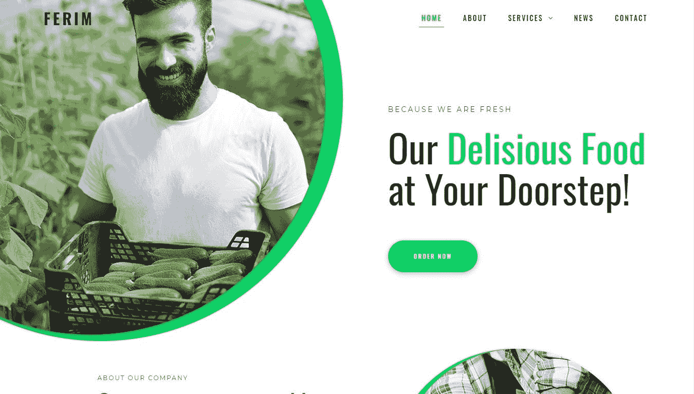
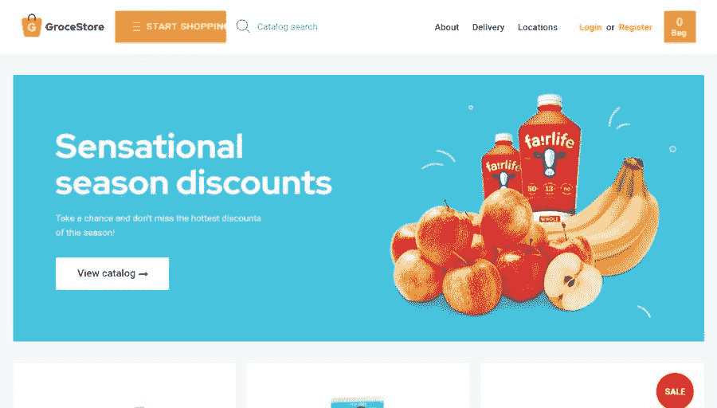
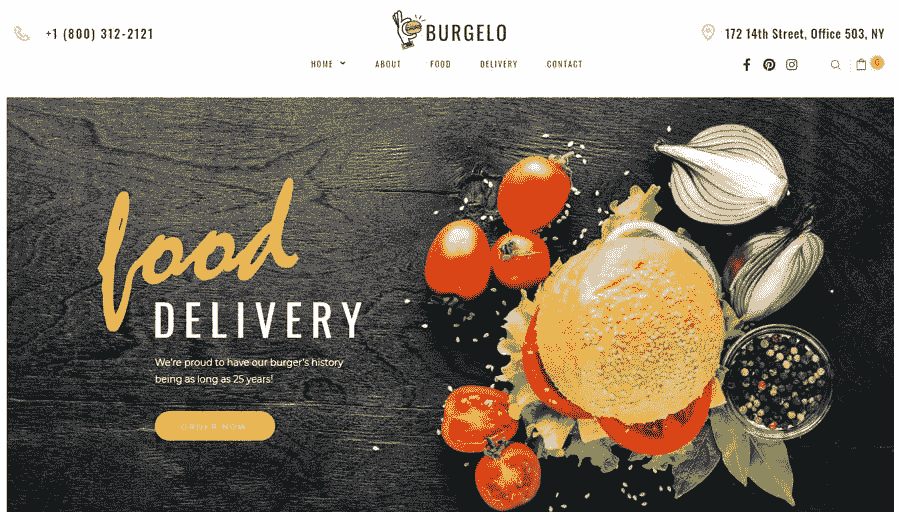
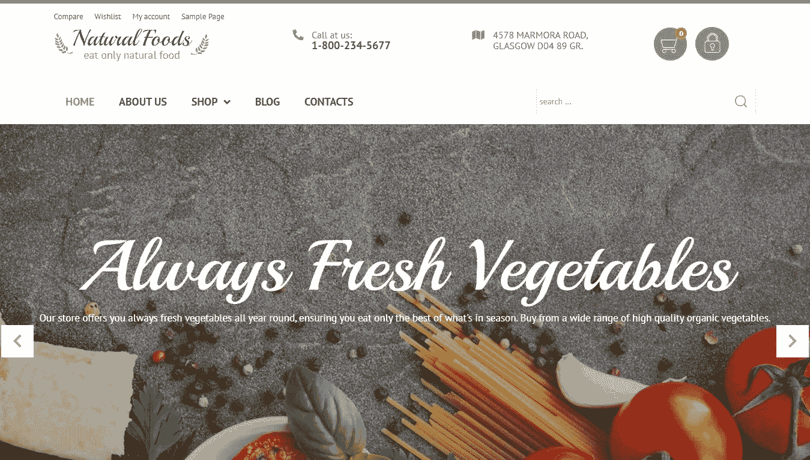
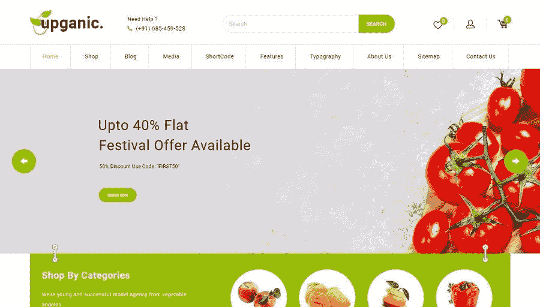
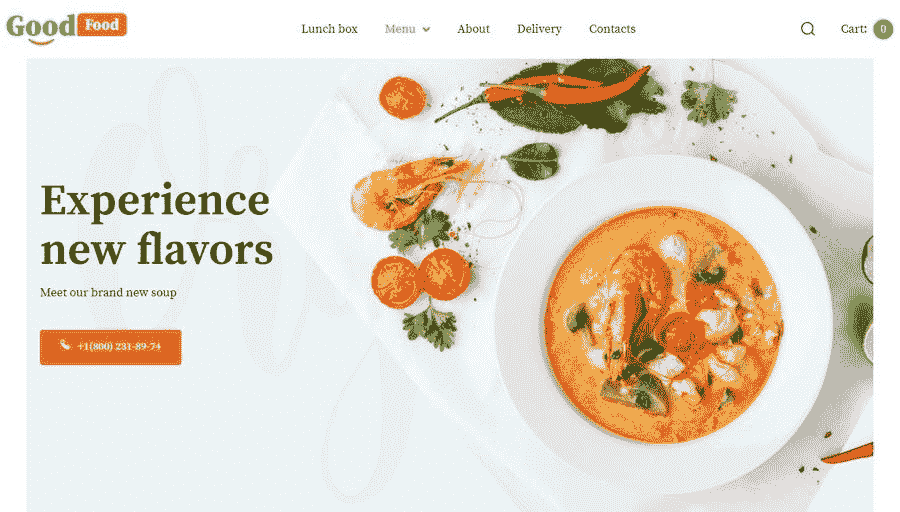
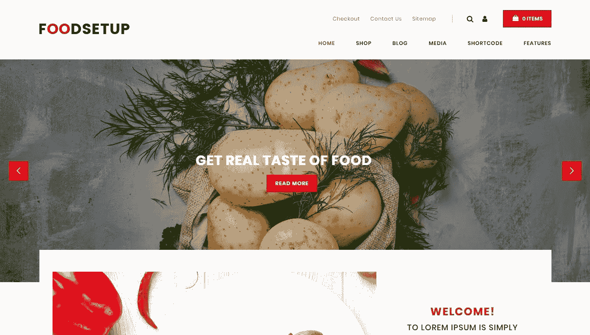
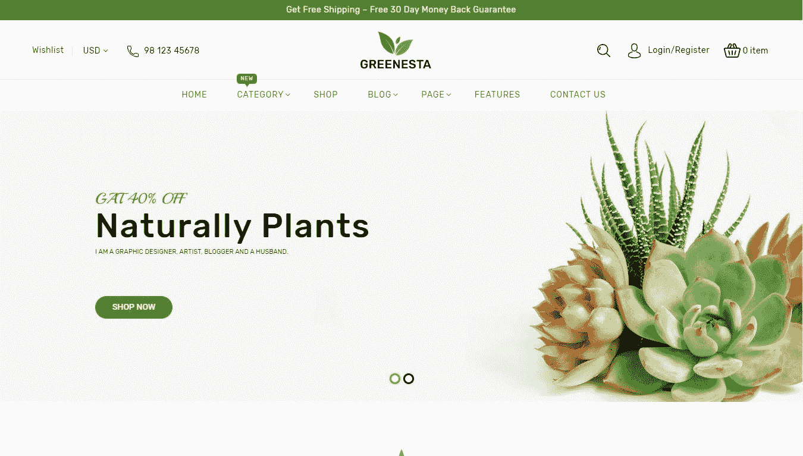
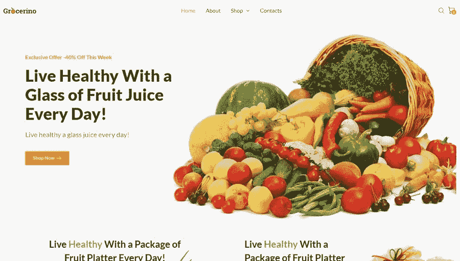

# 10 个最佳食品配送 WordPress 在线商店主题

> 原文：<https://medium.com/javarevisited/10-best-food-delivery-wordpress-online-store-themes-612aba7ab13f?source=collection_archive---------1----------------------->

拥有超过 7500 万活跃网站的 WordPress 是驱动整个网络的 CMS！如果你想经营一家 WordPress 电子商务商店，WooCommerce 是一个不错的选择。今天，我想向你展示*餐馆、自助餐厅、网上超市、有机食品和杂货店的 10 个**顶级食品配送主题**。*

食品配送业务目前竞争非常激烈。有许多受欢迎的服务，如 Uber Eats、GrubHub、Delivery Hero 和其他非常强调用户体验的服务。

多亏了现代食品配送 WordPress 在线商店主题，你也有机会建立一个 [**专业的在线形象**](/javarevisited/how-to-redesign-your-website-with-template-7ebcf6512abc) 而不用瞎折腾编码。这些主题是新手友好的，全面的，高质量的。它们中的每一个都拥有强大的功能！

## 费里姆

Ferim Food 商务主题

你准备好看到最好的食品配送 WordPress 在线商店主题了吗？

我邀请你以赏心悦目的 Ferim food delivery WordPress 主题开始这一旅程。它为您提供令人兴奋的干净的页面，创造性的布局，无与伦比的功能，强大的搜索引擎优化，和快速的性能。

Ferim 的主页是真正吸引眼球的，有圆形的图像，超干净的设计，令人敬畏的帖子网格，动画推荐等等。该页面通过简洁的 CTA 按钮有效地推动新网站访客转化，用户可以在他们需要的地方找到他们！你也有机会利用强大的社交选项、表单和弹出窗口来创造商机。我很喜欢为联系表单选择的背景。不是吗？

Ferim theme 由 RockThemes 专家团队开发，是食品配送、餐饮和在线杂货购物网站的完美选择。当然，这种新一代的主题不需要任何编码技巧就可以让它成为你自己的，并用它来创建一个令人惊叹的网站。Ferim 有一个强大的拖放编辑器，允许你用鼠标和方便的工具编辑你的网站。这个构建器是 Elementor——WordPress 领先且最受欢迎的可视化内容编辑器之一。使用 Ferim，您可以在 Elementor 库中获得大量的内容预设，以便随时创建您梦想中的网站！

其他功能:

*   反应灵敏，移动优先；
*   免费提供高分辨率图像；
*   JetElements 插件；
*   一键安装；
*   可靠的文档和支持。

[**更多详情**](https://www.templatemonster.com/wordpress-themes/ferim-food-delivery-multipurpose-minimal-elementor-wordpress-theme-75523.html?aff=javarevisited&utm_campaign=food_delivery&utm_source=javarevisited&utm_medium=referral)

## 格罗塞斯托

GroceStore 响应式 WooCommerce 主题

GroceStore 是一个非常吸引人的网上杂货店购物 WordPress 主题，为网上杂货店、超市或有机食品配送网站提供动力。这个主题有一个吸引人的，视觉友好的，现代的用户界面，让您的产品和特别优惠闪耀在最好的光。

GroceStore 是一个响应式的 WooCommerce 主题，可以让你在几天内开始销售。它允许您使用 Elementor builder 编辑您的电子商店页面，这是一个用户友好的可视化编辑器，不需要专家使用。GroceStore 通过预建的 Jet WooBuilder 插件实现了这一激动人心的功能。

该主题还包括 20 多个预制的小块和小部件，全部整齐地打包在 Jet Elements 插件中。Jet Tricks 允许你在不接触任何代码的情况下用 CSS 效果制作动画。您还将获得 Jet 产品图库插件，该插件将您产品的在线展示提升到新的高度。

我喜欢 GroceStore 主题，因为它的用户界面很精致，以销售为导向。这一主题为您提供了多种展示产品和展示业务的最佳方式。一个专业的搜索引擎优化团队优化了这个模板，使其对搜索引擎非常友好。如果你需要在网站上使用多种语言，你可以用 WPML 翻译 GroceStore 和你的内容——一个顶级的 WP 翻译插件。

其他功能:

*   有据可查；
*   资源丰富的支持；
*   高质量图像包；
*   快速安装。

[**更多详情**](https://www.templatemonster.com/woocommerce-themes/grocestore-bright-and-attractive-grocery-ecommerce-website-woocommerce-theme-90498.html?aff=javarevisited&utm_campaign=food_delivery&utm_source=javarevisited&utm_medium=referral)

## 布尔杰洛

Burgelo 食品配送 WooCommerce 主题

我今天回顾的下一个主题是伯格罗。这个现代主题有一个极好的设计。高对比度的区块、背景、图像网格、诱人的松脆蔬菜和汉堡、清新的草书字体、一些不对称性和独特的图标——所有这些元素都有助于吸引用户并促进销售！

为了使您的食品订购网站的 UI 100%可用，Burgelo theme 以带有 Ajax 导航的单页页面的形式出现。由于这样的主题结构，你有机会让用户向你点餐，同时突出你的吸引力。

Burgelo food delivery WooCommerce 主题中最精彩的部分是其精心设计的菜单部分。在这里，你可以展示你提供的所有菜肴以及价格和主要配料。这一部分的每一道菜都是可以点击的。该链接指向一个单独的 Dish 页面，在这里您可以描述产品并提供所有需要的详细信息。Burgelo 的所有单品页面都配有吸引人的图文并茂的分类导航，帮助用户轻松找到并订购他们需要的商品。

Burgelo 主题将是快餐店、欧洲咖啡馆、熟食店等的最佳搭配。它拥有你在网上自动点餐所需的所有功能。你可以获得 WooCommerce、Jet 插件和 Elementor。此套件允许您通过拖放来编辑电子商店页面。Burgelo 还拥有强大的社交媒体选项，促使网站客人访问你在社交媒体上的页面并订阅。

其他功能:

*   使用 Elementor 编辑商店页面；
*   愿望清单和比较；
*   数据导入容易；
*   高级产品展示区。

[**更多详情**](https://www.templatemonster.com/woocommerce-themes/burgelo-food-delivery-ecommerce-modern-elementor-woocommerce-theme-82722.html?aff=javarevisited&utm_campaign=food_delivery&utm_source=javarevisited&utm_medium=referral)

## 天然食品

天然食品网上商店主题

如何建立一个 WooCommerce 订餐网站？从头开始构建整个系统并不是一个好主意。相反，使用优雅和令人垂涎的天然食品主题，这一切都是为了在几天内建立一个强大的网站。这是一个 WooCommerce 主题，非常适合销售有机食品和整个产品。

这个网店 WordPress 主题鲜明，动感十足。它为您提供强大的电子商店页面，具有促进您在线销售所需的所有属性和功能。这个主题有预建的产品过滤器和排序选项，允许您按照流行度、最新更新和价格对产品进行排序。用户还可以在单独的页面上查看每个电子商店产品。这个单一的产品页面包括产品描述、图片库、价目表、评论、视频块、社交分享等专业元素。

为了更多地了解你的业务和产品，客户可以通过投资组合和博客页面，这是告诉和展示你做什么的完美方式。使用成熟的博客，你可以分享你的活动、知识、价值观和见解，让你的业务在客户眼中更有吸引力！天然食品主题为您提供了令人兴奋的功能:编辑滑块，添加覆盖，用 Elementor 创建内容，power Image Galleries，等等。

其他功能:

*   搜索表单；
*   顶级产品过滤器；
*   高级博客帖子轮播；
*   标题 CTA /联系我们按钮。

[**更多详情**](https://www.templatemonster.com/woocommerce-themes/55738.html?aff=javarevisited&utm_campaign=food_delivery&utm_source=javarevisited&utm_medium=referral)

## Foodz

Foodz 最佳食品配送 WordPress 在线商店主题

Foodz 是一个多功能的超现代主题，是最好的食品交付 WordPress 在线商店主题中的一颗宝石。它将是送餐、比萨饼店、寿司店、汉堡店、小酒馆和咖啡馆的首选，它们希望创建一流的网络形象。这个主题有 6 个皮肤和一系列页面，可以用来建立一个成功的网站。

Foodz theme 包含了您需要的所有基本功能，以实现食品交付、快速简便的食品订购等。它还允许您为特殊活动、折扣和促销创建登录页面。当然，设计师创建这个食品店模板时考虑到了移动优先用户。主题加载速度快，在任何屏幕上看起来都很华丽！

是什么让你的网站真正强大？而是你使用的插件。Foodz theme 预捆绑了 Slider Revolution、Front Page Builder 等插件。滑块旋转目前是 WordPress 的# 1 滑块扩展。检查 6 个 Foodz 演示的顶部滑块，你会看到它的全部荣耀。

其他功能:

*   50 个美味食物图标；
*   非常注重可用性；
*   页面速度优化；
*   特色产品视频；
*   愿望清单；
*   视差效果。

[**更多详情**](https://www.templatemonster.com/woocommerce-themes/80268.html?aff=javarevisited&utm_campaign=food_delivery&utm_source=javarevisited&utm_medium=referral)

## Upganic

upganic——一个大型网上杂货店购物 WordPress 主题

我想推荐的下一个主题是 Upganic——一个大型在线杂货购物 WordPress 主题，专为杂货店、有机食品、乳制品和香料店以及在线超级市场和大型市场设计。Upganic 有一套丰富的、经过深思熟虑的电子商店页面，以及让你的全食网上商店成功所需的所有功能。

Upganic theme 有一个现代的、有趣的、干净的、诱人的用户界面。这个模板的所有预建页面都是 100%响应和视网膜就绪。除此之外，该主题兼容所有现代浏览器。

Upganic 之所以成为 WordPress 在线商店的最佳主题之一，主要是因为它有一个令人印象深刻的功能包。首先，Upganic 既有一个 UX 推动的巨型菜单，又有一个方便的移动菜单。您可以获得的高级电子商店功能包括缩放放大镜、产品快速查看、品牌模块、产品比较、愿望列表等。其他特性包括为您的客户提供的方便的下拉购物车和舒适的 Ajax 搜索。Upstore 还为您提供了一个强大的系统，用于在您的网站上评论/评论产品，并为一个精彩的博客部分提供了几种布局。

其他功能:

*   SEO 优化；
*   HTML5 + CSS3 +自举；
*   字体牛逼&谷歌字体；
*   社交媒体工具。

[**更多详情**](https://www.templatemonster.com/woocommerce-themes/upganic-the-mega-grocery-store-premium-woocommerce-theme-100118.html?aff=javarevisited&utm_campaign=food_delivery&utm_source=javarevisited&utm_medium=referral)

## 美食

GoodFood 食品配送 woo 商务主题

GoodFood 是最好的食品配送 WooCommerce 主题之一，其用户界面将美味的图像与最新的字体和动画技巧相结合。美食有一个乐观柔和的界面，用优质的布局和内容预设打磨得完美无缺。

为了对新手友好，GoodFood 主题是 100%元素或建设者准备好了。此主题附带 20 多个专业内容预设，可帮助您快速创建看起来一流的新网站内容。您可以在 Elementor 中找到所有这些预设以及定制网站内容所需的所有工具。

GoodFood theme 对于非在线的食品配送企业来说是一个非常棒的解决方案，因为它有一个非常棒的用户界面。该主题还为您提供了 10 多个高级 Jet 插件支持的顶级功能，您可以免费使用该主题。凭借 Jet WooBuilder、Jet Smart Filters、Jet Compare & Wishlist 和 Jet Product Gallery 等插件，GoodFood 将您的食品配送平台体验提升了一个档次。您还可以获得其他扩展来增强您网站的博客、导航、标签、弹出窗口，并为您的内容添加时尚的动画技巧。

GoodFood 还包括一组用于食品配送领域的高分辨率图像，如果你喜欢，可以在你的网站上使用。

其他功能:

*   WPML 支持；
*   有据可查；
*   高级 UI 元素；
*   食物或食谱文件夹。

[**更多详情**](https://www.templatemonster.com/woocommerce-themes/87232.html?aff=javarevisited&utm_campaign=food_delivery&utm_source=javarevisited&utm_medium=referral)

## 食物设置

FoodSetup 食品配送 WordPress 主题

认识一下 FoodSetup，一个多功能的食品配送 WordPress 主题，带有先进的在线商店功能。FoodSetup 主题有三个流行的主页布局:食物、香料和蔬菜。选择最符合您需求的主页，并在一个小时甚至更短的时间内使用您的内容和 Elementor builder 对其进行定制！

modern FoodSetup 模板非常注重在网上展示吸引人的产品。你可以获得当今的电子商店功能，如带有图像滑块的云缩放、产品悬停、产品快速查看等。有了它们，用户可以更好地了解你提供的产品。您还可以获得一个下拉购物车，您的网站用户无需重新加载页面和不必要的等待就可以随时访问它。

喜欢 FoodSetup 的另一个原因是:它与最受欢迎的 WP 插件兼容。这个主题带有预建的 WP Bakery Builder——Elementor 的一个受欢迎的替代品，它为您提供了一个同样无故障的拖放网站定制体验。此外，FoodSetup 还附带了 WordPress 的#1 Slider 插件。您可以用动画顶部幻灯片吸引新网站访客的注意力，这些幻灯片展示了您的宣传片、优惠活动和口号。

其他功能:

*   多语言和货币；
*   触摸支持；
*   水平和移动菜单；
*   包括自定义部件。

[**更多详情**](https://www.templatemonster.com/woocommerce-themes/foodsetup-food-restaurant-store-woocommerce-theme-74683.html?aff=javarevisited&utm_campaign=food_delivery&utm_source=javarevisited&utm_medium=referral)

## 格林斯塔有机

Greenesta 现代网上商店 WordPress 主题

Greenesta 是一个完美的，干净的，现代的网上商店 WordPress 主题来销售植物，仙人掌或盆景。这个电子商务主题有一个经过深思熟虑的结构和强大的功能，为您的网站用户提供简化和愉快的购物体验。Revolution Slider 插件增强了 UI 的大图像、酷炫的效果、平滑的过渡和漂亮的字体。幻灯片是在你的植物商店推广折扣和特价的完美工具。

使用 Greenesta，您可以获得大量的独家功能，例如 WP Bakery builder、推荐和评论、MegaMenu、用于 WP 支持的 MailChimp 等。该模板为您提供了一系列 Google Web 字体，供您在创建内容时使用。不用说，Greenesta 在任何设备上看起来都很棒，无论是 PC、平板电脑还是手机。

Greenesta 通过 WooCommerce 和高级 UI/UX 增强扩展使您成为在线商务专家。您有机会添加多种产品属性并创造产品变化。一旦客户将产品添加到他们的购物车，这些产品将出现在下拉式购物车中，无需刷新！这一主题也进行了微调，以在 PageSpeed Insights 中获得高分，为您的在线商店用户提供闪电般的页面加载速度。

其他功能:

*   多个 widgets
*   社会融合工具；
*   产品图片缩放；
*   WPBakery Builder
*   MegaMenu
*   产品分类选项和快速查看；
*   简讯弹出窗口。

[**更多详情**](https://www.templatemonster.com/woocommerce-themes/greenesta-organic-food-grocery-woocommerce-store-woocommerce-theme-100162.html?aff=javarevisited&utm_campaign=food_delivery&utm_source=javarevisited&utm_medium=referral)

## 格罗切里诺

Grocerino 高级杂货店主题

Grocerino 是一个经典的杂货店主题，这是一个很好的最终条目，可以完成这个食品配送 WordPress 在线商店主题列表。它是一个模板，让您可以使用高质量的图像、很酷的小部件、多种产品类型和很酷的图库。这个主题包含了运行一个功能齐全的电子杂货店所需的所有页面。

Grocerino 将使用 Elementor 页面生成器定制主题的方式提升了一个档次。这个 WordPress 网站编辑器可以让你编辑你的网站的每一页和每一个模块，通过拖拽和鼠标调整它们。这是定制 WordPress 主题和创建网站最直观和最受欢迎的方式。为了让你享受这个过程，甚至更多，Grocerino 模板包括一些专业内容块，模块和部件。有了这样一个包含预制内容的工具包，你就可以在旅途中建立一个电子商务商店。

其他功能:

*   准确的文件；
*   终身支持；
*   移动优先范式；
*   Jet ThemeCore
*   喷射元素。

[**更多详情**](https://www.templatemonster.com/woocommerce-themes/grocerino-grocery-store-woocommerce-theme-78882.html?aff=javarevisited&utm_campaign=food_delivery&utm_source=javarevisited&utm_medium=referral)

# 包扎

我希望你喜欢和我一起深入研究 10 个最好的食品配送 WordPress 在线商店主题！这些模板拥有最现代和最吸引人的用户界面，以及满足食品配送利基需求的最佳功能。使用这些顶级的优质模板之一，您的企业将在网上开放后很快创建一个忠诚的客户军团！

你靠开发电子商务网站谋生吗？我知道一个省钱的方法——订阅网页设计。查看 [**一订阅**](https://one.templatemonster.com/?aff=javarevisited&utm_campaign=one_inclusion&utm_source=javarevisited&utm_medium=referral) 了解更多！

一个 Web 开发工具包

有任何问题或意见吗？

我会很乐意回答的！