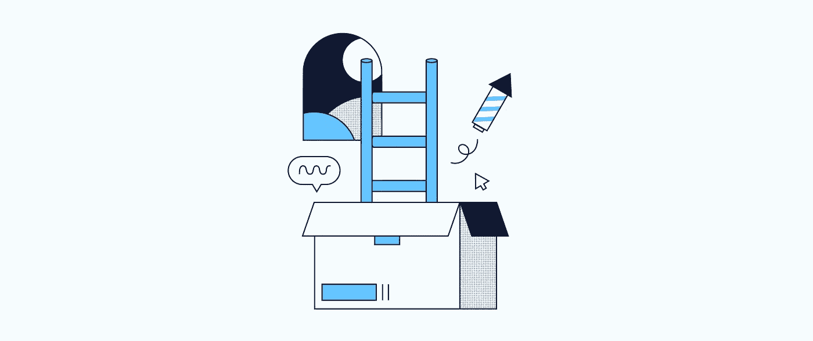
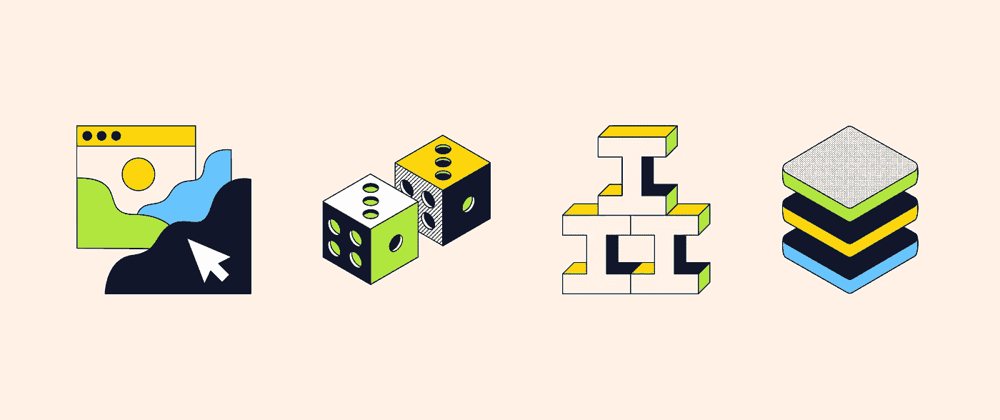
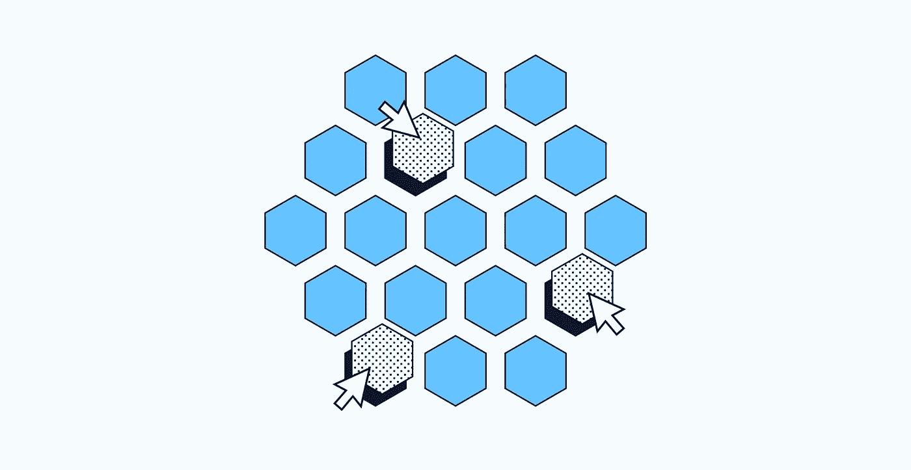
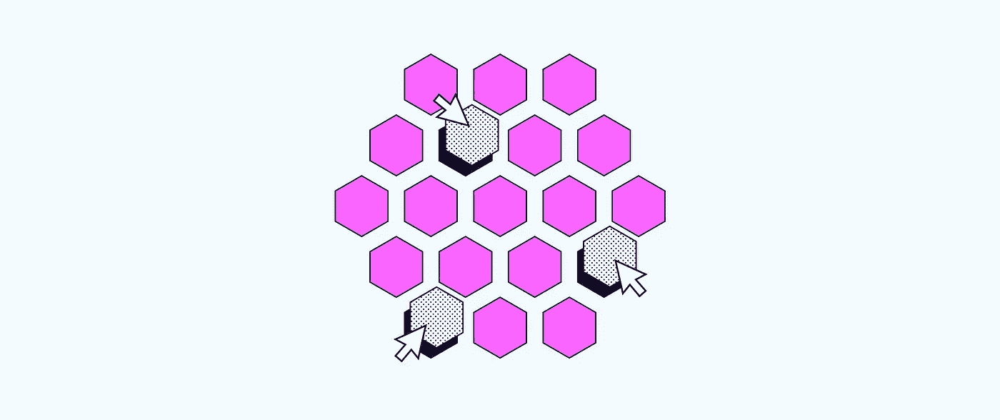
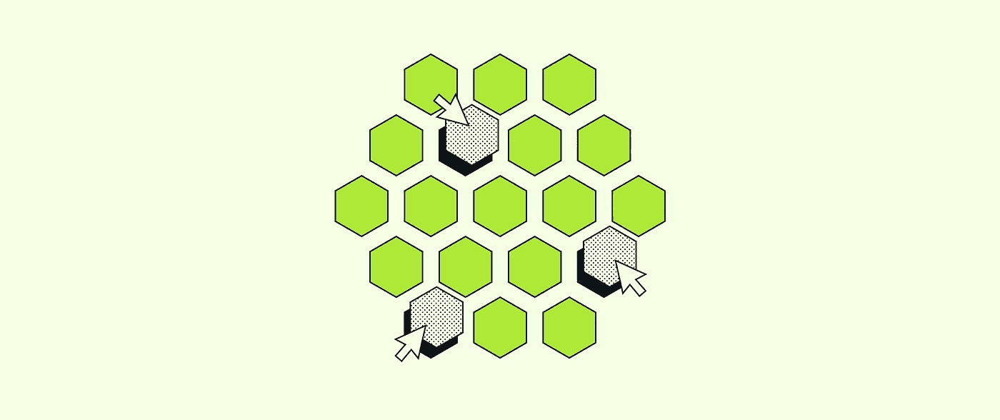
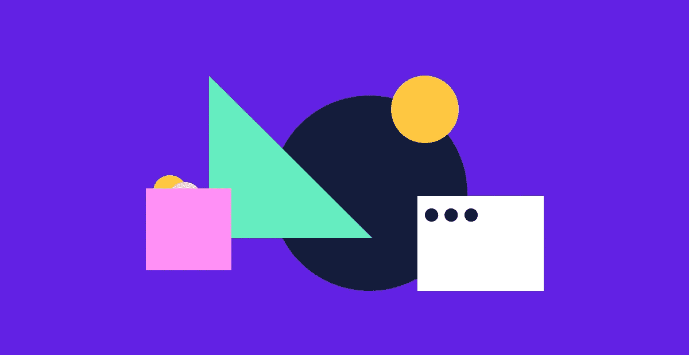

# 2023 年 10 门免费 CodeCademy 课程学习编程和软件开发

> 原文：<https://medium.com/javarevisited/10-best-free-codecademy-courses-for-beginners-to-learn-programming-and-software-development-in-2022-a354e9a2c43e?source=collection_archive---------0----------------------->

## 这些是最好的免费 CodeCademy 在线交互式课程，用于学习 Java、Kotlin、JavaScript、HTML、CSS 和其他按需编程语言和技术。

大家好，如果你正在寻找 2023 年最好的免费 CodeCademy 课程来自学编程和软件开发，那么你来对地方了。

过去，我分享过来自 [Udemy](https://javarevisited.blogspot.com/2017/11/top-5-free-java-courses-for-beginners.html) 、 [Coursera](https://javarevisited.blogspot.com/2021/05/15-free-coursera-courses-to-learn-online.html) 、 [Pluralsight](https://javarevisited.blogspot.com/2017/12/top-10-pluralsight-courses-java-and-web-developers.html) 、 [Educative](https://javarevisited.blogspot.com/2020/01/top-10-free-interactive-online-courses.html) 和其他网站的最佳免费在线课程，在这篇文章中，我将分享*最佳免费代码学院课程*来学习使用 Java、Kotlin、JavaScript、PHP、R、HTML、CSS 和许多其他有用的编程语言进行编程。

所有这些课程都经过了成千上万开发人员的尝试和测试，并且可以在 CodeCademy 上免费获得。它们不仅是交互式的，还会定期更新，向您传授最新的最佳实践和最新信息。

无论你是一名试图学习新技能的学生，还是一名试图学习另一种编程语言并对你的主题有更深入了解的初级开发人员，在线课程都是提高你在任何行业的技能的好方法。

有很多网站你可以用来学习新的东西，但其中很多都是普通人创建的课程和一般主题，如 Udemy，Pluralsight，Skillshare 等。

尽管如此，一个名为 [**Codecademy**](https://bit.ly/codecademyhome) 的网站上有很多由专家创建的与 IT 和编程相关的课程，其中一些课程可以免费入门。本文将向你展示 10 门免费课程，帮助你开始学习新技能。

<https://bit.ly/codecademyhome>  

# 初学者学习编程的 10 个最佳免费 CodeCademy 课程

在不浪费你更多时间的情况下，这里有一个最好的免费 CodeCademy 课程列表，适用于初学者和想要学习编程和使用编程语言进行软件开发的人，例如 [Java](/javarevisited/10-best-places-to-learn-java-online-for-free-ce5e713ab5b2) 、 [SQL](/javarevisited/top-5-sql-and-database-courses-to-learn-online-48424533ac61) 、 [JavaScript](/javarevisited/my-favorite-free-tutorials-and-courses-to-learn-javascript-8f4d0a71faf2) 、 [Kotlin](/javarevisited/top-5-courses-to-learn-kotlin-in-2020-dfc3fa7706d8) 、 [PHP](/javarevisited/10-best-php-courses-for-beginners-and-experienced-developers-db18057a814f) 、 [R](/javarevisited/10-best-r-programming-courses-for-data-science-and-statistics-8f84ebec4974) 、 [Swift](/javarevisited/top-5-online-courses-to-learn-ios-12-swift-in-2019-a35ae1be7b2b) 、 [HTML](/javarevisited/10-best-html-and-css-courses-for-beginners-in-2021-6757eec00032) 、 [CSS](/javarevisited/10-best-css-online-courses-for-beginners-and-experienced-developers-54aa2e8c0253) 和

## 1.[学 Java](https://www.pntrs.com/t/TUJGR0lLR0JHRklJSkhCR0ZISk1N?url=https%3A%2F%2Fwww.codecademy.com%2Flearn%2Flearn-java) 【免费】

Java 是开发人员中最古老和最常用的语言之一，您可以在软件开发、移动应用程序和大型网站中使用它。学习 Java 的基础知识，然后转向面向对象编程和类。

然后学习更多关于类中的高级特性，比如继承和多态以及调试代码。

这里是免费加入这个 Java 课程的链接——[学习 Java](https://www.pntrs.com/t/TUJGR0lLR0JHRklJSkhCR0ZISk1N?url=https%3A%2F%2Fwww.codecademy.com%2Flearn%2Flearn-java)

如果你需要更多的免费资源来学习 Java，那么你也可以看看这些免费学习 Java 编码的最好的网站。

## 2.[学习 SQL](https://www.pntra.com/t/TUJGR0lLR0JHRklJSkhCR0ZISk1N?url=https%3A%2F%2Fwww.codecademy.com%2Flearn%2Flearn-sql) 【免费】

SQL 是在关系数据库中连接数据库、提取数据和过滤数据最常用的语言。首先，学习操作数据，比如访问、创建和更新数据。

然后学习执行 SQL 的复杂查询和函数的强大功能。最后，创建和操作包含多个相关表的数据库。

**这里是免费加入这个 SQL 课程的链接**——[学习 SQL](https://www.pntra.com/t/TUJGR0lLR0JHRklJSkhCR0ZISk1N?url=https%3A%2F%2Fwww.codecademy.com%2Flearn%2Flearn-sql)

而且，如果你需要更多学习 SQL 的免费课程，你也可以看看这个[学习 SQL 的免费课程列表](http://www.java67.com/2018/02/5-free-database-and-sql-query-courses-programmers.html)

## 3.[学习 JavaScript](https://bit.ly/learnjavascriptwithcodecademy) 【免费】

另一种用于创建网站前端和后端的编程语言是 JavaScript。作为初学者开始本课程，您将学习 JavaScript 数据类型、条件语句、循环、函数、迭代器、对象等基础知识。

本课程需要 20 个小时完成，没有任何先决条件。这对于学习 JavaScript 来说已经足够全面了，这也是我学习 JavaScript 的第一门在线课程。

**这里是免费加入这个 JavaScript 课程的链接**——[学习 JavaScript](https://bit.ly/learnjavascriptwithcodecademy)

如果你需要更多的免费资源，你也可以看看 Udemy 和 Coursera 的免费 JavaScript 在线课程列表。

## 4.[学习 HTML](https://www.pjtra.com/t/TUJGR0lLR0JHRklJSkhCR0ZISk1N?url=https%3A%2F%2Fwww.codecademy.com%2Flearn%2Flearn-html) 【免费】

HTML 是各大网站的基础，它给出了前端页面的构造函数。你将学习网站的 HTML 元素和构建模块。然后学习在 HTML 文档中创建表格。

最后，学习创建表单，并将其集成到 HTML 和语义 HTML 标签中。

这里是免费加入这个 HTML 课程的链接— [学习 HTML](https://www.pjtra.com/t/TUJGR0lLR0JHRklJSkhCR0ZISk1N?url=https%3A%2F%2Fwww.codecademy.com%2Flearn%2Flearn-html)

如果你需要更多的免费课程来学习网页开发的 HTML，那么你也可以看看 Udemy 和 Coursera 上的免费 HTML 和 CSS 课程。

## 5.[学习 CSS](https://www.gopjn.com/t/TUJGR0lLR0JHRklJSkhCR0ZISk1N?url=https%3A%2F%2Fwww.codecademy.com%2Flearn%2Flearn-css) 【免费 CodeCademy 课程】

使用 HTML 创建前端网站后，您需要更改文本颜色、添加图像、更改页面布局等等，所有这些都可以使用 CSS 来完成。

本课程将教你用 CSS 设计网站风格，并使用盒子模型定位 HTML 元素，CSS 排版，等等。

**这里是免费加入 CSS 课程的链接**——[学习 CSS](https://www.gopjn.com/t/TUJGR0lLR0JHRklJSkhCR0ZISk1N?url=https%3A%2F%2Fwww.codecademy.com%2Flearn%2Flearn-css)

而且，如果你需要更多的免费课程来学习 CSS 或用于 web 开发的层叠样式表，那么你也可以从 Udemy 查看这些[免费的 CSS 和引导课程](/javarevisited/5-free-html-and-css-courses-to-learn-front-end-web-development-online-8b04517c6ecb)。

## 6.[如何制作一个名字便宜的网站](https://www.gopjn.com/t/TUJGR0lLR0JHRklJSkhCR0ZISk1N?url=https%3A%2F%2Fwww.codecademy.com%2Flearn%2Fmake-a-website)

你可以在一个课程中同时学习 HTML 和 CSS，然后把你的网站上传到 NameCheap 主机上，让每个人都可以在线使用。从学习 HTML 和 CSS 语言开始，这是大多数网站的基础。

然后你会看到 [Bootstrap](https://javarevisited.blogspot.com/2020/07/top-5-courses-to-learn-bootstrap-in.html) 并在 NameCheap 上部署你的网站。

**这里是免费参加这个课程的链接**——[如何用廉价的名字制作一个网站](https://www.gopjn.com/t/TUJGR0lLR0JHRklJSkhCR0ZISk1N?url=https%3A%2F%2Fwww.codecademy.com%2Flearn%2Fmake-a-website)

而且，如果你需要更多网站开发的免费资源，你也可以看看 Udemy 和 Coursera 的免费网站开发课程。

## 7.[学 R](https://www.gopjn.com/t/TUJGR0lLR0JHRklJSkhCR0ZISk1N?url=https%3A%2F%2Fwww.codecademy.com%2Flearn%2Flearn-r) 【免费】

r 语言在统计计算以及数据分析和可视化中被大量使用。学习 R 语言的基础知识，以及如何使用数据框组织/修改数据。

您将学习在使用 ggplot2 包可视化数据之前清理数据。

您还将学习如何对数据进行统计计算，如均值和中值，以及更多主题。

这里是免费加入 R 课程的链接— [学习 R](https://www.gopjn.com/t/TUJGR0lLR0JHRklJSkhCR0ZISk1N?url=https%3A%2F%2Fwww.codecademy.com%2Flearn%2Flearn-r)

而且，如果你需要更多的[免费课程来学习数据科学和统计的 R](https://www.java67.com/2018/09/top-5-free-R-programming-courses-for-Data-Science-Machine-Learning-Programmers.html)，那么你也可以从 Udemy 和 Coursera 查看这些免费的 R 开发课程。

## 8.[学习 PHP](https://www.pntrs.com/t/TUJGR0lLR0JHRklJSkhCR0ZISk1N?url=https%3A%2F%2Fwww.codecademy.com%2Flearn%2Flearn-php) 【免费】

PHP 是一种服务器端脚本语言，用于创建大多数网站的后端。只需要基本的 HTML 知识，您就可以作为初学者开始 CodeCademy 上的免费课程，学习这种语言的变量和基础知识，以使用 HTML 表单和一些高级课程(如类和对象等面向对象编程)进行表单验证。

这里是免费加入这个 PHP 课程的链接——[学习 PHP](https://www.pntrs.com/t/TUJGR0lLR0JHRklJSkhCR0ZISk1N?url=https%3A%2F%2Fwww.codecademy.com%2Flearn%2Flearn-php)

而且，如果你需要更多的免费课程来学习 web 开发的 PHP，那么你也可以从 Udemy 和其他流行的在线学习门户网站查看这些免费的 PHP 和 MySQL 课程。

## 9.[学雨燕](https://www.pntrac.com/t/TUJGR0lLR0JHRklJSkhCR0ZISk1N?url=https%3A%2F%2Fwww.codecademy.com%2Flearn%2Flearn-swift)【免费】

Swift 是一种强大的语言，如果你打算为 iOS、macOS 或任何苹果设备创建应用程序，你需要学习这种语言。像任何编程语言一样，您将开始理解它的基础知识，如变量、数据类型、逻辑运算符、循环等等。

然后，您将学习如何编写函数并与之交互，以及如何在代码中使用类。

**这里是免费参加该 Swift 课程的链接** — [学习 Swift](https://www.pntrac.com/t/TUJGR0lLR0JHRklJSkhCR0ZISk1N?url=https%3A%2F%2Fwww.codecademy.com%2Flearn%2Flearn-swift) [

此外，如果你需要更多的免费课程来学习 Swift 用于 iOS 应用开发，那么你也可以从 Udemy 和 Pluralsight 查看这些免费的 iOS 和 Swift 课程。

## 10.[学习科特林](https://www.pntrac.com/t/TUJGR0lLR0JHRklJSkhCR0ZISk1N?url=https%3A%2F%2Fwww.codecademy.com%2Flearn%2Flearn-kotlin)【免费】

Kotlin 是一种由 JetBrains 开发的表达性编程语言和开源语言，它被大量用于为 Android 系统和 web 开发创建移动应用程序。

从学习数据类型和变量、条件表达式、集合、循环开始。然后，您将学习更高级的主题，即创建和使用您的函数，以及使用面向对象的编程，如类。

这里是免费加入这个*科特林*课程的链接——[学习科特林](https://www.pntrac.com/t/TUJGR0lLR0JHRklJSkhCR0ZISk1N?url=https%3A%2F%2Fwww.codecademy.com%2Flearn%2Flearn-kotlin)

而且，如果你需要更多的免费课程来学习 Kotlin 后端开发或 Android 应用程序开发，那么你也可以查看 Udemy 和 Coursera 的这些免费 Kotlin 编程课程。

以上就是 2023 年学习编程和开发的最好的**免费 CodeCademy 课程。CodeCademy 是一个学习任何与 IT 行业相关的东西的绝佳场所，比如数据科学、web 开发、机器学习、数据可视化，以及超出你预期的东西。尽管如此，上面的列表是免费的课程，你可以通过这些课程开始你的编程语言之旅。**

顺便说一句，如果你喜欢 CodeCademy 平台，那么你也可以加入[**CodeCademy PRO**](https://bit.ly/codecademypro)，这是一个面向程序员的高级订阅。它的年费大约是每月 15.99 美元，提供所有 CodeCademy 的内容、课程、测验和项目。你可以用这个来赚取、练习&应用工作技能。

<https://bit.ly/codecademypro>  

有时他们还提供年度计划 40%的折扣，所以这是开始你编程生涯的最佳时机。您可以使用 code **GETHIRED** 获得 CodeCademy pro 订阅的 40%折扣，或者您可以单击嵌入了代码的链接。如果你是学生，你也可以以 35%的价格获得 CodeCademy PRO。

其他针对初学者的免费编程资源

*   [学习 Python 的免费课程](https://hackernoon.com/10-free-python-programming-courses-for-beginners-to-learn-online-38312f3b9912)
*   [学习算法的免费课程](https://hackernoon.com/10-free-data-structure-and-algorithm-courses-junior-developers-should-explore-978b72871af5)
*   [免费课程学习 C++](https://hackernoon.com/top-5-free-c-courses-to-learn-programming-in-2019-d27352277da0)
*   [学习 Linux 的免费课程](http://www.java67.com/2018/02/5-free-linux-unix-courses-for-programmers-learn-online.html)
*   [学习区块链的免费课程](http://www.java67.com/2018/02/5-free-blockchain-technology-courses.html)
*   [我最喜欢的免费课程学习 TypeScript](/javarevisited/top-10-free-typescript-courses-to-learn-online-best-of-lot-44bce9da41d1)
*   [13 门面向初学者的免费 JavaScript 课程](/javarevisited/12-free-courses-to-learn-javascript-and-es6-for-beginners-and-experienced-developers-aa35874c9a32)
*   [面向开发者的 7 门免费区块链课程](/javarevisited/7-free-courses-to-learn-blockchain-in-2020-764e66b47ebe)
*   [学习 Web 开发的免费课程](http://www.java67.com/2018/03/top-5-free-courses-to-learn-web-development.html)
*   [免费学习棱角分明的课程](http://www.java67.com/2018/01/top-5-free-angular-js-online-courses-for-web-developers.html)
*   [免费课程学习 React JS](http://www.java67.com/2018/02/5-free-react-courses-for-web-developers.html)
*   [学习 OOP 的免费课程](http://www.java67.com/2018/02/5-free-object-oriented-programming-online-courses.html)
*   [学习 Java 的免费课程](http://www.java67.com/2018/08/top-10-free-java-courses-for-beginners-experienced-developers.html)
*   [学习 HTML 和 CSS 的免费课程](http://www.java67.com/2018/02/5-free-html-and-css-courses-to-learn-web-development.html)
*   [学习数据结构和算法的免费课程](http://www.java67.com/2019/02/top-10-free-algorithms-and-data.html)
*   [学习 Nodejs 的免费课程](https://www.java67.com/2019/07/top-5-free-nodejs-courses-for-web-development.html)
*   [学习 Git 和 Github 的免费课程](https://javarevisited.blogspot.com/2018/01/5-free-git-courses-for-programmers-to-learn-online.html)
*   [免费课程学习 Bash](https://www.java67.com/2019/04/top-5-free-course-to-learn-bash-shell-scripting-linux.html)

感谢您阅读本文。如果你喜欢这些*最好的面向初学者的免费 CodeCademy 编程和开发课程*，那么请将它们分享给你的朋友和同事。如果您有任何问题或反馈，请留言。

**P. S. —** 如果你还在寻找更多的资源，你也可以看看我关于 [**21 个免费学习代码的网站**](https://hackernoon.com/21-websites-to-learn-programming-for-free-5101c1ddf0c) 的帖子，里面有很多资源可以找到书籍、课程之类的优质免费编程资源。

<https://www.java67.com/2018/06/21-websites-to-learn-how-to-code-for.html> 