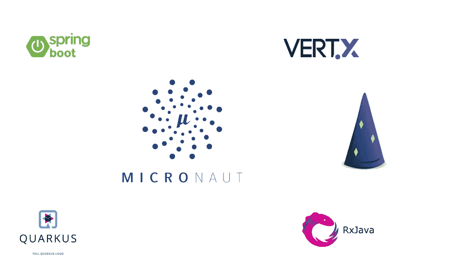
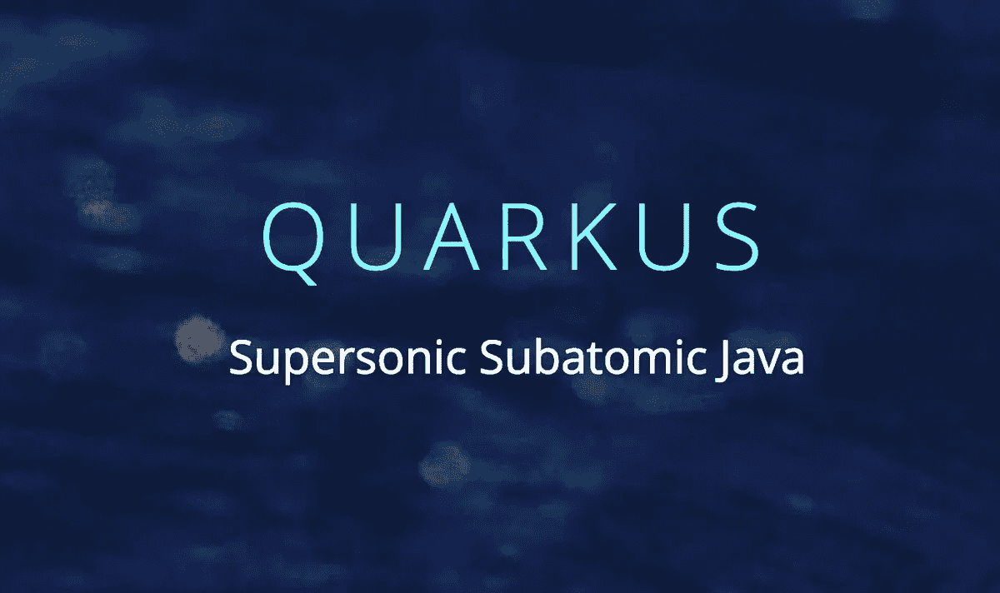
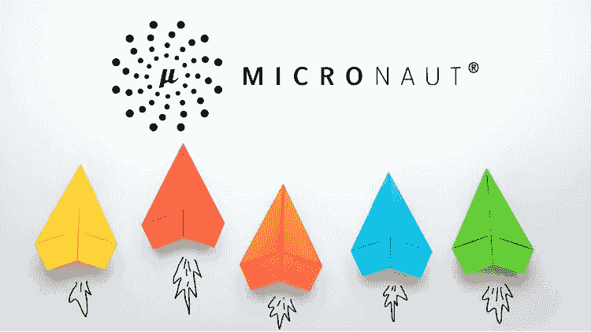
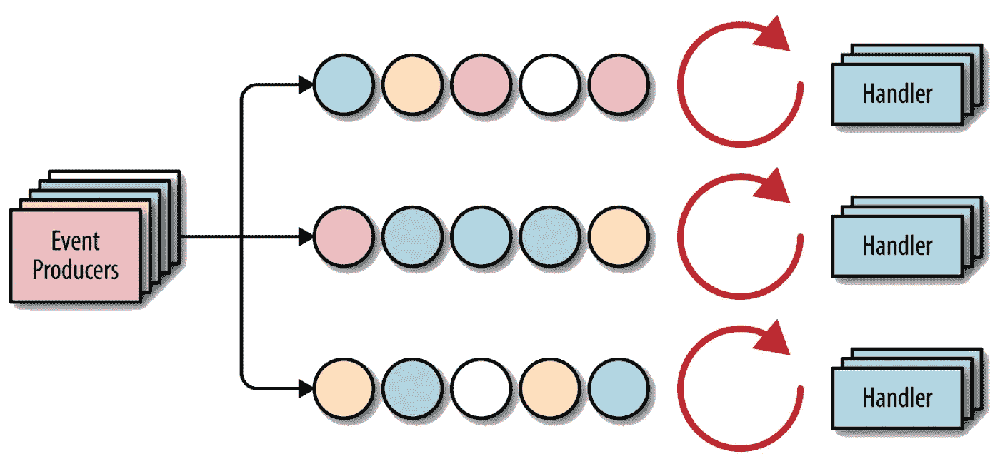
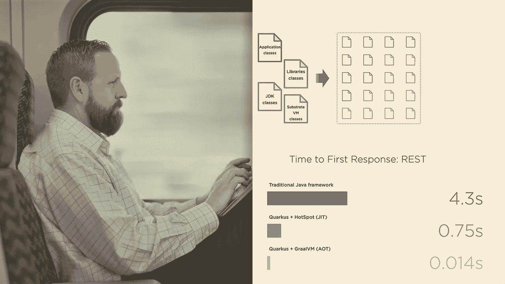
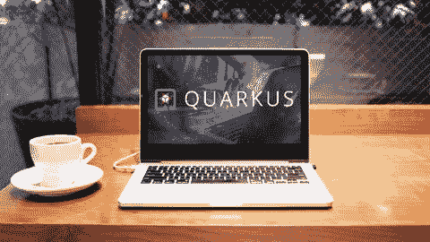

# 2023 年学习 Quarkus、DropWizard、Vert.x 和 MicroNaut 的 10 个最佳课程

> 原文：<https://medium.com/javarevisited/10-best-free-dropwizard-vert-x-micronaut-and-quarkus-online-courses-for-java-developers-9c2b4161f17?source=collection_archive---------0----------------------->

## 我最喜欢的免费和最好的在线课程，学习前沿的 Java 微服务框架，如来自 Udemy、Pluralsight 和 YouTube 的 DropWizard、MicroNaut、Vert.x 和 Quarkus

如果你正在用 Java 创建微服务，并且想要探索像 DropWizard、MicroNaut、Vert.x 和 *Quarkus* 这样的框架，那么你来对地方了。过去我曾与 Spring Boot 和春云 **、**分享过 [**最佳微服务课程，今天我将分享学习 Dropwizard、Vert.x、Quarkus、Micronauts 的最佳在线课程。

在线服务现在正在主宰世界，我们无法想象没有它们的生活，例如社交媒体和购物，但创建这种服务是如此复杂和复杂，这就是为什么开发人员建立了一个称为微服务架构的模型。**](/javarevisited/10-best-java-microservices-courses-with-spring-boot-and-spring-cloud-6d04556bdfed) **[微服务](/javarevisited/top-5-courses-to-learn-microservices-in-java-and-spring-framework-e9fed1ba804d)是当今的流行语，基本上是在单个单元中创建您的软件，而不是在一个大的应用程序中开发整个服务，这在以后很难编辑以及其他缺点，所以他们将它们分成这些小单元，并使用 API 相互连接。

出于这个原因，许多开发人员已经创建了可以帮助非常容易地构建这些微服务的框架，例如 **Dropwizard** ，这是一个用于开发高性能 restful web 服务的 [Java 框架](https://javarevisited.blogspot.com/2018/04/top-5-java-frameworks-to-learn-in-2018_27.html)，以及许多其他类似的框架，例如 Micronaunt、来自 Eclipse 的 Vert.x 以及 Quarks，本文将向您展示如何非常容易地使用这些框架。**

顺便说一句，如果你是一个 Spring boot 粉丝，如果你想使用 Spring Boot 和 Spring Cloud 学习微服务开发，那么我强烈推荐你在 Udemy 上查看 Ranga Karnam 的[**Master micro services with Spring Boot 和 Spring Cloud 课程**](https://click.linksynergy.com/fs-bin/click?id=JVFxdTr9V80&subid=0&offerid=323058.1&type=10&tmpid=14538&RD_PARM1=https%3A%2F%2Fwww.udemy.com%2Fmicroservices-with-spring-boot-and-spring-cloud%2F) 。这是我最喜欢的为 Java 开发人员学习微服务的课程，非常实用和循序渐进的方法使学习变得容易。

 [## 借助 Spring Boot 和春云掌握微服务

### 你想学习用 Spring Boot 构建一个惊人的 REST API 吗？你想知道关于…的大肆宣传吗

udemy.com](https://click.linksynergy.com/fs-bin/click?id=JVFxdTr9V80&subid=0&offerid=323058.1&type=10&tmpid=14538&RD_PARM1=https%3A%2F%2Fwww.udemy.com%2Fmicroservices-with-spring-boot-and-spring-cloud%2F) 

这些是你可以获得的最好的在线课程和教程，以学习这些用于构建云原生应用的现代 [Java 框架](/javarevisited/top-5-frameworks-java-developers-can-learn-for-microservices-development-in-2022-848da66d6651)和 [*微服务*](https://javarevisited.blogspot.com/2019/09/top-5-courses-to-learn-soa-service-oriented-architecture-microservices.html) 。

不幸的是，没有太多的在线课程可以用来学习像 [Quarkus](https://www.java67.com/2022/02/top-5-courses-to-learn-quarkus.html) 和 [MicroNaut](https://javarevisited.blogspot.com/2021/07/top-java-frameworks-for-Microservice-development.html) 这样的框架，但是 API 文档和指南也非常有用，除了这些课程，你也可以阅读它们。

# 2023 年在线学习的 10 门最佳 DropWizard、Vert.x、MicroNaut 和 Quarkus 课程

在不浪费你更多时间的情况下，这里列出了 Udemy 和 YouTube 上的最佳在线教程和课程，供你在 2023 年学习[drowizard](https://www.dropwizard.io/en/latest/)、 [Vert.x、](https://vertx.io/)、 MicroNaut 和 [Quarkus](https://quarkus.io/) 。Udemy 课程 非常实惠，你只需花 10 美元就能买到，而 YouTube 课程完全免费观看。

## 1.[使用 Java 和 GraalVM 进行 Quarkus 后端开发](https://click.linksynergy.com/deeplink?id=JVFxdTr9V80&mid=39197&murl=https%3A%2F%2Fwww.udemy.com%2Fcourse%2Fquarkus-backend-development-java%2F)

如果你想在 2023 年学习 Quarkus，并寻找最好的在线课程，那么这个课程就是为你准备的。在本课程中，讲师 Dmytro Chaban 将教您如何使用 Quarkus 构建云原生 Java 后端应用。

这是学习 Quarkus 的综合课程之一，Quarkus 是微服务和云原生开发的领先 Java 框架，超过 16.5 小时的内容，您将深入学习 quar kus。这门课程分为 10 个部分，每个部分都深入探讨了一个特定的主题。

用 Quarkus 开发 Java 应用程序既快又有趣。Quarkus、 [Java](/javarevisited/10-books-java-developers-should-read-in-2020-e6222f25cc72) 、GraalVM、 [Docker](/javarevisited/top-15-online-courses-to-learn-docker-kubernetes-and-aws-for-fullstack-developers-and-devops-d8cc4f16e773) 、 [Kubernetes](/javarevisited/7-free-online-courses-to-learn-kubernetes-in-2020-3b8a68ec7abc) 和 [JPA](/javarevisited/top-5-hibernate-online-training-courses-for-beginners-and-advance-java-programmers-469460596b2b) 的组合让它变得更加有趣。将它部署到云上更有趣。

以下是你将在本课程中学到的东西-

*   用于服务器端开发的 Quarkus 框架基础
*   如何用 Quarkus 创建 REST API
*   如何使用 [Hibernate](/javarevisited/top-5-books-to-learn-hibernate-for-java-developers-b2cb4b16ccd6?source=---------14------------------) ， [JPA](https://javarevisited.blogspot.com/2018/01/top-5-hibernate-and-jpa-courses-for-java-programmers-learn-online.html) ，Websockets with Quarkus
*   如何用 Quarkus 记录端点
*   反应式方法
*   如何使用 Swagger、开放 API 和 Quarkus 简化的文档
*   RDBMS， [NO-SQL](https://javarevisited.blogspot.com/2019/03/top-5-nosql-database-web-developers-should-learn.html#ixzz64aBvbXQ4) with Quarkus
*   使用 Quarkus 发送消息
*   Quarkus 的后端安全性
*   云， [Kubernetes](https://javarevisited.blogspot.com/2020/06/top-5-courses-to-learn-kubernetes-for-devops-and-certification.html) ，有夸库的土著形象
*   如何将 [Kotlin](/javarevisited/top-5-courses-to-learn-kotlin-in-2020-dfc3fa7706d8) 与 Quarkus 一起使用

总的来说，这是一个从零开始学习夸夸其谈的好课程。许多例子都遵循官方的 Quarkus how-to 指南，但是在这个过程中你会得到很好的解释。如果你需要一个实践课程，那么这是给你的。

**这是加入本课程的链接**——[用 Java 和 GraalVM 进行 Quarkus 后端开发](https://click.linksynergy.com/deeplink?id=JVFxdTr9V80&mid=39197&murl=https%3A%2F%2Fwww.udemy.com%2Fcourse%2Fquarkus-backend-development-java%2F)

## 2.[用 Java 学习 Micronaut —云原生微服务](https://click.linksynergy.com/deeplink?id=JVFxdTr9V80&mid=39197&murl=https%3A%2F%2Fwww.udemy.com%2Fcourse%2Flearn-micronaut%2F)

Micronaut 是另一个现代的、基于 JVM 的全栈框架，用于构建模块化的、易于测试的微服务和无服务器应用程序。如果你想从头开始学习 MicroNaut，这个课程非常适合你。

使用 Micronaut 构建云原生应用程序的速度会让您大吃一惊。本课程从基础开始，逐节深入到越来越多的细节。

以下是本课程涵盖的内容:

*   依赖注入和应用程序配置
*   龙目岛一体化
*   创建 REST APIs &使用开放 API / Swagger
*   自定义 REST API 客户端
*   JWT 认证，JDBC 认证
*   使用[PostgreSQL](/javarevisited/7-best-free-postgresql-courses-for-beginners-to-learn-in-2021-3bf369d73794)&[MySQL](/javarevisited/top-5-courses-to-learn-mysql-in-2020-4ffada70656f)进行 Micronaut 数据访问
*   与[阿帕奇卡夫卡](/javarevisited/top-10-apache-kafka-online-training-courses-and-certifications-621f3c13b38c)的信息传递
*   如何使用 Web 套接字
*   构建 GraalVM 本机映像
*   如何使用 Redis、 [MongoDB](/javarevisited/5-best-mongodb-courses-to-learn-nosql-for-beginners-in-2020-42df5af5496c?source=---------13----------------------------) 、ElasticSearch 等集成

简而言之，深入学习 MicroNaut 的*最佳在线课程之一*。您不仅会学到 MicroNaut 的基础知识，还会学到高级功能，如与 Kafka 和 Redis 等的集成。它还涵盖了编写测试的内容，这将帮助您开始使用 Micronaut。

**以下是加入本 MicroNaut 课程的链接** — [学习 micro naut——使用 Java 的云原生微服务](https://click.linksynergy.com/deeplink?id=JVFxdTr9V80&mid=39197&murl=https%3A%2F%2Fwww.udemy.com%2Fcourse%2Flearn-micronaut%2F)

## 3.【Dropwizard 入门

这是学习 Dropwizard 的最佳在线课程之一，drop wizard 是一个现代 Java 框架，用于开发 ops 友好、高性能、RESTFul web 服务。

在本课程中，您将了解关于 [REST 技术](/javarevisited/10-best-java-web-services-rest-soap-and-api-courses-for-beginners-724a8f51298d)及其工作原理的介绍，然后学习如何使用 Dropwizard 框架并设置其环境，以及创建一些简单的项目，如注册认证、配置 HTTPS、数据库迁移和连接数据库等。以下是你将在本课程中学到的东西:

*   创建数据库后端。
*   使用数据库迁移。
*   保护您的 API 认证。

**这里是加入本课程的链接**——[drowizard 入门](https://click.linksynergy.com/deeplink?id=JVFxdTr9V80&mid=39197&murl=https%3A%2F%2Fwww.udemy.com%2Fcourse%2Fgetting-started-with-dropwizard%2F)

## 4.[用 Java 学习 Vert.x —反应式微服务](https://click.linksynergy.com/deeplink?id=JVFxdTr9V80&mid=39197&murl=https%3A%2F%2Fwww.udemy.com%2Fcourse%2Freactive-web-applications-with-vertx-and-vuejs%2F)

如果你不知道的话， **Vert.x** 是另一个领先的构建反应式微服务的 Java 框架。这是来自 Eclipse 开发者的一个开源的、反应式的、多语言的框架。

如果你想学习 Vert.x 来构建[反应式微服务](/javarevisited/7-best-webflux-and-reactive-spring-boot-courses-for-java-programmers-33b7c6fa8995)和云原生应用，那么这个课程就是为你准备的。本课程由丹尼尔·普林茨创建，将教你如何使用 **Vert.x 工具包构建一个**响应式** **web 应用**。**

9.5 小时的课程从 Vert.x 的核心功能开始，在整个课程中，您将学习越来越多的 Vert.x 模块。课程也很动手，有很多编码的例子。

如果你需要一个实践课程来学习 Vert.x 和反应式编程，这个课程就是为你准备的。

**以下是加入本课程的链接—** [学习 Vert.x —使用 Java 的反应式微服务](https://click.linksynergy.com/deeplink?id=JVFxdTr9V80&mid=39197&murl=https%3A%2F%2Fwww.udemy.com%2Fcourse%2Freactive-web-applications-with-vertx-and-vuejs%2F)

## 5.[用 Java 完成微服务](https://click.linksynergy.com/deeplink?id=JVFxdTr9V80&mid=39197&murl=https%3A%2F%2Fwww.udemy.com%2Fcourse%2Fgetting-started-with-microservices-from-zero-to-production%2F)

另一个很棒的课程是教你如何使用 DropWizard 框架来创建微服务并将它们部署到不同的环境中，但是要求你对 java 编程语言以及 [MySQL 数据库](https://javarevisited.blogspot.com/2018/05/top-5-mysql-courses-to-learn-online.html)技术有一个基本的了解。

从微服务的一些概念开始，然后安装环境并使用 DropWizard 框架创建一些项目，如 Rest 位置资源和数据访问层，以及实现插入新位置和 [Docker](https://javarevisited.blogspot.com/2019/05/top-5-courses-to-learn-docker-and-kubernetes-for-devops.html) 和 [Kubernete](https://javarevisited.blogspot.com/2020/06/top-5-courses-to-learn-kubernetes-for-devops-and-certification.html) s 等技术。

您将在本课程中学到以下内容:

*   使用 DropWizard 框架。
*   使用这个框架创建数据库后端。
*   学习 Docker 和 Kubernetes。

**以下是加入本课程的链接**—[Java 微服务大全](https://click.linksynergy.com/deeplink?id=JVFxdTr9V80&mid=39197&murl=https%3A%2F%2Fwww.udemy.com%2Fcourse%2Fgetting-started-with-microservices-from-zero-to-production%2F)

## 6.安东尼奥·冈萨尔维斯的《夸库斯:基本面》

Quarkus 据说是一个超音速亚原子 Java 工具包。但这意味着什么呢？本课程回答了你可能会对 quarkus 提出的所有问题，比如 Quarkus 是什么，它做什么，它来自哪里，它解决什么目的，这样你就可以决定它是否适合你的项目。

这个课程是由安东尼奥·冈克拉维斯创建的，他不需要任何介绍。参加过他的 Java EE 和 [JPA 课程](https://pluralsight.pxf.io/c/1193463/424552/7490?u=https%3A%2F%2Fwww.pluralsight.com%2Fcourses%2Fjava-persistence-api-21)后，当他在 Twitter 上宣布这个课程时，我非常兴奋，我一点也不失望。

首先，您将发现它的内部架构、工作原理以及它带来的技术优势，然后您将学习如何引导 Quarkus 应用程序在 [Docker 容器](https://javarevisited.blogspot.com/2022/05/docker-interview-questions-answers-for.html)上运行。

最后，您将了解 Quarkus 的优缺点，发现其庞大的生态系统，以及它与其他框架相比的方式。完成本课程后，您将具备决定 Quarkus 是否适合您的下一个 Java 项目所需的知识。

**这里是加入本课程的链接**——[夸尔库斯:基础](https://pluralsight.pxf.io/c/1193463/424552/7490?u=https%3A%2F%2Fwww.pluralsight.com%2Fcourses%2Fquarkus-fundamentals)

顺便说一下，你需要一个 [**Pluralsight 会员**](https://pluralsight.pxf.io/c/1193463/424552/7490?u=https%3A%2F%2Fwww.pluralsight.com%2Flearn) 才能加入这个课程，费用大约是每月 29 美元或每年 299 美元(14%的折扣)。

我向所有程序员强烈推荐这个订阅，因为它提供了超过 7000 个在线课程的即时访问，以学习任何技术技能。或者，你也可以使用他们的 [**10 天免费通行证**](https://pluralsight.pxf.io/c/1193463/424552/7490?u=https%3A%2F%2Fwww.pluralsight.com%2Flearn) 免费观看这门课程。

 [## 对个人来说

### 无论你想进入一个新的领域，改善你的角色，还是把你的伟大想法变成现实，Pluralsight…

pluralsight.pxf.io](https://pluralsight.pxf.io/c/1193463/424552/7490?u=https%3A%2F%2Fwww.pluralsight.com%2Flearn) 

## 7.[micro naut 简介【免费课程](https://www.youtube.com/watch?v=RtjSqRZ_md4)

现在，让我们离开 Udemy 上的付费课程，观看一些 YouTube 视频，帮助您了解可用于创建微服务的另一个框架，其中一个框架名为 Micronaut，它是一个 java 虚拟机框架，用于在 [Java](/javarevisited/10-best-places-to-learn-java-online-for-free-ce5e713ab5b2) 、 [Kotlin](/javarevisited/top-5-courses-to-learn-kotlin-in-2020-dfc3fa7706d8) 或 [Groovy](/javarevisited/6-best-resources-to-learn-groovy-and-grails-for-java-developers-18c04e88fa8a) 中创建微服务。

这段 youtube 视频由 [Micronaut 框架](https://micronaut.io/)本身的创建者 Graeme Rocher 介绍，并在本次会议上告诉您 java 和软件普遍面临的挑战，以及[微服务](https://www.java67.com/2021/02/microservices-interview-questions-answers-java-spring.html)和[无服务器](/javarevisited/7-best-serverless-and-aws-lambda-courses-to-learn-in-2021-de1820111c85)之间的一些比较

你可以在这里或 Youtube 上观看免费的 MicroNaut 课程:

## 8.[micro naut 轻量级微服务介绍](https://www.youtube.com/watch?v=BL9SsY5orkA)【免费】

另一个了解 Micronaut 轻量级微服务的 YouTube 视频是这个框架的创建者 Graeme Rocher 举办的会议，展示了这个 Micronaut Java 框架的新版本以及这次更新中的新内容。

作者讲述了他的框架在开发高质量微服务方面的优势，以及一些功能，如可以用 10MB 运行的小进程 [java 堆](https://www.java67.com/2020/09/how-to-increasing-heap-size-in-java.html)，以及依赖注入和 cloud-native，他还将演示该框架如何通过 AOT 将您的微服务提升到下一个级别等等。

你可以在这里免费观看这个 MicroNaut 教程—

## 9.Quarkus:超音速、亚原子 Java[免费教程]

一个很好的 YouTube 视频向您展示了另一个用于创建称为 Quarkus 的微服务的伟大框架，这是一个专门为 java 虚拟机制作的 java 框架，被认为是一个有效的平台，适用于[无服务器](/javarevisited/7-best-serverless-and-aws-lambda-courses-to-learn-in-2021-de1820111c85)以及其他平台，如 [Kubernetes](https://javarevisited.blogspot.com/2019/01/top-5-free-kubernetes-courses-for-DevOps-Engineer.html) 。

这段 YouTube 视频展示了 [Quarkus 框架](https://quarkus.io/)的优势及其工作原理，并向您展示了使用该 java 框架优化 java 应用程序、API 和微服务的优势，使它们变得更小、更快、更多。

你可以在这里免费观看这个教程:

## 10. [2023 Quarkus 基础—1 小时入门指南](https://click.linksynergy.com/deeplink?id=JVFxdTr9V80&mid=39197&murl=https%3A%2F%2Fwww.udemy.com%2Fcourse%2Fquarkus-get-started%2F)

Quarkus 是另一个有前途的 Java 框架。据预测，这将是 2023 年的下一件大事。这是一个非常好的理由，它是高性能的，易于设置，并且基于 kubernetes-native。

如果你正在寻找一个夸夸其谈的速成班，在那里你可以通过快速建造东西来学习夸夸其谈，那么这个 [Udemy 课程](/javarevisited/15-best-udemy-courses-programmers-can-buy-on-black-friday-and-cyber-monday-2020-a803874f41d9)就是为你准备的。2023 夸尔库斯基础课程将通过构建 3 个夸尔库斯应用程序在 1 小时内教会你夸尔库斯。

这是一个非常短的课程，有 1 小时的内容和 5 篇文章，但它涵盖了非常重要的基本概念。以下是本课程涵盖的内容:

1.  如何与夸库斯合作
2.  用 Quarkus 进行反应式编程
3.  用 Quarkus 编写 API

**这里是加入本次夸尔库斯速成班的链接** e — [2023 夸尔库斯基础](https://click.linksynergy.com/deeplink?id=JVFxdTr9V80&mid=39197&murl=https%3A%2F%2Fwww.udemy.com%2Fcourse%2Fquarkus-get-started%2F)

以上是学习 Dropwizard、Quarkus 和 MicroNaut 微服务开发框架的**最佳在线课程。**这些是开发前沿、云原生和反应式微服务的最佳和现代 Java 框架。

微服务技术发展更快，开发人员正在考虑在他们的应用程序中使用它们，因为它使创建和开发变得非常容易，创建它们的最佳框架之一是本文中讨论的 DropWizard、Micronaut、Vert.x 和 Quarks。

其他**编程资源文章**你可能喜欢探索

*   [面向 Java 开发者的 5 门免费 Spring 框架课程](http://www.java67.com/2017/11/top-5-free-core-spring-mvc-courses-learn-online.html)
*   [与 Spring Boot 一起学习微服务的 5 大课程](/javarevisited/top-5-courses-to-learn-microservices-in-java-and-spring-framework-e9fed1ba804d)
*   [2023 年学习 Web 开发的 5 门课程](http://javarevisited.blogspot.sg/2018/02/top-5-online-courses-to-learn-web-development.html#axzz57wed1PWd)
*   [初学者学习 Spring 的 10 门免费课程](/javarevisited/top-10-free-courses-to-learn-spring-framework-for-java-developers-639db9348d25)
*   [2023 年学习 React Native 的 5 门课程](http://javarevisited.blogspot.sg/2018/02/5-react-native-courses-to-learn-mobile-development-using-JavaScript.html)
*   [初学者学习 Spring MVC 的 5 门最佳课程](https://javarevisited.blogspot.com/2020/08/top-5-courses-to-learn-spring-mvc-for.html)
*   [5 门免费学习核心 Java 的在线课程](http://javarevisited.blogspot.sg/2017/11/top-5-free-java-courses-for-beginners.html#axzz4zuIICRs9)
*   [面向 Java 程序员的 10 门高级 Spring Boot 课程](/javarevisited/10-advanced-spring-boot-courses-for-experienced-java-developers-5e57606816bd?source=collection_home---4------0-----------------------)
*   [面向有经验的 Java 开发人员的 5 大 Java 设计模式课程](http://javarevisited.blogspot.sg/2018/02/top-5-java-design-pattern-courses-for-developers.html)
*   [学习大数据和 Apache Spark 的 5 门课程](http://javarevisited.blogspot.com/2017/12/top-5-courses-to-learn-big-data-and.html)
*   [深入学习 Spring 的 10 门最佳课程](/javarevisited/10-best-online-courses-to-learn-spring-framework-in-2020-f7f73599c2fd)
*   [破解编码面试的 5 个必备技巧](https://javarevisited.blogspot.com/2020/04/5-essential-skills-to-crack-coding-interviews.html)
*   [编程/编码工作面试 10 门课程](http://javarevisited.blogspot.sg/2018/02/10-courses-to-prepare-for-programming-job-interviews.html)
*   [IT 专业人士学习写邮件的 5 门课程](http://javarevisited.blogspot.sg/2018/02/top-5-professional-email-writing-courses-for-programmers.html)
*   [前 5 名 Selenium with Java Web 驱动程序课程](http://javarevisited.blogspot.sg/2018/02/top-5-selenium-webdriver-with-java-courses-for-testers.html)
*   每个 Java 开发人员都应该学习的 5 个基本框架
*   [学习 learn Shell 脚本的 5 门课程](http://javarevisited.blogspot.sg/2018/02/5-courses-to-learn-shell-scripting-in-linux.html)
*   [10 个面向 Java 开发人员的免费 Spring Boot 教程和课程](/javarevisited/10-free-spring-boot-tutorials-and-courses-for-java-developers-53dfe084587e)

感谢您阅读本文。如果你喜欢这些*最佳 DropWizard、Micronaut 和 Quarks 在线课程*，那么请与你的朋友和同事分享。如果您有任何问题或反馈，请留言。

**P. S.** —如果你想用 Spring Boot 和 Spring Cloud 学习微服务开发，那么我强烈推荐你去 Udemy 上看看 Ranga 的 [**Master 微服务与 Spring Boot 和 Spring Cloud 课程**](https://click.linksynergy.com/fs-bin/click?id=JVFxdTr9V80&subid=0&offerid=323058.1&type=10&tmpid=14538&RD_PARM1=https%3A%2F%2Fwww.udemy.com%2Fmicroservices-with-spring-boot-and-spring-cloud%2F) 。这是学习 Java 微服务的 Spring Boot 和 Spring Cloud 的最佳实践课程之一。超过 9 万人已经从中受益。

 [## 借助 Spring Boot 和春云掌握微服务

### 你想学习用 Spring Boot 构建一个惊人的 REST API 吗？你想知道关于…的大肆宣传吗

udemy.com](https://click.linksynergy.com/fs-bin/click?id=JVFxdTr9V80&subid=0&offerid=323058.1&type=10&tmpid=14538&RD_PARM1=https%3A%2F%2Fwww.udemy.com%2Fmicroservices-with-spring-boot-and-spring-cloud%2F)