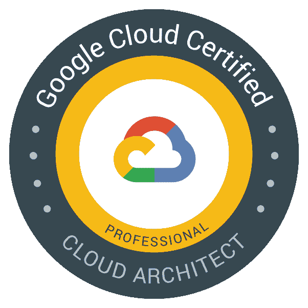
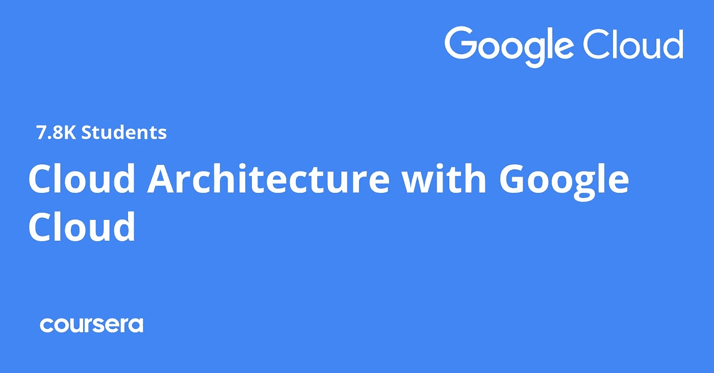
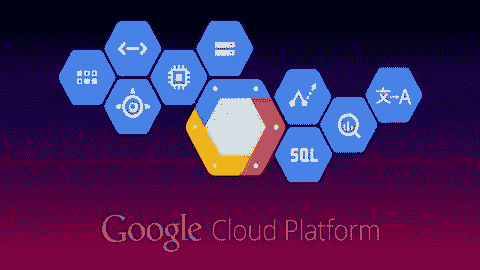
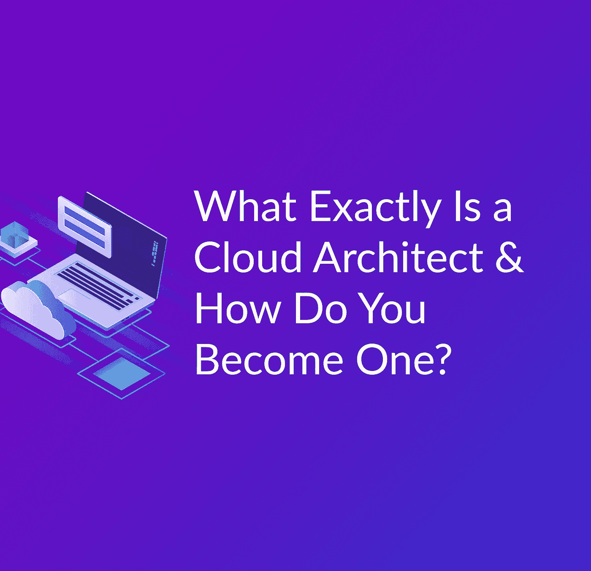
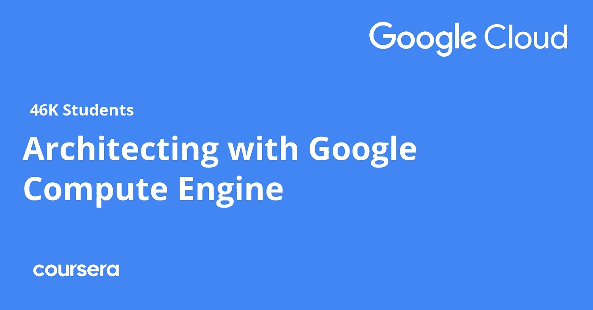
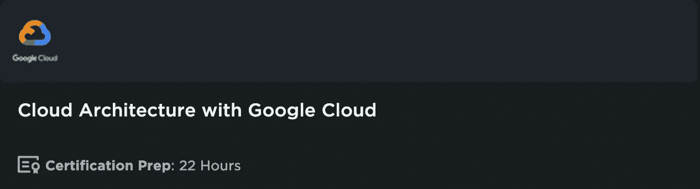
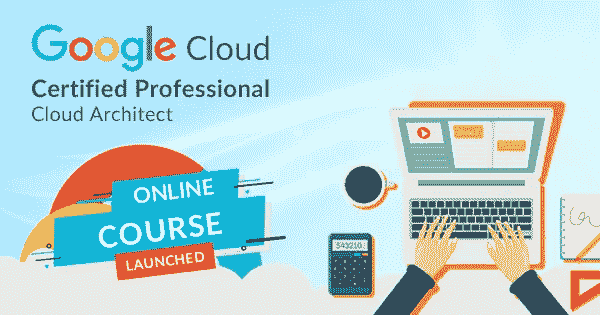
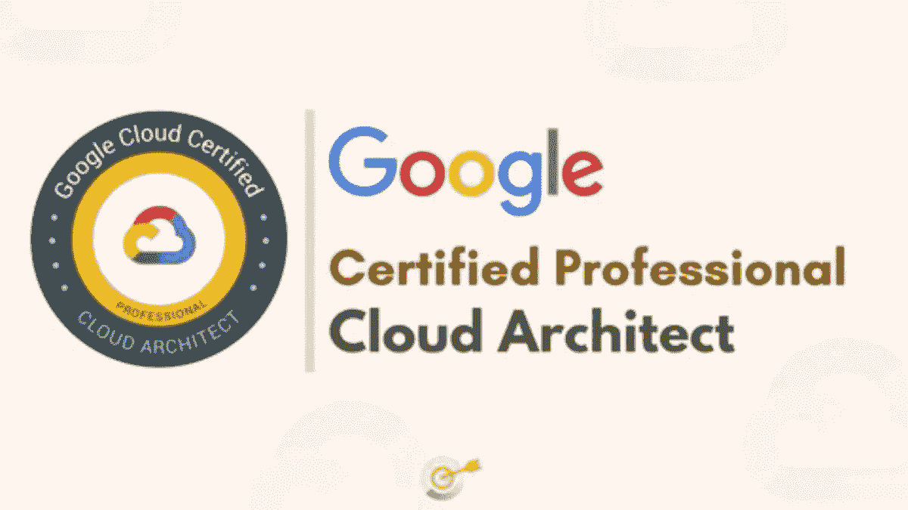

# 10 个最佳免费谷歌云专业架构师认证课程和实践测试[2023]

> 原文：<https://medium.com/javarevisited/10-best-free-google-cloud-professional-architect-certification-courses-practice-tests-943e75f03929?source=collection_archive---------0----------------------->

## 来自 Udemy 和 Coursera 的免费和最佳在线课程和实践测试的集合，用于准备 Google Cloud Professional Cloud Architect 认证考试

大家好，如果你正在准备 2023 年的**谷歌云专业架构师认证考试，并寻找免费和最好的在线培训课程，那么你来对地方了。**

过去，我已经分享了学习谷歌云的[最佳课程，以及通过](/javarevisited/5-best-courses-to-learn-google-cloud-platform-gcp-in-2021-169093a3771a)[云工程师](/javarevisited/5-best-gcp-associate-cloud-engineer-certification-courses-in-2021-c93d7e35228a)、[数据工程师](/javarevisited/8-free-google-cloud-data-engineer-certification-courses-and-practice-tests-594f31643b58)和[云开发人员](/javarevisited/my-favorite-free-google-cloud-platform-gcp-professional-cloud-developer-certification-courses-856ef69a56bb)认证的认证课程，今天，我将为初学者和有经验的云专业人士分享免费的 GCP 云架构师认证课程。

这是最难和最负盛名的考试之一，类似于 [AWS 解决方案架构师](/javarevisited/how-to-prepare-for-aws-solution-architect-associate-certification-saa-c01-saa-c02-exam-in-2021-a6e7e7e771fc)和 [Azure 技术架构师(AZ-300)](https://javarevisited.blogspot.com/2020/04/how-to-crack-microsoft-azure-solution-architect-exam-az-300.html) 考试，一旦你通过了这个考试，你将拥有足够的知识和技能来提出一个基于谷歌云的解决方案，这是一个非常抢手的技能。

云产业是这个时代快速发展的 IT 产业之一。很快，它将成为有史以来顶尖的 it 产业之一。如果你打算在 IT 行业发展，那么云计算可能是一个非常适合你的领域。

说到[云计算](https://javarevisited.blogspot.com/2019/07/top-5-online-courses-to-learn-cloud-computing-aws.html)，首先映入我们脑海的名字是谷歌云平台，比如 GCP。未来几年，行业对云专家的需求会很大。你必须准备一个这样的认证考试。

在本指南中，我将分享 10 门免费的、最好的在线课程和实践测试，以便以优异的成绩通过 [GCP 云架构师考试](https://cloud.google.com/certification/cloud-architect)。一旦你成为认证专家，你就可以以实习生的身份开始你的职业生涯，之后你就可以开始你在云计算领域的全职工作。

除此之外，在云计算中，薪酬规模不是一个问题；大多数公司都提供高薪和不同的定期激励。

现在，让我们直接跳到 GCP 云架构师考试的免费在线课程列表上。

顺便说一下，如果你真的想成为一名认证的谷歌云架构师，那么我也建议你加入 Udemy 上的 [**终极谷歌认证专业云架构师 2023**](https://click.linksynergy.com/deeplink?id=JVFxdTr9V80&mid=39197&murl=https%3A%2F%2Fwww.udemy.com%2Fcourse%2Fgoogle-cloud-architect-certifications%2F) 课程。它不是免费的，但它是通过这个著名的谷歌云认证的最佳课程，它是由谷歌云平台本身创建的。

 [## 谷歌专业云架构师认证

### 超过 25300 多名学生回应说，他们通过了认证，因为这个课程！成功 40.5 万+…

udemy.com](https://click.linksynergy.com/deeplink?id=JVFxdTr9V80&mid=39197&murl=https%3A%2F%2Fwww.udemy.com%2Fcourse%2Fgoogle-cloud-architect-certifications%2F) 

# 2023 年通过 GCP 专业云架构师认证考试的 10 门免费最佳课程

在这个列表中，有几门课程是相互关联的。因此，您必须参加一系列课程，以完成 GCP 云架构师考试的准备工作。除此之外，其他课程都是独立的，你可以根据自己的选择来决定。

## 1.[终极谷歌认证专业云架构师 2023](https://click.linksynergy.com/deeplink?id=JVFxdTr9V80&mid=39197&murl=https%3A%2F%2Fwww.udemy.com%2Fcourse%2Fgoogle-cloud-architect-certifications%2F)

这个课程包括 30 天的退款保证，所以它是一个安全的赌注。如果你不喜欢这门课程，那么你可以放弃它，把钱退还给你。它的评级是 4.2；大约有 64，280 名学生注册，由谷歌云平台大师创建。它有英语、意大利语和波兰语版本。

如果您对谷歌云平台知之甚少，那么本课程非常适合您，因为它提供了关于谷歌云平台的非常详细的解释，这是通过这项久负盛名的谷歌云认证所必需的。

课程由谷歌平台大师打造，拥有超过 24 小时的优质内容，让学员深入了解谷歌云平台。

您不仅会了解谷歌云计算服务，如虚拟机(GCE)、应用引擎(GAE)、容器服务(GKE)、谷歌云功能，还会了解其他基本的 GCP 服务，如 IAM 以及安全、网络、管理和监控工具。

**以下是加入本课程的链接**——[2023 年谷歌认证专业云架构师终极课程](https://click.linksynergy.com/deeplink?id=JVFxdTr9V80&mid=39197&murl=https%3A%2F%2Fwww.udemy.com%2Fcourse%2Fgoogle-cloud-architect-certifications%2F)

总的来说，这是一门为*Google Cloud Professional Architect certification*做准备的很棒的综合课程，这门课程最棒的一点是，你只需花 10 美元就可以在 Udemy sales 上购买，这种活动时有发生。

## 2.[拥有 Google Cloud 专业证书的云架构](https://coursera.pxf.io/c/3294490/1164545/14726?u=https%3A%2F%2Fwww.coursera.org%2Fprofessional-certificates%2Fgcp-cloud-architect)

这是由谷歌云培训团队自己创建的 Coursera 课程，它是专门为打算参加 GCP 云架构师考试的考生设计的？

到目前为止，已有超过 4 万名学生注册了该课程，它包含六门不同的子课程，将向您传授与 GCP 云架构师考试相关的每一个概念。除此之外，在本课程中，教师将举例说明 GCP 仪表板中各种元素的实施。

在您注册本课程之前，您必须知道这是一个为期 3 个月的视频课程，在本课程中，您将被分配到需要按照讲师给出的截止日期完成的作业和任务。

如果你正在寻找一门既能教你概念，同时又能帮助你实践这些概念的课程，那么这门课程是你的最佳选择。这门课程现在也可以打五折。

**以下是加入本认证课程**——[云架构与谷歌云专业证书](https://coursera.pxf.io/c/3294490/1164545/14726?u=https%3A%2F%2Fwww.coursera.org%2Fprofessional-certificates%2Fgcp-cloud-architect)的链接

## 3.[谷歌云概念](https://click.linksynergy.com/deeplink?id=JVFxdTr9V80&mid=39197&murl=https%3A%2F%2Fwww.udemy.com%2Fcourse%2Flinux-academy-google-cloud-concepts%2F)【Udemy 免费课程】

一旦你完成了入门课程，那么是时候转向我们正在准备的特定平台了，这个 Udemy 课程将教你与谷歌云平台相关的每一分钟的细节。

在这个 1 小时 16 分钟长的视频课程中，来自 Linux Academy 的讲师将教你云计算的基础知识，什么是 google cloud，以及为什么它比其他任何云计算平台都好。

在本课程中，您还将了解 GCP 的各种安全方面，以及与在其上部署应用程序相关的不同概念。

但是在报读这门课之前，你必须知道这门课是专门为初学者设计的。如果你正在寻找一个专家级的信息，那么你必须避开这个课程，参加这里列出的其他课程。

**这是加入这个免费课程的链接**——[谷歌云概念](https://click.linksynergy.com/deeplink?id=JVFxdTr9V80&mid=39197&murl=https%3A%2F%2Fwww.udemy.com%2Fcourse%2Flinux-academy-google-cloud-concepts%2F)

## 4.[云架构师—专业认证准备](https://coursera.pxf.io/c/3294490/1164545/14726?u=https%3A%2F%2Fwww.coursera.org%2Flearn%2Fpreparing-cloud-professional-cloud-architect-exam)课程

如果您正在寻找一步到位的解决方案，那么本课程就是为您准备的。这是 Coursera 上提供的一门 13 小时的课程。在本课程中，您将了解与您的认证考试相关的 Google 云平台的不同组件。

本课程也是 [**备考谷歌云认证:云架构师职业证书**](https://coursera.pxf.io/c/3294490/1164545/14726?u=https%3A%2F%2Fwww.coursera.org%2Fprofessional-certificates%2Fgcp-cloud-architect) 的一部分。

到目前为止，超过 4000 名学生注册了这门课程，它的评分为 4.5 星(满分为 5 星)。从安全性到部署，每个主题都借助适当的插图和图形进行了详细解释。

你不会后悔报读这门课程，这门课程的每一秒都值得你花时间。因此，如果你正在寻找一个深入和实用的方法为基础的课程，那么这是一个完美的选择。

**这里是加入本课程** — [云架构师—专业认证准备](https://coursera.pxf.io/c/3294490/1164545/14726?u=https%3A%2F%2Fwww.coursera.org%2Flearn%2Fpreparing-cloud-professional-cloud-architect-exam)的链接

## 5.[云计算入门](https://click.linksynergy.com/deeplink?id=JVFxdTr9V80&mid=39197&murl=https%3A%2F%2Fwww.udemy.com%2Fcourse%2Fintroduction-to-cloud-computing%2F)【Udemy 免费课程】

首先，既然是刚开始准备这个考试，那么打好基础是必不可少的。这门课程将帮助你建立一个坚实的基础，从这个基础上，了解 GCP 对你来说不成问题。

这个课程可以在 Udemy 上找到，它是由 Xavier Corbett 创建的。在本课程中，讲师非常巧妙地使用了图形和 gif。这些图形使本课程相对容易理解，因为我们在这里谈论的是基础知识，因此需要适当的插图。同样，讲师也已经注意到了这一点。

在这个长达 1 小时的课程中，您将了解与云计算相关的每一个基本信息和每一分钟的信息。一旦你完成了这门课程，你就可以很容易地参加云计算相关工作的初级面试。

**这里是加入这个免费课程的链接**——[云计算简介](https://click.linksynergy.com/deeplink?id=JVFxdTr9V80&mid=39197&murl=https%3A%2F%2Fwww.udemy.com%2Fcourse%2Fintroduction-to-cloud-computing%2F)

## 6.[使用谷歌计算引擎专业化进行架构设计](https://coursera.pxf.io/c/3294490/1164545/14726?u=https%3A%2F%2Fwww.coursera.org%2Fspecializations%2Fgcp-architecture)【Coursera】

另一个 Coursera 课程也是由谷歌云培训团队创建的。这门课程与上面那门课程的主要区别在于它是一门相对较短的课程。

在本课程中，首先，讲师将向您介绍与 GCP 云架构师考试相关的每个概念，然后您将被分配一个项目。

一旦你成功地完成了任务，作为奖励，你将获得一份结业证书。像每一门 Coursera 课程一样，在这里你也必须做一个实时项目。

总的来说，如果您全心全意地完成了本课程，那么您就不需要任何其他资源来准备 GCP 云架构师考试了。

**这是加入本课程** — [谷歌计算引擎专业化](https://coursera.pxf.io/c/3294490/1164545/14726?u=https%3A%2F%2Fwww.coursera.org%2Fspecializations%2Fgcp-architecture)的链接

顺便说一下，如果你计划参加多个 Coursera 课程或专业，那么考虑参加 [**Coursera Plus 订阅**](https://coursera.pxf.io/c/3294490/1164545/14726?u=https%3A%2F%2Fwww.coursera.org%2Fspecializations%2Fgcp-architecture) ，它将为你提供无限制的访问他们最受欢迎的课程、专业、专业证书和指导项目的机会。它每年花费大约 399 美元，但是它完全物有所值，因为你可以获得无限的证书

 [## 使用谷歌计算引擎进行架构设计

### 开启您在云架构领域的职业生涯。设计、开发和管理云解决方案以推动业务目标。87%…

coursera.pxf.io](https://coursera.pxf.io/c/3294490/1164545/14726?u=https%3A%2F%2Fwww.coursera.org%2Fspecializations%2Fgcp-architecture) 

## 7.[准备专业云架构师考试— Pluralsight](https://pluralsight.pxf.io/c/1193463/424552/7490?u=https%3A%2F%2Fwww.pluralsight.com%2Fcourses%2Fpreparing-google-cloud-professional-cloud-architect-exam-update)

虽然大多数课程都假设您对 Google 云平台架构有一定的了解，但本课程会首先检查您的理解程度，然后为您提供更多关于考试的信息。

该课程可以看作是谷歌云架构的详细地图。你可以用它来绘制你自己最快的考试路线。但不用担心，课程会帮助你区分你知道的和你不知道的。还有活动跟踪挑战实验室，帮助你测试你的能力发展到什么程度。

抛开课程名称不谈，这门课程不仅仅是一个考试指南。它给你真正的实用技能，如开发建议的解决方案，认知技能，如案例分析，并确定技术观察点。这门课还有一堆带答案的模拟考试，这样你就知道自己对考试的准备程度了。

**以下是加入本专题讲座的链接** — [准备专业云架构师考试](https://pluralsight.pxf.io/c/1193463/424552/7490?u=https%3A%2F%2Fwww.pluralsight.com%2Fcourses%2Fpreparing-google-cloud-professional-cloud-architect-exam-update)

顺便说一句，你需要 Pluralsight 会员资格才能参加这个课程，费用为每月 29 美元或每年 299 美元，有 14%的折扣。该会员资格还让您可以访问更多的在线课程和测验。或者，你也可以参加他们的 [**10 天免费试用期**](https://pluralsight.pxf.io/c/1193463/424552/7490?u=https%3A%2F%2Fwww.pluralsight.com%2Flearn) 来免费参加这个课程。

 [## 个人技术技能|多视角

### 借助 Pluralsight，在开发运维、机器学习、云、安全基础设施等领域构建所需的技能…

pluralsight.pxf.io](https://pluralsight.pxf.io/c/1193463/424552/7490?u=https%3A%2F%2Fwww.pluralsight.com%2Flearn) 

## [8。谷歌云认证专家—架构师—训练营](https://click.linksynergy.com/deeplink?id=JVFxdTr9V80&mid=39197&murl=https%3A%2F%2Fwww.udemy.com%2Fcourse%2Fgoogle-cloud-certified-professional-architect-bootcamp%2F)

你喜欢新兵训练营吗？因为我知道，尤其是对开发人员来说。如果你是一个新兵训练营的爱好者，那么这个课程将非常适合你。就像大多数真实的新兵训练营一样，这个课程压力很大，但是它试图激发出你最好的一面。本课程将帮助您准备谷歌云平台架构师考试。它在 [Udemy](/javarevisited/10-best-udemy-online-courses-for-java-developers-4c9ab70cd01f) 上的学生评分为 4.0，有 4256 名学生注册。它是由约瑟夫·霍尔布鲁克(云技术专家)创建的。它有英语、意大利语和波兰语版本。

它还提供了一个总结或回顾来检查是否每个人都跟上了速度，所以不用担心；你不会被落下的。本课程涵盖了通过谷歌云平台架构师考试所需的一切。

作者承认，[谷歌云专业架构师考试](https://www.java67.com/2020/09/5-free-courses-to-pass-google-cloud-professional-architect-certification.html)并不是一成不变的，也没有写得清晰简洁，因为一个问题有很多方法。它试图涵盖这些方法中的大部分，以便学生可以去与他们认为最合意的。

最重要的要求是对谷歌云平台的了解，比如熟悉 GCP 控制台。

**以下是参加本课程的链接** — [谷歌云认证专家—架构师—训练营](https://click.linksynergy.com/deeplink?id=JVFxdTr9V80&mid=39197&murl=https%3A%2F%2Fwww.udemy.com%2Fcourse%2Fgoogle-cloud-certified-professional-architect-bootcamp%2F)

## 9 [Google Cloud 专业云架构师实践测试— Whizlabs](https://click.linksynergy.com/deeplink?id=JVFxdTr9V80&mid=39197&murl=https%3A%2F%2Fwww.udemy.com%2Fcourse%2Fgoogle-cloud-certified-professional-cloud-architect-practice-test%2F)

最后，最后但并非最不重要的是 GCP 建筑师实践测试。这门课程的学生评分为 4.3，有 1，756 名学生注册，由 Whizlabs 学习中心创建。这是为数不多的不需要任何[谷歌云平台](https://www.java67.com/2020/07/5-free-courses-to-learn-google-cloud-platform-and-concepts.html)先验知识的专业谷歌云平台架构师课程。

附带 150 道练习题。您可能已经了解到，本课程的重点不是帮助您获得 Google 云平台架构师的工作技能，而是通过 Google 云平台架构师考试。

如果你是一名 [AWS 解决方案架构师](https://javarevisited.blogspot.com/2019/08/how-to-crack-aws-certified-solution-architect-exam.html)、[微软 Azure 架构师](https://javarevisited.blogspot.com/2020/04/how-to-crack-microsoft-azure-solution-architect-exam-az-300.html)，或者一名[云开发人员](https://www.java67.com/2020/09/5-free-courses-to-pass-google-cloud-developer-certification.html)，想要了解谷歌云平台或者亚马逊、谷歌云平台、Azure 或任何其他的客户，那么参加这个模拟测试，你会喜欢它的。

**以下是加入本次实践测试的链接** t — [Google Cloud 专业云架构师实践测试](https://click.linksynergy.com/deeplink?id=JVFxdTr9V80&mid=39197&murl=https%3A%2F%2Fwww.udemy.com%2Fcourse%2Fgoogle-cloud-certified-professional-cloud-architect-practice-test%2F)

## 10.[谷歌认证专业云架构师实践测试](https://click.linksynergy.com/deeplink?id=JVFxdTr9V80&mid=39197&murl=https%3A%2F%2Fwww.udemy.com%2Fcourse%2Fgcp-pca-practice-tests-latest%2F)

这是你可以在 Udemy 上进行的另一个奇妙的实践测试，为谷歌云架构师认证做准备。本课程包含 152 个高质量的问题，将像真正的考试一样测试您的技能。

这些实践考试中的所有问题和答案都经过精心策划和更新，以适应 2023 年专业云架构师认证考试。每个问题都有详细的解释，为什么一个选项是正确的，为什么其他选项是错误的。

这些模拟测试中涵盖的场景以及这里问题的广度和复杂性表明了你在真实考试中所看到的内容。鉴于云认证的流动性，讲师还会定期更新本课程，以纳入新的最新内容。

**这里是加入这个测试的链接** — [谷歌认证专家云架构师实践测试](https://click.linksynergy.com/deeplink?id=JVFxdTr9V80&mid=39197&murl=https%3A%2F%2Fwww.udemy.com%2Fcourse%2Fgcp-pca-practice-tests-latest%2F)

## 11. [GCP:完整的谷歌数据工程师和云架构师指南](https://click.linksynergy.com/deeplink?id=JVFxdTr9V80&mid=39197&murl=https%3A%2F%2Fwww.udemy.com%2Fcourse%2Fgcp-data-engineer-and-cloud-architect%2F)

这是您可以参加的另一门在线课程，为云架构师认证做准备。这为谷歌云平台提供了一个真正全面的指南——它有大约 25 小时的内容和大约 60 个演示。

以下是您将在本课程中学到的内容

*   **计算和存储** — AppEngine、容器工程师(又名 Kubernetes)和计算引擎
*   **大数据和托管 Hadoop** — Dataproc、数据流、大表、大查询、发布/订阅
*   **云上的 tensor flow**——到底什么是神经网络和深度学习，神经元是如何工作的，神经网络是如何训练的。
*   **DevOps stuff** — StackDriver 日志记录、监控、云部署管理器
*   **安全性** —身份和访问管理、身份感知代理、OAuth、API 密钥、服务帐户
*   **组网** —虚拟私有云、共享 VPCs、网络负载均衡、传输层和 HTTP 层；VPN、云互联和 CDN 互联
*   **Hadoop 基础:**快速浏览开源兄弟(Hadoop、Spark、Pig、Hive 和 HBase)

**这里是加入本课程的链接**——[GCP:完整的谷歌数据工程师和云架构师指南](https://click.linksynergy.com/deeplink?id=JVFxdTr9V80&mid=39197&murl=https%3A%2F%2Fwww.udemy.com%2Fcourse%2Fgcp-data-engineer-and-cloud-architect%2F)

以上就是 2023 年通过谷歌云专业架构师认证的**最佳在线课程。**在本指南中，您已经了解了通过 GCP 专业云架构师认证考试的五门最佳免费课程。

一旦你完成了这些课程，如果时间允许的话，建议你注册 GCP，并尝试将你在这些课程中学到的概念付诸实践。

实践概念会帮助你理解谷歌云平台的每一个小细节。

你可能喜欢的其他云计算和 IT 认证资源

*   [通过 Azure 开发人员助理认证(AZ-203)的 5 门在线课程](https://javarevisited.blogspot.com/2020/06/top-5-course-to-crack-Microsoft-Azure-Developer-Certification-Exam-AZ-203.html)
*   [破解 AWS 解决方案架构师认证的 5 大课程](https://javarevisited.blogspot.com/2019/05/top-5-courses-to-crack-aws-solutions-architect-associate-certification-exam-SAA-C01.html#axzz5rHwAwycj)
*   [10 门免费课程学习数据结构和算法](http://www.java67.com/2019/02/top-10-free-algorithms-and-data.html)
*   [微软 Azure 基础知识五大模拟测试](https://javarevisited.blogspot.com/2020/02/top-5-AZ-900-exam-Azure-Fundamentals-certification-practice-tests-and-mock-exams-to.html)
*   [如何破解 2023 年 AZ-103 Azure 行政考试](https://javarevisited.blogspot.com/2020/04/how-to-crack-microsoft-az-103-azure-administrator-associate-exam-certification.html)
*   [破解 Azure 开发者助理考试的前 5 门课程](https://javarevisited.blogspot.com/2020/06/top-5-course-to-crack-Microsoft-Azure-Developer-Certification-Exam-AZ-203.html)
*   [如何破解 AWS 解决方案架构师考试](https://javarevisited.blogspot.com/2019/08/how-to-crack-aws-certified-solution-architect-exam.html)
*   [学习微软 Azure 概念的 5 门免费课程](https://www.java67.com/2020/07/5-free-courses-to-learn-microsoft-azure-cloud.html)
*   [如何在 2023 年成为 Azure 解决方案架构师助理](https://javarevisited.blogspot.com/2020/04/how-to-crack-microsoft-azure-solution-architect-exam-az-300.html)
*   [通过 Azure 云架构考试的前 5 门课程](https://javarevisited.blogspot.com/2019/07/top-5-courses-to-crack-azure-architecture-technologies-certification-az-300-exam.html)
*   [2023 年通过 AZ-900 认证的前 5 名课程](https://javarevisited.blogspot.com/2020/02/top-5-courses-to-crack-az-900-microsoft-azure-fundamentals-certification-exam.html)
*   [程序员前 5 名 AZ-900 模拟测试](https://javarevisited.blogspot.com/2020/02/top-5-AZ-900-exam-Azure-Fundamentals-certification-practice-tests-and-mock-exams-to.html)
*   [通过谷歌助理云工程师认证的前 5 门课程](https://javarevisited.blogspot.com/2019/07/top-5-google-cloud-platform-gcp-courses-certifications-online.html)
*   [破解 Azure 云架构师(AZ-300)考试的前 5 门课程](https://javarevisited.blogspot.com/2019/07/top-5-courses-to-crack-azure-architecture-technologies-certification-az-300-exam.html#axzz6E6VuRMsx)
*   [如何破解 Azure Fundamentals (AZ-900)认证](https://javarevisited.blogspot.com/2020/04/how-to-crack-microsoft-azure-fundamentals-certification-az-900-exam.html)

感谢您阅读本文。如果你觉得这些*免费的谷歌云架构师认证课程*有用，那么，请分享给你的朋友和同事。如果您有任何问题或反馈，请留言。

**【p . s .】**—如果你认真学习谷歌云平台并通过云架构师认证，那么我也建议你参加 Udemy 上的 [**终极谷歌认证专业云架构师 2023**](https://click.linksynergy.com/deeplink?id=JVFxdTr9V80&mid=39197&murl=https%3A%2F%2Fwww.udemy.com%2Fcourse%2Fgoogle-cloud-architect-certifications%2F) 课程。它不是免费的，但它是通过这个著名的谷歌云认证的最佳课程，它是由谷歌云平台本身创建的。

 [## 谷歌专业云架构师认证

### 超过 25300 多名学生回应说，他们通过了认证，因为这个课程！成功 40.5 万+…

udemy.com](https://click.linksynergy.com/deeplink?id=JVFxdTr9V80&mid=39197&murl=https%3A%2F%2Fwww.udemy.com%2Fcourse%2Fgoogle-cloud-architect-certifications%2F)