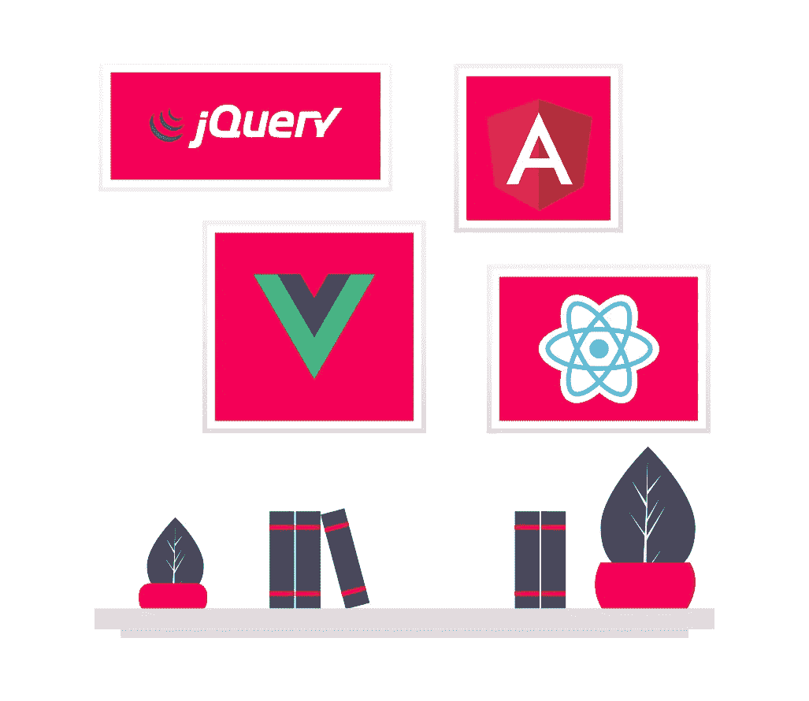
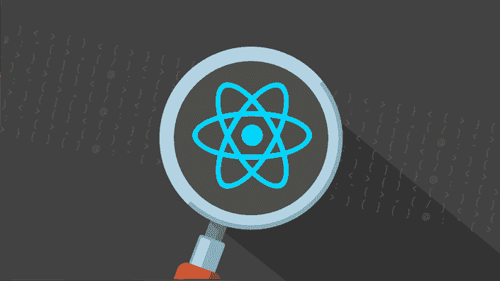
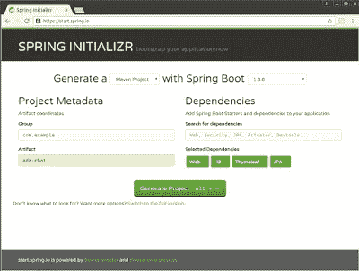
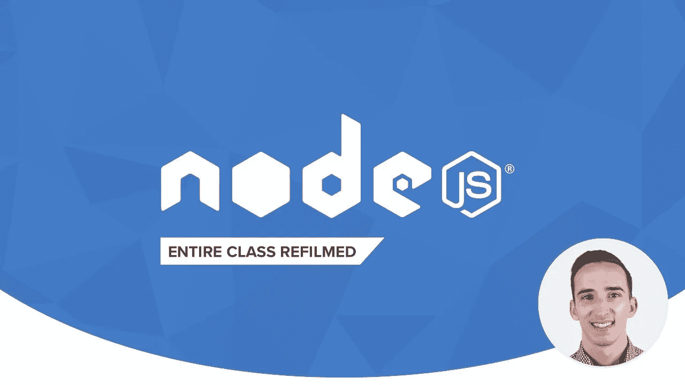
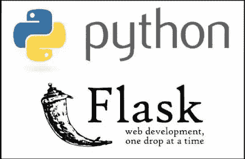
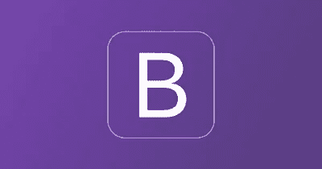
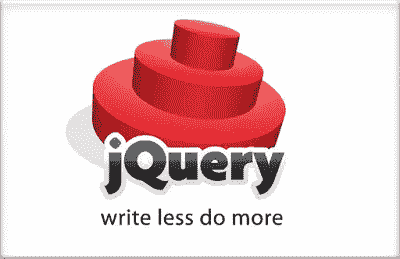

# 2023 年要学习的 10 个最佳前端和后端框架

> 原文：<https://medium.com/javarevisited/10-best-frontend-and-backend-frameworks-for-java-python-ruby-and-javascript-developers-cce3c951787a?source=collection_archive---------0----------------------->

## 这些是 Java、Python、Ruby 和 JavaScript 开发人员在 2023 年可以学习的最好的前端和后端框架和库。

大家好，如果你想成为一名全栈开发者，那么你有很多前端和后端框架的选择。虽然前端框架由 JavaScript 主导，但后端有很多选项来创建服务器端应用程序，如 [Java](/javarevisited/top-5-java-online-courses-for-beginners-best-of-lot-1e1e240a758) 、 [Python](/better-programming/top-5-courses-to-learn-python-in-2018-best-of-lot-26644a99e7ec) 、 [Ruby](/javarevisited/top-5-free-courses-to-learn-ruby-and-rails-for-beginners-best-of-lot-e149fe03c964) ，甚至 [JavaScript](/javarevisited/10-best-online-courses-to-learn-javascript-in-2020-af5ed0801645) 。

技术世界随着技术的快速变化而变化，技术工作也是如此。仅仅知道一门[技术](http://www.java67.com/2018/09/10-high-paying-technologies-programmers-can-learn.html)或[编程语言](http://www.java67.com/2017/12/10-programming-languages-to-learn-in.html)就能找到工作，并且在这个职位上不知何故生存了许多年而没有学习新东西的日子已经一去不复返了。

我们中的许多人进入编程和 web 开发世界，只知道一两种技术，如 [Java](https://javarevisited.blogspot.com/2018/05/top-5-java-courses-for-beginners-to-learn-online.html) 、 [C++](http://www.java67.com/2018/02/5-free-cpp-courses-to-learn-programming.html) 或 [JavaScript](https://javarevisited.blogspot.com/2018/06/top-10-courses-to-learn-javascript-in.html) ，但这已经不起作用了。

有几十人的团队在做专门的工作，像[前端开发](https://javarevisited.blogspot.com/2020/01/10-things-web-developers-should-learn.html)由一组独立的开发人员完成，后端由其他程序员编写，通常被称为服务器端开发人员。

在当今竞争激烈的世界中，每个人都在寻找*全栈软件工程师*，也就是说，知道前端和后端技术并能独立工作开发全功能 web 应用程序的人。

如果你看看任何基于互联网的公司的全栈软件工程师工作的职位描述，你会发现全栈软件工程师应该知道前端技术，如 ES-next、Babel、 [React](/@javinpaul/top-5-courses-to-learn-react-js-in-2019-best-of-lot-fa02cd96cdf0) 、 [Redux](https://javarevisited.blogspot.com/2018/08/top-5-react-js-and-redux-courses-to-learn-online.html) 、 [Bootstrap](http://www.java67.com/2018/03/top-5-free-courses-to-learn-web-development.html) 、LESS 等。以及后端技能像 [Python](https://javarevisited.blogspot.com/2018/12/10-free-python-courses-for-programmers.html) 、 [Django](/javarevisited/my-favorite-courses-to-learn-django-for-beginners-2020-ac172e2ab920) 、Graphene ( [GraphQL](/hackernoon/top-5-graphql-courses-for-beginners-26cad52bcd3e) )、REST、 [MySQL](https://javarevisited.blogspot.com/2018/05/top-5-mysql-courses-to-learn-online.html) 、DynamoDB、Redis、 [Docker](https://javarevisited.blogspot.com/2018/02/10-free-docker-container-courses-for-Java-Developers.html) 等。

换句话说，人们的期望值非常高，在过去，只要懂一点 HTML、CSS 和一点 JavaScript 就能成为前端开发人员，但现在不是了，这就是为什么即使你不是这些领域的专家，也必须熟悉不同的技术。

如果你是一名全栈软件工程师或渴望成为全栈软件工程师的人，那么你应该熟悉一些前端和后端 web 开发框架，如 [React](http://www.java67.com/2018/02/5-free-react-courses-for-web-developers.html) 和 [Node](https://javarevisited.blogspot.com/2018/01/top-5-nodejs-and-express-js-online-courses-for-web-developers.html#axzz5VllnxgVT) ，但这也取决于你的背景，如你主要来自 Python 背景还是 Java/JavaScript 背景。

像 [Python 开发者](https://dev.to/javinpaul/7-python-online-courses-for-beginners-and-intermediate-programmers-1h4k)学 Django 比学 [Angular](http://www.java67.com/2018/01/top-5-free-angular-js-online-courses-for-web-developers.html) 受益更大，不如学和自己初级技能兼容的框架。同样，一个 JavaScript 开发者应该学习 React 和 Node JS，而不是学习 Django 和 [Node JS](https://www.java67.com/2019/07/top-5-free-nodejs-courses-for-web-development.html) 。

# 2023 年全栈开发人员的 10 大前端和后端框架

在这篇文章中，我将分享一些最好的和最流行的 web 开发框架，我认为一个全栈开发人员应该熟悉这些框架。

我已经包括了前端和后端框架供您参考。根据你的背景，你可以选择相关的技术来提升你的形象。

## 1.react . js[前端+ JavaScript]

此时此刻，React 或 React.js 是最受 web 开发者欢迎的前端框架。已经超越了团里的老大，Angular，还有 Vue.js 这样的新人，现在越来越多的人在往 React 走。

虽然 React vs 角斗还没有最终定论，但从趋势来看，React 越来越有可能赢得这场史诗般的战争。ReactJS 允许您使用 JavaScript 创建前端，并提供基于组件的开发模型。

如果你主要是 JavaScript 开发者，那么 React JS 应该是你前端开发的首选。如果你正在寻找一个推荐，Max 的 React 完全指南是最好的开始。

如果你正在寻找更多的选择，那么你也应该看看我之前的[2023 年学习 React 的前 5 门课程](https://javarevisited.blogspot.com/2018/08/top-5-react-js-and-redux-courses-to-learn-online.html)，如果你正在寻找一些免费的课程开始，这也是一个不错的主意，你可以在这里找到一些免费的 React 课程。

## 2.Spring Boot[后端+ Java]

Spring Boot 框架试图解决与使用 Spring 进行 Java web 开发相关的问题，就像 Spring 解决与使用 Java EE 或 J2EE 进行 Java web 开发相关的问题一样。

通过引入自动配置和启动器依赖等特性，减轻了 Java 开发人员的痛苦，他们花费大量时间配置 Spring 并找到一组兼容的库来一起工作。

它极大地提高了生产率，因为你现在可以用更少的时间和工作创建一个新的 Java web 项目，但同时，它也有点固执己见。

无论如何，如果你是从事 web 开发项目的 Java 开发人员，并立志成为一名全栈开发人员，那么你应该学习 Spring Boot，没有比从这门 [**Spring & Hibernate for 初学者**](https://click.linksynergy.com/deeplink?id=JVFxdTr9V80&mid=39197&murl=https%3A%2F%2Fwww.udemy.com%2Fcourse%2Fspring-hibernate-tutorial%2F) (包括 Spring Boot)课程开始更好的方法了。

如果你需要更多的选择，你也可以查看我列出的在线学习 Spring boot 的[前 5 门课程](https://javarevisited.blogspot.com/2018/05/top-5-courses-to-learn-spring-boot-in.html)，在那里我也为有经验的开发人员讨论了一些高级课程。

## 3.angular[前端+ JavaScript]

Angular 是另一个流行的 JavaScript 前端，它使得复杂前端的开发更加容易。它实际上是第一个试图用模块和代码结构标准化 JavaScript 前端开发的 JavaScript 框架之一。它允许你编写可测试的代码，就像你在 Java 或其他主流语言中所做的一样。如果您不喜欢反应和寻找选项，那么 Angular 是 JavaScript 开发人员的下一个最佳前端开发框架。

关于学习棱角的课程，有很多课程，网上全是棱角教程和课程。尽管如此，我个人认为 Max 的[**完整的 Angular Guide**](https://click.linksynergy.com/fs-bin/click?id=JVFxdTr9V80&subid=0&offerid=634352.1&type=10&tmpid=14538&RD_PARM1=https%3A%2F%2Fwww.udemy.com%2Fthe-complete-guide-to-angular-2%2F) 课程最令人兴奋和有价值，强烈推荐给任何想深入和快速学习 Angular 的人。

顺便说一句，如果你需要更多的选择，那么你也可以看看我之前列出的全栈 Web 开发人员的 5 门 Angular 2+课程。它包含了从 Udemy 到 Pluralsight 学习 Angular 的一些最好的课程，包括另一位顶级 Angular 导师 Stephen Grider 的课程。

## 4. [Node.js](https://nodejs.org/en/) 【后端+ JavaScript】

这是另一个流行的 JavaScript web 开发框架，但属于后端框架。10 年前，谁曾想过 JavaScript 应该用来编写服务器端代码，但现在看来相当合理。

Node.js 在 StackOverflow 的开发者调查中一直被评为最受欢迎的框架，也是用单一编程语言(即 JavaScript)端到端编写 web 应用的关键。

如果你主要是 JavaScript 开发人员，那么你应该学习 Node。JS 随同 React 或 Angular 成为一名全栈软件工程师，如果你需要一门课程，那么 [**完整的 Node JS 开发者课程**](https://click.linksynergy.com/fs-bin/click?id=JVFxdTr9V80&subid=0&offerid=634352.1&type=10&tmpid=14538&RD_PARM1=https%3A%2F%2Fwww.udemy.com%2Fthe-complete-nodejs-developer-course-2%2F) 是最好的入门课程。

如果你需要更多的选择，那么你也可以看看我之前为全栈开发者列出的 5 大节点 JS 课程清单。

## 5. [Django](https://www.djangoproject.com/) 【前端+后端+ Python】

现在进入 Python 的世界，不用担心；不可怕；相反，这是一个非凡的世界，充满了对 web 开发有用的框架和库。Django 是 web 开发中最流行的 Python 框架。这是一个全栈框架，默认包含所有必要的特性，而不是作为单独的库提供。使用 Django，您将在一个包中获得身份验证、URL 路由、模板引擎、对象关系映射器(ORM)和数据库模式迁移。

如果你是一名 Python 程序员，想成为一名全栈软件工程师，那么你应该学习 Django，没有比加入 Udemy 上的 [**Python 和 Django 全栈 Web 开发者 Bootcamp**](https://click.linksynergy.com/fs-bin/click?id=JVFxdTr9V80&subid=0&offerid=634352.1&type=10&tmpid=14538&RD_PARM1=https%3A%2F%2Fwww.udemy.com%2Fpython-and-django-full-stack-web-developer-bootcamp%2F) 课程更好的开始方式了。

## 6.[烧瓶](https://flask.palletsprojects.com/en/1.1.x/)【后端+ Python】

这是另一个流行的 web 开发 Python 框架。Flask 是一个微框架，因为它不需要任何其他框架或库。它受 Sinatra Ruby 框架的启发，依赖于 Werkzeug WSGI 工具包和 Jinja2 模板。

[Flask](/javarevisited/5-best-python-flask-courses-for-beginners-2f262f8e23da)背后的主要思想是让 web 开发者建立一个坚实的 web 应用基础。从那里，您可以使用您可能需要的任何扩展。再次强调，如果你是 Python 开发者，那么 Flask 是你军械库中的另一个好工具。首先，你可以查看 [**Python 和 Flask Bootcamp**](https://click.linksynergy.com/fs-bin/click?id=JVFxdTr9V80&subid=0&offerid=634352.1&type=10&tmpid=14538&RD_PARM1=https%3A%2F%2Fwww.udemy.com%2Fpython-and-flask-bootcamp-create-websites-using-flask%2F) 在线课程来学习 Flask。

如果你正在寻找一些选择，那么你应该看看我列出的 2023 年学习 Python 的 5 门顶级课程，如果你正在寻找一些免费的东西开始学习 Python，那么我也为你们分享了一份免费的 Python 课程列表。

## 7.[引导](https://getbootstrap.com/)【前端+ CSS】

在过去，CSS 是前端开发人员的主要技能，但在现代 web 开发中，Bootstrap 已经取代了 CSS。几乎没有人使用简单的老式 CSS 来设计他们的网页；相反，他们大多使用 CSS 框架，如 Bootstrap 或 Tailwind 等。

这就是为什么一个全栈软件工程师一定要知道 Bootstrap，没有比加入 [**Bootstrap 4 从零开始带 5 个项目**](https://click.linksynergy.com/fs-bin/click?id=JVFxdTr9V80&subid=0&offerid=634352.1&type=10&tmpid=14538&RD_PARM1=https%3A%2F%2Fwww.udemy.com%2Fbootstrap-4-from-scratch-with-5-projects%2F) 更好的开始方式了。这是我学习 Bootstrap 最好的课程之一。

## 8. [jQuery](https://jquery.com/) 【前端+ JavaScript】

这是另一个令人印象深刻的 JavaScript 库，我认为每个 web 开发人员都应该熟悉它。即使你不是全栈开发人员或者只是参与前端或后端的工作，你也应该学习 jQuery。它非常强大，提供了类似 CSS 的选择器来动态改变一些元素的行为。在过去的几年中，由于其他前端框架的原因，jQuery 的受欢迎程度有所下降，但我仍然认为它是一个很棒的工具，一个全栈软件工程师应该知道这一点。

如果你对学习 jQuery 感兴趣，那么 [**完整的 jQuery 课程**](https://click.linksynergy.com/fs-bin/click?id=JVFxdTr9V80&subid=0&offerid=634352.1&type=10&tmpid=14538&RD_PARM1=https%3A%2F%2Fwww.udemy.com%2Fjquery-tutorial%2F) 是一个很好的起点。

如果你正在寻找更多的选择和免费的东西来学习 jQuery，那么你也可以看看我之前列出的为 Web 开发者提供的[五大免费 jQuery 课程](http://www.java67.com/2018/04/top-5-free-jquery-courses-for-web-developers.html)。

## 9. [Ruby on Rails](https://rubyonrails.org/) 【后端+ Ruby】

如果你不是来自 Python，Java，或者 Javascript 背景，那么你一定是来自 Ruby，另一种漂亮的 web 开发语言。构建一个现代的 web 应用程序很有挑战性，但是 Ruby on Rails 让它变得更加容易和有趣。

它包含了根据模型-视图-控制器框架构建数据库支持的 web 应用程序所需的一切。有许多程序日常使用的流行网站，比如 Github，它是使用 Ruby on Rails 框架构建的。

它还有一个庞大而友好的社区，无论何时你遇到困难，它都会帮助你。如果你对学习 Ruby on Rails 感兴趣，那么 [**完整的 Ruby 和 Rails 开发者课程**](https://click.linksynergy.com/fs-bin/click?id=JVFxdTr9V80&subid=0&offerid=634352.1&type=10&tmpid=14538&RD_PARM1=https%3A%2F%2Fwww.udemy.com%2Fthe-complete-ruby-on-rails-developer-course%2F) 是正确的开始。

如果你不了解 Ruby，想找一些课程先从 Ruby 开始，然后再学习 Rails，那么你也可以看看我的免费课程列表[来学习 Ruby 编程](http://www.java67.com/2018/02/5-free-ruby-and-rails-courses-to-learn-online.html)。该列表还包含一些更高级的 Rails 课程。

## 10. [GraphQL](https://graphql.org/) 【后端+ JavaScript】

你可能会想到另一个 JavaScript 库，是的，但是你不能再忽视 GraphQL 了。GraphQL 是一种用于 API 的查询语言，它还提供了一个运行时来用现有数据完成这些查询。

[GraphQL](/javarevisited/top-5-graphql-tutorials-and-courses-for-beginners-fb5543506fc2?source=---------11------------------) 为您的 API 中的数据提供了一个完整且易懂的描述，让客户能够准确地要求他们所需要的，仅此而已，让 API 随着时间的推移更容易发展，并支持强大的开发工具。

例如，如果你需要显示一个帖子列表，以及所有喜欢这个帖子的用户的照片和用户名，那么你可以使用 GraphQL 很容易地做到这一点。

如果你今年想学习 GraphQL，那么你可以查看 Udemy 上的 [**现代 GraphQL Bootcamp**](https://click.linksynergy.com/fs-bin/click?id=JVFxdTr9V80&subid=0&offerid=634352.1&type=10&tmpid=14538&RD_PARM1=https%3A%2F%2Fwww.udemy.com%2Fgraphql-bootcamp%2F) 课程。我几天前刚买的，不到 11 美元。

这就是全栈软件工程师应该知道的一些最有用和最流行的 web 开发框架。正如我说过的，今天的 web 开发世界要求非常高，你仅仅知道 [HTML](/javarevisited/10-best-html-and-css-courses-for-beginners-in-2021-6757eec00032) 、 [CSS](/javarevisited/top-5-advanced-css-courses-to-learn-flexbox-grid-and-sass-da8e37b09b1d?source=---------8------------------) 和 [JavaScript](/javarevisited/5-best-javascript-books-for-beginners-and-experienced-web-developers-2c6353d1cc85) 是无法生存的。

要成为人人都在寻找的现代全栈软件工程师，你必须了解这些新工具和框架。然而，你不需要学习所有这些 web 开发框架。根据您选择的编程语言，您至少可以从前端和后端各选择一个。

其他**编程与开发文章** s 你可能喜欢
[2023 年前端开发者路线图](https://dev.to/javinpaul/the-2019-web-development-frontend-backend-roadmap-4le2)
[2023 年 Java 和 Web 开发者应该学会的 10 件事](http://javarevisited.blogspot.sg/2017/12/10-things-java-programmers-should-learn.html#axzz53ENLS1RB)
[10 个测试工具 Java 开发者应该知道的](http://javarevisited.blogspot.sg/2018/01/10-unit-testing-and-integration-tools-for-java-programmers.html)
[2023 年 React 开发者路线图](https://dev.to/javinpaul/the-2019-react-developer-roadmap-54ca)
[2023 年 Java 开发者应该学会的 5 个框架](http://javarevisited.blogspot.sg/2018/04/top-5-java-frameworks-to-learn-in-2018_27.html)
DevOps 开发者路线图
[2023 年每个 Java 程序员都应该读的 10 本书](http://www.java67.com/2018/02/10-books-java-developers-should-read-in.html)
[Java 开发者在日常工作中使用的 10 个工具](http://javarevisited.blogspot.sg/2017/03/10-tools-used-by-java-programming-Developers.html#axzz55lrMRnNC)
[50+数据结构和算法面试问题](https://hackernoon.com/50-data-structure-and-algorithms-interview-questions-for-programmers-b4b1ac61f5b0)
[10 个面向程序员的数据结构和算法课程](https://hackernoon.com/10-data-structure-algorithms-and-programming-courses-to-crack-any-coding-interview-e1c50b30b927)

感谢您阅读本文。如果您喜欢这篇文章，并且发现这些 web 开发框架很有用，那么请与您的朋友和同事分享它们。如果您有任何问题或反馈，请留言。

**p . s .**——如果你只是想参加一个涵盖前端和后端框架的课程，而不是参加两个，我建议你参加柯尔特·斯蒂尔的 Web 开发人员训练营 课程[，这是全栈开发人员的最佳课程。](https://click.linksynergy.com/fs-bin/click?id=JVFxdTr9V80&subid=0&offerid=634352.1&type=10&tmpid=14538&RD_PARM1=https%3A%2F%2Fwww.udemy.com%2Fthe-web-developer-bootcamp%2F)

 [## Web 开发人员训练营:学习 HTML、CSS、Node 等等！

### 嗨！欢迎来到全新版本的 web 开发者训练营，Udemy 最受欢迎的 Web 开发课程。这个…

udemy.com](https://click.linksynergy.com/fs-bin/click?id=JVFxdTr9V80&subid=0&offerid=634352.1&type=10&tmpid=14538&RD_PARM1=https%3A%2F%2Fwww.udemy.com%2Fthe-web-developer-bootcamp%2F)