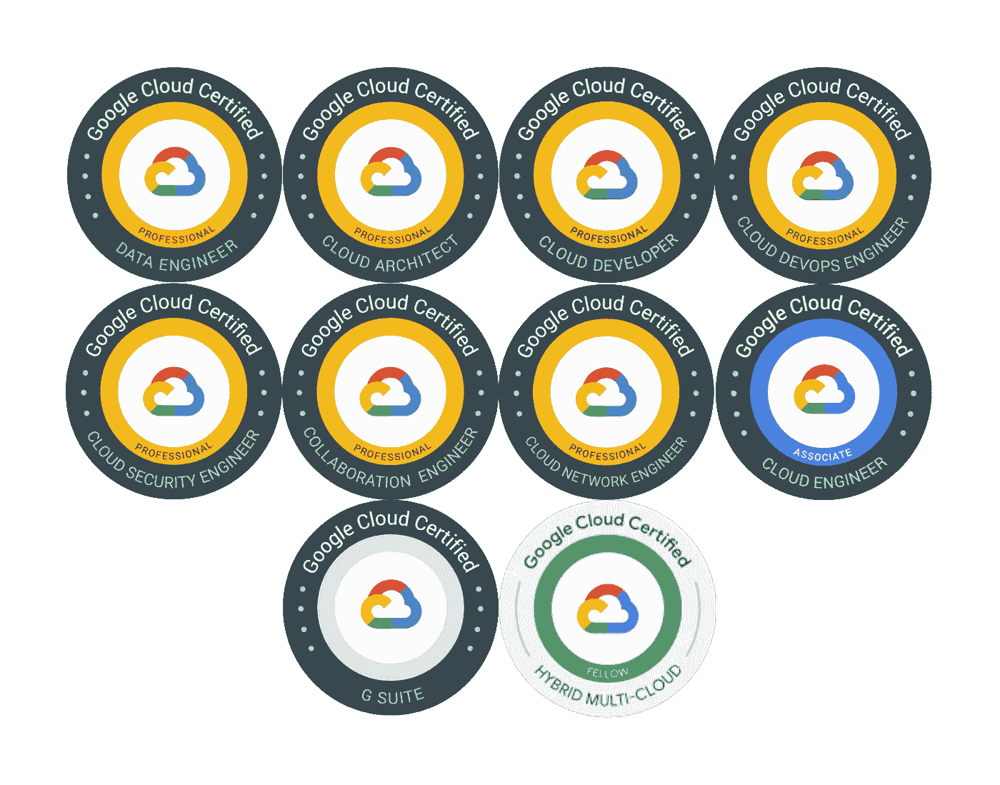
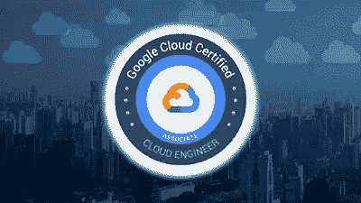
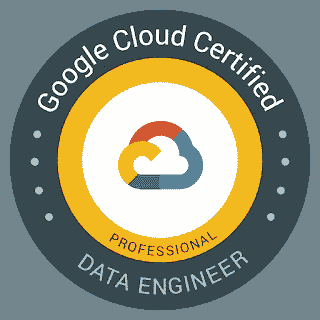
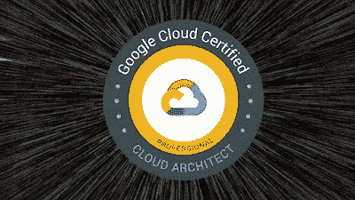
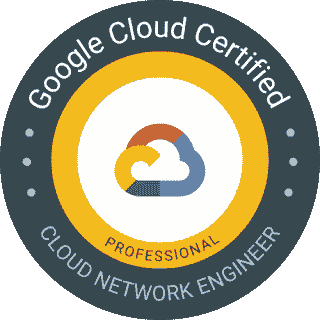
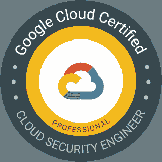
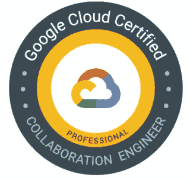
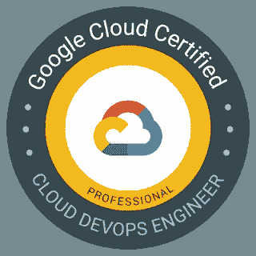
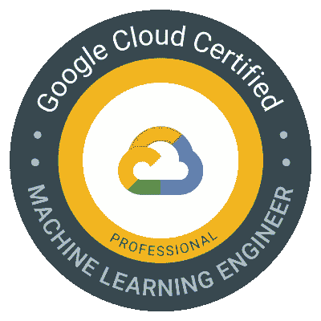
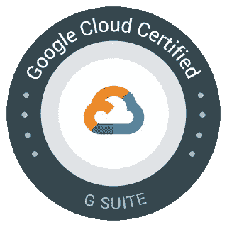

# 2023 年十大谷歌云认证目标

> 原文：<https://medium.com/javarevisited/10-best-google-cloud-certifications-to-aim-1ade11d9f01b?source=collection_archive---------0----------------------->

## 志在成为谷歌云认证专家？根据您的角色和技能，这些是 2023 年的最佳谷歌云认证

伙计们，如果你们的目标是在 2023 年获得云认证，那么谷歌云平台是最受欢迎的平台之一。它由谷歌支持，对了解谷歌云平台或在使用谷歌云平台进行开发、机器学习和大数据方面有一些经验的人有巨大的需求。

获得认证是学习基本技能和获得认可的好方法，这就是为什么我分享了 **10 个最好的谷歌云计算认证**，你可以在 2023 年瞄准这些认证。

在过去，我已经分享了 [**最佳 Azure 云认证**](/javarevisited/10-best-microsoft-azure-cloud-certification-it-professionals-can-aim-b7b6765d8ef1) 和 [**最佳 AWS 云认证**](https://javarevisited.blogspot.com/2020/09/top-10-aws-certifications-for-cloud-professionals.html) ，在本文中，我将分享基于您的角色、知识和专长，您可以瞄准的最佳 Google 云认证。

这不是强制性的，也不要求你去参加所有这些 GCP 认证，除非你真的想成为一个 GCP 英雄，相反，你可以专注于认证，这是接近你的工作领域和经验。

例如，如果你正在做 [DevOps](https://www.java67.com/2020/06/top-5-courses-to-learn-devops-in-2020.html) ，那么获得 Google Cloud Professional DevOps 工程师认证是学习 devo PS GCP 并获得证明以展示你技能的正确途径。同样，对于初学者来说，谷歌云助理工程师是最合适的认证。

[云计算](/javarevisited/10-free-courses-to-learn-cloud-computing-for-beginners-4f3cd984ddb1)是快速增长的行业之一，也是最热门的投资领域，我们谈论的不仅仅是钱，实际上公司需要云技术来托管他们的 web 应用程序和运营他们的业务，谷歌云是世界上领先的云计算之一。

谷歌云早在 2008 年就推出了，它是继 [**【亚马逊 AWS】**](https://www.java67.com/2018/05/top-5-amazon-web-services-or-aws-courses-to-learn-online.html)和 [**微软 Azure**](https://www.java67.com/2020/07/5-free-courses-to-learn-microsoft-azure-cloud.html) 之后排名第三的最常用云。许多知名公司使用云计算来运营他们的业务，如 Twitter、Linkedin、Twitch 以及脸书，这样的例子不胜枚举，为了有效地使用他们的服务，谷歌云推出了许多认证，教你如何处理这些服务。

# 2023 年你可以瞄准的 10 个最佳谷歌云平台认证

以下是 2023 年你可以获得认证的 10 个最受欢迎的谷歌云平台。谷歌云专家并不多，而且供不应求，即使只有这份名单中的一个认证，也能增加你在需要谷歌云平台经验和技能的工作中的机会。

## 1.谷歌云数字领袖考试【最适合初学者】

这是最受欢迎的谷歌云认证之一，针对的是希望学习云计算基础知识以及 2023 年谷歌云平台的初学者。

这也是对初学者和任何想要学习云计算基础知识以及如何使用 Google Cloud 产品和服务来实现组织目标的人的最佳 Google Cloud 认证。

这项认证是进入谷歌云平台的**非常好的切入点**，无论是技术、商业还是管理角色。*云数字领导者*还可以描述常见的业务用例，以及*云*解决方案如何支持企业。

如果你想准备 2023 年的谷歌云数字领导者考试，并且需要一个资源，那么我强烈建议你去 Coursera 上的 [**谷歌云数字领导者培训专业证书**](https://coursera.pxf.io/c/3294490/1164545/14726?u=https%3A%2F%2Fwww.coursera.org%2Fprofessional-certificates%2Fgoogle-cloud-digital-leader-training) 。这个程序是由谷歌云自己设计的，它与考试主题和目标紧密相关。

顺便说一下，你可以单独加入这个认证，也可以参加 [**Coursera Plus 会员**](https://coursera.pxf.io/c/3294490/1164545/14726?u=https%3A%2F%2Fwww.coursera.org%2Fcourseraplus) ，它提供了超过 7000+ Coursera 课程、专业和认证的无限制访问。我向希望获得认证并提升自身技能的 it 专业人士强烈推荐它。

 [## Coursera Plus |无限制访问 7，000 多门在线课程

### 用 Coursera Plus 投资你的职业目标。无限制访问 90%以上的课程、项目…

coursera.pxf.io](https://coursera.pxf.io/c/3294490/1164545/14726?u=https%3A%2F%2Fwww.coursera.org%2Fcourseraplus) 

## 2.谷歌云助理云工程师认证[最适合软件工程师]

对于希望在 google cloud 上开发和创建应用的应用开发者来说，该认证是最好的 Google Cloud 认证。

该认证测试您在 Google cloud 上的实践技能，例如如何使用 Google Cloud 控制台以及命令行界面来部署应用程序、监控运营、管理企业解决方案并对其进行配置，以及更多职责。

如果你正在准备这个考试，需要一个最新的资源，那么 udemy [**终极谷歌认证云工程师助理**](https://click.linksynergy.com/deeplink?id=JVFxdTr9V80&mid=39197&murl=https%3A%2F%2Fwww.udemy.com%2Fcourse%2Fgoogle-cloud-associate-cloud-engineer-certification%2F) 的这个课程可以帮助你获得这些技能。

## 3.谷歌云专业数据工程师考试【最适合数据科学家和数据分析师】

这是对数据科学家、数据分析师、数据工程师最好的谷歌云认证。名称本身就说明了问题，该证书的持有者将处理数据，如收集、处理、保护和监控数据系统，并知道如何创建机器学习模型来利用这些数据的力量。

数据工程师*应该能够设计、构建、操作、保护和监控*数据*处理系统，特别强调安全性*

如果你正在准备谷歌云数据工程师考试，那么这个课程 [**谷歌云专业数据工程师**](https://click.linksynergy.com/deeplink?id=JVFxdTr9V80&mid=39197&murl=https%3A%2F%2Fwww.udemy.com%2Fcourse%2Fgoogle-cloud-professional-data-engineer-get-certified%2F) 在这个旅程中对你帮助很大。

## 4.Google Cloud 专业云架构师认证[面向经验丰富的 IT 专业人员]

这是经验丰富的 IT 专业人员(如高级开发人员、解决方案架构师、技术主管和软件架构师)的最佳 Google Cloud 认证。

对认证谷歌云架构师的需求很高，因为他们使组织能够利用*谷歌云*技术。同时对云架构和 *Google Cloud 有着透彻的理解，这是很难通过的考试之一。*

通过参加该认证，了解如何为企业设计和开发解决方案，以及如何管理云设计的实施。你需要对不同的谷歌云服务和工具有深入的了解才能通过这个考试。

虽然这项考试需要全面的准备，并且您可能需要通过多门课程，但本课程 [**终极谷歌认证专家云架构师**](https://click.linksynergy.com/deeplink?id=JVFxdTr9V80&mid=39197&murl=https%3A%2F%2Fwww.udemy.com%2Fcourse%2Fgoogle-cloud-architect-certifications%2F) 将帮助您快速获得技能以获得该证书。

## 5.Google Cloud 专业云开发者考试【最适合开发者】

对于像 Java 开发者或者 Python 开发者这样的开发者来说，这是最好的 Google cloud 认证。一个专业的云开发者负责使用谷歌推荐的实践和工具来构建可扩展的和高度可用的应用。T

该证书将向您展示如何使用 Google 推荐的实践和工具来构建高度可伸缩的应用程序，个人应该知道如何使用最新的数据库技术和开发工具等等。

如果你正在准备这个考试，并且需要资源，那么这个[**谷歌云平台专业云开发者**](https://click.linksynergy.com/deeplink?id=JVFxdTr9V80&mid=39197&murl=https%3A%2F%2Fwww.udemy.com%2Fcourse%2Fgoogle-cloud-platform-professional-cloud-developer%2F) 课程会教你那些技巧。

## 6.谷歌云专业云网络工程师认证

这是对网络工程师和网络管理员最好的谷歌云认证。这个*认证*考试是为拥有至少一年谷歌云*实践经验*的学生设计的

该证书的持有人将负责在谷歌 GCP 管理和实施网络架构师解决方案，如虚拟专用云 VPC。

如果你想学习那些技能，准备这个考试，那么这个 Google Cloud 的 Coursera 课程— [**准备 Google Cloud 认证:云网络工程师职业证书**](https://coursera.pxf.io/c/3294490/1164545/14726?u=https%3A%2F%2Fwww.coursera.org%2Fprofessional-certificates%2Fgoogle-cloud-networking) 是最好加入的项目。

这直接来自谷歌云，并与考试大纲和概念紧密结合。我向任何想第一次通过这个认证的人强烈推荐这个课程。

## 7.谷歌云专业云安全工程师考试

如果你是一名在谷歌云工作的安全专业人员，并希望获得技能认证，那么谷歌云专业云安全工程师是 2023 年的最佳认证目标。

对谷歌认证的云工程师有巨大的需求，因为他们使组织能够在*谷歌云*上设计和实施安全的工作负载和基础设施。

在准备该考试的过程中，您将了解安全性的最佳实践，您的责任是在谷歌云平台——GCP 中设计和实施一个解决方案架构，并管理它们以及您将在该证书中获得的更多技能。

而且，如果你正在准备这个谷歌认证，需要一个资源，没有比准备 Coursera 上的 [**谷歌云认证:云安全工程师职业证书**](https://coursera.pxf.io/c/3294490/1164545/14726?u=https%3A%2F%2Fwww.coursera.org%2Fprofessional-certificates%2Fgoogle-cloud-security) 更好的资源了。同样，这直接来自谷歌云，并且与考试主题紧密相关。

## 8.谷歌云专业协作工程师考试

这是团队领导和技术领导在 2023 年可以瞄准的另一个谷歌认证。专业协作工程师证书持有者将负责管理用户、资源和团队驱动生命周期，以及监控组织的运营和管理邮件。

如果你需要资源，我在 Coursera 上找到了这个[专业认证](https://coursera.pxf.io/c/3294490/1164545/14726?u=https%3A%2F%2Fwww.coursera.org%2Fprofessional-certificates%2Fg-suite-administration)来帮助你了解更多关于这个证书的信息，并获得一些课程推荐。

## 9.谷歌云专业云 DevOps 工程师认证

专业云 DevOps 工程师认证持有人将有责任确保开发操作顺利、高效，并具备使用谷歌云平台构建软件的技能。

如果你需要准备资源，Coursera 上的这个 [*准备谷歌云认证:云 DevOps 工程师职业证书*](https://coursera.pxf.io/c/3294490/1164545/14726?u=https%3A%2F%2Fwww.coursera.org%2Fprofessional-certificates%2Fsre-devops-engineer-google-cloud) 课程会教你关于这个认证需要知道的一切。

## 10.谷歌云专业机器学习工程师认证

这个证书持有人将设计和建立机器学习模型，利用谷歌云平台解决现实世界和商业问题——GCP 也应该知道如何准备和处理数据。

并且，如果你是认真的想第一次尝试就通过这个认证，并且需要资源的话，我强烈推荐 [**准备谷歌云认证:Coursera 上的机器学习工程师职业证书**](https://coursera.pxf.io/c/3294490/1164545/14726?u=https%3A%2F%2Fwww.coursera.org%2Fprofessional-certificates%2Fpreparing-for-google-cloud-machine-learning-engineer-professional-certificate) 。这是谷歌云专门为这次考试设计的，涵盖了所有考试主题。

## 11.g 套件认证

学习谷歌云平台上的 G suite 生产力协作工具的最佳认证，你将学习如何使用邮件、日历、任务、工作表、谷歌会议等服务，以及更多工具。本课程 [**学 G 套件**](https://click.linksynergy.com/deeplink?id=JVFxdTr9V80&mid=39197&murl=https%3A%2F%2Fwww.udemy.com%2Fcourse%2Flearn-g-suite%2F) 将教你使用这些工具。

这就是你在 2023 年可以瞄准的 11 个最佳谷歌云认证。计算的未来似乎是基于云的，谷歌认证被认为是它提供的内容和技能中最好的，在完成并获得他们的认证后，你将拥有这些内容和技能。

面向 **IT 专业人员**和程序员的其他**认证资源**

*   [如何破解 Azure Fundamentals (AZ-900)认证](https://javarevisited.blogspot.com/2020/04/how-to-crack-microsoft-azure-fundamentals-certification-az-900-exam.html)
*   [破解 AWS 解决方案架构师认证的 5 大课程](https://javarevisited.blogspot.com/2019/05/top-5-courses-to-crack-aws-solutions-architect-associate-certification-exam-SAA-C01.html#axzz5rHwAwycj)
*   [如何通过 AZ-300 Azure 解决方案架构师考试？](https://javarevisited.blogspot.com/2020/04/how-to-crack-microsoft-azure-solution-architect-exam-az-300.html)
*   [Coursera 十大云计算认证](https://javarevisited.blogspot.com/2020/08/top-10-coursera-certifications-to-learn-cloud-computing-aws.html)
*   [成为 GCP 云工程师助理的前 5 门课程](https://javarevisited.blogspot.com/2020/05/top-5-course-to-crack-google-cloud-associate-cloud-engineer-certification-exam.html) r
*   [破解 Azure 云架构师(AZ-300)考试的前 5 门课程](https://javarevisited.blogspot.com/2019/07/top-5-courses-to-crack-azure-architecture-technologies-certification-az-300-exam.html#axzz6E6VuRMsx)
*   [破解 AWS 解决方案架构师专业考试前 5 门课程](https://javarevisited.blogspot.com/2020/04/top-5-course-to-crack-aws-solution-architect-professional-sap-c01-certification-exam.html)
*   [程序员前 5 名 AZ-900 模拟测试](https://javarevisited.blogspot.com/2020/02/top-5-AZ-900-exam-Azure-Fundamentals-certification-practice-tests-and-mock-exams-to.html)
*   [如何通过 Spring Core Professional 5.0 认证](https://javarevisited.blogspot.com/2018/08/how-to-crack-spring-core-professional-certification-exam-java-latest.html)
*   [学习 Docker 和 Kubernetes 的十大课程](https://dev.to/javinpaul/top-10-courses-to-learn-docker-and-kubernetes-for-programmers-4lg0)
*   [通过谷歌助理云工程师认证的前 5 门课程](https://javarevisited.blogspot.com/2019/07/top-5-google-cloud-platform-gcp-courses-certifications-online.html)
*   [5 次免费的 AWS 解决方案架构师实践测试](https://javarevisited.blogspot.com/2019/08/top-5-free-aws-solution-architect-Associate-certification-dumps-practice-questions.html)
*   [学习 Docker 和 Kubernetes 的十大课程](https://dev.to/javinpaul/top-10-courses-to-learn-docker-and-kubernetes-for-programmers-4lg0)
*   [破解 AWS DevOps 工程师考试的前 5 门课程](https://javarevisited.blogspot.com/2020/04/top-5-course-to-crack-aws-certified-devops-engineer-professional-exam-certification.html)
*   如何成为 Azure 认证管理员助理？
*   [通过谷歌助理云工程师认证的前 5 门课程](https://javarevisited.blogspot.com/2019/07/top-5-google-cloud-platform-gcp-courses-certifications-online.html)
*   [通过 AWS 云从业者认证的前 5 门课程](https://javarevisited.blogspot.com/2020/02/top-5-courses-to-crack-aws-certified-cloud-practitioner-exam-certification-clf-c01.html)

感谢您阅读本文。如果你喜欢这些*最佳谷歌云认证*，那么请与你的朋友和同事分享。如果这些课程帮助你通过了考试，那么请把它传播出去，让其他人也能受益。

万事如意

**附言——**如果你是云计算和谷歌云平台(GCP)的绝对初学者，并且正在寻找免费资源开始你的云之旅，那么你也可以查看这些 [**最好的免费谷歌云课程**](/javarevisited/7-free-courses-to-learn-google-cloud-platform-for-beginners-cbb260fbd8e4) 。这个列表包含了 Udemy 和 Coursera 上学习谷歌概念的最好的免费课程。

 [## 2023 年面向初学者的 5 大免费谷歌云平台课程——最佳选择

### 大家好，如果你也想学习 2023 年的谷歌云平台，并且正在寻找一些免费的在线谷歌云…

www.java67.com](https://www.java67.com/2020/07/5-free-courses-to-learn-google-cloud-platform-and-concepts.html)