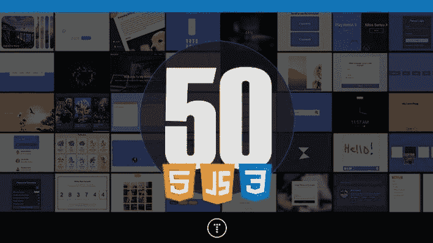
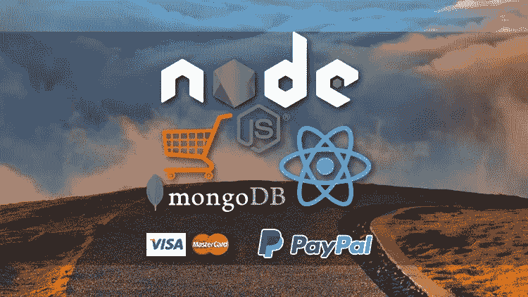
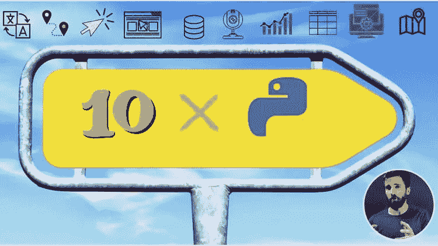
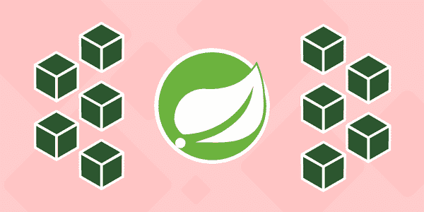
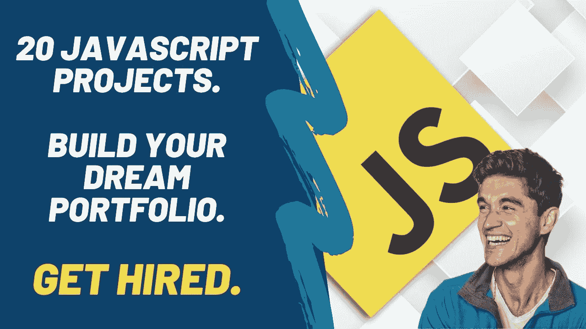
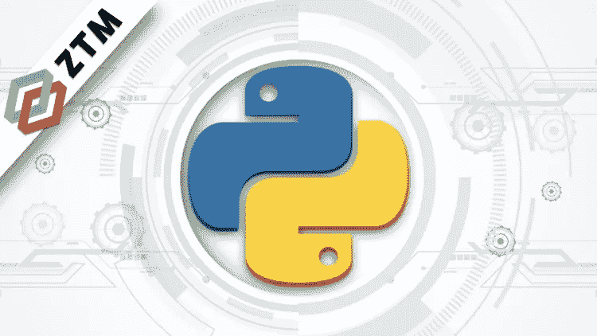

# 2023 年学习 Java、Python 和 JavaScript 的十大基于项目的在线课程

> 原文：<https://medium.com/javarevisited/10-best-hands-on-courses-to-learn-programming-with-java-python-and-javascript-53539498fd52?source=collection_archive---------0----------------------->

## 我最喜欢的基于项目的实践课程，为初学者学习用 Java、Python、Spring Boot、微服务和 JavaScript 编程和编码

image_credit —教育性

大家好，如果你的目标是在 2023 年学习 Java、Python 或 JavaScript 这三种最流行的编程语言的编程和代码，并寻找可以在实践中学习的实践型、基于项目的课程，那么你来对地方了。

早前我曾分享过成为一名[**Java 开发者**](/javarevisited/the-java-programmer-roadmap-f9db163ef2c2) **，** [**web 开发者**](/javarevisited/the-2019-web-developer-roadmap-ab89ac3c380e) **，** [**React 开发者**](/javarevisited/the-2019-react-js-developer-roadmap-9a8e290b8a56) **，** [**DevOps 工程师**](/hackernoon/the-2018-devops-roadmap-31588d8670cb) **a** nd 在本文中，我将分享 2023 年学习编程最好的项目化课程。

这些课程非常棒，是由一位令人敬畏的讲师创建的，他提倡边做边学，将帮助你从根本上学会世界上排名前三的编程语言 [Java](https://javarevisited.blogspot.com/2018/05/top-5-java-courses-for-beginners-to-learn-online.html#axzz6fTDkmvNA) 、 [Python](https://javarevisited.blogspot.com/2018/03/top-5-courses-to-learn-python-in-2018.html) 或 [JavaScript](https://javarevisited.blogspot.com/2018/06/top-10-courses-to-learn-javascript-in.html) 。那么我建议你参加一个基于项目的课程。

这些课程让你在实践中学习，我认为这是学习编程和编码的最好方式。

阅读一本书是可以的，观看视频也是可以的，但它们不会让你成为程序员或编码员，**你必须编码**才能成为编码员，这些基于项目的课程给了你这样的机会。

我记得当我学习编码时，我从像《让我们用 C》和《让我们用 C++》这样的书上下载程序开始，我记得代码，这样我就可以在测试时编写它们，但是如果需求有一点点变化，我总是很纠结。这显然是一个错误的方法，我很快就意识到了。

在那之后，我开始解决常见的编码问题，如[斐波那契](https://www.java67.com/2019/03/nth-fibonacci-number-in-java-coding.html)、[回文](https://javarevisited.blogspot.com/2012/12/how-to-check-if-number-is-palindrome-or-not-example.html)、[字符串反转](https://javarevisited.blogspot.com/2012/01/how-to-reverse-string-in-java-using.html)、[阶乘](http://www.java67.com/2015/09/factorial-in-java-using-recursion-and-loop.html)、[树遍历](https://javarevisited.blogspot.com/2016/10/post-order-binary-tree-traversal-in-java-iteration-recursion.html#axzz5ghwj3kuU)和[链表反转](https://javarevisited.blogspot.com/2017/03/how-to-reverse-linked-list-in-java-using-iteration-and-recursion.html)，这是我开始理解编码和构建逻辑来解决问题的地方，但当我进入第一份工作时，我再次感到挣扎，因为我必须进行应用程序开发，这与解决编码问题有很大不同。

那时，我开始自己构建游戏开发、图书馆管理、酒店管理等项目，并学习了许多实用的东西，如[数据库连接](/hackernoon/top-5-sql-and-database-courses-to-learn-online-48424533ac61)，启动和停止应用程序、部署、测试等等。

这是我学习编程的最佳方式，从那以后我一直倡导基于项目的学习，今天，我将分享学习 [Java](https://www.java67.com/2018/08/top-10-free-java-courses-for-beginners-experienced-developers.html) 、 [Python](/swlh/5-free-python-courses-for-beginners-to-learn-online-e1ca90687caf) 和 [JavaScript](https://www.java67.com/2018/04/top-5-free-javascript-courses-to-learn.html) 的最佳基于项目的课程。

# 2023 年学习编码和软件开发的 10 门最佳项目课程

多亏了 Udemy 和其他在线学习平台，现在不缺乏支持资源。当你陷入困境时，你不需要浪费时间去研究，相反，通过参加这些基于项目的课程，你可以很容易地获得结构化的学习体验。

这些是你可以参加的最好的基于项目的课程，比如学习 Java、T2、Python 和 JavaScript。我已经加入了包含迷你项目和全功能真实世界应用的课程。

我建议你从迷你项目开始，然后转向更高级的全功能现实应用，比如电子商务网站。

## 1. [100 天代码—2023 年完整的 Python Pro 训练营](https://click.linksynergy.com/deeplink?id=JVFxdTr9V80&mid=39197&murl=https%3A%2F%2Fwww.udemy.com%2Fcourse%2F100-days-of-code%2F)

如果你想在 2023 年学习 Python，并寻找一个基于项目的课程，那么这是你可以在 Udemy 上加入的最佳课程。由 [**iOS Bootcamp 课程**](https://click.linksynergy.com/deeplink?id=JVFxdTr9V80&mid=39197&murl=https%3A%2F%2Fwww.udemy.com%2Fcourse%2Fios-13-app-development-bootcamp%2F) 的讲师 [Angela Yu](https://click.linksynergy.com/deeplink?id=CuIbQrBnhiw&mid=39197&murl=https%3A%2F%2Fwww.udemy.com%2Fuser%2F4b4368a3-b5c8-4529-aa65-2056ec31f37e%2F) 创建，这个在线课程将通过在 100 天内构建 100 个项目来教你 Python。

你将学习建立网站、游戏、app，加上抓取和数据科学，成为一名 Python 专业人士。完成本课程后，你还将有一个 100 个 Python 项目的组合来申请开发人员的工作，这将使你成为一个突出的候选人。

此外，这是一门拥有 60 多个小时内容和 229 篇文章的大型课程，但你只需花 9.9 美元就可以在不时举办的 [Udemy sales](https://click.linksynergy.com/deeplink?id=CuIbQrBnhiw&mid=39197&murl=https%3A%2F%2Fwww.udemy.com%2F) 上购买。如果你想在 2023 年学习 Python，我强烈推荐你在 Udemy 上加入这个课程。

**这里是参加本课程的链接** — [100 天的代码—2023 年的完整 Python Pro 训练营](https://click.linksynergy.com/deeplink?id=JVFxdTr9V80&mid=39197&murl=https%3A%2F%2Fwww.udemy.com%2Fcourse%2F100-days-of-code%2F)

## 2.[通过构建项目练习 Java](http://bit.ly/2hj03tp)

如果你的目标是在 2023 年学习 Java，并且你需要一门基于项目的课程，那么你会喜欢 Udemy 上的这门“*通过构建项目练习 Java”*课程。它是由 Tim Short 从 Java 面试的角度创建的。

这门课程的 USP 是 100%专注于在现实世界的应用中应用面向对象的设计，这是成为一名 [Java 开发人员](/javarevisited/top-10-frameworks-full-stack-java-developers-can-learn-in-2020-5995021401e5)的关键技能。

在本课程中，您将从头开始构建 5 个完整的、端到端的 Java 应用程序，在此过程中，您将学习如何应用核心的面向对象编程技术和掌握设计原则，并应用适当的架构来解决问题。

以下是您将在本课程中构建的 Java 项目列表

1.  电子邮件管理应用程序
2.  学生数据库应用程序
3.  新银行账户申请

老实说，基于项目的 Java 课程并不多，而这一门是最好的。我强烈推荐这个基于项目的 Java 课程给任何想学习 Java，准备 Java 面试，或者只是想让你的 Java 技能[更上一层楼的人。](https://dev.to/javinpaul/10-skills-java-programmer-can-learn-to-accelerate-their-career-3nlh?fbclid=IwAR19fdBhg3zriyqcZyo9CfvMSHW_xKmNggTndkN-fFFfMaWH6VHG5T_Z6Rc)

**这里是加入本 Java 课程**——[通过构建项目练习 Java](http://bit.ly/2hj03tp)的链接

## 3. [50 天 50 个项目——HTML、CSS & JavaScript](https://bit.ly/2VjLQwC)

如果你想在 2023 年成为一名网页开发者，那么你需要学习 HTML、CSS 和 JavaScript，这是网页开发的三大支柱，这些是掌握它们的最佳课程。这个基于项目的课程是由畅销的 Udemy 讲师 [Brad Traversy](https://click.linksynergy.com/deeplink?id=CuIbQrBnhiw&mid=39197&murl=https%3A%2F%2Fwww.udemy.com%2Fuser%2Fbrad-traversy%2F) 和惊人的 [Florin Pop](https://click.linksynergy.com/deeplink?id=CuIbQrBnhiw&mid=39197&murl=https%3A%2F%2Fwww.udemy.com%2Fuser%2Fpopflorin%2F) 创建的。

该课程遵循一天一个项目的理念，让你有机会在 50 天内练习 50 个项目。你可以用它们来提高你的技能。

以下是您将在本课程中构建的 20 个小型项目:

*   进度步骤
*   旋转导航动画
*   隐藏搜索小工具
*   滚动动画
*   分割登录页面
*   音板
*   事件键码
*   随机选择选择器
*   电影应用
*   背景滑块
*   主题时钟
*   按钮波纹效应

总的来说，这是一门很棒的基于项目的课程，学习 [HTML](https://www.java67.com/2020/08/5-best-online-courses-to-learn-html-5.html) 、 [CSS](https://javarevisited.blogspot.com/2020/09/top-5-css-cascading-style-sheet-courses-for-beginners.html) 和 [JavaScript](/javarevisited/10-best-online-courses-to-learn-javascript-in-2020-af5ed0801645) 。如果你已经熟悉这些技术，那么你也可以利用这个课程来提高你的技能，让你的编码技能更上一层楼。

**这里是加入本课程的链接** — [50 天 50 个项目——HTML、CSS & JavaScript](https://bit.ly/2VjLQwC)

## 4. [MERN 电子商务从无到有](https://click.linksynergy.com/deeplink?id=JVFxdTr9V80&mid=39197&murl=https%3A%2F%2Fwww.udemy.com%2Fcourse%2Fmern-ecommerce%2F)【用于网络开发】

到目前为止，我们已经看到了一些课程，在这些课程中，你会得到多个项目来练习，但这些都是一些小项目。这是一个真实的东西，一个完整项目的一门课程，而且它不是一个小课程。

它包含超过 15 个小时的内容，你将建立一个全面的电子商务网站使用 [MERN 栈](/javarevisited/top-5-online-courses-to-learn-mern-stack-in-depth-9947230f194?source=---------9------------------)，我的意思是与[反应](/javarevisited/top-10-free-courses-to-learn-react-js-c14edbd3b35f)，节点，快递& MongoDB

这不是一门文档类型的课程。这是一个入门课程，最终，你会有一个真实的项目可以使用，并放在你的文件夹中。

这是我在网上遇到的最清晰的基于项目的课程之一。本课程的独特之处在于布拉德的教学风格，这种风格完美无瑕，让人很容易理解课程内容。

通过做这个项目，你会学到几个关键技能，比如:

*   与功能组件和挂钩反应
*   反应路由器
*   React-Bootstrap UI 库
*   如何构建组件
*   组件级状态和属性
*   使用 Express 创建一个庞大的后端
*   使用 MongoDB 数据库和 Mongoose ODM
*   JWT 身份验证(JSON web 令牌)
*   创建自定义身份验证中间件
*   自定义错误处理程序
*   集成 PayPal API
*   项目部署等等！

如果你是一名 web 开发人员，或者想成为一名使用 [MERN 栈](https://www.java67.com/2020/06/top-5-courses-to-learn-mern-stack-for-web-development.html)的全栈 web 开发人员，那么我强烈推荐这门基于项目的课程。再说一次，你可以在 Udemy 上花 9.9 美元买到这个综合课程。

**这是参加本课程的链接**——[MERN 电子商务从零开始](https://click.linksynergy.com/deeplink?id=JVFxdTr9V80&mid=39197&murl=https%3A%2F%2Fwww.udemy.com%2Fcourse%2Fmern-ecommerce%2F)

## 5.[Python 大型课程:构建 10 个真实世界的应用程序](http://bit.ly/2AHe393)

这是 Udemy 上最好的 Python 课程之一，它将通过制作 10 个惊人的 Python 应用程序来教你 Python 3。本课程由 Ardit Sulce 创建，对初学者和中级 Python 开发人员都有好处，因为在本课程结束时，你会从一个完全的初学者变成一个自信的 Python 程序员。

在这个基于项目的 python 课程中，你将完全在 [Python 3](/javarevisited/8-advanced-python-programming-courses-for-intermediate-programmer-cc3bd47a4d19) 中构建实际的桌面程序、web 应用，甚至移动应用。以下是你将在本课程中开发的 10 款应用

*   英语词库
*   火山网络地图
*   使用 Python 的个人网站
*   书店数据库应用程序
*   手感好的手机 App
*   网络摄像头运动检测器
*   房地产网页抓取器
*   交互式数据仪表板
*   数据库 Web 应用程序
*   地理编码器 Web 应用程序

在本课程中，您将构建所有这些 Python 应用程序。如果你是一个初学者，不知道任何关于 [Python](https://javarevisited.blogspot.com/2018/12/10-free-python-courses-for-programmers.html) 或[编码](/javarevisited/top-20-sites-to-learn-coding-in-2020-f57ff63d9cb3)的事情，不要担心，因为你将首先学习 Python 编程的基础。

如果你已经知道 Python 编程，那么你可以直接使用第一个应用程序。通过构建这 10 个应用程序，您将掌握 Python 并构建自己的 Python 应用程序。你也可以使用这 10 个应用中的任何一个。

**这是加入 Python 课程**的链接—[Python 大型课程:构建 10 个真实世界的应用](http://bit.ly/2AHe393)

## 6.[与 Spring Boot 一起开发微服务](https://www.educative.io/courses/developing-microservices-with-spring-boot?affiliate_id=5073518643380224)【教育性】

这是 Educative 的另一个很棒的互动课程，学习如何用 Spring Boot 和 Java 开发微服务。如果你想成为一名全栈 Java 开发人员，并且正在寻找一门简短的、集中的、基于项目的课程，那么这门课程非常适合你。

这个小型课程将帮助您开始使用 Spring Boot 框架开发微服务的旅程。您将涵盖模型-视图-控制器(MVC)、[微服务](/javarevisited/7-free-microservices-courses-for-java-programmers-c9b2f3a2ea7d)、 [Spring Boot](/javarevisited/10-free-spring-boot-tutorials-and-courses-for-java-developers-53dfe084587e?source=collection_home---4------7-----------------------) 的基础知识，以及开发任何微服务或独立的生产级 Spring 应用程序所需的配置。

您还将学习如何集成数据库、开发 web UI 以及如何处理错误。在此过程中，您还将构建一个媒体应用程序，在其中您将利用到目前为止所学的所有知识。在这个小课程结束时，你将能够使用 Spring Boot 开发你的第一个应用程序。

以下是加入本课程的链接— [与 Spring Boot 一起开发微服务](https://www.educative.io/courses/developing-microservices-with-spring-boot?affiliate_id=5073518643380224)

而且，如果你觉得教育平台和他们的互动课程很有用，那么你还可以获得 [**教育订阅**](https://www.educative.io/subscription?affiliate_id=5073518643380224) ，它不仅提供这门课程，还提供他们的 250 多门课程，每月仅需 14.9 美元。它非常划算，非常适合准备编码面试

 [## 教育无限:保持领先

### 我们听到了您的反馈。你现在只需支付一次费用，就可以获得 Educative 上的所有课程。

www.educative.io](https://www.educative.io/subscription?affiliate_id=5073518643380224) 

## 7. [JavaScript Web 项目:构建您的作品集的 20 个项目](https://academy.zerotomastery.io/p/javascript-projects?affcode=441520_zytgk2dn)

这是另一个通过构建项目来学习 JavaScript 的很棒的在线实践课程。这门课程由 ZTM 学院的 Andrei Negaoie 创建，它将教你如何通过构建 20 个项目而不是一个或两个来掌握 JavaScript。

这是你将在本课程中构建的项目—

*   Spock 摇滚游戏— Confetti.js，模块
*   报价生成器—获取、异步/等待、报价 API、CORS
*   无限滚动—获取、异步/等待、Unsplash API、DOM、滚动事件监听器
*   倒计时应用程序—日期、本地存储
*   音乐播放器— HTML 5 音频 API
*   计算器—数学方法
*   启动页面— DOM 基础知识
*   亮/暗模式— DOM，本地存储
*   画中画—画中画 API，屏幕捕捉 API
*   书签应用程序— DOM，本地存储
*   NASA APOD —获取、异步/等待、NASA API、DOM、本地存储
*   动画导航— CSS 动画

本课程的重点是效率，通过建立你的梦想投资组合让你被录用，这样你就可以找到一份工作或成为一名自由职业者。

无论你是想学习 React(反应)、 [Angular(角度)](/javarevisited/10-courses-to-learn-angular-for-web-development-6da1bd2856dc?source=---------8------------------)、 [Vue JS](/javarevisited/top-5-online-courses-to-learn-vue-js-in-2021-249e66b60646) 、 [Node.js](/javarevisited/top-10-online-courses-to-learn-node-js-in-depth-8ef0e31ca139?source=---------32------------------) 、 [Svelte](/javarevisited/5-best-svelet-js-courses-for-beginners-in-2021-fadf0c4e2bab) ，还是专业 web 开发的任何其他工具链，归根结底，JavaScript 基础是关键，学习 JavaScript 是一项投资，将在未来许多年内获得回报。

**这是加入本课程的链接** — [JavaScript Web 项目:构建你的作品集的 20 个项目](https://academy.zerotomastery.io/p/javascript-projects?affcode=441520_zytgk2dn)

顺便说一句，你需要一个 [ZTM 会员资格](https://academy.zerotomastery.io/p/academy?affcode=441520_zytgk2dn) p 来观看这个课程，这个课程每月花费大约 23 美元，但是也提供了许多超级吸引人和有用的课程，比如他的 Python 课程。您还可以使用我的代码朋友 10 获得您选择的任何订阅的 10%的折扣。

 [## ZTM 学院

### 无论你是刚刚开始学习编码，还是想提高你的技能，零到精通学院将教你…

academy.zerotomastery.io](https://academy.zerotomastery.io/p/academy?affcode=441520_zytgk2dn) 

## 8.一个面向初学者的 Java Spring Boot 微服务项目

如果你想通过使用 Spring Framework 和 Spring Boot 构建一个微服务项目来学习 Java，并寻找一个实践课程，那么这是最适合你的课程。

在这个基于项目的 Spring Boot 和微服务课程中，您将使用最新的技术堆栈构建一个用户应用，如 [Java](/javarevisited/10-books-java-developers-should-read-in-2020-e6222f25cc72) 、 [Spring Framework](/javarevisited/10-best-spring-framework-books-for-java-developers-360284c37036) 、 [Spring Boot](/javarevisited/top-10-courses-to-learn-spring-boot-in-2020-best-of-lot-6ffce88a1b6e) 、 [Spring Cloud](/javarevisited/5-best-courses-to-learn-spring-cloud-and-microservices-1ddea1af7012) 、[微服务](/javarevisited/10-best-java-microservices-courses-with-spring-boot-and-spring-cloud-6d04556bdfed)、 [IntelliJ](/javarevisited/7-best-courses-to-learn-intellij-idea-for-beginners-and-experienced-java-programmers-2e9aa9bb0c05) 、REST、 [JPA](/javarevisited/top-5-hibernate-online-training-courses-for-beginners-and-advance-java-programmers-469460596b2b) 、 [Maven](/javarevisited/6-best-maven-courses-for-beginners-in-2020-23ea3cba89) 、Zuul、Ribbon 等。

由 [FutureX Skill](https://click.linksynergy.com/deeplink?id=CuIbQrBnhiw&mid=39197&murl=https%3A%2F%2Fwww.udemy.com%2Fuser%2Ffuture-x-skill%2F) 创建，在本课程中，您将按照分步指南实际构建应用程序，但如果您不了解 Java 和 Spring Framework，也不用担心，因为本课程将为您提供足够的介绍和知识来完成项目。

最终，你不仅会做一个令人兴奋的项目，还会学到像 Java 和 Spring Boot 这样有价值的技能，成为一名成功的后端开发人员。我向想学习 Spring 和微服务的 java 程序员强烈推荐这个课程

**这里是加入本课程的链接** — [一个面向初学者的 Java Spring Boot 微服务项目](https://click.linksynergy.com/deeplink?id=CuIbQrBnhiw&mid=39197&murl=https%3A%2F%2Fwww.udemy.com%2Fcourse%2Fjava-spring-boot-microservices-project-for-beginners%2F)

## 10.[2023 年完成 Python 开发者:零到精通](https://click.linksynergy.com/deeplink?id=CuIbQrBnhiw&mid=39197&murl=https%3A%2F%2Fwww.udemy.com%2Fcourse%2Fcomplete-python-developer-zero-to-mastery%2F)

这是 2023 年学习 Python 编程的又一个牛逼的、基于项目的课程。这个 Udemy 课程由 Andrei Negaoi 创建，它将教你如何通过构建 12 个以上的项目成为 Python 3 开发者。

这是一门全面的基于项目的课程，将向您介绍 Python 开发人员(Python 3)的所有现代技能，在此过程中，我们将构建超过 12 个真实项目来添加到您的投资组合中。

这个课程最大的好处是，你可以接触到我们建立的 12+个项目的所有代码，这样你就可以马上把它们放到你的文件夹里！一路上，你还会[学习网页开发](/better-programming/my-5-favorite-courses-to-learn-web-development-in-2019-a5e74167f8b2)和[学习机器](/javarevisited/top-10-machine-learning-and-data-science-certifications-and-training-courses-for-beginners-and-a6308497b764?source=---------43----------------------------)。

本课程的课程设计也非常好，您将学习如何使用 Python 处理电子邮件、文本消息、CSV 文件、PDF 文件、图像文件、数据可视化、构建您自己的机器学习模型以及执行图像检测

在本课程结束时，你将成为一名完全的 Python 开发人员，可以被大公司聘用。

**以下是加入本课程的链接—**[2023 年完成 Python 开发:零到精通](https://click.linksynergy.com/deeplink?id=CuIbQrBnhiw&mid=39197&murl=https%3A%2F%2Fwww.udemy.com%2Fcourse%2Fcomplete-python-developer-zero-to-mastery%2F)

顺便说一下，ZTM 学院也提供这门课程，如果你已经有了 ZTM 会员资格，你也可以免费学习这门课程。如果你没有，那么你可以申请一个来访问 Andrei 的所有课程。您还可以使用我的代码朋友 10 获得您选择的任何订阅的 10%的折扣。

 [## ZTM 学院

### 无论你是刚刚开始学习编码，还是想提高你的技能，零到精通学院将教你…

academy.zerotomastery.io](https://academy.zerotomastery.io/p/academy?affcode=441520_zytgk2dn) 

以上是 2023 年学习 Java、Python 和 JavaScript 的**最佳项目课程**。这是一个很棒的课程集，你在其他地方找不到，如果你的目标是学习编程和编码，我强烈建议根据你选择的编程语言选择其中的一门课程。

> 没有比实践更好的学习方法了，这些项目将鼓励你编码，并确保你不会被卡住。

您可能喜欢的其他**编程和课程文章**

*   [2023 年最值得购买的 10 个 Udemy 球场](https://javarevisited.blogspot.com/2020/11/top-10-udemy-courses-you-can-buy-in.html#axzz6enw6Ycw1)
*   [Udemy vs Coursera？学理工和编程哪个好](https://javarevisited.blogspot.com/2020/01/coursera-vs-udemy-which-is-better-for-programming-tech.html)
*   Coursera 证书对工作和事业有帮助吗
*   [学习 Python 的 10 个 Coursera 专业和认证](https://javarevisited.blogspot.com/2020/02/10-best-coursera-courses--for-python.html)
*   [完整的 Java 开发者路线图](https://javarevisited.blogspot.com/2019/10/the-java-developer-roadmap.html#axzz6N3akNoox)
*   [2023 年程序员十大课程](https://javarevisited.blogspot.com/2020/08/top-10-coursera-courses-specilizations-and-certifications.html)
*   [Udemy vs CodeCademy vs one month？](https://javarevisited.blogspot.com/2019/09/codecademy-vs-udemy-vs-onemonth-which-is-better-for-learning-code.html#axzz6VYKcmyZz)
*   [向顶级科技公司学习的 18 门 Coursera 课程](/javarevisited/18-coursera-courses-you-can-join-in-2020-to-learn-from-the-worlds-top-tech-companies-google-74af46967d1e?source=collection_home---4------0-----------------------)
*   [面向程序员和开发人员的 Coursera 十大项目](https://javarevisited.blogspot.com/2020/08/top-10-coursera-projects-to-learn-essential-programming-skills.html)
*   Udemy vs 复数视线？哪个学习平台比较好？
*   [2023 年学习 Python 可以做的 8 个项目](/javarevisited/8-projects-you-can-buil-to-learn-python-in-2020-251dd5350d56)
*   [学习数据科学的十大课程](https://javarevisited.blogspot.com/2020/08/top-10-coursera-certifications-to-learn-Data-Science-Visualization-and-Data-Analysis.html)
*   [5 个最佳 Coursera 程序员职业证书](https://javarevisited.blogspot.com/2019/10/top-5-coursera-professional-certificates-for-programmers-IT-professionals.html)
*   [开始职业生涯的十大 Coursera 认证](/javarevisited/top-10-coursera-certificates-to-start-your-career-in-cloud-data-science-ai-mainframe-and-it-558690c83587)
*   [Udemy vs Educative vs CodeCademy？新手用哪个比较好](/javarevisited/codecademy-or-pluralsight-which-is-a-better-platform-to-learn-coding-skills-59251a080642)
*   【Coursera 的 10 项数据科学和机器学习认证

感谢您阅读本文。如果您发现这些基于项目的实践编程和编码课程很有用，请与您的朋友和同事分享。如果您有任何问题或反馈，请留言。

如果你热衷于学习编程，并且正在寻找编程和编码课程，那么你也可以看看这个来自 Educative 的[10 门免费编程课程**的列表，Educative**](https://javarevisited.blogspot.com/2020/01/top-10-free-interactive-online-courses.html)是一个交互式在线学习平台。所有课程完全免费加入。

 [## 2023 年 10 门免费编程课程供初学者学习

### 免费编程和编码课程，学习 Python、Java、Scala、C、C++、JavaScript、PHP、Ruby 和 R 编程…

medium.com](/javarevisited/top-10-free-interactive-programming-courses-from-educative-for-beginners-to-learn-in-2021-713cbf96d4eb)