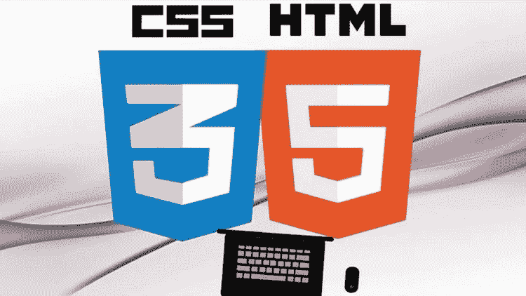
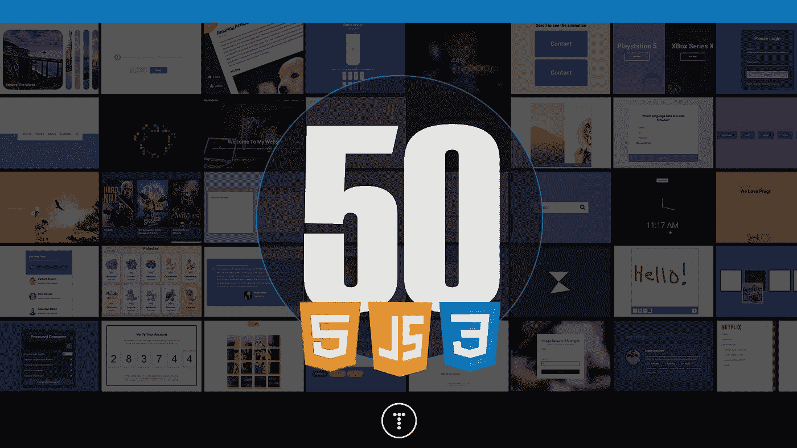
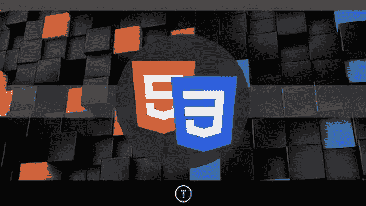
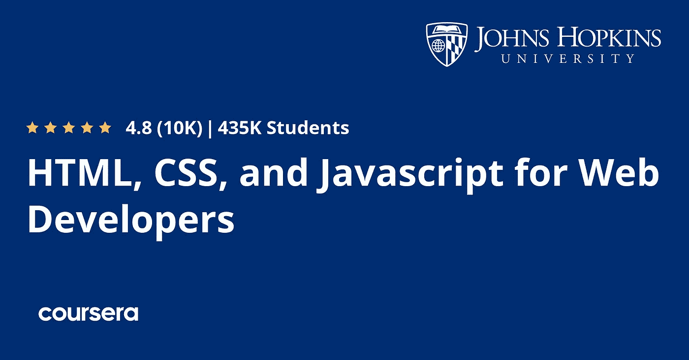
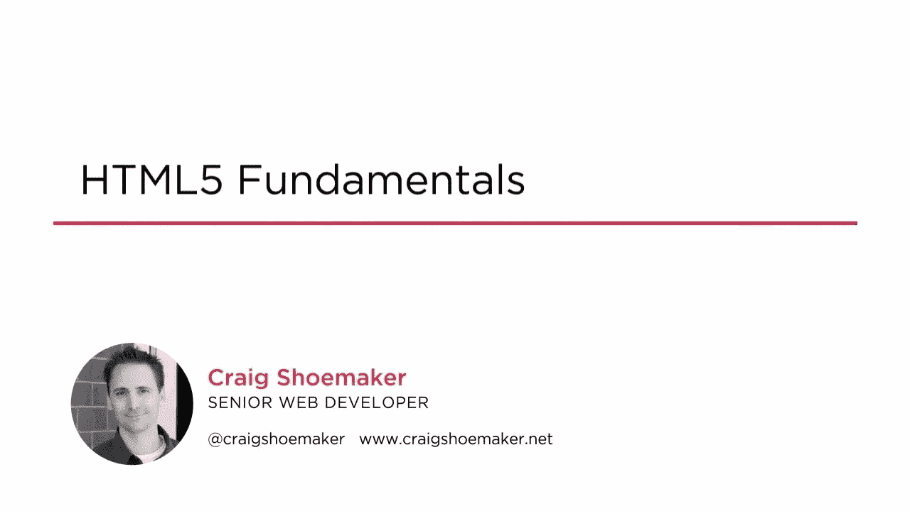
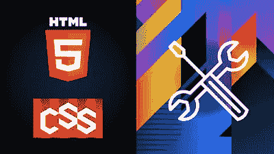
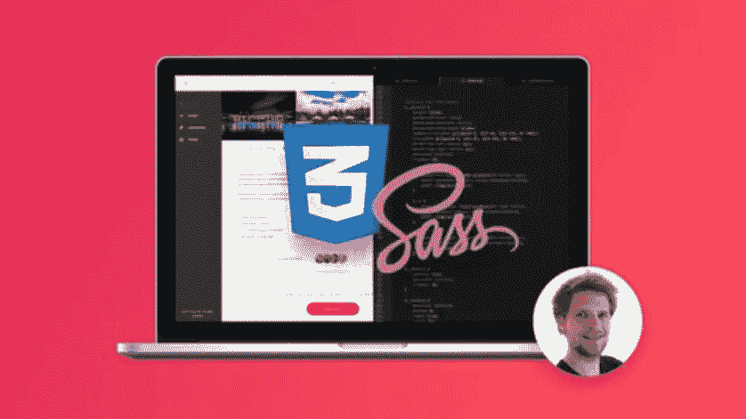
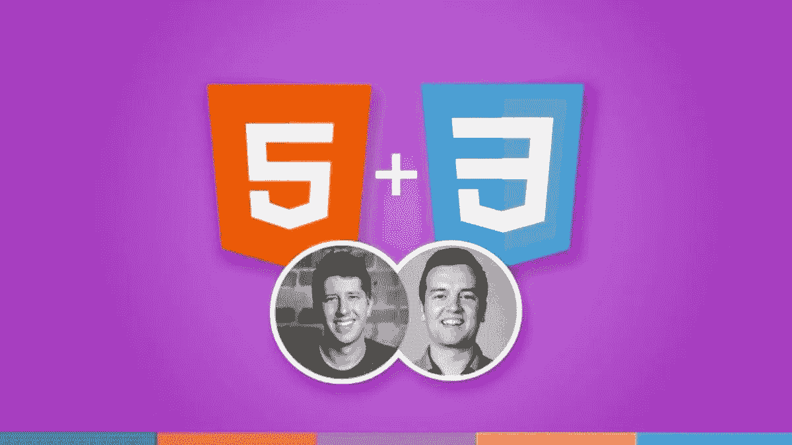
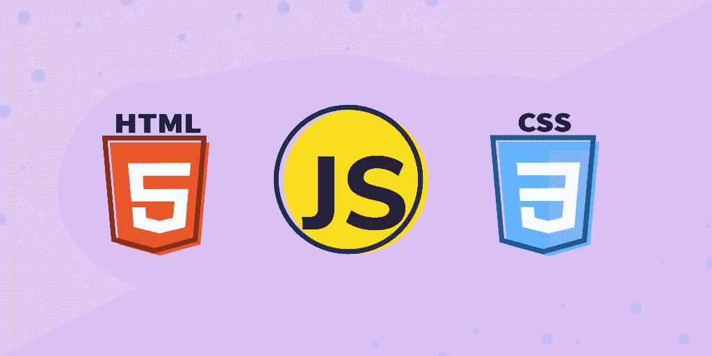

# 2023 年初学者学习前端开发的 10 个最佳 HTML 和 CSS 课程

> 原文：<https://medium.com/javarevisited/10-best-html-and-css-courses-for-beginners-in-2021-6757eec00032?source=collection_archive---------0----------------------->

## 2023 年想学 HTML 5 和 CSS 3？这里有 10 个最好的在线课程，你可以参加来深入学习 HTML 和 CSS。

image_credit — Udemy

你好，伙计们，如果你想在 2023 年学习 HTML 和 CSS，成为一名网页设计师，或前端开发人员，并寻找最好的 HTML 5 和 CSS 3 课程，那么你来对地方了。在过去，我已经分享了学习 HTML 和 CSS 的 [**最佳免费课程，在这篇文章中，您可以选择您可以在线学习 HTML5 和 CSS3 的最佳课程。**](/javarevisited/top-10-free-courses-to-learn-html-5-css-3-and-web-development-872d62d97a97)

这篇文章包含了 Udemy、Coursera、Pluralsight、Educative 和 edX 等网站为初学者和有经验的开发者提供的最好的 HTML5 课程。这些在线培训课程和班级由专家创建，受到成千上万开发人员的信任，将于 2023 年在**在线学习 HTML5 和 CSS3**

HTML5 和 CSS3 是每个网页设计师和网页开发者都应该学习的两个核心技术。它们是前端开发人员的[基本技能之一](https://www.java67.com/2020/10/best-frontend-skills-web-developer.html)。它们也是推动数字调用的 web 开发的支柱。

如果你想成为一名网页设计师或网页开发者，你必须学习 HTML 5 和 CSS 3，如果你正在寻找学习 HTML 和 CSS 的最佳在线课程，那么你来对地方了。

HTML 代表超文本标记语言。它是由万维网联盟定义的标准，现在它有了第五个版本，即 HTML 5。

使用 [CSS](https://javarevisited.blogspot.com/2020/09/top-5-css-cascading-style-sheet-courses-for-beginners.html) ，你可以直观地改变网页的许多方面，比如颜色、字体、文本大小、元素位置、背景以及任何你能想象到的东西。它本质上描述了 HTML 元素将如何在屏幕上显示。

CSS3、HTML5 两者的结合是网页所具备的通用基础。它是所有浏览器都必须具备的通用语言。

你可能已经看到 [HTML 和 CSS](/javarevisited/5-free-html-and-css-courses-to-learn-front-end-web-development-online-8b04517c6ecb?source=collection_home---4------0-----------------------) 是你每天浏览的所有页面的基础。这就是为什么如果你想成为一名专业的网页设计师或前端程序员是一个基本的东西，学习和主宰了很多。

顺便说一句，如果你正在寻找一门全面的课程来学习 web 开发人员需要知道的一切，如 HTML、CSS、JavaScript、React、Nodejs、响应式设计等，那么由 Angela Yu 博士在 Udemy 上完成的 2020 Web 开发训练营 是最好的课程，它涵盖了你需要的一切。

 [## 完整的 2020 年网络开发训练营

### 欢迎来到完整的 Web 开发训练营，这是您学习编码并成为全栈 web…

udemy.com](https://click.linksynergy.com/deeplink?id=JVFxdTr9V80&mid=39197&murl=https%3A%2F%2Fwww.udemy.com%2Fcourse%2Fthe-complete-web-development-bootcamp%2F) 

# 2023 年加入的 10 个最佳 HTML5 和 CSS3 在线课程

事不宜迟，这里是你可以参加的学习 HTML5 和 CSSS3 的最好的在线课程。它们是最受推荐的，也很实惠，尤其是 Udemy 的课程，你只需花 10 美元就能买到，而且这些课程时不时会打折。

## 1.[用 HTML5 和 CSS3 构建反应灵敏的真实世界网站](https://click.linksynergy.com/deeplink?id=JVFxdTr9V80&mid=39197&murl=https%3A%2F%2Fwww.udemy.com%2Fcourse%2Fdesign-and-develop-a-killer-website-with-html5-and-css3%2F)

本课程包括终身访问 12 小时的视频，11 篇文章和 8 个资源下载。它将教你建立真实网站的真实技能:专业、漂亮、真正有反应的网站。

教程包括一段问答，很好的解决了课程中可能出现的疑问。

乔纳斯提出了一个基于项目的课程，所以你将首先学习理论部分，并把一切应用到大项目中。对于想要开始学习乔纳斯·施梅德曼的[网页开发](/better-programming/my-5-favorite-courses-to-learn-web-development-in-2019-a5e74167f8b2)和[网页设计](https://www.java67.com/2020/08/top-5-courses-to-learn-responsive-web-design-best.html)的人来说，这是一门完美的课程

**这里是加入这个超棒的 HTML5 课程的链接**——[用 HTML 5 和 CSS3 构建反应灵敏的真实世界网站](https://click.linksynergy.com/deeplink?id=JVFxdTr9V80&mid=39197&murl=https%3A%2F%2Fwww.udemy.com%2Fcourse%2Fdesign-and-develop-a-killer-website-with-html5-and-css3%2F)

## 2. [50 天 50 个项目——HTML、CSS & JavaScript](https://click.linksynergy.com/deeplink?id=JVFxdTr9V80&mid=39197&murl=https%3A%2F%2Fwww.udemy.com%2Fcourse%2F50-projects-50-days%2F)

顾名思义，这门课程的重点是教授你 HTML 和 CSS 的项目。您将学习在任何具有响应式设计的设备上创建您想要的网站布局。

您还将学习如何使用 [CSS 3](/javarevisited/top-5-advanced-css-courses-to-learn-flexbox-grid-and-sass-da8e37b09b1d?source=---------8------------------) 、 [flexbox](https://www.java67.com/2020/06/top-5-courses-to-learn-advanced-css.html) 、CSS 动画、自定义属性等添加动画和效果

这是一门纯粹基于项目的课程，这意味着您将在实践中学习。它面向初学者，但中级开发人员也可以享受创造新事物的乐趣。

这个课程真的很棒，由 Florinpop 和 Brad Traversy 创建，这两个人在 web 开发方面很棒，它包括 50 个与 DOM(文档对象模型)相关的 HTML、CSS 和 JavaScript 迷你项目。

以下是我们将在本课程中创建的内容列表:

*   扩展卡
*   进度步骤
*   旋转导航动画
*   隐藏搜索小工具
*   模糊装载
*   滚动动画

这些只是一些例子，但是当你看到它们的运行时，你会惊讶于它们看起来有多酷，创建起来有多容易。

**这里是加入这个基于项目的 HTML 课程**——[50 天 50 个项目——HTML、CSS & JavaScript](https://click.linksynergy.com/deeplink?id=JVFxdTr9V80&mid=39197&murl=https%3A%2F%2Fwww.udemy.com%2Fcourse%2F50-projects-50-days%2F) 的链接

## 3.[现代 HTML & CSS 从头开始](https://click.linksynergy.com/deeplink?id=JVFxdTr9V80&mid=39197&murl=https%3A%2F%2Fwww.udemy.com%2Fcourse%2Fmodern-html-css-from-the-beginning%2F) (Udemy)

这是 Udemy 上最好的 HTML 和 CSS 课程之一，由我最喜欢的和 Udemy 最畅销的导师之一 Brad Traversy 创建。通过这个教程，你将学会如何构建多个高质量的网站和 UI 项目。

这门课程适合所有技能水平的人。它包括 21 小时的视频，2 篇文章，和 26 个可供下载的档案。此外，你将知道如何处理 CSS 变量，过渡，下拉，覆盖，等等。你将负责[Flexbox](/javarevisited/top-5-advanced-css-courses-to-learn-flexbox-grid-and-sass-da8e37b09b1d)&[CSS grid](https://www.java67.com/2020/06/top-5-courses-to-learn-advanced-css.html)项目。布莱德用一种非常熟悉的语气，他从基础开始解释一切，所以很容易理解。他不害怕展示自己的编码错误，这样你也可以从中学习，他的声音和简单的解释真的让学习变得很容易。

我向任何想掌握 HTML 和 CSS 进行 web 开发的人强烈推荐这门课程。

这里是加入这个最好的 HTML 课程的链接— [现代 HTML & CSS 从头开始](https://click.linksynergy.com/deeplink?id=JVFxdTr9V80&mid=39197&murl=https%3A%2F%2Fwww.udemy.com%2Fcourse%2Fmodern-html-css-from-the-beginning%2F)

## 4. [HTML、CSS 和 JavaScript，面向网络开发者](https://coursera.pxf.io/c/3294490/1164545/14726?u=https%3A%2F%2Fwww.coursera.org%2Flearn%2Fhtml-css-javascript-for-web-developers)【Coursera】

像前一门课程一样，这门课程包括一些 JavaScript 文档来补充整个课程，但现在是在一个更低的层次上。它是由约翰霍普金斯大学主办的吗？在本课程中，您将学习每个网页编码人员都必须知道的基本实用程序。

本课程从学习如何用 [HTML 和 CSS](https://javarevisited.blogspot.com/2019/05/top-5-html-5-and-css-3-courses-for-web-developers.html#axzz6VLCCq61F) 实现现代网页开始。稍后，您将能够对您的页面进行编码，使它们的组件根据用户屏幕的大小自动重新排列和调整大小，使它们具有响应能力。

最后，使用 [JavaScript](/javarevisited/10-best-online-courses-to-learn-javascript-in-2020-af5ed0801645) ，您将能够创建一个使用 Ajax 向用户公开服务器端功能和数据的功能性 web 应用程序。

**这是加入本课程的链接** — [面向 Web 开发人员的 HTML、CSS 和 JavaScript](https://coursera.pxf.io/c/3294490/1164545/14726?u=https%3A%2F%2Fwww.coursera.org%2Flearn%2Fhtml-css-javascript-for-web-developers)

除了这个课程，Coursera 上还有一个关于 HTML5 的 [**介绍课程**](https://coursera.pxf.io/c/3294490/1164545/14726?u=https%3A%2F%2Fwww.coursera.org%2Flearn%2Fhtml) ，这对任何想从头开始深入学习 HTML 5 的人来说都是很棒的。这门课程也是 Coursera 最受欢迎的 [**网页设计的一部分，适合每个人的专业化**](https://coursera.pxf.io/c/3294490/1164545/14726?u=https%3A%2F%2Fwww.coursera.org%2Fspecializations%2Fweb-design) 。

 [## 面向所有人的网页设计:网页开发和编码基础

### 学习设计和创建网站。使用 HTML5、CSS3 和 JavaScript 构建一个响应迅速且可访问的 web 组合…

coursera.pxf.io](https://coursera.pxf.io/c/3294490/1164545/14726?u=https%3A%2F%2Fwww.coursera.org%2Fspecializations%2Fweb-design) 

如果你觉得 Coursera 专业化和认证有用，那么我也建议你加入 [**Coursera Plus**](https://coursera.pxf.io/c/3294490/1164545/14726?u=https%3A%2F%2Fwww.coursera.org%2Fcourseraplus) ，这是 Coursera 的一个订阅计划，让你可以无限制地访问他们最受欢迎的课程、专业化、专业证书和指导项目。它每年花费大约 399 美元，但是它完全值得你的钱，因为你得到了无限的证书。

 [## Coursera Plus |无限制访问 7，000 多门在线课程

### 用 Coursera Plus 投资你的职业目标。无限制访问 90%以上的课程、项目…

coursera.pxf.io](https://coursera.pxf.io/c/3294490/1164545/14726?u=https%3A%2F%2Fwww.coursera.org%2Fcourseraplus) 

## 5. [HTML 5 基础](https://pluralsight.pxf.io/c/1193463/424552/7490?u=https%3A%2F%2Fwww.pluralsight.com%2Fcourses%2Fhtml5-fundamentals)【plural sight】

这是初学者学习 HTML 5 最好的 Pluralsight 课程。由 Craig Shoemaker 创建，他是一名拥有超过 15 年经验的高级 web 开发人员，也是 Pluralsight 的讲师。

这个 HTML 5 基础在线课程将教你所有关于新的和更新的标记，以及构成现代网络的相关 JavaScript APIs。

HTML5 是一个大而广的话题，多年来已经发展了很多，但这个来自 Pluralsight 的 3 个半小时的在线 HTML5 课程将从头开始教你 HTML 5 的所有基本概念。

以下是您将在本课程中学到的重要知识:

*   HTML 5 的历史
*   API 的不同领域，如本地选择、web 表单、媒体、绘图和拖放 API
*   浏览器支持以及如何处理过时的浏览器

**这里是加入这个 HTML 课程** — [HTML 5 基础](https://pluralsight.pxf.io/c/1193463/424552/7490?u=https%3A%2F%2Fwww.pluralsight.com%2Fcourses%2Fhtml5-fundamentals)的链接

完成本 HTML5 基础课程后，您将掌握如何处理过时的浏览器以及如何检测浏览器功能的知识，以便您的 web 应用程序充分利用 HTML 5 提供的所有功能。总的来说， [Pluralsight](https://javarevisited.blogspot.com/2020/08/top-10-pluralsight-courses-to-learn-React.js.html) 上最好的在线课程之一，从头开始学习 HTML 5。

顺便说一下，你需要一个 [**Pluralsight 会员**](https://pluralsight.pxf.io/c/1193463/424552/7490?u=https%3A%2F%2Fwww.pluralsight.com%2Flearn) 才能加入这个课程，费用大约是每月 29 美元或每年 299 美元(14%的折扣)。我向所有程序员强烈推荐这个订阅，因为它提供了超过 7000 个在线课程的即时访问，以学习任何技术技能。或者，你也可以使用他们的 [**10 天免费通行证**](https://pluralsight.pxf.io/c/1193463/424552/7490?u=https%3A%2F%2Fwww.pluralsight.com%2Flearn) 免费观看本课程。

 [## 个人技术技能|多视角

### 借助 Pluralsight，在开发运维、机器学习、云、安全基础设施等领域构建所需技能…

pluralsight.pxf.io](https://pluralsight.pxf.io/c/1193463/424552/7490?u=https%3A%2F%2Fwww.pluralsight.com%2Flearn) 

## 6.[前端 Web 开发专业证书](https://www.awin1.com/cread.php?awinmid=6798&awinaffid=631878&clickref=&p=%5B%5Bhttps%3A%2F%2Fwww.edx.org%2Fcourse%2Fw3cx-front-end-web-developer) (edX)

现在我们谈论的是更严肃的事情。这是一个由 edX 提供的专业证书，需要很多小时才能完成。这意味着在 7 个月的时间里，每周花 5 到 7 个小时在上面。它的价格也在 800 美元左右。

当然，这是一个非常庞大的课程，需要你的奉献，但它会让你在这个领域达到另一个专业水平和技能。

它包括 CSS 基础知识，HTML 结合 CSS 基础知识，应用程序和游戏的 HTML 代码实践，以及 JavaScript 介绍。所以，如果你真的对它感兴趣，这可能是你成为一名网络开发者的机会。

**这里是加入这个 HTML CSS 课程**——[前端 Web 开发人员专业证书](https://www.awin1.com/cread.php?awinmid=6798&awinaffid=631878&clickref=&p=%5B%5Bhttps%3A%2F%2Fwww.edx.org%2Fcourse%2Fw3cx-front-end-web-developer)的链接

## 7.[高级 CSS 和 Sass: Flexbox、网格、动画等等！](https://click.linksynergy.com/deeplink?id=JVFxdTr9V80&mid=39197&murl=https%3A%2F%2Fwww.udemy.com%2Fadvanced-css-and-sass%2F)

这是最先进的 CSS 课程之一，也是 Udemy 中最受欢迎的 CSS 课程之一。这门课程平均得到了近 5 万名学生的 4.8 分，令人难以置信。

感谢 Jonas Schmemann 创造了如此优秀的课程，他也是上一期的讲师，在 HTML 5 和 CSS 的 [Udemy](http://javarevisited.blogspot.sg/2018/01/top-10-udemy-courses-for-java-and-web-developers.html) 中排名第一。本课程涵盖了高级 CSS 主题，如 Flexbox、CSS 网格、响应式设计等等。

Jonas 是一个很棒的讲师，他的讲解清晰简洁，例子，用例都是经过深思熟虑的。他还努力指出常见的错误和误解，这对于成为一名 CSS 开发大师至关重要。正如我所说的，CSS 在过去的十年里发生了很大的变化，你所知道的可能已经过时了。如果你已经编写 CSS 代码有一段时间了，但是想让你的游戏更上一层楼？那么这是最适合你的课程。

**这里是加入这个大型 CSS 课程的链接**——[高级 CSS 和 Sass: Flexbox、Grid、Animations 等等！](https://click.linksynergy.com/deeplink?id=JVFxdTr9V80&mid=39197&murl=https%3A%2F%2Fwww.udemy.com%2Fadvanced-css-and-sass%2F)

## 8. [HTML5 + CSS3 + Bootstrap:初学网页设计课程](https://click.linksynergy.com/deeplink?id=JVFxdTr9V80&mid=39197&murl=https%3A%2F%2Fwww.udemy.com%2Fhtml-css-bootstrap-build-your-first-website-today%2F)

快速学习 HTML5 和 CSS3+Bootstrap——Web 开发的基础——来设计自己的响应式网站。

这是在线学习 [HTML 5](https://dev.to/javinpaul/these-are-the-best-free-courses-to-learn-html-and-css-for-frontend-developers-2g8g) 、CSS 3、 [Bootstrap](http://www.java67.com/2019/01/5-free-bootstrap-course-to-learn-online.html) 的又一门优秀课程。讲师 Phil Ebiner 和 Nick Walter 在解释如何使用 HTML 5 和 CSS 3 创建响应式网站方面做得非常好。这门课程对初学编程的人特别有用。这很有趣，而且非常实用，即使你对电脑一无所知，你也能学到 HTML 是什么意思，以及如何改变网页上的文字。

说到社会证明，这门课程平均有来自近 12500 名学生的 4.5 分的评分，令人印象深刻。

**这里是加入这个令人敬畏的课程**——[html 5+CSS3+Bootstrap:初学网页设计课程](https://click.linksynergy.com/deeplink?id=JVFxdTr9V80&mid=39197&murl=https%3A%2F%2Fwww.udemy.com%2Fhtml-css-bootstrap-build-your-first-website-today%2F)的链接

## 9.面向初学者的网页设计:HTML 中的真实世界编码

这是另一门综合性课程，面向那些希望通过学习 HTML5、CSS3、响应式设计、Sass、跨设备兼容性等来开启网页设计师职业生涯的人！

讲师布拉德·希夫出色地解释了 [HTML 5](/javarevisited/5-free-html-and-css-courses-to-learn-front-end-web-development-online-8b04517c6ecb) 和 [CSS 3](/javarevisited/top-10-free-courses-to-learn-html-5-css-3-and-web-development-872d62d97a97) 的基本概念，并传授了初学者应该知道的知识。他还在课程结束时分享了一些有用的技巧和诀窍，让学习变得更有趣，提高你的工作效率。

说起社会证明，这门课也是赢家。近 22，000 名学生平均给它打了 4.6 分。非常感谢布拉德·希夫老师创造了这个优秀的课程。

**这是加入本课程的链接** — [初学者网页设计:HTML 中的真实世界编码& CSS](https://click.linksynergy.com/deeplink?id=JVFxdTr9V80&mid=39197&murl=https%3A%2F%2Fwww.udemy.com%2Fcourse%2Fweb-design-for-beginners-real-world-coding-in-html-css%2F)

## 10.[前端面试的 HTML](https://www.educative.io/courses/html-for-front-end-interviews?affiliate_id=5073518643380224)

如果你正在准备 2023 年的前端开发者面试，并且需要一门 HTML 课程，那么我向你强烈推荐 Educative 的这门互动课程。

在前端面试中，有很多内容需要涵盖。你必须学习 JavaScript，CSS，还有 HTML，这是这门课的重点。本课程提供了一系列全面的问题，您最有可能在前端面试中接受测试。

理论和应用编程挑战的健康结合为您提供了实践经验。你将通过几个自我评估考试来了解你需要学习什么。

从那里，您将进入关于标记、语义和 DOM 的面试问题。在课程的后半部分，您将重点关注标签、元素、属性、表单、web APIs 和 JavaScript 基础知识。

**这里是加入本课程的链接** — [前端面试的 HTML](https://www.educative.io/courses/html-for-front-end-interviews?affiliate_id=5073518643380224)

总的来说，本课程对那些开始准备前端面试的人来说是一个独立的指南。500 多个测验问题，74 个编码挑战和 6 个项目，你将有信心去回答任何问题，不管有多复杂。

顺便说一句，Educative 是准备编码面试的好地方，比如前端面试或后端面试。例如，你也可以参加 [*CSS 前端面试*](https://www.educative.io/courses/css-for-front-end-interviews?affiliate_id=5073518643380224) 以便更好地准备，如果你想参加多个课程，最好是获得 [**教育订阅**](https://www.educative.io/subscription?affiliate_id=5073518643380224) ，每月只需 18 美元(50%折扣)，并提供 150+课程的访问权限。

 [## 介绍:教育性订阅。获得无限制的访问权限！

### 我们使用 cookies 来确保您在我们的网站上获得最佳体验。请查看我们的隐私政策以了解更多信息…

www.educative.io](https://www.educative.io/subscription?affiliate_id=5073518643380224) 

以上就是 2023 年**学习 HTML5 和 CSS3 的最佳在线课程**。你已经看到了从零开始学习 HTML 和 CSS 的 6 大课程。你有很好的选择，也有不太好的选择，但我向你保证，其中任何一个都会教会你一些非常重要的知识，你将能够在未来的项目或工作中运用这些知识。

其他**网页设计与开发文章**你可能喜欢

*   [2023 年前端开发者路线图](https://javarevisited.blogspot.com/2019/02/the-2019-web-developer-roadmap.html)
*   [2023 年学习 JavaScript 的 12 门免费课程](/javarevisited/12-free-courses-to-learn-javascript-and-es6-for-beginners-and-experienced-developers-aa35874c9a32)
*   [我最喜欢的学习网页开发的课程](/better-programming/my-5-favorite-courses-to-learn-web-development-in-2019-a5e74167f8b2)
*   [学习 Node.js 和 Express.js 框架的前 5 门课程](http://javarevisited.blogspot.sg/2018/01/top-5-nodejs-and-express-js-online-courses-for-web-developers.html)
*   [2023 年最适合初学者的 5 本 Python 书籍](/javarevisited/best-python-books-a93d1a0d842d)
*   [10 JavaScript 教程 Web 开发者应该查看](https://javarevisited.blogspot.com/2018/06/top-10-courses-to-learn-javascript-in.html)
*   [在线学习 React.js 的五大课程](https://javarevisited.blogspot.com/2018/08/top-5-react-js-and-redux-courses-to-learn-online.html)
*   [成为全栈式 Web 开发人员的 10 大在线课程](/@javinpaul/top-10-online-courses-to-become-a-fullstack-web-developer-in-2020-d608a6b63232)
*   Java 和 Web 开发人员应该学习的 10 个框架
*   [Web 开发人员学习 Angular 的 10 门免费课程](https://javarevisited.blogspot.com/2019/04/10-free-angular-and-react-courses-for.html)
*   [2023 年学习 Web 开发的十大课程](https://dev.to/javinpaul/top-6-courses-to-learn-web-development-best-of-lot-2fae)
*   [10 门免费学习 Web 开发打字脚本的课程](/javarevisited/top-10-free-typescript-courses-to-learn-online-best-of-lot-44bce9da41d1)
*   [每个 Fullstack 开发者都应该知道的 10 个框架](https://javarevisited.blogspot.com/2019/01/10-web-development-frameworks-fullstack-developer-should-learn.html)
*   [2023 react . js 开发者路线图](https://javarevisited.blogspot.com/2018/10/the-2018-react-developer-roadmap.html)
*   [2023 年学习 Web 开发的五大课程](https://javarevisited.blogspot.com/2018/02/top-5-online-courses-to-learn-web-development.html)
*   [2023 年 Java 开发人员应该学会的 10 件事](https://javarevisited.blogspot.com/2017/12/10-things-java-programmers-should-learn.html#axzz5atl0BngO)
*   [Web 开发的五大 Python 框架](https://javarevisited.blogspot.com/2019/04/top-5-python-web-development-frameworks.html)

感谢您阅读本文。如果你喜欢这些**最好的 HTML 5 和 CSS3 在线培训课程**，那么请分享给你的朋友和同事。如果您有任何问题或反馈，请留言。

**p . s .**——如果你热衷于学习 HTML 5 和 CSS 3，但正在寻找免费的在线培训班或课程来开始你的旅程，那么你也可以从 Udemy 查看这些免费的 HTML 和 CSS 课程。它们是完全免费的，你只需要一个免费的 Udemy 账户就可以加入这些课程。

 [## 免费 HTML 教程- Web 开发实践:HTML / CSS 从头开始

### 在作为餐厅经理每天工作 15 个小时后，我决定是时候改变一下了。学完基础…

udemy.com](https://click.linksynergy.com/fs-bin/click?id=JVFxdTr9V80&subid=0&offerid=323058.1&type=10&tmpid=14538&RD_PARM1=https%3A%2F%2Fwww.udemy.com%2Fweb-development-learn-by-doing-html5-css3-from-scratch-introductory%2F)