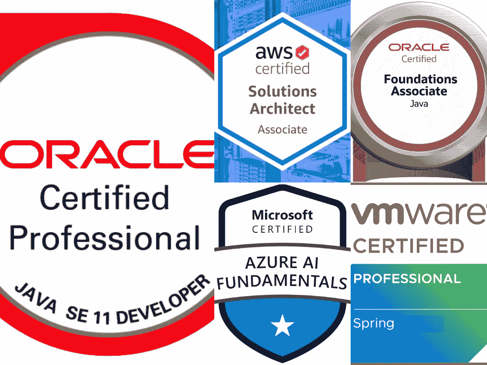
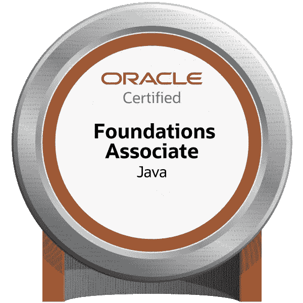
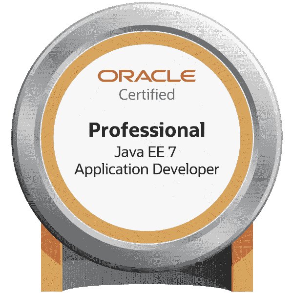
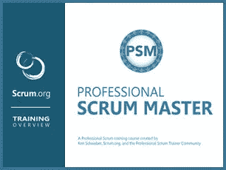
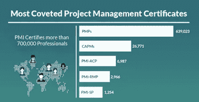
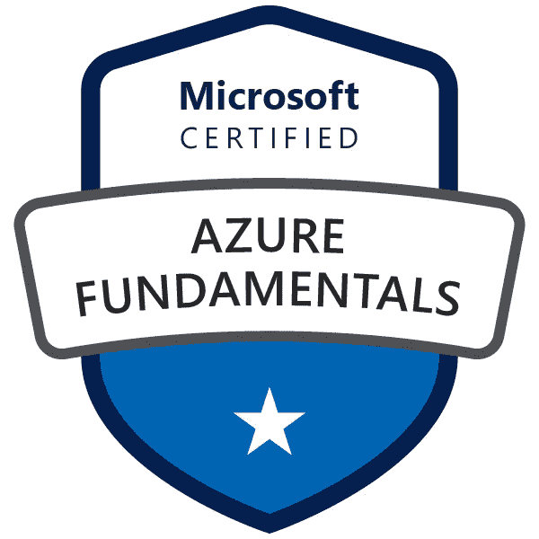
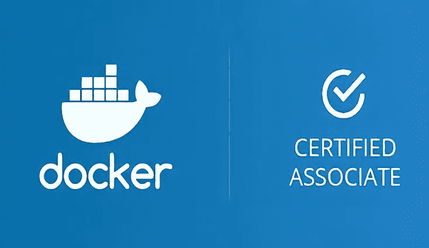

# 2023 年 Java 开发人员应该瞄准的 10 个最佳 IT 认证

> 原文：<https://medium.com/javarevisited/10-best-it-certifications-for-java-developers-5b4a78e3605d?source=collection_archive---------0----------------------->

## 从 Java 和 Spring 到 AWS 和 Azure，这些都是 Java 开发者在 2023 年可以争取的最好的 IT 认证

你好，Java 程序员，如果你正在寻找最好的 IT 认证来发展你的职业生涯，或者寻找一条新的职业道路，那么你并不孤单。不断学习是成为程序员的一部分，IT 认证在你的 IT 职业生涯中起着至关重要的作用。

认证有许多有形和无形的好处。首先，他们鼓励你学习更多，成为你所在领域的专家；其次，他们认可你的技能和知识。

如果你是一名 Java 开发人员，并且想知道你可以通过哪些 IT 认证来让你的职业生涯更上一层楼，那么你来对地方了。

在这篇文章中，我将分享给 Java 开发人员的**最佳 IT 认证**，其中包括不同的领域，如 [Java](/javarevisited/top-5-java-online-courses-for-beginners-best-of-lot-1e1e240a758) 、 [Spring](/javarevisited/top-5-spring-professional-certification-exam-resources-for-java-developers-3ef9fa42fe13) 、 [Cloud](/javarevisited/10-best-aws-google-cloud-and-azure-courses-and-certification-from-coursera-to-join-in-2021-5c5e2029a8e7) 、 [Linux](/javarevisited/7-best-linux-courses-for-developers-cloud-engineers-and-devops-in-2021-7415314087e1) 、[项目管理](/javarevisited/10-best-project-management-courses-to-learn-online-f3e15802fe86)等。你可以选择符合你职业目标的认证。

比如，假设你想成为一名高级 Java 开发人员。在这种情况下，你应该瞄准 [Java SE 认证](https://javarevisited.blogspot.com/2019/12/how-to-crack-java-se-11-certification.html)和 [Spring 专业认证](https://www.java67.com/2019/06/core-spring-professional-50-topics-guide-java-developers.html)。如果你想走向云计算，你应该瞄准 AWS 和云认证，如果你想成为项目经理，你可以申请 PMP 认证。许多程序员把学习一门新的编程语言、一个新的框架、一个新的库、一个新的工具作为目标，或者获得一些认证，以使自己更有价值。我在更新的[**2023 Java 开发者路线图**](https://javarevisited.blogspot.com/2019/10/the-java-developer-roadmap.html) 中分享了其中的一些，以防你需要一些启发。

回到这篇文章，我最近收到一封来自我的一位读者的邮件，询问关于*他今年应该做哪些 Java 认证？*我问他做过哪些 Java 认证，在 Java 领域有多少经验？

他回答说还没有做任何认证，现在在 Java 工作 2 年了。像我们许多人一样，他是一名 Java Web 开发人员，在前端使用标准的 Web 堆栈，如 [HTML](https://javarevisited.blogspot.com/2019/05/top-5-html-5-and-css-3-courses-for-web-developers.html) 、 [CSS](https://www.java67.com/2018/02/5-free-html-and-css-courses-to-learn-web-development.html) 、 [JavaScript](https://javarevisited.blogspot.com/2018/06/top-10-courses-to-learn-javascript-in.html) 、 [React](https://javarevisited.blogspot.com/2018/08/top-5-react-js-and-redux-courses-to-learn-online.html) ，在后端使用 [Spring Boot](https://www.java67.com/2018/06/5-best-courses-to-learn-spring-boot-in.html) 、 [Hibernate](https://javarevisited.blogspot.com/2018/01/top-5-hibernate-and-jpa-courses-for-java-programmers-learn-online.html) 和 [Java](https://javarevisited.blogspot.com/2017/12/10-things-java-programmers-should-learn.html#axzz5atl0BngO) 。

由于他至今还没有做过任何认证，我建议他先从 OCAJP(Oracle 认证 Java 程序员协会)开始，然后再去参加其他等级的 Java 认证。

那封邮件还鼓励我写 2023 年 Java 开发者可以考哪些认证。答案取决于您的经验、您正在从事的工作、您的目标以及到目前为止您已经完成的其他 Java 认证。

# 2023 年 Java 程序员的 10 个最佳认证

事不宜迟，下面是我列出的 2023 年 Java 开发人员可以参加的 10 大认证。

该列表包括强制性的 Java 认证，如 Java SE 11 开发者认证，以及其他流行的 Java 相关技术的 IT 认证，如 [Spring](https://javarevisited.blogspot.com/2018/06/top-6-spring-framework-online-courses-Java-programmers.html) 、 [Scala](https://javarevisited.blogspot.com/2019/01/5-free-scala-programming-courses-for-java-programmers-learn-online.html) 、 [Apache Spark](https://javarevisited.blogspot.com/2017/12/top-5-courses-to-learn-big-data-and.html#axzz5bKDxWpoU) 、 [Docker](https://javarevisited.blogspot.com/2019/05/top-5-courses-to-learn-docker-and-kubernetes-for-devops.html) 、 [Kubernetes](https://javarevisited.blogspot.com/2019/01/top-5-free-kubernetes-courses-for-DevOps-Engineer.html) 。

以及掌握经验丰富的 Java 程序员应该掌握的其他基本技能的认证，如敏捷、Scrum、项目管理和架构师级别的考试。

这些认证没有特定的顺序，但是我建议 Java 开发人员通过 Java SE 开发人员认证，然后转到其他认证。

但是，这不是一个硬性规定；举个例子，如果你觉得自己擅长 Spring，可以直接去 [Spring 认证](/javarevisited/spring-professional-certification-vmware-edu-1202-the-ultimate-guide-to-pass-spring-11dab8d311c3)，但是如果有核心 Java 认证的话在简历里更好看。

## 1.Oracle 认证专家:Java SE 11 开发人员(OCPJD)

这个 Java 认证的重点是核心 Java，你可以借此把自己和其他几个没有通过认证的 Java 专业人士区分开来。

如果你想成为一名认证的 Java 开发人员，那么这个认证是一个很好的开始。您需要熟悉 Java SE 11 之前的核心 Java 概念，但是大多数主题都来自 Java SE 8，除了 Java 9、10 和 11 版本中的模块和一些小的增强。

与 Java SE 8 考试不同，在 Java SE 8 考试中，您需要通过 OCAJP 和 OCPJP 两项考试才能成为认证 Java 专家，而这次您只需通过一项 1z 0–819 考试即可成为认证 Java 专家。

以下是一些有用的链接，可帮助您了解有关该认证的更多信息:

1.  [官方考试指南](https://education.oracle.com/java-se-11-developer/pexam_1Z0-819)
2.  [推荐课程](/javarevisited/5-best-books-courses-and-practice-tests-to-crack-java-se-11-certification-ocajp-11-1z0-815-6c861d6d147f)
3.  [推荐书籍](https://www.amazon.com/dp/1086955811/?tag=javamysqlanta-20)

而且，如果你对这个考试很认真，我强烈推荐你推荐 Udemy 上的[**Java SE 11 Developer 1z 0–819 OCP 课程——第一部分**](https://click.linksynergy.com/deeplink?id=CuIbQrBnhiw&mid=39197&murl=https%3A%2F%2Fwww.udemy.com%2Fcourse%2Fjava-se-11-developer-1z0-819-ocp-course-part-1%2F) 和第二部分课程。

<https://click.linksynergy.com/deeplink?id=CuIbQrBnhiw&mid=39197&murl=https%3A%2F%2Fwww.udemy.com%2Fcourse%2Fjava-se-11-developer-1z0-819-ocp-course-part-1%2F>  

## 2.VMware 的 Spring 专业认证

Spring 专业认证考试旨在测试和验证您对 Spring 框架的理解和熟悉程度。

如果您是从事 Spring 技术的 Java web 开发人员，那么您可以通过这个认证来证明自己是 Java Web 开发领域中一名经验丰富且有能力的 Spring 专业人员。

如果你决定在 2023 年进行春季认证，那么 Udemy 的 [**春季专业认证考试教程—模块 01 至模块 08**](https://click.linksynergy.com/deeplink?id=CuIbQrBnhiw&mid=39197&murl=https%3A%2F%2Fwww.udemy.com%2Fcourse%2Fspring-certified-tutorial%2F) 课程是合适的入手点。你只需花 10.99 美元就可以在 Udemy 的 flash 销售上获得这门课程，这种情况时有发生。

以下是一些有用的链接，可帮助您了解有关该认证的更多信息:

1.  [官方考试指南](https://d1fto35gcfffzn.cloudfront.net/academy/Core-Spring-5.0-Certification-Study-Guide.pdf)
2.  [推荐课程](/javarevisited/3-best-spring-professionals-certification-books-and-courses-for-java-developers-935296c3709)
3.  [推荐书籍](https://www.java67.com/2017/07/3-spring-certification-books-best-of.html)

如果需要更多帮助，还可以看我的博文[2023 年如何破解 Spring v5.0 认证](https://javarevisited.blogspot.com/2018/08/how-to-crack-spring-core-professional-certification-exam-java-latest.html#axzz5j90KOik7)。

<https://click.linksynergy.com/deeplink?id=CuIbQrBnhiw&mid=39197&murl=https%3A%2F%2Fwww.udemy.com%2Fcourse%2Fspring-certified-tutorial%2F>  

## 3.Java 认证基础助理

如果 Java 开发人员是 Java 世界的新手，这应该是他应该参加的第一个认证。之前被称为 [OCAJP](/javarevisited/top-7-practice-tests-and-mock-exams-to-prepare-for-oracles-java-certifications-ocajp-and-ocpjp-36502d4ca061) 或简称 OCA，现在它有了一个新名字，Java 基础考试编号:1z 0–811。

这是一个**基础**水平考试。通过这个考试可以获得证明您理解 Java 编程语言和概念的证书。

它将验证您在如何编写和执行 Java 程序、使用 Java 开发工具包(JDK)和 Java 运行时环境(JRE)方面的概念和技能。

如果你今年正朝着 [OCAJP 11](https://javarevisited.blogspot.com/2018/08/latest-OCPJP-exam-java-8-certification-oracle-java-se-8.html) 努力，建议你先看看官方考试指南。这将有助于您掌握 Java 的基础知识。以下是一些有用的链接，可以帮助您了解更多关于该认证的信息:

1.  [官方考试指南](https://education.oracle.com/java-foundations/pexam_1Z0-811)
2.  [推荐课程](https://click.linksynergy.com/fs-bin/click?id=JVFxdTr9V80&subid=0&offerid=323058.1&type=10&tmpid=14538&RD_PARM1=https%3A%2F%2Fwww.udemy.com%2Fjava-the-complete-java-developer-course%2F)
3.  [推荐书籍](https://www.amazon.com/Oracle-Certified-Professional-Programmer-Study/dp/1119584701?tag=javamysqlanta-20)

## 4.Java EE 7 应用程序开发人员(1z 0–900)

Java EE 7 Application Developer(1z 0–900)面向使用 [Java EE](/javarevisited/top-7-online-courses-to-learn-java-ee-jakarta-ee-in-2020-216c1a5eea99) 的 Java Web 开发人员，他们擅长应用 Java 服务器页面、Java 持久性、EJB 和 Servlet 3.0 等 Servlet 技术来开发 Web 服务和动态 Web 内容。

通过 OCAJP 和 OCPJP 的考试后，你就可以申请这个认证。你也可以和 Spring 一起参加这个认证，因为 Spring MVC 内部依赖于 Servlet、JSP 和 JSF。

如果你想像 JSF 一样开始学习 Java web 技术，那么面向初学者的 Java Server Faces 是一门很好的课程。

重要细节:

*   **格式:**多选
*   **时长:** 110 分钟
*   **考试价格:** $339
*   问题数量:70
*   **及格分数:** 66%
*   **验证:**考试已经通过了 Java EE 7 的验证。

此外，以下是一些有用的链接，可帮助您了解有关该认证的更多信息:

1.  [官方考试指南](https://education.oracle.com/java-ee-7-application-developer/pexam_1Z0-900)
2.  [推荐课程](https://click.linksynergy.com/deeplink?id=CuIbQrBnhiw&mid=39197&murl=https%3A%2F%2Fwww.udemy.com%2Fcourse%2Fjava-enterprise-edition-8%2F)
3.  [推荐书籍](https://javarevisited.blogspot.com/2016/06/2-books-to-prepare-java-ee-6-web-component-exam-1z0-899-OCEJWCD.html)

## 5.Apache Spark 开发人员认证— HDPCD

Hortonworks 大学宣布了一项针对 Hortonworks 数据平台上的 Apache Spark 的新的基于性能的实践认证。

本次 Spark 认证考试专为负责用 [Scala](https://javarevisited.blogspot.com/2019/01/5-free-scala-programming-courses-for-java-programmers-learn-online.html) 或 [Python](https://dev.to/javinpaul/top-5-places-to-learn-python-programming-for-free-m4c) 开发 Spark Core 和 Spark SQL 应用的开发人员设计。了解 Scala 的 Java 开发人员可以参加这个考试，证明自己是大数据工作场所中有经验、有能力的专业人士。

它非常适合希望投身大数据世界并希望在 2023 年成为数据科学家的 Java 开发人员。如果你决定参加这个认证，那么 Apache Spark 和 Scala 认证培训是一个很好的起点。以下是一些有用的链接，可帮助您了解更多关于该认证的信息:

1.  [官方考试指南](https://learn.hortonworks.com/hdp-certified-spark-developer-hdpcsd2019-exam)
2.  [推荐课程](https://www.shareasale.com/r.cfm?b=1195106&u=880419&m=43514&urllink=&afftrack=)

## 6.专业 Scrum Master 认证— PSM I

专业 Scrum Master (PSM)认证是公认的最受欢迎的敏捷认证之一，它让你掌握 Scrum 及其应用的专业知识。对于想要成为 [Scrum Master](https://javarevisited.blogspot.com/2017/06/top-5-books-to-learn-agile-and-scrum-methodology.html) 的有经验的 Java 专业人士来说，这是正确的认证，因为对 Scrum Master 的需求正在快速增长，并且它正在迅速取代许多项目管理工作。

现在很多大型组织和投资银行都在找 Scrum Masters，也是很强的 Java 开发者。

以下是一些有用的链接，可帮助您了解有关该认证的更多信息:

1.  [官方考试指南](https://www.scrum.org/professional-scrum-master-i-certification)
2.  [推荐资源](https://click.linksynergy.com/deeplink?id=JVFxdTr9V80&mid=39197&murl=https%3A%2F%2Fwww.udemy.com%2Fscrum-master-certification-preparation-mock-exam-questions-psm-i%2F)

## 7.PMP 项目管理专业认证

项目管理专家( [PMP](https://javarevisited.blogspot.com/2019/09/top-5-courses-to-crack-pmp-project-management-professional-certification-exam.html) )是项目管理学院(PMI)提供的最负盛名、全球公认的专业管理课程之一。

本课程基于 [PMBOK 指南第六版](https://www.amazon.com/Project-Management-Knowledge-PMBOK%C2%AE-Sixth/dp/1628251840?tag=javamysqlanta-20)，聚焦 5 个流程和 47 个知识领域，使您能够满足最新的业务需求。

如果你是一个有经验的 Java 开发人员，想进入项目管理领域，这是正确的认证。

以下是一些有用的链接，可帮助您了解更多关于该认证的信息:

1.  [官方考试指南](https://www.pmi.org/certifications/types/project-management-pmp/exam-prep)
2.  [推荐课程](https://click.linksynergy.com/deeplink?id=JVFxdTr9V80&mid=39197&murl=https%3A%2F%2Fwww.udemy.com%2Fpmp-pmbok6-35-pdus%2F)
3.  [推荐书籍(PMBOK 6 —指南)](https://www.amazon.com/Project-Management-Knowledge-PMBOK%C2%AE-Sixth/dp/1628251840?tag=javamysqlanta-20)

## 8.微软认证:Azure 基础知识

作为应用程序开发人员，我们面临的最大挑战是保持自己与时俱进，但与此同时，我们不可能对所有新技术都做到与时俱进。然而，云计算不在其中。

云托管改变了所有应用程序的开发方式，从网站到网络应用程序，再到移动应用程序和传统的后端应用程序。

云的快速采用已经触及了一切，这就是为什么我也建议 Java 开发人员了解云技术，如亚马逊 Web 服务( [AWS](/javarevisited/top-10-courses-to-learn-amazon-web-services-aws-cloud-in-2020-best-and-free-317f10d7c21d) )、谷歌云平台( [GCP](https://javarevisited.blogspot.com/2019/07/top-5-google-cloud-platform-gcp-courses-certifications-online.html) )或[微软 Azure](https://javarevisited.blogspot.com/2020/02/top-5-courses-to-crack-az-900-microsoft-azure-fundamentals-certification-exam.html) ，如果你选择 Azure，那么没有比这更好的认证了。

对于希望了解云的确切工作原理以及如何使用不同的 Azure 服务在云中运行应用程序的技术人员，以及像 BA、项目经理、参与购买基于云的解决方案和服务的销售人员这样的非技术人员来说，AZ-900 是一个很好的敲门砖。

以下是一些有用的链接，可帮助您了解有关该认证的更多信息:

1.  [官方考试指南](https://docs.microsoft.com/en-us/learn/certifications/azure-fundamentals/)
2.  [推荐资源](/javarevisited/5-best-azure-fundamentals-courses-to-pass-az-900-certification-exam-in-2020-9e602aea035d)

该认证将为您提供开发云所需的必要基础，尤其是 Microsoft Azure。

如果你决定去参加这个认证，那么 Coursera 上的 [**微软 Azure 基础 AZ-900 考试准备专业化**](https://coursera.pxf.io/c/3294490/1164545/14726?u=https%3A%2F%2Fwww.coursera.org%2Fspecializations%2Fmicrosoft-azure-fundamentals-az-900) 也是一个很好的起点。这个程序是由微软自己提供的，所以你可以从源代码中学习。

<https://coursera.pxf.io/c/3294490/1164545/14726?u=https%3A%2F%2Fwww.coursera.org%2Fspecializations%2Fmicrosoft-azure-fundamentals-az-900>  

您可以单独加入这一专业，也可以参加[**Coursera Plus 订阅**](https://coursera.pxf.io/c/3294490/1164545/14726?u=https%3A%2F%2Fwww.coursera.org%2Fcourseraplus) ，该订阅为您提供每年 399 美元的无限制 Coursera 认证访问权限。

<https://coursera.pxf.io/c/3294490/1164545/14726?u=https%3A%2F%2Fwww.coursera.org%2Fcourseraplus>  

## 9.AWS 认证解决方案架构师助理

AWS 认证解决方案架构师助理考试面向具有在 AWS 平台上设计分布式应用程序和系统经验的个人。

如果您是一名经验丰富的 Java 开发人员，并且希望成为解决方案架构师或软件架构师，那么基于云的应用程序的知识是必不可少的。

以下是一些有用的资源，您可以从中了解更多信息，为此次认证做好准备

1.  [官方考试指南](https://aws.amazon.com/certification/certified-solutions-architect-associate/)
2.  [推荐课程](/javarevisited/top-5-aws-training-courses-to-crack-amazon-web-service-solutions-architect-associate-certification-3f4affa8f660)
3.  [推荐书籍](https://javarevisited.blogspot.com/2019/08/how-to-crack-aws-certified-solution-architect-exam.html)

该认证将帮助您掌握在 AWS 上设计和部署可伸缩、高可用性和容错系统的艺术。如果你决定在 2023 年参加这个认证，我建议你查看 Udemy 上夏羽·马瑞克的 [**终极 AWS 认证解决方案架构师助理 2023**](https://click.linksynergy.com/deeplink?id=CuIbQrBnhiw&mid=39197&murl=https%3A%2F%2Fwww.udemy.com%2Fcourse%2Faws-certified-solutions-architect-associate-saa-c02%2F) 做好准备。

<https://click.linksynergy.com/deeplink?id=CuIbQrBnhiw&mid=39197&murl=https%3A%2F%2Fwww.udemy.com%2Fcourse%2Faws-certified-solutions-architect-associate-saa-c02%2F>  

## 10.**码头工人注册助理考试**

最后，对于依赖 Docker 部署 Java 微服务的云原生 Java 开发人员来说，这是最有用的认证之一。

[Docker 认证助理考试](/javarevisited/10-best-courses-and-practice-tests-to-crack-docker-certified-associate-dca-certification-exam-b0b21648df4e)旨在验证开发人员和开发人员等 IT 专业人员在核心现实问题上的 Docker 技能组合。

问题由经验丰富的码头工人设计。如果你通过了这次考试，那么你将有资格申请任何码头工人的职位，因为这次考试在工作面试中排名很高。作为一名 Java 开发人员，你也可以用它来展示你的 Docker 技能。

以下是一些有用的资源，可帮助您了解更多信息，并为此认证做好准备

1.  [官方考试指南](https://www.docker.com/)
2.  [推荐资源](/javarevisited/10-best-courses-and-practice-tests-to-crack-docker-certified-associate-dca-certification-exam-b0b21648df4e)

如果您是一名高级 Java 开发人员，并且希望在职业生涯中成为软件架构师或解决方案架构师，这个认证可以帮助您实现这一目标。如果你需要课程准备，建议你参加 Udemy 上 Zeal Vora 的[**Docker Certified Associate 2023**](https://click.linksynergy.com/deeplink?id=CuIbQrBnhiw&mid=39197&murl=https%3A%2F%2Fwww.udemy.com%2Fcourse%2Fdocker-certified-associate%2F)课程。

<https://click.linksynergy.com/deeplink?id=CuIbQrBnhiw&mid=39197&murl=https%3A%2F%2Fwww.udemy.com%2Fcourse%2Fdocker-certified-associate%2F>  

以上是 Java 开发人员的一些**最佳 IT 认证。如果你正在寻求改变，你可以瞄准 2023 年的这些认证，给你的职业生涯一个新的推动，并找到一份更好的工作。**

它们不仅会让你成为简历上有价值的候选人，还会提高你对 Java 和 Spring 这两种对 Java 开发人员来说最重要的技术的知识和理解。如果您决定参加任何认证，这里有一些对您有用的资源

其他**您可能喜欢的编程文章**

*   [2023 年 Java 和 Web 开发人员应该学会的 10 件事](http://javarevisited.blogspot.sg/2017/12/10-things-java-programmers-should-learn.html#axzz53ENLS1RB)
*   [Java 开发者应该知道的 10 个测试工具](http://javarevisited.blogspot.sg/2018/01/10-unit-testing-and-integration-tools-for-java-programmers.html)
*   [2023 年 Java 开发者应该学习的 5 个框架](http://javarevisited.blogspot.sg/2018/04/top-5-java-frameworks-to-learn-in-2018_27.html)
*   [每个 Java 程序员在 2023 年应该读的 10 本书](http://www.java67.com/2018/02/10-books-java-developers-should-read-in.html)
*   【Java 开发人员在日常工作中使用的 10 个工具
*   [云专业人员十大 AWS 认证](https://javarevisited.blogspot.com/2020/09/top-10-aws-certifications-for-cloud-professionals.html)
*   [成为更好的 Java 开发人员的 10 个技巧](https://javarevisited.blogspot.com/2018/05/10-tips-to-become-better-java-developer.html)
*   [2023 年网络开发者路线图](https://hackernoon.com/the-2019-web-developer-roadmap-ab89ac3c380e)
*   [学习数据结构和算法的 10 门课程](https://hackernoon.com/10-data-structure-algorithms-and-programming-courses-to-crack-any-coding-interview-e1c50b30b927)
*   [如何通过 Java 认证？](https://medium.freecodecamp.org/how-to-pass-oracles-java-certifications-a-practical-guide-for-developers-e9b607ba6173)
*   [2023 年加入的 10 个最佳 Coursera 认证](https://javarevisited.blogspot.com/2020/08/top-10-coursera-courses-specilizations-and-certifications.html)
*   [如何破解 Spring 5.0 开发者认证](https://www.java67.com/2019/06/core-spring-professional-50-topics-guide-java-developers.html)。
*   [成为全栈 Java 开发人员的前 5 门课程](https://javarevisited.blogspot.com/2020/04/top-5-courses-to-become-full-stack-java-developer-with-Angular-and-Reactjs.html#axzz6Nq9yk7Sc)
*   [2023 年破解编码技能的 5 个必备技能](https://javarevisited.blogspot.com/2020/04/5-essential-skills-to-crack-coding-interviews.html)
*   [如何破解 AWS 解决方案架构师认证](https://javarevisited.blogspot.com/2019/08/how-to-crack-aws-certified-solution-architect-exam.html)
*   [2023 年你可以瞄准的 10 项最佳云认证](https://www.java67.com/2020/09/top-10-cloud-certification-you-can-aim.html)

感谢您阅读本文。如果你觉得这些 Java 程序员最佳 IT 认证有用且有价值，那么请与你的朋友和同事分享。如果您有任何问题或反馈，请留言，如果您通过了这些认证，您也可以与我们分享您的经验。

</javarevisited/the-java-programmer-roadmap-f9db163ef2c2> 