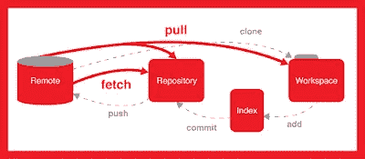
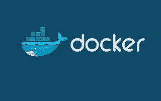
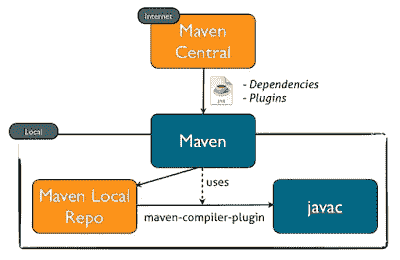
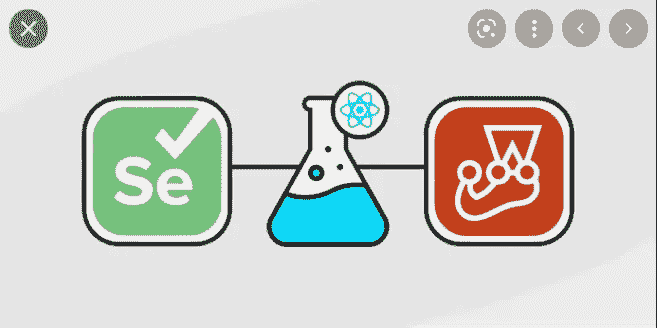

# 2023 年 Java 开发人员应该学习的 10 大工具

> 原文：<https://medium.com/javarevisited/10-best-java-development-tools-you-can-learn-66f7d4d837e6?source=collection_archive---------1----------------------->

## 这些是每个 Java 程序员在 2023 年应该学习的最好的 Java 开发工具，包括用 Java 编码、调试、测试和构建 Java 应用程序的工具。

大家好，俗话说工匠和工具一样好，如果软件开发是一门手艺，那么你和你的工具一样好。如果你是一名 Java 程序员，并且想学习工具来提高你的 Java 开发技能，那么你来对地方了。

在这篇文章中，我将分享每个 Java 程序员都应该学习的 10 个工具，包括版本控制工具如 [Git](/javarevisited/top-10-free-courses-to-learn-git-and-github-best-of-lot-967aa314ea) ，构建工具如 [Maven 和 Gradle](/javarevisited/why-java-developer-should-learn-maven-or-gradle-aefe7ea20a83) ，编码工具如 [IDEA](/javarevisited/7-best-courses-to-learn-intellij-idea-for-beginners-and-experienced-java-programmers-2e9aa9bb0c05) 、 [Eclipse](/javarevisited/6-free-best-eclipse-ide-courses-for-java-programmers-1229ee9e5d87) 和 NetBeans，调试工具，测试工具如 [JUnit 和 Mockito](/javarevisited/5-courses-to-learn-junit-and-mockito-in-2019-best-of-lot-f217d8b93688) ，部署工具如 [Docker](/javarevisited/5-best-docker-courses-for-java-and-spring-boot-developers-bbf01c5e6542) 和 [Kubernetes](/javarevisited/10-best-kubernetes-courses-for-developers-and-devops-engineers-94c35cd3a2fd) 等等。

我已经写了一系列文章，给你一些关于你可以学习和改进的东西，以便在 2023 年成为一个更好的、全面的开发者，比如学习新的[编程语言](http://www.java67.com/2017/12/10-programming-languages-to-learn-in.html)、[框架](https://javarevisited.blogspot.com/2018/01/10-frameworks-java-and-web-developers-should-learn.html)和[库](https://javarevisited.blogspot.com/2018/01/top-20-libraries-and-apis-for-java-programmers.html)，在这篇文章中，我将分享你 Java 开发的基本工具。

这三件事非常重要，有助于你成为一名更好的 Java 开发人员，但是正如某位智者所说的那样，**“你的工具有多好，你就有多好”**，你还应该升级你的工具，学习新的工具，并提高你对仍然运行良好的旧工具的理解。

为了帮助大家在 2023 年可以学习哪些工具，我整理出了一份[**Java 开发人员必备的 10 个工具**](https://javarevisited.blogspot.com/2019/02/10-tools-advanced-java-developers-should-know.html) ，我准备在本文中与大家分享。在过去，我确实为 Java 程序员分享了一些有用的测试工具，而这篇文章是它的延伸，因为它涵盖了比自动化测试工具更多的内容。

它包括 ide 等基本编码工具，JIRA[等项目管理工具，Git](https://javarevisited.blogspot.com/2020/08/top-5-courses-to-learn-jira-for.html) 等源代码控制基本工具，以及 Maven 和 Gradle 等构建工具。

很有可能您已经熟悉了一些工具，在这种情况下，您可以简单地忽略它们或学习它来进一步提高您对它们的理解。

这些都是必不可少的工具，这意味着作为 2023 年的 Java 开发者，许多公司期望你已经知道这些工具。他们经常在你的简历中寻找这些工具的参考资料，如果你忘记在简历中加入关于这些工具的经验和知识，他们通常会忽略你的简历。

顺便说一句，这也是我为 Java 开发人员列出的第二个工具列表，去年，我已经分享了 Java 程序员在日常生活中使用的前 [**10 个工具**](https://javarevisited.blogspot.com/2017/03/10-tools-used-by-java-programming-Developers.html#axzz55lrMRnNC) ，其中也包括一些 Java 开发人员使用的更通用的日常工具。如果需要更多的工具，也可以参考一下，获取更多的思路。

# 2023 年每个 Java 开发人员都应该学习的 10 个工具

我说的基本工具是指你必须知道的东西，但列表中也包含一些更高级的工具，即使你不知道你能做得很好，但知道它们会进一步提高你的声誉，让你更有价值，还可能有助于你的职业发展，特别是如果你希望在 2023 年成为一名 [DevOps 工程师](https://javarevisited.blogspot.com/2018/09/10-devops-courses-for-experienced-java-developers.html)。

我尝试过包含来自代码库、项目规划、构建和部署、测试自动化和基础设施自动化的工具。作为负责端到端管理项目的高级 Java 开发人员，这些工具将帮助您更有效地完成工作。

反正事不宜迟，我们来看看 Java 程序员必备的一些工具。

## 1.饭桶

我认为 Git 和 Github 应该是所有 Java 程序员最基本的工具，包括有经验的开发人员，他们应该学习和掌握高级 Git 概念，如分支、合并和恢复更改。

我知道你们中的许多人已经知道 Git，但是那些仍然在 SVN 和 CVS 工作的人今年认真考虑学习 Git 和 Github。即使你在当前的项目中不使用 Git，你也无法避免它。它已经成为一个标准的源代码库，大多数新的开发都在使用 Git。

如果你是初学者，我建议你先去看看 [**GitHub 终极课程**](https://click.linksynergy.com/deeplink?id=JVFxdTr9V80&mid=39197&murl=https%3A%2F%2Fwww.udemy.com%2Fgithub-ultimate%2F) 吧。即使您知道 Git，您仍然可以学习一些东西，比如 Git 命令行，以进一步提高您的知识。你在学习 Git 上投入的所有时间和金钱将会为你服务很长一段时间。

## 2.码头工人

Docker 是一个工具，允许用户从组件中快速组装应用程序并协同工作。如果你从事 web 开发，比如开发和部署云应用，那么 Docker 是一个必不可少的学习工具。

这适用于将应用程序的容器作为单个组进行管理，并将应用程序的容器进行群集，以优化资源并提供高可用性。

如果你对学习 Docker 很认真，那么我建议你在你的项目中使用它之前，先浏览一下 [**Docker 和 Kubernetes 完全指南**](https://click.linksynergy.com/deeplink?id=JVFxdTr9V80&mid=39197&murl=https%3A%2F%2Fwww.udemy.com%2Fdocker-and-kubernetes-the-complete-guide%2F) 。

## 3.专家

这是 Java 程序员的另一个重要工具，可以帮助您构建和管理 Java 项目。它已经存在很长时间了，很有可能你已经听说过 [Maven](https://javarevisited.blogspot.com/2019/03/top-5-course-to-learn-apache-maven-for.html#axzz645Kt2tH8) 或者在你的项目中使用过它。

它不仅可以帮助你构建你的项目，比如编译源文件，还可以运行你的[单元测试](https://javarevisited.blogspot.com/2021/04/junit-interview-questions-with-answers.html)，并可以将你的工件或交付物部署到真实的环境中。它还有助于管理依赖项，比如您在项目中使用的所有第三方 JAR 文件。

没有了 Maven，这可真是一场噩梦。简而言之，2023 年所有 Java 开发者都应该知道 Maven，如果你正在寻找一门优秀的课程开始，你可以查看 Udemy 的 [**Apache Maven:初学者到大师**](https://click.linksynergy.com/deeplink?id=JVFxdTr9V80&mid=39197&murl=https%3A%2F%2Fwww.udemy.com%2Fapache-maven-beginner-to-guru%2F) 课程，这是学习 Maven 的最佳课程之一。

## 4.詹金斯

Jenkins 是 Java 开发人员的另一个重要工具，尤其是那些希望成为 DevOps 专业人员的人。这是一个持续集成工具，这意味着它可以持续地构建、测试和部署您的项目。在我们的例子中，每次有人签入他们的代码时，Jenkins 都会自动运行构建。它还安排了每夜和每小时的构建，以自动构建和测试我们的项目。

如果你是一名高级 Java 开发人员，喜欢有 5 年以上经验的人，而你不了解 Jenkins，那么你应该认真考虑学习一下。如果你决定学习詹金斯，那么[**Learn devo PS:Jenkins CI/CD with Docker**](https://click.linksynergy.com/deeplink?id=JVFxdTr9V80&mid=39197&murl=https%3A%2F%2Fwww.udemy.com%2Flearn-devops-ci-cd-with-jenkins-using-pipelines-and-docker%2F)是一个很好的开始课程。

## 5.硒

对于 Java 开发人员，尤其是 Java web 开发人员来说，这是另一个优秀的工具。Selenium 是一个用于 web 浏览器自动化的工具，这意味着您可以使用 Selenium 测试您的 web 页面，如使用 [HTML](http://www.java67.com/2018/02/5-free-html-and-css-courses-to-learn-web-development.html) 和 [JavaScript](http://www.java67.com/2018/04/top-5-free-javascript-courses-to-learn.html) 编写的 [JSP](http://www.java67.com/2018/02/5-free-servlet-jsp-and-jdbc-online-courses-for-java-developers.html) 和静态页面。

它为创作测试提供了回放工具，无需学习测试脚本语言。如今它变得越来越流行，这就是为什么学习不仅能帮助你写出更好的代码，还能让你变得更有价值。

如果你对 2023 年学习 Selenium 很认真，我建议你从 Pluralsight 上的 [**使用 Selenium 的自动化 web 测试**](https://pluralsight.pxf.io/c/1193463/424552/7490?u=https%3A%2F%2Fwww.pluralsight.com%2Fcourses%2Fselenium) 开始，学习如何为 Web 应用编写自动化测试。

## 6.JIRA

在 Git 之后，我认为 JIRA 是任何 Java 开发者或者说任何程序员的第二重要的工具。它已经迅速成为许多组织的头号计划和 bug 跟踪工具。如果你在一个敏捷团队中工作，比如跟踪冲刺进度和参加 Scrum 会议，那么 JIRA 就更加重要。凭借其支持敏捷方法的所有能力，它是敏捷团队的必备工具。

你甚至可以通过深入了解 JIRA 给你的经理和同事留下深刻印象，就像你可以帮助你的团队创建一个 Sprint 仪表盘一样。如果你真的想在 2023 年学习 JIRA，那么 [**用真实世界的例子学习 JIRA**](https://click.linksynergy.com/deeplink?id=JVFxdTr9V80&mid=39197&murl=https%3A%2F%2Fwww.udemy.com%2Fthe-complete-guide-to-jira-with-real-world-examples%2F)是一个很好的课程，开始吧。

## 7.格拉德勒

对于 Java 开发人员来说，这是另一个重要的构建工具。与 Maven 类似，它也可以帮助您构建、测试和部署项目。它也像 Maven 一样管理依赖关系，但它使用 [Groovy](https://javarevisited.blogspot.com/2017/08/top-5-books-to-learn-groovy-for-java.html) 编写构建脚本，而不是由 [Maven](/javarevisited/top-10-free-courses-to-learn-maven-jenkins-and-docker-for-java-developers-51fa7a1e66f6) 使用的 XML。这意味着你可以编写比 Maven 更强大、更简洁的构建脚本。这是一个优秀的项目配置和构建自动化工具，如果你想学习 Gradle 或者想了解更多，请查看 Udemy 的 Gradle Masterclass 课程。

## 8.Splunk

这是另一个有用的监控工具，许多公司正在它们的开发生命周期中引入。这可以帮助你编写更好的代码，通过索引你的日志文件和使用机器学习来分析内容。

它通过领先的平台将机器数据转化为答案，以应对最棘手的 It、物联网和安全挑战。

公司正在使用 Splunk 来搜索、监控、分析和可视化机器数据。如果您想进一步了解 Splunk，Udemy 上的 [**完整的 Splunk 初级课程**](https://click.linksynergy.com/deeplink?id=JVFxdTr9V80&mid=39197&murl=https%3A%2F%2Fwww.udemy.com%2Fsplunker%2F) 是一个很好的起点。

## 9.厨师

这是基础设施自动化的另一个优秀工具，比如构建新的服务器和安装应用程序。厨师是用 [Ruby](http://www.java67.com/2018/02/5-free-ruby-and-rails-courses-to-learn-online.html) 和 [Erlang](https://javarevisited.blogspot.com/2022/01/top-5-courses-to-learn-erlang-for.html) 编写的配置管理工具。

它使用一种纯 Ruby 的、特定领域的语言来编写系统配置“菜谱”。有了 [Chef](https://javarevisited.blogspot.com/2021/11/top-5-online-courses-to-learn-chef-and-salt.html) ，你可以轻松管理服务器的大量服务。

每台服务器的手动修补、配置更新和服务安装等耗时活动都可以实现自动化。简而言之，对于负责管理环境的高级 Java 开发人员和 DevOps 工程师来说，这都是一个有用的工具。

如果您对 Chef 感兴趣，并在您的组织中使用它，那么我也建议您通过[**Chef Fundamentals**](https://click.linksynergy.com/deeplink?id=JVFxdTr9V80&mid=39197&murl=https%3A%2F%2Fwww.udemy.com%2Fchef-fundamentals-a-recipe-for-automating-infrastructure%2F)了解更多信息。

## 10.IntelliJ IDEA [Eclipse 或 NetBeans]

最后，对 Java 开发人员来说最重要的工具是 IDE。我确信你已经使用过 IDE，因为我几乎不知道哪个 Java 开发人员不使用 IDE，但是大多数用户只是学习一个 IDE，像 [Eclipse](http://www.java67.com/2018/02/5-free-eclipse-and-junit-online-courses-java-developers.html) 或 NetBeans，而忽略其他的。

[IntelliJ IDEA](/javarevisited/7-best-courses-to-learn-intellij-idea-for-beginners-and-experienced-java-programmers-2e9aa9bb0c05)就是其中之一，它被许多使用 Eclipse 的 Java 开发人员所忽略，但是它提供了更多。如果您碰巧已经知道 Eclipse，那么您可以学习它来进一步提高您的生产率。我发现许多复杂的项目更适合在 IntelliJ IDEA 中工作，它们对 Java 8 的支持也比 Eclipse 好得多。无论如何，如果你是认真的想在 2023 年学习这个 IDE，那么我建议你通过 [**IntelliJ IDEA Tricks 来提高 Java Devs 的生产力**](https://click.linksynergy.com/deeplink?id=JVFxdTr9V80&mid=39197&murl=https%3A%2F%2Fwww.udemy.com%2Fintellij-idea-secrets-double-your-coding-speed-in-2-hours%2F) 来进一步提高你的生产力。

这就是 Java 开发人员在 2023 年可以学习和掌握的**最基本的工具**，让他们变得更有价值，并提高他们的生产力。这个列表包含了很多工具，而且有可能你已经熟悉了其中的大部分，但是你还可以更好地学习它们，以便有效地使用它们。

俗话说，**你和你的工具一样好**，对于 Java 开发人员来说，熟悉能够改进编码、单元测试、开发、部署、基础设施自动化和持续集成的现代工具变得越来越重要，尤其是如果你想成为 DevOps 工程师或全栈 Java 开发人员

其他你可能喜欢的 **Java 和编程文章**

*   [2023 年 Java 开发者路线图](https://javarevisited.blogspot.com/2019/10/the-java-developer-roadmap.html#123)
*   [2023 年 Java 开发人员应该学会的 10 件事](http://javarevisited.blogspot.sg/2017/12/10-things-java-programmers-should-learn.html#axzz53JaDYLsP)
*   [成为全栈 Java 开发人员的前 5 门课程](https://javarevisited.blogspot.com/2020/04/top-5-courses-to-become-full-stack-java-developer-with-Angular-and-Reactjs.html)
*   [2023 年探索 10 种编程语言](http://www.java67.com/2017/12/10-programming-languages-to-learn-in.html)
*   [Java 和 Web 开发人员应该学习的 10 个框架](http://javarevisited.blogspot.sg/2018/01/10-frameworks-java-and-web-developers-should-learn.html)
*   [2023 年你可以读的 20 本 Java 书](/javarevisited/10-books-java-developers-should-read-in-2020-e6222f25cc72)
*   [面向有经验程序员的 10 门高级核心 Java 课程](https://javarevisited.blogspot.com/2020/04/top-10-advanced-core-java-courses-for-experienced-developers.html)
*   成为更好的 Java 程序员的 10 个技巧
*   [2023 年 DevOps 开发者路线图](https://javarevisited.blogspot.com/2018/10/the-2018-react-developer-roadmap.html)
*   为有经验的开发人员准备的 10 本高级 Java 书籍
*   [面向 Java 开发人员的 10 个自动化测试工具](https://javarevisited.blogspot.com/2018/01/10-unit-testing-and-integration-tools-for-java-programmers.html)
*   【Java 开发人员应该知道的 20 个 API 和库
*   [5 大春季和冬季培训课程](https://javarevisited.blogspot.com/2016/12/top-5-spring-and-hibernate-training-courses-java-jee-programmers.html)
*   【Java 开发人员的 10 门最佳 Spring 框架课程
*   [为有经验的开发人员开设的 10 门高级 Spring Boot 课程](/javarevisited/10-advanced-spring-boot-courses-for-experienced-java-developers-5e57606816bd?source=collection_home---4------0-----------------------)

感谢您阅读本文。如果你喜欢 2023 年学习的这些*最好的 Java 工具和库*，并且同意高级 Java 开发人员将从学习这些工具中受益，那么请将它们分享给你的朋友和同事。如果您有任何问题或反馈，请留言。

**附言**。—如果你想以优异的成绩开始 2023 年，那么我建议你加入 [**完整 Java 大师班**](https://click.linksynergy.com/deeplink?id=JVFxdTr9V80&mid=39197&murl=https%3A%2F%2Fwww.udemy.com%2Fjava-the-complete-java-developer-course%2F) ，这是一门最新的课程。它最近针对 Java 17 和更高版本进行了更新，并将在新的 Java 版本中进行更新。

 [## 2023 年供初学者在线学习的 5 大 Java 编程课程——最好的

### 如果你是计算机科学专业的毕业生，或者想学习 Java 并且正在寻找一些很棒的资源，比如…

javarevisited.blogspot.com](https://javarevisited.blogspot.com/2018/05/top-5-java-courses-for-beginners-to-learn-online.html)