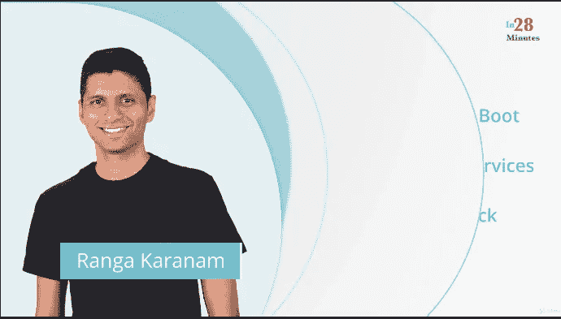
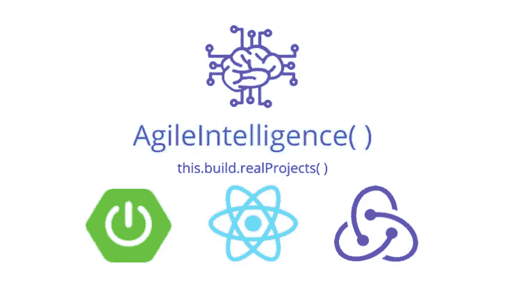
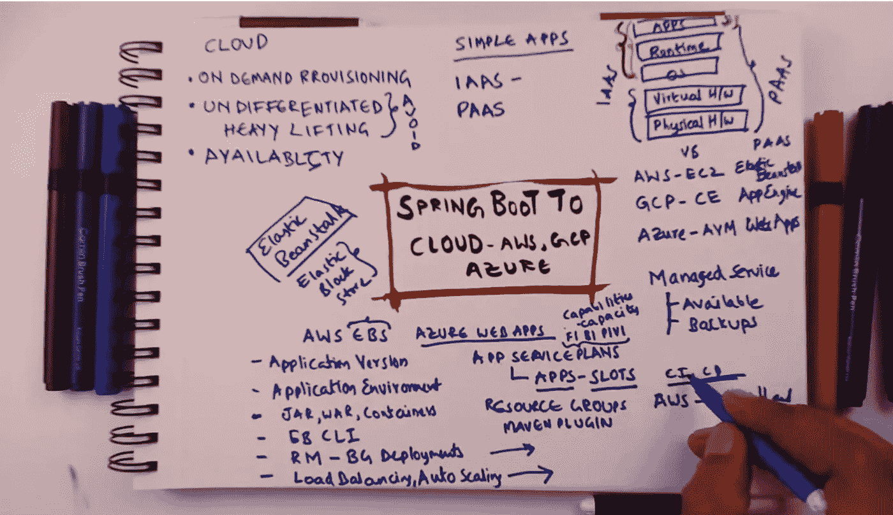
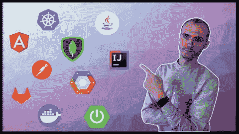

# 2023 年成为全栈 Java 程序员的 10 门最佳在线课程

> 原文：<https://medium.com/javarevisited/10-best-java-full-stack-web-development-courses-to-join-in-2020-6cd6cd2e5868?source=collection_archive---------0----------------------->

## 以上是 Udemy 为 Java 开发者提供的学习全栈 web 开发的最好的 Java+Spring Boot+Angular+react js+Kubernetes 课程。

你好伙计们，如果你想在 2023 年成为一名**全栈 Java 开发者**，但不确定你应该走什么路，如何到达那里，那么你来对地方了。

早些时候，我已经分享了 [10 门免费的全栈 Java 课程](/javarevisited/10-free-full-stack-java-development-courses-for-beginners-and-experienced-programmers-8473390bec03)，在本文中，我将分享最好的、更全面的在线培训课程，你可以选择这些课程成为全栈 Java 开发人员。

对[全栈 Java 开发者](/javarevisited/top-10-frameworks-full-stack-java-developers-can-learn-in-2020-5995021401e5)的需求非常高，因为 Java 是后端和服务器端开发的头号编程语言。

像 [Spring Boot](https://javarevisited.blogspot.com/2018/05/top-5-courses-to-learn-spring-boot-in.html) 和 [Spring Cloud](https://javarevisited.blogspot.com/2018/07/top-5-books-to-learn-spring-boot-and-spring-cloud-java.html) 这样的框架也在引领微服务架构开发，更适合部署在像 [AWS](https://javarevisited.blogspot.com/2020/09/top-10-aws-certifications-for-cloud-professionals.html) 、 [Azure](/javarevisited/5-best-azure-fundamentals-courses-to-pass-az-900-certification-exam-in-2020-9e602aea035d) 和 [Google 云平台](https://www.java67.com/2020/10/5-free-courses-to-pass-google-cloud-professional-cloud-devops-engineer-certificaiton.html)这样的云端。

在本文中，你会发现像 Udemy、Coursera 和 Pluralsight 这样的网站上的课程，在那里你不仅可以提高你的后端技能，还可以学习使用 React、Angular 和其他前端开发框架的现代前端开发。您还将学习全栈开发的必备工具，包括 [Docker](/javarevisited/top-15-online-courses-to-learn-docker-kubernetes-and-aws-for-fullstack-developers-and-devops-d8cc4f16e773) 、 [Kubernetes](https://dev.to/javinpaul/top-10-courses-to-learn-docker-and-kubernetes-for-programmers-4lg0) 、 [Jenkins](https://javarevisited.blogspot.com/2018/09/top-5-jenkins-courses-for-java-and-DevOps-Programmers.html) ，以及一些单元测试工具。

现在的大问题是，一个 Java 开发者要成为一个全栈的 Java 开发者应该学习什么？最起码，他应该知道一个前端框架或库，如 [Angular](https://angular.io/) 或 [React](https://reactjs.org/) 以及一个后端框架，如 Spring 或 [Spring Boot](https://spring.io/projects/spring-boot) 。最佳组合是 Spring Boot + Angular 或 Spring Boot + React，但如果你懂 Java、JSP 和 Spring，那么你也是合格的全栈 Java 开发者。我建议 Java 开发人员学习的另一件事是像 Docker、Jenkins 和 Kubernetes 这样的工具。从团队和组织的角度来看，高级开发人员应该推动 DevOps，学习这些工具可能会给你带来超越其他全栈开发人员的优势。

另一件事我强烈推荐全栈 Java 开发者了解云计算平台，比如 [AWS](/javarevisited/top-10-courses-to-learn-amazon-web-services-aws-cloud-in-2020-best-and-free-317f10d7c21d) 、 [Azure](https://javarevisited.blogspot.com/2020/02/top-5-courses-to-crack-az-900-microsoft-azure-fundamentals-certification-exam.html) 、 [GCP](https://javarevisited.blogspot.com/2019/07/top-5-google-cloud-platform-gcp-courses-certifications-online.html) 、Heroku 或者 Openshift。

2023 年，你很可能会开发云原生应用程序，而对云平台的良好了解对部署和开发云应用程序大有帮助。AWS 或 Azure 认证也可以让你比其他申请相同工作的全栈 Java 开发人员更有优势。

# 2023 年学习 Java 全栈开发的 10 门最佳在线课程

尽管您可以选择任何前端和后端框架进行全栈开发，但我强烈建议您选择 Angular 或 React with Frontend 和 Spring Boot with backend，这是全栈 Java 开发人员最受欢迎的标准栈。

在下面的列表中，您将找到可以帮助您学习 Spring Boot 和 Spring Cloud 用于[微服务开发](/javarevisited/top-5-courses-to-learn-microservices-in-java-and-spring-framework-e9fed1ba804d)的 Rect 和 Angular 的课程。

为了不浪费你更多的时间，这里是我列出的学习全栈 Java 开发的一些最好的在线课程。

## 1.[与 Spring Boot 一起使用 Java 全栈并做出反应](https://click.linksynergy.com/deeplink?id=JVFxdTr9V80&mid=39197&murl=https%3A%2F%2Fwww.udemy.com%2Fcourse%2Ffull-stack-application-with-spring-boot-and-react%2F)

有许多框架可以选择成为全栈 Java 开发人员，就像你可以学习 Angular、React、Vue 或普通 Servlet JSP 来实现前端和后端的 Spring 框架。

不过，如果你想用最好的技术，我建议你选择 React.js 做前端，Spring Boot 做后端。

在本课程中，您将通过使用 React、Spring Boot 和 Spring 安全框架开发一个基本的 Todo 管理应用程序，学习全栈 web 开发的基础知识。

本课程由 Java 开发人员、博客作者和 Udemy 畅销讲师 Ranga Karnam 教授，他相信循序渐进的解释。您将逐步构建 Todo 管理应用程序—超过 100 个级别。

您将使用 React 作为前端框架、现代 JavaScript、Java、Spring Boot、REST API 框架、Spring Core、用于验证和授权的 Spring Security—Basic 和 JWT、 [Bootstrap](/javarevisited/6-best-bootstrap-online-courses-for-web-designers-and-developers-a688e192b2e2) 用于样式化页面、Maven 用于构建项目和依赖项管理、Node 用于 npm、Visual Studio 代码作为 JavaScript IDE、Eclipse 用于编写 Java 代码和 Tomcat Embedded Web Server。要学的东西很多，但这也是为什么全栈 Java 开发人员收入丰厚的原因，他们对软件开发的每一个阶段都了如指掌。

**这里是加入本课程的链接**——[与 Spring Boot 一起去 Java 全栈，并作出反应](https://click.linksynergy.com/deeplink?id=JVFxdTr9V80&mid=39197&murl=https%3A%2F%2Fwww.udemy.com%2Fcourse%2Ffull-stack-application-with-spring-boot-and-react%2F)

## 2.[与 Spring Boot 和 Angular 一起走 Java 全栈](https://click.linksynergy.com/deeplink?id=JVFxdTr9V80&mid=39197&murl=https%3A%2F%2Fwww.udemy.com%2Fcourse%2Ffull-stack-application-development-with-spring-boot-and-angular%2F)

这是 Ranga 为渴望成为全栈 Java 开发人员的 Java 开发人员提供的另一个很好的课程，唯一的不同是，本课程侧重于 Angular 而不是 React，您将使用 Angular 和 Spring Boot 构建您的第一个全栈 Java 应用程序。在本课程中，您将学习全栈 web 开发的基础知识，使用 Angular、Spring Boot 和 Spring 安全框架开发一个基本的待办事项管理应用程序。

您将使用 Angular 作为前端框架，TypeScript Basics，Angular CLI 用于创建 Angular 项目，Spring Boot 作为 REST API 框架，Spring 用于依赖管理，Spring Security 用于(验证和授权-基本和 JWT)， [BootStrap](https://javarevisited.blogspot.com/2020/07/top-5-courses-to-learn-bootstrap-in.html) (样式页面)，Maven(依赖管理)，Node (npm)，Visual Studio Code (TypeScript IDE)，Eclipse (Java IDE)和 Tomcat Embedded Web Server。

是的，与之前使用 REact 内置的应用程序相同，但这次您将使用 Angular 构建。其实不需要两个都加入，喜欢 React.js 做前端就加入前面的课程，如果非要用 Angular 做前端开发就加入这个。

**这里是加入本课程的链接** — [与 Spring Boot 和 Angular 一起去 Java 全栈](https://click.linksynergy.com/deeplink?id=JVFxdTr9V80&mid=39197&murl=https%3A%2F%2Fwww.udemy.com%2Fcourse%2Ffull-stack-application-development-with-spring-boot-and-angular%2F)

简而言之，这是一门完美的课程，适合那些想要学习 Angular 并且不只是简单熟悉它的 Java 开发人员。根据社会证明，已经有超过 40，000 名学生加入了这门课程。非常感谢 Ranga 为全栈 Java 开发人员创建了这个令人敬畏的课程。

## 3.[全栈 Java 开发者——Java+JSP+Restful WS+Spring](https://click.linksynergy.com/deeplink?id=JVFxdTr9V80&mid=39197&murl=https%3A%2F%2Fwww.udemy.com%2Fcourse%2Ffull-stack-java-developer-java%2F)

本课程面向那些已经学习了核心 Java、JSP、RESTful Web 服务和 Spring 的传统 Java 开发人员。它实际上是经典的 Java 开发人员全栈手册，但是带有 Spring Boot 和 Hibernate 的味道。

本课程由 Chand Sheikh 创建，您将学习到所有的基本概念、工具、功能，以及通常一个 Java 开发人员在 web 应用开发过程中需要的必备主题。

课程从 Java 开始，包括多线程、Lambdas、集合调试、GIT 入门。然后，它会教你 JSP 和 Servlets，这是面向[全栈 Java 开发者](https://dzone.com/articles/11-skills-you-can-learn-to-become-an-expert-java-d)的关键 web 技术。一旦你完成了 JSP 和 Servlets，我们将开始探索 Hibernate。

这个课程的好处是你也将使用 JSP 和 Hibernate 构建一个应用程序。如果你是一个需要使用传统 JAva web 技术的传统 Java 开发人员，那么这个课程就是为你准备的。

**这里是加入本课程的链接** — [全栈 Java 开发者——Java+JSP+Restful WS+Spring](https://click.linksynergy.com/deeplink?id=JVFxdTr9V80&mid=39197&murl=https%3A%2F%2Fwww.udemy.com%2Fcourse%2Ffull-stack-java-developer-java%2F)

## 4.[全叠加:角度和 Spring Boot](https://click.linksynergy.com/deeplink?id=JVFxdTr9V80&mid=39197&murl=https%3A%2F%2Fwww.udemy.com%2Fcourse%2Ffull-stack-angular-spring-boot-tutorial%2F)

Angular 和 Spring Boot 是开发全栈应用的两种最热门的技术。

知道如何用 Angular 和 Spring Boot 构建全栈应用可以让你得到一份工作或者改善你现有的工作。这些都是热门技能，公司都在拼命寻找开发人员。

一些薪酬最高的职位是面向具有 Angular 和 Spring Boot 经验的全栈开发人员的。

本课程将帮助你快速掌握 Angular 和 Spring Boot。我将揭开这项技术的神秘面纱，帮助你理解从零开始用 Angular 和 Spring Boot 构建一个完整的堆栈应用程序的基本概念。

你还会用到现代的开发工具，比如 IntelliJ、Visual Studio Code、Maven、npm。所有的项目都基于 Maven 和 npm，所以你可以自由地使用任何你想要的工具。

**以下是加入本课程的链接**——[全栈:Angular 和 Spring Boot](https://click.linksynergy.com/deeplink?id=JVFxdTr9V80&mid=39197&murl=https%3A%2F%2Fwww.udemy.com%2Fcourse%2Ffull-stack-angular-spring-boot-tutorial%2F)

## 5.[全栈项目:Spring Boot 2.0、ReactJS、Redux](https://click.linksynergy.com/deeplink?id=JVFxdTr9V80&mid=39197&murl=https%3A%2F%2Fwww.udemy.com%2Fcourse%2Ffull-stack-project-spring-boot-20-react-redux%2F)

这是 UDemy 的另一个很棒的全栈 Java 开发在线课程。这是一门基于项目的课程，你将使用 React、Spring Boot 和 Redux 从头开始构建一个个人项目管理工具。我特意选择了这门课程，因为我坚信 React.js 对于前端开发非常非常重要，每个 Java 开发人员如果想成为全栈开发人员，都应该学会 React。

如果你想成为一名[全栈 Java 开发者](https://www.java67.com/2020/07/top10-free-courses-to-learn-full-stack.html)，了解 Java 的基础知识和 spring 框架，那么接下来要做的就是构建项目。

构建具有真实功能的应用程序是您成为全栈 Java 开发人员的最佳途径。这样做的主要好处是，它可以提高你的技能，帮助你为未来的雇主建立你的投资组合。

**这里是加入本课程的链接** — [全栈项目:Spring Boot 2.0、ReactJS、Redux](https://click.linksynergy.com/deeplink?id=JVFxdTr9V80&mid=39197&murl=https%3A%2F%2Fwww.udemy.com%2Fcourse%2Ffull-stack-project-spring-boot-20-react-redux%2F)

在本课程中，我们将在后端使用 Spring boot 2.0、 [ReactJS](/javarevisited/top-10-free-courses-to-learn-react-js-c14edbd3b35f?source=extreme_main_feed----d3a191ac6ed-----5-1--------------------561c2dc6_a2b4_41e0_b7be_1d97edbf631c--8) 和前端使用 [Redux](https://javarevisited.blogspot.com/2018/08/top-5-react-js-and-redux-courses-to-learn-online.html#axzz5r06B3egD) 构建一个个人项目管理工具的原型。您还将使用 Spring boot 为 CRUD 操作构建 REST APIs，并使用 JWT 令牌

保护我们的应用程序。最后，您将学习如何使用 Heroku 的免费层将您的 Spring Boot Java 应用程序部署到云中。这是一个获得实践经验的好机会，可以使用像 [React 和 Spring Boot](https://dzone.com/articles/top-10-advanced-java-and-spring-boot-courses-for-f) 这两种惊人的技术，这是未来雇主非常想要的。

## 6.[使用 Spring Boot Angular 和 React 进行全栈开发](https://click.linksynergy.com/deeplink?id=JVFxdTr9V80&mid=39197&murl=https%3A%2F%2Fwww.udemy.com%2Fcourse%2Fend-to-end-java-project-development-using-spring-boot%2F)

由 Bharat Thippireddy 创建，这是另一个极好的课程，学习从头创建企业 Java 应用程序所需的一切。您还将了解构成企业 Java 应用程序的不同层

这是您将在本课程中学到的关键技能。

*   如何通过两个简单的步骤创建数据访问层
*   如何为您的应用程序创建表示层和服务层
*   如何从您的应用程序发送电子邮件
*   如何为 Java 后端创建一个有角度的前端
*   如何启用日志记录和安全性

总的来说，这是一门很棒的课程，它涵盖了端到端的 Java 项目开发，并且在开发这些项目时还使用 Angular 和 React.js 进行前端开发。

**以下是加入本课程的链接** — [使用 Spring Boot Angular 和 React 进行全栈开发](https://click.linksynergy.com/deeplink?id=JVFxdTr9V80&mid=39197&murl=https%3A%2F%2Fwww.udemy.com%2Fcourse%2Fend-to-end-java-project-development-using-spring-boot%2F)

## 7. [Spring Boot 休息&有角+全栈应用！](https://click.linksynergy.com/deeplink?id=JVFxdTr9V80&mid=39197&murl=https%3A%2F%2Fwww.udemy.com%2Fcourse%2Fspring-boot-rest-angular-full-stack-application%2F)

学习 Spring Boot，REST API，Restful Webservices，Spring WebFlux， [JavaScript](/javarevisited/10-best-online-courses-to-learn-javascript-in-2020-af5ed0801645) ，Angular， [TypeScript](/@javinpaul/7-best-courses-to-learn-typescript-in-depth-58439e1ce729) ，Oauth 等

*   REST API 基础
*   Spring Boot 及其特点
*   Spring REST API 概念
*   哈特奥斯
*   奥厄斯-JWT 公司
*   反应式编程
*   弹簧腹板-通量
*   角度速成课程
*   全栈应用开发

**这里是加入本课程的链接** — [Spring Boot 休息&棱角+全栈申请！](https://click.linksynergy.com/deeplink?id=JVFxdTr9V80&mid=39197&murl=https%3A%2F%2Fwww.udemy.com%2Fcourse%2Fspring-boot-rest-angular-full-stack-application%2F)

## 8.[一个完整的传奇故事:跳羚/ Angular / Kubernetes](https://click.linksynergy.com/deeplink?id=JVFxdTr9V80&mid=39197&murl=https%3A%2F%2Fwww.udemy.com%2Fcourse%2Fa-fullstack-saga-springboot-angular-kubernetes%2F)

这是 Udemy 上的又一个学习全栈开发的完整课程。在本课程中，您将使用 [SpringBoot](https://javarevisited.blogspot.com/2020/05/top-20-spring-boot-interview-questions-answers.html) 、 [Angular](/javarevisited/10-courses-to-learn-angular-for-web-development-6da1bd2856dc) 从头构建一个安全的可扩展平台，并将其部署在 [Kubernetes](/javarevisited/top-15-online-courses-to-learn-docker-kubernetes-and-aws-for-fullstack-developers-and-devops-d8cc4f16e773) 集群上

以下是您将学到的主要内容:

*   如何使用 spring boot 创建微服务架构
*   如何使用 [spring security 和 JWT](/javarevisited/top-10-courses-to-learn-spring-security-and-oauth2-with-spring-boot-for-java-developers-8f0222d6066d?source=---------5-----------------------) 保护后端服务
*   如何使用 Angular 9 创建前端组件
*   如何在 google kubernetes 集群上部署微服务架构
*   如何保护 Nginx 资源规则中的微服务路径
*   如何使用加密连接保护前端和后端之间的通信
*   如何使用 GitLab 构建 CI/CD 管道
*   如何使用 spring boot 和 java 1 创建后端微服务

总的来说，这是一个完整的端到端课程，适合任何想成为全栈 Java 开发人员的人。我强烈推荐本课程，因为它从头开始创建应用程序，直到您学会如何将它部署到生产环境中

**这是加入这个课程的链接**——[一个完整的传奇故事:spring boot/Angular/Kubernetes](https://click.linksynergy.com/deeplink?id=JVFxdTr9V80&mid=39197&murl=https%3A%2F%2Fwww.udemy.com%2Fcourse%2Fa-fullstack-saga-springboot-angular-kubernetes%2F)

以上是 2023 年成为全栈 Java 开发者的**最佳在线课程。正如我所说的， [Java](https://www.java.com/en/) 是流行的编程语言之一，与 Python 和 JavaScript 一起用于后端开发，像 Spring Boot 和 Spring Cloud 这样的框架引领云原生服务器端开发。

通过学习 React、Angular 等一些前端框架和 Docker、Jenkins、Kubernetes 等工具，可以提升自己的知名度，成为一名全栈 Java 开发者。这也将有助于你的职业发展，当然，也能让你的薪水增加几千美元。

其他**编程资源文章**你可能喜欢探索
[5 门免费 Spring 框架课程面向 Java 开发者](http://www.java67.com/2017/11/top-5-free-core-spring-mvc-courses-learn-online.html)
[5 门课程免费学习微服务与 Spring Boot](https://javarevisited.blogspot.com/2018/02/top-5-spring-microservices-courses-with-spring-boot-and-spring-cloud.html#axzz6JJFPbsyP)
[5 门课程 2023 年学习 Web 开发](http://javarevisited.blogspot.sg/2018/02/top-5-online-courses-to-learn-web-development.html#axzz57wed1PWd)
[5 门课程深入学习 Spring](https://javarevisited.blogspot.com/2018/06/top-6-spring-framework-online-courses-Java-programmers.html)
[5 门在线课程免费学习核心 Java](http://javarevisited.blogspot.sg/2017/11/top-5-free-java-courses-for-beginners.html#axzz4zuIICRs9)
[Top 5 开发者](http://javarevisited.blogspot.sg/2018/02/top-5-java-design-pattern-courses-for-developers.html)
[学习 Java 微服务的前 7 门课程](/javarevisited/top-5-courses-to-learn-microservices-in-java-and-spring-framework-e9fed1ba804d)
[编程/编码工作面试的 10 门课程](http://javarevisited.blogspot.sg/2018/02/10-courses-to-prepare-for-programming-job-interviews.html)
[Java 开发者的 10 门高级 Spring Boot 课程](/javarevisited/10-advanced-spring-boot-courses-for-experienced-java-developers-5e57606816bd)
[初学者学习 Spring Cloud 的前 5 门课程](https://javarevisited.blogspot.com/2018/04/top-5-spring-cloud-courses-for-java.html)
[Linux 中学习 Shell 脚本的 5 门课程](http://javarevisited.blogspot.sg/2018/02/5-courses-to-learn-shell-scripting-in-linux.html)
[Java 开发者的 10 门免费 Spring Boot 教程和课程](/javarevisited/10-free-spring-boot-tutorials-and-courses-for-java-developers-53dfe084587e)
[1](/javarevisited/10-best-online-courses-to-learn-spring-framework-in-2020-f7f73599c2fd)**

感谢您阅读本文。如果你发现这些最好的在线课程对学习全栈 Java 开发有用，那么请与你的朋友和同事分享。如果您有任何问题或反馈，请留言。

**P. S. —** 如果你想学习全栈 Java 开发(包括前端和后端)并寻找一个免费的基于项目的课程，那么你也可以在 Udemy 上查看这个 [**构建 Angular 和 Spring MVC Web 应用**](http://bit.ly/2Dknigm) 课程。这是完全免费的，你只需要一个 Udemy 帐户就可以参加这个课程。

 [## 免费全栈 Web 开发教程- Angular 和 Spring MVC(更新:Angular 9 和 Spring…

### 欢迎使用 Angular 和 Spring MVC 进行全栈开发。对于那些不知道棱角和春天的人来说…

bit.ly](http://bit.ly/2Dknigm)