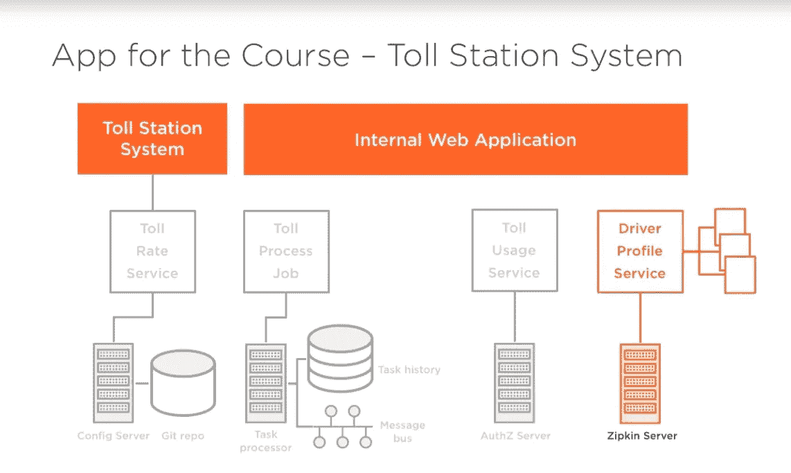
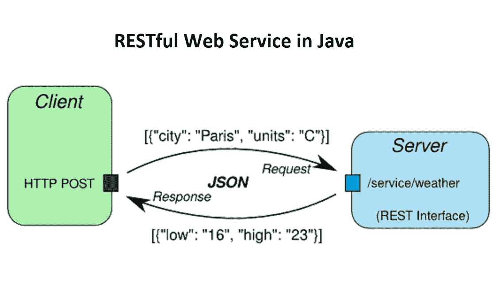
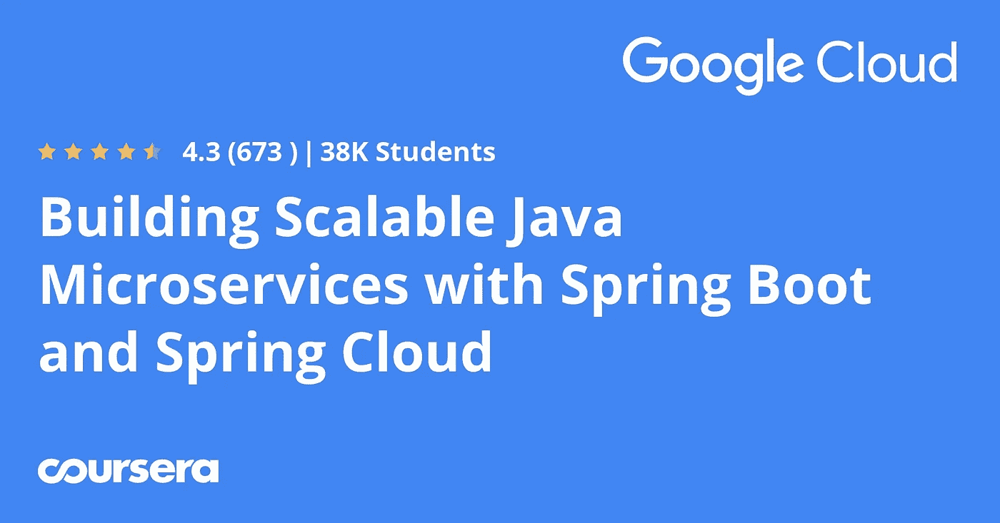
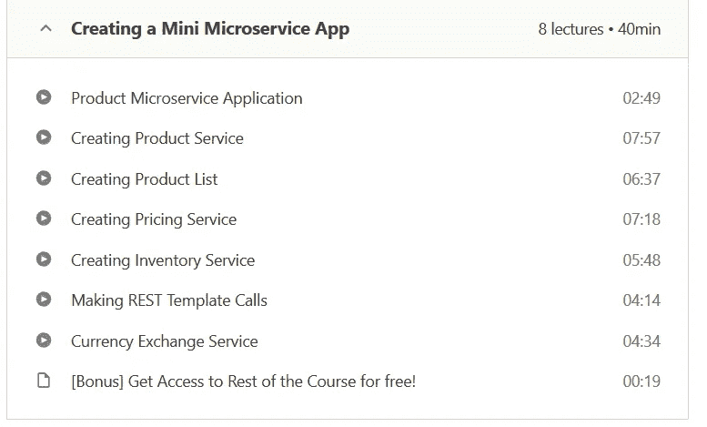
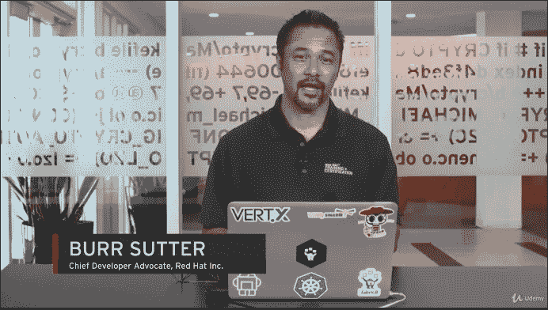
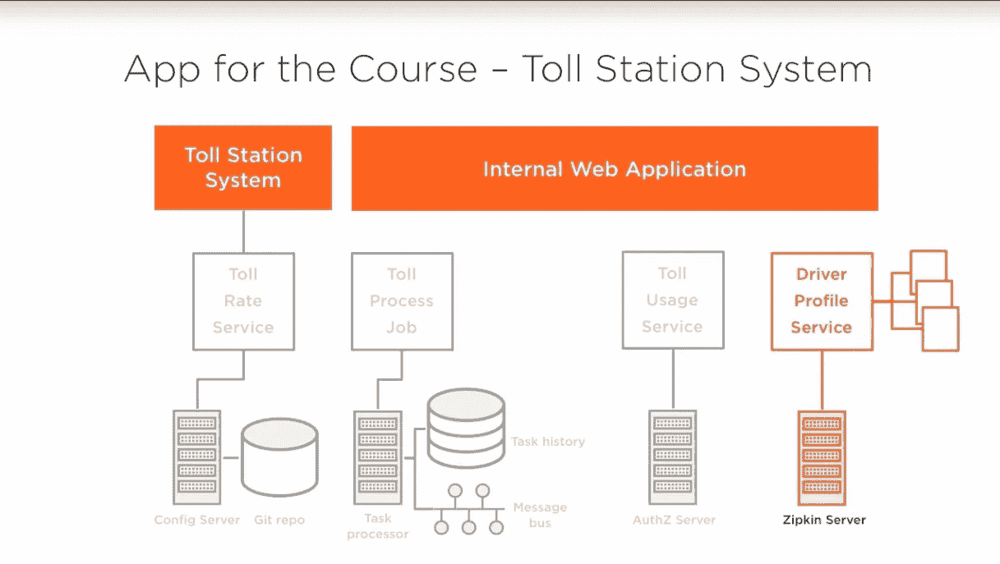

# 2023 年 Spring Boot 和 Spring Cloud 的 11 个最佳 Java 微服务课程

> 原文：<https://medium.com/javarevisited/10-best-java-microservices-courses-with-spring-boot-and-spring-cloud-6d04556bdfed?source=collection_archive---------0----------------------->

## 我最喜欢的使用 Spring Boot 和 Spring Cloud 学习 Java 微服务的在线课程 2023，来自 Udemy、Coursera 和 Pluralsight。

image_credit Pluralsight

大家好，如果你想学习 Java 微服务开发，并且正在寻找 Java 开发人员的最佳微服务课程来使用 Spring boot 和 Spring Cloud 学习微服务，那么你来对地方了。

之前我已经分享过 [**最佳春训课程**](/javarevisited/top-10-courses-to-learn-spring-boot-in-2020-best-of-lot-6ffce88a1b6e)[**春云课程**](/javarevisited/5-best-courses-to-learn-spring-cloud-and-microservices-1ddea1af7012)**而今天我要和 Spring boot、春云一起分享学习微服务的最佳课程。**

**微服务是软件开发中的新术语，每个人都在谈论它，但它已经在实践中有一段时间了，尤其是以 RESTful web 服务的形式。**

**微服务的想法很简单，将一个包含从 UI 到服务层再到数据库的庞大应用程序分解成松散耦合的小块应用程序，这些小块应用程序可以独立工作。**

**例如，在像优步这样的公司中，您可能有几个应用程序提供不同的服务，如发现司机何时在线或乘客何时搜索出租车、查找路线、交通状况以及处理付款。这些小应用被称为微服务。**

**在 Java 世界里，Spring 提供了几个开发微服务的工具和框架，像 [Spring Boot](https://spring.io/projects/spring-boot) 和 [Spring Cloud](https://spring.io/projects/spring-cloud) ，在这篇文章里，我会分享几个好的课程，你可以用它们来学习如何使用 Spring 框架开发微服务。**

**这些课程不仅教你微服务架构的基础和使用微服务的利与弊，还教你如何使用 [Spring Boot](http://www.java67.com/2017/11/top-5-free-core-spring-mvc-courses-learn-online.html) 和[春云](https://javarevisited.blogspot.com/2018/04/top-5-spring-cloud-courses-for-java.html)来实现它们。**

**您还将了解所有事物如何协同工作，以及您在现实世界中将面临的挑战。**

**对 [Java](http://javarevisited.blogspot.sg/2018/01/top-10-udemy-courses-for-java-and-web-developers.html) 和 [Spring](http://javarevisited.blogspot.sg/2016/12/top-5-spring-and-hibernate-training-courses-java-jee-programmers.html#axzz55mTqgbD8) 有较好的了解是有望的，但如果不了解 Spring Boot 或春云也是可以的；这些课程中的大多数都提供了 Spring Boot 和 Spring Cloud 的概述，然后您可以自己探索它。**

# **2023 年 Spring Boot 和春天云的 10 个最佳微服务课程**

**这里是我列出的一些学习如何使用 Spring Boot 和 Spring 云框架开发微服务的最佳课程。**

**如果你不知道，Spring Boot 采用了原始 Spring 框架的思想，例如[依赖注入](http://javarevisited.blogspot.sg/2015/06/difference-between-dependency-injection.html)和[控制反转](http://javarevisited.blogspot.sg/2012/12/inversion-of-control-dependency-injection-design-pattern-spring-example-tutorial.html)，但是通过嵌入必要的库和做出聪明的假设，消除了初始设置的障碍。它使得用 Spring 框架开发 Java 就像用`main()`方法编写 Java 类一样简单。**

**[Spring Cloud](https://javarevisited.blogspot.com/2018/07/top-5-books-to-learn-spring-boot-and-spring-cloud-java.html) 构建于 Spring Boot 之上，提供了几个开箱即用的特性来开发微服务。它还提供工具来快速构建分布式系统中的一些常见模式，如配置管理、服务发现、断路器、智能路由、一次性令牌、微代理、控制总线、全局锁、分布式会话和集群状态。**

**通过使用 Spring Cloud，开发人员可以快速建立实现这些模式的服务和应用程序。无论如何，这里是我列出的*最好的 Java 微服务课程*来学习使用 Spring 框架的微服务开发，特别是 Spring Boot 和 Spring Cloud。**

## **1.[采用 Spring Cloud 的微服务](https://click.linksynergy.com/fs-bin/click?id=JVFxdTr9V80&subid=0&offerid=323058.1&type=10&tmpid=14538&RD_PARM1=https%3A%2F%2Fwww.udemy.com%2Fmicroservices-with-spring-cloud%2F)**

**这是用春云学习微服务的绝佳课程。它深入探讨了微服务架构风格，以及如何使用 Spring 技术(主要是 Spring Cloud)来实现它。**

**本课程对微服务架构风格这一主题进行了很好的、扎实的介绍，并将其与通过 Spring Cloud 练习获得的实践经验相结合。**

**沿着这条路，本课程提供了对 [Spring Boot](http://www.java67.com/2018/02/3-books-and-courses-to-learn-restful-web-services-with-spring.html) 和 Spring 数据的简要介绍，如果您还没有沉浸在这些技术中的话，这足以让您熟悉这些技术。本课程还提供了练习，让学生亲身体验如何使用 Spring Cloud 的各种组件。**

**简而言之，这是一个利用不同的 Spring 云技术(如 Config Server 和 Bus、Eureka、Ribbon、Feign 和 Hystrix)构建微服务应用程序的绝佳课程。**

****这里是加入本课程**——[春云微服务](https://click.linksynergy.com/fs-bin/click?id=JVFxdTr9V80&subid=0&offerid=323058.1&type=10&tmpid=14538&RD_PARM1=https%3A%2F%2Fwww.udemy.com%2Fmicroservices-with-spring-cloud%2F)的链接**

****

## **2.[用 Spring Boot 和春云掌握微服务](https://click.linksynergy.com/fs-bin/click?id=JVFxdTr9V80&subid=0&offerid=323058.1&type=10&tmpid=14538&RD_PARM1=https%3A%2F%2Fwww.udemy.com%2Fmicroservices-with-spring-boot-and-spring-cloud%2F)**

**这是用 Spring 框架学习微服务的又一个牛逼课程。该课程从解释如何使用 Spring 构建 RESTful web 服务开始，这是构建基于微服务的应用程序的正确的第一步。**

**在课程的前半部分，您将学习如何使用 Spring Boot 开发和设计 RESTful web 服务，并探索一些高级的 REST web 服务概念，如版本控制、错误处理、验证、HATEOAS 和过滤。**

**在课程的后半部分，您将学习如何使用 Spring Boot 和 Spring Cloud 开发微服务。**

**您将首先使用 Spring Cloud Config Server 设置一个集中的微服务配置，然后学习实现客户端负载平衡(Ribbon)、动态伸缩(Eureka Naming Server)和 API 网关(Zuul)。您还将学习如何使用 Spring Cloud Sleuth 和 Zipkin 实现微服务的分布式跟踪。**

**以下是加入本次微服务课程 **—** [**的链接**](https://click.linksynergy.com/fs-bin/click?id=JVFxdTr9V80&subid=0&offerid=323058.1&type=10&tmpid=14538&RD_PARM1=https%3A%2F%2Fwww.udemy.com%2Fmicroservices-spring-course%2F) 春季课程完整微服务**

****

**简而言之，这是一门很棒的课程，教你如何用 Spring Boot 和 Spring Cloud 构建 Restful Web 服务和微服务。**

## **3.[带弹簧课程的完整微服务](https://click.linksynergy.com/fs-bin/click?id=JVFxdTr9V80&subid=0&offerid=323058.1&type=10&tmpid=14538&RD_PARM1=https%3A%2F%2Fwww.udemy.com%2Fmicroservices-spring-course%2F)**

**这是 Udemy 最新推出的用 Spring 学习微服务的课程之一。本课程首先解释什么是微服务架构及其优势。然后深入探讨如何使用 Spring Boot 和 Spring 云框架开发微服务的细节。**

**然后，它继续探索微服务的一些更实际的方面，如使用 [Spring Security](http://www.java67.com/2017/12/top-5-spring-security-online-training-courses.html) 保护微服务，处理微服务的日志记录和监控，如何使它们更具弹性和可伸缩性，以及最后，如何部署和测试微服务。**

**在使用 Spring 学习微服务的同时，您还将深入了解 Spring 5 中最新包含的反应流，并学习如何在组件间混合数据管理策略。**

**简而言之，这是一门非常棒的课程，它将教你如何从零开始轻松构建和实现可扩展的微服务。**

****以下是加入本课程的链接** — [完整的微服务与 Spring 课程](https://click.linksynergy.com/fs-bin/click?id=JVFxdTr9V80&subid=0&offerid=323058.1&type=10&tmpid=14538&RD_PARM1=https%3A%2F%2Fwww.udemy.com%2Fmicroservices-spring-course%2F)**

****

## **4.[Spring Boot 和春云的微服务](https://click.linksynergy.com/fs-bin/click?id=JVFxdTr9V80&subid=0&offerid=323058.1&type=10&tmpid=14538&RD_PARM1=https%3A%2F%2Fwww.udemy.com%2Fexploring-spring-boot-and-spring-cloud-microservices%2F)**

**这是另一个通过 Spring Boot 和 Spring cloud 学习微服务开发的实用课程，非常适合任何想要学习基于 Spring Boot 和 Spring cloud 的微服务开发的人。**

**本课程涵盖了几个主题，包括 Spring 框架依赖注入、面向方面编程、基于 Spring Boot 的微服务开发，如果你以前不熟悉的话，这将帮助你理解 [Spring 框架](/javarevisited/10-best-online-courses-to-learn-spring-framework-in-2020-f7f73599c2fd)和 [Spring Boot](/javarevisited/10-free-spring-boot-tutorials-and-courses-for-java-developers-53dfe084587e?source=collection_home---4------7-----------------------) 。**

**对于了解 Spring 但很久没有使用它的开发人员来说，这也是一个很好的复习。**

**本课程还提供了 Spring Cloud 网飞库堆栈的扎实介绍和知识，包括**

**1.Spring 云服务发现**

**2.使用 GitHub 的 Spring 云配置服务**

**3.Spring 云配置客户端**

**4.春云恶化客户端假装**

**5.弹簧云断路器 Hystrix**

**该课程使用一个定制贷款应用领域作为探索微服务开发的领域，你们中的许多人很容易与之相关。这使得学习更加容易和实用。**

****这里是加入本次微服务课程**——[Spring Boot 和春云的微服务](https://click.linksynergy.com/fs-bin/click?id=JVFxdTr9V80&subid=0&offerid=323058.1&type=10&tmpid=14538&RD_PARM1=https%3A%2F%2Fwww.udemy.com%2Fexploring-spring-boot-and-spring-cloud-microservices%2F)的链接**

****

## **5.[用 Spring Boot 和 Spring Cloud 构建可扩展的 Java 微服务](https://coursera.pxf.io/c/3294490/1164545/14726?u=https%3A%2F%2Fwww.coursera.org%2Flearn%2Fgoogle-cloud-java-spring)(免费)**

**这是 Coursera 上的另一个很好的课程，学习在云平台如 GCP 或谷歌云平台中构建和部署微服务。**

**如果你知道，微服务架构是公共云的理想选择，其重点是利用按需资源进行弹性扩展，这也是越来越多的公司转向[云](https://javarevisited.blogspot.com/2019/07/top-5-online-courses-to-learn-cloud-computing-aws.html)和[微服务](https://javarevisited.blogspot.com/2018/02/top-5-spring-microservices-courses-with-spring-boot-and-spring-cloud.html)的原因。**

**本课程由谷歌云培训提供，在本课程中，您将学习如何在[谷歌云平台](https://javarevisited.blogspot.com/2019/07/top-5-google-cloud-platform-gcp-courses-certifications-online.html)上使用 Spring Boot 和 Spring Cloud 构建 Java 应用。**

**您将使用 Cloud Runtime Configuration 和 Spring Cloud Config 来管理应用程序的配置，通过 Cloud Pub/Sub 和 Spring 集成发送和接收消息。**

****这里是加入这个免费课程的链接**——[用 Spring Boot 和 Spring Cloud 构建可扩展的 Java 微服务](https://coursera.pxf.io/c/3294490/1164545/14726?u=https%3A%2F%2Fwww.coursera.org%2Flearn%2Fgoogle-cloud-java-spring)**

****

**而且，如果你觉得 Coursera 课程有用，那么，你也可以加入 Coursera Plus ，这是 Coursera 的一个订阅计划，让你可以无限制地访问他们最受欢迎的课程、专业、专业证书和指导项目。它每年花费大约 399 美元，但它完全值得你的钱，因为你可以获得无限的证书。**

** [## Coursera Plus |无限制访问 7，000 多门在线课程

### 用 Coursera Plus 投资你的职业目标。无限制访问 90%以上的课程、项目…

coursera.pxf.io](https://coursera.pxf.io/c/3294490/1164545/14726?u=https%3A%2F%2Fwww.coursera.org%2Fcourseraplus)** 

## **6.[微服务原理和概念介绍](https://www.educative.io/courses/introduction-microservice-principles-concepts?affiliate_id=5073518643380224)**

**这是 Eberhard Wolff 关于微服务架构、原则和概念的另一个很棒的入门课程，它为包括亚马逊、网飞、Spotify 和优步在内的许多公司奠定了基础。**

**在本课程中，您将深入了解微服务，并理解支持和反对微服务的理由。除此之外，您还将了解微观和宏观架构、迁移旧系统的策略、Docker 在该架构中的角色以及实现微服务的技术。**

**完成本课程后，您将更好地掌握在贵公司实施微服务所需的信息。**

**以下是加入本课程的链接— [**微服务原理和概念介绍**](https://www.educative.io/courses/introduction-microservice-principles-concepts?affiliate_id=5073518643380224)**

****

**而且，如果你发现教育平台和他们的互动课程很有用，那么你还可以获得 [**教育订阅**](https://www.educative.io/subscription?affiliate_id=5073518643380224) ，它不仅提供这门课程，还提供他们的 100 多门课程，每月只需 18 美元。它非常划算，非常适合获得一些实践学习经验。**

** [## 教育无限:保持领先

### 我们听到了您的反馈。你现在只需支付一次费用，就可以获得 Educative 上的所有课程。

www.educative.io](https://www.educative.io/subscription?affiliate_id=5073518643380224)** 

## **7.[跟 Spring Boot 和春云学微服务](https://click.linksynergy.com/fs-bin/click?id=JVFxdTr9V80&subid=0&offerid=323058.1&type=10&tmpid=14538&RD_PARM1=https%3A%2F%2Fwww.udemy.com%2Flearn-microservices-with-spring-boot-and-spring-cloud%2F)**

**这是另一个使用 Spring 框架学习微服务的综合课程。它为 Spring 和微服务开发提供了实践指南。**

**本课程分为 9 章。在前两章中，你将学习一般理论以及如何使用 Spring Boot 和 [Spring 框架](/javarevisited/top-10-free-courses-to-learn-spring-framework-for-java-developers-639db9348d25)进行开发。**

**第 3 章到第 8 章解释了基本的微服务模式，并为解决基于微服务的架构中出现的挑战提供了指导。每章包含理论和编码，这使得它更容易理解和遵循。**

**最后，你将在最后一章学习 [Docker](http://www.java67.com/2018/02/5-free-docker-courses-for-java-and-DevOps-engineers.html) 和 [AWS](/javarevisited/10-best-aws-certified-cloud-practitioner-clf-c01-online-courses-and-practice-test-to-crack-ecc0f913091e) 。您将学习如何为每个服务构建映像，在 AWS 中设置一个实例，并将一些映像推送到 AWS。**

****以下是加入本课程的链接**——[和 Spring Boot、春云一起学习微服务](https://click.linksynergy.com/fs-bin/click?id=JVFxdTr9V80&subid=0&offerid=323058.1&type=10&tmpid=14538&RD_PARM1=https%3A%2F%2Fwww.udemy.com%2Flearn-microservices-with-spring-boot-and-spring-cloud%2F)**

****

## **8.[与 Spring Boot 大师春天微服务&春天云！](https://click.linksynergy.com/deeplink?id=JVFxdTr9V80&mid=39197&murl=https%3A%2F%2Fwww.udemy.com%2Fcourse%2Fspring-microservices-with-spring-boot-spring-cloud-training%2F)(免费)**

**这是一个免费的 Udemy 课程，用 Spring Boot 和 Spring Cloud 框架学习 Java 中的微服务。这是一个很好的小课程，它将教你微服务的基础，但也帮助你建立一个迷你微服务应用程序来实践你所学到的东西。**

**作为他们 *Mini 微服务 App* 的一部分，你会学到很多有用的东西，如下图。如果你正在寻找一个**免费的微服务课程**来开始学习微服务架构和 spring，那么这是最适合你的课程。**

****以下是加入本次免费微服务课程**——[与 Spring Boot &春云一起掌握春微服务的链接！](https://click.linksynergy.com/deeplink?id=JVFxdTr9V80&mid=39197&murl=https%3A%2F%2Fwww.udemy.com%2Fcourse%2Fspring-microservices-with-spring-boot-spring-cloud-training%2F)**

****

## **9.[使用微服务架构开发云原生应用](https://click.linksynergy.com/deeplink?id=JVFxdTr9V80&mid=39197&murl=https%3A%2F%2Fwww.udemy.com%2Fcourse%2Fdeveloping-cloud-native-applications-microservices-architectures%2F)(免费)**

**这是 Udemy 的另一个免费在线课程，学习微服务架构和构建云原生应用。本课程由 Red Hat Inc .创建，它是 JBoss 和 RedHat Linux 的幕后公司。**

**以下是你将在本课程中学到的关键内容-**

1.  **了解构建微服务架构的基础。**
2.  **如何通过一个 DevOps 管道部署多种微服务框架？**

**这个课程最大的好处是它是免费的，由 RedHat 创建，由像 Burr Sutter 这样的人教授，他是 Red HAt Inc .的首席开发者倡导者。总的来说，这是一个很好的免费微服务课程，学习使用微服务架构进行云原生应用程序开发。**

****这里是加入这个免费课程的链接** — [使用微服务架构开发云原生应用](https://click.linksynergy.com/deeplink?id=JVFxdTr9V80&mid=39197&murl=https%3A%2F%2Fwww.udemy.com%2Fcourse%2Fdeveloping-cloud-native-applications-microservices-architectures%2F)**

****

## **10. [Spring Boot 微服务与春云初学者到宗师](https://click.linksynergy.com/deeplink?id=JVFxdTr9V80&mid=39197&murl=https%3A%2F%2Fwww.udemy.com%2Fcourse%2Fspring-boot-microservices-with-spring-cloud-beginner-to-guru%2F)**

**这是用 Spring Boot 和 Spring Cloud 学习 Java 微服务课程的又一个亮点。这也是我个人最喜欢的，因为它是由 Spring Framework 5:初学者到大师课程的作者约翰·汤姆逊创建的。**

**在本课程中，您将了解到微服务是一种架构风格。它们允许公司在保持高度灵活性的同时实现巨大的规模。**

**以下是您将在本课程中学到的主要内容:**

*   **了解如何使用 Spring Boot 开发微服务**
*   **如何使用 Spring Cloud 部署和管理 Spring Boot 微服务**
*   **用 Spring MVC 开发 RESTFul APIs 的最佳实践**
*   **如何使用 Spring 消费 RESTFul APIs】**
*   **用 Spring Boot 配置 Jackson 进行 JSON 处理**
*   **使用 JMS 在 Spring Boot 微服务之间传递消息**
*   **使用 Spring 状态机对微服务应用 Saga 模式**

**本课程超越了简单的 RESTful APIs，探索了作为一种架构风格的微服务。**

****以下是加入本课程的链接** — [Spring Boot 微服务与春云初学者到大师](https://click.linksynergy.com/deeplink?id=JVFxdTr9V80&mid=39197&murl=https%3A%2F%2Fwww.udemy.com%2Fcourse%2Fspring-boot-microservices-with-spring-cloud-beginner-to-guru%2F)**

****

## **11.[使用 Spring Cloud 的 Java 微服务:开发服务](https://pluralsight.pxf.io/c/1193463/424552/7490?u=https%3A%2F%2Fwww.pluralsight.com%2Fcourses%2Fjava-microservices-spring-cloud-developing-services)**

**这是 Pluralsight 最好的 Java 微服务课程。如果您订阅了 Pluralsight，并希望通过 Spring Cloud 学习微服务课程，那么这就是适合您的课程。**

**在本课程中，您将学习构建 Java 微服务所需的技能。以下是本课程教给你的关键内容:**

1.  **微服务、Spring Boot 和春天云简介**
2.  **如何用轻量级、短期任务转换异步活动。**
3.  **如何使用分布式跟踪追踪性能问题？**

**总的来说是一门用 Spring Cloud 学习 Java 微服务的好课程。完成本课程后，您将具备关键微服务模式的基础知识，并能够利用您的经验构建更好的 Java 微服务。**

****这里是加入本课程的链接**——[Java 微服务与 Spring Cloud:开发服务](https://pluralsight.pxf.io/c/1193463/424552/7490?u=https%3A%2F%2Fwww.pluralsight.com%2Fcourses%2Fjava-microservices-spring-cloud-developing-services)**

****

**顺便说一下，你需要一个 Pluralsight 会员才能参加这个课程，费用大约是每月 29 美元或每年 299 美元(14%的折扣)。我向所有程序员强烈推荐这个订阅，因为它提供了超过 7000 个在线课程的即时访问，以学习任何技术技能。或者，你也可以使用他们的 [**10 天免费通行证**](https://pluralsight.pxf.io/c/1193463/424552/7490?u=https%3A%2F%2Fwww.pluralsight.com%2Flearn) 来免费观看这个课程**

** [## 对个人来说

### Pluralsight 帮助个人学习者获得掌握最新软件开发所需的技术技能…

pluralsight.pxf.io](https://pluralsight.pxf.io/c/1193463/424552/7490?u=https%3A%2F%2Fwww.pluralsight.com%2Flearn) 

以上是 Spring Boot 和 Spring Cloud 学习微服务的一些**最佳课程。微服务架构是软件开发的未来，每个程序员都应该学习它。**

随着越来越多的公司转向微服务架构，这是一项需要掌握的重要技能，可以帮助你找到下一份薪水和福利更高的工作。

感谢您阅读本文。如果你喜欢这些春季微服务课程，那么请分享给你的朋友和同事。如果您有任何问题或反馈，请留言。

您可能希望探究的其他**文章**

*   [2023 年 Java 和 Web 开发人员应该学会的 10 件事](http://javarevisited.blogspot.sg/2017/12/10-things-java-programmers-should-learn.html#axzz53ENLS1RB)
*   [Udemy vs . CodeCademy vs . one month](https://javarevisited.blogspot.com/2019/09/codecademy-vs-udemy-vs-onemonth-which-is-better-for-learning-code.html)
*   [前端开发人员应该学习的 10 项技能](https://www.java67.com/2020/10/best-frontend-skills-web-developer.html)
*   [我最喜欢的学习网页开发的课程](/better-programming/my-5-favorite-courses-to-learn-web-development-in-2019-a5e74167f8b2)
*   [2023 年的 10 种编程语言](http://www.java67.com/2017/12/10-programming-languages-to-learn-in.html)
*   [Java 开发者应该知道的 10 个测试工具](http://javarevisited.blogspot.sg/2018/01/10-unit-testing-and-integration-tools-for-java-programmers.html)
*   [2023 年学习 Python 的 5 大课程](/better-programming/top-5-courses-to-learn-python-in-2018-best-of-lot-26644a99e7ec)
*   [2023 年 Java 开发者应该学习的 5 个框架](http://javarevisited.blogspot.sg/2018/04/top-5-java-frameworks-to-learn-in-2018_27.html)
*   [每个 Java 开发者都应该知道的 10 个工具](https://javarevisited.blogspot.com/2019/02/10-tools-advanced-java-developers-should-know.html)
*   [2023 年每个 Java 程序员都应该阅读的 10 本书](http://www.java67.com/2018/02/10-books-java-developers-should-read-in.html)
*   【Java 开发人员在日常工作中使用的 10 种工具
*   [成为更好的 Java 程序员的 10 个技巧](https://javarevisited.blogspot.com/2018/05/10-tips-to-become-better-java-developer.html)

感谢您阅读本文。如果你喜欢 spring boot 和 spring cloud 的这些*最佳 Java 微服务课程，那么请分享给你的朋友和同事，他们会很欣赏的。如果您有任何问题或反馈，请留言。*

**P. S.** —如果你想学习 Spring 框架的微服务，但又想找一个免费的在线课程开始，那么你也可以看看这个[**Spring Boot Spring 云的主 Spring 微服务&！**](https://click.linksynergy.com/deeplink?id=JVFxdTr9V80&mid=39197&murl=https%3A%2F%2Fwww.udemy.com%2Fcourse%2Fspring-microservices-with-spring-boot-spring-cloud-training%2F)Udemy 上的课程。这是一个很好的课程，完全免费加入，你需要的只是一个免费的 Udemy 帐户。

 [## 免费 Spring Boot 教程-掌握 Spring Boot 和春天云的春天微服务！

### 在我看来，教学是一门艺术。我认为，教师有责任确保学生…

udemy.com](https://click.linksynergy.com/deeplink?id=JVFxdTr9V80&mid=39197&murl=https%3A%2F%2Fwww.udemy.com%2Fcourse%2Fspring-microservices-with-spring-boot-spring-cloud-training%2F)**