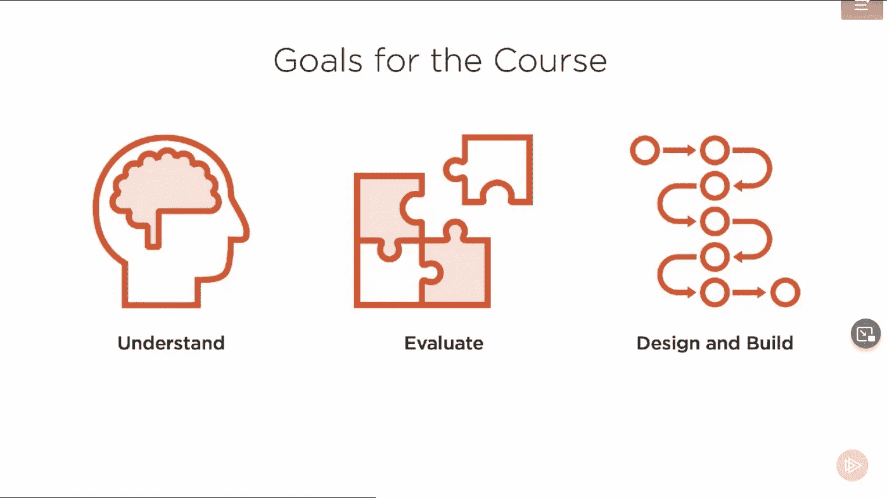

# 2023 年初学者在线学习的 10 门最佳 Java Web 服务[REST + SOAP]课程

> 原文：<https://medium.com/javarevisited/10-best-java-web-services-rest-soap-and-api-courses-for-beginners-724a8f51298d?source=collection_archive---------0----------------------->

## 我最喜欢的在线课程，学习如何使用 Spring、JAX RS 和其他框架用 Java 开发 RESTful web 服务。

大家好，如果你想学习 API，Web 服务，以及如何用 Java 设计和开发 REST 和 SOAP Web 服务，那么你来对地方了。前面我已经分享了用 Java 和 Spring 框架 学习微服务的 [**最佳课程，而今天我要讲的是 Java web 服务开发，既有 SOAP 也有 REST 但主要是 REST。**](/javarevisited/10-best-java-microservices-courses-with-spring-boot-and-spring-cloud-6d04556bdfed)

REST API 和 RESTful Web 服务无需介绍，它现在无处不在，正在推动一场新的互联网革命。网络空间中的大多数软件开发现在也涉及 REST APIs。

web 应用程序的唯一界面是浏览器的日子已经一去不复返了，现在大多数浏览器都支持 REST APIs，这使得它们可以在任何设备上访问，如移动设备、平板电脑、apple watch 和任何其他数字设备。

不管你是为亚马逊、脸书或谷歌这样的软件巨头工作，还是为优步或网飞这样的初创公司工作，REST APIs 无处不在。

说到用 Java 开发 REST APIs，有很多选择，比如你可以使用基于 JAX RS 的框架，比如 [Restlet](http://javarevisited.blogspot.sg/2016/10/restlet-helloworld-example-in-java-and-Eclipse.html) 和 [Jersey](http://javarevisited.blogspot.sg/2017/06/jersey-web-service-hello-world-example.html) ，或者你可以使用一直存在并且流行的 [Spring 框架](/javarevisited/10-best-online-courses-to-learn-spring-framework-in-2020-f7f73599c2fd)。

我个人喜欢 Spring 开发 RESTful web 服务，因为它对开发 RESTful web 服务有很好的支持，我也可以利用我现有的关于 Spring MVC 的知识来开发 RESTful web 服务。

我也在博客上写了我使用 Spring 进行 REST 开发的理由，你可以在这里找到更多理由。

在这篇文章中，我将分享一些在 Java 世界中使用 [Spring](/javarevisited/top-10-free-courses-to-learn-spring-framework-for-java-developers-639db9348d25) 学习 REST API 开发的最佳*课程。这些课程不仅教你一步一步地编写自己的 REST APIs，还教你使用脸书、Twitter、优步和其他公司提供的公共 API。他们还会教你一些高级概念，比如 REST API 的安全性、版本控制、过滤、分页和错误处理。通过学习这些课程，你将拥有足够的知识，不仅可以开发 RESTful web 服务，还可以为现实世界的应用程序设计 REST APIs。*

# 2023 年用 Spring 学习 Java Web 服务的 10 个最佳在线课程

下面是我用 Spring 和 Java 学习 REST 的课程列表。该列表包含了一些学习 REST APIs 设计以及使用 Spring 框架(如 Spring MVC 和 Spring Boot)开发它们的最佳课程。

## [1。REST API 设计、开发&管理](https://click.linksynergy.com/fs-bin/click?id=JVFxdTr9V80&subid=0&offerid=323058.1&type=10&tmpid=14538&RD_PARM1=https%3A%2F%2Fwww.udemy.com%2Frest-api%2F)

为了开发一个成功的 RESTful web 服务，您必须首先理解什么是 REST API 本身以及它是如何工作的。这个课程提供了我所见过的最好的 REST API 概述。

本课程既全面又充满了真实世界的例子，作者将带您浏览 Twitter、脸书、优步、网飞和其他公司公开的真实世界 REST APIs，解释概念和最佳实践。

课程分为 5 个主要部分。在第一部分中，您将学习 REST API 概念，这将涵盖基本概念，如 RESTful API 的发展和 6 个架构约束。

在第二节，你将学习如何设计 REST API。这是一个非常有用的部分，您将从中了解设计 REST API 的最佳实践。讲师将带您了解一些流行的 API 提供商(例如 Twitter、脸书、优步等)，并向您展示他们是如何设计 REST API 的。您将了解资源、CRUD 实现错误处理、HTTP 状态代码、版本控制、分页、部分响应等。

在下一节中，讲师将解释如何保护 [REST API](http://www.java67.com/2017/06/top-10-rest-api-and-restful-web-services-book.html) 。在本节中，您将了解 REST APIs 常用的身份验证和授权方案，如令牌(JSON Web 令牌或 JWT)、密钥/秘密和 OAuth 2.0(使用 Spotify 实现作为参考)。

在最后两节中，您将了解 Swagger 2.0 / Open API 计划规范和 API 管理，即在安全、可扩展的环境中发布、记录和监督应用编程接口(API)的过程。

简而言之，获取 REST API 概念和实践知识的最佳在线课程之一。这不是从头开始编码，而是在编码之前建立概念。

**这里是加入本课程** — [REST API 设计、开发&管理](https://click.linksynergy.com/fs-bin/click?id=JVFxdTr9V80&subid=0&offerid=323058.1&type=10&tmpid=14538&RD_PARM1=https%3A%2F%2Fwww.udemy.com%2Frest-api%2F)的链接

## [2。休息用弹簧认证类](http://courses.baeldung.com/p/rest-with-spring-the-certification-class?affcode=22136_bkwjs9xa)

如果前面的课程是学习 REST API 概念的最佳课程，那么这就是使用 Spring 框架实现 RESTful APIs 的最佳课程。

这是一门综合课程，分为几个模块，涵盖开发 RESTful web 服务的所有方面，如 REST 与 Spring 的基础知识、REST 和 HTTP 基础知识、REST API 的简单安全性、从 Angular JS 使用 API、使用 [curl](http://www.java67.com/2017/10/how-to-test-restful-web-services-using.html) 和[放心](http://javarevisited.blogspot.sg/2018/01/10-unit-testing-and-integration-tools-for-java-programmers.html)测试 REST API。

它还涵盖了使用 [OAuth2 & JWT](/javarevisited/top-10-courses-to-learn-spring-security-and-oauth2-with-spring-boot-for-java-developers-8f0222d6066d) 的 REST API 安全的高级概念，像使用 Swagger 和 HATEOAS 一样记录、发现和发展 REST API。

本课程还会教你一些关于监控 REST API 和 API 指标的实用内容、 [DevOps](/javarevisited/13-best-courses-to-learn-devops-for-senior-developers-in-2020-a2997ff7c33c?source=extreme_sidebar---------0-2----------------------) 和 CI 内容，比如从头开始建立一个简单的 Jenkins 管道和高级 API 策略。

Eugen 还致力于引入一些新模块，以利用 Spring 5 中引入的新功能，如构建一个反应式 REST API，从 [Servlet](http://www.java67.com/2018/02/5-free-servlet-jsp-and-jdbc-online-courses-for-java-developers.html) 转向反应式，以及涵盖 Spring 5 的新功能和 Spring MVC 功能。

简而言之，如果你想从头开始学习如何使用 Spring MVC 开发真实世界的 RESTful APIs，最好加入的课程之一。

**这里是加入本课程**——[休息与春季认证班](http://courses.baeldung.com/p/rest-with-spring-the-certification-class?affcode=22136_bkwjs9xa)的链接

## [3。用 Spring Boot 掌握 Java Web 服务和 REST API](https://click.linksynergy.com/fs-bin/click?id=JVFxdTr9V80&subid=0&offerid=323058.1&type=10&tmpid=14538&RD_PARM1=https%3A%2F%2Fwww.udemy.com%2Fspring-web-services-tutorial%2F)

这是另一个学习 Java web 服务的好课程，比如 SOAP 和 REST，以及学习如何使用 Spring Boot 开发 REST API。

由[在 28 分钟内](https://click.linksynergy.com/deeplink?id=CuIbQrBnhiw&mid=39197&murl=https%3A%2F%2Fwww.udemy.com%2Fuser%2Fin28minutes%2F)和[最受欢迎的 Udemy Java 技术讲师之一 Ranga Karnam](https://click.linksynergy.com/deeplink?id=CuIbQrBnhiw&mid=39197&murl=https%3A%2F%2Fwww.udemy.com%2Fuser%2Fin28minutes%2F) 创建，课程分为两部分，第一部分涵盖 RESTful Web 服务，第二部分专门介绍 SOAP web 服务。在本课程的第一部分，您将通过为一个示例社交媒体应用程序开发资源来学习 RESTful web 服务的基础知识。

您将学习实现这些具有多种特性的资源——版本控制、异常处理、文档(Swagger)、[基本认证](http://javarevisited.blogspot.sg/2018/01/how-http-basic-authentication-works-in.html) (Spring Security)、过滤和 HATEOAS。您还将学习设计 RESTful web 服务的最佳实践。

本课程还解释了 RESTful API 开发所需的所有工具和库，例如，您将使用 Spring 进行依赖管理， [Spring MVC](http://javarevisited.blogspot.sg/2017/06/how-spring-mvc-framework-works-web-flow.html) 和 [Spring REST](http://javarevisited.blogspot.sg/2018/02/top-20-spring-rest-interview-questions-answers-java.html#axzz57Kv4wGXe) ， [Spring Boot](/javarevisited/10-advanced-spring-boot-courses-for-experienced-java-developers-5e57606816bd) ， [Spring Security](/javarevisited/top-10-courses-to-learn-spring-security-and-oauth2-with-spring-boot-for-java-developers-8f0222d6066d?source=---------5-----------------------) 进行身份验证和授权，使用 Spring Boot 执行器进行监控，使用 Swagger 进行文档管理，使用 Maven 进行依赖管理，使用 Eclipse 进行编码和开发，使用 Postman 测试 REST 服务，使用 Tomcat 作为嵌入式 Web 服务器。

在下一部分中，您将了解到[基于 SOAP 的 web 服务](http://javarevisited.blogspot.sg/2015/08/difference-between-soap-and-restfull-webservice-java.html)，如果您只关注 RESTful web 服务，您可能会忽略这些内容，但通过这些内容，您会意识到 REST 解决了 SOAP 的哪些问题，并帮助您将来在 SOAP 和 REST 之间做出决定。

**这是参加本课程的链接**——[与 Spring Boot 一起掌握 Java Web 服务和 REST API](https://click.linksynergy.com/fs-bin/click?id=JVFxdTr9V80&subid=0&offerid=323058.1&type=10&tmpid=14538&RD_PARM1=https%3A%2F%2Fwww.udemy.com%2Fspring-web-services-tutorial%2F)

## [4。使用 Spring Data REST 创建 REST APIs】](https://click.linksynergy.com/fs-bin/click?id=JVFxdTr9V80&subid=0&offerid=323058.1&type=10&tmpid=14538&RD_PARM1=https%3A%2F%2Fwww.udemy.com%2Fmicroservices-rest-apis-using-spring-data-rest%2F)

这是一个很好的课程，通过使用 Spring Data REST 开发一个简单的 RESTful API 来掌握微服务、REST 和 Spring Data REST 的概念。Spring 是 Java 世界中使用最广泛的框架， [REST web services](/javarevisited/top-5-books-and-courses-to-learn-restful-web-services-in-java-using-spring-mvc-and-spring-boot-79ec4b351d12?source=---------17------------------) 已经成为 web 上应用程序集成的标准方式，这使得学习这两者对于未来的 web 开发人员非常重要。REST 也是微服务通信的事实上的技术，因此，如果你正在转向微服务架构，对 REST API 和 RESTful 开发的良好了解将大有帮助。

由[Bharat thippiready](https://click.linksynergy.com/deeplink?id=CuIbQrBnhiw&mid=39197&murl=https%3A%2F%2Fwww.udemy.com%2Fuser%2Fbharaththippireddy%2F)创建，本课程帮助您掌握[微服务](http://javarevisited.blogspot.sg/2018/02/top-5-spring-microservices-courses-with-spring-boot-and-spring-cloud.html)、rest 的概念，并在探索 spring data rest 的各种特性的同时构建一个端到端的应用程序。学完本课程后，您将对微服务、REST、HATEOAS 和 Spring Data REST 有所了解。

**这里是加入本课程的链接** — [使用 Spring Data REST 创建 REST API](https://click.linksynergy.com/fs-bin/click?id=JVFxdTr9V80&subid=0&offerid=323058.1&type=10&tmpid=14538&RD_PARM1=https%3A%2F%2Fwww.udemy.com%2Fmicroservices-rest-apis-using-spring-data-rest%2F)

## [5。掌握 Spring Boot 和春云的微服务](https://click.linksynergy.com/fs-bin/click?id=JVFxdTr9V80&subid=0&offerid=323058.1&type=10&tmpid=14538&RD_PARM1=https%3A%2F%2Fwww.udemy.com%2Fmicroservices-with-spring-boot-and-spring-cloud%2F)

我第一次参加这个课程是为了学习微服务，但在完成第一部分后，我意识到这其实也是一个学习 RESTful Web 服务的很棒的课程，有趣的是这个课程也是由这个列表中第三个课程的讲师[在 28 分钟](https://click.linksynergy.com/deeplink?id=CuIbQrBnhiw&mid=39197&murl=https%3A%2F%2Fwww.udemy.com%2Fuser%2Fin28minutes%2F)内创建的。

如我所说，课程分为两部分，第一部分是关于使用 Spring MVC 和 [Spring Boot](http://www.java67.com/2017/11/top-5-free-core-spring-mvc-courses-learn-online.html) 开发 RESTful Web 服务，第二部分是关于使用 Spring 云技术开发微服务。软件架构正在向微服务发展，RESTful web 服务是开发优秀微服务的第一步，这使得本课程对于既想学习 RESTful Web 服务又想学习微服务的开发人员非常有用。

在课程的第二部分，您将学习[微服务](https://dev.to/javinpaul/top-10-courses-to-learn-spring-boot-and-microservices-for-java-programmers-3hjg)的基础知识。您将了解如何使用 Spring Cloud 实现微服务，学习在微服务之间建立通信，实现负载平衡，扩展和缩减微服务等。

您还将学习使用 Spring Cloud Config Server 集中配置微服务，实现 Eureka 命名服务器，使用 Spring Cloud Sleuth 和 Zipkin 进行分布式跟踪，以及使用 Zipkin 开发容错微服务。

**以下是加入本课程的链接**——[与 Spring Boot 和春云一起掌握微服务](https://click.linksynergy.com/fs-bin/click?id=JVFxdTr9V80&subid=0&offerid=323058.1&type=10&tmpid=14538&RD_PARM1=https%3A%2F%2Fwww.udemy.com%2Fmicroservices-with-spring-boot-and-spring-cloud%2F)

## 6. [RESTful Web 服务、Java、Spring Boot、Spring MVC 和 JPA](https://click.linksynergy.com/deeplink?id=CuIbQrBnhiw&mid=39197&murl=https%3A%2F%2Fwww.udemy.com%2Fcourse%2Frestful-web-service-with-spring-boot-jpa-and-mysql%2F)

这是使用 Spring 工具集(如 Spring MVC、Hibernate 和 JPA)学习 Java 中 RESTFul web 服务的又一个精彩课程。您将了解如何实现 API 调用、注册、登录、电子邮件验证、密码重置、更新、删除以及如何部署到 Amazon AWS 云。

以下是您将在本课程中学到的重要内容:

*   如何用 Spring MVC 和 Spring Boot 构建 RESTful Web 服务
*   如何实现用户注册和登录功能
*   如何用 Spring 安全框架保护 RESTful Web 服务
*   如何实现基于令牌的身份验证
*   如何实现密码重置和电子邮件验证功能
*   如何使用 [Spring 数据 JPA 查询方法](https://www.java67.com/2021/01/spring-data-jpa-interview-questions-answers-java.html)
*   如何下载和安装 Spring 工具套件
*   使用 Spring 工具套件和 Spring 初始化器创建一个新项目
*   如何下载、运行和停止 Apache Tomcat

除此之外，您还将学习如何使用 JUnit 5 来测试您的代码，以及如何使用最流行的测试框架之一 Rest Assured 来测试 REST API 的 RESTful Web 服务端点。

**这里是加入本课程的链接**——[RESTful Web 服务、Java、Spring Boot、Spring MVC 和 JPA](https://click.linksynergy.com/deeplink?id=CuIbQrBnhiw&mid=39197&murl=https%3A%2F%2Fwww.udemy.com%2Fcourse%2Frestful-web-service-with-spring-boot-jpa-and-mysql%2F)

## 7.使用 SpringBoot 精通 Java Web 服务和 RESTful API

这是另一个令人惊奇的 Udemy 课程，学习如何用 Spring Boot 设计和开发 SOAP 和 RESTful web 服务。如果你完全是 Java web 服务的初学者，那么这是一个很好的入门课程。

以下是您将在本课程中学到的内容:

1.  如何为 RESTful Web 服务实现应用级异常处理、实体验证、HATEOAS 和过滤。
2.  如何使用 Spring 注解— [@Autowired](https://javarevisited.blogspot.com/2017/04/difference-between-autowired-and-inject-annotation-in-spring-framework.html) 、@Component、@Service、@Repository、@Configuration、@Primary
3.  理解 WSDL 定义、SOAP 头、体、错误、XSD、JAXB 类和 WSDL 端点

在这个过程中，您还将从 Java 开发人员的角度学习 Spring、Spring Boot、JPA、REST API 和 web 服务。这也是一门最新的课程，已经有 25，000 多名学生参加了这门课程。

**这是参加本课程的链接**—[Spring Boot 精通 Java Web 服务和 RESTful API](https://click.linksynergy.com/deeplink?id=CuIbQrBnhiw&mid=39197&murl=https%3A%2F%2Fwww.udemy.com%2Fcourse%2Fmastery-in-java-web-services-and-restful-api%2F)

## 8.[休息基础](https://pluralsight.pxf.io/c/1193463/424552/7490?u=https%3A%2F%2Fwww.pluralsight.com%2Fcourses%2Frest-fundamentals)【复数视线】

这是从 Pluralsight 学习 REST API 的基础课程之一。如果你完全是 REST APIs 的初学者，并且不熟悉 REST 概念，比如资源、端点等等，那么这个课程是为你准备的。

在这个 Pluralsight REST 课程中，您将学习如何设计和实现遵循架构风格的系统，这被称为表述性状态转移(REST)。

您不仅会学到这种风格背后的历史和理论，以及可以用来描述其不同元素的词汇，还会发现一个创建 RESTful 系统的迭代过程，方法是跟随一个示例应用程序的设计和构造。

最后，您将探索 REST 在当前分布式系统和云计算环境中的位置。

完成本课程后，您将具备为您的项目评估 REST 的知识，并且如果适合的话，您将具备设计和实现 RESTful 系统的技能。

**这里是加入本课程**——[休息基础](https://pluralsight.pxf.io/c/1193463/424552/7490?u=https%3A%2F%2Fwww.pluralsight.com%2Fcourses%2Frest-fundamentals)的链接

顺便说一下，你需要一个 [**Pluralsight 会员**](http://pluralsight.pxf.io/c/1193463/424552/7490?u=https%3A%2F%2Fwww.pluralsight.com%2Flearn) 才能加入这个课程，费用大约是每月 29 美元或每年 299 美元(14%的折扣)。我向所有程序员强烈推荐这个订阅，因为它提供了超过 7000 个在线课程的即时访问，以学习任何技术技能。或者，你也可以使用他们的 [**10 天免费试用**](https://pluralsight.pxf.io/c/1193463/424552/7490?u=https%3A%2F%2Fwww.pluralsight.com%2Fpricing%2Ffree-trial) 免费观看本课程。

<https://pluralsight.pxf.io/c/1193463/424552/7490?u=https%3A%2F%2Fwww.pluralsight.com%2Fpricing%2Ffree-trial>  

## 9. [API 和 Web 服务介绍](https://click.linksynergy.com/deeplink?id=CuIbQrBnhiw&mid=39197&murl=https%3A%2F%2Fwww.udemy.com%2Fcourse%2Fapi-and-web-service-introduction%2F)【Udemy】

对于不熟悉 API 和 Web 服务的初学者来说，这是另一个很好的课程。在本 Udemy 课程中，您将了解 API、使用 REST 的 Web 服务、JSON、XML、HTTP、SOAP、OAuth、OpenID Connect、Postman 和 Python。

本课程包括大图，以及您需要了解的 API 的所有基本组件。涵盖的主题包括 API(当然)，Web 服务，JSON，XML，HTTP，REST，SOAP，OAuth，OpenID Connect。例子有[邮差](/javarevisited/7-best-courses-to-learn-postman-tool-for-web-service-and-api-testing-f225c138fa5a?source=---------13------------------)、 [Python](/javarevisited/top-10-courses-to-learn-python-for-web-development-in-2020-best-of-lot-efe11fb6d212) 、[亚马逊网络服务](/javarevisited/top-10-courses-to-learn-amazon-web-services-aws-cloud-in-2020-best-and-free-317f10d7c21d)、推特、易贝和谷歌 Clou，它有大量的练习，所以你可以巩固你学到的东西！

对于需要了解什么是 API 以及 API 在开发现代应用程序中的作用的初学者来说，本课程确实是一个很好的资源。

**这里是加入本课程的链接—** [API 和 Web 服务介绍](https://click.linksynergy.com/deeplink?id=CuIbQrBnhiw&mid=39197&murl=https%3A%2F%2Fwww.udemy.com%2Fcourse%2Fapi-and-web-service-introduction%2F)

以上是学习使用 Java 和 Spring framework 进行 RESTful web 服务开发的一些最佳课程。正如我所说的，RESTful web 服务非常受欢迎，并且有很多工作需要具备良好 Spring 和 REST 技能的 Java 开发人员。

这些课程将帮助你实现这一目标，你可以用它们来推动你的职业发展，并让自己在竞争中保持领先。

其他**有经验的 Java 开发人员可以参考的资源**

*   [面向 Java 开发者的 5 门免费 Spring 框架课程](http://www.java67.com/2017/11/top-5-free-core-spring-mvc-courses-learn-online.html)
*   [学习 Hibernate 和 JPA 的 5 门课程](http://javarevisited.blogspot.sg/2018/01/top-5-hibernate-and-jpa-courses-for-java-programmers-learn-online.html)
*   面向有经验的 Java 开发人员的 5 大 Java 设计模式课程
*   [我最喜欢的学习软件架构的课程](/javarevisited/top-5-courses-to-learn-software-architecture-in-2020-best-of-lot-5d34ebc52e9)
*   [为什么 2023 年每个开发者都要学习 Docker](https://javarevisited.blogspot.com/2020/11/why-devops-engineer-learn-docker-kubernetes.html#axzz6dXsEfLvJ)
*   【Java 开发人员学习 Node.js 的 5 门课程
*   [面向 Java 程序员的 5 门免费角课程](http://www.java67.com/2018/01/top-5-free-angular-js-online-courses-for-web-developers.html)
*   [10 个 AWS、GCP 和 Azure 认证，目标是 2023 年](https://www.java67.com/2020/09/top-10-cloud-certification-you-can-aim.html)
*   [2023 年学习 Web 开发的 5 门课程](http://javarevisited.blogspot.sg/2018/02/top-5-online-courses-to-learn-web-development.html#axzz57wed1PWd)
*   [学习 Java 微服务的 7 门免费在线课程](/javarevisited/7-free-microservices-courses-for-java-programmers-c9b2f3a2ea7d)
*   [面向 Java 开发人员的 10 门高级 Spring Boot 课程](/javarevisited/10-advanced-spring-boot-courses-for-experienced-java-developers-5e57606816bd)

非常感谢您阅读这篇文章。如果你喜欢这些最好的 Java web 服务并且喜欢 Spring 课程，那么请与你的朋友和同事分享它们。如果您有任何问题或反馈，请留言。

**附言——**如果你是 Java 和 Spring 世界的新手，尤其是 Spring Boot，那么我也建议你先去看看[**Spring&Hibernate for 初学者(包括 Spring Boot)**](https://click.linksynergy.com/deeplink?id=CuIbQrBnhiw&mid=39197&murl=https%3A%2F%2Fwww.udemy.com%2Fcourse%2Fspring-hibernate-tutorial%2F) 课程。这个单一的课程将教你 3 个基本的 Java 框架。

<https://click.linksynergy.com/deeplink?id=CuIbQrBnhiw&mid=39197&murl=https%3A%2F%2Fwww.udemy.com%2Fcourse%2Fspring-hibernate-tutorial%2F> 