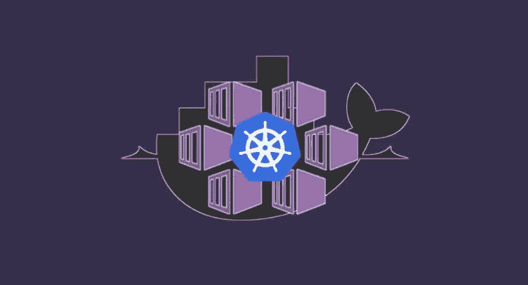
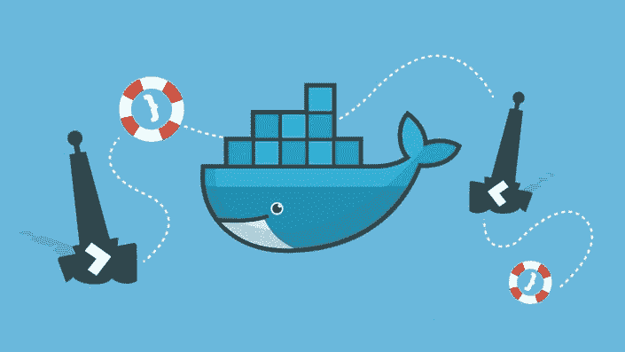
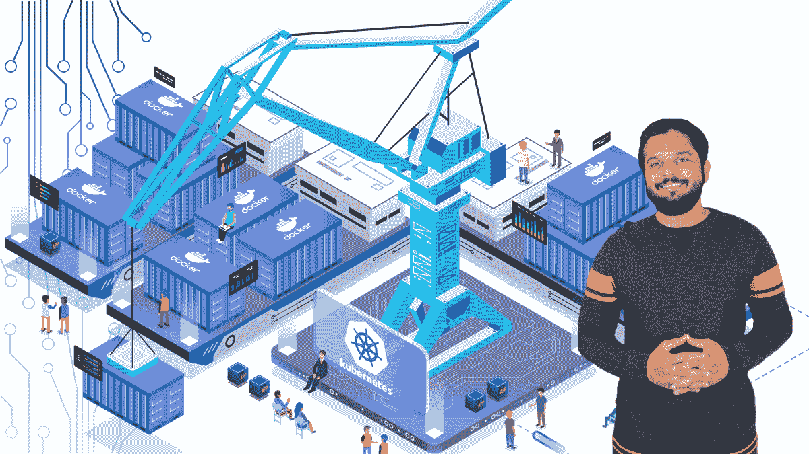
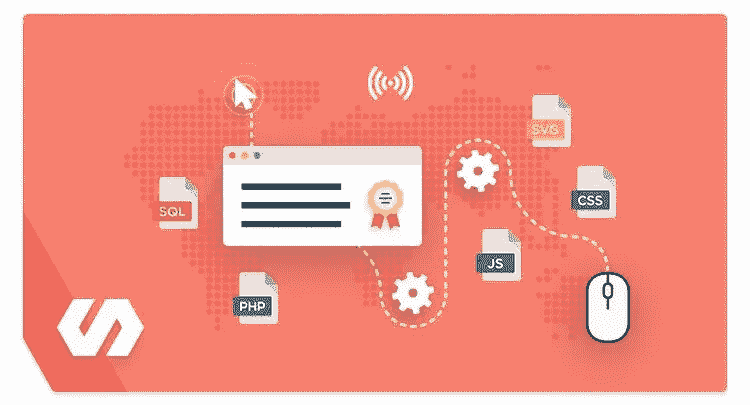
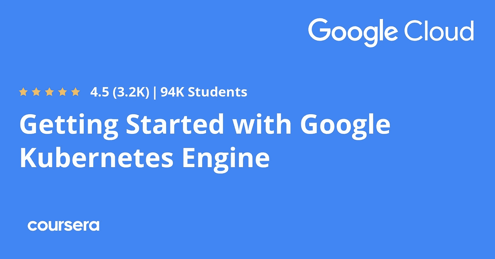
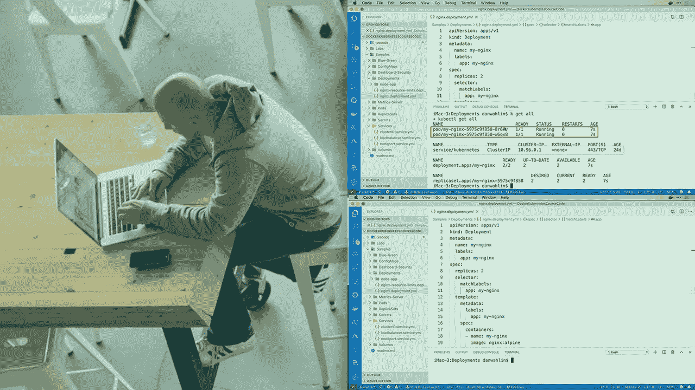
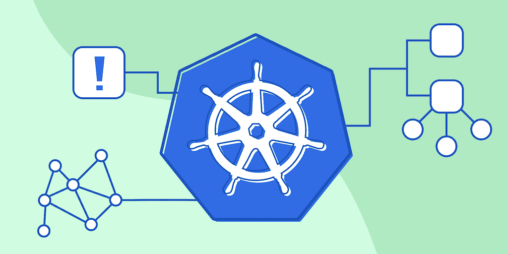
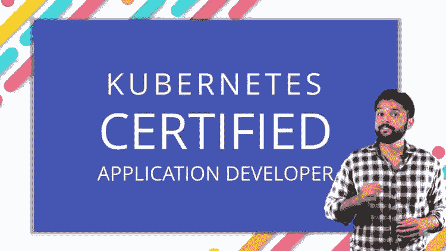
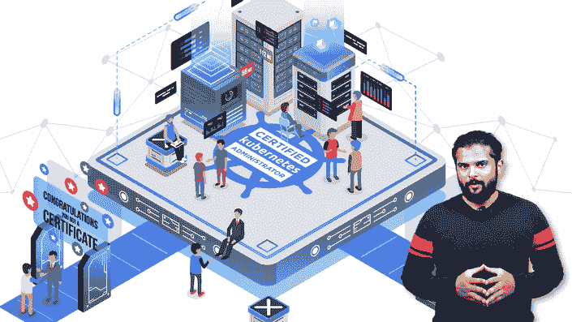

# 2023 年面向开发人员和 DevOps 工程师的 10 个最佳 Kubernetes 课程

> 原文：<https://medium.com/javarevisited/10-best-kubernetes-courses-for-developers-and-devops-engineers-94c35cd3a2fd?source=collection_archive---------0----------------------->

## 我最喜欢的 2023 年学习 Kubernetes 的课程来自 Udemy、Pluralsight、Coursera、Educative 和其他流行的在线平台。

大家好，如果你想深入了解 Kubernetes，并寻找最好的资源，如最好的 Kubernetes 课程，那么你来对地方了。早些时候，我已经分享了 [**免费 Kubernetes 课程**](/javarevisited/7-free-online-courses-to-learn-kubernetes-in-2020-3b8a68ec7abc) 和 [**DevOps 课程**](/javarevisited/13-best-courses-to-learn-devops-for-senior-developers-in-2020-a2997ff7c33c) 在这篇文章中，我将分享深入学习 Kubernetes 的最佳课程。

Kubernetes 如今已经成为容器管理社区中一个非常流行的名字，它是最受欢迎的技能之一，也是 DevOps 工程师和开发人员必须学习的工具。这是一个用 Golang 编写的工具，由 Google 创建。

在使用微服务模式和容器的生产环境中工作时，有许多事情需要注意。这些包括版本控制、健康检查、回滚机制和伸缩。 [Kubernetes](https://javarevisited.blogspot.com/2019/05/top-5-courses-to-learn-docker-and-kubernetes-for-devops.html) 提供了管理和编排能力，以根据所有必要的提到的事情来部署容器。

Kubernetes 通过在需要时自动部署和管理容器，对扩展您的微服务架构非常重要。如今， [**微服务架构**](/javarevisited/top-5-courses-to-learn-microservices-in-java-and-spring-framework-e9fed1ba804d) 和容器成为潮流，Kubernetes 是编排容器的最佳工具之一。Kubernetes 是近年来求职人数增长最快的公司之一。

对[拥有 Kubernetes](https://javarevisited.blogspot.com/2018/09/10-devops-courses-for-experienced-java-developers.html) 的 DevOps 有很高的需求，获得 Kubernetes 认证可以让你从其他候选人中脱颖而出。这些认证不仅能帮助你掌握 Kubernetes，还能增加你获得高薪工作的机会。

如果您正在寻找在线培训课程来学习 Kubernetes 架构和用例，或者准备参加[认证的 Kubernetes 管理员](/javarevisited/6-best-certified-kubernetes-administrator-courses-and-practice-tests-to-crack-cka-exam-46a14549720f) (CKA)或认证的 Kubernetes 应用程序开发人员( [CKAD](/javarevisited/7-best-certified-kubernetes-application-developer-ckad-courses-practice-tests-in-2021-9b8b7d2c375) )，那么您来对地方了。

在这篇文章中，我将列出 2023 年你可以学习 Kubernetes 并通过这一享有盛誉且受欢迎的认证，同时也成为一名合格的 Kubernetes 用户的前 **10 门最佳 Kubernetes 课程**。

顺便说一下，你不需要参加所有这 10 门课程，参加一门或两门课程就足够了，只需参加那些你与讲师联系的课程，观看预览，如果你可以不用前进就可以浏览预览，那么这是参加课程的一个很好的指示。

# 2023 年面向 DevOps 工程师和高级开发人员的 10 门最佳 Kubernetes 在线课程

这里列出了 2023 年学习 Kubernetes 的最佳课程，不要再浪费你的时间了。这些课程是由对 Kubernetes 了如指掌的专家讲师设计的，可以在最好的在线学习网站上找到，比如 Udemy、Coursera、Pluralsight 等等。它们也是一个非常实惠的课程，大多数课程在 Udemy 上只需 10 美元就能买到。

## 1.库伯内特:实用指南

这是在 Udemy 上学习 Docker 和 Kubernetes 最好的课程之一。由 Acadmind 的 maxmillian Schwarz muller 创建的这个实践课程是从头开始学习 Kubernetes 的最佳指南。

本课程将教你 Docker & Kubernetes 从地面上与所有必要的理论和大量的例子和演示！

您将通过实例和演示详细了解所有关键概念——从映像和容器、卷、网络一直到部署和 Kubernetes 集群:本课程应有尽有！

以下是您将在本课程中学到的内容:

1.  如何使用 Docker 创建和使用图像和容器
2.  了解使用 Docker Networks 和 DNS 服务发现的容器网络
3.  如何在任何系统上安装和使用 Docker(MAC OS，Windows， [Linux](/javarevisited/7-best-linux-courses-for-developers-cloud-engineers-and-devops-in-2021-7415314087e1)
4.  如何部署 Docker 应用程序——手动、使用托管服务还是使用 Kubernetes

所有这些主题都通过幻灯片和理论进行了详细的讲解，但最重要的是，还有许多例子和演示。这也是我在 Udemy 上学习 Docker 和 Kubernetes 最喜欢的课程

**这是加入本课程的链接** — [Docker & Kubernetes:实用指南](https://click.linksynergy.com/deeplink?id=CuIbQrBnhiw&mid=39197&murl=https%3A%2F%2Fwww.udemy.com%2Fcourse%2Fdocker-kubernetes-the-practical-guide%2F)

## 2.[面向绝对初学者的 Kubernetes 动手操作](https://click.linksynergy.com/deeplink?id=JVFxdTr9V80&mid=39197&murl=https%3A%2F%2Fwww.udemy.com%2Fcourse%2Flearn-kubernetes%2F)

如果你是一个绝对的初学者，那么 Udemy 的“Kubernetes for the Absolute 初学者”是你的最佳选择。即使你不知道 Kubernetes 是什么，你也可以参加这个课程。

本课程由[**Mumshad Mannambeth**](https://click.linksynergy.com/deeplink?id=CuIbQrBnhiw&mid=39197&murl=https%3A%2F%2Fwww.udemy.com%2Fuser%2Fmumshad-mannambeth%2F)创建，他是学习 Kubernetes 和云计算主题的最佳讲师之一，本课程将对此进行介绍。他只花了 40 多分钟概述 Kubernetes，这可能是我在 Kubernetes 上最棒的 40 分钟。

不仅仅是概述，课程中的每件事都解释得很清楚，没有任何仓促。

因此，如果你是一个绝对的初学者，这个 Kubernetes 课程是给你的。超过 56000 名学生注册了这门课程，比本文中提到的任何其他课程都多。

**以下是加入本课程的链接—** [Kubernetes，专为绝对初学者而设](https://click.linksynergy.com/deeplink?id=JVFxdTr9V80&mid=39197&murl=https%3A%2F%2Fwww.udemy.com%2Fcourse%2Flearn-kubernetes%2F)

## 3. [Docker 和 Kubernetes:完全指南](https://click.linksynergy.com/deeplink?id=CuIbQrBnhiw&mid=39197&murl=https%3A%2F%2Fwww.udemy.com%2Fcourse%2Fdocker-and-kubernetes-the-complete-guide%2F)

对于任何想学习 Docker 和 Kubernetes 的人来说，这是另一个很棒的课程。本课程与第一门课程相似，但来自另一位出色的 Udemy 讲师 Stephen Grider ，他擅长简化复杂的主题。

以下是你将在这个令人敬畏的课程中学到的东西:

1.  Docker 和 Kubernetes 从零开始。
2.  如何使用 Github、Travis CI 和 AWS 从头开始构建 CI + CD 管道
3.  掌握 Docker CLI 来检查和调试正在运行的容器
4.  通过构建一个复杂的应用程序来理解 Kubernetes 的目的和理论
5.  如何在推送到 Github 时自动部署你的代码！

您还将处理 Kubernetes，这是一个生产级系统，用于管理具有许多不同运行容器的复杂应用程序。您将学习构建 Kubernetes 集群的正确方法。

**以下是加入本课程的链接** — [Docker 和 Kubernetes:完整指南](https://click.linksynergy.com/deeplink?id=CuIbQrBnhiw&mid=39197&murl=https%3A%2F%2Fwww.udemy.com%2Fcourse%2Fdocker-and-kubernetes-the-complete-guide%2F)

## 8.[Google Kubernetes 引擎入门](https://coursera.pxf.io/c/3294490/1164545/14726?u=https%3A%2F%2Fwww.coursera.org%2Flearn%2Fgoogle-kubernetes-engine)【Coursera】

这是另一个从零开始学习 Kubernetes 的很棒的课程。该课程由 Google Cloud 提供，可在 Coursera(最著名的在线学习平台之一)上获取。

本课程也是 Coursera 和 Google Cloud 提供的 [**准备 Google Cloud 认证:Cloud DevOps 工程师职业证书**](https://coursera.pxf.io/c/3294490/1164545/14726?u=https%3A%2F%2Fwww.coursera.org%2Fprofessional-certificates%2Fsre-devops-engineer-google-cloud) e 的一部分，值得放在简历上的东西。

在本课程中，每个模块旨在培养您与 GKE 或谷歌 Kubernetes 引擎互动的能力，并包括动手实验室，让您亲身体验功能。

在第一个模块中，您将了解一系列 Google 云服务和功能，以期帮助您选择合适的 Google 云服务来创建自己的云解决方案。

您还将了解如何使用云构建创建容器，并将容器存储在容器注册表中。您还将比较和对比 Kubernetes 和 Google Kubernetes 引擎(也称为 GKE)的功能。

除了将 Kubernetes 架构概念化之外，您还将使用 GKE 部署一个 Kubernetes 集群，将 Pods 部署到一个 GKE 集群，并查看和管理 Kubernetes 对象。

**这里是加入本课程的链接** — [谷歌 Kubernetes 引擎入门](https://coursera.pxf.io/c/3294490/1164545/14726?u=https%3A%2F%2Fwww.coursera.org%2Flearn%2Fgoogle-kubernetes-engine)

而且，如果你想让你的 Kubernetes 技能更上一层楼，我也推荐你在 Coursera 上用 [**Google Kubernetes 引擎专业化**](https://coursera.pxf.io/c/3294490/1164545/14726?u=https%3A%2F%2Fwww.coursera.org%2Fspecializations%2Farchitecting-google-kubernetes-engine) 来检验架构。本课程由 Google Cloud training 提供，学习 kubectl command 及其角色非常重要。

<https://coursera.pxf.io/c/3294490/1164545/14726?u=https%3A%2F%2Fwww.coursera.org%2Fspecializations%2Farchitecting-google-kubernetes-engine>  

顺便说一下，如果你觉得 Coursera 的课程很有用，因为它们是由世界各地知名的公司和大学创建的，我建议你加入 Coursera Plus 的订阅计划，它可以让你无限制地访问他们最受欢迎的课程、专业知识、专业证书和指导项目。

<https://coursera.pxf.io/c/3294490/1164545/14726?u=https%3A%2F%2Fwww.coursera.org%2Fcourseraplus>  

## 5. [Kubernetes for Developers:核心概念](https://pluralsight.pxf.io/c/1193463/424552/7490?u=https%3A%2F%2Fwww.pluralsight.com%2Fcourses%2Fkubernetes-developers-core-concepts)【plural sight 课程】

如果你是一个初学者，并希望以简单的方式轻松掌握 Kubernetes 的核心概念，Pluralsight 的“Kubernetes for Developers:Core Concepts”是一个非常好的选择。

这是一个初级课程，从 Kubernetes 的基础知识开始，然后逐渐转向使用 Kubernetes 部署容器等主题。讲师 Dan Wahlin 还重点介绍了存储、配置图和机密的作用。

要求

*   建议具备 Kubernetes 的基础知识

课程时长不到五个小时。所以如果你想快速学习核心概念，你可以去上这门课。

**这里是加入本课程的链接**—[Kubernetes for Developers:核心概念](https://pluralsight.pxf.io/c/1193463/424552/7490?u=https%3A%2F%2Fwww.pluralsight.com%2Fcourses%2Fkubernetes-developers-core-concepts)

顺便说一下，你需要 Pluralsight 会员资格才能参加这个课程，费用大约是每月 29 美元或每年 299 美元(14%的折扣)。虽然成为 Pluralsight 会员是值得的，因为它可以让您访问他们 7000 多门高质量的在线培训课程，但您也可以通过参加他们的 [**10 天免费试用**](https://pluralsight.pxf.io/c/1193463/424552/7490?u=https%3A%2F%2Fwww.pluralsight.com%2Flearn) 来探索，这将提供 200 分钟的观看时间，足以完成本课程。

<https://pluralsight.pxf.io/c/1193463/424552/7490?u=https%3A%2F%2Fwww.pluralsight.com%2Flearn>  

## 6.Kubernetes 实用指南【教育性最佳课程】

这是我最喜欢的互动课程之一，以引导和动手的方式学习 Kubernetes。本课程来自 [Educative](https://www.educative.io/subscription?affiliate_id=5073518643380224) ，这是一个领先的基于文本的交互式在线学习平台。

在这个交互式 Kubernetes 课程中，您将从 Kubernetes 的基础知识和集群的主要组件开始。然后，您将学习如何使用这些组件来构建、测试、部署和升级应用程序，以及如何在部署应用程序后实现状态持久性。

您还将学习如何保护您的部署和管理资源，这是开发运维的关键技能。

本课程包含超过 175 课，14 个测验，880 个代码片段，80 多幅插图，让你有一个完整的学习体验。这门课程也是他们的[**DevOps for Developers Path**](https://www.educative.io/path/devops-for-developers?affiliate_id=5073518643380224)的一部分，这是开发者可以加入成为一名优秀 devo PS 工程师的最佳课程集合。

当您完成本课程时，您将对 Kubernetes 有一个牢固的掌握，以及自信地部署您自己的集群和应用程序的技能。

**这是加入本课程的链接**—[Kubernetes 实用指南](https://www.educative.io/courses/practical-guide-to-kubernetes?affiliate_id=5073518643380224)

此外，如果你觉得教育平台和他们的 DevOps 课程有用，那么你也可以考虑购买 [**教育订阅**](https://www.educative.io/subscription?affiliate_id=5073518643380224) ，每月只需 14.99 美元就可以访问他们的 250 多门课程。非常划算，非常适合准备编码面试。

<https://www.educative.io/subscription?affiliate_id=5073518643380224>  

## 7. [Kubernetes 认证应用开发人员(CKAD)测试](https://click.linksynergy.com/deeplink?id=JVFxdTr9V80&mid=39197&murl=https%3A%2F%2Fwww.udemy.com%2Fcourse%2Fcertified-kubernetes-application-developer%2F)

这是 udemy 评价最高的 Kubernetes 课程之一。本课程，连同适当的解释，也提供了一个动手操作的环境。实践考试对理解概念非常有用。

而且，课程还有编码小测验。

要求

*   对系统管理有基本的了解。
*   使用 python 进行应用开发的基础知识。
*   [Kubernetes](https://javarevisited.blogspot.com/2019/01/top-5-free-kubernetes-courses-for-DevOps-Engineer.html) 的基础知识

超过三万七千名学生注册了这门课程。一旦注册，你就可以进入包括其他学生和老师在内的社区。社区将帮助您解决问题，并指导您完成整个课程。

**这是参加本课程的链接** — [Kubernetes 认证应用程序开发人员(CKAD)考试](https://click.linksynergy.com/deeplink?id=JVFxdTr9V80&mid=39197&murl=https%3A%2F%2Fwww.udemy.com%2Fcourse%2Fcertified-kubernetes-application-developer%2F)

## 8.【Kubernetes 认证管理员(CKA)带模拟测试

“Kubernetes 认证管理员(CKA)与实践测试”是 Udemy 上最畅销的 Kubernetes 课程，被评为超过 11000 次。*认证 Kubernetes 管理员(CKA)* 被认为是一门很难的课程，但讲师会轻松简单地解释每一个概念。

此外，该课程使学生能够接触到由其他学生和教师组成的强大社区。除了适当的解释，该课程还鼓励实践。这门课程有一个很棒的实践环境，可以帮助你更清楚地学习所有的东西。

要求

*   [码头工人](/@javinpaul/10-free-courses-to-learn-docker-and-devops-for-frontend-developers-691ac7652cee)的基本知识和认识。
*   YAML 语言知识

超过四万八千名学生注册了这门课程。该课程非常完美，不仅适用于 DevOps，也适用于希望掌握 Kubernetes 的系统管理员和应用程序开发人员。

**以下是参加本课程的链接**—[Kubernetes 认证管理员(CKA)带模拟测试](https://click.linksynergy.com/deeplink?id=JVFxdTr9V80&mid=39197&murl=https%3A%2F%2Fwww.udemy.com%2Fcourse%2Fcertified-kubernetes-administrator-with-practice-tests%2F)

## 9.[学习 DevOps:完整的 Kubernetes 课程](https://click.linksynergy.com/deeplink?id=JVFxdTr9V80&mid=39197&murl=https%3A%2F%2Fwww.udemy.com%2Fcourse%2Flearn-devops-the-complete-kubernetes-course%2F)

udemy 上的另一个畅销书“学习 DevOps:完整的 Kubernetes 课程”是为那些想学习如何构建、部署、维护和使用 Kubernetes 的人开设的课程。

本课程涵盖了一些基本概念，比如在 Kubernetes 上运行有状态和无状态的应用程序，在 Kubernetes 上使用 [Docker 客户端](/javarevisited/top-5-free-courses-to-learn-docker-for-beginners-best-of-lot-b2b1ad2b98ad?source=collection_home---4------2-----------------------)，伸缩等等。

要求

*   建议了解 AWS / Docker / AWS，但这不是强制性的。

除了本地，该课程还可以选择在 [AWS](https://javarevisited.blogspot.com/2019/08/how-to-crack-aws-certified-solution-architect-exam.html) 上使用 Kubernetes。因此，如果您事先了解 AWS，您可以选择这个选项。

**这是加入本课程的链接**——[学习 Kubernetes 课程大全](https://click.linksynergy.com/deeplink?id=JVFxdTr9V80&mid=39197&murl=https%3A%2F%2Fwww.udemy.com%2Fcourse%2Flearn-devops-the-complete-kubernetes-course%2F)

这就是关于深入学习 Kubernetes 的最佳在线课程的全部内容。这些也是 Udemy、Coursera 和 Pluralsight 最推荐的 Kubernetes 课程，你可以加入这些课程中的任何一门，在 2023 年学习这一有价值且最受欢迎的技能。Kubernetes 正处于潮流之中，对 Kubernetes 有适当了解的开发人员可以获得高收入的工作。证书是必要的，本课程中提到的那些证书肯定会帮助你找到一份好工作。

文章中列出的大部分课程里面都有动手操作。实践对于理解 Kubernetes 非常重要，动手考试肯定会对你有所帮助。有些课程是为那些已经掌握了 Kubernetes 基础知识的开发者开设的，但是你也可以找到一些课程是为绝对初学者开设的。所以相应选择。

其他 **DevOps、云、编程课程**你可能喜欢

*   [2023 年 DevOps 开发者路线图](/hackernoon/the-2018-devops-roadmap-31588d8670cb)
*   [面向 Java 和 DevOps 专业人员的 10 门免费 Docker 课程](https://javarevisited.blogspot.sg/2018/02/10-free-docker-container-courses-for-Java-Developers.html)
*   [学习 Jenkins 自动化和开发运维的五大课程](https://javarevisited.blogspot.com/2018/09/top-5-jenkins-courses-for-java-and-DevOps-Programmers.html)
*   [2023 年学习 Kubernetes 的 7 门免费在线课程](/javarevisited/7-free-online-courses-to-learn-kubernetes-in-2020-3b8a68ec7abc)
*   [我最喜欢的学习亚马逊网络服务的课程](https://javarevisited.blogspot.com/2020/05/top-5-amazon-web-services-aws-courses-for-beginners-and-experienced-programmers.html)
*   [5 门免费 Selenium 课程学习自动化测试](https://javarevisited.blogspot.sg/2018/02/top-5-selenium-webdriver-with-java-courses-for-testers.html)
*   [面向程序员的 10 门 Docker 和 Kubernetes 课程](https://dev.to/javinpaul/top-10-courses-to-learn-docker-and-kubernetes-for-programmers-4lg0)
*   [面向 Java 开发者的 6 门 Maven 课程](http://www.java67.com/2018/02/6-free-maven-and-jenkins-online-courses-for-java-developers.html)
*   [2023 年 Java 开发人员应该学会的 10 件事](http://javarevisited.blogspot.sg/2017/12/10-things-java-programmers-should-learn.html#axzz53ENLS1RB)
*   [我最喜欢为有经验的人学习 DevOps 的课程](https://javarevisited.blogspot.com/2018/09/10-devops-courses-for-experienced-java-developers.html)
*   [2023 年 Java 开发人员应该学习的 10 种工具](http://www.java67.com/2018/04/10-tools-java-developers-should-learn.html)
*   [5 免费弹簧框架和 Spring Boot 课程](http://www.java67.com/2017/11/top-5-free-core-spring-mvc-courses-learn-online.html)
*   [面向 Java JEE 开发人员的 5 大 Hibernate 和 JPA 课程](http://javarevisited.blogspot.sg/2018/01/top-5-hibernate-and-jpa-courses-for-java-programmers-learn-online.html)
*   [程序员学习 AWS 和云的 10 门免费课程](/javarevisited/top-10-courses-to-learn-amazon-web-services-aws-cloud-in-2020-best-and-free-317f10d7c21d)
*   [面向开发者的 13 个最佳 DevOps 课程](/javarevisited/13-best-courses-to-learn-devops-for-senior-developers-in-2020-a2997ff7c33c)

感谢阅读到目前为止。如果您喜欢这些*面向开发人员和开发人员的最佳 Kubernetes 课程*，并发现它们对 Kubernetes 认证(如 Kubernetes 应用程序开发人员和管理员认证)非常有用，请与您的朋友和同事分享。如果您有任何问题或反馈，请留言。

**P. S. —** 如果你想学习 Kubernetes，并在你的简历中增加一项有用的技能，但又在寻找免费课程，那么你也可以在 Udemy 上查看这个 [**Kubernetes:入门****免费课程。这是完全免费的，你需要的只是一个免费的 Udemy 帐户来注册这个在线培训课程。**](https://click.linksynergy.com/deeplink?id=CuIbQrBnhiw&mid=39197&murl=https%3A%2F%2Fwww.udemy.com%2Fcourse%2Fkubernetes-getting-started%2F)

**<https://click.linksynergy.com/deeplink?id=CuIbQrBnhiw&mid=39197&murl=https%3A%2F%2Fwww.udemy.com%2Fcourse%2Fkubernetes-getting-started%2F> **