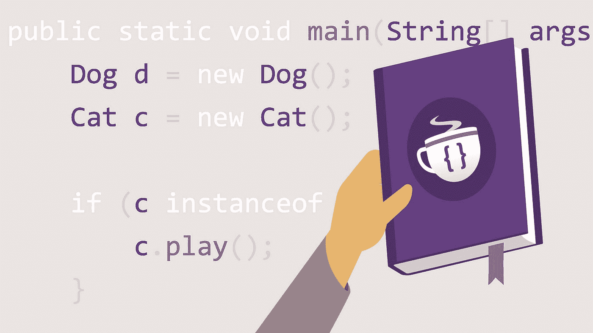
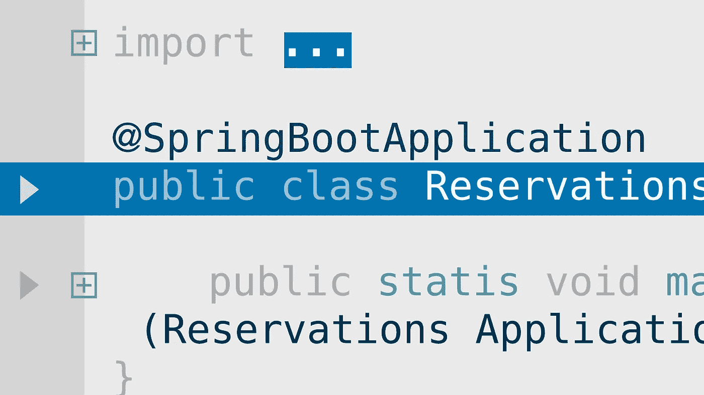
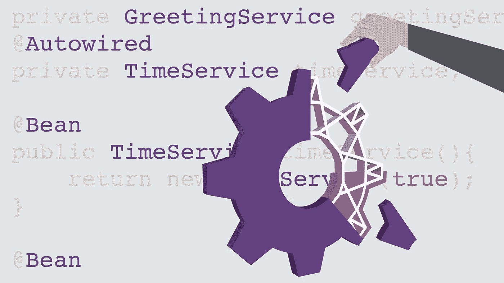
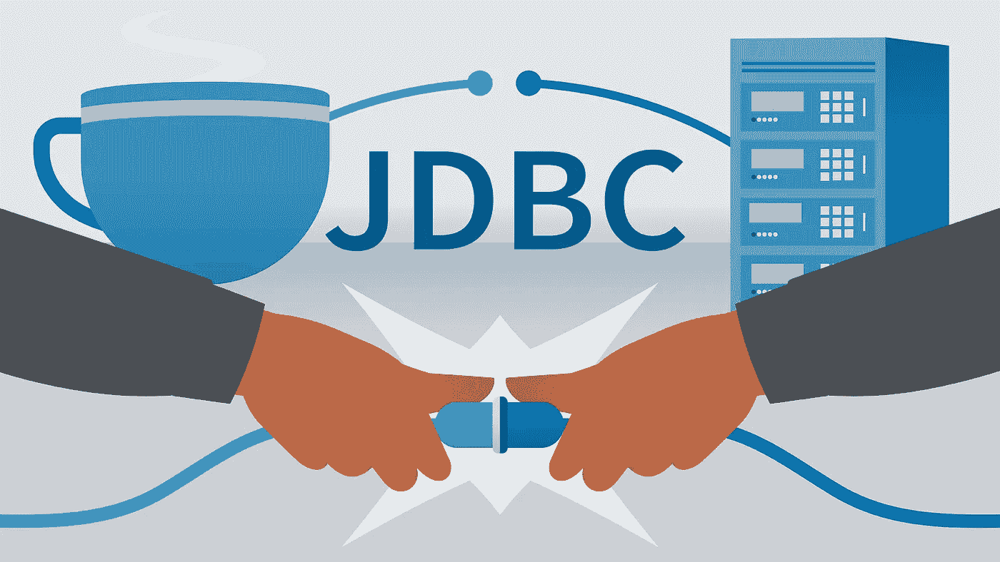
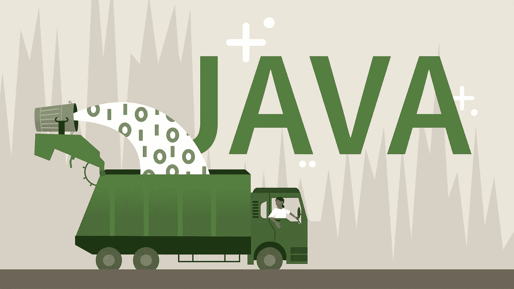
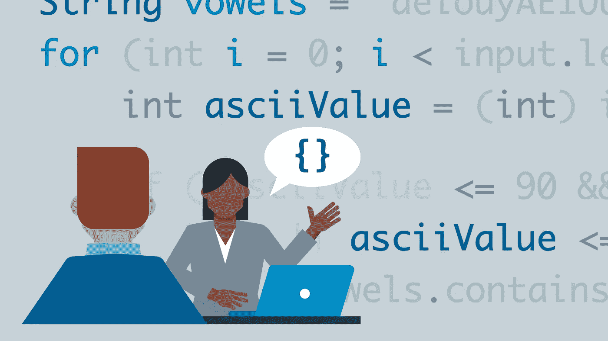
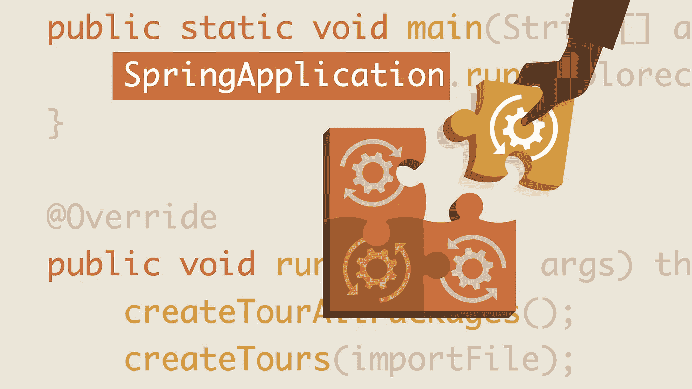

# 2023 年 Java 程序员 10 门最佳 LinkedIn 学习课程

> 原文：<https://medium.com/javarevisited/10-best-linkedin-learning-courses-for-java-programmers-fd5ae9ff1358?source=collection_archive---------1----------------------->

## 我最喜欢的 LinkedIn 学习在线课程 Java 程序员 s 2023 年学习 Java，Spring Boot，JDBC，微服务，JPA，Spring 框架

大家好，如果你想在 2023 年学习 Java 和 Spring Framework，并寻找面向 Java 程序员的最佳 LinkedIn 学习在线课程，那么你来对地方了。

*披露——顺便说一句，其中一些链接是附属链接，如果你使用我的链接加入这些课程，我可能会得到报酬。*

早些时候，我已经分享了来自像 [Udemy](https://click.linksynergy.com/deeplink?id=CuIbQrBnhiw&mid=39197&murl=https%3A%2F%2Fwww.udemy.com%2F) 、 [Coursera](https://click.linksynergy.com/deeplink?id=JVFxdTr9V80&mid=40328&murl=https%3A%2F%2Fwww.coursera.org%2F) 和 [Pluralsight](https://pluralsight.pxf.io/c/1193463/424552/7490?u=https%3A%2F%2Fwww.pluralsight.com) 这样的网站的[**最佳 Java 在线课程**](/javarevisited/top-5-java-online-courses-for-beginners-best-of-lot-1e1e240a758) ，在这篇文章中，你将找到针对 Java 开发人员的最佳 Java、Spring、Spring Boot、JDBC、JPA、云原生开发和微服务课程。

LinkedIn Learning 是一个由流行的社交网站 LinkedIn 提供的教育网站，我认为，每个 Java 开发人员都应该有自己的帐户。它有很多有用的课程来学习基本的技能和技术，今天，我将为 Java 和 Spring Boot 开发者分享最好的 LinkedIn 学习课程。

LinkedIn Learning，以前被称为 Lynda，也是一个基于订阅的网站，如 [Pluralsight](https://pluralsight.pxf.io/c/1193463/424552/7490?u=https%3A%2F%2Fwww.pluralsight.com) 、 [Codecademy](https://bit.ly/codecademyhome) 和 [Educative](https://www.educative.io/subscription?affiliate_id=5073518643380224) ，在那里你只需订阅一次就可以获得许多课程。

在 LinkedIn 学习网站上，你会找到职业生涯每一步的课程。你可以在当前领域学习新东西或提升技能。

他们也有一个流行技术的学习路径，例如，有一个 Java 程序员学习路径，它将以结构化的方式结合最好的 Java 课程，为您提供 20 个小时的学习时间。

与 [**教育性**](https://www.educative.io/subscription?affiliate_id=5073518643380224) 类似，他们也允许你购买单一课程，但我建议你按月订阅，这是在 LinkedIn Learning 上更划算的学习方式。只需**每月 29 美元，你就可以访问他们的 15000 多个在线课程，这些课程是由不同技术领域的专家创建的。**

# **LinkedIn Learning 2023 年加入的 10 门最佳 Java 和 Spring 课程**

**这里有一个学习 Java、Spring、Spring Boot、JDBC、JPA、内存管理和 LinkedIn learning 的其他核心 Java 技能的最佳课程列表，不要再浪费你的时间了。**

**这些在线培训班和课程是由具有实际经验的专家创建的，它们非常适合从零开始学习，也可以将您现有的知识提升到一个新的水平。**

## **1.[学习 Java](http://linkedin-learning.pxf.io/c/1193463/449670/8005?u=https%3A%2F%2Fwww.linkedin.com%2Flearning%2Flearning-java-4)**

**这是一门从零开始学习 Java 的初级课程。由 Kathryn Hodge 创建的 LinkedIn learning 涵盖了所有的 Java 基础知识，如数据类型、字符串、函数和循环。她还会教你控制代码的流程和逻辑，调试你的项目以确保它完美运行。**

**在这个过程中，您还将看到真实世界的例子和编码挑战，这些例子和挑战允许您练习新的 Java 编程技能。本课程非常适合需要快速掌握 Java 的开发人员，以及希望从头开始学习 Java 的初级程序员。**

**如果你以前没有 Java 或任何其他重新编程语言的编程经验，那么我建议你从 LinkedIn 学习课程开始你的编码之旅。**

****这里是加入本课程** — [学习 Java](http://linkedin-learning.pxf.io/c/1193463/449670/8005?u=https%3A%2F%2Fwww.linkedin.com%2Flearning%2Flearning-java-4) 的链接**

****

## **3.[跟 Spring Boot 学春天](http://linkedin-learning.pxf.io/c/1193463/449670/8005?u=https%3A%2F%2Fwww.linkedin.com%2Flearning%2Flearning-spring-with-spring-boot-2)**

**与成为 Java 开发人员学习路径类似，LinkedIn learning 也有*成为 Spring 开发人员学习路径*，在这里你会找到很多有用的课程，从初学者到高级水平，学习核心 Spring、 [Spring MVC](https://javarevisited.blogspot.com/2020/08/top-5-courses-to-learn-spring-mvc-for.html#axzz6l7a2SLSi) 和 Spring Boot，成为 Spring 开发人员。**

**这是 path 的第一门课程，也是从头开始学习 Spring 的好课程。在本课程中，本列表中的 [JDBC 学习课程](http://linkedin-learning.pxf.io/c/1193463/449670/8005?u=https%3A%2F%2Fwww.linkedin.com%2Flearning%2Flearning-jdbc)的讲师 Frank Moley 将教你如何使用 Spring Boot 快速有效地开发一个实用的企业风格的 web 应用程序。**

**Frank 还会教你如何开发应用程序，他会帮助你熟悉 Spring 的一般框架。另外，Frank 深入研究了 Spring 的一些基本项目，您可以用它们来开发基于 Java 的应用程序。**

**以下是加入本课程的链接— [和 Spring Boot 一起学习春天](http://linkedin-learning.pxf.io/c/1193463/449670/8005?u=https%3A%2F%2Fwww.linkedin.com%2Flearning%2Flearning-spring-with-spring-boot-2)**

****

## **3.[弹簧:框架深入](http://linkedin-learning.pxf.io/c/1193463/449670/8005?u=https%3A%2F%2Fwww.linkedin.com%2Flearning%2Fspring-framework-in-depth-2)**

**这是一门来自 LinkedIn learning 的中级 Spring 框架课程，由软件架构师 Frank Moley 打造。**

**Frank 使用 Spring 开发应用程序和 web 服务，并分享他所知道的关于配置`ApplicationContext` (用于访问组件、加载文件、发布事件等的接口)和 bean(Spring IOC 容器[中的对象](https://javarevisited.blogspot.com/2012/12/inversion-of-control-dependency-injection-design-pattern-spring-example-tutorial.html#axzz6iNNhKZui))的知识。**

**他演示了一个现代的 Java 配置工作流，并深入探讨了 Spring 的生命周期，因此您可以扩展框架，更好地解决应用程序中的任何问题。**

**另外，您还将学习如何使用面向方面的编程，以可重用的方式将行为添加到您的应用程序中。**

****以下是加入本课程的链接—** [Spring:框架深入](http://linkedin-learning.pxf.io/c/1193463/449670/8005?u=https%3A%2F%2Fwww.linkedin.com%2Flearning%2Fspring-framework-in-depth-2)**

****

## **4.[学习 JDBC](http://linkedin-learning.pxf.io/c/1193463/449670/8005?u=https%3A%2F%2Fwww.linkedin.com%2Flearning%2Flearning-jdbc)**

**JDBC 是一个基本的 Java API，它允许你从 Java 程序中访问 MySQL、Oracle 和 Microsoft SQL Server 等数据库。由于大多数现实世界的应用程序需要一个数据库，每个 Java 开发人员都需要掌握 JDBC，本课程可以帮助你。**

**在本课程中，Frank Moley 将向您介绍 Java 数据库连接(JDBC) API，展示如何使用它在 Java 应用程序中读取和管理来自关系数据库的数据，如 [Postgres](https://javarevisited.blogspot.com/2020/02/top-5-courses-to-learn-postgresql-in.html) 、 [MySQL](https://javarevisited.blogspot.com/2018/05/top-5-mysql-courses-to-learn-online.html) 、 [Oracle](/javarevisited/top-10-free-courses-to-learn-microsoft-sql-server-and-oracle-database-in-2020-6708afcf4ad7) 和 [Microsoft SQL Server](https://javarevisited.blogspot.com/2020/02/top-5-courses-to-learn-microsoft-sql-server-mssql.html) 。**

**本课程首先介绍重要的 JDBC 术语、配置 PostgreSQL 数据库的基础知识以及如何创建课程项目。之后，您将学习如何选择和更新数据、处理事务、处理异常等等。**

****以下是加入本课程** — [学习 JDBC](http://linkedin-learning.pxf.io/c/1193463/449670/8005?u=https%3A%2F%2Fwww.linkedin.com%2Flearning%2Flearning-jdbc) 的链接**

****

## **5. [Java 内存管理](http://linkedin-learning.pxf.io/c/1193463/449670/8005?u=https%3A%2F%2Fwww.linkedin.com%2Fjava-memory-management)**

**这是一门关于 LinkedIn 学习的中级 Java 课程，它将教你如何在 Java 中使用内存。由 Matt Greencroft 创建的这门课程将会教你一些基本的 JVM 概念，比如栈和堆的角色，转义引用，垃圾收集，检测软泄漏等等。**

**此外，他通过演示如何在一个示例 Java web 应用程序中寻找并修复内存泄漏，为这些概念提供了一个真实的环境。**

**虽然 Matt 在整个课程中使用 Eclipse 和 Java 8，但他所涉及的内容对任何 IDE 和 Java 6 及更高版本都有效。**

**以下是参加本课程的链接— [Java 内存管理](http://linkedin-learning.pxf.io/c/1193463/449670/8005?u=https%3A%2F%2Fwww.linkedin.com%2Fjava-memory-management)**

****

## **6. [Java 持久性 API (JPA): 1 基础知识](http://linkedin-learning.pxf.io/c/1193463/449670/8005?u=https%3A%2F%2Fwww.linkedin.com%2Fjava-persistence-api-jpa-1-the-basics)**

**这是另一个关于 LinkedIn 学习的中级 Java 课程。Java 持久性 API (JPA)是将 Java 对象映射到关系数据库的标准框架。

JPA 提供了一些优于传统数据访问方法的优势，比如 [Java 数据库连接](/javarevisited/top-5-courses-to-learn-jdbc-and-database-connectivity-for-java-developers-free-and-best-of-lot-7945156fcc3?source=---------9------------------) (JDBC)。在这个实践课程中，凯莎·威廉姆斯将教你 JPA 的基础知识，实体管理，交易管理，关系映射，以及 JDBC 的利弊。**

**学完本课程后，您将对 [JPA](/javarevisited/top-5-books-to-learn-hibernate-for-java-developers-b2cb4b16ccd6) 和在 Java 企业应用程序中持久化数据有很好的了解。**

****这里是加入本课程的链接** — [Java 持久性 API (JPA): 1 基础知识](http://linkedin-learning.pxf.io/c/1193463/449670/8005?u=https%3A%2F%2Fwww.linkedin.com%2Fjava-persistence-api-jpa-1-the-basics)**

****

## **7.[使用 Java 和 Eclipse MicroProfile 进行云原生开发](http://linkedin-learning.pxf.io/c/1193463/449670/8005?u=https%3A%2F%2Fwww.linkedin.com%2Fcloud-native-development-using-java-with-eclipse-microprofile)**

**许多 Java 开发人员正在构建云原生应用程序，并在寻找创建遵循最佳实践的弹性应用程序的方法。Eclipse MicroProfile 为微服务架构优化了企业 Java 应用程序。**

**这些规范是由社区中的专家创建的，并得到了 IBM、RedHat 和 Oracle 等公司的支持，这使得它成为像您这样的开发人员的绝佳选择。

创建一个云原生 Java 应用程序需要学习的课程并不多 [Eclipse MicroProfile](https://projects.eclipse.org/projects/technology.microprofile) 但是这个很好。在这个 LinkedIn 学习课程中，IBM 软件工程师 Kate Stanley 将教您如何使用 Open Liberty app server 使用 MicroProfile 规范来启用您现有的企业 Java 应用程序。**

**在这个过程中，您还将学习如何添加健康检查、收集指标和跟踪请求。完成本课程后，您将拥有将 Java 应用带入现代所需的技能和工具集。**

****这里是加入本课程的链接** — [使用 Java 和 Eclipse MicroProfile 进行云原生开发](http://linkedin-learning.pxf.io/c/1193463/449670/8005?u=https%3A%2F%2Fwww.linkedin.com%2Fcloud-native-development-using-java-with-eclipse-microprofile)**

****

## **8.[搞定你的 Java 面试](http://linkedin-learning.pxf.io/c/1193463/449670/8005?u=https%3A%2F%2Fwww.linkedin.com%2Fnail-your-java-interview)**

**这是另一个我非常喜欢的 LinkedIn Java 课程，特别是他们的面向对象设计挑战，在这里你将学习如何设计一个先进的汽车停车场程序，它可以告诉你是否有停车位。**

**本课程还有一些有用的练习和复习课，涉及面试所需的关键 Java 主题，如 JDK、JRE、字符串操作、[数据结构](/javarevisited/7-best-courses-to-learn-data-structure-and-algorithms-d5379ae2588?source=---------18------------------)和基本的[面向对象编程概念](/javarevisited/7-best-online-courses-to-learn-object-oriented-design-pattern-in-java-749b6399af59?source=---------10------------------)。**

**在整个课程中，Kathryn 提供了一些例子，为她所涉及的概念提供了一个真实的环境。如果你正在准备 Java 编程面试，那么我强烈推荐这门课程。**

****这是参加本课程的链接**——[搞定你的 Java 面试](http://linkedin-learning.pxf.io/c/1193463/449670/8005?u=https%3A%2F%2Fwww.linkedin.com%2Fnail-your-java-interview)**

****

**你也可以将本课程与我的书[**Grokking the Java Interview**](https://gumroad.com/l/QqjGH)结合起来，准备理论和实践问题，以获得最佳效果。你也可以使用我的折扣代码 *friends20* 来获得 20%的折扣，尤其是对像你这样的 Java 访客读者。**

## **9.[创建您的首个 Spring Boot 微服务](http://linkedin-learning.pxf.io/c/1193463/449670/8005?u=https%3A%2F%2Fwww.linkedin.com%2Fcreating-your-first-spring-boot-microservice)**

**这个在线 Spring Boot 微服务课程是为有经验的 Java 开发人员设计的，他们希望快速构建使用 Java 持久性 API (JPA)连接关系数据库的微服务。**

**在本课程中，Mary Ellen Bowman 将教您如何使用一个公开的 RESTful API 构建一个微服务，该 API 具有 HATEOAS、分页和使用分步过程进行排序的功能。**

**您将了解到诸如 [Spring Boot](/javarevisited/top-10-courses-to-learn-spring-boot-in-2020-best-of-lot-6ffce88a1b6e?source=---------39------------------) 、 [Spring Data JPA](https://www.java67.com/2021/01/spring-data-jpa-interview-questions-answers-java.html) 和 Spring Data REST 等技术，并了解它们是如何组合成智能而优雅的解决方案的。在这个过程中，Mary Ellen 还将指导您将微服务迁移到一个 [MongoDB](https://javarevisited.blogspot.com/2019/01/top-5-mongodb-online-training-courses.html) 数据源。**

****以下是参加本课程的链接—** [创建您的首个 Spring Boot 微服务](http://linkedin-learning.pxf.io/c/1193463/449670/8005?u=https%3A%2F%2Fwww.linkedin.com%2Fcreating-your-first-spring-boot-microservice)**

****

## **10.[扩展、保护和对接 Spring Boot 微服务](http://linkedin-learning.pxf.io/c/1193463/449670/8005?u=https%3A%2F%2Fwww.linkedin.com%2Fextending-securing-and-dockerizing-spring-boot-microservices)**

**这是另一个针对有经验的 Java 开发人员的 LinkedIn 学习高级春季课程。在本课程中，您将学习如何扩展、优化、强化、测试和“对接”您的 Spring Boot 微服务，并将它们转化为生产就绪型应用。**

**由 Mary Ellen Bowman 创建的这个在线 LinkedIn 学习课程将向您传授构建专业级程序所需的高级技能，强调质量、安全性、持久性和部署的标准。**

**您将学习如何链接到外部数据库，构建安全的 API，使用单元和集成测试来发现开发期间的应用程序缺陷，以及使用 [Docker 容器](https://javarevisited.blogspot.com/2020/11/why-devops-engineer-learn-docker-kubernetes.html#axzz6dXsEfLvJ)配置可扩展的部署选项。**

****以下是参加本课程的链接—** [扩展、保护和对接 Spring Boot 微服务](http://linkedin-learning.pxf.io/c/1193463/449670/8005?u=https%3A%2F%2Fwww.linkedin.com%2Fextending-securing-and-dockerizing-spring-boot-microservices)**

****

**以上是 LinkedIn Learning 提供的**最佳 Java 和 Web 开发课程。这些是 LinkedIn Learning 中最好的 Java 和 Spring 课程，它涵盖了广泛的技能，如核心 Spring、Spring Boot、微服务和云原生 Java 开发，这些对于 2023 年的 Java 专业人员来说极其重要。****

**你只需订阅一个 LinkedIn 就可以观看所有这些课程。如果你已经订阅了 LinkedIn，那么你可以马上加入这个课程，或者，你也可以使用他们的 [**1 个月免费试用**](http://linkedin-learning.pxf.io/c/1193463/449670/8005?u=https%3A%2F%2Fwww.linkedin.com%2Flearning%2Fsubscription%2Fproducts) 来免费观看这些培训课程。**

 **[## LinkedIn Learning 免费试用和订阅价格

### 从初级到高级的 17，000 多门专家指导课程的个性化、高质量内容。基于社区的…

linkedin-learning.pxf.io](http://linkedin-learning.pxf.io/c/1193463/449670/8005?u=https%3A%2F%2Fwww.linkedin.com%2Flearning%2Fsubscription%2Fproducts)** 

**您可能希望探究的其他 **Java 和编程文章****

*   **[2023 年 Java 程序员路线图](/javarevisited/the-java-programmer-roadmap-f9db163ef2c2)**
*   **[Java 开发人员应该知道的 10 个测试工具](http://javarevisited.blogspot.sg/2018/01/10-unit-testing-and-integration-tools-for-java-programmers.html)**
*   **[学习 Spring Boot 和微服务的 10 门课程](https://dev.to/javinpaul/top-10-courses-to-learn-spring-boot-and-microservices-for-java-programmers-3hjg)**
*   **[2023 年将推出 10 款 AWS 和云认证](https://www.java67.com/2020/09/top-10-cloud-certification-you-can-aim.html)**
*   **[Java 学习大数据和 Apache Spark 的 5 门课程](http://javarevisited.blogspot.sg/2017/12/top-5-courses-to-learn-big-data-and.html)**
*   **[学习 Java 设计模式的前 5 门课程](https://javarevisited.blogspot.com/2018/02/top-5-java-design-pattern-courses-for-developers.html)**
*   **[2023 年每个 Java 程序员都应该读的 10 本书](http://www.java67.com/2018/02/10-books-java-developers-should-read-in.html)**
*   **[5 门课程深入学习芯泉](https://javarevisited.blogspot.com/2018/06/top-6-spring-framework-online-courses-Java-programmers.html)**
*   **[如何破解 2023 年 Spring Professional v5.0 认证](https://javarevisited.blogspot.com/2018/08/how-to-crack-spring-core-professional-certification-exam-java-latest.html#axzz5j90KOik7)**
*   **【Java 开发人员在日常工作中使用的 10 种工具**

**感谢您阅读本文。如果你发现 LinkedIn 学习平台上的这些*精彩的 Java 和 Spring 课程很有用，那么请与你的朋友和同事分享。如果您有任何问题或反馈，请留言。***

****附注——**如果你是 Java 编程新手，正在寻找免费的在线培训课程来磨练你的核心 Java 技能，那么我也建议你查看 Udemy 上的 [**完全初学者 Java 教程**](http://bit.ly/2zO3AHT) 课程。本文将从 Udemy、Pluralsight、Coursera 和其他在线门户网站找到许多免费的 Java 课程。**

** [## 免费 Java 教程-免费 Java 教程-完全初学者学习 Java

### 在作为软件开发人员和承包商为包括 CSC 在内的许多公司工作了 14 年后…

bit.ly](http://bit.ly/2zO3AHT)**