# 2023 年 10 本最佳 Linux、UNIX 和系统编程入门书籍

> 原文：<https://medium.com/javarevisited/10-best-linux-unix-and-system-programming-books-for-beginners-2fe750951c9f?source=collection_archive---------0----------------------->

## 我最喜欢的 2023 年从零开始学 Linux，UNIX，系统编程的书。

[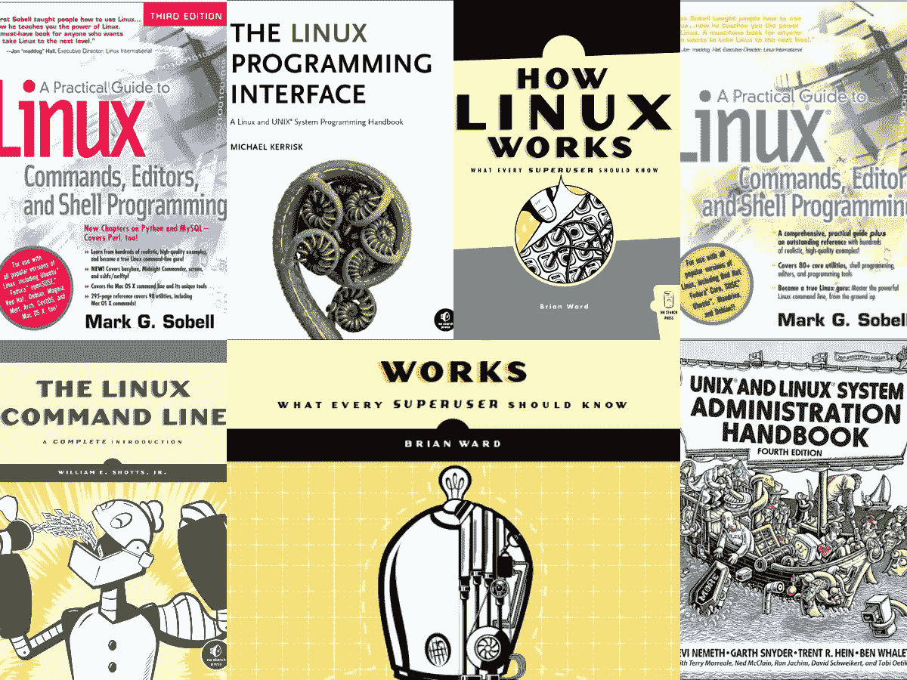](https://click.linksynergy.com/fs-bin/click?id=JVFxdTr9V80&subid=0&offerid=323058.1&type=10&tmpid=14538&RD_PARM1=https%3A%2F%2Fwww.udemy.com%2Flearn-linux-in-5-days%2F)

你好，伙计们，如果你想学习 Linux、UNIX 或系统编程，并寻找最好的书籍阅读，那么你来对地方了。早些时候，我已经分享了[最好的 Linux 课程](/javarevisited/7-best-linux-courses-for-developers-cloud-engineers-and-devops-in-2021-7415314087e1)，今天，我将分享给初学者最好的 Linux 书籍。

我在这个博客分享编程书籍很久了，从[核心 Java](http://javarevisited.blogspot.sg/2013/01/top-5-java-programming-books-best-good.html) 开始；我转到了其他相关技术，像 [Spring](http://www.java67.com/2016/12/5-spring-framework-books-for-java-programmers.html) 、[设计模式](http://www.java67.com/2016/10/top-5-object-oriented-analysis-and-design-patterns-book-java.html)、[数据结构和算法](http://javarevisited.blogspot.sg/2015/07/5-data-structure-and-algorithm-books-best-must-read.html)等。今天，我将分享一些最好的 UNIX 和 Linux 编程书籍。

这个列表包含了一些像理查德爵士这样的伟大作家的必读 UNIX 书籍。Stevens，Brain Kernighan 爵士，他为 UNIX 操作系统的发展做出了巨大贡献。

这个列表中的大多数书籍都是永恒的，经典的，不会随着时间的推移而老化，就像 UNIX 一样，它已经存在了 40 年，我相信它还会存在 40 年，或者永远存在。

如果你不知道，我爱书，无论是阅读，还是收藏。我非常热衷于寻找高质量的出版物，我的书架上已经有 100 多本了。

我从小就在看书，从我开始看笔记本、漫画、杂志、故事书，然后慢慢转移到物理、数学、逻辑和计算机科学书籍。新的技术发明，如平板电脑，如 iPad，以及智能手机，如 iPhone，进一步激发了我的热情。以前，我在买书之前会三思，但现在我可以在平板电脑上存储数百本电子书，无论去哪里都可以阅读。我大多在旅行时看书，这就是为什么我在过去的几年里能够读很多令人兴奋的书。

顺便说一句，近年来，在线课程也帮助我学习了很多新技术，巩固了我在 Java、SQL 和算法等技能方面的基础。如果你也喜欢从在线课程中学习，那么 Udemy 上的 [**在 5 天内学习 Linux 并提升你的职业**](https://click.linksynergy.com/fs-bin/click?id=JVFxdTr9V80&subid=0&offerid=323058.1&type=10&tmpid=14538&RD_PARM1=https%3A%2F%2Fwww.udemy.com%2Flearn-linux-in-5-days%2F) 是一个很好的课程，可以和阅读以下书籍一起加入。事实上，你会学得更好更快。

 [## 在 5 天内学会 Linux，提升你的职业生涯

### 如果你想学习如何使用 Linux 和……加入其他 20，000 名世卫组织的成功学生的行列

udemy.com](https://click.linksynergy.com/fs-bin/click?id=JVFxdTr9V80&subid=0&offerid=323058.1&type=10&tmpid=14538&RD_PARM1=https%3A%2F%2Fwww.udemy.com%2Flearn-linux-in-5-days%2F) 

# 10 本适合初学者的最佳 Linux 和 UNIX 书籍

这里是我整理的一些最好的书籍清单，可以学习 UNIX 和 Linux 操作系统。这些书不仅会教你 Linux 和 UNIX 的基础知识，还会教你构建它们的原则。

这些书还包含了大量在 UNIX 环境中进行高级编程的代码示例。

这个列表包含了来自 UNIX 和 Linux 不同领域的书籍，比如它包含了解释 UNIX 环境的设计哲学的书籍，它包含了教你如何在 [UNIX 环境](https://javarevisited.blogspot.com/2011/05/unix-command-interview-questions.html)中进行网络编程的书籍，然后是一些解释 Linux 如何工作的书籍，还有一本书告诉你基本的 Linux 命令。我试图将它列为 UNIX 和 Linux 书籍及相关课程的完整列表之一，但如果你有任何你认为应该在这个列表中的书，那么就在评论中发布它们吧。

## [1。Linux 编程接口:Linux 和 UNIX 系统编程](https://www.amazon.com/Linux-Programming-Interface-System-Handbook/dp/1593272200?tag=javamysqlanta-20)

与许多较旧的 UNIX 书籍不同，这是一本相对较新的 Linux 书籍。这本书的作者是 Michael Kerrisk，他是 Linux 手册页的维护者之一。像许多作家一样，他从 1987 年开始做 UNIX，从 90 年代后期开始专注于 Linux。

如果只能推荐一本书，我会推荐这本书，甚至比理查德·史蒂文斯的**《UNIX 环境下的高级编程》**还要好，因为它更透彻、更全面，写得和史蒂文斯的书一样好。

现在应该是学习 UNIX/Linux 系统编程的标准书籍，如果你愿意，你也可以参加 Udemy 上的[**5 天学习 Linux 并提升你的职业生涯**](https://click.linksynergy.com/fs-bin/click?id=JVFxdTr9V80&subid=0&offerid=323058.1&type=10&tmpid=14538&RD_PARM1=https%3A%2F%2Fwww.udemy.com%2Flearn-linux-in-5-days%2F) 课程，以获得两全其美，更好更快地学习 Linux。

[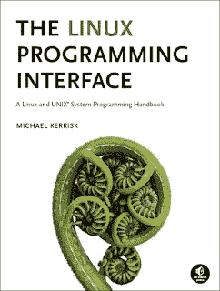](https://www.amazon.com/Linux-Programming-Interface-System-Handbook/dp/1593272200?tag=javamysqlanta-20)

## [2。Linux 如何工作:每个超级用户都应该知道的事情](http://www.amazon.com/How-Linux-Works-Superuser-Should/dp/1593275676/?tag=javamysqlanta-20)

作为一名程序员，我很好奇，我想知道事情是如何工作的，例如 HashMap 是如何工作的？这本书告诉你在你的 Linux 机器下会发生什么。

大多数程序员花时间学习 Java、C++和其他编程语言，但是他们花在 Linux 这样更有价值的操作系统上的时间很少，他们获得的知识可能会为他们服务更多年。

这是任何从事 Linux 工作的程序员的优秀书籍，必读，如果你需要一门课程 [**Linux 命令行基础**](https://click.linksynergy.com/fs-bin/click?id=JVFxdTr9V80&subid=0&offerid=323058.1&type=10&tmpid=14538&RD_PARM1=https%3A%2F%2Fwww.udemy.com%2Flinux-command-line-volume1%2F) 也是一门课程，通过教你基本的 Linux 命令来补充这本书。

[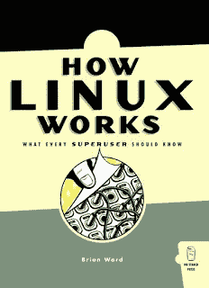](http://www.amazon.com/How-Linux-Works-Superuser-Should/dp/1593275676/?tag=javamysqlanta-20)

## [3。Linux 命令行:完整介绍](http://www.amazon.com/The-Linux-Command-Line-Introduction/dp/1593273894/?tag=javamysqlanta-20)

如果你问我，Linux 都是关于命令的；如果你不知道命令，你就无法在 Linux 中生存，但是如果你知道命令并且创造性地使用它们，那么你就是国王。

在其他操作系统中，比如 Windows 或 Mac OS X，你可以完成需要全新的程序员或工具才能完成的事情。

它既是您的参考资料，也是令人惊叹的强大 Linux 命令的工作簿。如果你愿意，你也可以把这本书和 Udemy 上的[**Linux Mastery:11.5 小时掌握 Linux 命令行**](https://click.linksynergy.com/deeplink?id=JVFxdTr9V80&mid=39197&murl=https%3A%2F%2Fwww.udemy.com%2Fcourse%2Flinux-mastery%2F) 。

[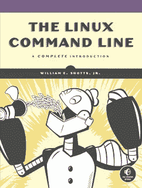](http://www.amazon.com/The-Linux-Command-Line-Introduction/dp/1593273894/?tag=javamysqlanta-20)

## [4。UNIX 环境下的高级编程](https://www.amazon.com/Advanced-Programming-UNIX-Environment-3rd/dp/0321637739?tag=javamysqlanta-20)

这是学习 UNIX 的最佳书籍之一，UNIX 是由 Richard W. Stevens 爵士编写的永恒经典。UNIX 是有史以来最好的软件之一；它已经有 30 多年了，并且仍然很强大，只要 UNIX 还存在(永远存在)，这本书就会有意义。这本书的精彩之处在于它有成千上万的代码示例和清晰的解释。它还充满了数百幅插图和图形，展示了不同的 UNIX 概念是如何工作的。

简而言之，对于任何想要学习 UNIX 并更好地理解它的人来说，这是一本必读的 UNIX 书籍。

[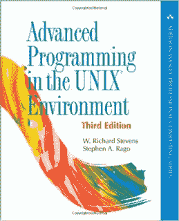](https://www.amazon.com/Advanced-Programming-UNIX-Environment-3rd/dp/0321637739?tag=javamysqlanta-20)

## [5。高级 UNIX 编程— Rochkind](https://www.amazon.com/Advanced-UNIX-Programming-Marc-Rochkind/dp/0131411543?tag=javamysqlanta-20)

Marc J. Rochkind 的《高级 UNIX 编程》第二版是另一本学习 UNIX/Linux 系统编程的最新书籍。这本书提供了 UNIX 系统调用的最全面的覆盖，可以作为参考和工作簿。

直到“*《Linux 编程接口》*走进画面，大部分程序员要么读 Steven 的书，要么看这本书来了解 UNIX 编程环境。

这只是 UNIX 教学中的例外。它涵盖了 UNIX 和其他 UNIX 标准的简史，如 POSIX、SUS 等。它还涵盖了插座，信号，线程等。这在可读性方面比史蒂文的书略好，但史蒂文的书提供了更详细的参考。

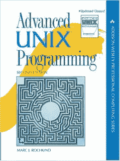

## 6.UNIX 和 Linux 系统管理手册，第 4 版

这是另一本学习 Linux 的优秀书籍，但是和其他的有点不一样。这是一本真正实用的 UNIX 书籍。如果你刚刚开始使用 Unix 和 [Linux](https://hackernoon.com/top-5-free-linux-courses-for-programmers-4a433b4edade) ，那么请阅读这本书来学习概念和命令。

这本书分为几个不同的管理员领域，如《必要的管理》从系统管理员的角度对 [UNIX](/javarevisited/6-free-courses-to-learn-bash-shell-scripting-in-linux-and-unix-a50461ecd4fe) 和 [Linux](https://www.java67.com/2017/08/top-17-sql-and-unix-interview-questions.html) 进行了广泛的概述。然后就是网管之类的。

## 7.Unix 网络编程，第 1 卷:套接字网络 API

在 UNIX 世界中，W. Richard Stevens 爵士并不是一个新名字。这份清单上的第一本书是他写的，但他还写了几本像这样的书，这是真正的瑰宝。

这是一本深入的书，涵盖了 Linux 和互联网中使用的许多网络协议，如 IPv6、POSIX 1003.1–2001。这是一本由两部分组成的书，其中第一部分侧重于套接字编程。

显然，如果你想了解真正的网络编程，这是一本必读的书。这本书的第三版是最新版本，但即使你得到的是旧版本，它们也值得一读。

[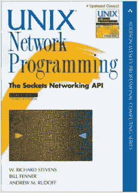](https://medium.com/javarevisited/my-favorite-books-to-learn-python-in-depth-77465633b46e)

## 8.UNIX 网络编程，第 2 卷:进程间通信

这是 Stevens 关于 UNIX 网络编程的第二本书。在第一部分中，他解释了[基于套接字的网络编程](http://javarevisited.blogspot.sg/2014/08/socket-programming-networking-interview-questions-answers-Java.html)，在本书中，重点是“进程间通信”。

好的一面是，Stevens 的所有书籍都很好地相互补充，这两本书以及 UNIX 环境中的高级编程是任何严肃的 UNIX 程序员的必读之作。

[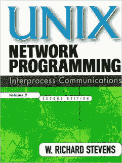](https://javarevisited.blogspot.com/2018/08/10-example-of-find-command-in-unix-linux.html#axzz6jsdEHyTp)

## 9.UNIX 编程的艺术

这是另一本学习 UNIX 哲学的优秀书籍。我的书架上有这本书的硬拷贝。那里有许多有用的金块。这本书将解释“为什么”，而不是“什么”和“如何”

所以，如果你想知道为什么某些事情在 UNIX 中是这样做的，而不是相反，这是你应该读的书。

[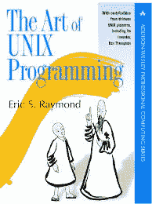](https://javarevisited.blogspot.com/2011/04/unix-commands-tutorial-and-tips-for.html#axzz6jsdEHyTp)

## 10.Unix 编程环境— Kernighan，Pike

Brian W. Kernighan 和 Rob Pike 所著的《Unix 编程环境》是[学习 UNIX](http://javarevisited.blogspot.sg/2010/10/basic-networking-commands-in-linuxunix.html) 的最佳书籍之一。这本书真正抓住了 Unix 的哲学，并教给你一些习惯用法。

它也是该主题的权威，因为它来自最初的贝尔实验室计算科学研究中心，两位作者都是非凡的技术作家。

[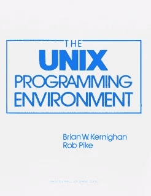](https://javarevisited.blogspot.com/2018/07/10-tips-on-working-fast-in-unix-or-linux.html#axzz6jsdEHyTp)

## 11.[Unix 操作系统的设计—巴赫](https://www.amazon.com/Design-UNIX-Operating-System/dp/0132017997?tag=javamysqlanta-20)

这本书于 1987 年首次出版，因此它已经有 29 年的历史了，但是像 UNIX 一样，它仍然是许多软件开发人员和工程师的重要信息来源。UNIX 是简单化设计的最好例子，它经受住了时间的考验，甚至在所有关键任务软件中被大量使用。

这是一本学习 UNIX 架构和 UNIX 设计哲学的好书，如果你需要补充课程，我建议你看看 Pluralsight 上的 [**Linux 命令行界面(CLI)基础**](https://pluralsight.pxf.io/c/1193463/424552/7490?u=https%3A%2F%2Fwww.pluralsight.com%2Fcourses%2Flinux-cli-fundamentals) ，这是我最喜欢的在线学习平台之一，有关于所有最新技术的课程。

[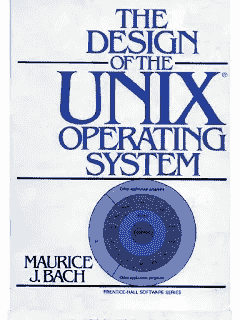](https://www.amazon.com/Design-UNIX-Operating-System/dp/0132017997?tag=javamysqlanta-20)

以上是关于**十大 UNIX 和 Linux 编程书籍**的全部内容。这个列表完全是基于我的观点，但是他们肯定包含了一个极客喜欢读的高质量的书。要成为一名更好的程序员，我的清单上还可以加上一件事，那就是学习 UNIX。这是有史以来最好的软件之一，它在系统编程、网络、进程间通信和一般操作系统方面教会了你很多东西。

其他**推荐给程序员的书籍和资源**

*   [程序员学习 Linux 的五大免费课程](http://www.java67.com/2018/02/5-free-linux-unix-courses-for-programmers-learn-online.html#ixzz5MqSB0YLL)
*   [程序员 10 本算法书](http://www.java67.com/2015/09/top-10-algorithm-books-every-programmer-read-learn.html)
*   [学习 learn Shell 脚本的 5 门课程](https://javarevisited.blogspot.com/2018/02/5-courses-to-learn-shell-scripting-in-linux.html)
*   [每个程序员都应该读的 5 本书](http://www.java67.com/2016/02/5-books-to-improve-coding-skills-of.html)
*   [2023 年学习 Bash 的 5 门免费课程](https://www.java67.com/2019/04/top-5-free-course-to-learn-bash-shell-scripting-linux.html)
*   [学习 Java 8 和函数式编程的 5 本书](http://www.java67.com/2015/07/5-books-learn-java-8-functional-programming.html)
*   [学习面向对象编程与设计的 5 本书](http://javarevisited.blogspot.sg/2013/06/5-must-read-books-to-learn-object.html)
*   [每个程序员都应该阅读的 5 本 SQL 书籍](http://www.java67.com/2016/09/sql-5-best-books-to-learn-and-master.html)
*   [每个程序员都应该学习的 10 件事](/swlh/10-things-every-programmer-should-know-26ba37cfcaf4)
*   [6 本书学习并掌握编码](https://javarevisited.blogspot.com/2014/09/top-6-books-to-learn-programming-coding.html)
*   [每个程序员都应该读的 10 本书](http://www.java67.com/2015/07/5-books-learn-java-8-functional-programming.html)

感谢阅读本文，如果你喜欢 *Linux 和 UNIX 书籍*，那么请分享给你的朋友和同事。如果您有任何建议、反馈，请留下评论。

**P. S.** —如果你更喜欢在线课程而不是书本，那么你也可以在 Udemy 上查看 [**Linux 掌握:在 11.5 小时内掌握 Linux 命令行**](https://click.linksynergy.com/deeplink?id=JVFxdTr9V80&mid=39197&murl=https%3A%2F%2Fwww.udemy.com%2Fcourse%2Flinux-mastery%2F) 。这是最好的课程之一，结合阅读以下任何一本书。事实上，你会学得更好更快。

 [## 精通 Linux:掌握 Linux 命令行

### 感言= = = = = = = = = = = = = = = = = = = = = = = = = = = = = = =“迄今为止 Udemy 上关于 Linux 的最佳课程，我绝对推荐”…

udemy.com](https://click.linksynergy.com/deeplink?id=JVFxdTr9V80&mid=39197&murl=https%3A%2F%2Fwww.udemy.com%2Fcourse%2Flinux-mastery%2F)