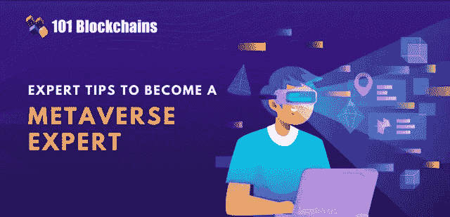
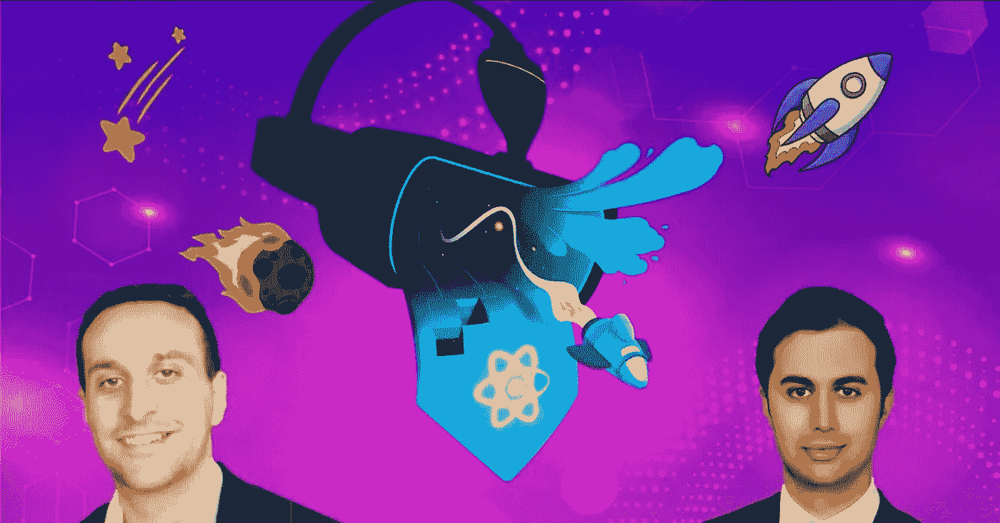
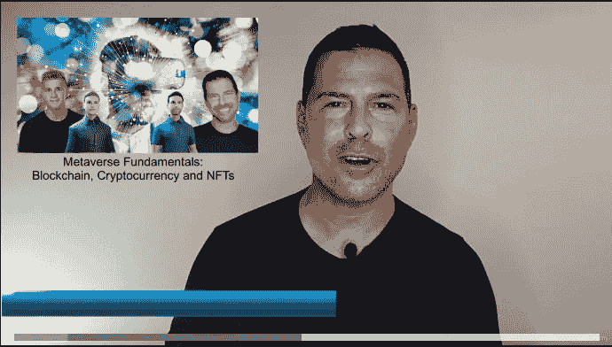
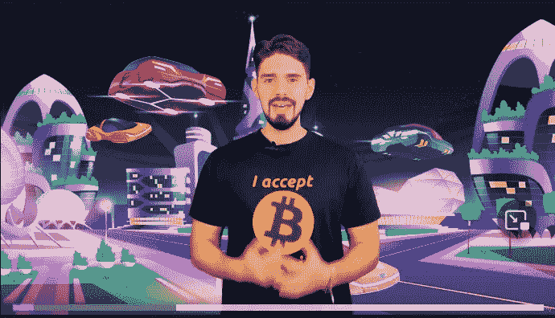
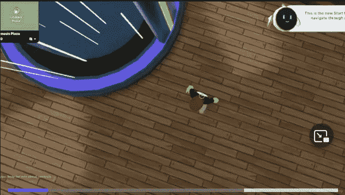
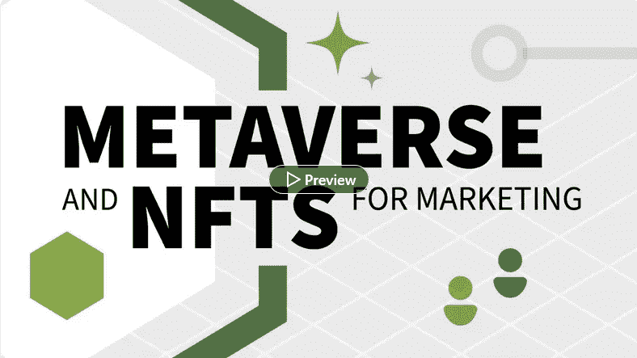

# 2023 年在线学习 AR、VR、VX 的 10 个最佳元宇宙课程和认证

> 原文：<https://medium.com/javarevisited/10-best-metaverse-courses-to-learn-ar-vr-vx-online-186d6c5326f8?source=collection_archive---------0----------------------->

## 想了解什么是元宇宙，它提供了什么？这里有 10 个最好的在线元宇宙课程，你可以在 2023 年学习元宇宙

大家好，如果你想了解 20223 年的元宇宙，并寻找最好的元宇宙在线课程和元宇宙认证，那么你来对地方了。元宇宙、网络 3 和 NFT 是三个热门词汇，也是目前主导互联网的最新技术。

早些时候，我已经分享了[最佳免费区块链课程](/javarevisited/7-free-courses-to-learn-blockchain-in-2020-764e66b47ebe)和 [**最佳 NFT 在线课程**](https://javarevisited.blogspot.com/2021/12/top-5-courses-to-learn-about-nfts-non.html) ，在这篇文章中，我将分享 2022 年最佳元宇宙在线课程，供初学者学习。但是，在我们开始学习 10 门你需要了解的关于元宇宙的最佳课程之前，让我告诉你它到底是什么。

元宇宙这个词实际上是由科幻作家尼尔·斯蒂芬森在他 1992 年的小说《冰雪奇缘》中首次提出的。据专家称，元宇宙基本上是互联网和一般计算的 3D 版本。

元宇宙基本上是一个与现实世界平行的地方，在这里你可以度过你的数字生活。它是一个你和你的朋友有一个虚拟形象的地方，你可以用他们的虚拟形象和其他人互动。

本质上，元宇宙被视为互联网的下一个发展阶段，理想情况下需要通过单一网关接入。你可以更好地将它理解为一个互动的、沉浸式的、超现实的共享虚拟空间。

你需要明白的是 [*【元宇宙】*](https://javarevisited.blogspot.com/2022/06/best-courses-to-learn-metaverse-online.html) 真的比一个单一的视频游戏要广阔得多。专家表示，元宇宙将把虚拟现实体验提升到一个新的水平，因为用户可以通过他们的在线化身做很多事情，如购买土地和举办派对，甚至结婚。

# 2023 年初学者学习的 10 门最佳元宇宙在线课程

在这里，我们列出了 10 个你可以用来了解元宇宙的最佳课程。请继续阅读，了解更多信息。

## 1.[元宇宙大师班——了解元宇宙的一切](https://click.linksynergy.com/deeplink?id=JVFxdTr9V80&mid=39197&murl=https%3A%2F%2Fwww.udemy.com%2Fcourse%2Fmetaverse-masterclass-learn-everything-about-the-metaverse%2F)

这是 Udemy 上最好的元宇宙课程之一，它将教你你需要知道的关于元宇宙技术的一切。当您购买本课程时，您将获得超过 3 小时的点播视频讲座、1 篇文章和 3 个可下载资源。

以下是您将在本课程中学到的内容:

1.  什么是元宇宙？
2.  游戏+ Web 3.0 +区块链如何改变互联网
3.  NFT 如何释放元宇宙的潜力
4.  元宇宙接口:个人电脑、手机、AR 眼镜、VR 护目镜、Neuralink
5.  元宇宙涉及的区块链协议和平台
6.  与元宇宙有关的代币
7.  投资元宇宙并获利
8.  元宇宙内部的资产类别
9.  元宇宙土地所有权-财产投资

以下是加入本课程的链接— [元宇宙大师班](https://click.linksynergy.com/deeplink?id=JVFxdTr9V80&mid=39197&murl=https%3A%2F%2Fwww.udemy.com%2Fcourse%2Fmetaverse-masterclass-learn-everything-about-the-metaverse%2F)

## 2.[T3【元宇宙】认证通过 101 区块链](https://shareasale.com/r.cfm?b=1696402&u=880419&m=105464&urllink=https%3A%2F%2F101blockchains%2Ecom%2Fcertification%2Fcertified%2Dmetaverse%2Dprofessional%2F&afftrack=)

如果你正在寻找更多的课程来了解元宇宙的一切，那么这个来自 101 区块链学院的元宇宙认证，这是学习区块链技术的一个值得信赖的地方，似乎是在线提供的最佳材料。

虽然我参加了许多元宇宙课程，但区块链 101 的元宇宙认证专家(CMP)似乎是结构最完善、最完整和最新的。

鉴于元宇宙的形势变化非常快，事情很快就会过时，这就是为什么你需要一门课程，不仅涵盖保持不变的基本面，还包括不时变化的东西，这就是元宇宙认证的伟大之处。

如果你不仅想了解 2023 年的元宇宙，还想获得认证，那么本课程就是为你准备的。

**以下是参加本课程的链接** — [元宇宙 101 区块链认证](https://shareasale.com/r.cfm?b=1696402&u=880419&m=105464&urllink=https%3A%2F%2F101blockchains%2Ecom%2Fcertification%2Fcertified%2Dmetaverse%2Dprofessional%2F&afftrack=)

说到加入这个认证，你可以单独加入，或者你可以获得一个 [**101 区块链会员资格**](https://shareasale.com/r.cfm?b=1696402&u=880419&m=105464&urllink=https%3A%2F%2F101blockchains%2Ecom%2Fmembership%2F&afftrack=) ，它不仅可以让你获得这个认证，还可以获得其他几个强大的和受欢迎的区块链和 Web3 认证和课程，每月只需 25 美元的年度计划(现在有 50%的折扣)。

## 3. [A 到 Z 完成元宇宙大师课程](https://click.linksynergy.com/deeplink?id=JVFxdTr9V80&mid=39197&murl=https%3A%2F%2Fwww.udemy.com%2Fcourse%2Fa-to-z-complete-metaverse-master-course%2F)【Udemy】

在这个互动的元宇宙课程中，你将学习如何通过成为 [NFT](https://www.java67.com/2022/03/top-5-free-courses-to-learn-nft-non-fun.html) ，Metamask，VR，AR 和[区块链](https://javarevisited.blogspot.com/2022/06/best-coursera-courses-for-blockchain.html)的创新适应者，成为这项令人兴奋的技术的早期采用者。

**课程时长:3 小时**

**课程评分:4.8 星(满分 5 分)**

**课程讲师:易博姿交易**

**课程价格:20 美元**

以下是参加元宇宙课程的链接— [从 A 到 Z 完成元宇宙大师课程](https://click.linksynergy.com/deeplink?id=JVFxdTr9V80&mid=39197&murl=https%3A%2F%2Fwww.udemy.com%2Fcourse%2Fa-to-z-complete-metaverse-master-course%2F)

## 4.[元宇宙基本面:区块链、加密货币和 NFTs](https://click.linksynergy.com/deeplink?id=JVFxdTr9V80&mid=39197&murl=https%3A%2F%2Fwww.udemy.com%2Fcourse%2Fmetaverse-fundamentals-blockchain-cryptocurrency-and-nfts%2F)

在这门激动人心的课程中，您将了解元宇宙、虚拟现实和增强现实的一些关键要素。你也可以在元宇宙中创建自己的头像。你将会了解到构建元宇宙的不同工具，比如 Unity 和虚幻引擎。

**课程时长:3 小时**

**课程评分:4.5 星(满分 5 分)**

**课程讲师:乔治·利维**

**课程价格:20 美元**

这里是加入这个在线课程的链接— [元宇宙基础](https://click.linksynergy.com/deeplink?id=JVFxdTr9V80&mid=39197&murl=https%3A%2F%2Fwww.udemy.com%2Fcourse%2Fmetaverse-fundamentals-blockchain-cryptocurrency-and-nfts%2F)

## 5.[使用 Three.js、Solidity 和 NFT 代币](https://click.linksynergy.com/deeplink?id=JVFxdTr9V80&mid=39197&murl=https%3A%2F%2Fwww.udemy.com%2Fcourse%2Fcreate-a-metaverse%2F) Udemy 创建一个元宇宙

通过本课程，你不仅能够理解元宇宙背后的基本机制，还能学习如何使用三个. js、Solidity 和 NFT 令牌创建元宇宙。

在此过程中，您将学习使用 Three.js、Solidity 中的智能合同和 NFT 令牌创建自己的元宇宙的关键要素！。你还可以探索元宇宙技术的潜在应用领域。你也会明白你需要承担的风险。

**课程时长:3.5 小时**

**课程评分:4.5 星(满分 5 分)**

**课程讲师:乔治·利维、琼和团队**

**课程价格:20 美元**

以下是加入元宇宙课程的链接— [使用三个. js、Solidity 和 NFT 令牌创建一个元宇宙](https://click.linksynergy.com/deeplink?id=JVFxdTr9V80&mid=39197&murl=https%3A%2F%2Fwww.udemy.com%2Fcourse%2Fcreate-a-metaverse%2F)

## 6.了解你需要知道的关于元宇宙的一切

在这门精彩的课程中，你将获得一个全新数字世界的完整而全面的介绍。你会学到像 web3、[区块链](https://javarevisited.blogspot.com/2022/01/5-best-blockchain-certifications-and.html)、虚拟现实和增强现实这样的东西。你将能够了解你需要知道的关于元宇宙的一切。

**课程持续时间；2 小时**

**课程评分:4.8 星(满分 5 分)**

课程讲师:克劳迪奥·伊万

课程价格:22 美元

这是加入本课程的链接— [了解你需要知道的关于元宇宙的一切](https://click.linksynergy.com/deeplink?id=JVFxdTr9V80&mid=39197&murl=https%3A%2F%2Fwww.udemy.com%2Fcourse%2Flearn-everything-you-need-to-know-about-metaverse%2F)

## 7.[投资元宇宙的虚拟房地产](https://click.linksynergy.com/deeplink?id=JVFxdTr9V80&mid=39197&murl=https%3A%2F%2Fwww.udemy.com%2Fcourse%2Fvirtual-real-estate-investing-in-the-metaverse%2F) [Udemy]

使用这个神奇的课程，你将能够从头开始建立你的 NFT 职业生涯，并成为一名元宇宙大师。购买本课程后，您将终身获得超过 1 小时的点播视频讲座。

你将学习如何定义元宇宙和回顾你的投资技巧。你还可以了解不同的元宇宙世界，并学习如何在元宇宙购买虚拟土地。

**课程时长:2 小时**

**课程评分:4.5 星(满分 5 分)**

**课程讲师:特里·温特斯**

**课程价格:25 美元**

以下是加入本课程的链接— [元宇宙虚拟房地产投资](https://click.linksynergy.com/deeplink?id=JVFxdTr9V80&mid=39197&murl=https%3A%2F%2Fwww.udemy.com%2Fcourse%2Fvirtual-real-estate-investing-in-the-metaverse%2F)

## 8.[营销的元宇宙和 NFTs](http://linkedin-learning.pxf.io/c/1193463/449670/8005?u=https%3A%2F%2Fwww.linkedin.com%2Flearning%2Fmetaverse-and-nfts-for-marketing)【领英学习】

在这个精彩的课程中，你将了解元宇宙生态系统和 Web3。你会理解新兴技术的日益增长的重要性，比如区块链和不可替代代币。

您还将能够探索今天可以用来促进明天强劲增长的关键策略。

**课程时长:1 小时**

**课程评分:4.5 星(满分 5 分)**

课程讲师:凯茜·哈克

课程价格:25 美元

这是参加本课程的链接— [元宇宙和营销的非功能性培训](http://linkedin-learning.pxf.io/c/1193463/449670/8005?u=https%3A%2F%2Fwww.linkedin.com%2Flearning%2Fmetaverse-and-nfts-for-marketing)

## 9.[商业领袖需要了解哪些关于 Web3 的知识](http://linkedin-learning.pxf.io/c/1193463/449670/8005?u=https%3A%2F%2Fwww.linkedin.com%2Flearning%2Fwhat-business-leaders-need-to-know-about-web3-plus-metaverse)【LinkedIn Learning】

这门令人惊叹的课程将让你大致了解 web3 和元宇宙目前所处的位置，并解释一些基本原理和技术。

它还将指导你了解一些在制定元宇宙战略时需要牢记的关键概念。Cathy 分享了如何在这个不断变化的环境中为自己的营销机会定位的具体建议。

**课程时长:1 小时**

**球场评分:4.5 星(满分 5 分)**

**课程讲师:凯茜·哈克**

**课程价格:25 美元**

以下是参加本课程的链接— [关于 Web3](http://linkedin-learning.pxf.io/c/1193463/449670/8005?u=https%3A%2F%2Fwww.linkedin.com%2Flearning%2Fwhat-business-leaders-need-to-know-about-web3-plus-metaverse) 商业领袖需要知道的事情

顺便说一句，你需要 LinkedIn Learning 会员才能观看这门课程，每月费用约为 19.99 美元，但你也可以通过参加他们的 [**1 个月免费试用**](http://linkedin-learning.pxf.io/c/1193463/449670/8005?u=https%3A%2F%2Fwww.linkedin.com%2Flearning%2Fsubscription%2Fproducts) 来免费观看这门课程，这是探索他们 17500 多门最新技术在线课程的好方法。

  

## 10.[完成元宇宙课程:关于 AR、VR 和 NFTs 的一切](https://click.linksynergy.com/deeplink?id=JVFxdTr9V80&mid=39197&murl=https%3A%2F%2Fwww.udemy.com%2Fcourse%2Fcomplete-metaverse-course-everything-about-ar-vr-and-nfts%2F)

这个奇妙的课程将作为你的增强现实、虚拟现实、元宇宙、不可替代的代币和 OpenSea 的逐步指南。购买本课程后，您将终身获得超过 3 小时的点播视频讲座、4 篇文章和 4 种可下载的教育资源。

您还将了解脸书和微软在元宇宙的作用。这门课的好处是你的课程老师对这个话题非常了解。他用简单的方式解释复杂的事情，这使得初学者很容易理解技术概念。

**课程时长:4 小时**

**课程评分:4.4 星(满分 5 分)**

课程导师:纳夫迪普·亚达夫

课程价格:22 美元

以下是参加元宇宙在线课程的链接— [完成元宇宙课程](https://click.linksynergy.com/deeplink?id=JVFxdTr9V80&mid=39197&murl=https%3A%2F%2Fwww.udemy.com%2Fcourse%2Fcomplete-metaverse-course-everything-about-ar-vr-and-nfts%2F)

## 11.[元宇宙 Web 3.0 和 Defi:一个金融科技大师班](https://click.linksynergy.com/deeplink?id=JVFxdTr9V80&mid=39197&murl=https%3A%2F%2Fwww.udemy.com%2Fcourse%2Fmetaverse-web-3-and-fintech-a-masterclass-global-fintech-academy%2F)【Udemy】

在这个令人惊叹的课程中，您将了解一些有趣的东西，如不可替换的代币、Defi、GameFi 和玩即赚。你还将了解元宇宙代币，看看人们在哪里投资。您将了解扩展、增强、虚拟和混合现实。

讲师在解释元宇宙方面做得很好，但如果有更多的视觉效果和使用案例，课程会更好，尽管如此，对初学者来说，这是一个很好的元宇宙课程。

**课程时长:7 小时**

**球场评分:4.2 星(满分 5 分)**

**课程讲师:全球金融科技学院**

**课程价格:20 美元**

以下是参加元宇宙课程的链接— [元宇宙 Web 3.0 和 Defi:](https://click.linksynergy.com/deeplink?id=JVFxdTr9V80&mid=39197&murl=https%3A%2F%2Fwww.udemy.com%2Fcourse%2Fmetaverse-web-3-and-fintech-a-masterclass-global-fintech-academy%2F)

以上就是 2023 年初学者学习元宇宙的**最佳在线课程**。如果你喜欢这 10 个能让你更好地了解元宇宙的课程，为什么不与你的朋友和家人分享呢？如果您对元宇宙有任何疑问，也可以发表评论，我们会尽快回复您。

其他**区块链和元宇宙文章和教程**你可能喜欢:

*   [如何从零开始学习 2023 年的元宇宙？](https://javarevisited.blogspot.com/2022/07/how-to-learn-metaverse-from-scratch-is.html)
*   [2023 年十大区块链认证](https://javarevisited.blogspot.com/2020/07/top-5-online-courses-to-learn-blockchain.html)
*   [2023 年免费学习区块链的 5 个最佳地点](https://javarevisited.blogspot.com/2022/06/top-5-websites-to-learn-blockchain-in.html)
*   [开发者的 10 门最佳区块链课程](/javarevisited/best-blockchain-courses-and-certification-in-2020-63729f8f04d0)
*   [2023 年面向初学者的 10 门元宇宙在线课程](https://javarevisited.blogspot.com/2022/06/best-courses-to-learn-metaverse-online.html)
*   [3 门 Coursera 课程让你在 2023 年成为区块链开发者](https://javarevisited.blogspot.com/2022/06/best-coursera-courses-for-blockchain.html)
*   [2023 年区块链 5 门最佳 Coursera 课程](https://javarevisited.blogspot.com/2022/01/5-best-blockchain-certifications-and.html)
*   [NFT 专业认证值得吗？](https://javarevisited.blogspot.com/2022/06/review-is-certified-nft-certification-worth-it.html)
*   [2023 年学习区块链的前 5 本书](https://javarevisited.blogspot.com/2022/06/top-5-books-to-learn-blockchain-for.html)
*   [101 区块链认证区块链开发者值得吗？](https://javarevisited.blogspot.com/2022/05/review-is-certified-enterprise-blockchain-professional-certification-worth.html)
*   [我最喜欢的学习以太坊的在线课程](https://javarevisited.blogspot.com/2021/11/top-5-courses-to-learn-ethereum-for.html)
*   [10 门免费 NFT 课程，供初学者学习不可替代代币](https://javarevisited.blogspot.com/2022/07/free-nft-non-fungible-tokens-courses.html)
*   [深度学习区块链的 6 大网站](https://dev.to/javinpaul/6-best-websites-to-become-a-blockchain-developer-in-2022-3han)

非常感谢您阅读这篇文章。如果你喜欢这些 2023 年为初学者和有经验的专业人士开设的 b *est 元宇宙课程，那么请分享给你的朋友和社区圈。如果你有任何其他伟大的元宇宙课程不在这个列表中，请随时在评论中提出建议，我会包括在这个列表中。*

如果你正在寻找一个免费的元宇宙课程来开始你的元宇宙之旅，那么你也可以在 Udemy 上查看这个[元宇宙大师初学者课程:Web3.0 课程](https://click.linksynergy.com/deeplink?id=JVFxdTr9V80&mid=39197&murl=https%3A%2F%2Fwww.udemy.com%2Fcourse%2Fmetaverse-maestro-course-for-beginners-web-30-course%2F)。这个 1 小时 37 分钟的元宇宙课程是完全免费的，你只需要一个 Udemy 账号就可以观看这个课程。不过，如果你需要更多的选择，你也可以在这里查看这份 [**免费元宇宙和 NFT 课程**](/javarevisited/10-free-nft-non-fungible-tokens-metaverse-and-web3-0-courses-for-beginners-421b1d6ca263) **的清单。**

<https://javarevisited.blogspot.com/2022/07/free-nft-non-fungible-tokens-courses.html> 