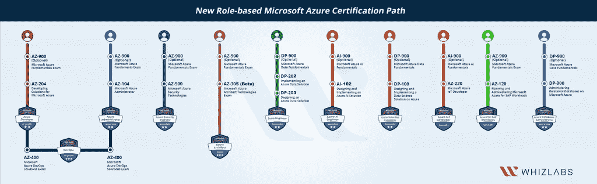
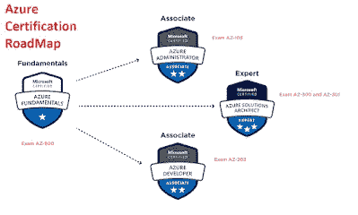
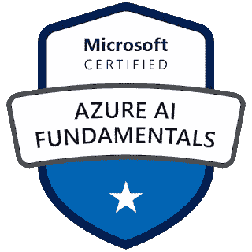
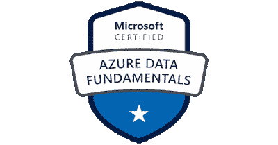
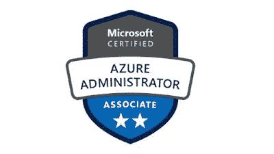
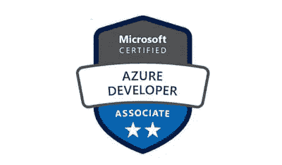
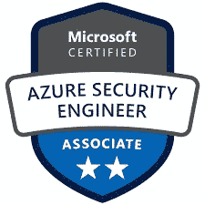
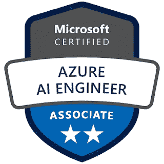
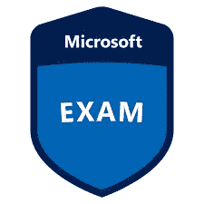
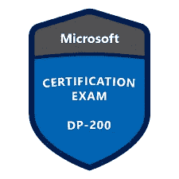

# 2023 年 10 大最佳微软 Azure 云认证 IT 专业人士目标

> 原文：<https://medium.com/javarevisited/10-best-microsoft-azure-cloud-certification-it-professionals-can-aim-b7b6765d8ef1?source=collection_archive---------0----------------------->

## 找到你在 2023 年可以瞄准的合适的 Azure 认证，并通过资源链接成为微软 Azure 认证云专家。

image_creit — Whizlabs

大家好，如果你想成为 Azure 认证专家，并寻找 2023 年最好的 Azure 认证，那么你来对地方了。

前面我已经分享了 2023 年 的 [**最佳 AWS 认证以及很多学习**](/javarevisited/10-best-aws-certifications-to-aim-in-2022-713c37fac147)**[AWS](/javarevisited/5-best-aws-courses-for-beginners-and-experienced-developers-to-learn-in-2021-563212409fbd)[GCP](/javarevisited/5-best-courses-to-learn-google-cloud-platform-gcp-in-2021-169093a3771a)[Azure](/javarevisited/10-best-microsoft-azure-courses-for-beginners-and-experienced-developers-d41a454834c0)的最佳在线课程，今天我要分享的是 2023 年你可以瞄准的*十大 Azure 认证*。**

云计算技术的发展速度几乎比任何其他行业都快，事实上，与去年相比，2023 年的增长速度增加了 17%,这是因为许多事实，如 Saas 公司的巨大增长，以及与您支付的费用相比，您获得的能力使许多人考虑使用云来存储他们的网站和运营他们的业务。

出于这个原因，许多知名公司创建了他们的云服务，其中一些最好的是[亚马逊 AWS](https://javarevisited.blogspot.com/2020/02/top-5-courses-to-crack-aws-certified-cloud-practitioner-exam-certification-clf-c01.html) 、[谷歌云](https://javarevisited.blogspot.com/2019/07/top-5-google-cloud-platform-gcp-courses-certifications-online.html)、数字海洋、Linode 等等，但本文将重点关注微软 Azure，它是当今技术领域领先的云计算服务之一。

该指南将向您展示由微软 Azur e 提供的认证，以便开始有效地使用他们的服务，如果您计划在一家使用该云来运营业务的公司工作，您也需要拥有这些认证。

Microsoft Azure 根据您的技能、经验和角色提供不同种类的认证，但大多数认证可以大致分为 4 个不同的类别

1.  **基础级认证，如**[**AZ-900**](/javarevisited/5-best-azure-fundamentals-courses-to-pass-az-900-certification-exam-in-2020-9e602aea035d)**[**AI-900**](https://javarevisited.blogspot.com/2021/11/top-5-courses-to-crack-ai-900-microsoft.html)**[**DP-900**](https://javarevisited.blogspot.com/2022/01/top-5-courses-for-azure-data-fundamentals-DP-900.html#axzz7ICOjRaJl)****
2.  ******助理级认证，如**[**AZ-104**](/javarevisited/7-best-courses-for-az-104-microsoft-azure-administrator-associate-certification-exam-in-2021-7b620d61dcd8)**、**[**AZ-204**](/javarevisited/7-best-az-204-online-courses-for-microsoft-azure-developer-associate-certification-exam-in-2021-1bee42a03e7c)**、DP-300******
3.  ******专家级认证，如**[**AZ-303**](/javarevisited/7-best-free-azure-solution-architect-resources-to-crack-az-303-or-az304-exam-f2b525eba09b)**和 AZ-400******
4.  ******专业认证，如 AZ-120 和 AZ-220******

****基础认证是为想进入云计算领域的初学者准备的，根据你的角色，比如你是想在 Azure 中探索人工智能还是数据，你可以选择 AI-900 和 DP-900 认证，一般来说，AZ-900 考试是为所有人准备的。****

****在本文中，我们将探讨不同种类的认证，以便您可以找到适合自己的认证。这个 [**Azure 认证路线图**](https://shrsl.com/25qjp) 也提供了一个你在 2023 年可以瞄准的所有 Azure 云认证的很好的概述。****

********

# ****IT 专业人员 2023 年目标的 10 个最佳 Microsoft Azure 认证****

****这里列出了 2023 年开发者、系统管理员、AI 专家、安全专家、解决方案架构师和 DevOps 工程师可以瞄准的最佳 Azure 认证。****

## ****1.考试 AZ-900:微软 Azure 基础知识[初学者最佳 Azure 认证]****

****该认证面向不了解 Microsoft Azure 服务的初学者，您将学习云概念以及 Azure 服务和安全性，并计算价格等。****

****AZ-900 考试会有大约 **40 到 60 题**，你必须在 85 分钟内出现。考试的及格分数是 700 分，任何不正确的答案都不会受到惩罚****

****如果你刚刚开始云计算和 Azure 的职业生涯，那么这是你应该在 2023 年争取的认证。如果你需要资源，那么 Coursera 上有一个名为 [**微软 Azure 基础 AZ-900 考试准备专业化**](https://click.linksynergy.com/deeplink?id=JVFxdTr9V80&mid=40328&murl=https%3A%2F%2Fwww.coursera.org%2Fspecializations%2Fmicrosoft-azure-fundamentals-az-900) 的课程可以帮助你在参加考试之前学会所有这些。****

********

****这个最好的 Coursera AZ 900 课程由微软设计，您将向微软专家学习，最重要的是，该课程与 AZ-900 的教学大纲和主题紧密结合，完成本课程后，您将获得 AZ-900 考试的 50%优惠券。****

## ****2.考试 AI-900:微软 Azure AI 基础****

****微软 Azure 可以用来部署你的人工智能解决方案，要了解这是如何可能的，你需要参加这个认证，旨在教你使用这些服务，并涵盖一些人工智能概念。****

****这是另一个基础水平认证，你将接受与人工智能相关的基础概念的测试。对于想要学习 Azure 和设计 AI 驱动的解决方案的 AI 专家来说，这是最好的 Azure 认证。****

****如果你想在 Azure cloud 学习人工智能，那么我会建议你在 2023 年参加这个认证。如果你需要资源来准备，那么这个名为 [**管理微软 Azure AI 解决方案**](https://pluralsight.pxf.io/c/1193463/424552/7490?u=https%3A%2F%2Fwww.pluralsight.com%2Fcourses%2Fmicrosoft-azure-ai-solutions-managing) 的课程将有助于学习这些技能。****

********

****顺便说一下，你需要一个 [Pluralsight 会员](http://pluralsight.pxf.io/c/1193463/424552/7490?u=https%3A%2F%2Fwww.pluralsight.com%2Flearn)才能加入这个课程，费用大约是每月 29 美元或每年 299 美元(14%的折扣)。我向所有程序员强烈推荐这个订阅，因为它提供了超过 7000 个在线课程的即时访问，以学习任何技术技能。或者，你也可以使用他们的 [**10 天免费通行证**](http://pluralsight.pxf.io/c/1193463/424552/7490?u=https%3A%2F%2Fwww.pluralsight.com%2Flearn) 免费观看本课程。****

**** [## 对个人来说

### Pluralsight 的使命一直是公平的技术竞争环境。不管你想学什么，或者…

pluralsight.pxf.io](http://pluralsight.pxf.io/c/1193463/424552/7490?u=https%3A%2F%2Fwww.pluralsight.com%2Flearn)**** 

## ****3.考试 DP-900:微软 Azure 数据基础****

****该证书面向初学者，教授您数据基础知识以及如何在 Microsoft Azure 中实现这些知识，例如管理数据库和数据分析。****

****对于想学习 Azure 的数据程序员和 DBA 来说，这是最好的 Azure 云认证。为了通过这次考试，您将接受关系和非关系数据的关键概念以及不同类型的数据工作负载(如事务性或分析性)的测试。****

****Azure 数据基础可以用来准备其他 Azure 基于角色的认证，如 Azure 数据库管理员助理或 Azure 数据工程师助理，但它不是任何一个的先决条件。****

****udemy 上的这门**[**DP-900 Azure Data Fundamentals**](https://click.linksynergy.com/deeplink?id=JVFxdTr9V80&mid=39197&murl=https%3A%2F%2Fwww.udemy.com%2Fcourse%2Fdp900-azure%2F)课程是备考的最佳资源之一。******

********

## ****4.考试 AZ-104:微软 Azure 管理员****

****该证书面向对 PowerShell 命令行和操作系统有一定了解的中级人员，它将教您管理从存储和安全到网络等更深入的云服务。****

****这是对系统管理最好的 Azure 认证。这也是一个准水平考试，你应该在通过基础水平 Azure 认证后尝试，如 [AZ-900](/javarevisited/7-free-microsoft-azure-fundamentals-az-900-online-courses-for-beginners-in-2021-efd01d8be403) 、 [AI-900](https://becominghuman.ai/5-best-artificial-intelligence-courses-for-beginners-in-2020-38db08617b12) 或 DP-900。****

****你必须对整个 IT 生命周期中不同的 Azure 服务有深刻的理解，并接受基础设施服务、应用程序和环境的请求才能通过考试。****

****作为一名 Azure 认证管理人员，您将对用于优化性能和规模的服务提出建议，并根据需要提供、调整、监控和调整资源，因此需要对 Azure 服务有深入的了解。****

****如果你正在准备这个考试，需要一个资源，那么一个名为[**AZ-104 Microsoft Azure Administrator**](https://click.linksynergy.com/deeplink?id=JVFxdTr9V80&mid=39197&murl=https%3A%2F%2Fwww.udemy.com%2Fcourse%2F70533-azure%2F)的课程将在这个旅程中帮助你。****

********

## ****5.考试 AZ-204:为 Microsoft Azure 开发解决方案****

****如果你有至少一年的时间开发 Azure 云解决方案，那么你应该参加这个认证考试，它将教你如何设计和构建以及开发基于 Azure 云服务的企业解决方案，如应用程序即服务。****

****AZ 204 考试持续时间为 120 分钟，随机有 40-60 个问题，涉及不同类型的用例场景、编程代码、对/错，您需要*得分* 70%及以上才能通过*通过*的 *AZ* - *204* 考试。****

****如果你是一名软件开发人员，那么在 2023 年获得 Azure Developer 或 AZ-204 认证是一个好主意。是对开发者最好的 Azure 认证。如果你需要资源做好准备，那么这个课程 [**AZ-204 为微软 Azure**](https://click.linksynergy.com/deeplink?id=JVFxdTr9V80&mid=39197&murl=https%3A%2F%2Fwww.udemy.com%2Fcourse%2F70532-azure%2F) 开发将帮助你准备证书。****

********

## ****6.考试 AZ-500:微软 Azure 安全技术****

****如果您想学习云级别的安全性，那么这个证书非常适合您，您的工作是为应用程序实施安全解决方案和威胁防护，以及维护安全漏洞。****

****这一 Azure 认证非常适合希望获得在其 Azure 云基础设施上实现安全性所需的知识和技能的 IT 安全专业人员。****

****udemy 上的这门名为 [**AZ-500:微软 Azure 安全技术**](https://click.linksynergy.com/deeplink?id=JVFxdTr9V80&mid=39197&murl=https%3A%2F%2Fwww.udemy.com%2Fcourse%2Fexam-azure-2%2F) 的课程将教会你通过考试所需要知道的一切。****

********

## ****7.AI-102 —微软认证:Azure 人工智能工程师助理****

****在此认证中，为使用 Microsoft Azure 的企业构建人工智能解决方案，您将必须设计和实施人工智能解决方案，并推荐适当的工具来处理机器学习和 NLP 应用程序。****

****为了通过 Azure 人工智能工程师助理认证，你应该能够构建、管理和部署利用 Azure 认知服务和 Azure 应用人工智能服务的人工智能解决方案。****

****他们的职责包括参与人工智能解决方案开发的所有阶段——从需求定义和设计到开发、部署、维护、性能调整和监控。****

****Scott Duffy 在 Udemy 上的在线课程[**AI-102 微软 Azure AI 解决方案完整考试准备**](https://click.linksynergy.com/deeplink?id=JVFxdTr9V80&mid=39197&murl=https%3A%2F%2Fwww.udemy.com%2Fcourse%2Fai102-azure%2F) 将帮助您完成这一旅程。****

********

## ****8.考试 DP-300:管理关系数据库****

****学生将学习如何使用 Microsoft SQL server 以及其他 Microsoft Azure 数据服务来管理广告设计关系数据库，您负责性能监控和安全等。****

****对于管理使用 Microsoft SQL Server 和 Microsoft Azure 数据服务构建的内部和云关系数据库的数据库管理员和数据管理专家来说，这是一个理想的 Azure 认证。****

****如果你想参加这个 azure 认证并需要这个考试的资源，那么一个名为 [**DP-300:管理关系数据库——Azure DBA**](https://click.linksynergy.com/deeplink?id=JVFxdTr9V80&mid=39197&murl=https%3A%2F%2Fwww.udemy.com%2Fcourse%2Fdp-300-administering-relational-databases-azure-dba%2F)的课程将测试你在这个认证中的知识。****

********

## ****9.微软认证:Azure 解决方案架构师专家****

****该证书有点高级，证书持有者必须知道如何为运行在 Microsoft Azure 上的应用程序设计和实现解决方案，例如网络和安全。****

****顺便说一下考试，AZ-303 和考试 AZ-304 都退役了。一种新的考试 AZ-305 正在测试中，这意味着你需要通过该考试才能成为 Azure 认证架构师。****

****如果你现在想参加 AZ 303，那么这个课程考试 [**AZ-303: Azure 架构师技术认证**](https://click.linksynergy.com/deeplink?id=JVFxdTr9V80&mid=39197&murl=https%3A%2F%2Fwww.udemy.com%2Fcourse%2Faz-102-azure-administrator-certification-transition%2F) 将帮助你准备考试。****

********

## ****10.考试 DP-200:实现 Azure 数据解决方案****

****如果你喜欢处理数据，那么这个认证非常适合你，因为你将使用 Microsoft Azure 服务(如 Azure SQL 数据库和 Azure Synapse 分析)来实现数据解决方案。****

****这个关于 Udemy [DP-200:实现 Azure 数据解决方案](https://click.linksynergy.com/deeplink?id=JVFxdTr9V80&mid=39197&murl=https%3A%2F%2Fwww.udemy.com%2Fcourse%2Fdp-200-certifications-exam-preparation%2F)的课程将帮助你学习这些技能。****

********

****这就是你在 2023 年可以瞄准的最好的 Azure 认证。微软 Azure 服务已经占据了云计算市场的很大一部分，为了在这一技术领域取得专业和成功的职业生涯，请考虑拥有上述证书之一，并获得更好的工作职位。****

****其他**认证资源**面向 **IT 专业人员**和 Java 程序员****

*   ****[破解 AWS 解决方案架构师专业考试的前 5 门课程](https://javarevisited.blogspot.com/2020/04/top-5-course-to-crack-aws-solution-architect-professional-sap-c01-certification-exam.html)****
*   ****[如何通过 Spring Core Professional 5.0 认证](https://javarevisited.blogspot.com/2018/08/how-to-crack-spring-core-professional-certification-exam-java-latest.html)****
*   ****[学习 Docker 和 Kubernetes 的十大课程](https://dev.to/javinpaul/top-10-courses-to-learn-docker-and-kubernetes-for-programmers-4lg0)****
*   ****[如何成为 Azure 认证管理员助理？](https://javarevisited.blogspot.com/2020/04/how-to-crack-microsoft-az-103-azure-administrator-associate-exam-certification.html)****
*   ****[5 次免费的 AWS 解决方案架构师实践测试](https://javarevisited.blogspot.com/2019/08/top-5-free-aws-solution-architect-Associate-certification-dumps-practice-questions.html)****
*   ****[破解 AWS 解决方案架构师认证的 5 大课程](https://javarevisited.blogspot.com/2019/05/top-5-courses-to-crack-aws-solutions-architect-associate-certification-exam-SAA-C01.html#axzz5rHwAwycj)****
*   ****[程序员前 5 名 AZ-900 模拟测试](https://javarevisited.blogspot.com/2020/02/top-5-AZ-900-exam-Azure-Fundamentals-certification-practice-tests-and-mock-exams-to.html)****
*   ****[破解 Azure 云架构师(AZ-300)考试的前 5 门课程](https://javarevisited.blogspot.com/2019/07/top-5-courses-to-crack-azure-architecture-technologies-certification-az-300-exam.html#axzz6E6VuRMsx)****
*   ****[破解 AWS DevOps 工程师考试的前 5 门课程](https://javarevisited.blogspot.com/2020/04/top-5-course-to-crack-aws-certified-devops-engineer-professional-exam-certification.html)****
*   ****[如何通过 AZ-300 Azure 解决方案架构师考试？](https://javarevisited.blogspot.com/2020/04/how-to-crack-microsoft-azure-solution-architect-exam-az-300.html)****
*   ****[通过谷歌助理云工程师认证的前 5 门课程](https://javarevisited.blogspot.com/2019/07/top-5-google-cloud-platform-gcp-courses-certifications-online.html)****
*   ****[如何破解 Azure Fundamentals (AZ-900)认证](https://javarevisited.blogspot.com/2020/04/how-to-crack-microsoft-azure-fundamentals-certification-az-900-exam.html)****
*   ****[如何破解甲骨文 2023 年 Java 认证？](https://medium.freecodecamp.org/how-to-pass-oracles-java-certifications-a-practical-guide-for-developers-e9b607ba6173)****
*   ****[排名前五的课程将成为 GCP 云工程师助理](https://javarevisited.blogspot.com/2020/05/top-5-course-to-crack-google-cloud-associate-cloud-engineer-certification-exam.html) r****
*   ****[通过谷歌助理云工程师认证的前 5 门课程](https://javarevisited.blogspot.com/2019/07/top-5-google-cloud-platform-gcp-courses-certifications-online.html)****
*   ****[通过 AWS 云从业者认证的前 5 门课程](https://javarevisited.blogspot.com/2020/02/top-5-courses-to-crack-aws-certified-cloud-practitioner-exam-certification-clf-c01.html)****

****感谢您阅读本文。如果你喜欢这些*微软 Azure 云认证*，那么请与你的朋友和同事分享。如果这些问题帮助你通过了考试，那么请把它传播出去，让其他人也能受益。****

******P. S.** —如果你是 Azure 和云计算的完全初学者，并且正在寻找一些学习微软 Azure 的免费课程，那么你也可以查看这些 [**免费 Azure 课程**](https://www.java67.com/2020/07/5-free-courses-to-learn-microsoft-azure-cloud.html) 。这是一门很好的入门课程，你可以免费学习。你只需要一个 Udemy 帐户就可以进入本课程。****

**** [## 2023 年我最喜欢的免费微软 Azure 云课程初学者学习

### 大家好，云计算是软件开发人员的必备技能，但云计算也随之而来…

medium.com](/javarevisited/my-favorite-free-microsoft-azure-cloud-courses-for-beginners-to-learn-in-2020-3418524bb531)****