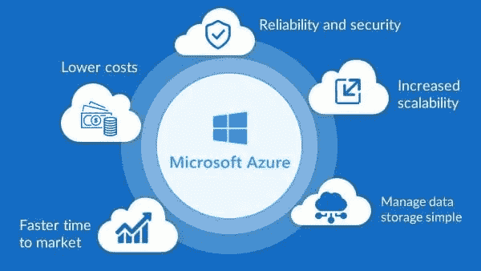
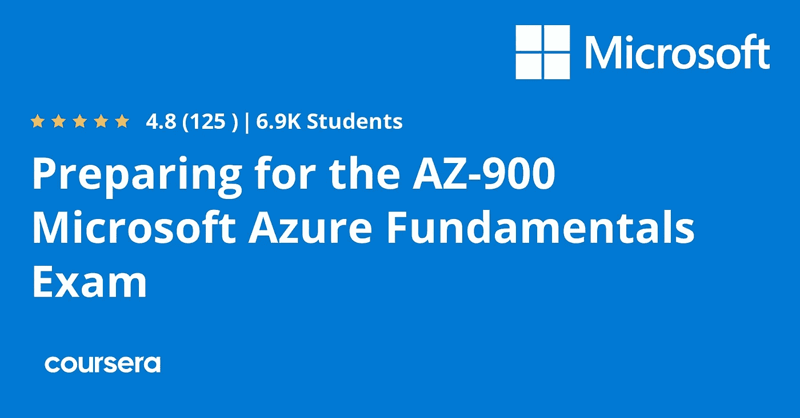
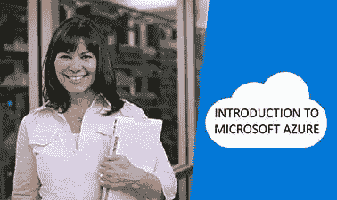
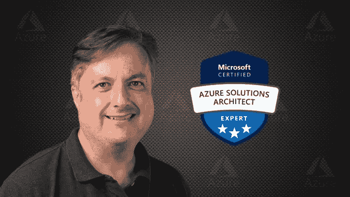
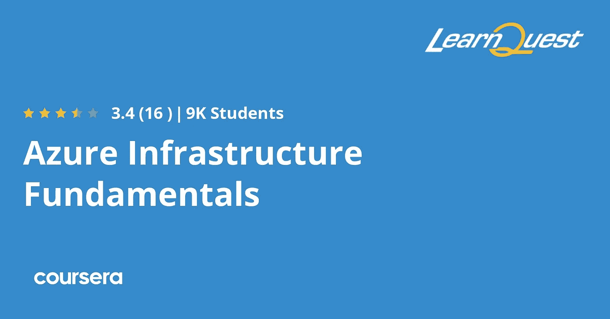
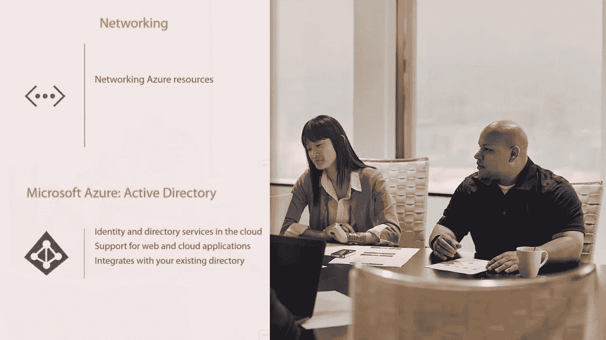
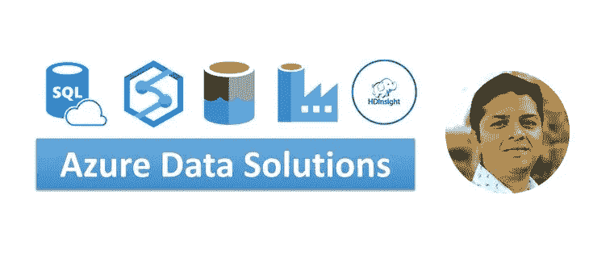
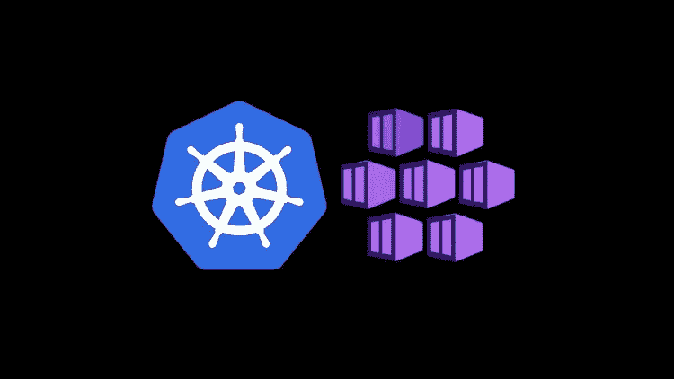

# 2023 年面向初学者和有经验开发者的 10 个最佳微软 Azure 课程

> 原文：<https://medium.com/javarevisited/10-best-microsoft-azure-courses-for-beginners-and-experienced-developers-d41a454834c0?source=collection_archive---------0----------------------->

## 深入学习微软 Azure 云平台和 Azure DevOps 的最佳在线课程集合

大家好，如果你想深入了解微软 Azure 云平台，并寻找最好的在线培训课程，那么你来对地方了。以前分享过最好的备考 [**Azure 基础**](/javarevisited/5-best-azure-fundamentals-courses-to-pass-az-900-certification-exam-in-2020-9e602aea035d)[**Azure 管理员**](/javarevisited/7-best-courses-for-az-104-microsoft-azure-administrator-associate-certification-exam-in-2021-7b620d61dcd8)[**Azure 架构师认证**](https://javarevisited.blogspot.com/2019/07/top-5-courses-to-crack-azure-architecture-technologies-certification-az-300-exam.html) 的课程，今天要分享的是初学者学习 Azure 平台最好的在线课程。

这些都是来自专家培训师和讲师的高质量课程，并且是从像 [Udemy](https://click.linksynergy.com/fs-bin/click?id=JVFxdTr9V80&offerid=323058.9410&type=3&subid=0) 、 [Coursera](https://coursera.pxf.io/c/3294490/1164545/14726?u=https%3A%2F%2Fwww.coursera.org%2F) 、 [Pluralsight](https://pluralsight.pxf.io/c/1193463/424552/7490?u=https%3A%2F%2Fwww.pluralsight.com%2Flearn) 和 [edX](https://www.awin1.com/cread.php?awinmid=6798&awinaffid=631878&clickref=&p=) 这样的网站上挑选的。

你不仅可以利用这些课程学习微软 Azure 核心服务，还可以为不同的微软 Azure 认证做准备，如 [AZ-900](https://javarevisited.blogspot.com/2020/02/top-5-AZ-900-exam-Azure-Fundamentals-certification-practice-tests-and-mock-exams-to.html) 、 [AZ-300](https://javarevisited.blogspot.com/2020/04/how-to-crack-microsoft-azure-solution-architect-exam-az-300.html) 和 [AZ-200](https://javarevisited.blogspot.com/2020/06/top-5-course-to-crack-Microsoft-Azure-Developer-Certification-Exam-AZ-203.html) 或 Azure 开发人员助理认证。

[Microsoft Azure](https://azure.microsoft.com/en-us/) ，是微软创建的云计算服务，旨在通过微软管理的数据中心构建、测试、部署和管理应用和服务。

它提供软件、平台和基础设施即服务，支持许多编程语言、工具和框架，包括微软特有的和第三方的软件和系统。

由于其灵活性，这使得它成为一个非常好的平台。你可以在同一个界面中有不同的项目，这样你就不必改变或学习每个不同平台的特性。因此，如果你有不同的项目或者你使用不同的[编程语言,](https://www.java67.com/2017/12/10-programming-languages-to-learn-in.html)是优化你的时间和资源的好选择。

此外，随着越来越多的公司使用 Azure 来迁移其内部软件和应用程序，对 Azure 认证的[开发人员](https://javarevisited.blogspot.com/2020/04/how-to-crack-microsoft-azure-fundamentals-certification-az-900-exam.html)、[管理员](https://javarevisited.blogspot.com/2020/04/how-to-crack-microsoft-az-103-azure-administrator-associate-exam-certification.html#axzz6LTphn9zT)和[云架构师](https://javarevisited.blogspot.com/2020/04/how-to-crack-microsoft-azure-solution-architect-exam-az-300.html)的需求也呈指数级增长。这意味着这是学习 Azure 和提升你职业形象的最佳时机。

与此同时， [Microsoft Azure](/javarevisited/my-favorite-free-microsoft-azure-cloud-courses-for-beginners-to-learn-in-2020-3418524bb531) 是一个庞大的服务集合，用于在云中构建应用程序，通常会让人不知所措。

这就是为什么选择最好的在线培训课程是至关重要的，这也是本文将帮助你的地方。在这里，你可以找到最好的 Azure 云计算课程，这些课程来自于像 [Udemy](https://click.linksynergy.com/fs-bin/click?id=JVFxdTr9V80&offerid=323058.9410&type=3&subid=0) 、 [Coursera](https://coursera.pxf.io/c/3294490/1164545/14726?u=https%3A%2F%2Fwww.coursera.org%2F) 、 [Pluralsight](https://pluralsight.pxf.io/c/1193463/424552/7490?u=https%3A%2F%2Fwww.pluralsight.com%2Flearn) 和 [edX](https://www.awin1.com/cread.php?awinmid=6798&awinaffid=631878&clickref=&p=) 这样的网站，它们由专家开发，受到成千上万像你一样的人的信任。

# 2023 年学习微软 Azure 的 10 个最佳在线课程

在不浪费你更多时间的情况下，这里有 5 个关于 Azure 的最佳教程。这些是 Udemy、Coursera 和 edX 的最佳课程，你可以用它们来学习 Azure，并为不同的 Azure 认证做准备，如 Azure 基础知识和 Azure 架构技术。

## 1. [AZ-900:微软 Azure 基础考试准备](https://click.linksynergy.com/deeplink?id=CuIbQrBnhiw&mid=39197&murl=https%3A%2F%2Fwww.udemy.com%2Fcourse%2Faz900-azure%2F)

这是在 Udemy 上学习 Azure 的另一个最好的课程。你不仅可以学习 Azure 概念，还可以同时准备 AZ-900 或 Azure 基础考试，这意味着你还可以在此过程中获得认证。如果你想成为 Azure 的专家，你应该参加这个在线课程。

本课程共有 15 节，在课程进行过程中您将看到:

*   Azure 存储服务架构简介
*   创建虚拟网络和网络安全组
*   计算构建模块介绍；虚拟机创建和存储，可用性集
*   Azure 应用服务构建模块；创建和管理 web 应用程序和移动应用程序
*   Azure 数据库服务构建模块以及创建和管理 Azure [SQL 数据库](/hackernoon/top-5-sql-and-database-courses-to-learn-online-48424533ac61)。
*   在 Azure 上交付大数据解决方案
*   在 Azure 上实现应用集成
*   物联网
*   Azure 安全相关服务简介
*   监控和诊断服务
*   Azure 基础设施作为代码(ARM 模板)
*   Azure DevOps 简介

正如你所看到的，它包含了很多主题。所有课程包括超过 5 个小时的视频、4 篇文章和 11 个可下载的资源，这使得这是 Udemy 上初学者最好的 Azure 课程之一。

**这里是加入本课程的链接**——[微软 Azure 云——初学者训练营](https://click.linksynergy.com/deeplink?id=JVFxdTr9V80&mid=39197&murl=https%3A%2F%2Fwww.udemy.com%2Fcourse%2Fthe-complete-walkthrough-of-microsoft-azure-services%2F)

## 2.[微软 Azure 基础 AZ-900 备考专业化](https://coursera.pxf.io/c/3294490/1164545/14726?u=https%3A%2F%2Fwww.coursera.org%2Fspecializations%2Fmicrosoft-azure-fundamentals-az-900)【Coursera+微软】

这是另一个在线课程，我强烈推荐给任何想从头学习 Azure 云概念的人。本课程由微软创建，因此您将从源代码本身学习，它对任何初学云计算的人也有好处。

这个专业包括四门课程，不仅会教你 Azure 基础知识，还会帮助你为 AZ-900 认证考试和云计算职业生涯做准备。该计划的内容与 AZ-900 考试目标领域紧密相关。

本课程将教你基本的微软 Azure 概念；核心微软 Azure 服务；核心解决方案和管理工具；一般安全和网络安全；治理、隐私和合规性特征；微软 Azure 成本管理和服务水平协议。

这门课程也非常适合刚开始使用微软 Azure 的 IT 人员或任何想了解它的人。

**这里是加入本课程的链接** — [微软 Azure 基础 AZ-900 考试准备专业化](https://coursera.pxf.io/c/3294490/1164545/14726?u=https%3A%2F%2Fwww.coursera.org%2Fspecializations%2Fmicrosoft-azure-fundamentals-az-900)

这项计划的另一个好处是，在完成专业化认证后，您将在微软 Azure 基础认证考试中获得 **50%的折扣，这非常棒。**

顺便说一句，如果你计划参加多个 Coursera 课程或专业，那么考虑参加 [**Coursera Plus 订阅**](https://coursera.pxf.io/c/3294490/1164545/14726?u=https%3A%2F%2Fwww.coursera.org%2Fcourseraplus) ，它可以让你无限制地访问他们最受欢迎的课程、专业、专业证书和指导项目。

 [## Coursera Plus |无限制访问 7，000 多门在线课程

### 用 Coursera Plus 投资你的职业目标。无限制访问 90%以上的课程、项目…

coursera.pxf.io](https://coursera.pxf.io/c/3294490/1164545/14726?u=https%3A%2F%2Fwww.coursera.org%2Fcourseraplus) 

## 3.[微软 Azure 基础](https://pluralsight.pxf.io/c/1193463/424552/7490?u=https%3A%2F%2Fwww.pluralsight.com%2Fcourses%2Fazure-fundamentals)【plural sight】

这是从零开始学习微软 Azure 的另一个伟大的 Pluralsight 课程。本课程由 Matt Milner 创建，将向您介绍云计算的新世界以及如何在 Windows Azure 平台上进行构建。

您不仅将了解 Windows Azure 计算和存储以及 SQL Azure，还将了解云计算的利弊，并帮助您理解当前 Windows Azure 平台提供的云计算模型所带来的约束和限制。

Matt 是微软的技术专家之一，他有一种让事情变得简单的诀窍，这确实有助于理解复杂的云计算概念。

*这里是加入本课程的链接*——[微软 Azure 基础](https://pluralsight.pxf.io/c/1193463/424552/7490?u=https%3A%2F%2Fwww.pluralsight.com%2Fcourses%2Fazure-fundamentals)

顺便说一下，你需要一个 [Pluralsight 会员](https://pluralsight.pxf.io/c/1193463/424552/7490?u=https%3A%2F%2Fwww.pluralsight.com%2Flearn)才能加入这个课程，费用大约是每月 29 美元或每年 299 美元(14%的折扣)。

我向所有程序员强烈推荐这个订阅，因为它提供了超过 7000 个在线课程的即时访问，以学习任何技术技能。或者，你也可以使用他们的 [**10 天免费通行证**](https://pluralsight.pxf.io/c/1193463/424552/7490?u=https%3A%2F%2Fwww.pluralsight.com%2Flearn) 免费观看这门课程。

 [## 个人技术技能|多视角

### 借助 Pluralsight，在开发运维、机器学习、云、安全基础设施等领域构建所需技能…

pluralsight.pxf.io](https://pluralsight.pxf.io/c/1193463/424552/7490?u=https%3A%2F%2Fwww.pluralsight.com%2Flearn) 

## 4.[微软 Azure 虚拟机由微软](https://www.awin1.com/cread.php?awinmid=6798&awinaffid=631878&clickref=&p=%5B%5Bhttps%3A%2F%2Fwww.edx.org%2Fcourse%2Fmicrosoft-azure-virtual-machines)【edX】

本课程的重点是将 Azure 中的虚拟机用于工作负载，强调基本的配置、规划、部署和管理任务。

将向您介绍如何保护您的虚拟机并使其高度可用和可扩展。这是进入 Azure 世界的一个良好开端，但不必看到它的所有功能。

以下是您将在本课程中学到的重要知识:

*   IaaS 如何使用虚拟机和端点的基本概念
*   了解如何确定虚拟机工作负载并正确选择虚拟机的大小。
*   创建和部署 Azure Windows 虚拟机的过程。
*   如何配置虚拟机 IP 地址、可用性、可扩展性和安全性。
*   如何管理、连接、导入和导出虚拟磁盘。

这个课程可以完全免费完成，当你完成后，如果你愿意，你可以支付结业证书的费用。

**这里是加入本课程的链接**——[微软 Azure 虚拟机由微软](https://www.awin1.com/cread.php?awinmid=6798&awinaffid=631878&clickref=&p=%5B%5Bhttps%3A%2F%2Fwww.edx.org%2Fcourse%2Fmicrosoft-azure-virtual-machines)

## 5.[微软 Azure——艾伦·罗德里格的初学者指南](https://click.linksynergy.com/deeplink?id=JVFxdTr9V80&mid=39197&murl=https%3A%2F%2Fwww.udemy.com%2Fcourse%2Fmicrosoft-azure-beginners-guide%2F)

这是另一个 Udemy Azure 课程，对从零开始学习微软 Azure 很有帮助。顾名思义，这门课程是为初学者开设的，但是要开始这门课程，你需要一些关于网络、数据库和 Web 服务器如何工作的基本 IT 知识。

你会学到:

*   了解如何开始使用 Azure 的能力
*   启动并使用虚拟机
*   使用 BLOB 或 [SQL Server](/javarevisited/5-best-courses-to-learn-microsoft-sql-server-in-depth-e9f11b73c14a) 等存储选项
*   对 Azure 功能和 Azure Web 应用等服务有基本的了解

课程结束时，您将为参加 AZ-900 认证考试做好准备。本课程包括两次模拟考试供您练习。除此之外，它还包括 10 个半小时的视频教程、13 篇文章和 12 个资源。

*这里是加入本课程的链接* — [微软 Azure —初学者指南](https://click.linksynergy.com/deeplink?id=JVFxdTr9V80&mid=39197&murl=https%3A%2F%2Fwww.udemy.com%2Fcourse%2Fmicrosoft-azure-beginners-guide%2F)

## 6. [AZ-300 Azure 架构技术 2023 年考试准备](https://click.linksynergy.com/deeplink?id=JVFxdTr9V80&mid=39197&murl=https%3A%2F%2Fwww.udemy.com%2Fcourse%2F70534-azure%2F)

这是 Udemy 提供的最好的 Azure 云课程，你可以用它来深入学习 Azure 以及准备 AZ-300 考试。这门课程是为那些掌握一门以上语言知识并希望提高效率的人开设的。

在本课程中，您将学习如何:

*   借助 Azure Portal 访问您的服务
*   知道如何在 Azure 中正确使用不同的虚拟机
*   为您的云使用不同的存储选项和策略
*   借助运营管理套件在云中托管您的资源
*   通过 Azure CDN 和 Akamai 提供高带宽内容
*   用 Azure 开发数据库
*   利用 Azure Redis 缓存作为服务来实现高吞吐量和低延迟
*   通过 Azure 数据目录查找和使用企业数据资产

课程由 20 个半小时的讲解视频组成，你可以参考你想要的时间。最终，你将掌握 Azure 环境，你将会变得更加高效。

**这里是加入这个 Azure 课程的链接**——[AZ-300 Azure 架构技术 2023 年考试准备](https://click.linksynergy.com/deeplink?id=JVFxdTr9V80&mid=39197&murl=https%3A%2F%2Fwww.udemy.com%2Fcourse%2F70534-azure%2F)

## 7. [Azure 基础设施基础知识](https://coursera.pxf.io/c/3294490/1164545/14726?u=https%3A%2F%2Fwww.coursera.org%2Flearn%2Fazure-infrastructure)

本课程侧重于 Azure 基础设施的基础知识。它从了解订阅系统、配置安全性和购买存储开始。然后，您将构建虚拟机和 VNETS 来开始工作。

学习本教程时，您将能够:

*   配置和管理 Azure 订阅
*   创建和管理资源组和身份
*   配置和管理存储和备份
*   创建和管理虚拟机和虚拟网络

完成课程需要 30 个小时，到最后，你就有证书了。这意味着一个高级配置文件，已经知道一些不同的语言，并希望在同一个平台上统一他的所有项目。

**这是参加本课程** — [Azure 基础设施基础知识的链接，由 Learn Quest](https://coursera.pxf.io/c/3294490/1164545/14726?u=https%3A%2F%2Fwww.coursera.org%2Flearn%2Fazure-infrastructure)

顺便说一下，如果你计划参加多个 Coursera 课程或专业，那么考虑参加 [**Coursera Plus 订阅**](https://coursera.pxf.io/c/3294490/1164545/14726?u=https%3A%2F%2Fwww.coursera.org%2Fcourseraplus) ，它将为你提供无限制的访问他们最受欢迎的课程、专业、专业证书和指导项目的机会。它每年花费大约 399 美元，但它完全值得你的钱，因为你可以获得无限的证书。

 [## Coursera Plus |无限制访问 7，000 多门在线课程

### 用 Coursera Plus 投资你的职业目标。无限制访问 90%以上的课程、项目…

coursera.pxf.io](https://coursera.pxf.io/c/3294490/1164545/14726?u=https%3A%2F%2Fwww.coursera.org%2Fcourseraplus) 

## 8. [**微软 Azure:大图**](https://pluralsight.pxf.io/c/1193463/424552/7490?u=https%3A%2F%2Fwww.pluralsight.com%2Fcourses%2Fmicrosoft-azure-the-big-picture)【plural sight】

这是 Pluralsight 的最佳初级 Azure 课程之一，plural sight 是另一个面向程序员和开发人员的领先在线门户。

在本课程中，您将学习开始使用 Microsoft Azure 规划解决方案的基础知识。首先，您将了解云计算以及运行应用程序代码的不同方式。

之后，您将发现 Azure 中的数据存储、处理和分析功能。最后，你将探索如何创建网络；集成、管理和保护您的应用程序；并为 Azure 开发。

完成这个在线 Azure 课程后，你将具备开始开发云解决方案所需的微软 Azure 技能和知识。

*这里是加入本课程的链接*——[微软 Azure:大图](https://pluralsight.pxf.io/c/1193463/424552/7490?u=https%3A%2F%2Fwww.pluralsight.com%2Fcourses%2Fmicrosoft-azure-the-big-picture)

## 9. [Azure DevOps 初学者基础](https://click.linksynergy.com/deeplink?id=JVFxdTr9V80&mid=39197&murl=https%3A%2F%2Fwww.udemy.com%2Fcourse%2Fazure-devops-for-beginners%2F)【Udemy】

这是一门优秀的 Udemy 课程，适用于初学者和有经验的软件开发人员以及希望通过动手演示和用例学习如何规划、管理和部署您的第一个 Azure DevOps 应用程序的技术领导者。

在本 *Azure DevOps 基础知识*课程中，微软认证培训师和畅销 Udemy 讲师 Brian Culp 将带您体验 Azure DevOps，并向您展示如何管理开发团队、代码和应用程序部署。

最重要的是，Brian 知道参加基础课程的学生可能还不熟悉属于 [DevOps 领域](/javarevisited/10-free-online-courses-to-learn-devops-for-beginners-9feadb644f50)的所有词汇、术语和技术，因此他会解释所有这些东西，比如敏捷、Scrum、应用程序容器、提交、代码请求、Sprints、单元测试、代码工件和其他 DevOps 术语。

由于本课程是为不熟悉 DevOps 术语和概念的人设计的，我强烈建议初学者和有经验的软件开发人员都参加本课程。

**这里是加入本课程的链接** — [Azure DevOps 初学者基础](https://click.linksynergy.com/deeplink?id=JVFxdTr9V80&mid=39197&murl=https%3A%2F%2Fwww.udemy.com%2Fcourse%2Fazure-devops-for-beginners%2F)

## 10.面向初学者的 Azure 数据工程技术

顾名思义，这门 Azure 课程是为想成为数据工程师，想在微软 Azure 云平台上工作的人开设的。微软 Azure 数据工程是[数据科学从业者](/javarevisited/my-favorite-data-science-and-machine-learning-courses-from-coursera-udemy-and-pluralsight-eafc73acc73f)增长最快、需求最大的领域之一。

在本课程中，您将了解 Azure 数据技术，如 Microsoft Azure SQL 数据库、数据湖、数据工厂、Synapse Analytics、Cosmos DB、Databricks 和 HDInsight。

这是一个庞大的课程，有 34.5 小时的内容和 50 多篇文章，学习所有你想在 Azure 中学习的基本数据技术。这个课程对 DP-200 和 DP-2001 也有好处。

*这里是加入这个 Azure 课程的链接* — [面向初学者的 Azure 数据工程师技术](https://click.linksynergy.com/deeplink?id=JVFxdTr9V80&mid=39197&murl=https%3A%2F%2Fwww.udemy.com%2Fcourse%2Fmicrosoft-azure-database-and-analytics%2F)

## 11.[使用 Azure DevOps 和 Terraform 的 Azure Kubernetes 服务](https://click.linksynergy.com/deeplink?id=JVFxdTr9V80&mid=39197&murl=https%3A%2F%2Fwww.udemy.com%2Fcourse%2Fazure-kubernetes-service-with-azure-devops-and-terraform%2F)

这是我向希望掌握 Azure 平台的有经验的开发人员推荐的另一门课程。在本课程中，您将了解基本的 DevOps 工具和技术，如 [Docker](/javarevisited/10-free-courses-to-learn-docker-and-devops-for-frontend-developers-691ac7652cee?source=---------94------------------) 、AKS、Azure Disks、 [DevOps](/javarevisited/13-best-courses-to-learn-devops-for-senior-developers-in-2020-a2997ff7c33c) 、虚拟节点、ACR、DNS 区域、Active Directory、 [Kubernetes](/javarevisited/top-15-online-courses-to-learn-docker-kubernetes-and-aws-for-fullstack-developers-and-devops-d8cc4f16e773) 、Ingress 和 [Terraform](/javarevisited/7-best-terraform-online-courses-for-devops-engineers-5e4dab297785) 。

本课程非常适合打算掌握 Azure Kubernetes 服务(AKS)以在 Kubernetes 上运行应用程序的 Azure 架构师、系统管理员或开发人员。

本课程最大的优点是，它充满了实践经验和清晰的解释，真正有助于理解任何概念的内容、原因和方式。简而言之，这是掌握 Azure DevOps 的绝佳课程，尤其是 AKS 或 Azure Kubernetes 服务。

*以下是参加本课程的链接*——[Azure Kubernetes Service with Azure devo PS and Terraform](https://click.linksynergy.com/deeplink?id=JVFxdTr9V80&mid=39197&murl=https%3A%2F%2Fwww.udemy.com%2Fcourse%2Fazure-kubernetes-service-with-azure-devops-and-terraform%2F)

以上就是 2023 年**深入学习微软 Azure 云平台的最佳课程。**这些在线课程也适用于各种 Azure 认证，如 Azure 基础知识和 Azure 云架构师。如果你正在考虑云原生，那么微软 Azure 是一个很好的选择，可以改善你的工作流程，让事情变得更简单。这是非常广泛的，所以你有文章解释他们所提供的，所以你可以选择一个更好地适应你正在寻找的。

其他 **Azure** **面向 IT 专业人士**和 Java 程序员的云资源

*   [破解 Azure 开发人员助理考试的前 5 门课程](https://javarevisited.blogspot.com/2020/06/top-5-course-to-crack-Microsoft-Azure-Developer-Certification-Exam-AZ-203.html)
*   [如何破解 AWS 解决方案架构师考试](https://javarevisited.blogspot.com/2019/08/how-to-crack-aws-certified-solution-architect-exam.html)
*   [学习微软 Azure 概念的 5 门免费课程](https://www.java67.com/2020/07/5-free-courses-to-learn-microsoft-azure-cloud.html)
*   [如何破解 2023 年 AZ-103 蔚蓝行政考试](https://javarevisited.blogspot.com/2020/04/how-to-crack-microsoft-az-103-azure-administrator-associate-exam-certification.html)
*   [如何在 2023 年成为 Azure 解决方案架构师助理](https://javarevisited.blogspot.com/2020/04/how-to-crack-microsoft-azure-solution-architect-exam-az-300.html)
*   [通过 Azure 云架构考试的前 5 门课程](https://javarevisited.blogspot.com/2019/07/top-5-courses-to-crack-azure-architecture-technologies-certification-az-300-exam.html)
*   [2023 年通过 AZ-900 认证的前 5 名课程](https://javarevisited.blogspot.com/2020/02/top-5-courses-to-crack-az-900-microsoft-azure-fundamentals-certification-exam.html)
*   [微软 Azure 基础知识五大模拟测试](https://javarevisited.blogspot.com/2020/02/top-5-AZ-900-exam-Azure-Fundamentals-certification-practice-tests-and-mock-exams-to.html)
*   [破解 Azure 云架构师(AZ-300)考试的前 5 门课程](https://javarevisited.blogspot.com/2019/07/top-5-courses-to-crack-azure-architecture-technologies-certification-az-300-exam.html#axzz6E6VuRMsx)
*   [通过 Azure 开发者助理认证(AZ-203)的 5 门在线课程](https://javarevisited.blogspot.com/2020/06/top-5-course-to-crack-Microsoft-Azure-Developer-Certification-Exam-AZ-203.html)
*   [破解 AWS 解决方案架构师认证的 5 大课程](https://javarevisited.blogspot.com/2019/05/top-5-courses-to-crack-aws-solutions-architect-associate-certification-exam-SAA-C01.html#axzz5rHwAwycj)
*   [程序员前 5 名 AZ-900 模拟测试](https://javarevisited.blogspot.com/2020/02/top-5-AZ-900-exam-Azure-Fundamentals-certification-practice-tests-and-mock-exams-to.html)
*   [通过谷歌助理云工程师认证的前 5 门课程](https://javarevisited.blogspot.com/2019/07/top-5-google-cloud-platform-gcp-courses-certifications-online.html)
*   [如何成为 DevOps 工程师？](https://javarevisited.blogspot.com/2018/09/the-2018-devops-roadmap-your-guide-to-become-DevOps-Engineer.html)
*   [如何破解 Azure Fundamentals (AZ-900)认证](https://javarevisited.blogspot.com/2020/04/how-to-crack-microsoft-azure-fundamentals-certification-az-900-exam.html)
*   [OCAJP 和 OCPJP 考试 10 道免费样题](http://www.java67.com/2017/05/10-free-java-8-certification-sample-questions-OCAJP8-OCPJP8-Mock-Exams.html)

感谢您阅读本文。如果你觉得这些微软 Azure 课程有用，那么，请与你的朋友和同事分享。如果您有任何问题或反馈，请留言。

**附言——**如果你渴望从零开始学习微软 Azure 平台，但正在寻找免费的在线培训课程来开始你的旅程，那么你也可以在 Udemy 上看到[**微软 Azure 概念**](https://click.linksynergy.com/deeplink?id=JVFxdTr9V80&mid=39197&murl=https%3A%2F%2Fwww.udemy.com%2Fcourse%2Flinux-academy-microsoft-azure-concepts%2F)——由 Linux Academy 提供的免费课程。这是完全免费的，你只需要一个免费的 Udemy 帐户就可以在线参加这个课程。

 [## 免费微软 Azure 教程-微软 Azure 概念

### Linux 学院是建立在这样一个信念上的，即提供高质量的，深入的培训应该在一个…

udemy.com](https://click.linksynergy.com/deeplink?id=JVFxdTr9V80&mid=39197&murl=https%3A%2F%2Fwww.udemy.com%2Fcourse%2Flinux-academy-microsoft-azure-concepts%2F)