# 2023 年 10 个最佳 NFT(不可替代代币)课程和初学者证书

> 原文：<https://medium.com/javarevisited/10-best-nfts-courses-and-certifications-for-beginners-to-learn-non-fungible-tokens-in-2022-3f36a4374ba?source=collection_archive---------1----------------------->

## 这些是最好的在线课程，可以学习关于 NFTs 的一切，从什么是 NFT 到创造、铸造、销售和收集不可替代代币

[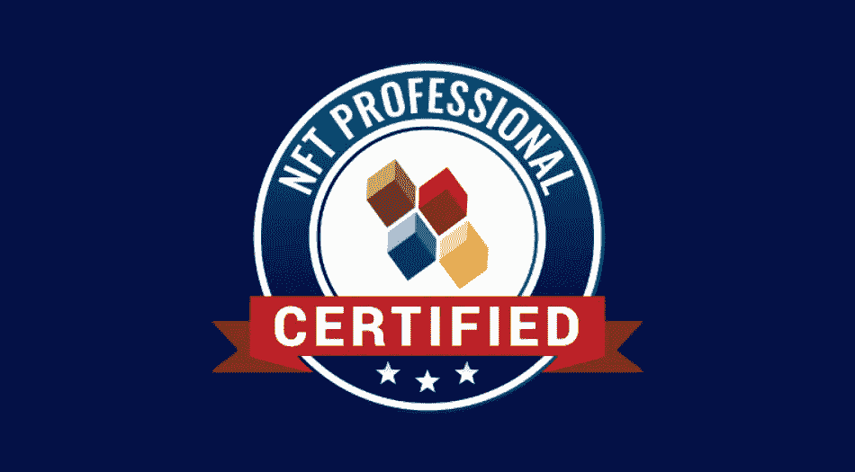](https://shareasale.com/r.cfm?b=1696402&u=880419&m=105464&urllink=https%3A%2F%2Facademy%2E101blockchains%2Ecom%2Fcourses%2Fcertified%2Dnft%2Dprofessional&afftrack=)

你好，伙计们，如果你想加入 NFT 的行列，但不知道从哪里开始，寻找最好的在线课程和证书来学习 NFT，那么你来对地方了。早些时候，我已经分享了学习区块链 和[以太坊](https://javarevisited.blogspot.com/2022/01/5-best-courses-to-learn-cryptocurrency.html)的 [**最佳在线课程，在这篇文章中，我将分享 2023 年学习 NFTs 或不可替代令牌的最佳在线课程。**](/javarevisited/best-blockchain-courses-and-certification-in-2020-63729f8f04d0)

随着世界见证了许多高调的 NFT 销售，NFTs 的受欢迎程度与日俱增。随着 2021 年市值超过 400 亿美元，估计显示，到 2023 年底，该价值将增长到 800 亿美元。

考虑到 NFT 的持续增长，明智的决定是尽早了解 NFT，因为现在正是获得早期优势的时候，就像比特币和以太坊的早期一样，这就是这些 [*最佳 NFT 课程*](https://javarevisited.blogspot.com/2021/12/top-5-courses-to-learn-about-nfts-non.html) 将指导你的地方，但是，在此之前，让我们了解一下什么是 NFT 或不可替代的 Toke n 实际含义？

由于虚拟化和区块链时代的产物 NFTs，获取和拥有高价值数字资产的过程变得更加高效。

你会问我“这是什么 NFT？”我说的是。

不可替换的令牌，意味着它是唯一的&不能被其他任何东西替代。

NFT 是位于区块链的代表虚拟资产所有权的数据。区块链是一种数字账本，最初是为比特币而创建的，但现在已经被各种行业所采用。它通过在每次移动项目时创建一个新的数据块来建立一个不可更改的事件分类帐。

对于 NFT 的新来者来说，在这个不可替代代币的大型生态系统中，很难把握住明智的动向，尤其是随着非功能性代币的传言越来越多&非功能性代币冲击了社会。

# 2023 年初学者学习 NFT 的 10 个最佳在线课程和认证

下面列出的所有课程都是评分最高的，深受学习者的喜爱，取自流行的在线学习平台，如 Udemy、Coursera 等。

## 1. [NFT 基本面(买入、创建和卖出 NFT)](https://click.linksynergy.com/deeplink?id=JVFxdTr9V80&mid=39197&murl=https%3A%2F%2Fwww.udemy.com%2Fcourse%2Fnft-fundamentals%2F)

这门课程是在 Udemy 网站上进行的，它的评分是 4.6 分，已经有 26K+的学生使用过。

这个基础水平的培训，由 George Levy 创建，是为那些想要立即开始购买、创建和销售 NFT 的新手准备的。除了希望了解 NFT 以及如何正确制作、购买和交易它们之外，注册没有任何先决条件。

## 本课程的亮点

本课程适合学生、艺术家或希望使用 NFT 理工大学的人。

本课程持续时间约为 2.5 小时

**这里是加入本课程的链接—**[【NFT 基础知识(购买、创建和销售 NFT)】](https://click.linksynergy.com/deeplink?id=JVFxdTr9V80&mid=39197&murl=https%3A%2F%2Fwww.udemy.com%2Fcourse%2Fnft-fundamentals%2F)

[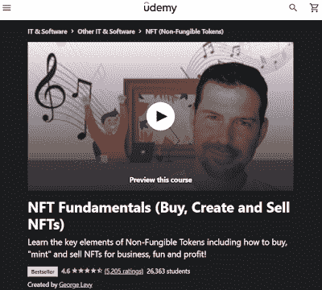](https://click.linksynergy.com/deeplink?id=JVFxdTr9V80&mid=39197&murl=https%3A%2F%2Fwww.udemy.com%2Fcourse%2Fnft-fundamentals%2F)

## 2. [**认证 NFT 专业(CNFTP)认证**](https://shareasale.com/r.cfm?b=1696402&u=880419&m=105464&urllink=https%3A%2F%2Facademy%2E101blockchains%2Ecom%2Fcourses%2Fcertified%2Dnft%2Dprofessional&afftrack=)**【101 区块链】**

当我今年早些时候开始学习 NFTs 时，我正在寻找一种类似认证的资源，以一种结构化和有指导的方式学习关于 NFTs 的一切，但我找不到这样的单一资源，我最终通过学习多门课程来学习，但你不需要这样做。

101 区块链刚刚发布[认证 NFT 专业人士(CNFTP)认证](https://shareasale.com/r.cfm?b=1696402&u=880419&m=105464&urllink=https%3A%2F%2Facademy%2E101blockchains%2Ecom%2Fcourses%2Fcertified%2Dnft%2Dprofessional&afftrack=)这是 2023 年学习 NFTs 最好的资源之一。这也是有史以来第一个认证的 NFT 专业认证计划，以帮助您利用与 NFTs 相关的众多前景。

这个 NFT 认证课程将帮助您发展 NFT 技能并获得宝贵的知识。该认证计划包括由 Joe Holbrook(高级讲师)讲授的课程，以及白板讨论、演示、模块回顾、互动练习和认证前的评估考试。

在该认证计划中，您将了解不同的 NFT 概念，如基本原理、优势、使用案例、风险以及采用 NFT 的挑战。您还将学习如何利用不可替代的代币，并通过创建自己的 NFT 收藏甚至交易来利用它们。

**这里是加入本次 NFT 认证**——[NFT 认证专家(CNFTP)认证](https://shareasale.com/r.cfm?b=1696402&u=880419&m=105464&urllink=https%3A%2F%2Facademy%2E101blockchains%2Ecom%2Fcourses%2Fcertified%2Dnft%2Dprofessional&afftrack=)的链接

[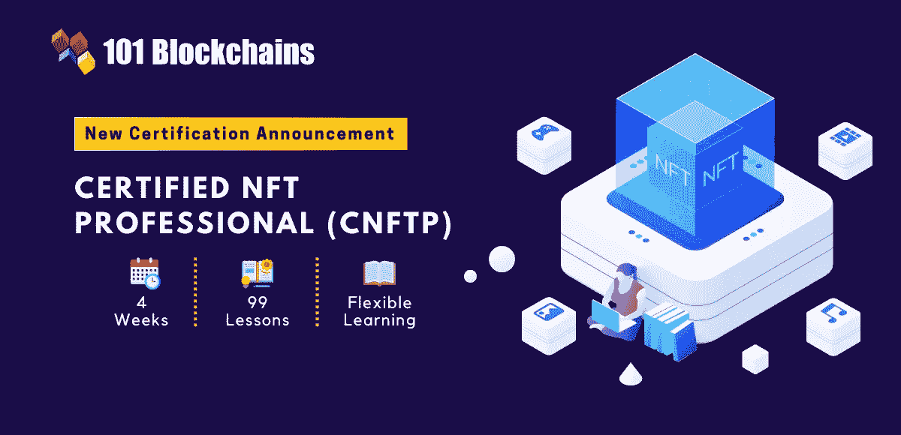](https://shareasale.com/r.cfm?b=1696402&u=880419&m=105464&urllink=https%3A%2F%2Facademy%2E101blockchains%2Ecom%2Fcourses%2Fcertified%2Dnft%2Dprofessional&afftrack=)

简而言之，深入学习 NFTs 的最佳在线课程和认证之一。当你成为 NFT 认证专家时，你也为你自己作为 NFT 专家打开了更好的机会之门。你也可以使用我的代码 **BCHAIN30 在这个令人敬畏的课程上获得 30%的折扣**。

## 3.[完整的 NFT 课程——了解关于 NFTs 的一切](https://click.linksynergy.com/deeplink?id=JVFxdTr9V80&mid=39197&murl=https%3A%2F%2Fwww.udemy.com%2Fcourse%2Fthe-complete-nft-course-learn-everything-about-nfts%2F)

Udemy 平台提供的另一个很棒的初学者友好课程，平均评分为 4.4 分，有超过 13000 名学生注册。

这个循序渐进的指南，由 Henrique Centieiro 创建，旨在提供你购买、开发或交易 NFT 所需的所有基本知识。在本课程中，您还将了解避免 NFT 骗局的预防措施。

## 本课程的亮点

这是区块链爱好者或任何对 NFT 有热情的人的理想选择。

**此处是加入本课程的链接—** [完整的 NFT 课程—了解关于 NFTs | Udemy 的一切](https://click.linksynergy.com/deeplink?id=JVFxdTr9V80&mid=39197&murl=https%3A%2F%2Fwww.udemy.com%2Fcourse%2Fthe-complete-nft-course-learn-everything-about-nfts%2F)

[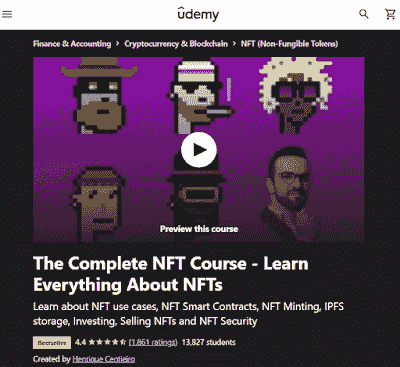](https://click.linksynergy.com/deeplink?id=JVFxdTr9V80&mid=39197&murl=https%3A%2F%2Fwww.udemy.com%2Fcourse%2Fthe-complete-nft-course-learn-everything-about-nfts%2F)

## 4.[完整的 NFT(不可替换代币)课程:艺术和技术](https://click.linksynergy.com/deeplink?id=JVFxdTr9V80&mid=39197&murl=https%3A%2F%2Fwww.udemy.com%2Fcourse%2Fthe-complete-nft-non-fungible-tokens-course-for-artists%2F)

该培训是 Udemy 网站上最好的培训之一，评分为 4.2，超过 24K 名学生从中受益。

如果你想要一个关于开发、购买和交易不可替代代币的循序渐进的教程，以及从艺术品到营销方面对[不可替代代币](https://savingsfunda.blogspot.com/2022/05/top-10-online-courses-to-learn-nfts-non-fun.html)的足够透彻的理解，那么这个课程就是为你准备的。

## 本课程的亮点

这是一门初级课程。

所有讲座的时长加起来大概是 11H。

**链接到本课程—** [完整的 NFT(不可替换代币)课程:艺术与科技| Udemy](https://click.linksynergy.com/deeplink?id=JVFxdTr9V80&mid=39197&murl=https%3A%2F%2Fwww.udemy.com%2Fcourse%2Fthe-complete-nft-non-fungible-tokens-course-for-artists%2F)

[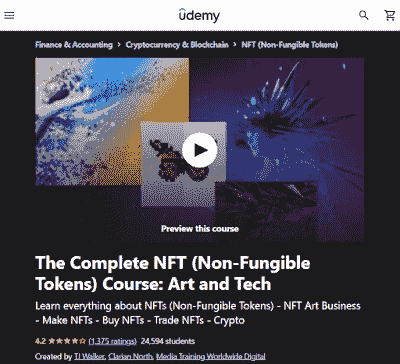](https://click.linksynergy.com/deeplink?id=JVFxdTr9V80&mid=39197&murl=https%3A%2F%2Fwww.udemy.com%2Fcourse%2Fthe-complete-nft-non-fungible-tokens-course-for-artists%2F)

## 5. [NFT 密码大师班:购买、出售和创建 NFT](https://click.linksynergy.com/deeplink?id=JVFxdTr9V80&mid=39197&murl=https%3A%2F%2Fwww.udemy.com%2Fcourse%2Fnft-crypto-buy-sell-create%2F)

这个项目在 Udemy 平台上可用，平均评分为 4.7 分，已经帮助了 6300 多名学生。

本课程由 Petko Zhivkov Aleksandrov 制作，旨在帮助您快速从初学者过渡到高级。参加这个课程会教你所有你需要知道的关于创作艺术品和在市场上销售的知识。

## 该计划的亮点

需要有学习的意愿和好奇心。

你需要的另一件东西是一台可以上网的设备。

**链接到本课程—** [NFT 密码大师班:购买、出售和创建 NFTs | Udemy](https://click.linksynergy.com/deeplink?id=JVFxdTr9V80&mid=39197&murl=https%3A%2F%2Fwww.udemy.com%2Fcourse%2Fnft-crypto-buy-sell-create%2F)

[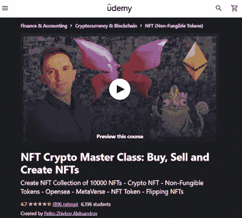](https://click.linksynergy.com/deeplink?id=JVFxdTr9V80&mid=39197&murl=https%3A%2F%2Fwww.udemy.com%2Fcourse%2Fnft-crypto-buy-sell-create%2F)

## 6.[NFTs 简介:不可替代令牌](http://linkedin-learning.pxf.io/c/1193463/449670/8005?u=https%3A%2F%2Fwww.linkedin.com%2Flearning%2Fintroduction-to-nfts-non-fungible-tokens)【LinkedIn Learning】

这个初级课程可以在 LinkedIn learning 上找到，已经帮助超过 37K+的观众寻求了解 NFT。

这个项目由投资人 Jonathan Reichental 创建，旨在向大众传授 NFT 的基本知识——如何避免 NFT 欺诈、选择正确的市场、如何交易等。

## 本课程的亮点

完成本课程的内容大约需要一个小时。

你可以在任何设备上以你的速度学习它。

**链接到本课程—**[NFTs 简介:不可替代代币在线课程| LinkedIn 学习](http://linkedin-learning.pxf.io/c/1193463/449670/8005?u=https%3A%2F%2Fwww.linkedin.com%2Flearning%2Fintroduction-to-nfts-non-fungible-tokens)

[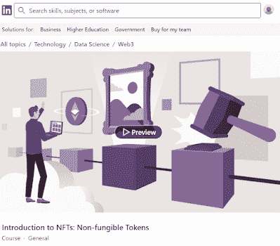](http://linkedin-learning.pxf.io/c/1193463/449670/8005?u=https%3A%2F%2Fwww.linkedin.com%2Flearning%2Fintroduction-to-nfts-non-fungible-tokens)

顺便说一下，你需要 LinkedIn Learning 会员才能观看这门课程，每月费用约为 19.99 美元，但你也可以通过参加他们的 [**1 个月免费试用**](http://linkedin-learning.pxf.io/c/1193463/449670/8005?u=https%3A%2F%2Fwww.linkedin.com%2Flearning%2Fsubscription%2Fproducts) 来免费观看这门课程，这是探索他们 17500 多门最新技术在线课程的好方法。

 [## LinkedIn Learning 免费试用和订阅价格

### 从初级到高级的 17，000 多门专家指导课程的个性化、高质量内容。基于社区的…

linkedin-learning.pxf.io](http://linkedin-learning.pxf.io/c/1193463/449670/8005?u=https%3A%2F%2Fwww.linkedin.com%2Flearning%2Fsubscription%2Fproducts) 

## 7. [NFT 投资大师班——关于 NFT 投资的专业建议](https://click.linksynergy.com/deeplink?id=JVFxdTr9V80&mid=39197&murl=https%3A%2F%2Fwww.udemy.com%2Fcourse%2Fnft-investing-masterclass-pro-tips-about-nft-investing%2F)

这门大师班课程由 Udemy 平台提供，平均评分为 4.6 分，有近名 3K 学生注册。

这是另一个由 Henrique Centieiro 创建的课程，它旨在教你在 [NFTs](https://savingsfunda.blogspot.com/2022/05/how-to-create-and-sell-nft-non-fungible.html) 中成功投资所需的最佳策略和专业技巧。

在这门课程中，你将学习如何识别潜在盈利的 NFTS，各种其他方法来管理你的投资组合&如何避免 NFT 骗局。

## 本课程的亮点

这个程序是专门为这个领域的初学者或中间者设计的。

参加本课程不需要任何先验知识。

**链接到本课程—** [NFT 投资大师班—关于 NFT 投资的专业建议| Udemy](https://click.linksynergy.com/deeplink?id=JVFxdTr9V80&mid=39197&murl=https%3A%2F%2Fwww.udemy.com%2Fcourse%2Fnft-investing-masterclass-pro-tips-about-nft-investing%2F)

[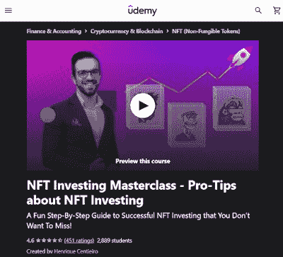](https://click.linksynergy.com/deeplink?id=JVFxdTr9V80&mid=39197&murl=https%3A%2F%2Fwww.udemy.com%2Fcourse%2Fnft-investing-masterclass-pro-tips-about-nft-investing%2F)

## 8.[完整的 NFT Web 开发课程——零到专家](https://click.linksynergy.com/deeplink?id=CuIbQrBnhiw&mid=39197&murl=https%3A%2F%2Fwww.udemy.com%2Fcourse%2Fthe-complete-nft-web-developer-course-zero-to-professional%2F)

Udemy 平台上的另一门畅销课程已经帮助了 2 万多名学生，平均评分为 4.4 分。

不像其他课程教你如何从概念到交易进行非功能性交易，这一门课程的重点是如何建立一个 NFT 市场。注册本课程后，你将拥有所有必要的网络开发和 NFT 专业知识，开始建立你的市场。

## 本课程的亮点

你将获得额外的基础知识和网站开发。

**链接到本课程—** [完整的 NFT Web 开发课程—零到专家| Udemy](https://click.linksynergy.com/deeplink?id=CuIbQrBnhiw&mid=39197&murl=https%3A%2F%2Fwww.udemy.com%2Fcourse%2Fthe-complete-nft-web-developer-course-zero-to-professional%2F)

[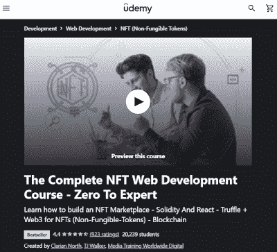](https://click.linksynergy.com/deeplink?id=CuIbQrBnhiw&mid=39197&murl=https%3A%2F%2Fwww.udemy.com%2Fcourse%2Fthe-complete-nft-web-developer-course-zero-to-professional%2F)

## 9. [NFT 大师班:购买、创造和销售 NFT](https://click.linksynergy.com/deeplink?id=JVFxdTr9V80&mid=39197&murl=https%3A%2F%2Fwww.udemy.com%2Fcourse%2Fnft-masterclass-buy-create-and-sell-nfts%2F)

另一个信息丰富的课程，在 Udemy 平台上提供，平均评分为 4.7 分&教育超过 13000 名学生关于 NFTs 的知识。

该课程易于学习，并以视频形式提供，涵盖了您从最初的概念开始需要学习的关于 NFTs 的所有内容。你会得到详细的说明和插图。

这项研究从 NFT 的简史开始，然后进入支撑它们的技术，并通过每个层次。

## 本课程的亮点–

完全适合初学者的课程。

需要具有活动互联网连接的设备。

**链接到本课程—** [NFT 大师班:购买、创建和销售 NFT | Udemy](https://click.linksynergy.com/deeplink?id=JVFxdTr9V80&mid=39197&murl=https%3A%2F%2Fwww.udemy.com%2Fcourse%2Fnft-masterclass-buy-create-and-sell-nfts%2F)

[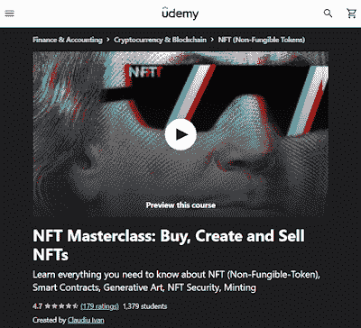](https://click.linksynergy.com/deeplink?id=JVFxdTr9V80&mid=39197&murl=https%3A%2F%2Fwww.udemy.com%2Fcourse%2Fnft-masterclass-buy-create-and-sell-nfts%2F)

## 10.[2023 年 NFT 终极课程:购买、出售、创建&贸易 NFT](https://click.linksynergy.com/deeplink?id=JVFxdTr9V80&mid=39197&murl=https%3A%2F%2Fwww.udemy.com%2Fcourse%2Fthe-ultimate-nft-course%2F)

这份关于 NFTs 的终极最高评级(平均评级 4.9)指南可在 Udemy 平台上获得。该课程由约书亚·乔治和 ClickSlice 有限公司创建，是该平台上最新、最热门的票房课程。

报名参加本课程后，您将了解 NFTs 的基本原理，它们是如何运作的，关于市场的所有信息，汽油费，如何购买您的第一辆 NFT，如何避免市场上的骗局&更多细节。

## 本课程的亮点-

获奖数字机构所有者的最终指南。

本课程持续时间约为 11 小时。

**链接到本课程—**[2023 年 NFT 终极课程:购买、销售、创造&贸易 NFTs | Udemy](https://click.linksynergy.com/deeplink?id=JVFxdTr9V80&mid=39197&murl=https%3A%2F%2Fwww.udemy.com%2Fcourse%2Fthe-ultimate-nft-course%2F)

[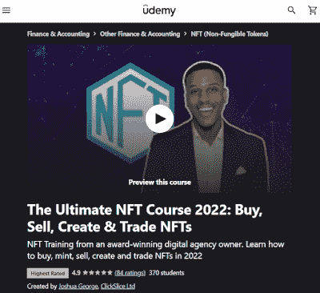](https://click.linksynergy.com/deeplink?id=JVFxdTr9V80&mid=39197&murl=https%3A%2F%2Fwww.udemy.com%2Fcourse%2Fthe-ultimate-nft-course%2F)

## 11.[分散金融(DeFi)原语](https://coursera.pxf.io/c/3294490/1164545/14726?u=https%3A%2F%2Fwww.coursera.org%2Flearn%2Fdecentralized-finance-primitives-duke)【Coursera】

该课程由杜克大学提供，在 Coursera 平台上提供，最高评分为 4.9 分，目前有 5700 多名学生注册。

本课程探索贸易机制，并教你可替代和不可替代的代币，通常被称为 [NFTs](https://www.java67.com/2022/03/top-5-free-courses-to-learn-nft-non-fun.html) 。这门课深入探讨了占有这个至关重要的话题。然后，课程将转到资源管理，包括令牌铸造&刻录。

本课程也是 Coursera 广受欢迎的 NFT 相关认证 [**分散金融(DeFi):金融专业化的未来**](https://coursera.pxf.io/c/3294490/1164545/14726?u=https%3A%2F%2Fwww.coursera.org%2Fspecializations%2Fdecentralized-finance-duke) 的一部分。

## 本课程的亮点-

这是一门中级课程。

本课程持续时间约为 6 小时。

**链接到本课程—** [分散金融(DeFi)原语| Coursera](https://coursera.pxf.io/c/3294490/1164545/14726?u=https%3A%2F%2Fwww.coursera.org%2Flearn%2Fdecentralized-finance-primitives-duke)

顺便说一句，如果你计划参加多个 Coursera 课程或专业，那么考虑参加 [**Coursera Plus 订阅**](https://coursera.pxf.io/c/3294490/1164545/14726?u=https%3A%2F%2Fwww.coursera.org%2Fcourseraplus) ，它可以让你无限制地访问他们最受欢迎的课程、专业、专业证书和指导项目。

 [## Coursera Plus |无限制访问 7，000 多门在线课程

### 用 Coursera Plus 投资你的职业目标。无限制访问 90%以上的课程、项目…

coursera.pxf.io](https://coursera.pxf.io/c/3294490/1164545/14726?u=https%3A%2F%2Fwww.coursera.org%2Fcourseraplus) 

## 结论

以上是关于 2023 年**学习 NFT 或不可替代代币的最佳在线课程**。如果你曾经想学习 NFT，现在是最好的时机，我希望上面列出的课程能帮助你，为你的 NFT 激情提供起步指南。

众所周知， **NFTs** 是目前加密市场最热门的话题。不仅是投资者，就连名人也在出售他们的 NFT。因此，这个市场的未来增长是毫无疑问的。祝你在学习的旅途中好运。

其他**区块链和加密货币文章**你可能喜欢

*   [开发者的 10 门最佳区块链课程](/javarevisited/best-blockchain-courses-and-certification-in-2020-63729f8f04d0)
*   [初学者学习数据科学的 10 门课程](https://hackernoon.com/10-machine-learning-data-science-and-deep-learning-courses-for-programmers-7edc56078cde)
*   [2023 年学习 Python 的 5 大课程](https://hackernoon.com/top-5-courses-to-learn-python-in-2018-best-of-lot-26644a99e7ec)
*   [我最喜欢的学习以太坊的在线课程](https://javarevisited.blogspot.com/2021/11/top-5-courses-to-learn-ethereum-for.html)
*   [学习 Solidity 编程语言的 5 门最佳课程](https://javarevisited.blogspot.com/2022/01/top-5-courses-to-learn-solidity-for.html)
*   [2023 年学习 Python 的 10 个理由](https://hackernoon.com/10-reasons-to-learn-python-in-2018-f473dc35e2ee)
*   [初学者学习 Python 的 10 门免费课程](https://hackernoon.com/10-free-python-programming-courses-for-beginners-to-learn-online-38312f3b9912)
*   [学习数据科学 Python 的 5 本书](https://javarevisited.blogspot.com/2019/08/top-5-python-books-for-data-science-and-machine-learning.html)
*   [学习高级数据科学的前 5 门课程](https://hackernoon.com/top-5-data-science-and-machine-learning-course-for-programmers-e724cfb9940a)
*   [初学者学习 TensorFlow 的 5 大课程](https://hackernoon.com/top-5-tensorflow-and-ml-courses-for-programmers-8b30111cad2c)
*   [2023 年学习区块链的 7 门免费课程](/javarevisited/7-free-courses-to-learn-blockchain-in-2020-764e66b47ebe)

感谢您阅读本文。如果你喜欢这些*最好的 NFT 在线课程和认证*，那么请与你的朋友和同事分享，如果你觉得它们有用的话。如果您有任何问题或反馈，请留言。

**p . s .**——如果你认真学习 NFT 并寻找最好的 NFT 认证，那么这个[**101 区块链**](https://shareasale.com/r.cfm?b=1696402&u=880419&m=105464&urllink=https%3A%2F%2Facademy%2E101blockchains%2Ecom%2Fcourses%2Fcertified%2Dnft%2Dprofessional&afftrack=) 的 NFT 认证专家(CNFTP)认证是最好的资源。我的许多学生和读者都选了这门课，反馈非常好。替代的， [*Coursera 认证为 NFT*](https://coursera.pxf.io/c/3294490/1164545/14726?u=https%3A%2F%2Fwww.coursera.org%2Fspecializations%2Fdecentralized-finance-duke) 也不错。

 [## 分散金融:金融的未来

### 了解有关分散金融的更多信息..了解分散融资的基础设施并评估…

coursera.pxf.io](https://coursera.pxf.io/c/3294490/1164545/14726?u=https%3A%2F%2Fwww.coursera.org%2Fspecializations%2Fdecentralized-finance-duke)