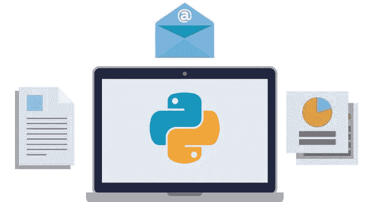
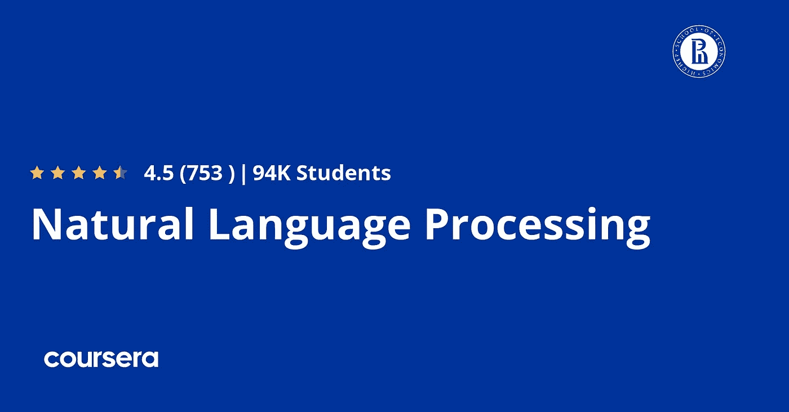
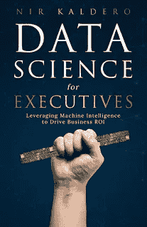
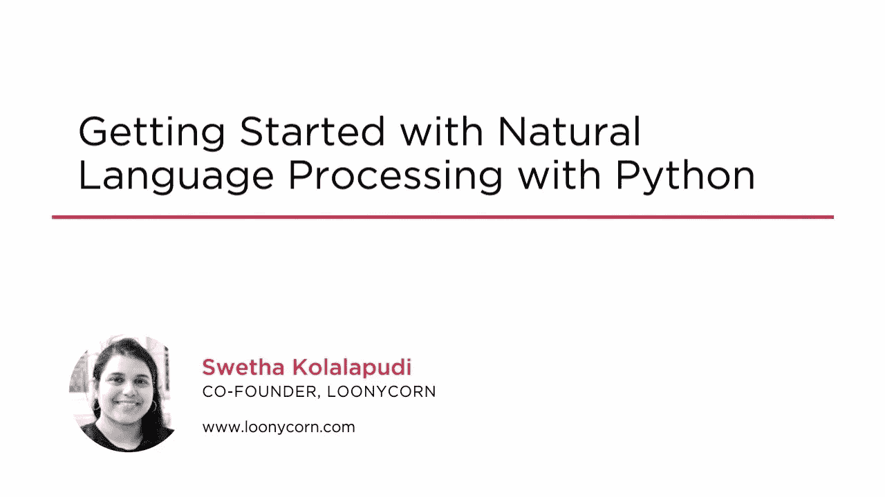

# 2023 年 10 个最佳自然语言处理(NLP)和 Python 初学者课程

> 原文：<https://medium.com/javarevisited/10-best-nlp-natural-language-processing-with-python-courses-for-beginners-bfe526c6b0b2?source=collection_archive---------0----------------------->

## 2023 年初学者学习自然语言处理的最佳在线课程集

如果你想学习自然语言处理或 NLP，并寻找学习 NLP 的最佳在线课程，那么你来对地方了。过去，我已经分享了学习数据科学、[机器学习](/javarevisited/top-10-machine-learning-and-data-science-certifications-and-training-courses-for-beginners-and-a6308497b764)、[计算机视觉](https://javarevisited.blogspot.com/2020/09/top-5-computer-vision-and-open-cv-courses-projects.html)和[深度学习](/javarevisited/top-5-advanced-deep-learning-and-neural-network-courses-to-learn-in-2020-a273f5eddca5?source=---------16----------------------------)的[最佳课程，今天，我将分享学习自然语言处理的最佳课程，这是机器学习和人工智能最有用的分支之一，即使在 ChatGPT 取得巨大成功之后，这是一个流行的聊天机器人或使用 NLP 的大型语言模型。](/javarevisited/my-favorite-data-science-and-machine-learning-courses-from-coursera-udemy-and-pluralsight-eafc73acc73f)

这些在线课程是由专家创建的，成千上万的开发人员已经加入了这个课程，学习自然语言处理技能，并在他们的职业生涯中取得进展。你也可以这样做。

如果你正在考虑从事自然语言处理(NLP)的职业，你可能要考虑追求一个认证证书。你可能知道，NLP 是一门计算机科学学科，它专注于教会计算机破译和处理来自人类语言的数据，这些数据是非结构化和不一致的。

通过参加一个证书课程，你可以真正深入到主题中，而不必再回去攻读一个完整的学位。相反，你将获得更深入的技能和知识，以帮助你在该领域实现目标。

幸运的是，像微软这样的杰出个人或公司提供的少数课程可以教你 [NLP](https://javarevisited.blogspot.com/2020/07/top-5-courses-to-learn-natural-language-processing.html) 的各个方面，包括[深度学习](/javarevisited/5-best-pytorch-and-keras-courses-for-deep-learning-in-2021-c9ba377b1170)、[机器学习](/javarevisited/top-10-resources-to-learn-data-science-and-machine-learning-best-of-lot-f153e1f44e89)和[人工智能](/javarevisited/10-best-udemy-and-coursera-courses-to-learn-artificial-intelligence-in-2020-ec77ad13bdc1)。通过完成以下课程之一，您可以学习基本和高级的 NLP 原理，以将您的项目提升到一个新的水平。

# 2023 年学习自然语言处理的 10 门最佳课程

在不浪费你更多时间的情况下，这里有 2023 年学习自然语言处理或 NLP 的最佳在线课程。这些是来自像 Udemy、Coursera 和 Pluralsight 这样的网站的最好的课程。

这些非常棒的在线课程是由像何塞·波尔蒂利亚这样的专家创建的，受到了成千上万开发者的信任。你可以参加这个列表中的一门或两门课程，开始你的 NLP 在线之旅。

## 1. [NLP —使用 Python 进行自然语言处理【Udemy](https://click.linksynergy.com/deeplink?id=JVFxdTr9V80&mid=39197&murl=https%3A%2F%2Fwww.udemy.com%2Fcourse%2Fnlp-natural-language-processing-with-python%2F)

这是 Udemy 上关于自然语言处理的一门优秀课程，适合那些希望了解 NLP 如何应用于 Python 的人。使用 Python 和自然语言工具包，您将获得如何使用人类文本收集可理解数据的实用方法和实践经验。

这个课程是由[何塞·波尔蒂利亚](https://click.linksynergy.com/deeplink?id=JVFxdTr9V80&mid=39197&murl=https%3A%2F%2Fwww.udemy.com%2Fuser%2Fjoseportilla%2F)创建的，他是我最喜欢的 Udemy 导师之一，也是这个星球上最受欢迎的 Python 课程[从零到英雄的完整 Python 训练营](https://click.linksynergy.com/deeplink?id=JVFxdTr9V80&mid=39197&murl=https%3A%2F%2Fwww.udemy.com%2Fcourse%2Fcomplete-python-bootcamp%2F)的作者，这个课程也不例外。

本 NLP 在线课程将教您如何正确使用自然语言工具包来做各种事情，包括加载和操作文本数据，从基于文本的问题制定解决方案，以及在适当的情况下应用正确的解决方法(如是否使用分类技术和/或情感分析)。为了注册，你需要对 Python 编程语言有一个基本的了解。互联网上有很多免费或付费的课程，可以让你快速开始学习编程语言的基础。

这里是加入这个最好的 NLP 课程的链接。[NLP——使用 Python 进行自然语言处理](https://click.linksynergy.com/deeplink?id=JVFxdTr9V80&mid=39197&murl=https%3A%2F%2Fwww.udemy.com%2Fcourse%2Fnlp-natural-language-processing-with-python%2F)

## 2.[自然语言处理专业— Coursera](https://coursera.pxf.io/c/3294490/1164545/14726?u=https%3A%2F%2Fwww.coursera.org%2Fspecializations%2Fnatural-language-processing)

这里涵盖了 NLP 中的各种任务，无论是基本的还是高级的，从情感分析到对话状态跟踪。完成本课程后，您将了解 NLP 任务是如何融入日常活动中的，并确定哪些技术在特定场景中最有效。

本课程也是**高级机器学习专业**的一部分，完成本课程将计入该认证。此外，本课程将指导您创建自己的消息聊天机器人，它可以识别文本分类、重复项和命名实体。

此外，还讨论和使用了深度学习和 NLP 的传统组件。自然语言处理不仅会教你自然语言处理的表面知识，还会教你更深层次的技能，帮助你理解内部发生的事情。

不幸的是，这门课程不适合新手。对机器学习、线性概率、代数理论和深度神经网络的充分理解是必要的。

**这里是加入这个 NLP 课程** — [自然语言处理](https://coursera.pxf.io/c/3294490/1164545/14726?u=https%3A%2F%2Fwww.coursera.org%2Fspecializations%2Fnatural-language-processing)的链接

而且，如果你觉得 Coursera 的课程和证书有用，那么你也应该加入 Coursera Plus 的订阅计划，该计划为你提供不受限制的访问最受欢迎的课程、专业、专业证书和指导项目的机会。它每年花费大约 399 美元，但是它完全值得你的钱，因为你得到了无限的证书

 [## Coursera Plus |无限制访问 7，000 多门在线课程

### 用 Coursera Plus 投资你的职业目标。无限制访问 90%以上的课程、项目…

coursera.pxf.io](https://coursera.pxf.io/c/3294490/1164545/14726?u=https%3A%2F%2Fwww.coursera.org%2Fcourseraplus) 

## 3.[数据科学:Python 中的自然语言处理(NLP)](https://click.linksynergy.com/deeplink?id=JVFxdTr9V80&mid=39197&murl=https%3A%2F%2Fwww.udemy.com%2Fcourse%2Fdata-science-natural-language-processing-in-python%2F)

本课程与上述两个自然语言处理课程略有不同，它面向那些至少对 Python 相当熟悉但对自然语言处理完全陌生的人。

数据科学:自然语言处理(NLP)课程由懒程序员公司(Udemy)在这个主题上最好的讲师之一创建，它将指导你如何使用 Python 的数据科学和[机器学习库(T3)，包括 Matplotlib、Numpy、Scipy 等，作为使用 NLP 构建实用系统的组件。

除了 NLP 是什么及其用法，还教授和介绍了一些有用的算法。其中之一是常用于预测股票市场的情绪分析算法。

其他算法包括在间谍和战争中有实际应用的密码解密，以及不用说有助于检测垃圾邮件的垃圾邮件检测器算法。还有其他种类的 NLP 工具应该可以让你在这个领域有所收获。简单地说，这门课程将推动你理解和构建事物，而不仅仅是如何使用已经可用的东西。](https://becominghuman.ai/10-free-courses-to-learn-python-machine-learning-libraries-scikit-learn-numpy-pandas-keras-3c77ba1a6907)

这里是加入本课程的链接。[数据科学:Python 中的自然语言处理(NLP)](https://click.linksynergy.com/deeplink?id=JVFxdTr9V80&mid=39197&murl=https%3A%2F%2Fwww.udemy.com%2Fcourse%2Fdata-science-natural-language-processing-in-python%2F)

## 4.[使用 Python 进行自然语言处理(NLP)](https://click.linksynergy.com/deeplink?id=JVFxdTr9V80&mid=39197&murl=https%3A%2F%2Fwww.udemy.com%2Fcourse%2Fhands-on-natural-language-processing-using-python%2F)

如果你正在寻找 2023 年用 Python 学习 NLP 的实践课程，那么这是加入 Udemy 的最佳课程。本课程将通过创建文本分类器、文章摘要器等来教你自然语言处理(NLP)和文本挖掘。

在这门面向初学者的 NLP 课程中，您将通过在 Python 编程语言中实际操作来学习自然语言处理的各种概念。

本课程完全基于项目，从课程开始，主要目标是学习完成不同项目所需的所有概念。

你将建立一个文本分类器，你将用来实时预测推文的情绪，你也将建立一个文章摘要，将从网站上获取文章并找到摘要。

除了这些，你还会在整个课程中做很多小项目。所以，在课程结束的时候，你会对 NLP 有一个深刻的理解，以及它在现实世界中是如何应用的。

**这里是加入 Udemy 课程的链接**——[使用 Python 的自然语言处理(NLP)实践](https://click.linksynergy.com/deeplink?id=JVFxdTr9V80&mid=39197&murl=https%3A%2F%2Fwww.udemy.com%2Fcourse%2Fhands-on-natural-language-processing-using-python%2F)

## 5.[Python 中的自然语言处理(NLP)有 8 个项目](https://click.linksynergy.com/deeplink?id=JVFxdTr9V80&mid=39197&murl=https%3A%2F%2Fwww.udemy.com%2Fcourse%2Fcomplete-natural-language-processing-nlp-with-spacy-nltk%2F)

如果你正在寻找一门基于项目的课程来学习 Python 中的自然语言处理(NLP ),那么这是最适合你的课程。由 Ankit Mistry 和 Vijay Gadhave 创建的这个课程将会通过建造 8 个项目来教你 NKP。

在本课程中，您将学到许多有用的技能，如

*   如何用 [Scikit-learn](https://javarevisited.blogspot.com/2021/10/top-5-courses-to-learn-scikit-learn.html) 、NLTK 和 SpaCy 实现 NLP 相关任务
*   如何应用机器学习模型对文本数据进行分类
*   如何进行文本分类(垃圾邮件检测、亚马逊产品评论分类)
*   如何进行文本摘要(将 5000 字的文章变成 200 字)
*   如何从最近发布的推文中计算情绪得分(Tweeter API)

您还将有机会更新您的深度学习概念(ANN、CNN 和 RNN ),并使用 Keras 构建您自己的单词嵌入(Word2vec)模型，使用 Google Pretrained 模型构建单词嵌入应用程序。

您还将使用基于 CNN 和 RNN 模型的神经网络构建垃圾邮件检测，使用 TensorFlow、Keras 和 LSTM 构建自动文本生成，并使用 Numpy 和 Pandas 学习数据分析

总的来说，这是一个 10.5 小时的综合课程，通过构建项目来学习 NLP。

**这里是加入本课程的链接**—[Python 中的自然语言处理(NLP)8 个项目](https://click.linksynergy.com/deeplink?id=JVFxdTr9V80&mid=39197&murl=https%3A%2F%2Fwww.udemy.com%2Fcourse%2Fcomplete-natural-language-processing-nlp-with-spacy-nltk%2F)

## 6.[面向高管的数据科学— edX](https://www.awin1.com/cread.php?awinmid=6798&awinaffid=631878&clickref=&p=%5B%5Bhttps%3A%2F%2Fwww.edx.org%2Fprofessional-certificate%2Fdata-science-executives)

高管数据科学是不直接参与数据科学或一般计算机编程的专业人士的完美课程。

本课程由哥伦比亚大学的教师团队讲授，教你如何通过从书籍、文章、YouTube 视频、Twitter feeds 等中提取信息，使用 NLP 顺利完成大量数据分析的基本方法。

除了 [NLP](https://www.java67.com/2020/07/top-5-courses-to-learn-natural-language-processing-NLP.html) 之外，本课程还将让您深入了解物联网( [IoT](https://www.java67.com/2020/06/top-5-course-to-learn-internet-of-things-IoT.html?m=1) )如何潜在地改变未来人们的生活方式，以及实现它需要哪些主要组件。

也会讲解数据科学家应用的地面方法，包括条件概率、统计思维、机器学习等，让大家有个大概的了解。还有一本同名的书，[高管数据科学:利用机器智能推动商业投资回报率](https://www.amazon.com/Data-Science-Executives-Leveraging-Intelligence/dp/1544511256?tag=javamysqlanta-20)如果你有兴趣阅读，你也可以看看。

## 7.[Python 自然语言处理入门](https://pluralsight.pxf.io/c/1193463/424552/7490?u=https%3A%2F%2Fwww.pluralsight.com%2Fcourses%2Fpython-natural-language-processing)

鉴于 NLP 是当今时代最重要的技术之一，Pluralsight 提供了一个很好的课程，让开发人员能够创建一个能够理解复杂语言的系统。

课程将引导学习者全面概述自然语言处理以及围绕它的不同原理&方法，包括[机器学习](https://becominghuman.ai/9-data-science-and-machine-learning-courses-by-harvard-ibm-udemy-and-others-12a0c7c23ec1)和[人工智能](/javarevisited/7-best-courses-to-learn-artificial-intelligence-in-2020-26d59d62f6fe)。

在课程中，您将了解自然语言处理的各个方面，如深层语义相似性模型(DSSM)、视觉语言多模态智能和统计机器翻译，以及它们在现实项目中的应用。

**这里是加入本课程**—[Python 自然语言处理入门](https://pluralsight.pxf.io/c/1193463/424552/7490?u=https%3A%2F%2Fwww.pluralsight.com%2Fcourses%2Fpython-natural-language-processing)的链接

顺便说一句，你需要一个 [Pluralsight 会员](https://javarevisited.blogspot.com/2019/10/udemy-vs-pluralsight-review-which-is-better-to-learn-code.html)才能观看这个课程，费用大约是每月 29 美元或每年 299 美元(14%的折扣)。如果你没有这个会员资格，我强烈建议你申请一个来加速你的学习。该订阅提供了超过 7000 个关于最新技术的在线课程，包括数据科学和机器学习。

或者，你也可以使用他们的 [**10 天免费试用**](https://pluralsight.pxf.io/c/1193463/424552/7490?u=https%3A%2F%2Fwww.pluralsight.com%2Flearn) 免费观看本课程。

 [## 个人技术技能|多视角

### 借助 Pluralsight，在开发运维、机器学习、云、安全基础设施等领域构建所需的技能…

pluralsight.pxf.io](https://pluralsight.pxf.io/c/1193463/424552/7490?u=https%3A%2F%2Fwww.pluralsight.com%2Flearn) 

## 8.[Python 中的现代自然语言处理](https://click.linksynergy.com/deeplink?id=JVFxdTr9V80&mid=39197&murl=https%3A%2F%2Fwww.udemy.com%2Fcourse%2Fmodern-nlp%2F)

这是学习 Python 中自然语言处理的又一门高级课程。在本课程中，您将使用 Google Colab 中的 Tensorflow 2，使用 Transformer 和 CNN 解决 Seq2Seq 和分类 NLP 任务。

在整个 NLP 课程中，您将利用网上的大量语音和文本数据，并探索两个主要且最强大的 NLP 应用程序，它们将赋予您成功应对任何现实挑战的能力。

1.  首先，您将学习 CNN 来创建一个情感分析应用程序。
2.  然后你将学习变形金刚，代替 RNNs，创建一个语言翻译系统。

该课程还使用了最新的技术 Tensorflow 2.0 和 Google Colab，向您保证您不会有任何本地机器/软件版本/兼容性问题，并且您使用的是最新的工具。

总的来说，这是一门完美的课程，适合任何想要开始新的职业生涯并在 NLP 方面获得强大背景的人，为他们的投资组合增加有效的案例。

**这里是加入本课程的链接**——[Python 中的现代自然语言处理](https://click.linksynergy.com/deeplink?id=JVFxdTr9V80&mid=39197&murl=https%3A%2F%2Fwww.udemy.com%2Fcourse%2Fmodern-nlp%2F)

## 10.[机器学习的自然语言处理](https://www.educative.io/courses/natural-language-processing-ml?affiliate_id=5073518643380224)【教育性】

最佳 NLP 在线课程列表中的第 9 门课程与其他课程有些不同，因为它是一门基于文本的交互式课程，来自 [Educative](https://www.educative.io/subscription?affiliate_id=5073518643380224) ，允许你在浏览器中练习。是的，您可以在浏览器上阅读和学习的同时执行代码，而无需在您的机器上安装和设置任何软件。

在这个交互式 NLP 课程中，您将学习处理文本数据、创建单词嵌入以及使用长短期记忆网络(LSTM)进行语义分析和机器翻译等任务的技术，这将使您有信心解决行业中面临的重要的日常 NLP 问题。

本课程的代码是围绕 TensorFlow 框架(工业机器学习的主要框架之一)和用于数据分析的 Python pandas 库构建的。对了，Python 和 TensorFlow 的知识是前提。

这门课程是由 AdaptiLab 创建的，AdaptiLab 是一家专门评估、寻找和提升企业机器学习人才的公司。它是与来自谷歌、微软、亚马逊和苹果的行业机器学习专家合作建立的

**这里是加入这个 NLP 课程**——[机器学习的自然语言处理](https://www.educative.io/courses/natural-language-processing-ml?affiliate_id=5073518643380224)的链接

而且，如果你发现教育平台和他们的探索课程，如[探索系统设计面试](https://www.educative.io/collection/5668639101419520/5649050225344512?affiliate_id=5073518643380224)，探索面向对象编程面试，然后考虑获得 [**教育订阅**](https://www.educative.io/subscription?affiliate_id=5073518643380224) ，提供每月 18 美元的 100 多门课程。非常划算，非常适合准备编码面试和学习新技能。

 [## 教育无限:保持领先

### 我们听到了您的反馈。你现在只需支付一次费用，就可以获得 Educative 上的所有课程。

www.educative.io](https://www.educative.io/subscription?affiliate_id=5073518643380224) 

这就是学习自然语言处理或 NLP 的最佳课程。如果你正在学习 NLP，那么你可以加入这些课程中的一个，以一种更加结构化和系统化的方式来学习这些有用的主题。如果你渴望更多的资源，这里有更多的数据科学、机器学习和人工智能课程和书籍，你可能会觉得有用。

*   [2023 年学习 Python 的 5 大课程](http://javarevisited.blogspot.sg/2018/03/top-5-courses-to-learn-python-in-2018.html)
*   [哈佛和 IBM 的 9 门数据科学课程](https://becominghuman.ai/9-data-science-and-machine-learning-courses-by-harvard-ibm-udemy-and-others-12a0c7c23ec1)
*   [面向初学者的 5 大机器学习算法](https://www.java67.com/2020/07/top-5-machine-learning-algorithms-for-beginners.html)
*   [为了更好地学习，你可以做的 8 个 Python 项目](/@javinpaul/8-projects-you-can-buil-to-learn-python-in-2020-251dd5350d56)
*   [2023 年五大数据可视化工具](https://www.java67.com/2020/07/top-5-data-visualization-tools-every.html)
*   [排名前五的数据科学和机器学习课程](https://hackernoon.com/top-5-data-science-and-machine-learning-course-for-programmers-e724cfb9940a)
*   [免费学习 Python 编码的五大网站](https://javarevisited.blogspot.com/2019/09/5-websites-to-learn-python-for-free.html)
*   [在线学习 PyTorch 和 Keras 的前 5 门课程](https://www.java67.com/2020/06/top-5-courses-to-learn-pytorch-and-keras.html)
*   [5 门免费课程学习机器学习的 R 编程](http://www.java67.com/2018/09/top-5-free-R-programming-courses-for-Data-Science-Machine-Learning-Programmers.html)
*   [从零开始学习 Python 的前 5 本书](https://javarevisited.blogspot.com/2019/07/top-5-books-to-learn-python-in-2019.html)
*   [学习熊猫数据分析的 5 门最佳课程](https://becominghuman.ai/5-best-courses-to-learn-pythons-pandas-libary-for-data-analysis-and-data-science-34b62abb0e96)
*   [前 5 名张量流和机器学习课程](https://hackernoon.com/top-5-tensorflow-and-ml-courses-for-programmers-8b30111cad2c)
*   [8 大 Python 机器学习库](https://javarevisited.blogspot.com/2018/10/top-8-python-libraries-for-data-science-machine-learning.html)
*   [学习 PyTorch、Keras、Sci-kit 和 MatPlotLib 的 9 门课程](https://becominghuman.ai/10-free-courses-to-learn-python-machine-learning-libraries-scikit-learn-numpy-pandas-keras-3c77ba1a6907)
*   [2023 年程序员可以学习的 10 项技术](http://www.java67.com/2018/01/top-10-web-mobile-and-big-data-framework-libraries-technologies-programmers-should-learn-in-2018.html)
*   [2023 年初学者学习 Python 的 5 门免费课程](http://www.java67.com/2018/02/5-free-python-online-courses-for-beginners.html)

感谢您阅读本文。如果你觉得这些*最佳自然语言处理(NLP)在线课程*有用，那么请与你的朋友和同事分享。如果您有任何问题或反馈，请留言。

**p . s .**——如果你认真学习自然语言处理，但负担不起这些课程，而不是在 NLP 上寻找免费的在线培训课程，那么你也可以在 Udemy 上查看由 Analytics Vidhya 提供的 [**自然语言处理简介**](https://click.linksynergy.com/deeplink?id=JVFxdTr9V80&mid=39197&murl=https%3A%2F%2Fwww.udemy.com%2Fcourse%2Fintroduction-to-natural-language-processing%2F) 。这是一个完全免费的课程，你只需要一个免费的 Udemy 帐户就可以参加。

 [## 免费自然语言处理教程-自然语言处理介绍

### 分析 Vidhya 是全球最大的分析和数据科学社区之一。我们的目标是创造下一个…

udemy.com](https://click.linksynergy.com/deeplink?id=JVFxdTr9V80&mid=39197&murl=https%3A%2F%2Fwww.udemy.com%2Fcourse%2Fintroduction-to-natural-language-processing%2F)