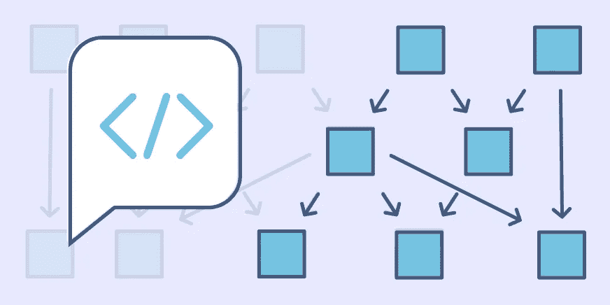
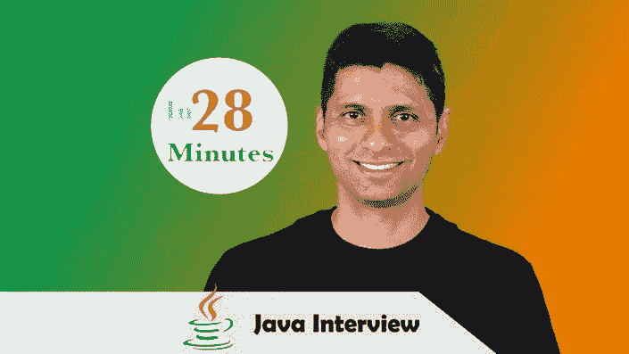
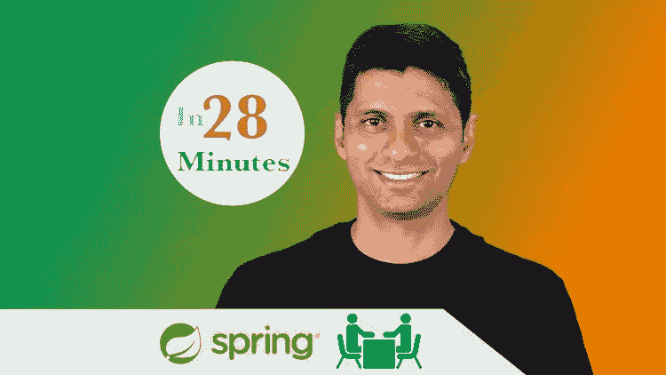

# 2023 年初学者和有经验者的 10 个最佳 Java 面试准备课程

> 原文：<https://medium.com/javarevisited/10-best-online-courses-to-crack-java-developer-interviews-6eb86fab44e4?source=collection_archive---------0----------------------->

## 我最喜欢的准备 2023 年 java 开发者面试的在线课程来自 Udemy、Pluralsight、CodeCademy 准备 Java 面试的所有必备话题。

image_credit —教育性

大家好，如果你正在准备 Java 开发人员的面试，比如 JP 摩根、摩根士丹利等大型投资银行的核心 Java 开发人员+ Spring Boot 开发人员，或者 Infosys、TCS、LuxSoft、Tech Mahindra、IBM 和 Cognizant 等服务型公司的 Java web 开发人员，并且正在寻找一些很棒的课程和材料，那么你来对地方了。

早些时候，我已经分享了 [**最佳编码面试课程**](https://javarevisited.blogspot.com/2018/02/10-courses-to-prepare-for-programming-job-interviews.html) 和 [**编码面试准备书籍**](/javarevisited/5-coding-interview-books-to-prepare-for-programming-job-interviews-d8f63348afaf) ，它们侧重于基本的编码面试技能，如数据结构和算法、SQL、Linux 等，在本文中，我分享了为 2023 年 Java 开发人员面试做准备的最佳课程。

尽管这些对于准备任何[编码面试](/javarevisited/20-array-coding-problems-and-questions-from-programming-interviews-869b475b9121)仍然是非常好的，包括 Java 开发人员角色，你可以用它们来构建你的编程基础。

在这篇文章中，我将分享一些来自 Udemy、Educative、Pluralsight 和 CodeCademy 的最佳在线课程，您可以参加这些课程来准备关键主题，如[核心 Java](https://javarevisited.blogspot.com/2018/05/top-5-java-courses-for-beginners-to-learn-online.html) 、[多线程](https://javarevisited.blogspot.com/2018/06/top-5-java-multithreading-and-concurrency-courses-experienced-programmers.html)、[并发](https://javarevisited.blogspot.com/2016/06/5-books-to-learn-concurrent-programming-multithreading-java.html)、[算法](https://www.java67.com/2019/02/top-10-free-algorithms-and-data.html)、[数据结构](https://javarevisited.blogspot.com/2018/01/top-5-free-data-structure-and-algorithm-courses-java--c-programmers.html)、[系统设计](https://www.java67.com/2018/05/top-20-system-design-interview-questions-answers-programming.html)、[设计模式](https://javarevisited.blogspot.com/2018/02/top-5-java-design-pattern-courses-for-developers.html)和[软件架构](https://javarevisited.blogspot.com/2019/03/5-courses-programmers-can-join-to-learn.html)。

这些是一些高级课程，通过分享有用的问题和教你回答这些问题的技巧来关注工作面试。我还计划添加更多关于[软件架构](/javarevisited/5-best-software-architecture-books-for-experienced-java-developers-1267d05a6b1d)和设计[微服务](/javarevisited/10-best-java-microservices-courses-with-spring-boot-and-spring-cloud-6d04556bdfed)的课程，所以请将这篇文章加入书签，或者回复您希望包含的主题，当我们更新这篇文章时，您会收到通知。

# 2023 年破解 Java 面试的 10+最佳在线课程

为了不浪费你更多的时间，这里是我列出的 10 门在线课程，可以帮助你通过 Java 编程面试。我的课程涵盖了基本的编码技能，如数据结构和算法、问题解决、核心 Java、并发性、设计模式和软件设计、面向对象编程、SQL 和 Spring Boot 的 Spring 框架。

## 1.[寻找编码面试:编码问题的模式](https://www.educative.io/collection/5668639101419520/5671464854355968?affiliate_id=5073518643380224)

要想通过任何编程工作面试，最重要的一点是你能够将你所学到的知识应用到一个完全未知的问题中。

这是非常重要的，因为有时你会面临你从未听说过的问题，你需要马上解决它们。这门课程帮助你在头脑中建立这些模式。它将教你一些最有用的技术，你可以用这些技术来解决编码问题，并把它们分解成一个已知的模式。

例如，您可以使用 Stack 将递归解决方案转换为迭代解决方案。你可以把一个数除以 10，去掉最后一个数字，取余数，得到最后一个数字。类似地，堆栈对于解析等非常有用。

**这里是加入这个令人敬畏的课程的链接**——[探索编码面试:编码问题的模式](https://www.educative.io/collection/5668639101419520/5671464854355968?affiliate_id=5073518643380224)

## 2. [Java 面试指南:200+面试问答](https://click.linksynergy.com/deeplink?id=JVFxdTr9V80&mid=39197&murl=https%3A%2F%2Fwww.udemy.com%2Fcourse%2Fjava-interview-questions-and-answers%2F)

这是一个一站式商店，提供你在公司中可能遇到的各种传统的 Java 面试问题。它涵盖了从电话会谈到面对面会谈的 java 问题，并涵盖了所有基本的 Java 面试主题，如 Java 集合、泛型、Java 并发性、核心 Java 等。

许多人非常努力地准备一般主题，如数据结构和算法，以及系统设计，但忘记准备核心 Java 和 OOP 概念，如重载和覆盖，这使他们失去了面试的机会，通过使用本课程，你可以轻松地涵盖这些部分。

如果你只需要为你的 Java 面试准备购买一门课程，那么你应该购买这门课程。它也很实惠，你可以在 Udemy 上花 10 美元买到这门课程。

**这里是加入本课程的链接** — [Java 面试指南:200+面试问题](https://click.linksynergy.com/deeplink?id=JVFxdTr9V80&mid=39197&murl=https%3A%2F%2Fwww.udemy.com%2Fcourse%2Fjava-interview-questions-and-answers%2F)

## 3.[探寻面向对象设计面试](https://www.educative.io/collection/5668639101419520/5692201761767424?affiliate_id=5073518643380224)

Java 面试的另一个重要话题是面向对象的分析和设计。你要么被要求设计一个自动售货机或咖啡机，并需要在 2 小时左右的时间内完成单元测试，要么你将参与口头讨论。

如果你从未做过任何[面向对象分析与设计](/javarevisited/7-best-online-courses-to-learn-object-oriented-design-pattern-in-java-749b6399af59)，那么这是一门很棒的课程，不仅仅是为了准备面试，也是为了学习真实的例子。

它不仅有一组精心挑选的案例研究，这些案例在亚马逊、谷歌和脸书等顶级科技公司被反复询问，而且还提供了处理不同面向对象设计的全面体验

**这是加入本课程** — [探索面向对象设计面试](https://www.educative.io/collection/5668639101419520/5692201761767424?affiliate_id=5073518643380224)的链接

## 4.[钻研系统设计面试](https://www.educative.io/collection/5668639101419520/5649050225344512?affiliate_id=5073518643380224)

系统设计与面向对象的设计和分析密切相关，但是关注于组件和层级别的大图，而不是类级别。为了解决系统设计问题，比如设计一个像亚马逊这样的网站，或者设计一个处理数百万订单的复杂系统。为了解决这些问题，你需要知道很多东西，从缓存到数据库交互，从扩展到负载平衡，以及分布式系统如何工作。

如果你以前从未做过，不要担心，这是 Java 面试的[最佳系统设计课程之一](/javarevisited/10-best-system-design-courses-for-coding-interviews-949fd029ce65)，它将带你解决一些来自亚马逊、苹果、脸书、微软、谷歌、IBM 等公司的常见系统设计问题。给你足够的知识和技能来解决面试中的系统设计问题。

**这里是加入本课程的链接** — [进行系统设计面试](https://www.educative.io/collection/5668639101419520/5649050225344512?affiliate_id=5073518643380224)

## 5. [Java 多线程高级工程面试](https://www.educative.io/courses/java-multithreading-for-senior-engineering-interviews?affiliate_id=5073518643380224)

Java 中的并发性是高级工程师面试中提出的最复杂和高级的话题之一。并发和多线程的知识可以让受访者处于相当大的优势。本课程奠定了高级并发和多线程的基础，并深入解释了监视器和延迟回调等概念。这也是一项可以让你与众不同的技能，而且这门课程对于培养必要的并发技能非常有用。

您将从编程面试中练习一些常见的并发问题，并学习一些关键技术和概念，如锁存、屏障、同步、竞争条件等。

**这里是加入本课程的链接** — [高级工程面试 Java 多线程](https://www.educative.io/courses/java-multithreading-for-senior-engineering-interviews?affiliate_id=5073518643380224)

顺便说一句，以上四门课程都来自教育平台。您可以选择购买这些课程，也可以选择购买 [**教育订阅**](https://www.educative.io/subscription?affiliate_id=5073518643380224) ，每月花费约**$ 14.99(45%折扣)**，并让您访问他们的 100 多门软件开发和编码课程。

我更喜欢订阅，因为有时你只需要这种灵活性，你可以随时加入课程，而不必去购买它

 [## 教育无限:保持领先

### 我们听到了您的反馈。你现在只需支付一次费用，就可以获得 Educative 上的所有课程。

www.educative.io](https://www.educative.io/subscription?affiliate_id=5073518643380224) 

## 7. [200+ SQL 面试问题](https://click.linksynergy.com/deeplink?id=JVFxdTr9V80&mid=39197&murl=https%3A%2F%2Fwww.udemy.com%2Fcourse%2Fsql-interview-questions%2F)

SQL 是 Java 面试中另一个很常见的话题。良好的 SQL 和数据库概念知识，如规范化和查询优化，对获得工作和从事复杂项目大有帮助。

本课程提供了 200 多个真实世界的 SQL 问题和实用答案，非常适合为 SQL 开发人员面试做准备。你不仅可以用它们来检查你现有的知识，还可以找到你的强项和弱项并加以改进。

**以下是加入本课程的链接** — [200+ SQL 面试问题](https://click.linksynergy.com/deeplink?id=JVFxdTr9V80&mid=39197&murl=https%3A%2F%2Fwww.udemy.com%2Fcourse%2Fsql-interview-questions%2F)

顺便说一句，如果你是 SQL 和数据库的新手，那么你也可以看看这些[最佳 SQL 课程](/hackernoon/top-5-sql-and-database-courses-to-learn-online-48424533ac61)来构建和修改一些 SQL 和数据库基础知识。

## 9.[探索编码面试的动态编程模式](https://www.educative.io/collection/5668639101419520/5633779737559040?affiliate_id=5073518643380224)

您可能知道动态编程(DP)问题可能是编码面试中最令人生畏的问题。即使实际上很清楚一个问题是否可以使用 DP 来解决(这种情况很少发生)，甚至知道从哪里开始解决也是相当具有挑战性的。除非你接受了解决 DP 问题的方法培训。

这个课程就是为了这个目标而从头开始的。它将为您提供一套易于理解的技术来处理任何 DP 问题。是编码面试[最佳动态编程课程](/javarevisited/6-best-dynamic-programming-courses-for-coding-interviews-14744060923c)之一。

不仅仅是让你试着记忆解决方案，你将会经历五种潜在的 DP 模式，然后应用它们来解决 35 个以上的 DP 问题。

**这里是加入本课程的链接** — [探索编码面试的动态编程模式](https://www.educative.io/collection/5668639101419520/5633779737559040?affiliate_id=5073518643380224)

而且，如果你发现教育平台和他们的搜索课程，像[搜索系统设计面试](https://www.educative.io/collection/5668639101419520/5649050225344512?affiliate_id=5073518643380224)，[搜索面向对象编程面试](https://www.educative.io/collection/5668639101419520/5692201761767424?affiliate_id=5073518643380224)，那么考虑获得 [**教育订阅**](https://www.educative.io/subscription?affiliate_id=5073518643380224) ，只需 *$14.99 每月*就可以访问他们的 100 多门课程。非常划算，非常适合准备编码面试。

 [## 教育无限:保持领先

### 我们听到了您的反馈。你现在只需支付一次费用，就可以获得 Educative 上的所有课程。

www.educative.io](https://www.educative.io/subscription?affiliate_id=5073518643380224) 

## 8.[数据结构与算法分析—面试](https://click.linksynergy.com/deeplink?id=JVFxdTr9V80&mid=39197&murl=https%3A%2F%2Fwww.udemy.com%2Fcourse%2Fdata-structure-and-algorithms-analysis%2F)

除了 SQL，数据结构和算法是面试中非常常见的另外两个技能。事实上，这些问题非常重要，如果你不仔细考虑，你将无法通过大多数面试的电话环节。

这门课程可以用来在 Java 面试前提高你的数据结构和算法技能，事实上，它不仅对 Java 面试有用，对任何开发人员面试都有用，因为数据结构和算法是一个常见的话题。

这里是参加本课程的链接。[数据结构和算法分析](https://click.linksynergy.com/deeplink?id=JVFxdTr9V80&mid=39197&murl=https%3A%2F%2Fwww.udemy.com%2Fcourse%2Fdata-structure-and-algorithms-analysis%2F)

## 9.[Java 中的设计模式](https://click.linksynergy.com/deeplink?id=JVFxdTr9V80&mid=39197&murl=https%3A%2F%2Fwww.udemy.com%2Fcourse%2Fdesign-patterns-java%2F)

设计模式就像并发一样，是 Java 开发人员的一项基本技能。人们期望高级开发人员了解所有面向对象的模式，并理解何时在代码中使用它们。

如果你不了解设计模式或 GOF 设计模式，那么本课程将帮助你发现设计模式在 Java 中的现代实现，这是高级 Java 开发人员的必修课。

**这里是加入本课程**—[Java 设计模式](https://click.linksynergy.com/deeplink?id=JVFxdTr9V80&mid=39197&murl=https%3A%2F%2Fwww.udemy.com%2Fcourse%2Fdesign-patterns-java%2F)的链接

## 10.[通过 Java 技术面试](https://www.pntra.com/t/TUJGR0lLR0JHRklJSkhCR0ZISk1N?url=https%3A%2F%2Fwww.codecademy.com%2Flearn%2Fpaths%2Fpass-the-technical-interview-with-java)【代码学院】

CodeCademy 在准备 Java 面试方面有完整的技能路径。这一个不是很全面，但是你将有机会准备基本的主题，像散列表，和其他基本的数据结构和搜索排序算法。

以下是您将在本课程中学到的内容:

1.  数据结构入门
2.  线性数据结构(数组、链表、队列等)
3.  散列表
4.  算法概念
5.  非线性数据结构(二叉树、二分搜索法树和堆)
6.  排序算法
7.  图形数据结构

除了获得数据结构、算法的概述，并开始构建您的第一个数据结构！您还将在他们的交互平台中练习常见的 Java 编码问题。

**这里是参加本课程的链接**——[通过 Java 技术面试](https://www.pntra.com/t/TUJGR0lLR0JHRklJSkhCR0ZISk1N?url=https%3A%2F%2Fwww.codecademy.com%2Flearn%2Fpaths%2Fpass-the-technical-interview-with-java)

顺便说一句，你需要一个 [**CodeCademy PRO**](https://bit.ly/codecademypro) 才能加入这个课程。它的年费大约是每月 15.99 美元，提供所有 Codecademy 的内容、课程、测验和项目。你可以用这个来赚取、练习&
应用工作技能。

 [## 学习编码最简单的方法:PRO | Codecademy

### 您学习编码所需的一切都由我们内部的专家团队设计。这意味着我们所有的独家…

bit.ly](https://bit.ly/codecademypro) 

## 11.[春天和 Spring Boot 采访指南](https://click.linksynergy.com/deeplink?id=JVFxdTr9V80&mid=39197&murl=https%3A%2F%2Fwww.udemy.com%2Fcourse%2Fspring-interview-questions-and-answers%2F)

对于 Java 开发者来说，Spring 和 Spring Boot 可能是最重要的框架。面试官希望你知道如何做春天和 Spring Boot 项目，这就是为什么在这个话题上总会有一些问题。

这是一个为春季面试问题做准备的好课程，因为你将学习回答 200 个关于春季、Spring Boot 和春季 MVC 的面试问题

**这里是加入本课程的链接**——[春季与 Spring Boot 面试指南](https://click.linksynergy.com/deeplink?id=JVFxdTr9V80&mid=39197&murl=https%3A%2F%2Fwww.udemy.com%2Fcourse%2Fspring-interview-questions-and-answers%2F)

以上是关于如何通过下一次 Java 面试的一些最好的课程。这些课程涵盖了任何编程工作面试的一些最重要的主题，对于希望进入高盛、摩根等大型投资银行的核心 Java 开发人员以及在 Infosys、TCS、Wipro、Cognizant、Tech Mahindra 等服务型公司工作的 Java web 开发人员都很有用。

其他 **Java 面试资源**给你

*   如何准备 2023 年 Java 编程面试([指南](https://javarevisited.blogspot.com/2017/01/how-to-prepare-for-java-interviews.html))
*   过去 5 年的 133 个 Java 面试问题([列表](https://javarevisited.blogspot.sg/2015/10/133-java-interview-questions-answers-from-last-5-years.html))
*   15 数据结构与算法面试题([列表](http://javarevisited.blogspot.com/2013/03/top-15-data-structures-algorithm-interview-questions-answers-java-programming.html))
*   10 个春季框架面试问题([列表](http://javarevisited.blogspot.com/2011/09/spring-interview-questions-answers-j2ee.html)
*   深入学习 Spring 框架的 6 门课程(课程)
*   20 Hibernate 框架面试问题及答案([列表](http://java67.blogspot.com/2016/02/top-20-hibernate-interview-questions.html))
*   50 个 Java 并发面试问题([列表](http://javarevisited.blogspot.com/2014/07/top-50-java-multithreading-interview-questions-answers.html))
*   为编码面试做准备的 10 门课程([课程](https://javarevisited.blogspot.com/2018/02/10-courses-to-prepare-for-programming-job-interviews.html#axzz5oeVu3CYQ))
*   25 Java 集合面试问题([列表](http://javarevisited.blogspot.com/2011/11/collection-interview-questions-answers.html))
*   面向 Java 开发人员的 10 个 RESTful Web 服务面试问题([列表](http://www.java67.com/2015/09/top-10-restful-web-service-interview-questions-answers.html))
*   10 数据结构与算法课程面试([课程](https://hackernoon.com/10-data-structure-algorithms-and-programming-courses-to-crack-any-coding-interview-e1c50b30b927))
*   50+数据结构和算法题([题](https://hackernoon.com/50-data-structure-and-algorithms-interview-questions-for-programmers-b4b1ac61f5b0))
*   Java 开发人员的 20 个春季 MVC 面试问题([问题](https://javarevisited.blogspot.com/2018/11/top-20-spring-mvc-interview-questions-answers-for-java-developers.html#axzz5aKI6DjLZ))
*   20 春假面试问题([题](https://javarevisited.blogspot.com/2018/02/top-20-spring-rest-interview-questions-answers-java.html#axzz57Kv4wGXe))
*   20+ Spring Boot 面试问题与答案([问题](https://javarevisited.blogspot.com/2020/05/top-20-spring-boot-interview-questions-answers.html))
*   编码面试的 10 门最佳系统设计课程([最佳课程](/javarevisited/10-best-system-design-courses-for-coding-interviews-949fd029ce65)

感谢您阅读本文。如果你发现这些*最佳在线课程对你的面试准备*有用，那么请与你的朋友和同事分享。如果您有任何问题或反馈，请留言。

**附言**——如果你喜欢书，那么你也可以看看我的书， [**搜索 Java 访谈**](https://gumroad.com/l/QqjGH) 和 [**搜索 Spring Boot 访谈**](https://www.amazon.com/dp/B08V1NN4LW/?tag=javamysqlanta-20) ，你可以在 Gumroad 上花 29.90 美元一起买，或者在亚马逊 Kindle 上花 9.9 美元一起买。

 [## 苦读 Spring Boot 的采访

### Spring Boot 访谈- Kindle 版。下载一次，然后在你的 Kindle 设备上阅读…

www.amazon.com](https://www.amazon.com/dp/B08V1NN4LW/?tag=javamysqlanta-20)