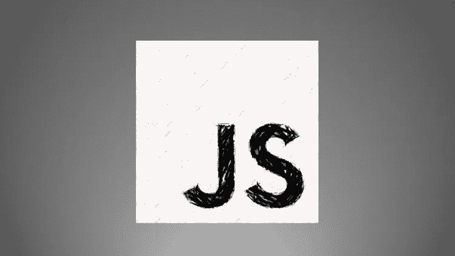
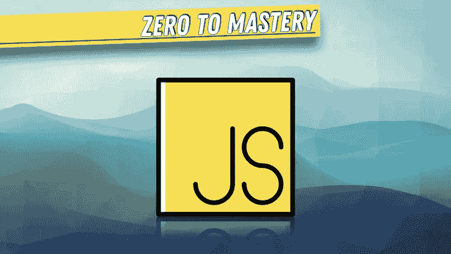
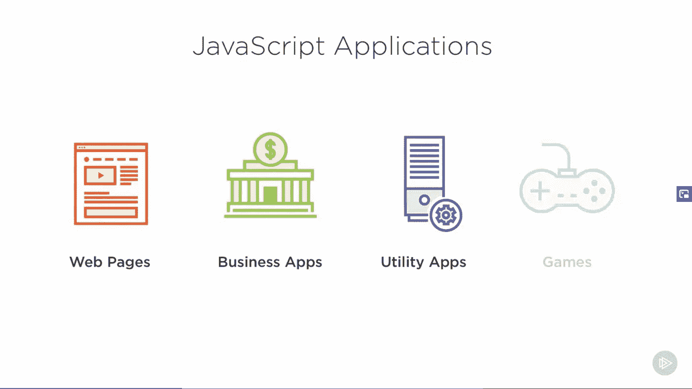
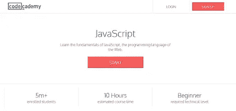

# 2023 年初学者学习的 14 门最佳 JavaScript 在线课程

> 原文：<https://medium.com/javarevisited/10-best-online-courses-to-learn-javascript-in-2020-af5ed0801645?source=collection_archive---------0----------------------->

## 对于初学者和有经验的 web 开发人员来说，最好的 JavaScript 在线课程值得你花费时间。此外，包括免费课程。

大家好，如果你想学习 JavaScript 并寻找书籍、在线课程、教程、培训班、平台等最佳资源，那么你来对地方了。

之前，我已经分享了 [**学习 JavaScript 的最佳平台**](/javarevisited/my-favorite-free-tutorials-and-courses-to-learn-javascript-8f4d0a71faf2) 和 [**适合初学者的最佳 JavaScript 书籍**](/javarevisited/5-best-javascript-books-for-beginners-and-experienced-web-developers-2c6353d1cc85) 在这篇文章中，我将分享 2023 年学习 JavaScript 的最佳在线课程。

毫无疑问，JavaScript 是目前最受欢迎的编程语言，StackOverFlow 的调查也证实了这一点。您可以在 [JavaScript](http://www.java67.com/2018/04/top-5-free-javascript-courses-to-learn.html) 中构建静态网站、web 应用程序、原生移动应用程序(是的，您也可以这么做)、桌面应用程序，甚至服务器端应用程序。

这也会让你成为一个百倍的雇主，因为那里有大量的网络开发工作。正因为如此，越来越多的开发人员开始学习 JavaScript，成为网络开发人员。

学习 JavaScript 的另一个原因是它支持一些最流行和强大的 web 开发框架，如 [Angular](http://www.java67.com/2018/01/top-5-free-angular-js-online-courses-for-web-developers.html) 、 [React](http://www.java67.com/2018/02/5-free-react-courses-for-web-developers.html) 、 [Node JS](http://javarevisited.blogspot.sg/2018/01/top-5-nodejs-and-express-js-online-courses-for-web-developers.html) 和 [jQuery](http://www.java67.com/2018/04/top-5-free-jquery-courses-for-web-developers.html) 。要使用这些工具和框架，需要具备良好的 JavaScript 知识。这样你就能明白下面发生了什么。现在我们知道了 JavaScript 是多么重要，为什么你应该学习它，让我分享一些最好的在线课程，你可以开始你的 JavaScript 之旅，并最终成为它的主人。

我是一个书迷，在过去，我甚至分享了一些我最喜欢的 JavaScript 书籍<http://javarevisited.blogspot.sg/2017/02/top-5-javascript-books-to-learn-best-of-lot-must-read.html>*，但在过去的几年里，我发现在线培训课程最适合学习新技术或编程语言。

主要原因是主动学习，尽管从书本中学习的热情仍然很高，有时你可能会在尝试做事时感到无聊和停滞不前，但通过在线课程，你可以看到它到底是如何完成的。我还发现，与流行书籍的作者相比，导师也更容易接近，这也是我建议开发人员先从课程开始，然后阅读书籍以获得更全面知识的另一个原因。*

# *2023 年供初学者在线学习的 14 门 JavaScript 课程*

*如果你决定在 2023 年学习 JavaScript，那么这里是我列出的 10 门课程，包括免费和付费课程(不太贵)，开始你进入 JavaScript 和 Web 开发美丽世界的旅程。*

## *1 [**。完整的 JavaScript 课程 2023:构建真实项目**](https://click.linksynergy.com/fs-bin/click?id=JVFxdTr9V80&subid=0&offerid=323058.1&type=10&tmpid=14538&RD_PARM1=https%3A%2F%2Fwww.udemy.com%2Fthe-complete-javascript-course%2F) **(Udemy)***

*这是我个人最喜欢的，也可能是 Udemy 上最好的 JavaScript 课程。我参加过许多 Udemy 的 JavaScript 课程，但我可以说这是学习 JavaScript 的最好的、完全的基于项目的实践课程。本课程也非常全面，涵盖了现代 JavaScript 语法。*

*它还包括项目、挑战、期末考试、ES6 和一位令人敬畏的讲师，这使它成为刚刚开始使用 JavaScript 的初学者和之前使用过 JavaScript 的中级开发人员的理想课程。*

*超过 300，000 名学生参加了该课程，近 77，000 名参与者对该课程的平均评分为 4.6 分，这是非常了不起的，充分说明了该课程的质量。

*导师——乔纳斯·施梅特曼**

***这里是加入本课程的链接**—[2023 年完整 JavaScript 课程:构建真实项目](https://click.linksynergy.com/fs-bin/click?id=JVFxdTr9V80&subid=0&offerid=323058.1&type=10&tmpid=14538&RD_PARM1=https%3A%2F%2Fwww.udemy.com%2Fthe-complete-javascript-course%2F)*

**

## *2.[JavaScript—2023 年完全指南(初级+高级)](https://click.linksynergy.com/deeplink?id=JVFxdTr9V80&mid=39197&murl=https%3A%2F%2Fwww.udemy.com%2Fcourse%2Fjavascript-the-complete-guide-2020-beginner-advanced%2F)*

*这是在 Udemy 上学习 JavaScript 的又一门综合课程。这个课程是由我最喜欢的 Udemy 导师 Maximilian Schwarzmuller 创建的，他也是《React 完整指南》和《角度指南》课程的作者，这两个课程是对 web 开发人员最有用的资源。*

*该课程也是 2023 年学习 JavaScript 的最新课程，也是 Udemy 上评分最高的课程之一，来自近 7K 参与者的平均评分为 4.6。

**导师** —马克西米连·施瓦茨米勒*

***这里是加入本课程的链接**——[2023 年完整 JavaScript 课程:构建真实项目](https://click.linksynergy.com/fs-bin/click?id=JVFxdTr9V80&subid=0&offerid=323058.1&type=10&tmpid=14538&RD_PARM1=https%3A%2F%2Fwww.udemy.com%2Fthe-complete-javascript-course%2F)*

**

## *3.[现代 JavaScript: ES6 基础(指导项目— Coursera)](https://coursera.pxf.io/c/3294490/1164545/14726?u=https%3A%2F%2Fwww.coursera.org%2Fprojects%2Fmodern-javascript-es6-basics)*

*你可能知道 Coursera 刚刚推出了指导性项目，你可以在 2 到 3 个小时的短时间内学习 JavaScript 等新技能。虽然这些指导性项目不像列表中提到的课程那么全面，但它们为初学者提供了一个很好的起步平台。*

*通过跟随一个指导项目，你可以很快学会 JavaScript 的基础知识。例如，在这个项目中，您将学习最基本的 ES6 特性，并通过实际动手的例子来实践它们。*

*你将开始编写现代 JavaScript，并真正理解我们为什么需要 ES6。掌握现代 JavaScript 始于理解 ES6 主要特性背后的推理——箭头函数、变量、模板文字。这样做会帮助你理解[节点](/javarevisited/top-10-online-courses-to-learn-node-js-in-depth-8ef0e31ca139)、[反应](/@javinpaul/top-5-courses-to-learn-react-js-in-2019-best-of-lot-fa02cd96cdf0)和[角度](/javarevisited/10-courses-to-learn-angular-for-web-development-6da1bd2856dc)背后的概念。*

*在引导式项目中，您在浏览器中的云桌面上工作，不需要下载，您的讲师会在分屏视频中一步一步地指导您。你将享受到亲身实践的学习体验。*

*讲师——stani Mira vla EVA*

***这里是加入本课程的链接**——[现代 JavaScript: ES6 基础](https://coursera.pxf.io/c/3294490/1164545/14726?u=https%3A%2F%2Fwww.coursera.org%2Fprojects%2Fmodern-javascript-es6-basics)*

**

*除了这个约翰霍普金斯大学的 [**HTML、CSS 和 JavaScript for Web Developers**](https://coursera.pxf.io/c/3294490/1164545/14726?u=https%3A%2F%2Fwww.coursera.org%2Flearn%2Fhtml-css-javascript-for-web-developers)课程和加州大学戴维斯分校的 [**JavaScript for 初学者专业化**](https://coursera.pxf.io/c/3294490/1164545/14726?u=https%3A%2F%2Fwww.coursera.org%2Fspecializations%2Fjavascript-beginner) 课程，Coursera 上还有两个值得一看的 JavaScript 课程。*

*如果你发现 Coursera 的课程很有用，因为它们是由知名公司如**谷歌**、 **IBM** 、**亚马逊**和世界上最好的大学创建的，我建议你加入 Coursera 的年度订阅计划 [**Coursera Plus**](https://click.linksynergy.com/deeplink?id=JVFxdTr9V80&mid=40328&murl=https%3A%2F%2Fwww.coursera.org%2Fcourseraplus) 。*

*<https://coursera.pxf.io/c/3294490/1164545/14726?u=https%3A%2F%2Fwww.coursera.org%2Fcourseraplus>  

这种单次订阅可以让你无限制地访问他们最受欢迎的**课程**、**专业化**、**专业证书**和**指导项目**。它每年花费大约 399 美元，但是它完全物有所值，因为你可以获得无限的证书。* 

## *4.现代 JavaScript 完全指南(教育性)*

*这是另一门我非常喜欢的 JavaScript 课程，它与列表中的其他课程有些不同，因为它是 Educative 的一门基于文本的交互式在线课程。*

*在本课程中，您将边做边学，并且可以直接从浏览器中执行 JavaScript 代码，无需任何设置，这使得学习变得非常简单和快速。*

*这也是最详细的 JavaScript 课程之一，无论你是一个完全的初学者还是对 JavaScript 有所了解，这门课程都将指导你从语言的基础到去年引入的所有新特性。*

*在课程结束时，你将能够理解和使用 JavaScript 在过去 5 年中的所有新增内容。*

*讲师——阿尔贝托·蒙塔莱斯*

***这里是加入本课程的链接** — [现代 JavaScript 完全指南](https://www.educative.io/courses/complete-guide-to-modern-javascript?affiliate_id=5073518643380224)*

**

## *[**5。JavaScript:理解怪异的部分**](https://click.linksynergy.com/fs-bin/click?id=JVFxdTr9V80&subid=0&offerid=323058.1&type=10&tmpid=14538&RD_PARM1=https%3A%2F%2Fwww.udemy.com%2Funderstand-javascript%2F) **(Udemy)***

*这是为已经了解 JavaScript 的人开设的另一门高级 JavaScript 课程。在本课程中，你将学习范围、闭包、原型、“这个”以及如何构建自己的框架等等。*

*您不仅将学习 JavaScript 如何工作及其基本概念，还将学习如何编写可靠、优秀的 JavaScript 代码。本课程还涉及高级 JavaScript 概念，如闭包、原型继承、IIFEs 等等。*

*导师 —安东尼·阿里西亚*

***这里是加入本课程的链接**——[JavaScript:理解奇怪的部分](https://click.linksynergy.com/fs-bin/click?id=JVFxdTr9V80&subid=0&offerid=323058.1&type=10&tmpid=14538&RD_PARM1=https%3A%2F%2Fwww.udemy.com%2Funderstand-javascript%2F)*

**

## *6.[JavaScript:ZTM 学院的先进理念](https://academy.zerotomastery.io/a/aff_szrvh5nm/external?affcode=441520_zytgk2dn)*

*这是一门面向 JavaScript 和 Web 开发人员的高级课程，旨在教您高级 JavaScript 实践，并成为前 10%的 JavaScript 开发人员*

*该课程由 Andrei Negaoie 创建，他是另一位优秀的 Udemy 讲师，也是《2023 年完全的 web 开发人员:零到精通课程的作者，该书受到了成千上万 Web 开发人员的信任。*

*这门高级 JavaScript 课程的平均评分为 4.8，超过 3 万名学生参加了这门课程，这使得它成为 Udemy 上评分最高的高级 JavaScript 课程。*

*他还写了一个关于 Deno 的课程，Deno 是一个基于类型脚本的运行时和 Node 的替代品，由 Node 的创建者自己创建。可以看他的课程[**Deno:完全指南零到精通**](https://click.linksynergy.com/deeplink?id=JVFxdTr9V80&mid=39197&murl=https%3A%2F%2Fwww.udemy.com%2Fcourse%2Fdeno-the-complete-guide-zero-to-mastery%2F) 了解更多。*

*讲师——Andrei Neagoie*

***这里是加入本课程的链接** — [JavaScript:高级概念](https://academy.zerotomastery.io/a/aff_szrvh5nm/external?affcode=441520_zytgk2dn)*

**

*顺便说一句，Andrei Neagoie 还推出了自己的在线门户网站，<https://academy.zerotomastery.io?affcode=441520_zytgk2dn&product_id=FRIENDS10>**【ZTM 学院】，在这里你只需订阅一次就可以获得他的所有 Python、JavaScript、Deno 和其他技术课程。他们还为 Javarevisited 的读者提供 24%的折扣，点击[这里](https://academy.zerotomastery.io/p/academy?affcode=441520_zytgk2dn)享受折扣。***

***<https://academy.zerotomastery.io/p/academy?affcode=441520_zytgk2dn> *** 

## ***7. [JavaScript:入门](https://pluralsight.pxf.io/c/1193463/424552/7490?u=https%3A%2F%2Fwww.pluralsight.com%2Fcourses%2Fjavascript-getting-started) (Pluralsight)***

***如果你是 Pluralsight 的会员，并且正在寻找一个关于 Pluralsight 的很棒的 JAvaScript 课程，那么你应该看看这个由 Mark Zamoyta 编写的 JavaScript:入门课程。***

***以下是您将在本课程中学到的关键技能:***

*   ***可以用 JavaScript 构建的应用程序类型，以及它们运行的平台。***
*   ***接下来，您将从大量 JavaScript 示例中学习这门语言的基础知识。***
*   ***最后，您将把您的 JavaScript 知识应用到工作中，并修改一个现代的、响应迅速的 web 页面。***

***完成本课程后，您将掌握使用 JavaScript 创建简单程序、创建简单 web 应用程序和修改网页的技能和知识！

教官——马克·扎莫伊塔***

*****这里是加入本课程的链接** — [JavaScript:入门](https://pluralsight.pxf.io/c/1193463/424552/7490?u=https%3A%2F%2Fwww.pluralsight.com%2Fcourses%2Fjavascript-getting-started)***

******

***顺便说一句，你需要一个 [Pluralsight 会员](https://pluralsight.pxf.io/c/1193463/424552/7490?u=https%3A%2F%2Fwww.pluralsight.com%2Fpricing)才能进入这个课程，费用大约是每月 29 美元或每年 299 美元(14%的折扣)。***

***如果你没有 Pluralsight 会员资格，我鼓励你申请一个，因为它可以让你访问他们 7000 多门关于所有最新主题的在线课程，如前端和后端开发、JavaScript、Angular、React、Node.js 等。***

***或者，您也可以使用他们的 [**10 天免费试用**](https://pluralsight.pxf.io/c/1193463/424552/7490?u=https%3A%2F%2Fwww.pluralsight.com%2Flearn) 免费访问本课程。***

***<https://pluralsight.pxf.io/c/1193463/424552/7490?u=https%3A%2F%2Fwww.pluralsight.com%2Flearn?source=---------10----------------------------> *** 

## ***[8。Javascript30 —免费](https://javascript30.com/)***

***为期 30 天的免费普通 js 编码挑战。用 30 个教程在 30 天内学会建造 30 件东西。没有框架，没有编译器，没有库，没有样板文件。***

***如果你喜欢基于时间的学习，这也是最值得推荐的课程之一，非常有用。虽然 JavaScript 非常庞大，但本课程提供了一个很好的结构，让你以自己的速度及时地学习 JavaScript。

讲师— [韦斯·博斯](https://medium.com/u/86a55cd7983b?source=post_page-----af5ed0801645--------------------------------)***

***<https://javascript30.com/> *** 

## ***9.[学习 JavaScript——初学者全教程](https://www.youtube.com/watch?v=PkZNo7MFNFg) (YouTube)***

***如果你想在 2023 年在线学习 JavaScript，并寻找免费的在线培训课程，那么你会喜欢 freeCodeCamp 的免费 JavaScript 课程。***

***这本完整的 134 部分 JavaScript 初学者教程将教你开始使用 JavaScript 编程语言所需要知道的一切。本教程中的字体很大，非常适合在小屏幕上观看。***

***如果你认为 YouTube 课程不值得你花费时间，以下是本课程的一个评论:***

> ***想想我在一所私立学校花了 5000 美元，花了半年时间学习这个家伙在 3 小时 26 分 42 秒内教给我的东西，真是太疯狂了。YouTube 确实彻底改变了学习。***

***这是一门很棒的课程，你可以在 YouTube 上免费观看，也可以点击以下链接:***

## ***10.[构建 15 个 JavaScript 项目——普通 JavaScript 课程](https://www.youtube.com/watch?v=3PHXvlpOkf4)***

***这是一个 8 小时的大型项目课程，在线学习 JavaScript，最棒的是它是完全免费的。***

***在这个完全免费且非常棒的课程中，您将通过使用不带框架的普通 JavaScript 构建 15 个项目来提高您的 JavaScript 技能。在本教程中，您将逐步了解如何构建 JavaScript 项目。***

***以下是您将在本课程中构建的 15 个项目的列表:***

1.  ***彩色脚蹼***
2.  ***计数器***
3.  ***复习***
4.  ***导航条***
5.  ***侧边栏等***

***这个课程是由 John Smilga 创建的，你可以在 FreeCodecamp Youtube 频道上免费观看。***

## ***11.[通过构建 7 个游戏学习 JavaScript 完整课程](https://www.youtube.com/watch?v=lhNdUVh3qCc)***

***我经常说，构建游戏是学习编程、编码和任何新框架的好方法。所以，如果你想学习 Javascript 并让它变得有趣，那么这个免费的在线课程将会给你一个很好的开始。***

***在本教程中，您将通过编写 7 个复古的基于网格的游戏来学习 JavaScript。边做边学，在课程结束时，你的职业生涯中会有 7 个伟大的项目。每一个游戏都以最少的样式完成，供你自己制作。***

***你可以在 FreeCodecamp 的 Youtube 频道或这里免费观看本课程，链接如下:***

## ***12.[学习 JavaScript](https://bit.ly/learnjavascriptwithcodecademy) (CodeCademy)***

***这可能是最好的免费在线学习 JavaScript 的网站。您将通过在浏览器上编写代码、在线学习 JavaScript，并以互动的方式遵循一步一步的指导。***

***换句话说，这是一个在线学习许多技术的好网站，但可能是在线学习 JavaScript 的最佳网站。

尽管目前 CodeCademy 提供了 [Java](http://javarevisited.blogspot.sg/2015/06/2-websites-to-learn-coding-in-java-online-free.html) 、 [Git](https://javarevisited.blogspot.com/2018/01/5-free-git-courses-for-programmers-to-learn-online.html) 、 [Linux 命令行](https://javarevisited.blogspot.com/2018/02/5-courses-to-learn-shell-scripting-in-linux.html)和其他几门课程，但它因一门交互式 JavaScript 课程而出名，该课程可以让你按照自己的节奏在线学习。你可以通过查看注册学生的数量来衡量这门课程的受欢迎程度，目前注册学生的数量为 500 万，这对于任何在线免费课程来说都是一个非常高的数字。简而言之， [CodeCademy](https://bit.ly/codecademypro) 是在线学习 JavaScript 的最佳网站，你应该利用这一点。***

***这里是免费加入本课程的链接— [学习 JavaScript](https://bit.ly/learnjavascriptwithcodecademy)***

******

## ***13.安德鲁·米德的现代 JavaScript Bootcamp***

***如果你喜欢基于项目的学习，并且正在寻找一个关于 JavaScript 的现代在线课程，那么你应该在 Udemy 上看看这个课程。***

***在本课程中，您将通过构建真实世界的应用程序来学习 JavaScript。包括 3 个真实项目、80 个编程挑战和 ES6/ES7。该课程是由著名的 T[he Complete Node Developer](https://click.linksynergy.com/deeplink?id=JVFxdTr9V80&mid=39197&murl=https%3A%2F%2Fwww.udemy.com%2Fcourse%2Fthe-complete-nodejs-developer-course-2%2F)课程和[Modern graph QL boot camp](https://click.linksynergy.com/deeplink?id=JVFxdTr9V80&mid=39197&murl=https%3A%2F%2Fwww.udemy.com%2Fcourse%2Fgraphql-bootcamp%2F)课程的导师 Andrew Mead 创建的，这两个课程都很棒，说服了我加入这个课程。***

***以下是您将在本课程中学到的主要内容:***

*   ***通过构建三个真实的 web 应用程序来学习 JavaScript***
*   ***理解 JavaScript 如何在幕后工作***
*   ***了解 ES6 和 ES7 的尖端功能***
*   ***了解如何将您的应用程序部署到 web 上，以便您可以与所有人共享它们***
*   ***了解如何通过异步 JavaScript 使用承诺和异步/等待***

***您还将了解如何在出现问题时调试和修复代码，并获得免费的 80 页 PDF 指南，其中包含课堂笔记、代码示例和文档链接

讲师——Andrew Mead***

*****这里是加入这个课程的链接**——[现代 JavaScript 训练营](https://click.linksynergy.com/deeplink?id=JVFxdTr9V80&mid=39197&murl=https%3A%2F%2Fwww.udemy.com%2Fcourse%2Fmodern-javascript%2F)***

******

## ***14.[现代 JavaScript 从头开始](https://click.linksynergy.com/deeplink?id=JVFxdTr9V80&mid=39197&murl=https%3A%2F%2Fwww.udemy.com%2Fcourse%2Fmodern-javascript-from-the-beginning%2F)布拉德·特拉弗斯***

***如果你正在寻找一门现代 JavaScript 课程，在这门课程中，你可以学习和构建纯 JavaScript 项目，而不需要任何框架或库，那么这门课程非常适合你。***

***本课程由 Traversy Media Youtube 频道的 [**Brad Traversy**](https://click.linksynergy.com/deeplink?id=CuIbQrBnhiw&mid=39197&murl=https%3A%2F%2Fwww.udemy.com%2Fuser%2Fbrad-traversy%2F) 和流行 BootStrap 5 From Scratch with 5 Projects 课程的讲师共同打造。***

***以下是您将在本课程中学到的主要内容:***

*   ***模块化学习部分& 10 个纯 JavaScript 的真实项目***
*   ***不用 jQuery 掌握 DOM(文档对象模型)***
*   ***使用 Ajax、Fetch API、Promises & Async / Await 进行异步编程***
*   ***[OOP](/javarevisited/7-best-online-courses-to-learn-object-oriented-design-pattern-in-java-749b6399af59) 包括 ES5 原型& ES2015 类***
*   ***学习 JavaScript 模式***
*   ***正则表达式、错误处理、本地存储等等***

***讲师——布拉德·特拉弗斯***

*****这里是加入本课程的链接**——[现代 JavaScript 从头开始](https://click.linksynergy.com/deeplink?id=JVFxdTr9V80&mid=39197&murl=https%3A%2F%2Fwww.udemy.com%2Fcourse%2Fmodern-javascript-from-the-beginning%2F)***

******

## ***15.[boot . dev 上的 JavaScript 编码基础介绍](https://boot.dev/learn/learn-javascript?via=javin)***

***如果你正在寻找一个互动的 JavaScript 课程，它可以为你提供快速的反馈，还可以从头开始教授 JavaScript，那么这个关于 [*Boot.dev*](https://boot.dev/?via=javin) 的 JavaScript 课程，一个新的在线学习平台值得一看。***

***这个 JavaScript 在线课程由 Lane Wagner 和 Allan Liers 教授，旨在将你从一个零编程知识的人带到一个坚实的基础，这是你成为一个成功的 web 开发人员所需要的。***

***它不仅教你常青的概念，如变量、数组、循环、函数，而且给你所需的工具，让你立刻开始构建真正的应用程序。***

*****这是加入本课程**—[JavaScript 编码基础介绍](https://boot.dev/learn/learn-javascript?via=javin)的链接***

******

***以上就是关于**2023 年学习 JavaScript 的一些最好的课程**。我希望你能找到一门适合你学习风格的课程，并充分利用它——它们都很好，但选择课程的依据是你是否能与老师沟通。所有的课程都是非常好的，如果你和一个老师有联系，那么你会充分利用它们。由于我们大多数人都通过 Angular、React 或 Node 使用 JavaScript，所以我也在列表中包含了其中的一门课程；如果需要更多推荐，可以进一步查看这个免费[角度](http://www.java67.com/2018/01/top-5-free-angular-js-online-courses-for-web-developers.html)、[反应](http://www.java67.com/2018/02/5-free-react-courses-for-web-developers.html)、[节点 JS](http://javarevisited.blogspot.sg/2018/01/top-5-nodejs-and-express-js-online-courses-for-web-developers.html) 课程列表。***

***您可能喜欢的其他 **Web 开发资源**:***

*   ***成为全栈式网络开发人员的 10 门最佳课程***
*   ***[初学者学习棱角的 10 门免费课程](/javarevisited/top-10-free-courses-to-learn-angular-framework-in-2020-bb62148c73d3)***
*   ***[2023 年 React 开发者路线图](https://javarevisited.blogspot.com/2018/10/the-2018-react-developer-roadmap.html)***
*   ***[40 多岁能学编码和 Web 开发吗？](/javarevisited/can-you-learn-programming-and-become-a-web-developer-in-the-40s-and-50s-f9e117f32721)***
*   ***[2023 年学习反应的 10 门免费课程](/javarevisited/top-10-free-courses-to-learn-react-js-c14edbd3b35f)***
*   ***[每个软件工程师都应该学习的 10 件事](/swlh/10-things-every-programmer-should-know-26ba37cfcaf4)***
*   ***[2023 年我最喜欢学的课程 node . js](/javarevisited/top-10-online-courses-to-learn-node-js-in-depth-8ef0e31ca139)***
*   ***[我最喜欢的学习 HTML 和 CSS 的免费课程](/javarevisited/5-free-html-and-css-courses-to-learn-front-end-web-development-online-8b04517c6ecb?source=collection_home---4------0-----------------------)***
*   ***[2023 年学习 TypeScript 的前 7 门课程](/javarevisited/7-best-courses-to-learn-typescript-in-depth-58439e1ce729)***
*   ***[7 门学习网页设计自举的免费课程](/javarevisited/7-free-courses-to-learn-bootstrap-for-web-designers-and-developers-5135215648f1)***
*   ***[我最喜欢的深入学习 Web 开发的课程](/better-programming/my-5-favorite-courses-to-learn-web-development-in-2019-a5e74167f8b2)***

***感谢您阅读本文。如果你喜欢这些 JavaScript 教程和课程，那么请分享给你的朋友和同事。如果您有任何问题或反馈，请留言。***

*****P. S.** —如果你是 JavaScript 世界的新手，渴望学习这一有用的技能，但又在寻找更多免费的选择，比如免费的 JavaScript 课程，那么你也可以在 Udemy 上查看这个 [**JavaScript 基础知识**](https://click.linksynergy.com/deeplink?id=JVFxdTr9V80&mid=39197&murl=https%3A%2F%2Fwww.udemy.com%2Fcourse%2Fjavascript-essentials%2F) 课程。这是完全免费的，你只需要一个免费的 Udemy 帐户就可以参加这个课程。***

***<https://click.linksynergy.com/deeplink?id=JVFxdTr9V80&mid=39197&murl=https%3A%2F%2Fwww.udemy.com%2Fcourse%2Fjavascript-essentials%2F> ***