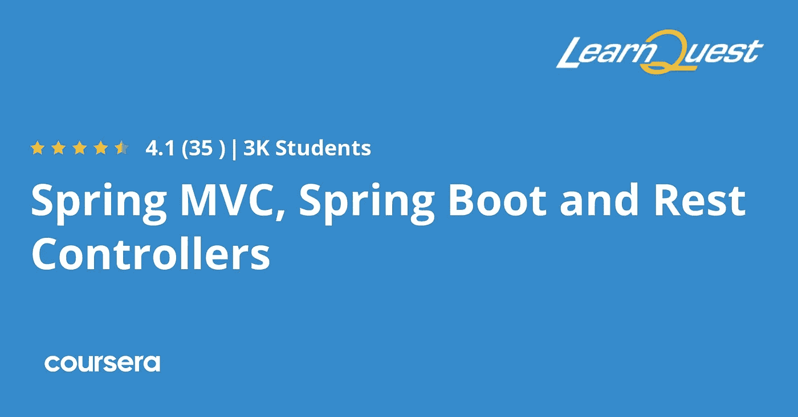
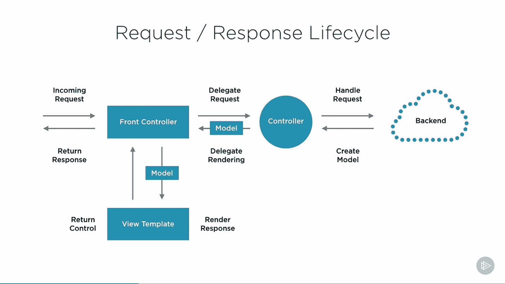
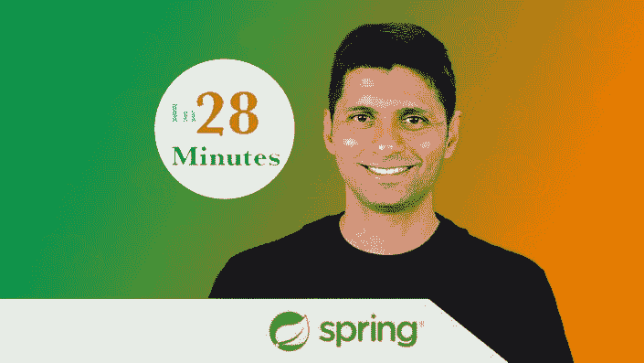
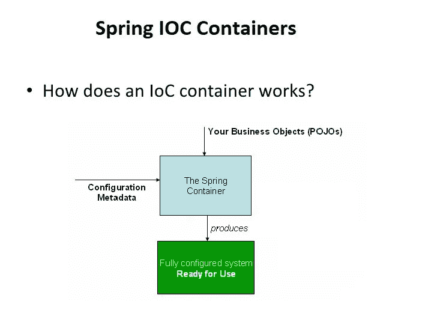

# 2023 年学习 Spring 框架的 10 个最佳在线课程

> 原文：<https://medium.com/javarevisited/10-best-online-courses-to-learn-spring-framework-in-2020-f7f73599c2fd?source=collection_archive---------0----------------------->

## 学习 Spring 框架、Spring Boot、Spring 安全和 RESTful Web 服务的最佳在线课程

Spring Framework 是 Java 开发人员的必备技能，不仅是为了获得一份 Java 开发人员的工作，也是为了你的职业提升。因为 Spring 现在几乎在每个 Java 项目中使用，所以学习 Spring 框架几乎是强制性的。

现在，问题来了，学习 Spring 框架最好的方法是什么？有没有专门针对 Spring 的在线课程？学习 Spring 有哪些值得推荐的[课程](/javarevisited/top-10-free-courses-to-learn-spring-framework-for-java-developers-639db9348d25)、[书籍](http://www.java67.com/2016/12/5-spring-framework-books-for-java-programmers.html)、[资源](http://www.java67.com/2017/11/top-5-free-core-spring-mvc-courses-learn-online.html)？

这些问题在 Java 开发人员中普遍存在，我经常在论坛、在线聊天频道上看到它们，甚至我的许多读者也在脸书聊天和电子邮件中向我提出这个问题。嗯，学习任何技术的最佳方式是通过辅导、在线课程和书籍。

在过去，我已经分享了一些学习 Spring 框架的最佳书籍(见[这里](http://javarevisited.blogspot.sg/2018/04/5-spring-framework-books-experienced-Java-developers-2018.html))和一些为有经验的开发人员提供的高级 Spring 课程(见[这里](http://javarevisited.blogspot.sg/2016/12/top-5-spring-and-hibernate-training-courses-java-jee-programmers.html#axzz56WXxxAC0))，今天我将分享一些为 Java 开发人员学习 Spring 框架的最佳在线课程——包括初学者和中级 Java 开发人员。

顺便说一句，Spring framework 是一套技术，根据你的工作、职业抱负和你喜欢什么，你可能需要多门课程来学习不同的 Spring framework sill，例如，Core Spring framework 既用于核心 Java 应用程序，也用于 Web 应用程序，并提供[依赖注入](https://javarevisited.blogspot.sg/2015/06/difference-between-dependency-injection.html)和[控制反转](https://javarevisited.blogspot.com/2012/12/inversion-of-control-dependency-injection-design-pattern-spring-example-tutorial.html#axzz5HKw6AfjX)。

然后还有 Spring MVC，这是开发 Java web 应用最常用的技术/框架/模式。它提供了处理请求、解析视图的工具，您可以使用它们开发传统的 web 应用程序以及使用 Spring 的 RESTful Web 服务。

然后就是 Spring 安全，这可能是任何一个高级 Java 开发者最必备的技能。由于安全性是许多企业和 web 应用程序最关心的问题，所以良好的安全性知识对在面试和日常工作中表现出色大有帮助。Spring security 提供了许多工具来实现横切关注点的安全性，例如授权、认证、基于角色的访问控制、现成的 LDAP 集成。Spring 现在也有了一个类似于 Spring Boot 的框架，通过使用约定优于配置，简化了使用 Spring 框架的 Java web 应用程序的开发，这个原则使得 Maven 非常受欢迎。然后是春季数据和[春季云](http://javarevisited.blogspot.sg/2018/04/top-5-spring-cloud-courses-for-java.html)也是如此。

# 深入学习 Spring 框架的 11 门最佳课程

在这篇文章中，我将分享一些学习[核心 Spring](/@javinpaul/top-10-free-courses-to-learn-spring-framework-for-java-developers-639db9348d25) 、Spring MVC、 [Spring REST](/javarevisited/top-5-books-and-courses-to-learn-restful-web-services-in-java-using-spring-mvc-and-spring-boot-79ec4b351d12?source=---------17------------------) 、Spring Security、 [Spring Boot](/javarevisited/10-advanced-spring-boot-courses-for-experienced-java-developers-5e57606816bd?source=collection_home---4------0-----------------------) 框架的最好的在线课程。这些课程大部分都可以在网上进行，由可信的在线培训提供商提供，如 Pluralsight、Coursera 和 Udemy 等。

## 1. [Spring 框架 5:初学者到大师](https://click.linksynergy.com/fs-bin/click?id=JVFxdTr9V80&subid=0&offerid=323058.1&type=10&tmpid=14538&RD_PARM1=https%3A%2F%2Fwww.udemy.com%2Fspring-framework-5-beginner-to-guru%2F)【Udemy】

这是对 Spring MVC 5 框架的极好介绍。这是一门将近 35 小时的在线课程，它将解释什么是 Spring framework，以及如何使用它来开发使用 Java 和 Spring 的 Web 应用程序。在本课程中，您将学习如何在 Spring MVC 5 和更新的 Java 配置方法中构建基本的 web 应用、架构、控制器、视图、标签、验证和 Ajax。

强烈建议您在实际项目中开始使用 Spring 5 之前，以端到端的方式完成本课程。

**这里是加入本课程的链接** — [Spring Framework 5:初学者到大师](https://click.linksynergy.com/fs-bin/click?id=JVFxdTr9V80&subid=0&offerid=323058.1&type=10&tmpid=14538&RD_PARM1=https%3A%2F%2Fwww.udemy.com%2Fspring-framework-5-beginner-to-guru%2F)

## 2.[学春:认证类](https://courses.baeldung.com/p/ls-certification-class?utm_source=javarevisited&utm_medium=web&utm_campaign=lss&affcode=22136_bkwjs9xa)【bael dung】

这是从零开始学习 Spring 5 和 Spring Boot 2 的在线最佳课程之一，以一种有指导的、以代码为中心的方式。

Spring 和 Spring Boot 在线课程的目的是让你从没有 Spring 经验到对这个框架有一个真实的、坚实的理解。我的意思是，完成这个课程后，你将能够真正用 Spring 构建东西。

9 个深入的模块侧重于当今框架的核心方面，包括 Spring 5 和 Boot 2，而不是回顾 Spring 的 XML 时代。课程由 Java 和 Spring 方面的权威之一 Eugen (Baeldung)打造，他的课程受到成千上万开发者的信赖，完成课程后你还会获得课程结业证书。

Eugen 在 Spring 生态系统、REST APIs，当然还有安全性方面有着丰富的经验。现在，他正在创建视频课程，帮助 Java 社区，并做了相当多的 OAuth 工作。

**这里是加入这个课程的链接**——[学春天:认证班](https://courses.baeldung.com/p/ls-certification-class?utm_source=javarevisited&utm_medium=web&utm_campaign=lss&affcode=22136_bkwjs9xa)

## 3.[春天 MVC，Spring Boot 和休息控](https://coursera.pxf.io/c/3294490/1164545/14726?u=https%3A%2F%2Fwww.coursera.org%2Flearn%2Fspring-mvc-rest-controller)s【Coursera】

如果你正在寻找最好的 Coursera 课程来学习 Spring Framework，那么这个课程非常适合你。这个 Spring 和 Web 开发课程由 LearnQuest 提供，是 Coursera 上最好的 Spring 课程之一。

对于任何对使用 Spring Framework 开发 web 应用程序感兴趣的 Java 开发人员来说，这是一门实践课程。该课程不仅详细介绍了 Spring 框架，还会教你如何使用 [Spring MVC](/javarevisited/my-favorite-spring-mvc-courses-for-java-developers-5ede7f85dd88) 和 [Hibernate](/javarevisited/top-5-hibernate-online-training-courses-for-beginners-and-advance-java-programmers-469460596b2b) ORM 框架开发 RESTFul Web 服务。

本课程是 [**Spring 框架专门化**](https://coursera.pxf.io/c/3294490/1164545/14726?u=https%3A%2F%2Fwww.coursera.org%2Fspecializations%2Fspring-framework) 和 **a** 的一部分，在 Coursera 上完成本 Spring 框架和 Web 开发课程后，你将能够理解依赖注入、控制反转以及如何使用 Hibernate 访问数据。

您将能够使用 Spring MVC 开发一个 Web 应用程序，并开发 RESTFul Web 服务。总的来说，这是 Java 开发人员学习 Spring 框架的一个很好的 Coursera 课程。

**这里是加入本课程的链接** — [Spring MVC，Spring Boot 和 Rest Controller](https://coursera.pxf.io/c/3294490/1164545/14726?u=https%3A%2F%2Fwww.coursera.org%2Flearn%2Fspring-mvc-rest-controller) s

顺便说一下，如果你觉得 Coursera 的课程有用，那么你也可以加入 Coursera 的 [**Coursera Plus** ，](https://coursera.pxf.io/c/3294490/1164545/14726?u=https%3A%2F%2Fwww.coursera.org%2Fcourseraplus)这是 Coursera 的一个订阅计划，让你无限制地访问他们最受欢迎的课程、专业、专业证书和指导项目。每月花费大约 59 美元，但绝对值得。

 [## Coursera Plus |无限制访问 7，000 多门在线课程

### 用 Coursera Plus 投资你的职业目标。无限制访问 90%以上的课程、项目…

coursera.pxf.io](https://coursera.pxf.io/c/3294490/1164545/14726?u=https%3A%2F%2Fwww.coursera.org%2Fcourseraplus) 

## 4.[弹簧框架:弹簧基础](https://pluralsight.pxf.io/c/1193463/424552/7490?u=https%3A%2F%2Fwww.pluralsight.com%2Fcourses%2Fspring-framework-spring-fundamentals)【最佳复视课程】

如果您对 Spring 完全陌生，并且想从头开始学习，这是您应该注册并学习的在线课程。本课程涵盖了 Spring 的所有基础知识。您将学习如何使用 Java 配置、XML 配置、基于注释的配置、Beans 及其作用域和属性来开发基于 Spring 的 Java 应用程序。

**这里是加入本课程** — [Spring 框架:Spring 基础](https://pluralsight.pxf.io/c/1193463/424552/7490?u=https%3A%2F%2Fwww.pluralsight.com%2Fcourses%2Fspring-framework-spring-fundamentals)的链接

## 5. [Spring 框架大师班](https://click.linksynergy.com/fs-bin/click?id=JVFxdTr9V80&subid=0&offerid=323058.1&type=10&tmpid=14538&RD_PARM1=https%3A%2F%2Fwww.udemy.com%2Fspring-tutorial-for-beginners%2F) — Udemy

这是另一门综合性的春季课程。它首先介绍广泛使用的 Java Spring 框架，然后解释如何使用 Spring 和依赖注入将 Java 对象连接在一起。您还将学习如何为 Spring 开发设置系统，如何使用 Maven，如何使用 Spring 和 Hibernate 处理数据库，以及如何使用 Spring MVC 创建 web 应用程序。

由 28 分钟官方创建，本课程还将教你使用 Spring Security，JDBC 管理用户账户，使用 web 表单，构建模块化网页的 Apache tiles，面向方面编程(AOP)，以及使用 Log4J 和 JUnit。它有大约 12 个小时的课程，价格约为 210 美元，但你可以在著名且值得信赖的在线培训和课程提供商 Udemy 的 flash sale 上只花 9.99 美元买到。

**这里是加入本课程**——[Spring 框架大师班](https://click.linksynergy.com/fs-bin/click?id=JVFxdTr9V80&subid=0&offerid=323058.1&type=10&tmpid=14538&RD_PARM1=https%3A%2F%2Fwww.udemy.com%2Fspring-tutorial-for-beginners%2F)的链接

## 6.[同春休息](http://courses.baeldung.com/p/rest-with-spring-the-certification-class?affcode=22136_bkwjs9xa)【拜尔东课程】

如果你正在开发 RESTful web 服务，并且想使用 Spring 框架，那么这个课程就是为你准备的。欧根·帕拉斯基夫在本课程中分享了他在设计 RESTful APIs 和使用 Spring Security 保护它们方面的丰富经验。您还将了解许多 Java 开发人员在设计 REST API 时所犯的代价高昂的错误，以及避免这些错误的技巧。

**以下是加入本课程**——[弹簧休息](http://courses.baeldung.com/p/rest-with-spring-the-certification-class?affcode=22136_bkwjs9xa)的链接

## 7.[弹簧安全基础](https://pluralsight.pxf.io/c/1193463/424552/7490?u=https%3A%2F%2Fwww.pluralsight.com%2Fcourses%2Fspring-security-fundamentals) —多视

这是 Bryan Hansen 和 Pluralsight 的另一个关于 Spring 框架的优秀课程。本课程也是 4 个小时，您将学习 Spring 安全框架的基础知识。

本课程将教你如何开发第一个安全的应用程序、内存和数据库中的用户存储、客户端与标记库的集成、密码存储、自定义用户界面、方法级安全以及方法级权限、基本 LDAP 配置，以及通过 HTTPS 强制连接。

**以下是加入本课程** — [春季安全基础](https://pluralsight.pxf.io/c/1193463/424552/7490?u=https%3A%2F%2Fwww.pluralsight.com%2Fcourses%2Fspring-security-fundamentals)的链接

顺便说一句，你需要一个[多视会员](https://pluralsight.pxf.io/c/1193463/424552/7490?u=https%3A%2F%2Fwww.pluralsight.com%2Fpricing)才能加入这个课程，费用大约是每月 29 美元或每年 299 美元。如果你还没有，我强烈推荐你订阅，因为它不仅能让你学习这门课程，还能让你学习 7000 多门其他在线课程，学习最新的技能。

或者，你也可以使用他们的 [**10 天免费通行证**](https://pluralsight.pxf.io/c/1193463/424552/7490?u=https%3A%2F%2Fwww.pluralsight.com%2Flearn) 来免费观看这个课程。

 [## 个人技术技能|多视角

### 培养你在职业生涯中更快发展所需的技术技能。掌握最新的技术与数以千计的…

pluralsight.pxf.io](https://pluralsight.pxf.io/c/1193463/424552/7490?u=https%3A%2F%2Fwww.pluralsight.com%2Flearn) 

## 8.[学春季安全认证课](https://courses.baeldung.com/p/learn-spring-security-the-certification-class?utm_source=javarevisited&utm_medium=web&utm_campaign=lss&affcode=22136_bkwjs9xa)

这是关于 Spring Security 的最好、最深入的在线课程之一。您将了解关于 Spring 安全性的一切，以及它如何帮助保护 Java web 应用程序。

Eugen 在解释认证、授权、记住我功能等基础知识以及 OAuth、双因素认证、访问控制列表和高级 REST API 安全性等高级主题方面做了大量工作。

他最近推出了一门认证课程，其中也包含大量的测验和练习来消化综合材料。

你还将获得一份结业证书。本课程还允许您下载所有课程进行离线阅读。

**以下是加入本课程** — [学春季安全认证班](https://courses.baeldung.com/p/learn-spring-security-the-certification-class?utm_source=javarevisited&utm_medium=web&utm_campaign=lss&affcode=22136_bkwjs9xa)的链接

## 9.[自信的弹簧专业人士](https://www.marcobehler.com/courses/spring-professional/?tag=X1RSVTPYG6)

这是另一个从零开始学习 Spring Framework 的令人惊叹的动手课程。本课程旨在让您全面了解*春季生态系统*。

这不仅仅是关于用 Spring 做什么和如何做什么，而是关于为什么要做什么，讨论相同问题的不同解决方案，T21 以及如何在 Spring 生态系统中整合一切。

在这个在线 Spring 框架课程中，您将学习以下技能:

1.  如何不用 Spring 构建普通的 Java web 应用程序
2.  国际奥委会春季基础知识
3.  Spring WebMVC
4.  Spring 和数据库
5.  Spring Boot

这门课程最大的优点是它的结构非常好。它由几个模块组成，沿着 Spring 生态系统中精心构建的**增量学习路径**放置。

每一课都建立在前一课的基础上，你将按顺序学习它们，你将在实践中学习。对于你们中的一些人来说，203 美元的课程可能有点贵，但它完全值得你的时间和金钱。

**以下是加入本课程的链接**——[自信的弹簧专家](https://www.marcobehler.com/courses/spring-professional/?tag=X1RSVTPYG6)

## 10. [Spring MVC 所有模块用 Spring Boot +全栈 App！！](https://karpadoschool.teachable.com/p/spring-mvc-all-modules-with-spring-boot1?affcode=536712_3k7kkaru)

这是学习 Spring MVC、Spring Boot、Spring Data JPA、Spring Security、Mini Project 等的又一个很棒的在线课程

如果你正在学习 Spring framework，以成为一名全栈 Java 开发人员，那么你会爱上这门课程，因为它不仅会教你 [Spring framework](https://spring.io/projects/spring-framework) ，还会教你 Spring Boot、Spring 数据、Spring 安全以及你需要知道的关于 Spring 的一切。

您还将使用 Spring 构建一个迷你项目，这可能是学习 Spring 本身的最佳方式。

**这里是加入本课程的链接**——[Spring MVC 所有模块带 Spring Boot +全栈 App！！](https://karpadoschool.teachable.com/p/spring-mvc-all-modules-with-spring-boot1?affcode=536712_3k7kkaru)

虽然你可以单独购买这门课程，但你也可以以每月 29 美元的价格加入 Karthikeya 的其他课程，他已经友好地同意第一个月只给 Javarevisited reader 美元。您可以使用[此](https://karpadoschool.teachable.com/courses/karpado-premium-member?affcode=536712_cf-umzkm)链接来利用这一优势并加入本课程。

 [## 卡尔帕多高级会员！

### 关于你的课程的简短描述。用这个方框来描述课程的内容，你的…

karpadoschool.teachable.com](https://karpadoschool.teachable.com/courses/karpado-premium-member?affcode=536712_cf-umzkm) 

## 11.[面向 Spring Boot 初学者的 Spring 框架](https://click.linksynergy.com/deeplink?id=JVFxdTr9V80&mid=39197&murl=https%3A%2F%2Fwww.udemy.com%2Fcourse%2Fjava-spring-framework-masterclass%2F)

这是另一个面向初学者的引人入胜的 Spring 框架课程，由 Telusko 的 Naveen Reddy 创建。在本课程中，您将学习企业高度要求的框架:Spring Boot 的 Spring Framework 5

纳文不需要老师，他对教学的热情在他的 YouTube 频道上广为人知，Telusko 和我喜欢他的这门课。通过学习本课程，您将掌握使用 Spring 框架构建实际应用程序所需的最新技能。

在本课程中，您将学到以下内容:

*   Spring Core — IoC
*   Spring MVC
*   春季 AOP
*   Spring Boot
*   春季数据 JPA
*   弹簧支架
*   春天安全

这个学习 Spring 框架的最佳 Udemy 课程提供了使用 Spring Boot 构建 Spring 框架应用程序的实践经验。这个课程将会是互动和有趣的，因为我将从头开始编写所有的项目。

**这里是加入本课程**——[Spring 框架初学 Spring Boot](https://click.linksynergy.com/deeplink?id=JVFxdTr9V80&mid=39197&murl=https%3A%2F%2Fwww.udemy.com%2Fcourse%2Fjava-spring-framework-masterclass%2F) 的链接

以上是学习 Spring framewor 的一些最好的在线课程。与 Pluralsight 或 Udemy 相比，Eugen 的课程很贵，但它们值得花每一分钱。在这些课程中，您将学到更多关于各种 Spring 工具的真实用法，比如 Spring MVC 和 Spring Security。

Btw，如果你是一个喜欢从书本中学习的人，那么请看看我列出的学习 Spring 框架的最佳书籍。如果你只需要一本书，那就去买 Spring in Action 第四版，它涵盖了 Spring 4，并教你如何使用注释开发基于 Spring 的 Java 应用程序。

如果你喜欢看视频，这里有最好的春季课程的视频，你可以在 Javarevisited YouTube 频道上观看

感谢您阅读本文。如果你喜欢这些春季在线课程，那么请与你的朋友和同事分享。如果您有任何问题或反馈，请留言。

其他 **Java 和 Spring 资源**你可能喜欢
[2023 Java 开发者路线图](https://javarevisited.blogspot.com/2019/10/the-java-developer-roadmap.html#123)
[Spring MVC 在 Java 内部是如何工作的？](https://javarevisited.blogspot.com/2017/06/how-spring-mvc-framework-works-web-flow.html)
[2023 年 Java 开发者要学的 10 件事？](https://javarevisited.blogspot.sg/2017/12/10-things-java-programmers-should-learn.html#axzz53ENLS1RB)
[Java 开发者可以学习的 3 个最佳实践 Spring](https://javarevisited.blogspot.com/2018/06/3-best-practices-java-programmers-can-learn-from-spring-framework.html)
[深入学习 Spring Boot 的 5 大课程](https://www.java67.com/2018/06/5-best-courses-to-learn-spring-boot-in.html)
[Java 和 Web 开发者应该学习的 10 个框架](https://javarevisited.blogspot.com/2018/01/10-frameworks-java-and-web-developers-should-learn.html)
[2023 年成为更好的 Java 程序员的 10 个小技巧](http://javarevisited.blogspot.sg/2018/05/10-tips-to-become-better-java-developer.html)
[2023 年学习 Spring Boot 的 5 大课程](https://javarevisited.blogspot.com/2018/05/top-5-courses-to-learn-spring-boot-in.html)
[Java 开发者的 5 大春季微服务课程](https://javarevisited.blogspot.com/2018/02/top-5-spring-microservices-courses-with-spring-boot-and-spring-cloud.html#axzz5Cz1R4cHw) 开发者
[学习 Spring Cloud 的前 5 本书](https://javarevisited.blogspot.com/2018/07/top-5-books-to-learn-spring-boot-and-spring-cloud-java.html)
[15 Spring Boot 面向 Java 开发者的面试问题](http://www.java67.com/2018/06/top-15-spring-boot-interview-questions-answers-java-jee-programmers.html)

**p . s .—**如果你是 Spring 框架的新手，正在寻找一些免费的在线课程来学习 Spring 框架以及 Spring MVC 和 Spring Boot 之类的东西，那么你也可以看看这个面向 Java 程序员的 [**免费 Spring 课程**](https://www.java67.com/2017/11/top-5-free-core-spring-mvc-courses-learn-online.html) 列表。

 [## Java 开发人员学习 Spring 框架的 10 大免费课程

### 大家好，我最近分享了很多资源，如书籍和课程，当我公布了我的最佳…

medium.com](/javarevisited/top-10-free-courses-to-learn-spring-framework-for-java-developers-639db9348d25) 

**P. P. S —** 快速更新，[**Pluralsight 免费周末**](https://pluralsight.pxf.io/c/1193463/871467/7490) 在这里，你可以在这个周末免费访问所有 7000+ Pluralsight 课程和项目。好好利用这一点，学习一项新技能或提升现有技能。不要错过这个，这只是这个周末。这又是一个链接:

 [## Pluralsight |免费周末

### 注册以获得免费周末开始时的通知，这样你就不会错过了。免费周末从 8 月 14 日星期五上午 9 点开始…

pluralsight.pxf.io](https://pluralsight.pxf.io/c/1193463/871467/7490)