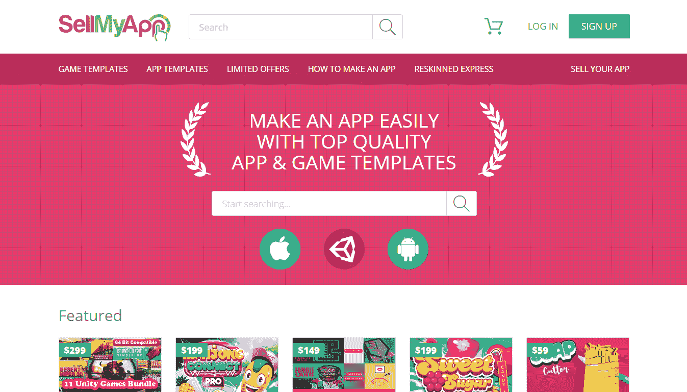
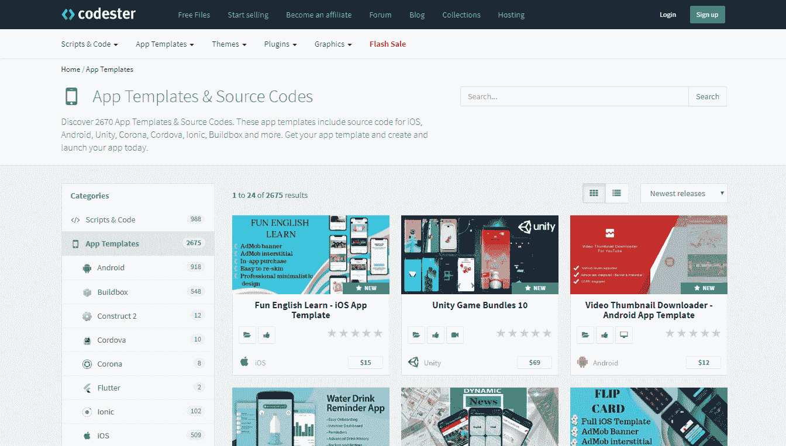
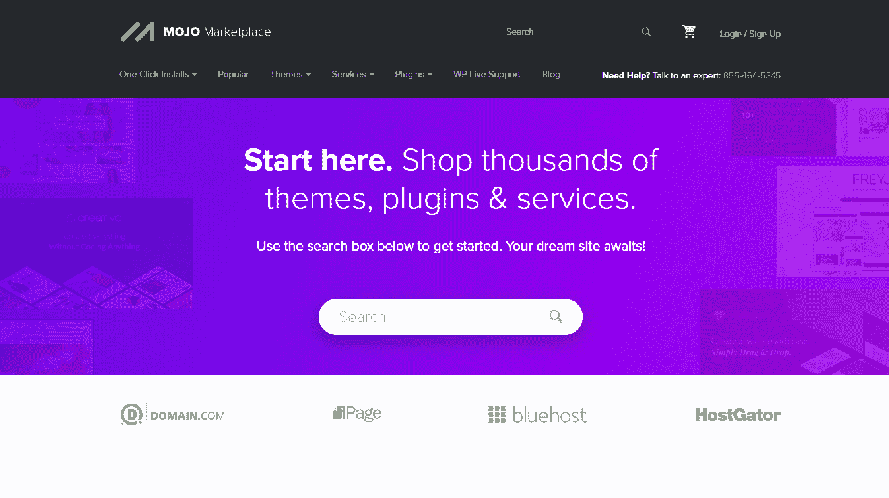
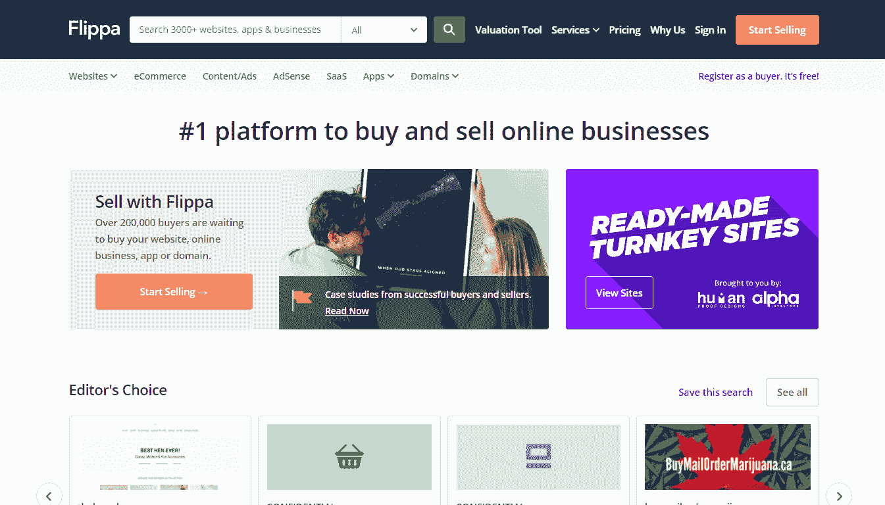
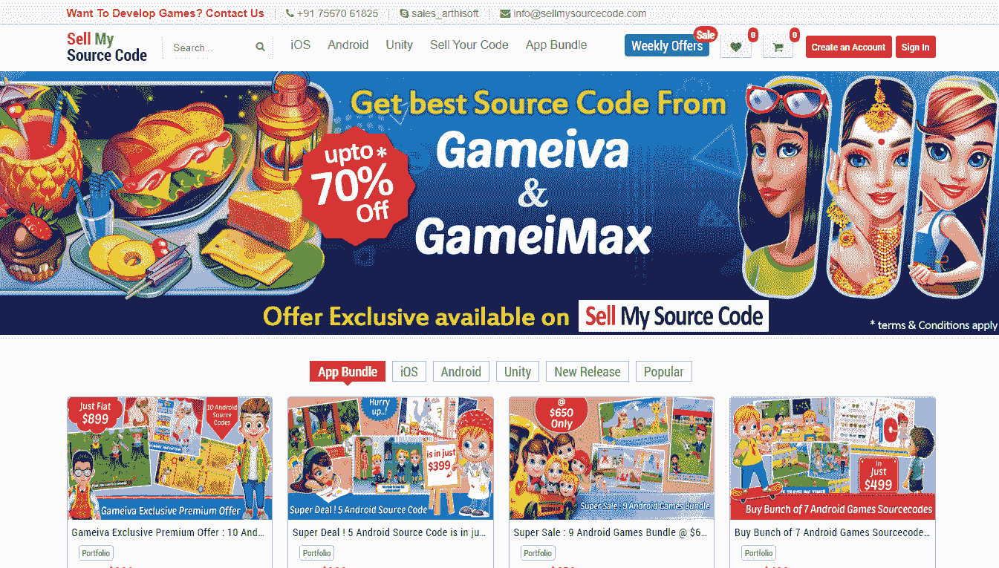
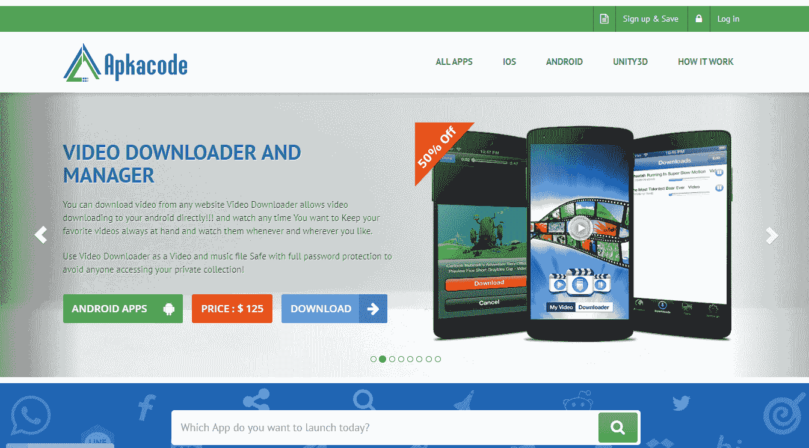
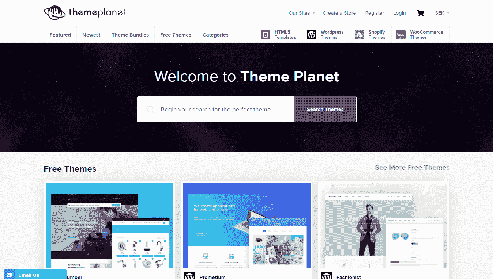

# 在线销售应用模板的 10 个最佳在线市场

> 原文：<https://medium.com/javarevisited/10-best-online-marketplaces-to-sell-your-app-templates-online-9f0b9dc003b3?source=collection_archive---------1----------------------->

你是一个有天赋的网页开发者吗？您开发应用程序、管理或 HTML 模板吗？通过在世界上最好的在线市场提供您的模板来促进您的销售。成千上万的潜在客户会光顾这些市场，随着新客户的增加，你的生意会更上一层楼。

今天，我与你分享**十个最好的在线市场**，让你**在线销售你的应用程序模板**。加入世界各地有才华的网页设计师团队，他们通过在线模板市场增加收入**！**

# #1:模板怪兽

TemplateMonster 拥有来自全球的 600 多万客户，是一个巨大的在线**市场**，提供超过 48K 个模板来满足所有利基和需求。自 2017 年以来，你可以成为 TemplateMonster 的供应商，利用庞大的客户群。这个市场也为你推广你的模板，让你赚到压岁钱变得更简单。

如果你选择使用 TemplateMonster 独家销售你的应用模板或管理模板，你的供应商佣金将高达 50%+(最高 70%)。这意味着你将获得市场上模板价格的 50-70%。销售 HTML 模板会给你带来 30%到 50%的佣金。非独家供应商通过 TemplateMonster 销售其应用模板获得 40%的佣金。

[**成为厂商**](https://www.templatemonster.com/marketplace/?aff=javarevisited&utm_campaign=blog_site_javarevisited&utm_source=marketplace&utm_medium=referral)

# 第二名:SellMyApp

SellMyApp 是历史最悠久、最负盛名的销售 iOS、Android 和 Unity 应用和游戏模板的市场之一。Sell My App marketplace 为客户提供高质量的模板和源代码。他们也有自己的 Reskin 编码团队，为市场客户提供服务和支持。

SellMyApp 根据你的销售额，给你提供不同级别的佣金。你从黄金级别开始，赚取 60%的佣金率。随着你在 SellMyApp 上销售的越来越多，你的佣金可以增长到 80%。

[**成为小贩**](https://www.sellmyapp.com/)

# #3:编码员

Codester 是一个相当大的平台，为开发者提供源代码、应用模板、web 主题、脚本、插件和其他资源。在这里，你可以出售带有 iOS、Android、Corona、Unity 和其他源代码的应用程序模板。

Codester 为您提供所有销售的 70%的全面和直接的佣金。你是否用 Codester 独家销售你的应用模板并不重要。甚至你卖多少都不重要；不管怎样，你赚了 70%的佣金。尽可能的公平透明！

[**成为小贩**](https://www.codester.com/)

# #4: Mojo 市场

几年前，Mojo 主题和 Mojo 代码结合形成了新的供应商友好的 Mojo 市场。现在，你可以通过这个市场销售不同类型的模板。许多创建网站和应用程序的人发现 Mojo Marketplace 很方便，因为它们直接与 Hostgator 托管平台集成。

Mojo Marketplace 欢迎您以有吸引力的条款出售您的应用程序模板。如果你独家销售，你从 50%的佣金率开始，佣金率随你的销售额成比例增长。如果你非独家销售，你将获得 50%的统一费率。

[**成为小贩**](https://www.mojomarketplace.com/)

# #5:创意市场

Creative Market 多年来一直被列为顶级在线模板提供商之一。现在，他们也接受来自世界各地的供应商提交的材料。就供应商政策而言，创意市场与其他市场有所不同。

在 Creative Market，没有审核过程，这使得在这个市场上销售你的商品变得更加简单。同时，你得到 70%的佣金率，不管你卖多少。你可以非独家销售，不会有财务损失。更重要的是，Creative Market 不会扰乱你的产品定价。这完全取决于你！

[**成为厂商**](https://creativemarket.com/)

# #6: iBuildApp

iBuildApp 是一个新的源代码和应用程序市场，以年度订阅为基础。如果你制作并销售你的应用模板(Android 和 iOS)，iBuildApp 邀请你开始用你的产品赚钱。

超过 130 万移动开发者和公司目前依赖 iBuildApp 开发移动代码和应用。使用 iBuildApp 源代码创建应用程序并在市场上销售。以后，您可以为其他项目重用使用 iBuildApp 创建的代码的 90%。

[**成为小贩**](https://ibuildapp.com/)

# #7: Flippa

Flippa 是一个大型市场，在这里你可以出售网站、源代码、域名、内容和在线业务。他们有几十个类别，包括你可以出售你的应用程序模板，HTML 和管理主题等。

要向 Flippa 提交你的模板，你必须支付他们 15 美元。将来，当你的销售额增长时，你会付更少的钱。一旦你的模板上了 Flippa，除了一小笔交易费，收入就是你的了。

[**成为小贩**](https://www.flippa.com/)

# #8:出售我的源代码

如果你正在为 Android、iOS、Unity 和其他系统开发手机游戏，使用这个市场来销售你的应用程序模板。目前，该平台提供超过 1，500 个 Android 应用程序和 1，200 多个 iOS 产品，是此类最佳平台之一。

你是手机游戏开发者吗？查看我们关于游戏开发者如何从应用模板 中获益的文章。

要开始销售，请提交您的脚本、移动应用程序或应用程序组件来销售我的源代码。现在，市场将为您处理订购、客户服务、营销和促销。作为卖家，你将获得高达 90%的佣金。

[**成为小贩**](http://www.sellmysourcecode.com/)

# #9: ApkaCode

ApkaCode 是一个市场，在这里你可以买卖任何东西，比如企业、品牌、网站、应用等等。该市场设法让卖家从他们的应用程序中获得最大的收入。在这里，您可以提交 iOS、Android 和 Unity3D 应用程序。

ApkaCode 允许您保留高达 80%的销售收入。它有方便的工具来发布代码库、组件和应用程序。

[**成为厂商**](http://www.apkacode.com/)

# #10:主题星球

ThemePlanet 于 2018 年推出，是一个最近出售 HTML、WordPress、电子商务和其他模板的市场。它为用户提供了大量免费和优质的主题、主题包、插件等。

欢迎您注册您的商店帐户，并向 ThemePlanet 出售模板。其内部团队将检查和批准您的提交。你将收到所有购买的 60%的佣金。

[**成为小贩**](https://themeplanet.com/)

# 包扎

这是你可以出售你的应用模板、管理和 HTML 主题的十个最好的市场。这些知名的平台为你提供公平甚至很好的佣金率。几个主题市场可以让你非独家销售你的模板，通过在几个市场销售你的产品来赚取更多。

你想跟上现代网络发展的步伐吗？查查 2020 年你能学会的 [**前 5 名编程语言**](/javarevisited/top-5-programming-languages-you-can-learn-in-2020-e68ab1a17af4) 有哪些？

你有任何问题或意见吗？

随意分享！