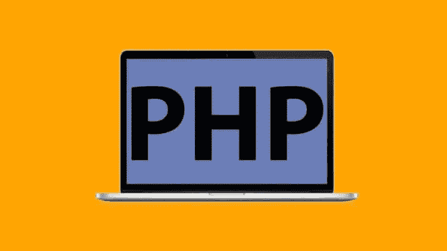
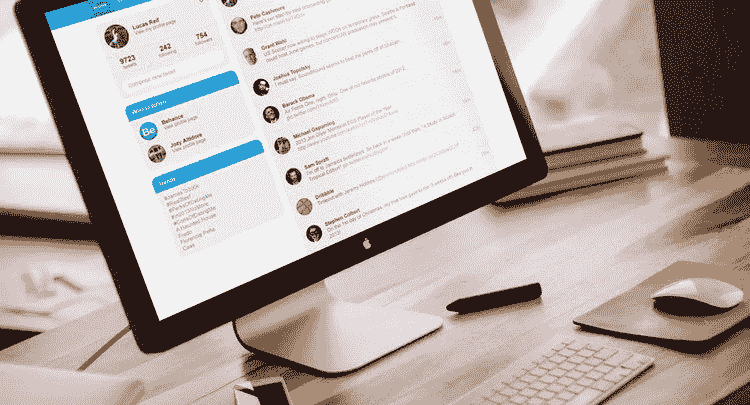
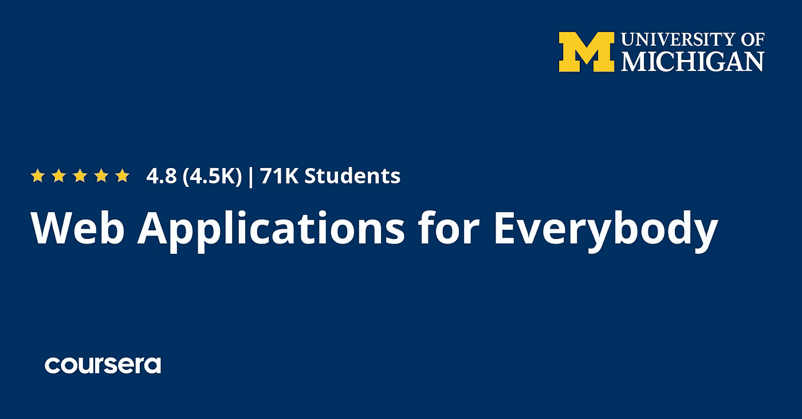
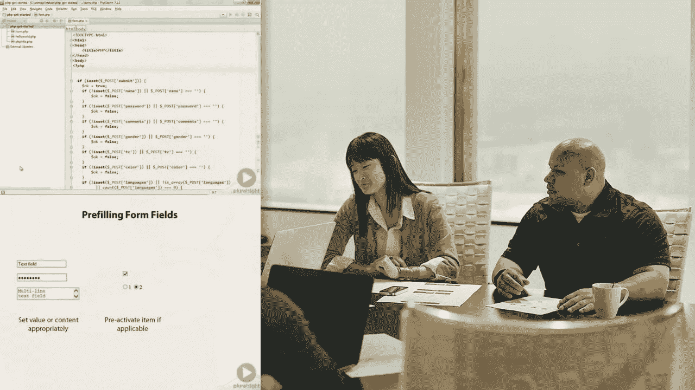
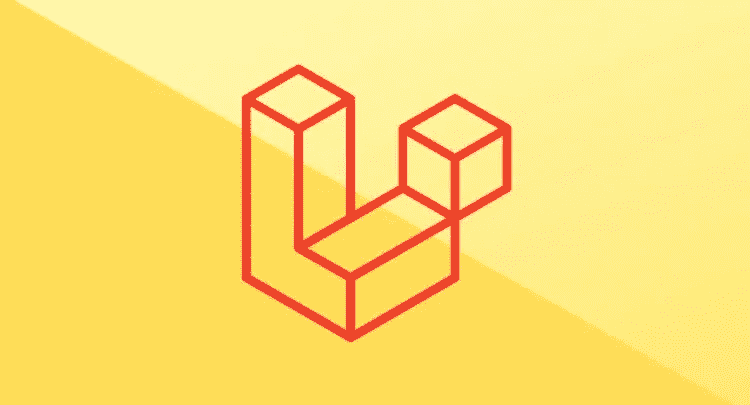
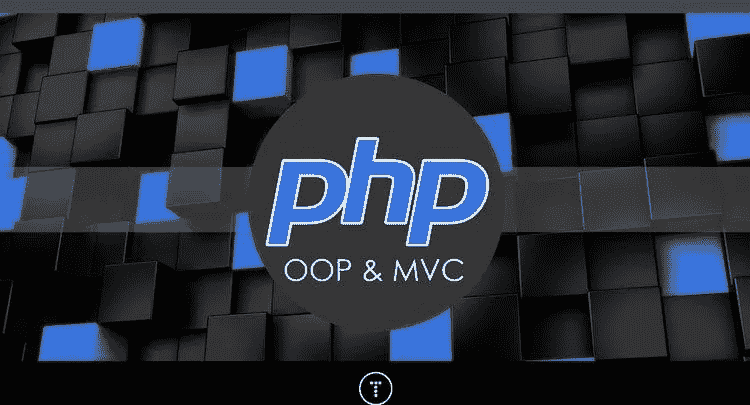
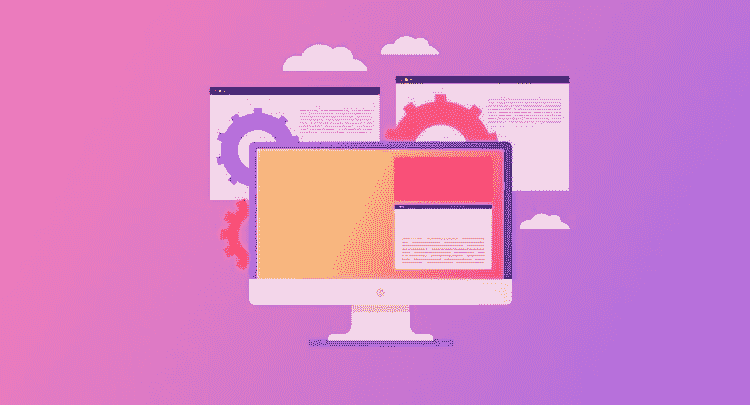
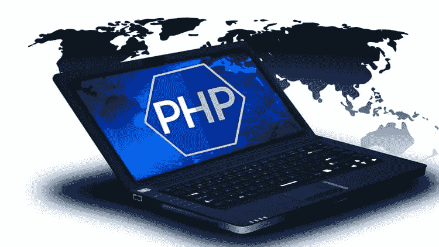
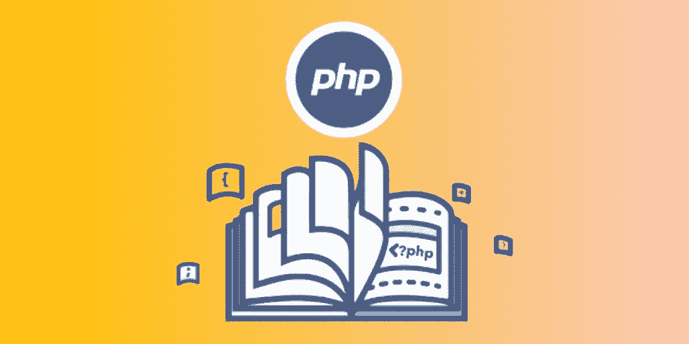

# 2023 年初学网页设计与开发的 10 门最佳 PHP 课程

> 原文：<https://medium.com/javarevisited/10-best-php-courses-for-beginners-and-experienced-developers-db18057a814f?source=collection_archive---------0----------------------->

## 我最喜欢的 2023 年初学者学习 PHP 编程语言的在线课程，从 Udemy，Coursera，以及其他流行的在线学习门户网站整理而来。

image_credit — Udemy

你好伙计们，如果你想在 2023 年在线学习 PHP、MySQL 和 Laravel，并寻找最好的 PHP 课程，那么你来对地方了。前面我已经分享了 [**最好的免费 PHP 和 MySQL 课程**](https://www.java67.com/2018/02/5-free-php-and-mysql-courses-for-web-developers.html) **和**最好的 Laravel 课程**</javarevisited/7-best-laravel-online-courses-for-beginners-and-php-developers-61deac95f6b4>****在这篇文章中，我将分享 2023 年初学者学习 PHP 的最好的在线课程。******

******有些人渴望学习 web 开发，但是他们不知道应该从哪种编程语言开始。******

******但是，当谈到为 web 开发选择一种简单的编程语言时， *PHP* 是一个很好的选择，也是最流行的服务器端编程语言之一。******

******PHP 是开始学习 web 开发的好语言。它有如此多的框架，如 Laravel 和 Codeigniter，使得 web 开发如此容易。许多库用于生成图表报告和加密登录凭证，等等。(众所周知，马克·扎克伯格用 PHP 创建了脸书。)

本文将为您介绍从零开始学习 PHP 的最佳网络课程；大多数是付费的，但也有一些是免费的，它们肯定会帮助你学习这种流行的语言及其框架，成为一名 web 开发人员，并开始一个全新的职业生涯。******

******如果你想知道*你是否应该在 2023 年学习 PHP 或者不学* t，那么让我告诉你，虽然 [**JavaScript**](https://javarevisited.blogspot.com/2018/06/top-10-courses-to-learn-javascript-in.html#axzz6qnblZnVj) 和 [**Python**](https://www.java67.com/2020/05/top-5-courses-to-learn-python-in-depth.html) 在最近几年确实越来越受欢迎，但是 PHP 在 web 开发方面仍然非常受欢迎。******

****PHP 开发人员有很多工作可以做，无论是自由职业还是全职工作，因为有数百万个网站是用 PHP 建立的，主要是 [**WordPress**](/javarevisited/5-best-wordpress-courses-for-beginners-and-experienced-website-developers-b45f7976ee40) 他们使用了许多 PHP 插件和库，最重要的是 PHP 非常容易学习和使用，所以在 2023 年学习 PHP 肯定是有意义的，但如果你想先学习 WordPress，这个基于项目的课程是最好的开始。****

****<https://coursera.pxf.io/c/3294490/1164545/14726?u=https%3A%2F%2Fwww.coursera.org%2Fprojects%2Fbuild-a-full-website-using-wordpress>  

# 2023 年初学网站开发的 10 门最佳 PHP 在线课程

在不浪费你更多时间的情况下，这里列出了初学者和有经验的开发者的最佳 PHP 课程。这些课程是从像 [Udemy](/javarevisited/10-best-udemy-online-courses-for-java-developers-4c9ab70cd01f) 、 [Coursera](/javarevisited/top-15-free-coursera-courses-and-certifications-for-it-professionals-384207d56f45) 、 [Pluralsight](/javarevisited/top-10-javascript-courses-from-pluralsight-to-learn-in-2021-26352abe4fcd) 和 [Educative](/javarevisited/20-free-educative-courses-for-programmers-and-software-engineers-a7135028350c) 这样的网站上策划的，由专家培训师和教育工作者创建，受到全球数千名开发者的信任。

它们也很实惠，尤其是 Udemy 课程，你只需花 10 美元就能在 Udemy 上买到，这种事情时有发生。

## 1.[初学 PHP](https://click.linksynergy.com/deeplink?id=JVFxdTr9V80&mid=39197&murl=https%3A%2F%2Fwww.udemy.com%2Fcourse%2Fphp-for-complete-beginners-includes-msql-object-oriented%2F)【Udemy 最佳课程】

这是 Udemy 上最好的 PHP 课程之一，有超过 37 个小时的视频内容，适合初学者和任何想从头开始学习 PHP 的人。

这门课程由 Edwin Diaz 创建，他是一名网络开发人员，也是一名受欢迎的 Udemy 讲师。这门课程将教你关于 PHP 的一切，比如数据类型，以及将 PHP 嵌入 HTML、语句和函数。

在那之后，你将学习一些中间主题，比如安全和加密，以及防止一些漏洞，比如 [SQL](/hackernoon/top-5-sql-and-database-courses-to-learn-online-48424533ac61) ，最后构建一个像 WordPress 一样的 CMS 系统。

您还将[学习 MySQL](/javarevisited/top-5-courses-to-learn-mysql-in-2020-4ffada70656f) 、Ajax 以及如何重构和调试您的代码，以及如何使用 PHP 创建真实世界的项目。

谈到社会证明，已经有超过 97，000 名学生加入了这门课程，它的平均评分为 4.4 分，这是非常惊人的，这充分说明了这门 PHP 课程的质量。我强烈推荐这门课程给每一个想在 2023 年学习 PHP 的初学者。

**这里是加入这个课程的链接**——[PHP 初学者](https://click.linksynergy.com/deeplink?id=JVFxdTr9V80&mid=39197&murl=https%3A%2F%2Fwww.udemy.com%2Fcourse%2Fphp-for-complete-beginners-includes-msql-object-oriented%2F)

****

## ****2.从头开始建立一个社交网络****

****学习一门新的编程语言、框架或技术，没有比做项目更好的方法了，如果你喜欢边做边学，那么你也会喜欢 Udemy 的这门 PHP 实践课程。****

****由 Reece Kenney[创建，这是一个学习 PHP 的很好的课程，从安装环境、创建登录表单、构建网站、为用户添加通知和帐户设置制作类似新闻订阅的帖子和个人资料页面等等开始练习并创建一个社交网络。](https://click.linksynergy.com/deeplink?id=CuIbQrBnhiw&mid=39197&murl=https%3A%2F%2Fwww.udemy.com%2Fuser%2Freecekenney%2F)****

****谈到社交证明，已经有超过 11，500 名学生参加了这门课程，2500 名参与者平均给了它 4.5 分，这简直太棒了。****

****如果你想建立一个非平凡的 PHP 项目，像脸书或 Instagram 这样的社交网络，那么我强烈推荐你加入这个课程。****

******以下是加入本课程的链接**——[从零开始建立社交网络](https://click.linksynergy.com/deeplink?id=JVFxdTr9V80&mid=39197&murl=https%3A%2F%2Fwww.udemy.com%2Fcourse%2Fmake-a-social-media-website%2F)。****

********

## ****3.[面向所有人的网络应用](https://coursera.pxf.io/c/3294490/1164545/14726?u=https%3A%2F%2Fwww.coursera.org%2Fspecializations%2Fweb-applications)【Coursera】****

****这是密歇根大学在 Coursera 上提供的一个大规模专业化或认证项目，用于学习 PHP 和从零开始构建 web 应用程序，并从理解 web 应用程序的基本结构开始。****

****以下是您将在本课程中学到的主要内容:****

1.  ****如何安装您的开发环境****
2.  ****用 PHP 和 MySQL 开发数据库应用程序****
3.  ****使用 JavaScript 与 PHP web 应用程序交互****
4.  ****建模多对多关系****

****本课程还将向您介绍数据库技术，尤其是 SQL。它将它与 PHP 等连接起来，直到你从头开始创建一个。****

****在此过程中，您还将创建几个 web 应用程序来构建您的开发人员组合。本课程将帮助你做好准备，即使你在编程或技术方面没有什么经验，也能胜任初级的 PHP web 开发工作。****

****超过 44%的学习者在加入这门课程后开始了新的职业生涯，这是对质量的一个很大的证明，当然，我强烈推荐给喜欢在 Coursera 上以结构化和有指导的方式学习的学习者。****

******这是加入本课程的链接**——[大家的网络应用](https://coursera.pxf.io/c/3294490/1164545/14726?u=https%3A%2F%2Fwww.coursera.org%2Fspecializations%2Fweb-applications)****

********

****顺便说一句，如果你发现 Coursera 的课程很有用，因为它们是由世界各地的知名公司和大学创建的，我建议你加入 Coursera Plus 的订阅计划，它可以让你无限制地访问他们最受欢迎的课程、专业知识、专业证书和指导项目。****

****<https://coursera.pxf.io/c/3294490/1164545/14726?u=https%3A%2F%2Fwww.coursera.org%2Fcourseraplus> **** 

## ****4. [PHP 基础](https://pluralsight.pxf.io/c/1193463/424552/7490?u=https%3A%2F%2Fwww.pluralsight.com%2Fcourses%2Fphp-fundamentals)【复数视线】****

****Pluralsight 是程序员和开发人员的另一个很好的在线学习平台，因为我是 Pluralsight 会员，所以我在那里花了很多时间，这就是为什么我总是在我的列表中包括 Pluralsight 课程。****

****如果你正在 Pluralsight 上寻找最好的 PHP 课程来开始你的职业生涯，那么这个课程就是为你准备的。这门课会教你 LAMP 栈上的 PHP 编程基础( [Linux](/javarevisited/7-best-linux-courses-for-developers-cloud-engineers-and-devops-in-2021-7415314087e1) ，Apache， [MySQL](https://dev.to/javinpaul/10-free-php-and-mysql-courses-for-beginners-5eg2) ，以及 [PHP](https://javarevisited.blogspot.com/2020/11/top-10-courses-to-learn-php-for.html) )。****

****由吉尔·贡德森创建，这是一个适合初学者从头开始学习 PHP 的友好课程。你将从这种语言的语法开始，比如 integer 和 float，它们是数据类型，然后开始使用函数，使你的代码易于理解，学习类和对象，并做一些 web 编程。****

****以下是你将在这门 PHP 课程中学到的主要内容:****

1.  ****PHP 语法****
2.  ****内置 PHP 函数****
3.  ****跨网页保存数据****
4.  ****连接到数据库****

****简而言之，这是一门非常棒的入门课程，让你开始学习世界上最广泛使用的服务器端编程语言 PHP。****

****这里是加入这个 PHP 课程的链接 — [PHP 基础](https://pluralsight.pxf.io/c/1193463/424552/7490?u=https%3A%2F%2Fwww.pluralsight.com%2Fcourses%2Fphp-fundamentals)****

********

****顺便说一下，你需要一个 [Pluralsight 会员](http://pluralsight.pxf.io/c/1193463/424552/7490?u=https%3A%2F%2Fwww.pluralsight.com%2Flearn)才能加入这个课程，费用大约是每月 29 美元或每年 299 美元(14%的折扣)。我向所有程序员强烈推荐这个订阅，因为它提供了超过 7000 个在线课程的即时访问，以学习任何技术技能。或者，你也可以使用他们的 [**10 天免费通行证**](http://pluralsight.pxf.io/c/1193463/424552/7490?u=https%3A%2F%2Fwww.pluralsight.com%2Flearn) 免费观看本课程。****

****<https://pluralsight.pxf.io/c/1193463/424552/7490?u=https%3A%2F%2Fwww.pluralsight.com%2Fpricing%2Ffree-trial> **** 

## ****5. [PHP 带 Laravel 适合初学者](https://click.linksynergy.com/deeplink?id=JVFxdTr9V80&mid=39197&murl=https%3A%2F%2Fwww.udemy.com%2Fcourse%2Fphp-with-laravel-for-beginners-become-a-master-in-laravel%2F)【Udemy 课程】****

****如果你正在寻找一门学习 PHP 的课程，那么这个 Udemy 课程很适合你。虽然 PHP 可以用来创建 web 应用程序，但是使用像 [Laravel](https://www.java67.com/2020/07/top-5-courses-to-learn-laravel.html) 这样的框架来获得更好、更安全的代码要容易得多，也是一种最佳实践。****

****由[埃德温·迪亚兹](https://click.linksynergy.com/deeplink?id=CuIbQrBnhiw&mid=39197&murl=https%3A%2F%2Fwww.udemy.com%2Fuser%2Fedwin166%2F)创建，这份名单中第一门课程的讲师，这门课程将教你成为一名 Laravel 开发人员所需要知道的几乎所有东西，从数据类型到连接到 [SQL 数据库](https://javarevisited.blogspot.com/2018/05/top-5-sql-and-database-courses-to-learn-online.html)和安全以及发送电子邮件等等。****

****这是用来创建 web 应用程序的最流行的 PHP 框架之一。在本课程中，您将了解您需要了解的一切，从学习它的一些库开始，如加密、使用数据库和 CRUD 操作以及登录和注册系统等。****

****通过学习 Laravel 框架，您可以构建一些令人惊叹的 web 应用程序，如电子商务应用程序、照片共享应用程序、员工管理系统等等。****

******这里是加入本课程的链接** — [PHP with Laravel for 初学者](https://click.linksynergy.com/deeplink?id=JVFxdTr9V80&mid=39197&murl=https%3A%2F%2Fwww.udemy.com%2Fcourse%2Fphp-with-laravel-for-beginners-become-a-master-in-laravel%2F)****

********

## ****6.Brad Traversy 编写的面向对象 PHP[MVC](https://click.linksynergy.com/deeplink?id=JVFxdTr9V80&mid=39197&murl=https%3A%2F%2Fwww.udemy.com%2Fcourse%2Fobject-oriented-php-mvc%2F)****

****学习任何语言的最好方法就是尽可能多地练习，本课程将教你创建一个 PHP 框架，然后使用它构建 web 应用程序。****

****这门课程是由我最喜欢的 Udemy 网站开发导师之一 Brad Traversy 创建的。我之前上过他的 [HTML](/javarevisited/10-best-html-and-css-courses-for-beginners-in-2021-6757eec00032) 、 [CSS](https://javarevisited.blogspot.com/2020/09/top-5-css-cascading-style-sheet-courses-for-beginners.html) 、 [JavaScript](https://www.java67.com/2020/10/best-javascript-courses-for.html) 课程，但是我更早不知道他有 PHP 课程，但是当我发现的时候，我就加入了，我必须说我没有失望。****

****这个课程有合适的节奏和长度。你将在 6.5 小时内以动手的方式学习 PHP。你将学习 PHP 和面向对象编程以及 MVC 架构，更重要的是，你还将学习如何部署 PHP 应用程序。****

******这里是加入本课程** — [面向对象 PHP & MVC](https://click.linksynergy.com/deeplink?id=JVFxdTr9V80&mid=39197&murl=https%3A%2F%2Fwww.udemy.com%2Fcourse%2Fobject-oriented-php-mvc%2F) 的链接****

********

## ****7.[用 PHP Unit 进行 PHP 单元测试](https://click.linksynergy.com/deeplink?id=JVFxdTr9V80&mid=39197&murl=https%3A%2F%2Fwww.udemy.com%2Fcourse%2Fphp-unit-testing%2F)****

****作为一名专业的 PHP 开发人员，您必须知道如何为您的 PHP 代码编写单元测试，对于初学者来说，从头开始做正确的事情更为重要。这就是为什么我在这个列表中加入了 PHP 单元测试课程。****

****谈到 PHP 中的单元测试， [PHPUnit](https://phpunit.de/) 是最受欢迎的库，很像 Java 中的[JUnit](https://javarevisited.blogspot.com/2021/04/junit-interview-questions-with-answers.html#axzz6qnblZnVj)。使用 PHPUnit，您可以编写测试来快速早期地发现 bug，并提高您的代码质量。****

****以下是您将在本课程中学到的关键技能:****

*   ****如何为你的函数和类编写自动化测试****
*   ****如何在更短的时间内用更少的错误写出更好的代码****
*   ****使用测试驱动开发来开发代码****
*   ****知道你写的代码按照你想要的方式工作****
*   ****改进了代码的文档****

****如果你是一名 PHP 开发人员，想学习如何编写更好的代码，减少错误，你需要知道如何编写单元测试，这门课程最适合你。****

******这里是加入本课程的链接**——[用 PHP Unit 进行 PHP 单元测试](https://click.linksynergy.com/deeplink?id=JVFxdTr9V80&mid=39197&murl=https%3A%2F%2Fwww.udemy.com%2Fcourse%2Fphp-unit-testing%2F)****

********

## ****8. [PHP 初学者:如何建立一个电子商务商店](https://click.linksynergy.com/deeplink?id=JVFxdTr9V80&mid=39197&murl=https%3A%2F%2Fwww.udemy.com%2Fcourse%2Fphp-for-beginners-how-to-build-an-ecommerce-store%2F)****

****如果你正在寻找一个 PHP 项目，那么这个课程就是为你准备的。在本课程中，你将通过从头开始建立一个电子商务商店来学习 PHP。****

****这门课程也是由 Edwin Diaz 创建的，它长达 15 个小时，是用 PHP 创建电子商务网站的分步指南。****

****与许多其他 PHP 项目不同，本课程的项目更基于功能，更安全；您将学习更多的技术，更好的代码组织，并学习如何将您的最终应用程序上传到 web。****

****这是参加本课程的链接。 [PHP 初学者:如何建立一个电子商务商店](https://click.linksynergy.com/deeplink?id=JVFxdTr9V80&mid=39197&murl=https%3A%2F%2Fwww.udemy.com%2Fcourse%2Fphp-for-beginners-how-to-build-an-ecommerce-store%2F)****

********

## ****9.Tim bucha laka[PHP 初学者](https://click.linksynergy.com/deeplink?id=JVFxdTr9V80&mid=39197&murl=https%3A%2F%2Fwww.udemy.com%2Fcourse%2Fphp-for-beginners-%2F)【最佳 Udemy 课程】****

****这是在 Udemy 上从头开始学习 PHP 的又一个很棒的课程。这个课程是由我最喜欢的 Udemy 导师之一 Tim Buchalaka 和他的团队创建的，是专门为想要从头开始学习 PHP 的初学者而创建的。****

****本课程从设置环境和教授 PHP 编程基础开始，如变量和数组。****

****之后，它提供了一个很好的介绍 [HTML](https://javarevisited.blogspot.com/2019/05/top-5-html-5-and-css-3-courses-for-web-developers.html#axzz6ccm5KWKs) 和混合它与 PHP，然后理解和连接数据库技术与 PHP，以及 OOP 和认证和发送电子邮件，等等。****

****在这个过程中，您将使用 [PHP 和 MySQL](https://www.java67.com/2018/02/5-free-php-and-mysql-courses-for-web-developers.html) 从头构建一个内容管理系统，并学习一些关键技能，比如如何使用面向对象的编程技术构建代码，以及如何使用关系数据库通过 PHP 存储数据。****

****您还将学习对现实世界的 PHP 开发很重要的东西，如将第三方代码集成到您的站点中，以及如何通过遵循编程最佳实践来编写可重用的、更易维护的代码——总体而言，这是一门完整的 PHP 课程，适合初学者从头开始学习 PHP。****

******这里是加入这个 PHP 课程的链接** — [蒂姆·布卡拉卡的 PHP 初学者教程](https://click.linksynergy.com/deeplink?id=JVFxdTr9V80&mid=39197&murl=https%3A%2F%2Fwww.udemy.com%2Fcourse%2Fphp-for-beginners-%2F)****

********

## ****10.[从零开始学习 PHP](https://www.educative.io/courses/learn-php-from-scratch?affiliate_id=5073518643380224)【免费教育课程】****

****如果你正在寻找 2023 年在线学习 PHP 的互动课程，那么 Educative 的这个基于文本的互动课程是最好的免费课程。****

****如果你不知道， [Educative](https://www.educative.io/subscription?affiliate_id=5073518643380224) 是一个新的在线学习平台，你可以在这里学习新的技术技能。它允许你在你的浏览器上执行代码，这使得学习更快，因为你不需要下载任何软件或设置你的环境。****

****这个免费的 PHP 课程是一个高度互动的课程，向学生介绍了世界上最广泛使用的免费语言之一的基础知识。****

****您将能够有效地创建 web 应用程序，掌握类、继承和异常处理等概念。****

******这里是加入本课程**——[从头学 PHP](https://www.educative.io/courses/learn-php-from-scratch?affiliate_id=5073518643380224)的链接。****

********

****而且，如果你发现教育平台和他们的互动课程很有用，那么你还可以获得 [**教育订阅**](https://www.educative.io/subscription?affiliate_id=5073518643380224) ，每月只需 14.9 美元，不仅可以访问本课程，还可以访问他们的 210 多门课程。它非常划算，非常适合准备编码面试****

****<https://www.educative.io/subscription?affiliate_id=5073518643380224>  

以上就是关于**深入学习 PHP 的最佳在线课程**。在这个列表中，我们已经介绍了学习 PHP 编程语言和 PHP 框架(如 Laraval 和 PHPUnit)的在线课程，这些课程对于使用 PHP 创建真实世界的应用程序是必不可少的。

当你开始学习 web 开发时，不要认为学习 PHP 之外的任何语言是因为它被广泛使用，所以你会发现一个大型社区准备好帮助你及其代码的简单语法和扩展你的网站的能力。

你可能喜欢的其他**编程书籍和课程**

*   [深入学习 Python 的 10 个理由](https://javarevisited.blogspot.com/2018/05/10-reasons-to-learn-python-programming.html)
*   [初学者学习 Python 的 5 大课程](https://javarevisited.blogspot.com/2018/03/top-5-courses-to-learn-python-in-2018.html)
*   [Python 和 JavaScript——从哪个开始比较好？](https://javarevisited.blogspot.com/2019/05/python-vs-javascript-which-programming-language-beginners-should-learn.html)
*   [微软和谷歌的 10 个免费 Python 教程](/javarevisited/10-free-python-tutorials-and-courses-from-google-microsoft-and-coursera-for-beginners-96b9ad20b4e6)
*   [我最喜欢的 Django 开发者课程](/@javinpaul/my-favorite-courses-to-learn-django-for-beginners-2020-ac172e2ab920)
*   [面向 Python 开发者和初学者的 8 个项目](/javarevisited/8-projects-you-can-buil-to-learn-python-in-2020-251dd5350d56)
*   [我最喜欢的网络开发课程深度](/better-programming/my-5-favorite-courses-to-learn-web-development-in-2019-a5e74167f8b2)
*   [学习数据科学和机器学习的 10 门课程](https://dev.to/javinpaul/10-data-science-and-machine-learning-courses-for-programmers-looking-to-switch-career-57kd)
*   [2023 年学习烧瓶的前 5 门课程](https://javarevisited.blogspot.com/2020/01/top-5-courses-to-learn-flask-for-web-development-with-python.html)
*   [10 门 Python 课程和程序员认证](/better-programming/top-5-courses-to-learn-python-in-2018-best-of-lot-26644a99e7ec)
*   [学习 Python 的 10 大免费教程](https://dev.to/javinpaul/top-5-places-to-learn-python-programming-for-free-m4c)
*   [面向程序员的 10 本免费 Python 编程书籍](http://www.java67.com/2017/05/top-7-free-python-programming-books-pdf-online-download.html)

感谢您阅读本文。如果你觉得这些*最好的 PHP 初学者在线课程*有用，请分享给你的朋友和同事。如果您有任何问题或反馈，请留言。

**【p . s .】**—如果你热衷于学习 PHP，但正在寻找一门免费的在线课程来开始你的 PHP 学习之旅，那么你也可以看看 Udemy 的这门 [**实用 PHP:掌握基础知识和代码动态网站**](https://click.linksynergy.com/deeplink?id=CuIbQrBnhiw&mid=39197&murl=https%3A%2F%2Fwww.udemy.com%2Fcourse%2Fcode-dynamic-websites%2F) 课程。它是完全免费的，2023 年已经有超过 25 万人加入学习 PHP。

<https://click.linksynergy.com/deeplink?id=CuIbQrBnhiw&mid=39197&murl=https%3A%2F%2Fwww.udemy.com%2Fcourse%2Fcode-dynamic-websites%2F> ****