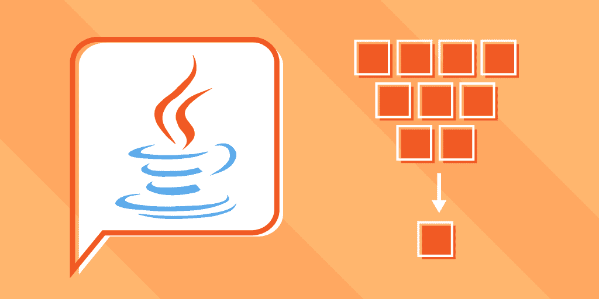
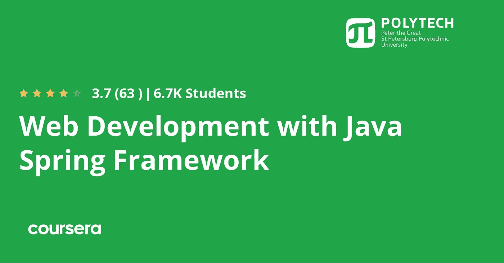
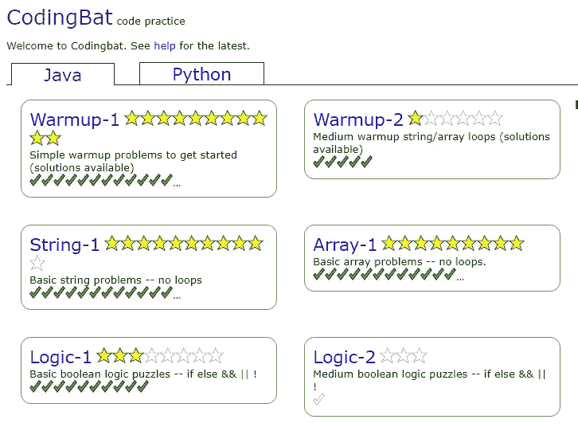
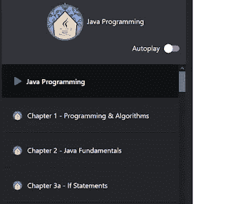
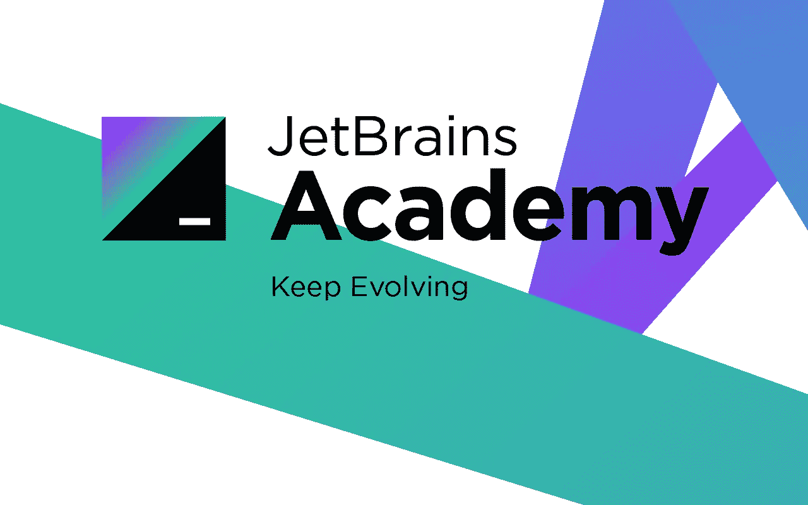
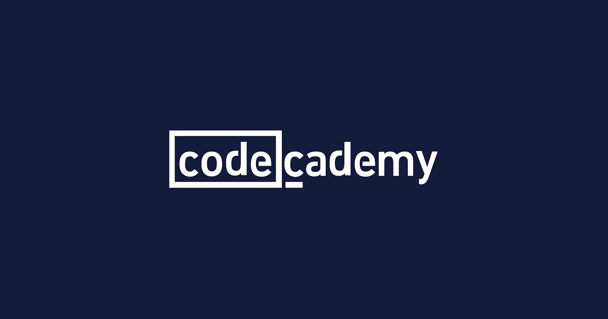

# 2023 年免费在线学习 Java 的 10 个最佳地点

> 原文：<https://medium.com/javarevisited/10-best-places-to-learn-java-online-for-free-ce5e713ab5b2?source=collection_archive---------0----------------------->

## 我最喜欢的网站免费在线学习 Java，适合初学者和想在线学习 Java 编码的人。

image_credit —教育性

大家好，如果你想在 2023 年学习 Java 编程，并寻找最好的网站免费学习 Java 编码，那么你来对地方了。以前我已经分享过 [**最好的 Java 课程**](/javarevisited/top-5-java-online-courses-for-beginners-best-of-lot-1e1e240a758) 和 [**Java 书籍**](/swlh/top-10-java-books-for-programmers-all-time-great-82b0ee0b831a) ，今天我要分享的是免费网站，免费学习 Java 编程。

作为一个 Java 博客的作者和程序员，我经常收到这样的问题:如何提高我的编码技能？，我如何学习用 Java 编码？，或者我解决编程问题有困难，请帮忙等等。

这大部分来自刚开始编程的程序员或者有编程学位的毕业生，甚至一些在职一两年的程序员。

像世界上的许多其他事情一样，要提高编码，你需要**编码，编码，编码**——而要开发编程，你需要写一个程序，这是许多程序员失败的地方。

在 90%的情况下，他们只是没有编写足够的程序来开发编程逻辑和代码意识，如果没有太多数据结构和算法方面的经验，如果他们试图解决 LeetCode、HackerEarth、TopCoder 或 Project Euler 等网站上的问题，他们会惨败。

坦白说，从那些网站解决问题并不容易，直到你真正做了一两年编程，甚至更久。提高编码的一个极好的方法是自己解决基本的[数据结构](/javarevisited/7-best-courses-to-learn-data-structure-and-algorithms-d5379ae2588?source=---------18------------------)、[算法](/javarevisited/50-data-structure-and-algorithms-interview-questions-for-programmers-b4b1ac61f5b0)和[面向对象设计问题](/javarevisited/25-software-design-interview-questions-to-crack-any-programming-and-technical-interviews-4b8237942db0)。

如果你完全是编程界的新手，那么投资一些钱买一本书或者参加一个关于数据结构和算法的课程，比如 [**数据结构和算法:在 Udemy 上使用 Java**](https://click.linksynergy.com/fs-bin/click?id=JVFxdTr9V80&subid=0&offerid=323058.1&type=10&tmpid=14538&RD_PARM1=https%3A%2F%2Fwww.udemy.com%2Fdata-structures-and-algorithms-deep-dive-using-java%2F) 进行深入研究是一个好主意。它可能不会教你编码，它会给出数据结构和算法的知识，这对于任何程序员来说都是非常重要的。

<https://click.linksynergy.com/fs-bin/click?id=JVFxdTr9V80&subid=0&offerid=323058.1&type=10&tmpid=14538&RD_PARM1=https%3A%2F%2Fwww.udemy.com%2Fdata-structures-and-algorithms-deep-dive-using-java%2F>  

# 2023 年免费学习 Java 编码的 10 个最佳网站

在本文中，我将与您分享 10 大网站，这将有助于您学习编码和编程，而且也是免费的。

少数网站大多面向 Java 程序员，但问题集可以用任何语言解决，而另一个网站是语言独立的，因为它不要求你在线编码，而是只使用随机输入的数据检查你的答案。

## 1. [Udemy](https://click.linksynergy.com/deeplink?id=JVFxdTr9V80&mid=39197&murl=https%3A%2F%2Fwww.udemy.com%2Fintroduction-to-java-programming%2F)

这是另一个流行的在线学习 Java 和编码的网站。与 Pluralsight 类似，它也提供免费和付费课程，但好的方面是你有很多选择，而且相对比 Pluralsight 便宜。它还包含许多 Java 和编程方面的免费课程，如[面向完全初学者的 Java 教程](https://click.linksynergy.com/fs-bin/click?id=JVFxdTr9V80&subid=0&offerid=323058.1&type=10&tmpid=14538&RD_PARM1=https%3A%2F%2Fwww.udemy.com%2Fjava-tutorial%2F%20http://bit.ly/2zO3AHT)，多达 767，854 名学生注册了这门课程，这是网上最好的免费 Java 课程之一。

而且，如果你能花 10 美元这样的几块钱，那么你也可以找到很多从头开始学习 Java 的课程 [**《完整的 Java 大师班》**](https://click.linksynergy.com/fs-bin/click?id=JVFxdTr9V80&subid=0&offerid=323058.1&type=10&tmpid=14538&RD_PARM1=https%3A%2F%2Fwww.udemy.com%2Fjava-the-complete-java-developer-course%2F) 是程序员入门 Java 的最佳课程之一。

## 2. [Coursera](https://coursera.pxf.io/c/3294490/1164545/14726?u=https%3A%2F%2Fwww.coursera.org%2F)

Coursera 是另一个流行的在线学习平台，在这里你可以找到很多免费的在线资源来学习任何东西。Coursera 从谷歌和 IBM 等顶级公司以及斯坦福大学或哈佛大学等世界顶级大学带来了最好的学习材料。

说到学习 Java，Coursera 有很多免费的课程，这里有几门你可以在线学习 Java 的课程。

1.  [**Java 编程:用软件解决问题**](https://coursera.pxf.io/c/3294490/1164545/14726?u=https%3A%2F%2Fwww.coursera.org%2Flearn%2Fjava-programming) 杜克大学
2.  [**面向对象的 Java 编程:数据结构和超越专门化**](https://coursera.pxf.io/c/3294490/1164545/14726?u=https%3A%2F%2Fwww.coursera.org%2Fspecializations%2Fjava-object-oriented)UC SanDiago
3.  [**Spring 框架特殊化**](https://coursera.pxf.io/c/3294490/1164545/14726?u=https%3A%2F%2Fwww.coursera.org%2Fspecializations%2Fspring-framework) by LearnQuest

你可以在 Coursera 上加入这两个免费的 Java 和 Spring 课程，不仅学习 Java，还可以学习 Spring Framework，这是开发 web 应用程序最流行和最受欢迎的 Java 框架之一。

如果你发现 Coursera 的课程很有用，因为它们是由谷歌、IBM、亚马逊等知名公司和世界上最好的大学创建的，我建议你加入 Coursera PlusT3 的[课程，这是 Coursera 的一个订阅计划，让你可以无限制地访问他们最受欢迎的课程、专业、专业证书和指导项目。](https://coursera.pxf.io/c/3294490/1164545/14726?u=https%3A%2F%2Fwww.coursera.org%2Fcourseraplus)

<https://coursera.pxf.io/c/3294490/1164545/14726?u=https%3A%2F%2Fwww.coursera.org%2Fcourseraplus>  

## 3.[教育性](https://www.educative.io/subscription?affiliate_id=5073518643380224)

对于初学者和喜欢互动学习的人来说，这是另一个很棒的网站。Educative 允许你在浏览器上在线编码，这意味着你不需要安装任何软件或做任何设置。

这真的很重要，因为大多数初学者在设置过程中卡住并放弃了。通过 Educative 基于文本的交互式课程、测验和评估，您可以掌握任何技术技能，包括 Java。

[**从零开始学习 Java**](https://www.educative.io/courses/learn-java-from-scratch?affiliate_id=5073518643380224)**是一个免费的、交互式的学习 Java 的课程。您将从一个简单的 hello world 程序开始，继续学习 Java 中的常见概念，如条件语句、循环语句、数学和逻辑，然后学习更高级的概念，如继承、泛型和数组列表等等**

****这里是加入本课程的链接** — [**从零开始学 Java**](https://www.educative.io/courses/learn-java-from-scratch?affiliate_id=5073518643380224)**

****

**他们有最好的编程面试课程，如[探索系统设计面试](https://www.educative.io/collection/5668639101419520/5649050225344512?affiliate_id=5073518643380224)和[探索编程面试模式](https://www.educative.io/collection/5668639101419520/5671464854355968?affiliate_id=5073518643380224)，这不是免费的，但你可以使用[教育订阅](https://www.educative.io/subscription?affiliate_id=5073518643380224)来访问它们，它的价格约为 14.9 美元，并提供对他们所有 250+互动课程的访问。他们确实有一些免费的编程课程，包括学习 Java 的课程。**

**<https://www.educative.io/subscription?affiliate_id=5073518643380224> ** 

## **4.[复数视线](https://pluralsight.pxf.io/c/1193463/424552/7490?u=https%3A%2F%2Fwww.pluralsight.com%2Fcourses%2Fjava-fundamentals-language)**

**在 Pluralsight 上有很多有用的在线学习 Java 和编码的课程。可以按照自己的节奏选择自己喜欢学的课。该网站还提供了 10 天的免费试用，如果你完全专注于 Java 和编码，这对你来说是绰绰有余的。

我推荐 [**Java 基础:Java 语言**](https://pluralsight.pxf.io/c/1193463/424552/7490?u=https%3A%2F%2Fwww.pluralsight.com%2Fcourses%2Fjava-fundamentals-language) 开始学习 Java 编程语言基础。作者 Jim Wilson 在这个强大的课程中解释了 Java 的语法和特性。

除了 Pluralsight，还有教授编程的课程，例如，如果你对编程完全没有任何概念，你可以看看斯科特·艾伦的[学习编程—第一部分:入门](https://pluralsight.pxf.io/c/1193463/424552/7490?u=https%3A%2F%2Fwww.pluralsight.com%2Fcourses%2Flearning-programming-javascript)。**

****

## **5.卡尔帕多**

**这是 2023 年又一个学习 Java 编程的牛逼网站。该课程由广受欢迎的 Java 讲师 Karthikeya T 主持，为初学者和有经验的 Java 开发人员提供了许多有用的 Java 课程。**

**他们的高级课程之一是[**2023 年的完整 Java 编程大师班！**](https://karpadoschool.teachable.com/a/aff_dndxllz7/external?affcode=536712_cf-umzkm) 不仅从零开始教你 Java 编程，还帮你准备甲骨文的 Java 认证。**

**如果你是一个初学者，想在 2023 年学习 Java 编程，那么这是你开始职业生涯所需要的唯一一门 Java 课程。对于 Java 访问过的读者来说，我已经获得了 95%的折扣，你可以在有限的时间内 [g **et 这个 99 美元的课程，只需 3 美元**](https://karpadoschool.teachable.com/a/aff_dndxllz7/external?affcode=536712_cf-umzkm) 。**

**它还提供 30 天退款保证，这意味着您不会有任何损失，而且这个高级课程几乎是免费的。**

**以下是加入本课程的链接—[**2023 年完整 Java 编程大师班！**](https://karpadoschool.teachable.com/a/aff_dndxllz7/external?affcode=536712_cf-umzkm)**

****

## **6. [CodeAbbey](http://codeabbey.com/)**

**我要与你们分享的第一个编码网站是 CodeAbbey，当我遇到 CodeAbbey 时，我真的很喜欢他们的问题集，因为它是为初学者设计的。我后来发现这是练习 Java 编码和学习编程和编码技巧的最佳网站之一。这既不容易也不琐碎，为第一次尝试的人提供了一些不错的练习。你可能会在这个网站上遇到这样的问题:**

*   **[数组的最大值](https://javarevisited.blogspot.com/2017/03/how-to-find-largest-and-smallest-number.html)**
*   **元音计数**
*   **数字的加权和**
*   **体重指数**
*   **[数字总和](http://www.java67.com/2014/06/write-program-to-find-sum-of-digits-in-java.html)**
*   **三的中位数**
*   **诺依曼随机生成器**
*   **数组校验和**
*   **模数和时差**
*   **数组的平均值**
*   **阵列计数器**
*   **[二分搜索法](https://javarevisited.blogspot.com/2017/04/recursive-binary-search-algorithm-in-java-example.html)**
*   **骰子滚动**

**一旦你开始解决这些[编码问题](/javarevisited/top-21-string-programming-interview-questions-for-beginners-and-experienced-developers-56037048de45)，你的编程逻辑将会提高，你将学会如何应用运算符、数据结构和算法的知识来解决一个问题。**

****

**慢慢地，你会学会如何处理任何问题。一旦你解决了初学者的问题，你就可以从中级和一些较难的开始测试你的知识，获得一些信心。

记住，让你成为优秀程序员的是解题技巧，而不仅仅是知道任何编程语言的所有语法，像 [C](https://javarevisited.blogspot.com/2018/01/top-5-free-data-structure-and-algorithm-courses-java--c-programmers.html) 或者 [C++](https://hackernoon.com/top-5-free-c-courses-to-learn-programming-in-2019-d27352277da0) 。一旦你学会了如何编码或者如何编程，你就可以用任何编程语言解决同样的问题。

如果你喜欢书，你也可以购买一本书来学习如何编程，像[头先编程](http://www.amazon.com/Head-First-Programming-learners-programming/dp/0596802374?tag=javamysqlanta-20)，教你如何用 Python 语言编码和编写程序。**

**<http://www.amazon.com/Head-First-Programming-learners-programming/dp/0596802374?tag=javamysqlanta-20> ** 

## **7.Java 初学者教程[YouTube]**

**这是来自 CodeWithMosh 的 Mose Hamdeni 关于 Java 的一个很棒的 YouTube 视频课程。在这个 2.30 小时的免费课程中，你将学到足够的 Java 知识，被称为 Java 初学者。这实际上是 Java 开发人员最好的在线平台之一。**

**以下是您将在本课程中学到的内容:**

1.  **如何安装 Java**
2.  **Java 程序剖析**
3.  **如何编写你的第一个 Java 程序**
4.  **Java 代码执行**
5.  **数据类型、变量、运算符**
6.  **类、方法和面向对象的编程**
7.  **数组、循环和 FizzBuzz**

**对于任何刚接触编程和 Java 的人来说，这都是一门不错的入门课程。您可以观看本课程并跟随在线自学 Java，如果您喜欢 Most 的教学风格并希望掌握 Java，那么您可以进一步查看他的完整 [**Java 掌握包**](https://codewithmosh.com/p/the-ultimate-java-mastery-series?affcode=146684_vi6jt6lm) **。****

## **8.[编码蝙蝠](http://codingbat.com/)**

**我要和你们分享的另一个网站是 CodingBat。这个网站也是 Java 和 Python 程序员练习和学习编码的极好资源。这实际上是练习 Java 编码和解决程序学习编码的最佳网站。

你可以用 [Java](/javarevisited/top-5-java-online-courses-for-beginners-best-of-lot-1e1e240a758) 或者 [Python](https://dev.to/javinpaul/7-python-online-courses-for-beginners-and-intermediate-programmers-1h4k) 解决问题。就像 CodeAbbey 一样，你需要注册，但这很好，因为你可以跟踪你的进展。

还包含初级编程问题，来自[字符串](/javarevisited/top-21-string-programming-interview-questions-for-beginners-and-experienced-developers-56037048de45)、[数组](/javarevisited/20-array-coding-problems-and-questions-from-programming-interviews-869b475b9121)、逻辑、[递归](https://javarevisited.blogspot.com/2017/03/how-to-reverse-linked-list-in-java-using-iteration-and-recursion.html)等有用主题。我真的很喜欢他们的递归问题，因为这是很难掌握的概念之一。他们也有不同难度的问题。**

**一旦你登录，你可以选择任何问题，你将被要求用 [Java 或 python](/javarevisited/python-or-java-which-programming-language-beginners-should-learn-in-2020-de992b2650ec) 为该方法编写代码，每个程序都有精确的规范，通常你需要实现一个特定的方法。一旦你完成了，你就可以运行你的程序并用不同的输入进行测试，包括边界条件，这是由 CodingBat 自己设计的。他们的输入集是完美的，你会很快明白为什么你的程序不能在特定的输入上运行。以下是你在 CodingBat 上可能会遇到的一些问题:

**monkey trouble**
你有两只猴子，a 和 b，参数`aSmile` 和`bSmile` 表示它们是否都在微笑。如果他们都在笑，或者两个人都不笑，我们就有麻烦了。如果我们有麻烦，返回 true。

`monkeyTrouble(true, true) ? true
monkeyTrouble(false, false) ? true
monkeyTrouble(true, false) ? false`

**兔子们**
我们有许多兔子，每只兔子都有两只耷拉着的大耳朵。我们想要递归地计算所有兔子的耳朵总数(没有循环或乘法)。

`bunnyEars(0) ? 0
bunnyEars(1) ? 2
bunnyEars(2) ? 4`

coding bat 还包含关于 [Java](/javarevisited/10-books-java-developers-should-read-in-2020-e6222f25cc72) 和 [Python](/javarevisited/my-favorite-books-to-learn-python-in-depth-77465633b46e) 课程的帮助和视频。**

****

**我确信一旦你在这两个网站上开始[解决编程问题](/javarevisited/50-data-structure-and-algorithms-interview-questions-for-programmers-b4b1ac61f5b0)，你将会更快地学习编码。如果你已经知道如何编码，那么这些只会提高你的思维和编程技能。

这两个网站的伟大之处在于它们的问题并不十分困难，这也是我向初学者和中级 [Java 程序员](/javarevisited/6-multithreading-and-concurrency-books-every-java-programmer-should-read-b6a08d2aae54)推荐它们的一个原因。有时候，一个有着复杂编程问题的网站会让一个年轻的程序员望而却步。一旦你开始解决简单的问题，你的信心就会增长，你就会逐渐向更具挑战性的话题和问题前进。**

## **9.测试自动化 U**

**这是另一个免费在线学习 Java 编码的好网站。顾名思义，这个网站是面向自动化测试人员的，但它也有一个学习 Java 的有用途径，不仅有趣，而且有益。

我在 Twitter 上偶然发现了这个网站，因为我关注了这个网站的创建者 Angie Jones，她是最近第一位也可能是最年轻的 Java 冠军女性。如果你正在为测试自动化而学习 Java，这个网站一定会帮助你快速掌握 Java。

如果你觉得 Java 编程课程很高级，那么你可以先从在线课程开始，比如 [**完整的 Java 大师班**](https://click.linksynergy.com/fs-bin/click?id=JVFxdTr9V80&subid=0&offerid=323058.1&type=10&tmpid=14538&RD_PARM1=https%3A%2F%2Fwww.udemy.com%2Fjava-the-complete-java-developer-course%2F) 或者参加 CodeCademy 上的学习 Java 课程来建立基本概念。**

****

## **10. [JetBrains 学院](https://www.jetbrains.com/academy/)**

**这是另一个免费学习 Java 的好地方。我最近在脸书上发现了这个网站，并立即爱上了它。JetBrains 是 Java 世界中最受欢迎和最值得信赖的名字之一，因为他们创造了 [IntelliJIDEA](https://itnext.io/top-5-intellijidea-and-android-studio-courses-for-java-and-android-programmers-afcc27309b60?source=user_profile---------19------------------) 和 [Android Studio](https://javarevisited.blogspot.com/2018/09/top-5-courses-to-learn-intellij-idea-java-and-android-development.html#axzz6A8Vy1sea) 。

JetBrains 学院与 Hyperskill 合作，提供基于项目的互动学习，结合强大的开发工具，如 [IntelliJIDEA](/javarevisited/7-best-courses-to-learn-intellij-idea-for-beginners-and-experienced-java-programmers-2e9aa9bb0c05) 。这意味着您不仅可以在浏览器中执行代码，还可以在您的 IDE 中执行代码，IDE 是您在职业生涯的大部分时间里用于实际 Java 开发的工具。

他们的 Java 开发者课程规模庞大，有 **29 个项目，涵盖 358 个主题**和超过 137 个小时的内容。您可以构建像咖啡机、井字游戏、SimpleChattBot 等项目。它们并不是完全免费的，但是你仍然可以通过试用学到很多东西。

顺便说一句，JetBrains 学院也有 Python 赛道，如果你想[在线学习 Python](/javarevisited/8-projects-you-can-buil-to-learn-python-in-2020-251dd5350d56)可以用。它有超过 34 个小时的内容和几个项目，你可以通过构建来更好地学习 Python。**

****

## **11. [CodeCademy](https://www.pntrs.com/t/TUJGR0lLR0JHRklJSkhCR0ZISk1N?url=https%3A%2F%2Fwww.codecademy.com%2Flearn%2Flearn-java) 【学习 Java 课程】【免费】**

**这是 2023 年又一个学习 Java 编程的热门网站。我最初是在学习 JavaScript 时认识的，现在也有免费的 Java 课程。这是学习 Java 的最好的交互式网站之一，对于经常努力建立自己的开发环境的初学者来说非常好。它提供了一个在线 IDE 或 Java 编辑器，在这里你不仅可以编码，还可以通过运行和调试来检查你的程序。

该课程不像 [Pluralsight](/javarevisited/top-10-pluralsight-courses-to-learn-programming-and-software-development-during-covid-19-stay-at-30b7d8a4f88f) 和 [Udemy](/javarevisited/my-favorite-udemy-online-courses-for-programmers-and-software-engineers-f9d941dd0035?source=extreme_sidebar---------0-2----------------------) 上的课程那样详尽，但鉴于它是免费的，它仍然是学习 Java 的较好资源之一。加入 2，360，524 个已经学过这门课的人**

**这里是加入这个免费 Java 课程的链接— [**学习 Java**](https://www.pntrs.com/t/TUJGR0lLR0JHRklJSkhCR0ZISk1N?url=https%3A%2F%2Fwww.codecademy.com%2Flearn%2Flearn-java)**

****

## **11. [CodeGym](https://codegym.cc/?ref=javinpaul3) (通过构建游戏学习 Java)**

**这是另一个免费学习的好地方，特别是如果你喜欢通过构建游戏和做交互式编程练习来学习 Java。我最近发现了这个网站，当我的一个读者指出它时，我对它的学习材料感到惊讶。**

**在 CodeGym 学习 Java 最棒的一点是，他们给你大量的练习，而且他们还遵循 80/20 法则，你将花 20%的时间阅读或学习，80%的时间练习你所学的内容。**

**这种方法是可行的，因为在现实生活中，你会在 80%的时间里使用 20%的技能，Java 也是如此，虽然 Java API 非常庞大，有数百个类和第三方库，但你在大多数时间里只会使用 20%的 Java，如核心 Java、集合和多线程。**

**换句话说， [*CodeGym*](https://codegym.cc/?ref=javinpaul3) 就像一个在线课程，但是有 1200 个任务和许多游戏，这显然使它成为学习 Java 编码的最佳场所之一。**

**你可以在这里了解更多信息**

****

**他们**有免费和付费两种选择**虽然他们的免费选项足以在线学习 Java，但如果你负担得起，你绝对应该试试 [**Codegym premium**](https://codegym.cc/sale/?ref=javinpaul3) ，他们的付费版本，他们现在也提供 50%的折扣。**

 **** 

**顺便说一下，这些网站不适合有经验的程序员，因为你可以快速解决所有这些问题，但是如果你喜欢快速回顾和练习，那么你也会发现它们很有趣。

如果你想买一本学习编码的书，那么我建议你看一看 [**Head First Java 第二版**](http://www.amazon.com/dp/0596009208/?tag=javamysqlanta-20) ，稍微有点旧但仍然是学习 Java 的最佳书籍之一。**

**<http://www.amazon.com/dp/0596009208/?tag=javamysqlanta-20>  

您可能喜欢的其他**编程文章和教程**

*   [完整的 Java 开发者路线图](/javarevisited/the-java-programmer-roadmap-f9db163ef2c2)
*   [2023 年 Java 程序员应该学会的 10 件事](https://javarevisited.blogspot.com/2017/12/10-things-java-programmers-should-learn.html#axzz5atl0BngO)
*   [5 个免费学习 Python 的网站](https://javarevisited.blogspot.com/2019/09/5-websites-to-learn-python-for-free.html)
*   2023 年你可以学习的 10 种编程语言
*   每个 Java 开发人员都应该知道的 10 个工具
*   [10 个免费学习 Git 和 Github 的网站](https://javarevisited.blogspot.com/2019/05/10-free-websites-to-learn-git-online.html)
*   [5 个免费学习数据结构和算法的网站](https://javarevisited.blogspot.com/2017/02/5-websites-for-practicing-data-structure-algorithms-for-coding-interviews.html)
*   [2023 年学习 Python 的 10 个理由](https://javarevisited.blogspot.com/2018/05/10-reasons-to-learn-python-programming.html)
*   [学习 Java 编程语言的 10 个理由](/javarevisited/why-java-is-the-best-programming-language-to-learn-coding-for-beginners-cba79aed1271)
*   【Java 和 Web 开发者应该学习的 10 个框架
*   [5 个网站免费在线学习 SQL](https://javarevisited.blogspot.com/2015/06/5-websites-to-learn-sql-online-for-free.html)
*   [完整的 DevOps 工程师路线图](/hackernoon/the-2018-devops-roadmap-31588d8670cb)
*   [程序员 50+数据结构面试问题](/hackernoon/50-data-structure-and-algorithms-interview-questions-for-programmers-b4b1ac61f5b0)

感谢您阅读本文。**每个人都喜欢免费资源和快乐学习编程。

**P. S. —** 如果你不介意花点钱学习像 Java 这样有价值且受欢迎的技能，那么我强烈推荐你去看看 Udemy 上由 Tim Buchalaka 和他的团队开设的 [**完整的 Java 大师班**](https://click.linksynergy.com/fs-bin/click?id=JVFxdTr9V80&subid=0&offerid=323058.1&type=10&tmpid=14538&RD_PARM1=https%3A%2F%2Fwww.udemy.com%2Fjava-the-complete-java-developer-course%2F) 课程。这是在线学习 Java 的最全面和最新的课程之一。**

<https://click.linksynergy.com/fs-bin/click?id=JVFxdTr9V80&subid=0&offerid=323058.1&type=10&tmpid=14538&RD_PARM1=https%3A%2F%2Fwww.udemy.com%2Fjava-the-complete-java-developer-course%2F> **