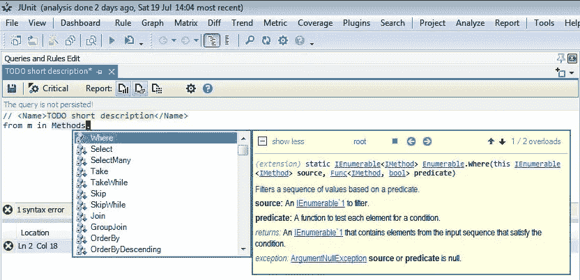
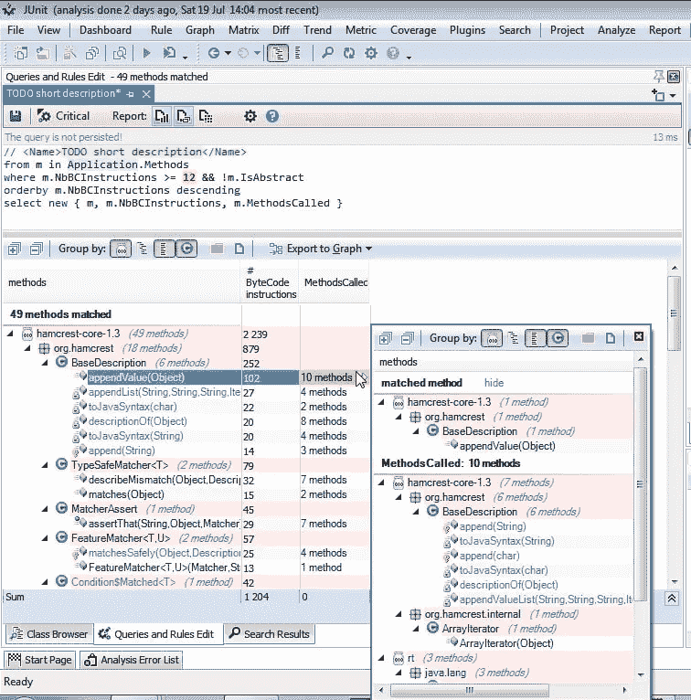
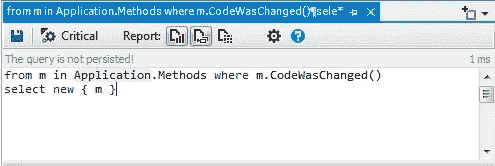
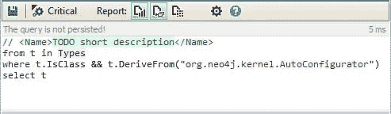
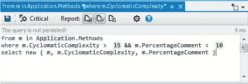
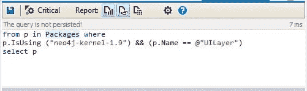

# 设计和实现 Java 类的 10 个最佳实践

> 原文：<https://medium.com/javarevisited/10-best-practices-to-design-and-implement-a-java-class-489f72a7099a?source=collection_archive---------1----------------------->

为了让您的代码易于理解和维护，最好通过遵循最佳实践来加强其代码质量。他给出了一些设计和实现 java 类的最佳实践:

# 1-使用按特性打包的方法模块化您的代码

逐个特性包使用包来反映特性集。它将与单个特性相关的所有项目(且仅与该特性相关)放入单个名称空间中。这导致名称空间具有高内聚和高模块化，并且名称空间之间的耦合最小。紧密配合的项目会并排放置。

# 2-抽象

数据抽象是 Java 中面向对象编程最基本和最重要的特性之一。抽象意味着只显示必要的信息，隐藏细节。数据抽象是指只向外界提供关于数据的基本信息，隐藏背景细节或实现。
即使这个最佳实践被许多书籍、网络资源、会议演讲者、专家推荐。然而，在许多项目中，这条规则被忽略，我们可以有许多类细节不隐藏。

# 3-小班更好

具有多行代码的类型应该分成一组更小的类型。
要重构一个大类，你需要耐心，甚至可能需要从头开始重建一切。以下是一些重构建议:
大类中的逻辑必须拆分成更小的类。这些较小的类最终可以成为嵌套在原始 God 类中的私有类，其实例对象由较小嵌套类的实例组成。
较小的类划分应该由大类处理的多重职责驱动。为了识别这些职责，寻找与字段子集强耦合的方法子集通常是有帮助的。
如果大类包含的逻辑比状态多得多，一个好的选择是定义一个或几个不包含静态字段而只包含纯静态方法的静态类。纯静态方法是一个只从输入参数计算结果的函数，它不读取也不分配任何静态或实例字段。纯静态方法的主要优点是它们易于测试。
首先尽量保持大类的接口，将调用委托给新提取的类。大课最终应该是一个纯粹的门面，没有自己的逻辑。然后你可以为了方便而保留它，或者扔掉它，只开始使用新的类。单元测试会有所帮助:在提取方法之前为每个方法编写测试，以确保不会破坏功能。

# 4-尽可能减少每个类的方法

超过 20 个方法的类型可能很难理解和维护。一个类型有许多方法可能是实现了太多职责的征兆。
也许你正面临着一个控制着系统中太多其他类的类，它已经超出了所有逻辑，成为了无所不能的类。

# 5-强制低耦合

低耦合是可取的，因为应用程序的一个方面的变化在整个应用程序中需要较少的变化。从长远来看，这可以减少与修改应用程序和向应用程序添加新功能相关的大量时间、精力和成本。
低耦合可以通过使用抽象类或者使用泛型类型和方法来实现。

# 6-增强凝聚力

单一责任原则规定一个类不应该有一个以上的改变理由。这样的类被称为内聚类。高 LCOM 值通常指出一个内聚性差的类。有几个 LCOM 指标。LCOM 的取值范围为[0–1]。LCOM 房协(房协代表恒基兆业卖方)的取值范围为[0–2]。高于 1 的 LCOM HS 值应被视为警报。下面是计算 LCOM 度量的方法:
LCOM = 1—(sum(MF)/M * F)
LCOM HS =(M—sum(MF)/F)(M-1)
其中:
M 是类中方法的数量(静态方法和实例方法都计算在内，还包括构造函数、属性获取器/设置器、事件添加/移除方法)。F 是类中实例字段的数量。
MF 是访问特定实例字段的类的方法的数量。Sum(MF)是该类的所有实例字段的 MF 之和。

这些公式背后基本思想可以陈述如下:如果一个类的所有方法都使用它的所有方法，使用它的所有实例字段，则该类是完全内聚的，这意味着 sum(MF)=M*F，然后 LCOM = 0，LCOMHS = 0。
LCOMHS 值高于 1 应视为报警。

# 7-只注释代码不能说明的内容

重复代码的评论对读者没有任何额外的帮助。代码库中嘈杂的注释和不正确的注释的流行鼓励程序员忽略所有的注释，要么跳过它们，要么采取积极的措施隐藏它们。

# 8-尽可能不要重复自己

众所周知，重复代码的存在对软件开发和维护有负面影响。实际上，一个主要的缺点是，当重复代码的一个实例为了修复错误或添加新特性而被改变时，它的对应代码必须同时被改变。重复代码最常见的原因是复制/粘贴操作，在这种情况下，源代码在两个或更多地方完全相似，这种做法在许多文章、书籍和网站中都不被提倡。然而，有时实践这些建议并不容易，开发人员选择了简单的解决方案:复制/粘贴方法。
使用适当的工具可以轻松检测复制/粘贴操作中的重复代码，但是，在某些情况下，克隆代码的检测并非易事。

# 9-不变性是多线程编程的好朋友。

基本上，一旦对象被创建，如果它的状态没有改变，那么它就是不可变的。因此，如果一个类的实例是不可变的，那么这个类就是不可变的。
支持使用不可变对象的一个重要理由是:它极大地简化了并发编程。想一想，为什么编写合适的多线程编程是一项艰巨的任务？因为很难同步线程对资源(对象或其他 OS 资源)的访问。为什么很难同步这些访问？因为很难保证多线程对多个对象进行的多次写访问和读访问之间不会出现争用情况。如果没有更多的写访问呢？换句话说，如果线程访问的对象的状态不变，那会怎样？再也不需要同步了！
不可变类的另一个好处是它们永远不会违反 LSP(lis kov subtution Principle ),下面是引用自其 wiki 页面的 LSP 定义:

Liskov 的行为子类型的概念定义了可变对象的可替代性的概念；也就是说，如果 S 是 T 的子类型，那么程序中 T 类型的对象可以用 S 类型的对象替换，而不改变该程序的任何期望的属性(例如，正确性)。

# 10-尽可能使用标准库

在 Java 世界中，我们可以为每种技术需求找到数百个特定需求的库。然而，最好花点时间检查 Java 标准库中是否还没有这种需求，与许多外部库的高度耦合可能会迅速增加项目的复杂性和支持。

# 如何加强对这些最佳实践的检查？

[jarchitec](https://www.jarchitect.com/)提供了一个名为 [CQLinq](https://www.jarchitect.com/Doc_CQLinq_Syntax) 的代码查询语言，像数据库一样查询代码库。开发人员、设计人员和架构师可以定义他们的自定义查询来轻松找到容易出现错误的情况。
使用 CQlinq，我们可以将来自代码度量、依赖性、API 使用和其他模型数据的数据结合起来，定义非常高级的查询，以匹配一些容易出现错误的情况。

编写 CQLinq 查询和约束非常简单，因为 JArchitect 提供了一个 CQLinq 编辑器，它支持:

代码完成/智能感知，
实时编译错误描述，
集成工具提示文档。

此外，一旦查询被编译，它会立即执行，其结果会很好地显示和浏览:

可以用 CQLinq 编写强大而复杂的查询和规则，例如:

可以编写(甚至生成)简短的 CQLinq 查询来获得关于代码库问题的一些即时答案:

代码分层正确吗？

自上一版本以来，哪些方法被重构了？

哪些类继承了特定的类？

最复杂的 10 种方法是什么？

哪些方法分配特定的字段？

哪个复杂的方法不够注释？

我不希望我的用户界面层直接依赖于数据库层:

